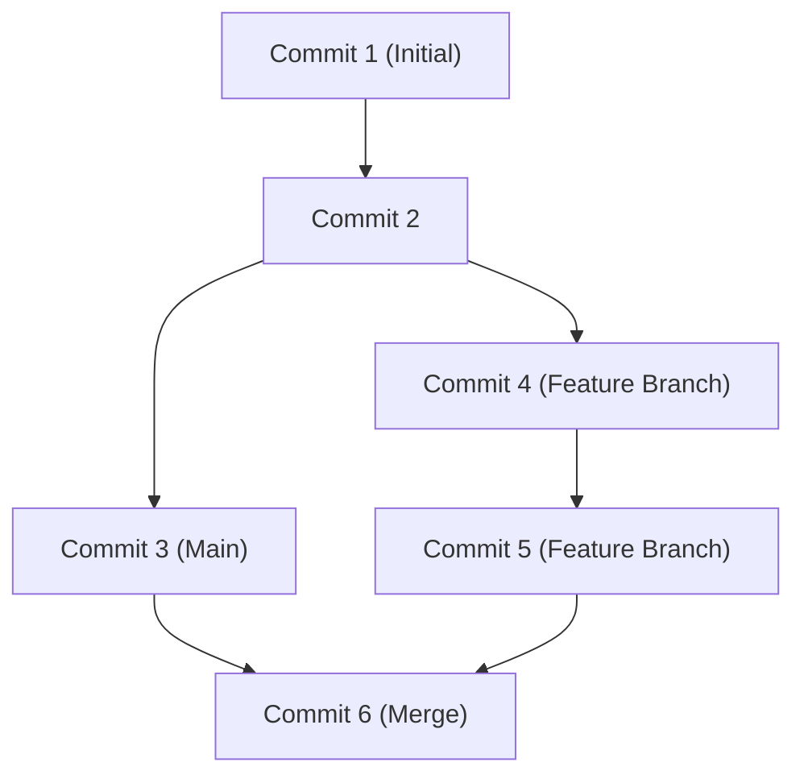

## 1. 簡介：GitHub帶來的開發典範轉移

在現代軟體開發中，談論開發就不可能不提到GitHub與Git的存在。過去，開發者們依賴Subversion (SVN)或CVS等集中式版本控制系統。然而，由Linux核心的創造者Linus Torvalds所開發的Git，透過分散式這個全新的方法，建構了一個讓全世界的開發者能同時且安全地修改程式碼的環境。

這篇文章將從Git根本的設計理念出發，深入探討GitHub為開源帶來的Pull Request革命，以及活用GitHub Actions的最新CI/CD（持續整合/持續部署）技術。

## 2. Linus Torvalds的Git設計理念：基於快照的提交圖

傳統的版本控制系統記錄的是「差異（Delta）」。也就是說，它們只累積檔案如何被修改的差異資訊。然而，Git的方法有著根本上的不同。

Git將資料視為「快照的串流」。每次進行提交時，Git會像拍照一樣記錄當下所有檔案的狀態（快照），並儲存指向該快照的參照。對於未修改的檔案，它不會重新儲存，而是僅保留連結到先前相同檔案的指標。

這種基於快照的方法，使得建立和切換分支能瞬間完成。在Git的內部，提交（Commit）被當作一個單純的物件圖（DAG：有向無環圖）來管理。



## 3. 分支策略：Git Flow 與 GitHub Flow

在分散式開發中，團隊如何管理分支決定了專案的成敗。讓我們來看看兩個具代表性的策略。

### Git Flow
Git Flow是由Vincent Driessen提出的嚴格分支模型。
- `main` (或 `master`)：隨時可發佈的正式環境程式碼。
- `develop`：為了下次發佈的開發分支。
- `feature/*`：用於新功能開發。
- `release/*`：用於發佈準備。
- `hotfix/*`：用於正式環境的緊急Bug修復。

這個模型非常適合具有定期發佈週期的大型專案。

### GitHub Flow
另一方面，GitHub Flow較為簡單，並以持續部署為前提。
- 隨時可部署的 `main` 分支。
- 所有的工作都在從 `main` 衍生出來的功能分支上進行。
- 在本機提交，並定期推播到伺服器。
- 準備就緒後建立Pull Request，並接受審查。
- 審查通過後合併到 `main`，並立即進行部署。

對於像Web應用程式或SaaS這樣，一天進行多次發佈的敏捷團隊來說非常合適。

## 4. Fork與Pull Request：開源開發的革命

GitHub成為世界最大開發者平台的最大原因，在於它精煉了「Fork」和「Pull Request」的概念。

傳統上，要為開源專案做出貢獻，必須將修補程式（Patch）發送到郵件論壇。這門檻很高，且審查流程繁雜。

在GitHub上，只要按一個按鈕就可以將他人的儲存庫複製（Fork）到自己的帳號中。在那裡可以自由地修改程式碼，並向原始儲存庫發送「請合併我的修改」的請求（Pull Request）。這使得任何人都能輕鬆地為專案做出貢獻，引發了OSS（開源軟體）爆發性的發展。

## 5. 透過GitHub Actions自動化CI/CD

在現代的開發中，自動化測試和部署的流程與撰寫程式碼同等重要。GitHub Actions是一個整合在GitHub平台中的強大自動化工具。

只要用YAML檔案定義工作流程，就能將對儲存庫的任何事件（Push、建立Pull Request、推播Tag等）作為觸發條件，自動執行測試、建置，以及部署到伺服器。

```yaml
name: CI/CD Pipeline

on:
  push:
    branches:
      - main
  pull_request:
    branches:
      - main

jobs:
  build-and-test:
    runs-on: ubuntu-latest
    steps:
      - name: Checkout Code
        uses: actions/checkout@v3
      - name: Setup Node.js
        uses: actions/setup-node@v3
        with:
          node-version: '18'
      - name: Install Dependencies
        run: npm ci
      - name: Run Tests
        run: npm test
```

這種自動化，使得「持續整合（自動進行程式碼整合與測試）」和「持續部署（自動進行到正式環境的發佈）」的循環能快速運轉，戲劇性地提升了軟體的品質與開發速度。

## 6. 總結：協作的未來

GitHub不單單只是存放程式碼的倉庫。它是讓全世界的開發者分享知識、合作開發軟體的社群網路與基礎設施。透過精通Git穩健的版本控制、GitHub完善的協作功能，以及Actions的自動化，我們能夠更快地將更優秀的軟體傳遞給這個世界。
