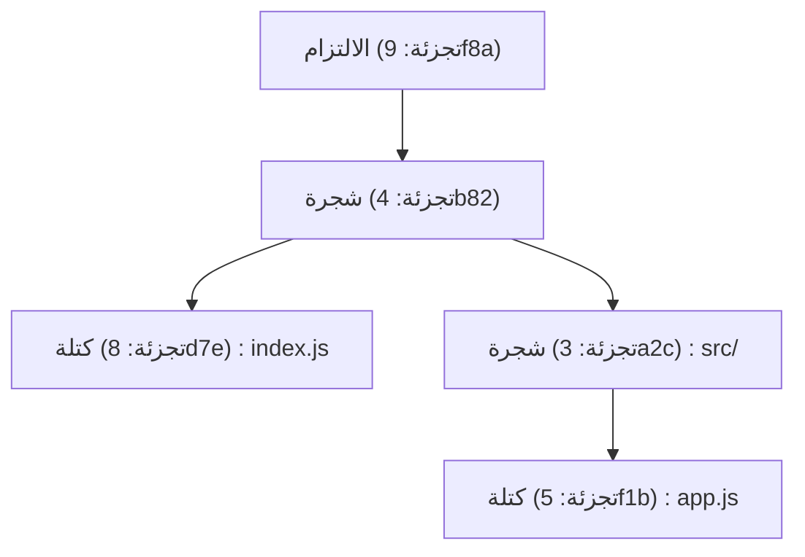
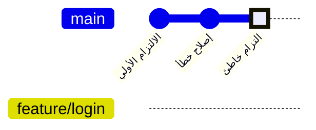
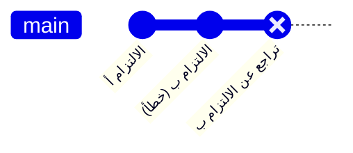
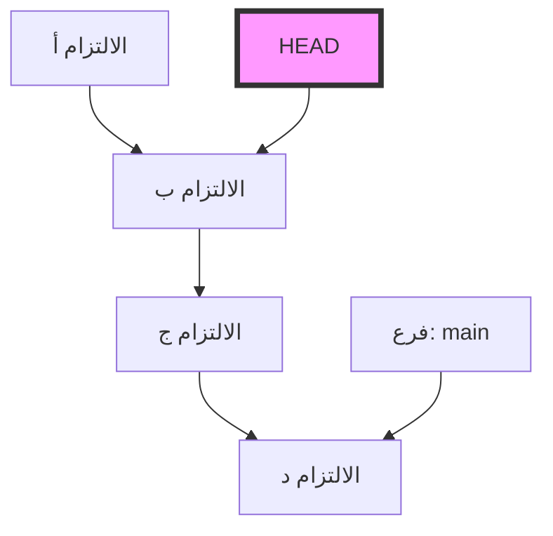
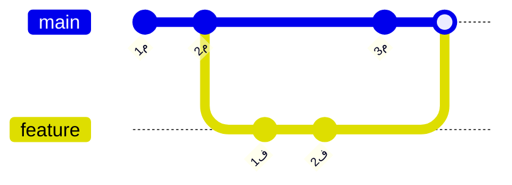

# أخطاء شائعة يقع فيها المبتدئون في Git وأوامر حلها (مثل حل النزاعات)

## 1. مقدمة: لماذا نرتكب الأخطاء في Git؟

في تطوير البرمجيات، أصبح Git ضروريًا كالهواء والماء. ومع ذلك، بالنسبة للعديد من المبتدئين (وأحياناً حتى المحترفين)، يمكن أن يبدو Git كـ "صندوق سحري أسود مخيف". تختفي الالتزامات (commits)، أو يتم دفع الكثير من التغييرات عن طريق الخطأ إلى الفرع الخاطئ، أو تمتلئ الشاشة برسائل أخطاء حول النزاعات (conflicts) لم تراها من قبل... عندما تقع في "فخاخ Git" هذه، يتوقف تقدم العمل تمامًا، وقد ينتابك الخوف من تدمير الكود المصدري في أسوأ الحالات.

لماذا يُعتبر Git بهذا الصعوبة ولماذا هو عرضة للتسبب في الأخطاء؟ السبب الأكبر هو "استخدام الأوامر السطحية عن طريق الحفظ دون فهم ما يحدث داخل Git". يعتمد Git على فلسفة تصميم قوية كنظام للتحكم في الإصدارات الموزعة (DVCS)، لكن واجهته (CLI) ليست بديهية دائمًا.

في هذه المقالة، سنصنف العديد من "الأخطاء الشائعة" التي يواجهها مبتدئو Git في بيئة العمل إلى حالات، وسنقدم الأوامر المحددة لحل كل منها. ولكنها لن تكون مجرد قائمة أوامر (ورقة غش). سنتعمق بشكل مكثف بأكثر من 10,000 حرف لشرح "لماذا يحدث هذا الخطأ" و"كيف تتحرك البيانات داخل Git عند تنفيذ هذا الأمر"، مع شرح هيكل مجلد `.git`، والخلفية الرياضية لخوارزمية Diff التي تعمل خلف الكواليس، ورسومات توضيحية باستخدام Mermaid.

عندما تنتهي من قراءة هذه المقالة، يجب أن تتحرر من شعور "الخوف من Git"، وبدلاً من ذلك ستتأكد أنه "لا يوجد شريك موثوق به مثل Git". والآن، لنتعمق في عالم Git العميق.

---

## 2. أعماق Git: فهم الهيكل الداخلي لمجلد `.git`

الخطوة الأولى لتسهيل استكشاف العديد من الأخطاء وإصلاحها هي معرفة كيف يقوم Git بتخزين البيانات. المجلد المخفي `.git` الموجود في الدليل الجذري لمشروعك هو قلب Git. لا يقوم Git بإدارة البيانات كمجرد تسجيل للاختلافات (patches) في الملفات بالتتابع، بل كـ **تدفق من اللقطات (snapshots)**.

### 2.1 نموذج الكائنات: Blob، Tree، Commit

يستخدم Git بشكل رئيسي ثلاثة كائنات لتمثيل حالة المستودع. يتم تخزين هذه الكائنات في `.git/objects`.

1. **Blob (Binary Large Object)**
   كائن يخزن محتوى الملف نفسه. لا يتضمن اسم الملف أو معلومات الأذونات هنا. يتم ضغط سلسلة البايتات الصافية بواسطة zlib، ويتم التعرف عليها بواسطة قيمة تجزئة SHA-1 (رقم سداسي عشري من 40 حرفًا).
2. **Tree**
   كائن يمثل هيكل الدليل. يتضمن كائن Tree مؤشرات (قيم تجزئة SHA-1) لكائنات Tree أخرى (أدلة فرعية) وكائنات Blob (ملفات)، بالإضافة إلى أسماء الملفات وأذونات الوصول الخاصة بها. يلعب دورًا مشابهًا لدليل UNIX.
3. **Commit**
   يحتفظ بمؤشر لكائن Tree من المستوى الأعلى للمستودع بأكمله في نقطة زمنية معينة، وبيانات وصفية (المؤلف، تاريخ ووقت الالتزام، رسالة الالتزام)، ومؤشر للالتزام السابق (الالتزام الأصل).



### 2.2 حقيقة HEAD والمراجع (Refs)

الكلمة `HEAD` التي تراها كثيرًا عند العمل مع Git. هي **مرجع رمزي (Symbolic Reference)** يشير إلى الفرع (أو الالتزام) الذي قمت بجلبه (checkout) حاليًا.
إذا فتحت الملف `.git/HEAD` في محرر نصوص، فسترى سلسلة نصية مثل هذه.

```text
ref: refs/heads/main
```

هذا يعني أن "الحالة الحالية هي عند نهاية الفرع `main`". وإذا فتحت `.git/refs/heads/main`، ستجد قيمة تجزئة SHA-1 مكونة من 40 حرفًا مكتوبة هناك، وهذا يشير إلى أحدث كائن Commit.
فرع Git هو ببساطة مؤشر خفيف (ملف) يشير إلى التزام معين. مجرد معرفة هذه الحقيقة يزيل الخوف من "هل سيتم حذف كل الملفات إذا قمت بحذف فرع؟".

---

## 3. فهم Git من خلال الرياضيات: خوارزمية Diff ودالة التجزئة

عندما يكتشف Git تعارضًا أو يعرض الاختلافات بين الملفات، تعمل خوارزميات متقدمة داخليًا.

### 3.1 خوارزمية Diff لمايرز

خوارزمية الكشف عن الفروق الافتراضية في Git هي خوارزمية ابتكرها Eugene W. Myers. عندما يكون لدينا ملفان نصيان $A$ و $B$، فإن مسألة العثور على "الحد الأدنى من خطوات التحرير (الإدراج والحذف)" لتحويل $A$ إلى $B$ يمكن نمذجتها كمسألة أقصر مسار في نظرية الرسوم البيانية.

لنفترض أن طولي السلسلتين هما $N, M$ على التوالي، والمجموع هو $V = N + M$. في خوارزمية مايرز، نبحث عن مسافة التحرير (Edit Distance) $D$. يتم التعبير عن التعقيد الزمني لهذه الخوارزمية بالمعادلة التالية:

$$ \mathcal{O}(V \cdot D) $$

هنا، إذا كان الاختلاف بين الملفات صغيرًا (أي أن $D$ صغير)، فإن الخوارزمية تعمل بسرعة عالية جدًا $\mathcal{O}(V)$. ومع ذلك، إذا كانت الملفات مختلفة تمامًا، تصبح $D \approx V$، ويكون التعقيد في أسوأ الحالات هو $\mathcal{O}(V^2)$.

### 3.2 Patience Diff و Histogram Diff

على الرغم من أن خوارزمية مايرز ممتازة، إلا أنها قد تولد اختلافات ليست بديهية (لا معنى لها) للبشر عند إعادة ترتيب تسلسل الدوال أو الفئات بشكل كبير. لحل هذه المشكلة، قام Git بتطبيق `Patience Diff` و `Histogram Diff`.

يركز Patience Diff على "الأسطر الفريدة التي تظهر مرة واحدة فقط في كلا الملفين"، ويجد أطول تسلسل فرعي مشترك (LCS) بينها. إذا كان عدد العناصر الفريدة هو $U$، يمكن حساب LCS بالتعقيد التالي:

$$ \mathcal{O}(U \log U) $$

إذا شعرت بصعوبة في حل النزاعات، فإن إحدى الطرق هي استخدام `git diff --histogram` أو تحديد هذه الخوارزمية في استراتيجية الدمج (`git merge -s recursive -X histogram`).

### 3.3 SHA-1 واحتمال التصادم

يدير Git جميع الكائنات باستخدام قيم تجزئة SHA-1. حجم فضاء التجزئة هو $2^{160}$. عند تقريب احتمال تصادم التجزئة (حيث يكون للمحتوى المختلف نفس قيمة التجزئة) باستخدام مفارقة يوم الميلاد (Birthday Paradox)، فإن عدد الكائنات $k$ المطلوب للوصول إلى احتمال تصادم $p$ بنسبة 50٪ هو كالتالي:

$$ k \approx \sqrt{2 \ln(2)} \cdot 2^{80} \approx 1.2 \times 2^{80} $$

هذا رقم فلكي، واحتمال حدوث تصادم غير مقصود في تطوير البرمجيات العادي هو صفر عمليًا. لذلك، يعمل Git بثقة على أساس أن قيمة التجزئة هي "معرف فريد مطلق".

---

## 4. دراسة حالة 1: قمت بالالتزام في فرع خاطئ!

**[الموقف]**
دون أن تدرك أنك تعمل في فرع `main`، كتبت الكود للميزة الجديدة بحماس، وقمت بتنفيذ `git commit`. كان يجب أن تنشئ فرعًا باسم `feature/login` وتعمل هناك!

### الحل: `git reset` وإنشاء فرع

في Git، الالتزام هو كائن مستقل، والفرع مجرد مؤشر. لذلك، يمكن حله فورًا من خلال عملية "إنشاء فرع جديد ثم إرجاع مؤشر الفرع الحالي".

```bash
# 1. إنشاء فرع جديد يشير إلى الالتزام الحالي (الالتزام الذي قمت به عن طريق الخطأ)
$ git branch feature/login

# 2. إرجاع مؤشر فرع main إلى الالتزام السابق (HEAD~1)
# يسمح لك --keep بإعادة التعيين بأمان مع الاحتفاظ بالتغييرات غير الملتزم بها في دليل العمل.
$ git reset --keep HEAD~1

# 3. التبديل إلى الفرع الصحيح
$ git checkout feature/login
```

### التوضيح بالرسم: ماذا حدث بالداخل؟

دعونا نتصور حركة مؤشرات الفروع في هذه المرحلة باستخدام `gitGraph` في Mermaid.


في البداية، كان كل من `main` و `HEAD` يشيران إلى "التزام خاطئ"، ولكن باستخدام `git branch feature/login`، يتم إنشاء مؤشر جديد هناك. بعد ذلك، عن طريق `git reset`، يعود مؤشر `main` فقط إلى موضع "إصلاح خطأ". لم يتم حذف الكائنات نفسها على الإطلاق.

---

## 5. دراسة حالة 2: أريد التراجع عن التزام تم دفعه بالفعل!

**[الموقف]**
في منتصف الليل، قمت بالالتزام بكود مليء بالأخطاء، ودفعته إلى المستودع البعيد باستخدام `git push origin main`. أدركت أن هناك خطأً فادحًا وشعرت بالذعر.

### الحل 1: إبطال التاريخ باستخدام `git revert` (موصى به وآمن)

في تطوير الفريق، يُحظر تمامًا التلاعب بسجل الالتزامات التي تم دفعها بالفعل باستخدام `git reset` وما شابه. لأن ذلك سيتعارض مع المستودعات المحلية للمطورين الآخرين. النهج الصحيح هو **"إنشاء التزام جديد عكسي يلغي تمامًا التغييرات في الالتزام الخاطئ"**. هذا هو `git revert`.

```bash
# إنشاء التزام يلغي أحدث التزام
$ git revert HEAD
[main 7f3a8b2] Revert "رسالة الالتزام الخاطئ"
 1 file changed, 1 insertion(+), 10 deletions(-)

# الدفع إلى المستودع البعيد
$ git push origin main
```


يستمر التاريخ في التقدم، وحالة الكود فقط هي التي تعود إلى ما كانت عليه.

### الحل 2: التلاعب بالتاريخ باستخدام `git push --force-with-lease`

إذا قمت بالدفع للتو إلى فرع تستخدمه أنت فقط، فمن المقبول إعادة كتابة التاريخ.

```bash
# إعادة التعيين محليًا وتصحيح الالتزام
$ git reset --hard HEAD~1
$ git add .
$ git commit -m "Correct implementation"

# الكتابة فوق التاريخ البعيد إجباريا
$ git push origin feature/login --force-with-lease
```
`--force-with-lease` هو دفع إجباري آمن لمنع حوادث الكتابة فوق عمل الآخرين عن طريق الخطأ.

---

## 6. دراسة حالة 3: أريد التبديل إلى فرع آخر في منتصف العمل (سحر Stash)

**[الموقف]**
أثناء تنفيذ ميزة جديدة في الفرع `feature/A`، كان الكود المصدري في حالة غير مكتملة ولم يتم تجميعه بعد (compile). فجأة، يطلب منك مديرك إصلاح خلل طارئ في بيئة الإنتاج على الفرع `main` فورًا!

### الحل: الإخفاء باستخدام `git stash`

`git stash` هو أمر يقوم بإخفاء التغييرات غير الملتزم بها مؤقتًا في منطقة التخزين المؤقت.

```bash
# 1. إخفاء التغييرات قيد التقدم
$ git stash push -m "WIP: feature A partially implemented"

# 2. السماح بالتبديل إلى فرع main
$ git checkout main
# ... (تنفيذ عمل إصلاح الخلل الطارئ، الالتزام، والدفع) ...

# 3. العودة إلى الفرع الأصلي بعد الانتهاء من العمل
$ git checkout feature/A

# 4. استعادة التغييرات المخفاة
$ git stash pop
```

عند تنفيذ `git stash`، يقوم Git بإنشاء كائني Commit خاصين داخليًا ويحفظهما في مرجع يسمى `refs/stash`. بمعنى آخر، الاستخفاء (Stash) هو في النهاية "التزام مؤقت بلا اسم".

---

## 7. دراسة حالة 4: حالة "الرأس المنفصل" (Detached HEAD) المرعبة

**[الموقف]**
أردت التحقق من الكود في نقطة زمنية معينة في الماضي فنفذت `git checkout 9f8a7b6`. فظهرت رسالة `You are in 'detached HEAD' state.`. قمت بالالتزام على هذه الحالة، لكن عندما قمت بالتبديل إلى فرع آخر اختفى الالتزام!

### آلية الرأس المنفصل (Detached HEAD)

عادةً يشير `HEAD` إلى فرع مثل `refs/heads/main`. ومع ذلك، عند جلب (checkout) التزام معين مباشرةً، سيشير `HEAD` مباشرة إلى كائن الالتزام. يسمى هذا **الرأس المنفصل (Detached HEAD)**.


حتى لو قمت بالالتزام مرارًا وتكرارًا في هذه الحالة، فلن يقوم أي فرع بتتبع هذا الالتزام الجديد. بمجرد التبديل إلى فرع آخر، سيضيع الالتزام الجديد.

### الحل: حفظه كفرع جديد

يمكن حل ذلك عن طريق إنشاء فرع جديد في مكانك الحالي.

```bash
# أنشئ فرعًا جديدًا في موقع HEAD الحالي وبدّل إليه
$ git checkout -b feature/recovered-work
```

---

## 8. دراسة حالة 5: حل النزاعات أثناء الدمج وإعادة التعيين

**[الموقف]**
عندما نفذت `git merge` أو `git rebase`، ظهرت رسالة `CONFLICT (content)` وتم إيقاف العملية.

### الفرق بين الدمج (Merge) وإعادة التعيين (Rebase)

1. **الدمج (Merge)**
   يقوم بدمج ثلاثي (3-way merge) باستخدام أحدث الالتزامات لفرعين مع الجد المشترك، وينشئ التزام دمج (merge commit).
2. **إعادة التعيين (Rebase)**
   يحفظ التزامات الفرع الحالي مؤقتًا ويطبقها مرة أخرى على رأس الهدف. يصبح التاريخ خطًا مستقيمًا.



### كيفية حل النزاعات

يتم إدراج العلامات التالية في الملف الذي حدث فيه النزاع.

```javascript
<<<<<<< HEAD
const apiUrl = "https://api.production.example.com";
=======
const apiUrl = "https://api.staging.example.com";
>>>>>>> feature/new-api
```

إجراءات الحل بسيطة للغاية.

1. **حذف العلامات وتصحيح الكود ليكون بالشكل الصحيح.**
   ```javascript
   const apiUrl = process.env.NODE_ENV === 'production' 
       ? "https://api.production.example.com" 
       : "https://api.staging.example.com";
   ```
2. **إضافة الملف الذي تم حله إلى منطقة التجهيز (staging).**
   أمر `git add` له دور "إخبار Git بأن النزاع قد تم حله".
   ```bash
   $ git add index.js
   ```
3. **إكمال العملية.**
   ```bash
   # في حالة الدمج
   $ git commit -m "Resolve merge conflict in index.js"
   
   # في حالة إعادة التعيين
   $ git rebase --continue
   ```

إذا شعرت بالذعر، يمكنك إلغاء العملية في أي وقت باستخدام `$ git merge --abort` أو `$ git rebase --abort`.

---

## 9. دراسة حالة 6: سجل الالتزامات فوضوي! `git rebase -i`

**[الموقف]**
حدثت الكثير من الالتزامات الصغيرة مثل "إصلاح خطأ مطبعي"، "تعديل إضافي"، "إضافة اختبار". إذا قمت بالدمج إلى `main` هكذا، سيكون السجل فوضويًا.

### الحل: إعادة التعيين التفاعلي

باستخدام `git rebase -i` (تفاعلي)، يمكنك تغيير ترتيب الالتزامات السابقة، أو دمج التزامات متعددة في واحد (squash)، أو تعديل رسالة الالتزام.

```bash
# تنظيم آخر 3 التزامات
$ git rebase -i HEAD~3
```
يفتح المحرر ويتم عرض ما يلي.
```text
pick 1a2b3c4 إصلاح خطأ مطبعي
pick 2b3c4d5 تعديل إضافي
pick 3c4d5e6 إضافة اختبار
```
أعد كتابتها كالتالي.
```text
pick 1a2b3c4 تنفيذ الميزة X
squash 2b3c4d5 تعديل إضافي
squash 3c4d5e6 إضافة اختبار
```
عندما تحفظ وتغلق، ستندمج هذه الالتزامات الثلاثة بشكل جميل في التزام واحد.

---

## 10. دراسة حالة 7: لا أعرف متى حدث الخطأ! `git bisect`

**[الموقف]**
الفرع الحالي `main` يحتوي على خلل، لكن عند الإصدار قبل شهر كان يعمل بشكل جيد. أريد تحديد الالتزام الذي أدخل الخلل، ولكن هناك أكثر من 100 التزام ومن المستحيل القيام بذلك يدويًا!

### الحل: تحديد الخلل باستخدام البحث الثنائي

يحتوي Git على أداة مدمجة للعثور على الالتزام الذي يحتوي على الخلل باستخدام البحث الثنائي (Binary Search) الرياضي. التعقيد هو $\mathcal{O}(\log N)$، لذلك حتى لو كان هناك 1000 التزام، يمكن تحديد الخلل بحوالي 10 اختبارات.

```bash
# بدء البحث
$ git bisect start

# الالتزام الحالي يحتوي على خلل (bad)
$ git bisect bad

# قبل شهر (على سبيل المثال التجزئة a1b2c3d) كان جيدًا (good)
$ git bisect good a1b2c3d

# سيقوم Git تلقائيًا بجلب التزام وسيط، لذا قم بتشغيل الاختبار
# إذا نجح الاختبار:
$ git bisect good
# إذا فشل الاختبار:
$ git bisect bad
```
بتكرار ذلك، سيخبرك Git بدقة "هذا هو أول التزام سيء". عند الانتهاء، ارجع إلى الحالة الأصلية باستخدام `$ git bisect reset`.

---

## 11. شبكة الأمان القصوى: `git reflog`

السر النهائي لأي "خطأ" في Git هو `git reflog`. يسجل Git جميع عملياتك المحلية (تاريخ حركة HEAD) لفترة معينة. حتى إذا قمت بحذف فرع أو إعادة تعيين خاطئة، يمكنك العثور على التجزئة السابقة باستخدام `git reflog`، واستردادها ببساطة عن طريق استخدام `git reset --hard` إلى تلك النقطة.

```bash
$ git reflog
9f8a7b6 (HEAD -> main) HEAD@{0}: commit: Add new feature
1a2b3c4 HEAD@{1}: reset: moving to HEAD~1
```

## 12. الخاتمة

لقد شرحنا بالتفصيل الأخطاء التي يسهل على مبتدئي Git الوقوع فيها، والآليات الكامنة وراءها في Git، وكيفية حلها. الالتزام في الفرع الخطأ، التراجع عن الالتزامات المدفوعة، استخدام Stash، النجاة من Detached HEAD، وحل النزاعات. المهم في كل هذا هو "تخيل كيف يتلاعب Git بالكائنات والمؤشرات خلف الكواليس".

تُحسب الفروق بين الملفات بخوارزمية Diff صارمة يمكن التعبير عنها رياضيًا، وتُضمن سلامة التاريخ بواسطة دوال التجزئة المشفرة. إذا فهمت فلسفة التصميم الجميلة هذه، ستدرك أن Git ليس أبدًا "صندوقًا أسود غامضًا"، بل هو أقوى درع يحمي كود المصدر الخاص بك بقوة.

في المرة القادمة التي تعتقد فيها "لقد أفسدت الأمر!"، لا تقم بإغلاق الطرفية (terminal) في حالة من الذعر، بل خذ نفسًا عميقًا واكتب `git status`. سيقدم لك Git بالتأكيد تلميحات لاستعادة عملك.
