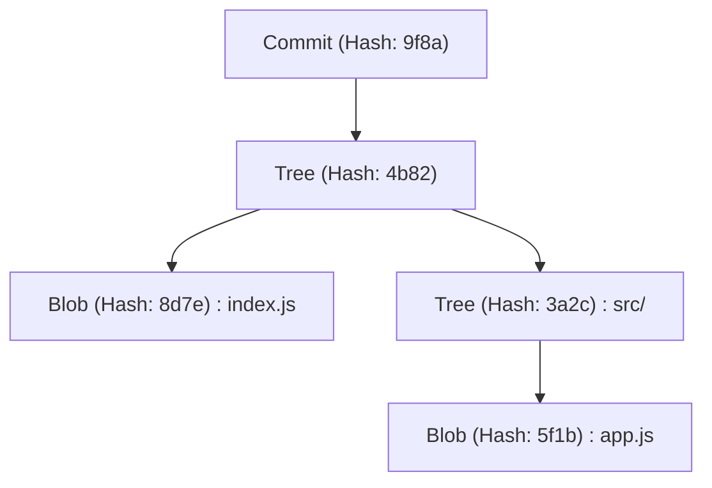
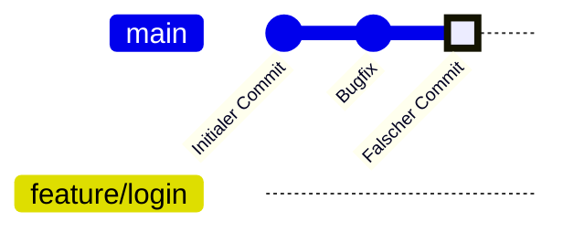
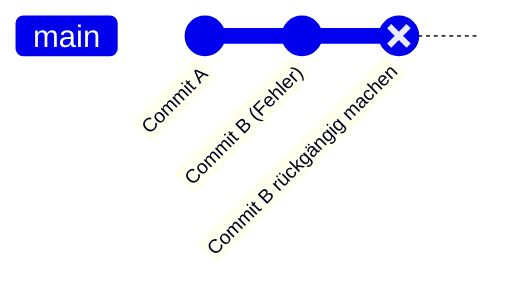
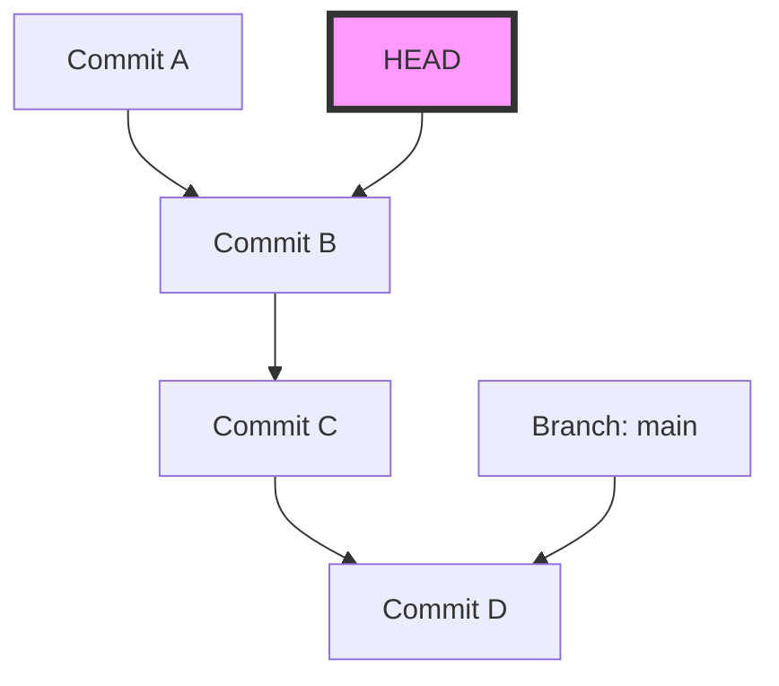
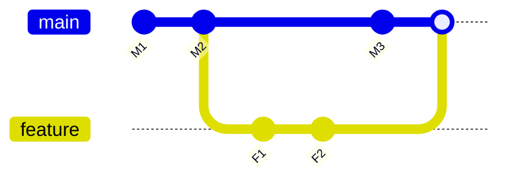

# Häufige Fehler von Git-Anfängern und eine Sammlung von Lösungsbefehlen (Konfliktlösung etc.)

## 1. Einführung: Warum machen wir Fehler in Git?

In der Softwareentwicklung ist Git so unverzichtbar geworden wie Luft oder Wasser. Für viele Anfänger (und manchmal sogar für erfahrene Entwickler) kann sich Git jedoch wie eine „furchteinflößende, magische Blackbox“ anfühlen. Commits verschwinden, eine große Menge an Änderungen wird versehentlich in den falschen Branch gepusht, oder bisher unbekannte Fehlermeldungen bei Konflikten überschwemmen den Bildschirm... Wenn man in solche „Git-Fallen“ tappt, kommt der Arbeitsfortschritt oft komplett zum Erliegen, und im schlimmsten Fall fürchtet man, den Quellcode zu zerstören.

Warum ist Git so schwierig und fehleranfällig? Der Hauptgrund dafür ist: „Man lernt nur oberflächliche Befehle auswendig und wendet sie an, ohne zu verstehen, was im Inneren von Git passiert.“ Git basiert auf einer robusten Designphilosophie als verteiltes Versionskontrollsystem (DVCS), aber seine Benutzeroberfläche (CLI) ist nicht immer intuitiv.

Dieser Artikel kategorisiert zahlreiche „Missgeschicke (häufige Fehler)“, auf die Git-Anfänger in der Praxis häufig stoßen, und präsentiert konkrete Lösungsbefehle für jeden Fall. Es wird jedoch nicht nur eine einfache Liste von Befehlen (Cheat Sheet). Wir werden tiefgründig erklären, „warum der Fehler auftritt“ und „wie sich die Daten innerhalb von Git bewegen, wenn man diesen Befehl ausführt“, einschließlich der internen Struktur des `.git`-Verzeichnisses, des mathematischen Hintergrunds des dahinter arbeitenden Diff-Algorithmus sowie Mermaid-Diagrammen, auf mehr als 10.000 Zeichen.

Wenn Sie diesen Artikel bis zum Ende gelesen haben, sollten Sie von der Angst vor Git befreit sein und stattdessen davon überzeugt sein, dass „es keinen zuverlässigeren Partner als Git gibt“. Lassen Sie uns also in die tiefe Welt von Git eintauchen.

---

## 2. Der Abgrund von Git: Die interne Struktur des `.git`-Verzeichnisses verstehen

Der erste Schritt zur Erleichterung vieler Fehlerbehebungen besteht darin, zu verstehen, wie Git Daten speichert. Der versteckte Ordner `.git` im Stammverzeichnis Ihres Projekts ist das Herzstück von Git. Git ist kein System, das einfach Dateidifferenzen (Patches) der Reihe nach aufzeichnet, sondern verwaltet die Daten als einen **Stream von Snapshots**.

### 2.1 Das Objektmodell: Blob, Tree, Commit

Git verwendet hauptsächlich drei Objekte, um den Status des Repositorys darzustellen. Diese Objekte werden in `.git/objects` gespeichert.

1. **Blob (Binary Large Object)**
   Dieses Objekt speichert den eigentlichen Inhalt der Datei. Informationen wie Dateinamen oder Berechtigungen sind hier nicht enthalten. Reine Bytefolgen werden mit zlib komprimiert und durch einen SHA-1-Hashwert (40-stellige hexadezimale Zahl) identifiziert.
2. **Tree**
   Dieses Objekt stellt die Verzeichnisstruktur dar. Ein Tree-Objekt enthält Zeiger (SHA-1-Hashwerte) auf andere Tree-Objekte (Unterverzeichnisse) oder Blob-Objekte (Dateien) sowie deren Dateinamen und Zugriffsrechte. Es fungiert ähnlich wie ein UNIX-Verzeichnis.
3. **Commit**
   Dies enthält einen Zeiger auf das oberste Tree-Objekt des gesamten Repositorys zu einem bestimmten Zeitpunkt, zusammen mit Metadaten (Autor, Commit-Datum, Commit-Nachricht) sowie einem Zeiger auf den vorherigen Commit (Eltern-Commit).



### 2.2 Die wahre Identität von HEAD und Referenzen (Refs)

Das Wort `HEAD`, das man bei der Arbeit mit Git häufig sieht, ist eine **symbolische Referenz (Symbolic Reference)**, die auf den aktuell ausgecheckten Branch (oder Commit) zeigt.
Wenn Sie die Datei `.git/HEAD` in einem Texteditor öffnen, sehen Sie eine Zeichenfolge wie diese:

```text
ref: refs/heads/main
```

Dies bedeutet: „Der aktuelle Status befindet sich an der Spitze des `main`-Branches.“ Wenn Sie dann `.git/refs/heads/main` öffnen, finden Sie dort einen 40-stelligen SHA-1-Hash, der auf das neueste Commit-Objekt zeigt.
Ein Git-Branch ist lediglich ein leichtgewichtiger Zeiger (eine Datei), der auf einen bestimmten Commit zeigt. Wenn man diese Tatsache kennt, verschwindet die Angst, dass „alle Dateien gelöscht werden, wenn ich den Branch lösche“.

---

## 3. Git durch Mathematik entschlüsseln: Diff-Algorithmen und Hash-Funktionen

Wenn Git Konflikte erkennt oder Dateiunterschiede anzeigt, laufen im Hintergrund fortschrittliche Algorithmen ab.

### 3.1 Myers Diff-Algorithmus

Der standardmäßige Diff-Algorithmus in Git wurde von Eugene W. Myers entwickelt. Wenn wir zwei Textdateien $A$ und $B$ haben, kann das Problem, die „minimale Folge von Bearbeitungsschritten (Einfügungen und Löschungen)“ zu finden, um $A$ in $B$ umzuwandeln, als Problem des kürzesten Pfades in der Graphentheorie modelliert werden.

Seien die Längen der Zeichenfolgen $N$ bzw. $M$, und die Summe $V = N + M$. Der Myers-Algorithmus sucht nach der Bearbeitungsdistanz (Edit Distance) $D$. Die Zeitkomplexität dieses Algorithmus wird durch folgende Formel ausgedrückt:

$$ \mathcal{O}(V \cdot D) $$

Wenn die Differenz zwischen den Dateien klein ist (d. h. $D$ klein ist), arbeitet der Algorithmus sehr schnell mit $\mathcal{O}(V)$. Wenn die Dateien jedoch völlig unterschiedlich sind, gilt $D \approx V$, und die Worst-Case-Zeitkomplexität beträgt $\mathcal{O}(V^2)$.

### 3.2 Patience Diff und Histogram Diff

Obwohl der Myers-Algorithmus hervorragend ist, kann er Unterschiede generieren, die für Menschen nicht intuitiv (sinnlos) sind, z. B. wenn die Reihenfolge von Funktionen oder Klassen stark geändert wird. Um dieses Problem zu lösen, implementiert Git `Patience Diff` und `Histogram Diff`.

Patience Diff konzentriert sich auf „eindeutige Zeilen, die in beiden Dateien genau einmal vorkommen“ und findet deren längste gemeinsame Teilsequenz (Longest Common Subsequence: LCS). Wenn die Anzahl der eindeutigen Elemente $U$ ist, kann die Berechnung der LCS mit folgender Zeitkomplexität gelöst werden:

$$ \mathcal{O}(U \log U) $$

Wenn Sie das Gefühl haben, dass die Konfliktlösung schwierig ist, ist es eine Option, `git diff --histogram` zu verwenden oder diesen Algorithmus für die Merge-Strategie anzugeben (`git merge -s recursive -X histogram`).

### 3.3 SHA-1 und Kollisionswahrscheinlichkeit

Git verwaltet alle Objekte mit SHA-1-Hashwerten. Die Größe des Hashraums beträgt $2^{160}$. Bei einer Annäherung an die Wahrscheinlichkeit von Hash-Kollisionen (wenn unterschiedliche Inhalte denselben Hashwert haben) unter Verwendung des Geburtstagsparadoxons (Birthday Paradox) ist die Anzahl der Objekte $k$, die erforderlich ist, damit die Kollisionswahrscheinlichkeit $p$ 50% erreicht, wie folgt:

$$ k \approx \sqrt{2 \ln(2)} \cdot 2^{80} \approx 1.2 \times 2^{80} $$

Dies ist eine astronomische Zahl, und die Wahrscheinlichkeit, dass bei normaler Softwareentwicklung unbeabsichtigt eine Kollision auftritt, ist praktisch null. Daher arbeitet Git mit der Zuversicht, dass Hashwerte „absolute und eindeutige IDs“ sind.

---

## 4. Fallstudie 1: Auf den falschen Branch committet!

**[Situation]**
Sie haben nicht bemerkt, dass Sie im `main`-Branch arbeiten, haben zügig Code für eine neue Funktion geschrieben und, man glaubt es kaum, sogar `git commit` ausgeführt. Dabei sollten Sie eigentlich einen Branch namens `feature/login` erstellen und dort arbeiten!

### Lösung: `git reset` und Branch-Erstellung

In Git sind Commits unabhängige Objekte, und Branches sind nur Zeiger. Daher kann dieses Problem sofort mit der Operation „Einen neuen Branch erstellen und dann den Zeiger des aktuellen Branches zurückdrehen“ gelöst werden.

```bash
# 1. Einen neuen Branch erstellen, der auf den aktuellen Commit (den versehentlich erstellten) zeigt
$ git branch feature/login

# 2. Den Zeiger des main-Branches auf den vorherigen Commit (HEAD~1) zurücksetzen
# Die Verwendung von --keep ermöglicht ein sicheres Zurücksetzen, während die nicht committeten Änderungen im Arbeitsverzeichnis beibehalten werden.
$ git reset --keep HEAD~1

# 3. Zum richtigen Branch wechseln
$ git checkout feature/login
```

### Illustration: Was ist intern passiert?

Lassen Sie uns die Verschiebung der Branch-Zeiger in diesem Moment mit `gitGraph` von Mermaid visualisieren.


Zunächst zeigten `main` und `HEAD` auf den "Falscher Commit", aber mit `git branch feature/login` wurde dort ein neuer Zeiger erstellt. Danach springt durch `git reset` nur der `main`-Zeiger zurück auf die Position "Bugfix". Die Objekte selbst werden überhaupt nicht gelöscht.

---

## 5. Fallstudie 2: Ich möchte einen bereits gepushten Commit rückgängig machen!

**[Situation]**
In der späten Nacht haben Sie verbuggten Code committet und diesen zudem mit `git push origin main` im Remote-Repository veröffentlicht. Sie bemerken den schwerwiegenden Bug und erblassen.

### Lösung 1: Die Historie negieren mit `git revert` (Empfohlen/Sicher)

Bei der Teamentwicklung ist es strengstens verboten, die Historie von Commits, die bereits gepusht wurden, mit Befehlen wie `git reset` zu verändern. Dies führt zu Inkonsistenzen mit den lokalen Repositories anderer Entwickler. Der richtige Ansatz ist, **„einen neuen Commit zu erstellen, der die Änderungen des fehlerhaften Commits vollständig umkehrt“**. Das macht `git revert`.

```bash
# Einen Commit erstellen, der den neuesten Commit rückgängig macht
$ git revert HEAD
[main 7f3a8b2] Revert "Falsche Commit-Nachricht"
 1 file changed, 1 insertion(+), 10 deletions(-)

# Ins Remote-Repository pushen
$ git push origin main
```


Die Historie geht weiter, und nur der Zustand des Codes wird zurückgesetzt.

### Lösung 2: Die Historie verändern mit `git push --force-with-lease`

Wenn Sie gerade erst auf einen Branch gepusht haben, den nur Sie allein nutzen, ist es tolerierbar, die Historie umzuschreiben.

```bash
# Commit lokal zurücksetzen und korrigieren
$ git reset --hard HEAD~1
$ git add .
$ git commit -m "Korrekte Implementierung"

# Die Remote-Historie erzwungen überschreiben
$ git push origin feature/login --force-with-lease
```
`--force-with-lease` ist ein sicherer Force-Push, der Unfälle verhindert, bei denen die Arbeit anderer versehentlich überschrieben wird.

---

## 6. Fallstudie 3: Während der Arbeit zu einem anderen Branch wechseln (Die Magie von Stash)

**[Situation]**
Sie sind gerade dabei, eine neue Funktion im Branch `feature/A` zu implementieren, und der Quellcode befindet sich in einem unvollständigen Zustand, der nicht einmal kompiliert. Plötzlich kommt vom Chef die Anweisung: „Es gibt einen kritischen Bug in der Produktionsumgebung des `main`-Branches, bitte beheben Sie ihn sofort!“

### Lösung: Ausweichen mit `git stash`

`git stash` ist ein Befehl, mit dem nicht committete Änderungen vorübergehend in einem temporären Bereich abgelegt werden können.

```bash
# 1. Die Änderungen in Arbeit speichern (ausweichen)
$ git stash push -m "WIP: Feature A teilweise implementiert"

# 2. Wechseln zum main-Branch wird möglich
$ git checkout main
# ... (Notfall-Bugfix durchführen, committen, pushen) ...

# 3. Wenn die Arbeit beendet ist, zum ursprünglichen Branch zurückkehren
$ git checkout feature/A

# 4. Die zurückgestellten Änderungen wiederherstellen
$ git stash pop
```

Wenn Sie `git stash` ausführen, generiert Git intern zwei spezielle Commit-Objekte und speichert sie in der Referenz namens `refs/stash`. Letztlich ist ein Stash also auch nur ein „temporärer Commit ohne Namen“.

---

## 7. Fallstudie 4: Der furchteinflößende Zustand des "Detached HEAD"

**[Situation]**
Sie wollten den Code zu einem bestimmten vergangenen Zeitpunkt überprüfen und haben `git checkout 9f8a7b6` ausgeführt. Daraufhin wurde `You are in 'detached HEAD' state.` angezeigt. Sie haben wie gewohnt weiter committet, aber als Sie den Branch wechselten, waren die Commits plötzlich weg!

### Der Mechanismus von Detached HEAD

Normalerweise zeigt `HEAD` auf einen Branch wie `refs/heads/main`. Wenn Sie jedoch einen bestimmten Commit direkt auschecken, zeigt `HEAD` direkt auf das Commit-Objekt. Dies nennt man einen **Detached HEAD (abgetrennter HEAD)**.


Selbst wenn Sie in diesem Zustand Commits stapeln, wird kein Branch diese neuen Commits verfolgen. In dem Moment, in dem Sie zu einem anderen Branch wechseln, gehen die neuen Commits verloren.

### Lösung: Als neuen Branch speichern

Die Lösung besteht darin, an Ihrem aktuellen Standort einen neuen Branch zu erstellen.

```bash
# Einen neuen Branch an der aktuellen HEAD-Position erstellen und dorthin wechseln
$ git checkout -b feature/recovered-work
```

---

## 8. Fallstudie 5: Konfliktlösung beim Merge und Rebase

**[Situation]**
Als Sie `git merge` oder `git rebase` ausgeführt haben, wurde `CONFLICT (content)` angezeigt, und der Prozess wurde abgebrochen.

### Der Unterschied zwischen Merge und Rebase

1. **Merge**
   Führt einen 3-Wege-Merge (3-way merge) mit den neuesten Commits zweier Branches und ihrem gemeinsamen Vorfahren durch und erstellt einen Merge-Commit.
2. **Rebase**
   Speichert die Commits des aktuellen Branches vorübergehend und wendet sie auf die Spitze des Ziel-Branches neu an. Die Historie wird linear.



### Methode zur Konfliktlösung

In der Datei, in der der Konflikt aufgetreten ist, sind Marker wie diese eingefügt:

```javascript
<<<<<<< HEAD
const apiUrl = "https://api.production.example.com";
=======
const apiUrl = "https://api.staging.example.com";
>>>>>>> feature/new-api
```

Der Lösungsweg ist extrem simpel.

1. **Entfernen Sie die Marker und korrigieren Sie den Code auf die richtige Version.**
   ```javascript
   const apiUrl = process.env.NODE_ENV === 'production' 
       ? "https://api.production.example.com" 
       : "https://api.staging.example.com";
   ```
2. **Fügen Sie die aufgelöste Datei dem Staging-Bereich hinzu.**
   `git add` hat die Rolle, „Git mitzuteilen, dass der Konflikt gelöst wurde“.
   ```bash
   $ git add index.js
   ```
3. **Schließen Sie den Prozess ab.**
   ```bash
   # Im Falle eines Merges
   $ git commit -m "Merge-Konflikt in index.js gelöst"
   
   # Im Falle eines Rebases
   $ git rebase --continue
   ```

Wenn Sie in Panik geraten, können Sie mit `$ git merge --abort` oder `$ git rebase --abort` jederzeit abbrechen.

---

## 9. Fallstudie 6: Eine chaotische Commit-Historie! `git rebase -i`

**[Situation]**
Es haben sich viele kleine Commits angesammelt, wie „Tippfehler korrigiert“, „doch noch geändert“, „Test hinzugefügt“. Wenn ich das so in `main` merge, wird die Historie unsauber.

### Lösung: Interaktives Rebase

Mit `git rebase -i` (interactive) können Sie die Reihenfolge vergangener Commits ändern, mehrere Commits zu einem zusammenfassen (squash) oder die Commit-Nachrichten bearbeiten.

```bash
# Die letzten 3 Commits aufräumen
$ git rebase -i HEAD~3
```
Der Editor öffnet sich und es wird Folgendes angezeigt:
```text
pick 1a2b3c4 Tippfehler korrigiert
pick 2b3c4d5 doch noch geändert
pick 3c4d5e6 Test hinzugefügt
```
Sie können dies wie folgt umschreiben:
```text
pick 1a2b3c4 Implementierung von Funktion X
squash 2b3c4d5 doch noch geändert
squash 3c4d5e6 Test hinzugefügt
```
Wenn Sie dies speichern und schließen, werden diese 3 Commits wunderbar zu einem einzigen vereint.

---

## 10. Fallstudie 7: Ich weiß nicht, wann der Bug eingeführt wurde! `git bisect`

**[Situation]**
Der aktuelle `main`-Branch hat einen Bug, aber beim Release vor einem Monat funktionierte noch alles normal. Sie möchten herausfinden, mit welchem Commit der Bug eingeführt wurde, aber bei mehr als 100 Commits ist das manuell unmöglich!

### Lösung: Bug-Suche durch binäre Suche (Bisektion)

Git verfügt über ein integriertes Tool, das Fehler durch mathematische binäre Suche (Binary Search) findet. Da die Komplexität $\mathcal{O}(\log N)$ beträgt, können Sie den Fehler selbst bei 1000 Commits mit etwa 10 Tests identifizieren.

```bash
# Die Suche starten
$ git bisect start

# Der aktuelle Commit hat den Bug (bad)
$ git bisect bad

# Vor einem Monat (z.B. Hash a1b2c3d) war alles normal (good)
$ git bisect good a1b2c3d

# Git checkt automatisch den mittleren Commit aus, führen Sie also den Test durch
# Wenn der Test erfolgreich ist:
$ git bisect good
# Wenn der Test fehlschlägt:
$ git bisect bad
```
Wenn Sie dies einfach wiederholen, wird Git Ihnen genau sagen: „Dieser Commit ist der erste fehlerhafte (bad) Commit“. Wenn Sie fertig sind, kehren Sie mit `$ git bisect reset` zum ursprünglichen Zustand zurück.

---

## 11. Das ultimative Sicherheitsnetz: `git reflog`

Die ultimative Technik gegen jegliche „Missgeschicke“ in Git ist `git reflog`. Git protokolliert den gesamten Verlauf lokaler Operationen (Bewegungen von HEAD) für einen bestimmten Zeitraum. Selbst wenn Sie versehentlich einen Branch löschen oder einen falschen Reset durchführen, können Sie den vergangenen Hashwert mit `git reflog` finden und durch ein einfaches `git reset --hard` dorthin wiederherstellen.

```bash
$ git reflog
9f8a7b6 (HEAD -> main) HEAD@{0}: commit: Add new feature
1a2b3c4 HEAD@{1}: reset: moving to HEAD~1
```

## 12. Fazit

Wir haben ausführlich erläutert, welche Fehler Git-Anfänger häufig machen, welche Mechanismen in Git dahinterstecken und wie man sie behebt. Das Committen auf dem falschen Branch, das Rückgängigmachen gepushter Commits, die Verwendung von Stash, das Überleben bei einem Detached HEAD und das Lösen von Konflikten. Bei all diesen Dingen ist es wichtig, sich vorzustellen, „welche Objekte und Zeiger Git im Hintergrund manipuliert“.

Dateidifferenzen werden durch einen strengen Diff-Algorithmus berechnet, der als mathematische Formel ausgedrückt werden kann, und die Konsistenz der Historie wird durch kryptografische Hash-Funktionen gewährleistet. Wenn Sie diese schöne Designphilosophie verstehen, werden Sie erkennen, dass Git keineswegs eine „unheimliche Blackbox“ ist, sondern der stärkste Schild zum Schutz Ihres Quellcodes.

Wenn Sie das nächste Mal denken „Ich hab's verbockt!“, schließen Sie nicht in Panik das Terminal, sondern atmen Sie tief durch und tippen Sie `git status` ein. Git wird Ihnen immer Hinweise zur Wiederherstellung geben.
