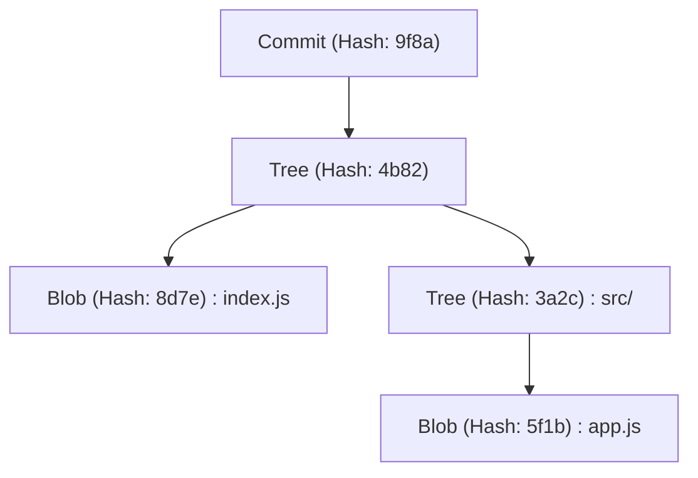
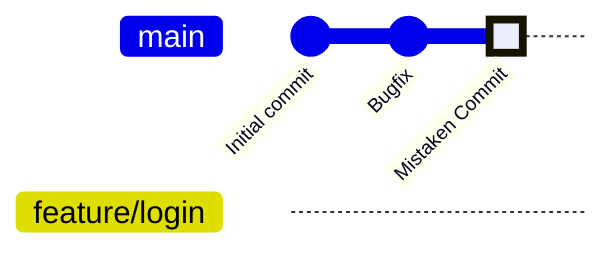
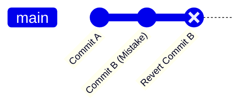
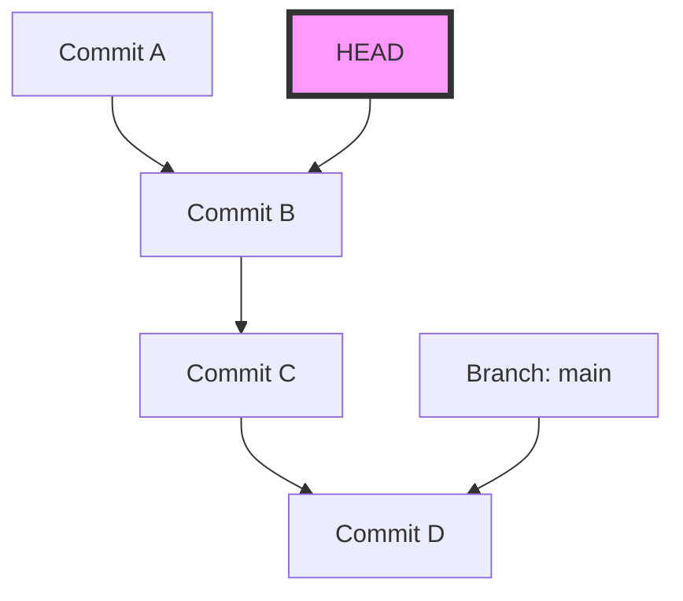
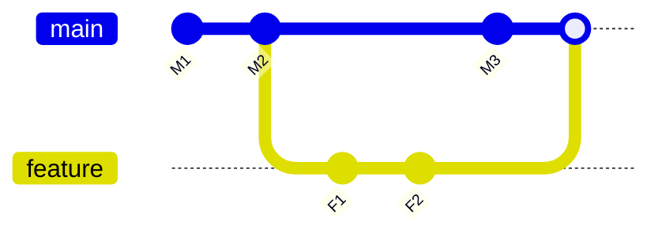

# A Collection of Common Mistakes and Solutions for Git Beginners (Including Conflict Resolution)

## 1. Introduction: Why Do We Make Mistakes in Git?

In software development, Git has become as essential as air and water. However, for many beginners (and sometimes even experts), Git can feel like a "terrifying magical black box". Commits disappear, massive amounts of changes are pushed into the wrong branch, or unfamiliar conflict error messages fill the screen... Falling into these "Git traps" can completely halt your work progress and make you fear that you might destroy the source code in the worst-case scenario.

Why is Git so difficult and prone to inducing mistakes? The biggest reason is that people use it by simply memorizing superficial commands without understanding what is happening inside Git. Git is based on a robust design philosophy as a Distributed Version Control System (DVCS), but its interface (CLI) is not always intuitive.

This article categorizes many "screw-ups" (common mistakes) that Git beginners frequently encounter in the field into numerous cases and presents specific commands as solutions for each. However, it will not just be a simple list of commands (a cheat sheet). We will thoroughly dive deep into "why that mistake happens" and "how the data moves inside Git when you execute that command", exploring the structure of the `.git` directory, the mathematical background of the Diff algorithm working behind the scenes, and Mermaid diagrams in a volume exceeding 10,000 characters.

By the time you finish reading this article, you should be free from the feeling that "Git is scary" and instead be convinced that "there is no more reliable partner than Git." Now, let's dive into the profound world of Git.

---

## 2. The Abyss of Git: Understanding the Internal Structure of the `.git` Directory

The first step to making many troubleshooting tasks easier is knowing how Git stores data. The hidden folder `.git` that exists in the root directory of your project is exactly the heart of Git. Git is not a system that merely records file differences (patches) sequentially, but it manages data as a **stream of snapshots**.

### 2.1 Object Model: Blob, Tree, Commit

Git mainly uses three objects to represent the state of a repository. These objects are saved in `.git/objects`.

1. **Blob (Binary Large Object)**
   An object that stores the file content itself. File names and permission information are not included here. Pure byte sequences are compressed with zlib and identified by a SHA-1 hash value (a 40-character hexadecimal number).
2. **Tree**
   An object that represents the structure of a directory. A Tree object contains pointers (SHA-1 hash values) to other Tree objects (subdirectories) and Blob objects (files), as well as their file names and access permissions. It plays a role similar to a UNIX directory.
3. **Commit**
   Holds a pointer to the top-level Tree object of the entire repository at a given point in time, metadata (author, commit date and time, commit message), and a pointer to the immediately preceding commit (parent commit).



### 2.2 The True Identity of HEAD and References (Refs)

When working with Git, you frequently see the word `HEAD`. This is a **Symbolic Reference** that points to the currently checked-out branch (or commit).
If you open the `.git/HEAD` file in a text editor, you will see a string like the following:

```text
ref: refs/heads/main
```

This means that "the current state is at the tip of the `main` branch." And when you open `.git/refs/heads/main`, there is a 40-character SHA-1 hash written there, which points to the latest Commit object.
A branch in Git is simply a lightweight pointer (file) that points to a specific commit. Just knowing this fact removes the fear that "if I delete a branch, will all the files be deleted?".

---

## 3. Deciphering Git with Mathematics: Diff Algorithms and Hash Functions

When Git detects conflicts or displays file differences, sophisticated algorithms are running internally.

### 3.1 Myers' Diff Algorithm

Git's default difference detection algorithm is the one devised by Eugene W. Myers. When there are two text files $A$ and $B$, the problem of finding the "minimum edit script (insertions and deletions)" to transform $A$ into $B$ can be modeled as a shortest path problem in graph theory.

Let the lengths of the strings be $N$ and $M$ respectively, and the sum be $V = N + M$. Myers' algorithm searches for the Edit Distance $D$. The time complexity of this algorithm is expressed by the following formula:

$$ \mathcal{O}(V \cdot D) $$

Here, if the difference between the files is small (that is, $D$ is small), the algorithm operates very fast at $\mathcal{O}(V)$. However, if the files are completely different, $D \approx V$, and the worst-case time complexity becomes $\mathcal{O}(V^2)$.

### 3.2 Patience Diff and Histogram Diff

While Myers' algorithm is excellent, it can sometimes generate differences that are not intuitive (do not make sense) to humans, such as when the order of functions or classes is significantly rearranged. To solve this, Git implements `Patience Diff` and `Histogram Diff`.

Patience Diff focuses on "unique lines that appear exactly once in both files" and finds their Longest Common Subsequence (LCS). Letting the number of unique elements be $U$, the computation of the LCS can be solved with the following time complexity:

$$ \mathcal{O}(U \log U) $$

When you feel that conflict resolution is difficult, using `git diff --histogram` or specifying this algorithm in the merge strategy (`git merge -s recursive -X histogram`) is one solution.

### 3.3 SHA-1 and Collision Probability

Git manages all objects with SHA-1 hash values. The size of the hash space is $2^{160}$. Approximating the probability of hash collision (different contents having the same hash value) using the Birthday Paradox, the number of objects $k$ required for the collision probability $p$ to reach 50% is as follows:

$$ k \approx \sqrt{2 \ln(2)} \cdot 2^{80} \approx 1.2 \times 2^{80} $$

This is an astronomical number, and the probability of an unintended collision occurring in normal software development is practically zero. Therefore, Git operates by trusting the hash value as an "absolute unique ID".

---

## 4. Case Study 1: I Committed to the Wrong Branch!

**[Situation]**
Without realizing that I was working on the `main` branch, I actively wrote code for a new feature and even went as far as doing a `git commit`. I was supposed to create a `feature/login` branch and work there!

### Solution: `git reset` and Creating a Branch

In Git, a commit is an independent object, and a branch is just a pointer. Therefore, you can instantly solve this with the operation: "create a new branch and then rewind the pointer of the current branch."

```bash
# 1. Create a new branch pointing to the current commit (the mistakenly created commit)
$ git branch feature/login

# 2. Rewind the pointer of the main branch to the previous commit (HEAD~1)
# Using --keep allows you to safely reset while maintaining uncommitted changes in the working directory.
$ git reset --keep HEAD~1

# 3. Switch to the correct branch
$ git checkout feature/login
```

### Diagram: What Happened Internally?

Let's visualize the movement of branch pointers at this time using a Mermaid `gitGraph`.


Initially, `main` and `HEAD` were pointing to "Mistaken Commit", but with `git branch feature/login`, a new pointer is created there. After that, by using `git reset`, only the `main` pointer returns to the "Bugfix" position. The objects themselves are not deleted at all.

---

## 5. Case Study 2: I Want to Cancel an Already Pushed Commit!

**[Situation]**
I committed bug-ridden code written in a late-night frenzy, and what's more, I published it to the remote repository with `git push origin main`. I noticed a critical bug and turned pale.

### Solution 1: Deny History with `git revert` (Recommended / Safe)

In team development, tampering with the history of already pushed commits using `git reset` or similar is strictly prohibited. It causes inconsistencies with the local repositories of other developers. The correct approach is to **"create a new commit that does the exact opposite, completely neutralizing the changes of the mistaken commit."** This is `git revert`.

```bash
# Create a commit that neutralizes the latest commit
$ git revert HEAD
[main 7f3a8b2] Revert "Commit message of the mistaken commit"
 1 file changed, 1 insertion(+), 10 deletions(-)

# Push to remote
$ git push origin main
```


History continues to move forward, and only the state of the code reverts to its original form.

### Solution 2: Falsify History with `git push --force-with-lease`

If you have just pushed to a branch that only you are using, rewriting history is acceptable.

```bash
# Reset the commit locally and fix it
$ git reset --hard HEAD~1
$ git add .
$ git commit -m "Correct implementation"

# Forcefully overwrite the remote history
$ git push origin feature/login --force-with-lease
```
`--force-with-lease` is a safe forced push to prevent accidents where you mistakenly overwrite someone else's work.

---

## 6. Case Study 3: I Want to Switch to Another Branch Mid-Work (The Magic of Stash)

**[Situation]**
While implementing a new feature on the `feature/A` branch, the source code is in a half-finished state where it doesn't even compile yet. Suddenly, an order flies in from my boss: "There is an urgent bug in the production environment of the `main` branch, so fix it right now!"

### Solution: Shelve with `git stash`

`git stash` is a command to temporarily shelve uncommitted changes to a temporary area.

```bash
# 1. Shelve the changes being worked on
$ git stash push -m "WIP: feature A partially implemented"

# 2. Make it possible to switch to the main branch
$ git checkout main
# ... (perform emergency bug fix work, commit, and push) ...

# 3. Return to the original branch when work is finished
$ git checkout feature/A

# 4. Restore the shelved changes
$ git stash pop
```

When you execute `git stash`, Git internally generates two special commit objects and saves them to a reference called `refs/stash`. In other words, Stash is also ultimately an "unnamed temporary commit".

---

## 7. Case Study 4: The Terrifying "Detached HEAD" State

**[Situation]**
I wanted to check the code at a specific point in the past, so I executed `git checkout 9f8a7b6`. Then, `You are in 'detached HEAD' state.` was displayed. I committed as it was, but when I switched branches, the commit disappeared!

### Mechanism of Detached HEAD

Normally, `HEAD` points to a branch like `refs/heads/main`. However, if you directly check out a specific commit, `HEAD` points directly to the commit object. This is called a **Detached HEAD**.


Even if you stack commits in this state, no branch will track those new commits. The moment you switch to another branch, the new commits become lost.

### Solution: Save as a New Branch

It will be resolved if you create a new branch at your current location.

```bash
# Create a new branch at the current HEAD position and switch to it
$ git checkout -b feature/recovered-work
```

---

## 8. Case Study 5: Conflict Resolution in Merge and Rebase

**[Situation]**
When I executed `git merge` or `git rebase`, `CONFLICT (content)` was displayed, and the process was interrupted.

### Difference Between Merge and Rebase

1. **Merge**
   Performs a 3-way merge using the latest commits of the two branches and their common ancestor, creating a merge commit.
2. **Rebase**
   Temporarily saves the commits of the current branch and reapplies them to the tip of the target. History becomes a straight line.



### Conflict Resolution Method

Markers like the following are inserted into files where conflicts have occurred.

```javascript
<<<<<<< HEAD
const apiUrl = "https://api.production.example.com";
=======
const apiUrl = "https://api.staging.example.com";
>>>>>>> feature/new-api
```

The resolution procedure is extremely simple.

1. **Delete the markers and correct the code to the right one.**
   ```javascript
   const apiUrl = process.env.NODE_ENV === 'production' 
       ? "https://api.production.example.com" 
       : "https://api.staging.example.com";
   ```
2. **Add the resolved file to staging.**
   `git add` has the role of "telling Git that the conflict has been resolved".
   ```bash
   $ git add index.js
   ```
3. **Complete the process.**
   ```bash
   # In the case of merge
   $ git commit -m "Resolve merge conflict in index.js"
   
   # In the case of rebase
   $ git rebase --continue
   ```

If you panic, you can abort at any time with `$ git merge --abort` or `$ git rebase --abort`.

---

## 9. Case Study 6: The Commit History is a Mess! `git rebase -i`

**[Situation]**
A large number of minor commits like "Fix typo", "Fix again", and "Add test" have occurred. If merged into `main` like this, the history will be messy.

### Solution: Interactive Rebase

Using `git rebase -i` (interactive), you can rearrange the order of past commits, combine multiple commits into one (squash), or modify commit messages.

```bash
# Organize the last 3 commits
$ git rebase -i HEAD~3
```
An editor opens, and it displays as follows:
```text
pick 1a2b3c4 Fix typo
pick 2b3c4d5 Fix again
pick 3c4d5e6 Add test
```
Rewrite this as follows:
```text
pick 1a2b3c4 Implement feature X
squash 2b3c4d5 Fix again
squash 3c4d5e6 Add test
```
When you save and close, these three commits are beautifully integrated into one.

---

## 10. Case Study 7: I Don't Know When the Bug Was Introduced! `git bisect`

**[Situation]**
There is a bug in the current `main` branch, but it was normal when released a month ago. I want to identify which commit introduced the bug, but there are over 100 commits, making it impossible to do manually!

### Solution: Identifying Bugs via Binary Search

Git has a built-in tool that finds the commit where a bug was introduced through a mathematical Binary Search. Since the time complexity is $\mathcal{O}(\log N)$, even with 1000 commits, it can be identified in about 10 tests.

```bash
# Start the search
$ git bisect start

# The current commit has a bug (bad)
$ git bisect bad

# It was normal 1 month ago (for example, hash a1b2c3d) (good)
$ git bisect good a1b2c3d

# Git will automatically checkout a middle commit, so run your test
# If the test succeeds:
$ git bisect good
# If the test fails:
$ git bisect bad
```
By simply repeating this, Git will accurately tell you, "This commit is the first bad commit." When finished, use `$ git bisect reset` to return to the original state.

---

## 11. The Ultimate Safety Net: `git reflog`

The ultimate secret technique against any "screw-up" in Git is `git reflog`. Git records all local operation history (movements of HEAD) for a certain period of time. Even if you mistakenly delete a branch or perform an incorrect reset, you can recover just by finding the past hash with `git reflog` and doing a `git reset --hard` to it.

```bash
$ git reflog
9f8a7b6 (HEAD -> main) HEAD@{0}: commit: Add new feature
1a2b3c4 HEAD@{1}: reset: moving to HEAD~1
```

## 12. Conclusion

We have explained in great detail the mistakes that Git beginners easily fall into, the mechanisms of Git behind them, and how to solve them. Committing to the wrong branch, reverting pushed commits, utilizing Stash, surviving from a Detached HEAD, and resolving conflicts. What is important in all of these is to imagine "what objects and pointers Git is manipulating behind the scenes."

File differences are calculated by strict Diff algorithms expressed in mathematical formulas, and the consistency of history is guaranteed by cryptographic hash functions. If you understand this beautiful design philosophy, you should realize that Git is by no means a "mysterious black box," but the strongest shield that firmly protects your source code.

Next time you think "I screwed up!", don't panic and close the terminal, but take a deep breath and type `git status`. Git will surely present you with hints for recovery.
