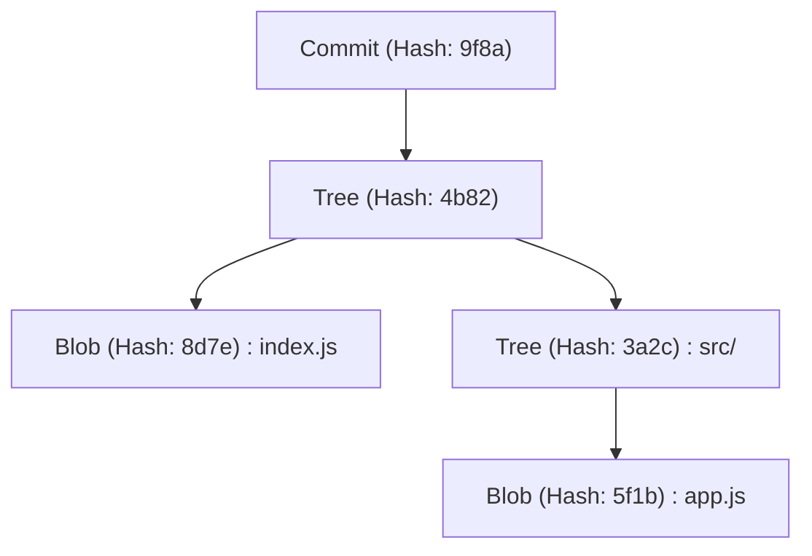
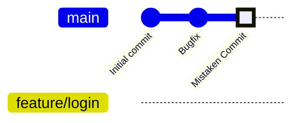
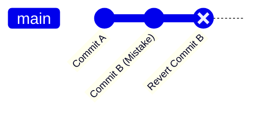
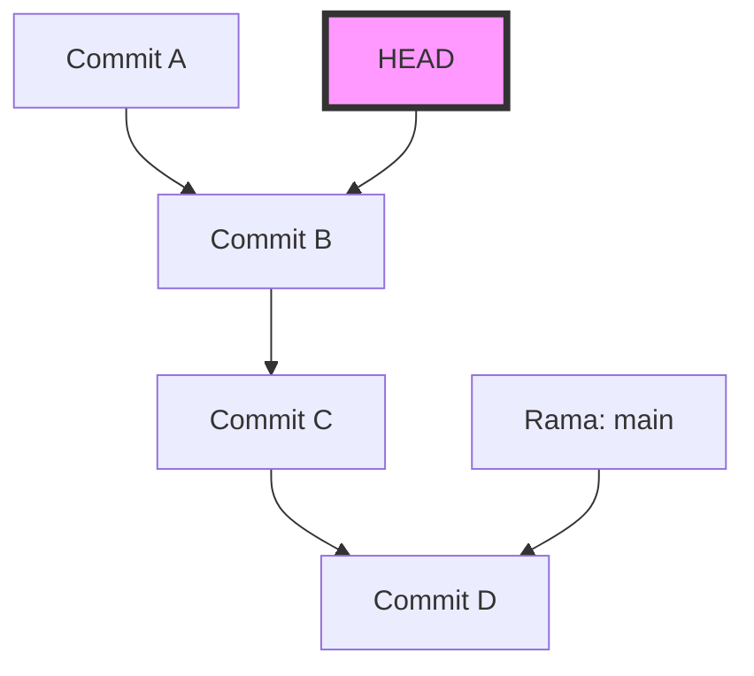
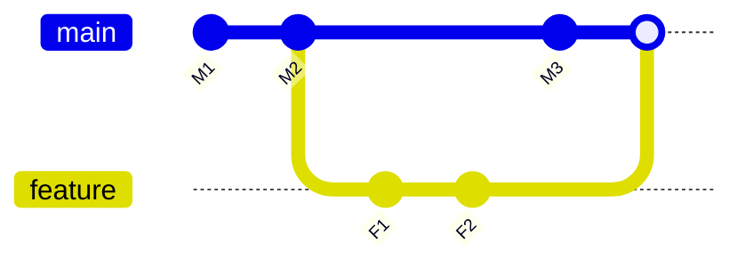

# Colección de errores comunes y comandos de solución para principiantes de Git (resolución de conflictos, etc.)

## 1. Introducción: ¿Por qué cometemos errores en Git?

En el desarrollo de software, Git se ha convertido en algo tan indispensable como el aire o el agua. Sin embargo, para muchos principiantes (y a veces incluso para los expertos), Git puede parecer una "caja negra mágica y aterradora". Los commits desaparecen, subes un montón de cambios en la rama equivocada o mensajes de error de conflictos que nunca has visto antes llenan la pantalla... Cuando caes en estas "trampas de Git", el progreso de tu trabajo se detiene por completo y, en el peor de los casos, te invade el miedo de haber destruido el código fuente.

¿Por qué Git es tan difícil y propenso a inducir errores? La razón principal es que "usamos comandos superficiales de memoria sin entender lo que está sucediendo dentro de Git". Git se basa en una filosofía de diseño robusta como un Sistema de Control de Versiones Distribuido (DVCS), pero su interfaz (CLI) no siempre es intuitiva.

En este artículo, clasificaremos los "errores comunes" que los principiantes de Git encuentran frecuentemente en el trabajo en múltiples casos y proporcionaremos los comandos específicos para resolver cada uno de ellos. Sin embargo, no será una simple lista de comandos (hoja de trucos). Profundizaremos en "por qué ocurre ese error" y "cómo se mueven los datos dentro de Git cuando ejecutas ese comando" a lo largo de más de 10,000 caracteres, incluyendo la estructura del directorio `.git`, el trasfondo matemático del algoritmo Diff que se ejecuta en segundo plano y diagramas usando Mermaid.

Cuando termines de leer este artículo hasta el final, te liberarás del sentimiento de que "Git da miedo" y, en cambio, estarás seguro de que "no hay un compañero más confiable que Git". Entonces, sumerjámonos en el profundo mundo de Git.

---

## 2. El abismo de Git: Entendiendo la estructura interna del directorio `.git`

El primer paso para facilitar la resolución de muchos problemas es saber cómo Git guarda los datos. La carpeta oculta `.git` que se encuentra en el directorio raíz de tu proyecto es el corazón de Git. Git no es un sistema que simplemente registra las diferencias (parches) de los archivos en orden, sino que gestiona los datos como un **flujo de instantáneas (snapshots)**.

### 2.1 Modelo de objetos: Blob, Tree, Commit

Git utiliza principalmente 3 objetos para representar el estado del repositorio. Estos objetos se guardan en `.git/objects`.

1. **Blob (Binary Large Object)**
   Es el objeto que guarda el contenido del archivo en sí. La información como el nombre del archivo y los permisos no se incluyen aquí. Es puramente una secuencia de bytes comprimida con zlib y se identifica mediante un valor hash SHA-1 (un número hexadecimal de 40 caracteres).
2. **Tree**
   Es el objeto que representa la estructura del directorio. Un objeto Tree contiene punteros (valores hash SHA-1) a otros objetos Tree (subdirectorios) y objetos Blob (archivos), así como sus nombres de archivo y permisos de acceso. Desempeña un papel similar a un directorio de UNIX.
3. **Commit**
   Contiene un puntero al objeto Tree de nivel superior de todo el repositorio en un momento dado, metadatos (autor, fecha y hora del commit, mensaje del commit) y un puntero al commit inmediatamente anterior (commit padre).



### 2.2 La verdadera naturaleza de HEAD y las referencias (Refs)

Al trabajar con Git, verás frecuentemente la palabra `HEAD`. Esto es una **referencia simbólica (Symbolic Reference)** que apunta a la rama (o commit) que tienes actualmente verificada (checked out).
Si abres el archivo `.git/HEAD` con un editor de texto, verás una cadena como esta:

```text
ref: refs/heads/main
```

Esto significa que "el estado actual se encuentra en la punta de la rama `main`". Y si abres `.git/refs/heads/main`, verás escrito un hash SHA-1 de 40 caracteres, que apunta al objeto Commit más reciente.
Una rama de Git es simplemente un puntero ligero (un archivo) que apunta a un commit específico. Solo con saber este hecho, el miedo de que "si elimino la rama, se borrarán todos los archivos" desaparece.

---

## 3. Descifrando Git con matemáticas: El algoritmo Diff y las funciones hash

Cuando Git detecta un conflicto o muestra la diferencia entre archivos, se están ejecutando algoritmos avanzados internamente.

### 3.1 Algoritmo Diff de Myers

El algoritmo de detección de diferencias predeterminado de Git es un algoritmo ideado por Eugene W. Myers. Cuando hay dos archivos de texto $A$ y $B$, el problema de encontrar la "secuencia mínima de ediciones (inserciones y eliminaciones)" para convertir $A$ en $B$ se puede modelar como un problema de la ruta más corta en la teoría de grafos.

Sean las longitudes de las cadenas $N$ y $M$ respectivamente, y la suma sea $V = N + M$. En el algoritmo de Myers, se busca la distancia de edición (Edit Distance) $D$. La complejidad temporal de este algoritmo se expresa con la siguiente fórmula:

$$ \mathcal{O}(V \cdot D) $$

Aquí, si la diferencia entre los archivos es pequeña (es decir, $D$ es pequeña), el algoritmo se ejecuta a una velocidad muy alta $\mathcal{O}(V)$. Sin embargo, si los archivos son completamente diferentes, $D \approx V$, y la complejidad temporal en el peor de los casos es $\mathcal{O}(V^2)$.

### 3.2 Patience Diff e Histogram Diff

El algoritmo de Myers es excelente, pero cuando se cambia significativamente el orden de funciones o clases, puede generar diferencias que no son intuitivas (no tienen sentido) para los humanos. Para solucionar esto, Git implementa `Patience Diff` e `Histogram Diff`.

Patience Diff se centra en las "líneas únicas que aparecen solo una vez en ambos archivos" y encuentra la subsecuencia común más larga (Longest Common Subsequence: LCS) de esas líneas. Si el número de elementos únicos es $U$, el cálculo de LCS se puede resolver con la siguiente complejidad computacional:

$$ \mathcal{O}(U \log U) $$

Cuando sientas que la resolución de un conflicto es difícil, una opción es usar `git diff --histogram` o especificar este algoritmo en la estrategia de fusión (`git merge -s recursive -X histogram`).

### 3.3 SHA-1 y la probabilidad de colisiones

Git gestiona todos los objetos con valores hash SHA-1. El tamaño del espacio hash es $2^{160}$. Si aproximamos la probabilidad de colisión de hash $p$ (que contenidos diferentes tengan el mismo valor hash) usando la paradoja del cumpleaños (Birthday Paradox), el número de objetos $k$ necesarios para que la probabilidad de colisión sea del 50% es el siguiente:

$$ k \approx \sqrt{2 \ln(2)} \cdot 2^{80} \approx 1.2 \times 2^{80} $$

Este es un número astronómico, y la probabilidad de que ocurra una colisión involuntaria en el desarrollo de software normal es prácticamente cero. Por lo tanto, Git funciona confiando en el valor hash como una "ID única absoluta".

---

## 4. Estudio de caso 1: ¡He hecho un commit en la rama equivocada!

**【Situación】**
Sin darte cuenta de que estabas trabajando en la rama `main`, escribiste mucho código para una nueva función y, para colmo, hiciste un `git commit`. ¡Se suponía que debías crear una rama llamada `feature/login` y trabajar allí!

### Solución: `git reset` y crear una rama

En Git, los commits son objetos independientes y las ramas son solo punteros. Por lo tanto, puedes resolver esto al instante con la operación de "crear una nueva rama y luego retroceder el puntero de la rama actual".

```bash
# 1. Crear una nueva rama que apunte al commit actual (el commit hecho por error)
$ git branch feature/login

# 2. Retroceder el puntero de la rama main al commit anterior (HEAD~1)
# Usando --keep, puedes restablecer de forma segura manteniendo los cambios no confirmados (uncommitted) en el directorio de trabajo.
$ git reset --keep HEAD~1

# 3. Cambiar a la rama correcta
$ git checkout feature/login
```

### Ilustración: ¿Qué pasó internamente?

Visualicemos el movimiento de los punteros de rama en este momento usando `gitGraph` de Mermaid.


Al principio, `main` y `HEAD` apuntaban a "Mistaken Commit", pero con `git branch feature/login`, se crea un nuevo puntero allí. Luego, con `git reset`, solo el puntero `main` vuelve a la posición "Bugfix". No se ha eliminado ningún objeto en sí.

---

## 5. Estudio de caso 2: ¡Quiero deshacer un commit que ya ha sido empujado (pushed)!

**【Situación】**
Cometiste un código lleno de errores escrito durante la madrugada impulsado por la tensión y, además, lo publicaste en el repositorio remoto con `git push origin main`. Te das cuenta de un error crítico y palideces.

### Solución 1: `git revert` para anular la historia (Recomendado y Seguro)

En el desarrollo en equipo, está estrictamente prohibido alterar el historial de commits ya empujados con comandos como `git reset`. Incoherencias surgirán con los repositorios locales de otros desarrolladores. El enfoque correcto es **"crear un nuevo commit inverso que anule por completo los cambios del commit equivocado"**. Esto es `git revert`.

```bash
# Crear un commit que anule el último commit
$ git revert HEAD
[main 7f3a8b2] Revert "Mensaje del commit equivocado"
 1 file changed, 1 insertion(+), 10 deletions(-)

# Empujar al remoto
$ git push origin main
```


La historia sigue avanzando y solo el estado del código vuelve a su estado anterior.

### Solución 2: Alterar la historia con `git push --force-with-lease`

Si acabas de empujar a una rama que solo tú estás usando, alterar la historia es aceptable.

```bash
# Restablecer el commit localmente y arreglarlo
$ git reset --hard HEAD~1
$ git add .
$ git commit -m "Correct implementation"

# Sobrescribir forzadamente el historial del remoto
$ git push origin feature/login --force-with-lease
```
`--force-with-lease` es un push forzado seguro para evitar el accidente de sobrescribir el trabajo de otra persona por error.

---

## 6. Estudio de caso 3: Quiero cambiar a otra rama mientras trabajo (La magia de Stash)

**【Situación】**
Estás implementando una nueva función en la rama `feature/A`, pero el código fuente está a medias y ni siquiera compila. De repente, tu jefe te ordena: "¡Hay un error urgente en el entorno de producción en la rama `main`, arréglalo ahora mismo!".

### Solución: Guardar los cambios con `git stash`

`git stash` es un comando que guarda los cambios no confirmados (uncommitted) en un área temporal.

```bash
# 1. Guardar los cambios en los que estás trabajando
$ git stash push -m "WIP: feature A partially implemented"

# 2. Ahora es posible cambiar a la rama main
$ git checkout main
# ... (Realizas el trabajo de corrección de errores urgentes, commit, push) ...

# 3. Volver a la rama original cuando termines
$ git checkout feature/A

# 4. Restaurar los cambios guardados
$ git stash pop
```

Cuando ejecutas `git stash`, Git crea internamente dos objetos de commit especiales y los guarda en una referencia llamada `refs/stash`. Es decir, al fin y al cabo, un Stash también es "un commit temporal sin nombre".

---

## 7. Estudio de caso 4: El aterrador estado de "Detached HEAD"

**【Situación】**
Querías comprobar el código de un punto específico en el pasado y ejecutaste `git checkout 9f8a7b6`. Entonces apareció el mensaje `You are in 'detached HEAD' state.`. Hiciste un commit así sin más, pero cuando cambiaste de rama, ¡el commit desapareció!

### El mecanismo de Detached HEAD

Normalmente, `HEAD` apunta a una rama como `refs/heads/main`. Sin embargo, si verificas (checkout) directamente un commit específico, `HEAD` apuntará directamente al objeto del commit. A esto se le llama **Detached HEAD (HEAD separado o desprendido)**.


Incluso si apilas commits en este estado, ninguna rama seguirá esos nuevos commits. En el momento en que cambies a otra rama, los nuevos commits se perderán.

### Solución: Guardar como una nueva rama

Se soluciona creando una nueva rama en el lugar donde te encuentras actualmente.

```bash
# Crear una nueva rama en la posición actual de HEAD y cambiar a ella
$ git checkout -b feature/recovered-work
```

---

## 8. Estudio de caso 5: Resolución de conflictos en Merge y Rebase

**【Situación】**
Ejecutaste `git merge` o `git rebase` y apareció el mensaje `CONFLICT (content)`, y el proceso se interrumpió.

### La diferencia entre Merge (Fusión) y Rebase (Reestructuración)

1. **Merge (Fusión)**
   Realiza una fusión a tres bandas (3-way merge) utilizando los últimos commits de las dos ramas y un ancestro común, creando un commit de fusión.
2. **Rebase (Reestructuración)**
   Guarda temporalmente los commits de la rama actual y los vuelve a aplicar en la punta del objetivo. La historia se vuelve lineal.



### Método de resolución de conflictos

En los archivos donde ocurrió un conflicto, se insertan marcadores como los siguientes:

```javascript
<<<<<<< HEAD
const apiUrl = "https://api.production.example.com";
=======
const apiUrl = "https://api.staging.example.com";
>>>>>>> feature/new-api
```

El procedimiento de resolución es extremadamente simple.

1. **Eliminar los marcadores y corregir con el código correcto.**
   ```javascript
   const apiUrl = process.env.NODE_ENV === 'production' 
       ? "https://api.production.example.com" 
       : "https://api.staging.example.com";
   ```
2. **Añadir el archivo resuelto al área de preparación (staging).**
   `git add` tiene el papel de "decirle a Git que has resuelto el conflicto".
   ```bash
   $ git add index.js
   ```
3. **Completar el proceso.**
   ```bash
   # En el caso de merge
   $ git commit -m "Resolve merge conflict in index.js"
   
   # En el caso de rebase
   $ git rebase --continue
   ```

Si entras en pánico, siempre puedes cancelar con `$ git merge --abort` o `$ git rebase --abort`.

---

## 9. Estudio de caso 6: ¡El historial de commits es un desastre! `git rebase -i`

**【Situación】**
Se han generado muchos commits pequeños como "Corrección de error tipográfico", "Corrección de nuevo", "Añadir prueba", etc. Si fusionas a `main` tal como está, el historial se ensuciará.

### Solución: Rebase interactivo

Al usar `git rebase -i` (interactive), puedes cambiar el orden de los commits pasados, combinar múltiples commits en uno (squash) o modificar el mensaje de un commit.

```bash
# Organizar los últimos 3 commits
$ git rebase -i HEAD~3
```
Se abrirá un editor y se mostrará lo siguiente:
```text
pick 1a2b3c4 Corrección de error tipográfico
pick 2b3c4d5 Corrección de nuevo
pick 3c4d5e6 Añadir prueba
```
Lo reescribes de la siguiente manera:
```text
pick 1a2b3c4 Implementación de la función X
squash 2b3c4d5 Corrección de nuevo
squash 3c4d5e6 Añadir prueba
```
Cuando lo guardes y cierres, estos 3 commits se integrarán hermosamente en uno solo.

---

## 10. Estudio de caso 7: ¡No sé cuándo se introdujo el error! `git bisect`

**【Situación】**
Hay un error en la rama `main` actual, pero todo era normal en el lanzamiento de hace un mes. Quieres identificar en qué commit se introdujo el error, ¡pero hay más de 100 commits y es imposible hacerlo manualmente!

### Solución: Identificar el error mediante búsqueda binaria

Git tiene una herramienta incorporada para encontrar el commit donde se introdujo un error utilizando una búsqueda binaria matemática (Binary Search). La complejidad temporal es $\mathcal{O}(\log N)$, por lo que, aunque haya 1000 commits, se puede identificar con unas 10 pruebas.

```bash
# Iniciar la búsqueda
$ git bisect start

# El commit actual tiene el error (bad)
$ git bisect bad

# Hace un mes (por ejemplo, el hash era a1b2c3d) era normal (good)
$ git bisect good a1b2c3d

# Git revisará (checkout) automáticamente el commit intermedio, así que ejecutas tu prueba
# Si la prueba es exitosa:
$ git bisect good
# Si la prueba falla:
$ git bisect bad
```
Simplemente repitiendo esto, Git te dirá exactamente "Este es el primer commit defectuoso (Bad commit)". Cuando termines, vuelve al estado original con `$ git bisect reset`.

---

## 11. La red de seguridad definitiva: `git reflog`

La técnica final para cualquier "metedura de pata" en Git es `git reflog`. Git registra todo el historial de operaciones locales (historial de movimientos de HEAD) durante un período de tiempo determinado. Incluso si has borrado una rama o has hecho un restablecimiento (reset) incorrecto, puedes encontrar el hash pasado con `git reflog` y restaurarlo simplemente haciendo `git reset --hard` allí.

```bash
$ git reflog
9f8a7b6 (HEAD -> main) HEAD@{0}: commit: Add new feature
1a2b3c4 HEAD@{1}: reset: moving to HEAD~1
```

## 12. Conclusión

Hemos explicado con gran detalle los errores comunes en los que suelen caer los principiantes de Git, los mecanismos de Git detrás de ellos y cómo resolverlos. Commits en la rama equivocada, anular commits ya empujados, aprovechar Stash, sobrevivir a Detached HEAD y resolver conflictos. Lo importante en todo esto es imaginar "qué objetos y punteros está manipulando Git en segundo plano".

La diferencia de los archivos se calcula mediante un riguroso algoritmo Diff expresado en fórmulas matemáticas, y la integridad de la historia está garantizada por funciones hash criptográficas. Si entiendes esta hermosa filosofía de diseño, te darás cuenta de que Git no es en absoluto una "caja negra incomprensible", sino el escudo más fuerte para proteger firmemente tu código fuente.

La próxima vez que pienses "¡Metí la pata!", en lugar de entrar en pánico y cerrar la terminal, respira hondo y escribe `git status`. Git siempre te ofrecerá pistas para la recuperación.
