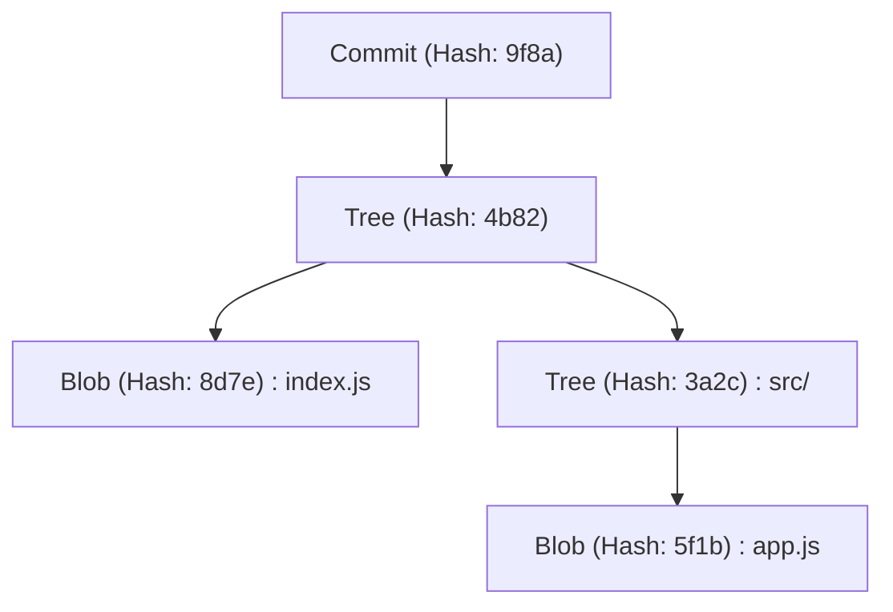
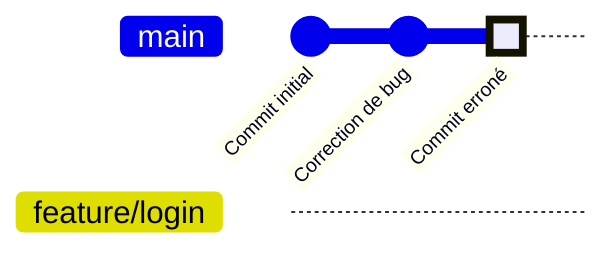
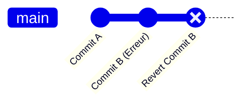
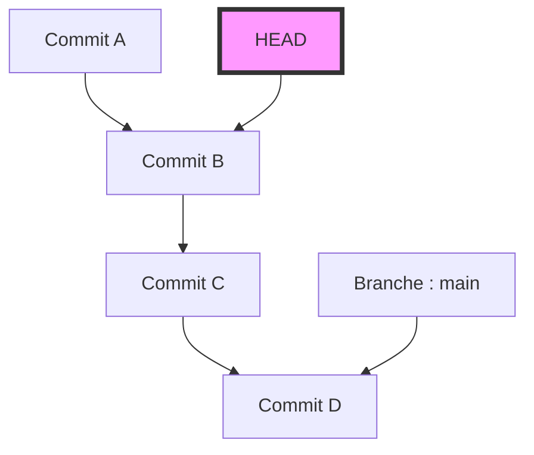
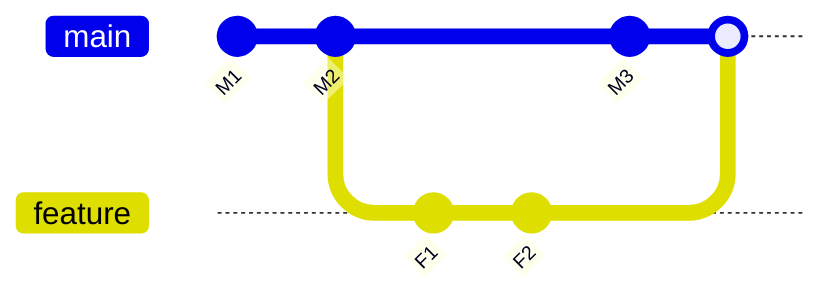

# Erreurs courantes des débutants sur Git et commandes de résolution (résolution de conflits, etc.)

## 1. Introduction : Pourquoi fait-on des erreurs sur Git ?

Dans le développement logiciel, Git est devenu aussi indispensable que l'air ou l'eau. Cependant, pour de nombreux débutants (et parfois même pour les experts), Git peut sembler être une "boîte noire magique et effrayante". Des commits qui disparaissent, des modifications massives poussées sur la mauvaise branche, des messages d'erreur de conflit inédits remplissant l'écran... Lorsqu'on tombe dans ces "pièges de Git", la progression du travail s'arrête complètement, et dans le pire des cas, on est envahi par la peur de détruire le code source.

Pourquoi Git est-il si difficile et si propice aux erreurs ? La raison principale est que "les utilisateurs mémorisent et utilisent des commandes superficielles sans comprendre ce qui se passe à l'intérieur de Git". Bien que Git soit basé sur la conception robuste d'un système de contrôle de version décentralisé (DVCS), son interface (CLI) n'est pas toujours intuitive.

Dans cet article, nous classerons en de nombreux cas les "gaffes (erreurs courantes)" que les débutants sur Git rencontrent fréquemment sur le terrain, et nous présenterons les commandes spécifiques pour les résoudre. Cependant, il ne s'agira pas d'une simple liste de commandes (antisèche). Nous explorerons en profondeur, sur plus de 10 000 caractères, "pourquoi cette erreur se produit" et "comment les données se déplacent à l'intérieur de Git lors de l'exécution de cette commande", en utilisant la structure du répertoire `.git`, le contexte mathématique de l'algorithme Diff en arrière-plan, et des diagrammes Mermaid.

À la fin de cet article, vous devriez être libéré de la peur de Git et convaincu que "Git est le partenaire le plus fiable". Plongeons maintenant dans le monde profond de Git.

---

## 2. Les abysses de Git : Comprendre la structure interne du répertoire `.git`

La première étape pour faciliter le dépannage est de savoir comment Git stocke les données. Le dossier caché `.git` situé à la racine de votre projet est le cœur de Git. Git ne gère pas les données comme un simple système enregistrant séquentiellement les différences de fichiers (patchs), mais comme un **flux d'instantanés (snapshots)**.

### 2.1 Modèle d'objet : Blob, Tree, Commit

Git utilise principalement trois objets pour représenter l'état du dépôt. Ces objets sont stockés dans `.git/objects`.

1. **Blob (Binary Large Object)**
   C'est l'objet qui stocke le contenu du fichier lui-même. Les noms de fichiers et les informations d'autorisation n'y sont pas inclus. Il s'agit d'une pure séquence d'octets compressée avec zlib et identifiée par une valeur de hachage SHA-1 (40 caractères hexadécimaux).
2. **Tree**
   C'est l'objet qui représente la structure du répertoire. Un objet Tree contient des pointeurs (valeurs de hachage SHA-1) vers d'autres objets Tree (sous-répertoires) ou objets Blob (fichiers), ainsi que leurs noms de fichiers et autorisations d'accès. Il joue un rôle similaire à un répertoire UNIX.
3. **Commit**
   Il contient un pointeur vers l'objet Tree de niveau supérieur de l'ensemble du dépôt à un moment donné, des métadonnées (auteur, date du commit, message de commit) et un pointeur vers le commit précédent (commit parent).



### 2.2 La véritable nature de HEAD et des références (Refs)

En travaillant avec Git, on voit souvent le mot `HEAD`. Il s'agit d'une **référence symbolique (Symbolic Reference)** qui pointe vers la branche (ou le commit) actuellement extraite.
Si vous ouvrez le fichier `.git/HEAD` avec un éditeur de texte, vous verrez la chaîne suivante :

```text
ref: refs/heads/main
```

Cela signifie que "l'état actuel se trouve à la pointe de la branche `main`". Et si vous ouvrez `.git/refs/heads/main`, vous y trouverez un hachage SHA-1 de 40 caractères, qui pointe vers le dernier objet Commit.
Une branche Git n'est rien d'autre qu'un pointeur léger (un fichier) qui pointe vers un commit spécifique. Le simple fait de savoir cela dissipe la peur que "supprimer une branche supprimera tous les fichiers".

---

## 3. Git décrypté par les mathématiques : Algorithme Diff et fonctions de hachage

Lorsque Git détecte des conflits ou affiche des différences de fichiers, un algorithme avancé fonctionne en arrière-plan.

### 3.1 Algorithme Diff de Myers

L'algorithme de détection de différences par défaut de Git est celui inventé par Eugene W. Myers. Étant donné deux fichiers texte $A$ et $B$, le problème de trouver la "séquence minimale d'édition (insertions et suppressions)" pour convertir $A$ en $B$ peut être modélisé comme un problème de plus court chemin dans la théorie des graphes.

Soient $N$ et $M$ les longueurs des chaînes, et $V = N + M$ le total. L'algorithme de Myers recherche la distance d'édition (Edit Distance) $D$. La complexité temporelle de cet algorithme est exprimée par l'équation suivante :

$$ \mathcal{O}(V \cdot D) $$

Ici, si la différence entre les fichiers est petite (c'est-à-dire que $D$ est petit), l'algorithme fonctionne très rapidement en $\mathcal{O}(V)$. Cependant, si les fichiers est complètement différents, $D \approx V$, et la complexité temporelle dans le pire des cas est de $\mathcal{O}(V^2)$.

### 3.2 Patience Diff et Histogram Diff

L'algorithme de Myers est excellent, mais il peut générer des différences qui ne sont pas intuitives (dénuées de sens) pour les humains, par exemple lors d'un grand changement dans l'ordre des fonctions ou des classes. Pour résoudre ce problème, Git implémente `Patience Diff` et `Histogram Diff`.

Patience Diff se concentre sur "les lignes uniques qui n'apparaissent qu'une seule fois dans les deux fichiers" et trouve leur plus longue sous-séquence commune (Longest Common Subsequence : LCS). Si le nombre d'éléments uniques est $U$, le calcul de la LCS peut être résolu avec la complexité suivante :

$$ \mathcal{O}(U \log U) $$

Lorsque vous trouvez qu'il est difficile de résoudre un conflit, une solution consiste à utiliser `git diff --histogram` ou à spécifier cet algorithme dans la stratégie de fusion (`git merge -s recursive -X histogram`).

### 3.3 SHA-1 et probabilité de collision

Git gère tous les objets avec des valeurs de hachage SHA-1. La taille de l'espace de hachage est de $2^{160}$. En approximant la probabilité d'une collision de hachage (le fait que différents contenus aient la même valeur de hachage) à l'aide du paradoxe des anniversaires (Birthday Paradox), le nombre d'objets $k$ requis pour que la probabilité de collision $p$ atteigne 50 % est le suivant :

$$ k \approx \sqrt{2 \ln(2)} \cdot 2^{80} \approx 1.2 \times 2^{80} $$

Il s'agit d'un nombre astronomique, et la probabilité qu'une collision involontaire se produise dans le développement logiciel normal est pratiquement nulle. Par conséquent, Git fonctionne en faisant confiance à la valeur de hachage comme un "ID unique absolu".

---

## 4. Étude de cas 1 : J'ai commité sur la mauvaise branche !

**【Situation】**
Sans me rendre compte que je travaillais sur la branche `main`, j'ai écrit beaucoup de code pour une nouvelle fonctionnalité et, pire encore, j'ai même fait un `git commit`. J'étais censé créer une branche `feature/login` et y travailler !

### Solution : `git reset` et création de branche

Dans Git, les commits sont des objets indépendants et les branches ne sont que des pointeurs. Par conséquent, cela peut être résolu instantanément par l'opération : "créer une nouvelle branche, puis reculer le pointeur de la branche actuelle".

```bash
# 1. Créer une nouvelle branche pointant vers le commit actuel (le commit fait par erreur)
$ git branch feature/login

# 2. Reculer le pointeur de la branche main au commit précédent (HEAD~1)
# L'utilisation de --keep permet de réinitialiser en toute sécurité tout en conservant les modifications non commitées dans le répertoire de travail.
$ git reset --keep HEAD~1

# 3. Basculer sur la bonne branche
$ git checkout feature/login
```

### Explication illustrée : Que s'est-il passé en interne ?

Visualisons le mouvement du pointeur de branche à ce moment-là à l'aide de `gitGraph` de Mermaid.


Au début, `main` et `HEAD` pointaient vers "Commit erroné", mais `git branch feature/login` y crée un nouveau pointeur. Ensuite, avec `git reset`, seul le pointeur `main` revient à la position de "Correction de bug". Aucun objet n'est supprimé.

---

## 5. Étude de cas 2 : Je veux annuler un commit déjà poussé !

**【Situation】**
Tard dans la nuit, j'ai commité du code plein de bugs et je l'ai rendu public sur le dépôt distant avec `git push origin main`. Je réalise qu'il y a un bug majeur et je pâlis.

### Solution 1 : Annuler l'histoire avec `git revert` (Recommandé / Sûr)

Dans le développement en équipe, il est strictement interdit d'altérer l'historique des commits déjà poussés en utilisant `git reset` ou similaire. Cela briserait la cohérence avec les dépôts locaux des autres développeurs. La bonne approche est de **"créer un nouveau commit inverse qui annule complètement les modifications du commit erroné"**. C'est ce que fait `git revert`.

```bash
# Créer un commit qui annule le dernier commit
$ git revert HEAD
[main 7f3a8b2] Revert "Message du commit erroné"
 1 file changed, 1 insertion(+), 10 deletions(-)

# Pousser vers le dépôt distant
$ git push origin main
```


L'histoire continue d'avancer, seul l'état du code revient à la normale.

### Solution 2 : Altérer l'histoire avec `git push --force-with-lease`

Si vous venez de pousser sur une branche que vous êtes le seul à utiliser, altérer l'historique peut être acceptable.

```bash
# Réinitialiser le commit localement et corriger
$ git reset --hard HEAD~1
$ git add .
$ git commit -m "Correct implementation"

# Écraser de force l'historique distant
$ git push origin feature/login --force-with-lease
```
`--force-with-lease` est un push forcé sécurisé pour éviter d'écraser accidentellement le travail de quelqu'un d'autre.

---

## 6. Étude de cas 3 : Je veux changer de branche en plein travail (La magie de Stash)

**【Situation】**
Je suis en train d'implémenter une nouvelle fonctionnalité sur la branche `feature/A`, le code source est dans un état intermédiaire qui ne compile même pas encore. Soudain, mon patron me dit : "Il y a un bug urgent en production sur la branche `main`, corrige-le tout de suite !"

### Solution : Mettre de côté avec `git stash`

`git stash` est une commande qui met de côté les modifications non commitées dans une zone temporaire.

```bash
# 1. Mettre de côté les modifications en cours
$ git stash push -m "WIP: feature A partially implemented"

# 2. Possibilité de basculer sur la branche main
$ git checkout main
# ... (travail de correction de bug urgent, commit et push) ...

# 3. Retourner à la branche d'origine une fois le travail terminé
$ git checkout feature/A

# 4. Restaurer les modifications mises de côté
$ git stash pop
```

Lors de l'exécution de `git stash`, Git crée en interne deux objets commit spéciaux et les stocke dans une référence appelée `refs/stash`. En d'autres termes, un Stash est finalement un "commit temporaire sans nom".

---

## 7. Étude de cas 4 : L'état terrifiant "Detached HEAD"

**【Situation】**
Je voulais vérifier le code à un moment précis dans le passé et j'ai exécuté `git checkout 9f8a7b6`. Le message `You are in 'detached HEAD' state.` s'est affiché. J'ai commité tel quel, mais quand j'ai changé de branche, le commit a disparu !

### Le mécanisme du Detached HEAD

Normalement, `HEAD` pointe vers une branche comme `refs/heads/main`. Cependant, si vous extrayez directement un commit spécifique, `HEAD` pointera directement vers l'objet commit. C'est ce qu'on appelle un **Detached HEAD (HEAD détaché)**.


Même si vous empilez les commits dans cet état, aucune branche ne suivra ces nouveaux commits. Au moment où vous passez à une autre branche, les nouveaux commits se perdent.

### Solution : Sauvegarder en tant que nouvelle branche

Le problème est résolu en créant une nouvelle branche à l'endroit où vous vous trouvez actuellement.

```bash
# Créer une nouvelle branche à la position actuelle de HEAD et basculer dessus
$ git checkout -b feature/recovered-work
```

---

## 8. Étude de cas 5 : Résolution de conflits lors de Merge et Rebase

**【Situation】**
J'ai exécuté `git merge` ou `git rebase`, et `CONFLICT (content)` s'est affiché, le processus a été interrompu.

### Différence entre Merge (fusion) et Rebase (rebasage)

1. **Merge (fusion)**
   Effectue une fusion à 3 voies (3-way merge) en utilisant le dernier commit de deux branches et leur ancêtre commun, et crée un commit de fusion.
2. **Rebase (rebasage)**
   Enregistre temporairement les commits de la branche actuelle et les réapplique à la pointe de la branche cible. L'historique devient une ligne droite.



### Comment résoudre un conflit

Les marqueurs suivants sont insérés dans les fichiers où des conflits se sont produits.

```javascript
<<<<<<< HEAD
const apiUrl = "https://api.production.example.com";
=======
const apiUrl = "https://api.staging.example.com";
>>>>>>> feature/new-api
```

La procédure de résolution est extrêmement simple.

1. **Supprimez les marqueurs et corrigez avec le bon code.**
   ```javascript
   const apiUrl = process.env.NODE_ENV === 'production' 
       ? "https://api.production.example.com" 
       : "https://api.staging.example.com";
   ```
2. **Ajoutez le fichier résolu à l'index (staging).**
   `git add` a pour rôle de "dire à Git que le conflit est résolu".
   ```bash
   $ git add index.js
   ```
3. **Terminez le processus.**
   ```bash
   # Dans le cas d'un merge
   $ git commit -m "Resolve merge conflict in index.js"
   
   # Dans le cas d'un rebase
   $ git rebase --continue
   ```

Si vous paniquez, vous pouvez toujours annuler avec `$ git merge --abort` ou `$ git rebase --abort`.

---

## 9. Étude de cas 6 : L'historique des commits est un gâchis ! `git rebase -i`

**【Situation】**
Un grand nombre de petits commits tels que "Correction de typo", "Encore une correction", "Ajout de tests" ont été générés. Si je fusionne dans `main` tel quel, l'historique sera sale.

### Solution : Rebase interactif

En utilisant `git rebase -i` (interactif), vous pouvez modifier l'ordre des commits passés, combiner plusieurs commits en un seul (squash), ou modifier les messages de commit.

```bash
# Organiser les 3 derniers commits
$ git rebase -i HEAD~3
```
L'éditeur s'ouvrira et affichera ceci :
```text
pick 1a2b3c4 Correction de typo
pick 2b3c4d5 Encore une correction
pick 3c4d5e6 Ajout de tests
```
Réécrivez-le comme ceci :
```text
pick 1a2b3c4 Implémentation de la fonctionnalité X
squash 2b3c4d5 Encore une correction
squash 3c4d5e6 Ajout de tests
```
Enregistrez et fermez, ces 3 commits seront magnifiquement fusionnés en un seul.

---

## 10. Étude de cas 7 : Je ne sais pas quand le bug a été introduit ! `git bisect`

**【Situation】**
La branche `main` actuelle a un bug, mais tout était normal lors de la version d'il y a un mois. Je veux identifier dans quel commit le bug a été introduit, mais il y a plus de 100 commits et c'est impossible de le faire manuellement !

### Solution : Identifier le bug par recherche dichotomique

Git intègre un outil pour trouver le commit qui a introduit un bug en utilisant la recherche dichotomique (Binary Search) mathématique. La complexité de calcul étant de $\mathcal{O}(\log N)$, même s'il y a 1000 commits, vous pouvez l'identifier en environ 10 tests.

```bash
# Démarrer la recherche
$ git bisect start

# Le commit actuel a un bug (bad)
$ git bisect bad

# Il y a un mois (par exemple le hachage a1b2c3d) c'était normal (good)
$ git bisect good a1b2c3d

# Git extrait automatiquement un commit intermédiaire, vous exécutez donc le test
# Si le test réussit :
$ git bisect good
# Si le test échoue :
$ git bisect bad
```
En répétant simplement cela, Git vous dira exactement : "Ce commit est le premier commit Bad". Une fois terminé, revenez à l'état d'origine avec `$ git bisect reset`.

---

## 11. Le filet de sécurité ultime : `git reflog`

La technique secrète ultime pour toutes les "gaffes" sur Git est `git reflog`. Git enregistre tout l'historique des opérations locales (l'historique des déplacements de HEAD) pendant une certaine période. Même si vous supprimez une branche ou effectuez une mauvaise réinitialisation, vous pouvez toujours récupérer en trouvant le hachage passé avec `git reflog` et en effectuant un `git reset --hard` dessus.

```bash
$ git reflog
9f8a7b6 (HEAD -> main) HEAD@{0}: commit: Add new feature
1a2b3c4 HEAD@{1}: reset: moving to HEAD~1
```

## 12. Conclusion

Nous avons expliqué très en détail les erreurs courantes dans lesquelles tombent les débutants sur Git, les mécanismes de Git en arrière-plan et comment les résoudre. Commiter sur la mauvaise branche, annuler un commit déjà poussé, utiliser Stash, survivre à un Detached HEAD et résoudre des conflits. Ce qui est important dans tout cela, c'est d'imaginer "quels objets et pointeurs Git manipule en arrière-plan".

Les différences de fichiers sont calculées par un algorithme Diff strict représenté par des formules mathématiques, et la cohérence de l'historique est garantie par des fonctions de hachage cryptographiques. Si vous comprenez cette belle philosophie de conception, vous devriez réaliser que Git n'est en aucun cas une "boîte noire mystérieuse", mais le bouclier le plus puissant pour protéger fermement votre code source.

La prochaine fois que vous penserez "J'ai gaffé !", ne fermez pas le terminal dans la panique, prenez une grande respiration et tapez `git status`. Git vous donnera toujours des indices pour la récupération.
