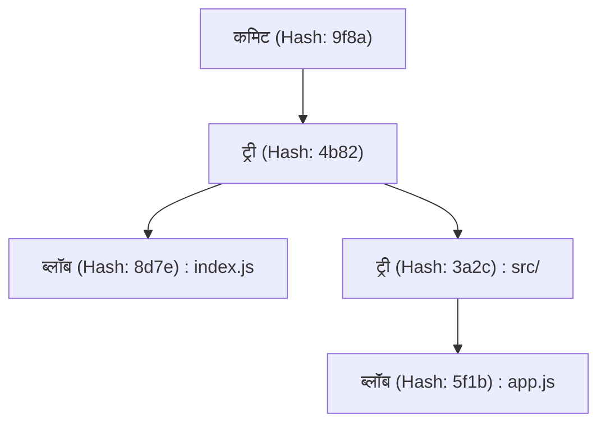
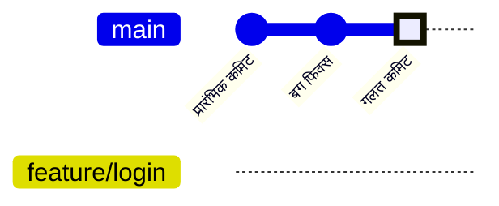
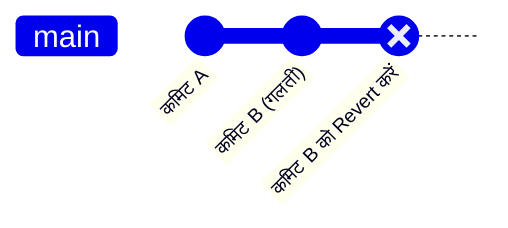
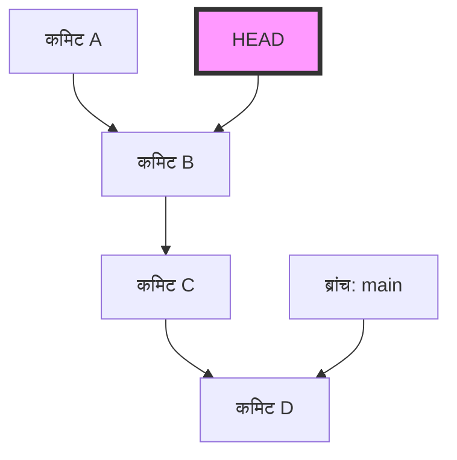
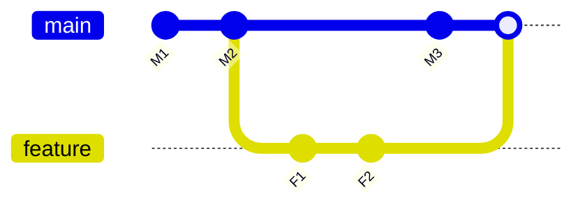

# Git शुरुआती लोगों द्वारा की जाने वाली आम गलतियाँ और समाधान कमांड (कन्फ्लिक्ट रिज़ॉल्यूशन आदि)

## 1. परिचय: हम Git में गलतियाँ क्यों करते हैं?

सॉफ्टवेयर विकास में, Git हवा और पानी की तरह अपरिहार्य हो गया है। हालाँकि, कई शुरुआती लोगों (और कभी-कभी अनुभवी लोगों) के लिए, Git एक "डरावने जादुई ब्लैक बॉक्स" की तरह महसूस हो सकता है। कमिट्स का गायब होना, अनजाने में गलत ब्रांच में भारी बदलाव पुश कर देना, या स्क्रीन पर ऐसे कन्फ्लिक्ट एरर मैसेज आना जिन्हें आपने पहले कभी नहीं देखा...। जब आप इस तरह के "Git ट्रैप" में फँसते हैं, तो आपका काम पूरी तरह से रुक जाता है, और सबसे खराब स्थिति में, आप इस डर से घबरा जाते हैं कि कहीं आप अपने सोर्स कोड को नष्ट तो नहीं कर देंगे।

Git इतना कठिन और गलतियों का कारण क्यों है? इसका सबसे बड़ा कारण यह है कि "हम Git के अंदर क्या हो रहा है, यह समझे बिना केवल बाहरी कमांड्स को याद करके उनका उपयोग करते हैं।" Git एक डिस्ट्रीब्यूटेड वर्जन कंट्रोल सिस्टम (DVCS) के रूप में एक मजबूत डिज़ाइन फिलॉसफी पर आधारित है, लेकिन इसका इंटरफ़ेस (CLI) हमेशा सहज नहीं होता है।

इस लेख में, हम उन "गलतियों (सामान्य गलतियों)" को कई मामलों में वर्गीकृत करेंगे जिनका अक्सर Git शुरुआती लोग सामना करते हैं, और प्रत्येक के लिए विशिष्ट समाधान कमांड प्रदान करेंगे। हालाँकि, यह सिर्फ कमांड्स की एक सूची (चीट शीट) नहीं होगी। "वह गलती क्यों होती है" और "उस कमांड को चलाने पर Git के अंदर डेटा कैसे चलता है", इस पर हम 10,000 से अधिक वर्णों के साथ गहराई से चर्चा करेंगे, जिसमें `.git` डायरेक्टरी की संरचना, बैकग्राउंड में चल रहे Diff एल्गोरिदम की गणितीय पृष्ठभूमि और Mermaid आरेख शामिल होंगे।

जब आप इस लेख को पढ़ना समाप्त कर लेंगे, तो आप "Git डरावना है" की भावना से मुक्त हो जाएंगे, और इसके बजाय यह आश्वस्त महसूस करेंगे कि "Git से अधिक विश्वसनीय कोई साथी नहीं है।" तो चलिए Git की गहरी दुनिया में गोता लगाते हैं।

---

## 2. Git की गहराई: `.git` डायरेक्टरी की आंतरिक संरचना को समझना

कई समस्या-समाधान (troubleshooting) को आसान बनाने का पहला कदम यह जानना है कि Git डेटा कैसे स्टोर करता है। आपके प्रोजेक्ट की रूट डायरेक्टरी में मौजूद छिपा हुआ फ़ोल्डर `.git`, Git का हृदय है। Git केवल फ़ाइल के अंतर (पैच) को क्रम में रिकॉर्ड करने वाला सिस्टम नहीं है, बल्कि यह डेटा को **स्नैपशॉट के स्ट्रीम** के रूप में प्रबंधित करता है।

### 2.1 ऑब्जेक्ट मॉडल: Blob, Tree, Commit

Git रिपॉजिटरी की स्थिति को दर्शाने के लिए मुख्य रूप से 3 ऑब्जेक्ट्स का उपयोग करता है। ये ऑब्जेक्ट्स `.git/objects` में सेव किए जाते हैं।

1. **Blob (Binary Large Object)**
   यह वह ऑब्जेक्ट है जो फ़ाइल की सामग्री को ही सेव करता है। फ़ाइल का नाम और अनुमतियों की जानकारी इसमें शामिल नहीं होती है। शुद्ध बाइट अनुक्रम को zlib के साथ संपीड़ित किया जाता है और SHA-1 हैश मान (40-वर्ण हेक्साडेसिमल) द्वारा पहचाना जाता है।
2. **Tree**
   यह एक ऑब्जेक्ट है जो डायरेक्टरी की संरचना को दर्शाता है। Tree ऑब्जेक्ट में अन्य Tree ऑब्जेक्ट्स (सबडायरेक्टरी) या Blob ऑब्जेक्ट्स (फ़ाइलें) के पॉइंटर्स (SHA-1 हैश मान), साथ ही उनके फ़ाइल नाम और एक्सेस अनुमतियां शामिल होती हैं। यह UNIX डायरेक्टरी की तरह काम करता है।
3. **Commit**
   यह किसी विशिष्ट समय पर संपूर्ण रिपॉजिटरी के शीर्ष-स्तरीय Tree ऑब्जेक्ट के लिए एक पॉइंटर, मेटाडेटा (निर्माता, कमिट तिथि, और कमिट संदेश), और पिछले कमिट (पैरेंट कमिट) के लिए एक पॉइंटर रखता है।



### 2.2 HEAD और संदर्भ (Refs) की वास्तविकता

Git में काम करते समय आप अक्सर `HEAD` शब्द देखते हैं। यह एक **सिम्बॉलिक रेफरेंस (Symbolic Reference)** है जो उस ब्रांच (या कमिट) को इंगित करता है जिसे आपने वर्तमान में चेक आउट किया है।
यदि आप टेक्स्ट एडिटर में `.git/HEAD` फ़ाइल खोलते हैं, तो आपको निम्न स्ट्रिंग दिखाई देगी:

```text
ref: refs/heads/main
```

इसका अर्थ है, "वर्तमान स्थिति `main` ब्रांच के सिरे पर है।" और यदि आप `.git/refs/heads/main` खोलते हैं, तो वहां एक 40-वर्ण का SHA-1 हैश लिखा होता है, जो नवीनतम Commit ऑब्जेक्ट को इंगित करता है।
Git ब्रांच केवल हल्के पॉइंटर्स (फ़ाइलें) हैं जो विशिष्ट कमिट्स को इंगित करते हैं। केवल इस तथ्य को जानने से यह डर दूर हो जाता है कि "अगर मैं ब्रांच को हटा दूं तो क्या सारी फ़ाइलें गायब हो जाएंगी?"

---

## 3. गणित से Git को समझना: Diff एल्गोरिदम और हैश फ़ंक्शन

जब Git कन्फ्लिक्ट का पता लगाता है या फ़ाइलों के बीच अंतर दिखाता है, तो आंतरिक रूप से अत्यधिक उन्नत एल्गोरिदम काम कर रहे होते हैं।

### 3.1 Myers का Diff एल्गोरिदम

Git का डिफ़ॉल्ट अंतर पहचान (difference detection) एल्गोरिदम Eugene W. Myers द्वारा विकसित किया गया था। जब दो टेक्स्ट फ़ाइलें $A$ और $B$ होती हैं, तो $A$ को $B$ में बदलने के लिए "न्यूनतम संपादन चरण (सम्मिलन और विलोपन)" खोजने की समस्या को ग्राफ सिद्धांत में सबसे छोटे पथ की समस्या (shortest path problem) के रूप में तैयार किया जा सकता है।

मान लें कि स्ट्रिंग की लंबाई क्रमशः $N, M$ है, और कुल $V = N + M$ है। Myers का एल्गोरिदम संपादन दूरी (Edit Distance) $D$ की खोज करता है। इस एल्गोरिदम की समय जटिलता (time complexity) निम्नलिखित समीकरण द्वारा व्यक्त की जाती है:

$$ \mathcal{O}(V \cdot D) $$

यहाँ, यदि फ़ाइलों के बीच का अंतर छोटा है (यानी, $D$ छोटा है), तो एल्गोरिदम बहुत तेजी से $\mathcal{O}(V)$ पर चलता है। हालाँकि, यदि फ़ाइलें पूरी तरह से अलग हैं, तो $D \approx V$, और सबसे खराब स्थिति की जटिलता (worst-case complexity) $\mathcal{O}(V^2)$ हो जाती है।

### 3.2 Patience Diff और Histogram Diff

हालांकि Myers का एल्गोरिदम उत्कृष्ट है, यह ऐसे अंतर उत्पन्न कर सकता है जो मनुष्यों के लिए सहज (अर्थपूर्ण) नहीं हैं, जैसे कि जब कार्यों या वर्गों के क्रम को बहुत बदल दिया जाता है। इसे हल करने के लिए, Git `Patience Diff` और `Histogram Diff` लागू करता है।

Patience Diff "उन अद्वितीय पंक्तियों पर ध्यान केंद्रित करता है जो दोनों फ़ाइलों में केवल एक बार दिखाई देती हैं" और उनके सबसे लंबे सामान्य अनुवर्ती (Longest Common Subsequence: LCS) को ढूंढता है। अद्वितीय तत्वों की संख्या को $U$ मानकर, LCS की गणना निम्नलिखित जटिलता के साथ हल की जा सकती है:

$$ \mathcal{O}(U \log U) $$

जब आपको लगता है कि कन्फ्लिक्ट को हल करना मुश्किल है, तो एक तरीका `git diff --histogram` का उपयोग करना है, या इस एल्गोरिदम को मर्ज रणनीति के रूप में निर्दिष्ट करना है (`git merge -s recursive -X histogram`)।

### 3.3 SHA-1 और टक्कर की संभावना (Collision Probability)

Git सभी ऑब्जेक्ट्स को SHA-1 हैश मानों के साथ प्रबंधित करता है। हैश स्पेस का आकार $2^{160}$ है। जन्मदिन के विरोधाभास (Birthday Paradox) का उपयोग करके हैश टक्कर (विभिन्न सामग्री का समान हैश मान होना) होने की संभावना का अनुमान लगाते हुए, 50% की टक्कर संभावना $p$ होने के लिए आवश्यक ऑब्जेक्ट्स की संख्या $k$ इस प्रकार है:

$$ k \approx \sqrt{2 \ln(2)} \cdot 2^{80} \approx 1.2 \times 2^{80} $$

यह एक खगोलीय संख्या है, और सामान्य सॉफ्टवेयर विकास में अनजाने में होने वाली टक्कर की संभावना वस्तुतः शून्य है। इसलिए, Git हैश मान को "पूर्ण अद्वितीय ID" के रूप में भरोसा करके काम करता है।

---

## 4. केस स्टडी 1: गलत ब्रांच में कमिट कर दिया!

**【स्थिति】**
यह महसूस किए बिना कि मैं `main` ब्रांच पर काम कर रहा हूँ, मैंने नई सुविधा के लिए तेज़ी से कोड लिख दिया, और यहां तक कि `git commit` भी कर दिया। मुझे `feature/login` नाम से एक ब्रांच बनानी चाहिए थी और वहां काम करना चाहिए था!

### समाधान: `git reset` और ब्रांच बनाना

Git में, कमिट स्वतंत्र ऑब्जेक्ट हैं, और ब्रांच केवल पॉइंटर्स हैं। इसलिए, आप "एक नई ब्रांच बनाकर और फिर वर्तमान ब्रांच के पॉइंटर को पीछे हटाकर" इसे तुरंत हल कर सकते हैं।

```bash
# 1. वर्तमान कमिट (गलती से बनाया गया कमिट) को इंगित करने वाली एक नई ब्रांच बनाएँ
$ git branch feature/login

# 2. main ब्रांच के पॉइंटर को 1 कमिट पहले (HEAD~1) रिवाइंड करें
# --keep का उपयोग करके, आप कार्यशील डायरेक्टरी में बिना कमिट किए गए परिवर्तनों को बनाए रखते हुए सुरक्षित रूप से रीसेट कर सकते हैं।
$ git reset --keep HEAD~1

# 3. सही ब्रांच पर स्विच करें
$ git checkout feature/login
```

### आरेख: अंदर क्या हुआ?

आइए इस दौरान ब्रांच पॉइंटर्स की गति की कल्पना करने के लिए Mermaid के `gitGraph` का उपयोग करें।


प्रारंभ में, `main` और `HEAD` "गलत कमिट" को इंगित कर रहे थे, लेकिन `git branch feature/login` के साथ, वहां एक नया पॉइंटर बनाया गया है। उसके बाद, `git reset` के माध्यम से केवल `main` पॉइंटर "बग फिक्स" स्थिति में वापस आ जाता है। कोई भी ऑब्जेक्ट वास्तव में डिलीट नहीं हुआ है।

---

## 5. केस स्टडी 2: पुश किए गए कमिट को रद्द करना चाहता हूँ!

**【स्थिति】**
मैंने आधी रात के जोश में बग से भरा कोड कमिट किया, और इसे `git push origin main` के साथ रिमोट रिपॉजिटरी में भी पब्लिश कर दिया। मुझे एक गंभीर बग का एहसास हुआ और मैं पीला पड़ गया।

### समाधान 1: इतिहास को रद्द करने के लिए `git revert` (अनुशंसित और सुरक्षित)

टीम डेवलपमेंट में, `git reset` आदि के साथ पहले से ही पुश किए गए कमिट्स के इतिहास के साथ छेड़छाड़ करना सख्त मना है। यह अन्य डेवलपर्स के स्थानीय रिपॉजिटरी के साथ असंगत हो जाएगा। सही तरीका यह है कि **"गलत कमिट के परिवर्तनों को पूरी तरह से रद्द करने के लिए एक नया विपरीत कमिट बनाएँ।"** यही `git revert` है।

```bash
# नवीनतम कमिट को रद्द करने के लिए एक कमिट बनाएँ
$ git revert HEAD
[main 7f3a8b2] Revert "गलत कमिट का संदेश"
 1 file changed, 1 insertion(+), 10 deletions(-)

# रिमोट पर पुश करें
$ git push origin main
```


इतिहास आगे बढ़ता रहता है, केवल कोड की स्थिति वापस आ जाती है।

### समाधान 2: इतिहास के साथ छेड़छाड़ करने के लिए `git push --force-with-lease`

यदि आपने अभी-अभी किसी ऐसी ब्रांच में पुश किया है जिसका उपयोग केवल आप करते हैं, तो इतिहास को फिर से लिखना स्वीकार्य है।

```bash
# स्थानीय रूप से कमिट को रीसेट करें और ठीक करें
$ git reset --hard HEAD~1
$ git add .
$ git commit -m "Correct implementation"

# रिमोट इतिहास को जबरन ओवरराइट करें
$ git push origin feature/login --force-with-lease
```
`--force-with-lease` एक सुरक्षित फोर्स पुश है जो गलती से किसी और के काम को ओवरराइट करने से रोकता है।

---

## 6. केस स्टडी 3: काम के बीच में किसी अन्य ब्रांच पर स्विच करना चाहता हूँ (Stash का जादू)

**【स्थिति】**
`feature/A` ब्रांच पर एक नई सुविधा लागू करते समय, सोर्स कोड अभी भी आधी-अधूरी स्थिति में है जहां यह संकलित (compile) भी नहीं होगा। अचानक, मेरे बॉस ने मुझे निर्देश दिया, "`main` ब्रांच के प्रोडक्शन वातावरण में एक आपातकालीन बग है, कृपया इसे अभी ठीक करें!"

### समाधान: `git stash` के साथ आश्रय लेना

`git stash` एक ऐसा कमांड है जो बिना कमिट किए गए परिवर्तनों को अस्थायी क्षेत्र में सेव करता है।

```bash
# 1. काम प्रगति पर है उसे सेव करें
$ git stash push -m "WIP: feature A partially implemented"

# 2. main ब्रांच पर स्विच करने में सक्षम
$ git checkout main
# ...(आपातकालीन बग फिक्स करें, कमिट करें और पुश करें)...

# 3. काम पूरा होने पर मूल ब्रांच पर वापस आएं
$ git checkout feature/A

# 4. सेव किए गए परिवर्तनों को पुनर्स्थापित करें
$ git stash pop
```

जब आप `git stash` चलाते हैं, तो Git आंतरिक रूप से दो विशेष कमिट ऑब्जेक्ट बनाता है और उन्हें `refs/stash` नामक संदर्भ में सहेजता है। दूसरे शब्दों में, Stash अंततः "बिना नाम का एक अस्थायी कमिट" है।

---

## 7. केस स्टडी 4: "Detached HEAD" अवस्था का डर

**【स्थिति】**
मैं अतीत में एक विशिष्ट बिंदु पर कोड की जांच करना चाहता था, इसलिए मैंने `git checkout 9f8a7b6` चलाया। तब `You are in 'detached HEAD' state.` प्रदर्शित हुआ। मैंने वैसे ही कमिट किया, लेकिन जब मैंने ब्रांच स्विच की तो कमिट गायब हो गया!

### Detached HEAD का तंत्र

आमतौर पर `HEAD` एक ब्रांच की ओर इशारा करता है जैसे `refs/heads/main`। हालाँकि, यदि आप सीधे किसी विशिष्ट कमिट को चेक आउट करते हैं, तो `HEAD` सीधे कमिट ऑब्जेक्ट की ओर इशारा करेगा। इसे **Detached HEAD (अलग हुआ HEAD)** कहा जाता है।


इस स्थिति में कमिट्स जोड़ने के बाद भी, कोई भी ब्रांच उस नए कमिट को ट्रैक नहीं करेगी। जिस क्षण आप किसी अन्य ब्रांच पर स्विच करते हैं, नया कमिट खो जाएगा।

### समाधान: इसे एक नई ब्रांच के रूप में सहेजें

आप जहां हैं वहां एक नई ब्रांच बनाकर इसे हल किया जा सकता है।

```bash
# वर्तमान HEAD की स्थिति पर एक नई ब्रांच बनाएँ और उस पर स्विच करें
$ git checkout -b feature/recovered-work
```

---

## 8. केस स्टडी 5: मर्ज और रिबेस में कन्फ्लिक्ट का समाधान

**【स्थिति】**
जब मैंने `git merge` या `git rebase` चलाया, तो `CONFLICT (content)` प्रदर्शित हुआ, और प्रक्रिया बाधित हो गई।

### मर्ज (Merge) और रिबेस (Rebase) के बीच अंतर

1. **Merge (मर्ज)**
   2 ब्रांचों के नवीनतम कमिट और एक सामान्य पूर्वज का उपयोग करके 3-वे मर्ज करता है, और एक मर्ज कमिट बनाता है।
2. **Rebase (रिबेस)**
   वर्तमान ब्रांच के कमिट्स को अस्थायी रूप से सेव करता है, और उन्हें लक्ष्य (target) के शीर्ष पर फिर से लागू करता है। इतिहास एक सीधी रेखा बन जाता है।



### कन्फ्लिक्ट का समाधान कैसे करें

जिन फ़ाइलों में कन्फ्लिक्ट है उनमें निम्नलिखित मार्कर डाले गए हैं:

```javascript
<<<<<<< HEAD
const apiUrl = "https://api.production.example.com";
=======
const apiUrl = "https://api.staging.example.com";
>>>>>>> feature/new-api
```

समाधान की प्रक्रिया अत्यंत सरल है।

1. **मार्कर्स को हटाएँ और सही कोड में ठीक करें।**
   ```javascript
   const apiUrl = process.env.NODE_ENV === 'production' 
       ? "https://api.production.example.com" 
       : "https://api.staging.example.com";
   ```
2. **हल की गई फ़ाइल को स्टेजिंग में जोड़ें।**
   `git add` की भूमिका "Git को यह बताना है कि कन्फ्लिक्ट हल हो गया है।"
   ```bash
   $ git add index.js
   ```
3. **प्रक्रिया को पूरा करें।**
   ```bash
   # मर्ज के मामले में
   $ git commit -m "Resolve merge conflict in index.js"
   
   # रिबेस के मामले में
   $ git rebase --continue
   ```

यदि आप घबराते हैं, तो आप हमेशा `$ git merge --abort` या `$ git rebase --abort` के साथ निरस्त (abort) कर सकते हैं।

---

## 9. केस स्टडी 6: कमिट इतिहास बहुत गंदा है! `git rebase -i`

**【स्थिति】**
कई छोटे कमिट्स हैं जैसे "टाइपो ठीक किया", "फिर से ठीक किया", "टेस्ट जोड़ा", आदि। यदि मैं इसे इसी तरह `main` में मर्ज करता हूं, तो इतिहास गंदा हो जाएगा।

### समाधान: इंटरएक्टिव रिबेस

`git rebase -i` (interactive) का उपयोग करके, आप पिछले कमिट्स के क्रम को पुनर्व्यवस्थित कर सकते हैं, कई कमिट्स को एक (squash) में जोड़ सकते हैं, या कमिट संदेशों को संशोधित कर सकते हैं।

```bash
# पिछले 3 कमिट्स को व्यवस्थित करें
$ git rebase -i HEAD~3
```
संपादक (editor) खुल जाएगा और निम्न प्रदर्शित करेगा:
```text
pick 1a2b3c4 टाइपो ठीक किया
pick 2b3c4d5 फिर से ठीक किया
pick 3c4d5e6 टेस्ट जोड़ा
```
इसे इस प्रकार फिर से लिखें:
```text
pick 1a2b3c4 फीचर X लागू किया
squash 2b3c4d5 फिर से ठीक किया
squash 3c4d5e6 टेस्ट जोड़ा
```
जब आप इसे सहेजते हैं और बंद करते हैं, तो ये 3 कमिट खूबसूरती से एक में मिल जाएंगे।

---

## 10. केस स्टडी 7: मुझे नहीं पता कि बग कब पेश किया गया था! `git bisect`

**【स्थिति】**
वर्तमान `main` ब्रांच में एक बग है, लेकिन 1 महीने पहले रिलीज के समय यह सामान्य था। मैं यह पता लगाना चाहता हूं कि किस कमिट ने बग पेश किया, लेकिन 100 से अधिक कमिट हैं और इसे मैन्युअल रूप से करना असंभव है!

### समाधान: बाइनरी सर्च के साथ बग की पहचान करना

Git में एक अंतर्निहित उपकरण है जो गणितीय बाइनरी सर्च (Binary Search) के माध्यम से उस कमिट को ढूंढता है जिसने बग पेश किया था। चूँकि जटिलता $\mathcal{O}(\log N)$ है, भले ही 1000 कमिट हों, इसे लगभग 10 परीक्षणों में पहचाना जा सकता है।

```bash
# खोज शुरू करें
$ git bisect start

# वर्तमान कमिट में एक बग है (bad)
$ git bisect bad

# 1 महीने पहले (उदाहरण के लिए हैश a1b2c3d है) सामान्य था (good)
$ git bisect good a1b2c3d

# Git स्वचालित रूप से मध्यवर्ती कमिट्स की जांच करेगा, इसलिए परीक्षण चलाएँ
# यदि परीक्षण सफल होता है:
$ git bisect good
# यदि परीक्षण विफल रहता है:
$ git bisect bad
```
बस इसे दोहराने से, Git आपको सटीक रूप से बता देगा कि "यह कमिट पहला Bad कमिट है।" पूरा होने पर, मूल स्थिति में वापस आने के लिए `$ git bisect reset` का उपयोग करें।

---

## 11. अंतिम सुरक्षा जाल: `git reflog`

Git में हर "गलती" के लिए अंतिम गुप्त तकनीक `git reflog` है। Git कुछ समय के लिए सभी स्थानीय संचालन इतिहास (HEAD गति इतिहास) रिकॉर्ड करता है। भले ही आप किसी ब्रांच को हटा दें या गलत तरीके से रीसेट कर दें, आप `git reflog` के साथ पिछले हैश को ढूंढ सकते हैं, और केवल `git reset --hard` का उपयोग करके उसे पुनर्प्राप्त कर सकते हैं।

```bash
$ git reflog
9f8a7b6 (HEAD -> main) HEAD@{0}: commit: Add new feature
1a2b3c4 HEAD@{1}: reset: moving to HEAD~1
```

## 12. निष्कर्ष

हमने Git शुरुआती लोगों द्वारा की जाने वाली आम गलतियों, उनके पीछे Git के तंत्र और समाधानों को बहुत विस्तार से समझाया है। गलत ब्रांच में कमिट करना, पुश किए गए कमिट को रद्द करना, Stash का उपयोग करना, Detached HEAD से वापस आना, और कन्फ्लिक्ट्स को हल करना। इन सभी में, यह कल्पना करना महत्वपूर्ण है कि "पर्दे के पीछे Git किन ऑब्जेक्ट्स और पॉइंटर्स में हेरफेर कर रहा है।"

सख्त Diff एल्गोरिदम जो गणितीय सूत्रों में व्यक्त किया जा सकता है, फ़ाइलों के बीच अंतर की गणना करता है, और क्रिप्टोग्राफ़िक हैश फ़ंक्शन इतिहास की अखंडता (integrity) सुनिश्चित करते हैं। यदि आप इस सुंदर डिज़ाइन दर्शन को समझते हैं, तो आप महसूस करेंगे कि Git कभी भी "अज्ञात ब्लैक बॉक्स" नहीं है, बल्कि आपके सोर्स कोड की सुरक्षा करने वाली सबसे मजबूत ढाल है।

अगली बार जब आप सोचें "मैंने गलती कर दी!", तो टर्मिनल को जल्दी में बंद न करें, एक गहरी सांस लें और `git status` टाइप करें। Git निश्चित रूप से आपको पुनर्प्राप्ति (recovery) के लिए संकेत देगा।
