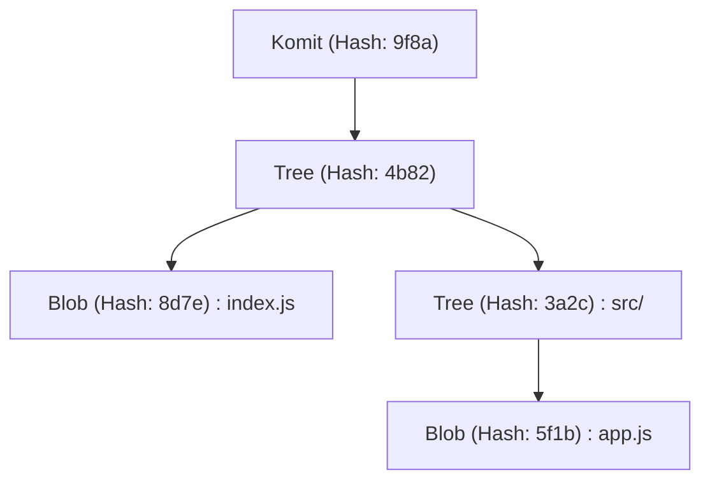
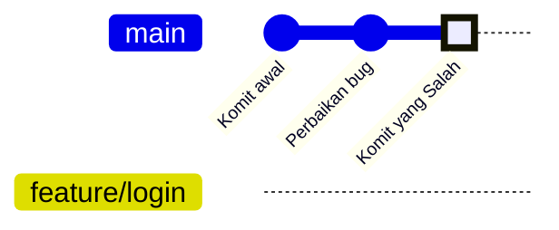
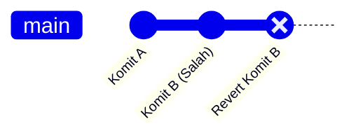
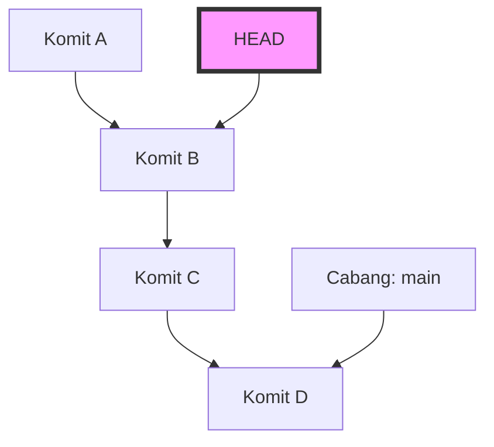
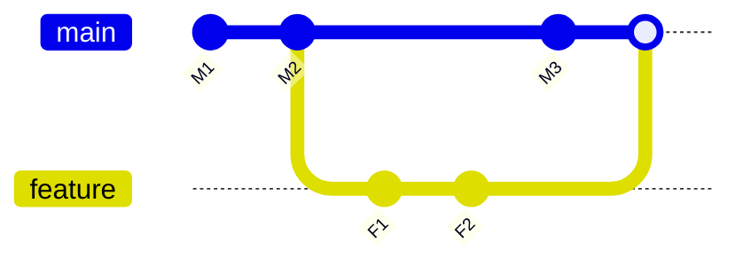

# Kumpulan Kesalahan Pemula Git dan Perintah Solusinya (Mengatasi Konflik, dll.)

## 1. Pendahuluan: Mengapa Kita Melakukan Kesalahan di Git?

Dalam pengembangan perangkat lunak, Git telah menjadi hal yang sangat penting seperti udara atau air. Namun, bagi banyak pemula (dan bahkan terkadang bagi para ahli), Git bisa terasa seperti "kotak hitam ajaib yang menakutkan". Komit yang menghilang, mendorong banyak perubahan ke cabang yang salah secara tidak sengaja, atau pesan kesalahan konflik yang belum pernah dilihat sebelumnya memenuhi layar... Saat terjebak dalam "perangkap Git" ini, progres pekerjaan bisa terhenti sepenuhnya, dan dalam skenario terburuk, muncul ketakutan bahwa kode sumber mungkin akan hancur.

Mengapa Git begitu sulit dan memicu kesalahan? Alasan utamanya adalah "kita menggunakannya dengan hanya menghafal perintah tanpa memahami apa yang terjadi di dalam Git". Git dibangun berdasarkan filosofi desain yang kuat sebagai sistem kontrol versi terdistribusi (DVCS), namun antarmukanya (CLI) tidak selalu intuitif.

Artikel ini mengklasifikasikan berbagai "kesalahan umum" yang sering dihadapi oleh pemula Git di lapangan ke dalam berbagai kasus, dan menyajikan perintah sebagai solusi spesifik untuk masing-masing kasus. Namun, ini tidak akan menjadi sekadar daftar perintah (cheat sheet). Kami akan menggali lebih dalam dengan menjelaskan "mengapa kesalahan itu terjadi" dan "bagaimana data bergerak di dalam Git saat perintah tersebut dijalankan", menggunakan struktur direktori `.git`, latar belakang matematis dari algoritma Diff yang berjalan di belakangnya, dan diagram Mermaid. Semuanya akan dibahas tuntas dalam lebih dari 10.000 karakter.

Pada saat Anda selesai membaca artikel ini, Anda seharusnya dapat melepaskan diri dari perasaan "takut pada Git", dan sebaliknya, Anda akan yakin bahwa "tidak ada rekan yang lebih bisa diandalkan daripada Git". Sekarang, mari kita terjun ke dunia Git yang mendalam.

---

## 2. Jurang Git: Memahami Struktur Internal Direktori `.git`

Langkah pertama untuk mempermudah pemecahan masalah adalah mengetahui bagaimana Git menyimpan data. Folder tersembunyi `.git` yang ada di direktori root proyek Anda adalah jantung dari Git. Git bukanlah sistem yang hanya merekam perbedaan file (patch) secara berurutan, melainkan mengelola data sebagai **aliran snapshot (snapshot stream)**.

### 2.1 Model Objek: Blob, Tree, Commit

Git pada dasarnya menggunakan 3 objek untuk merepresentasikan keadaan repositori. Objek-objek ini disimpan di `.git/objects`.

1. **Blob (Binary Large Object)**
   Objek ini menyimpan isi file itu sendiri. Informasi tentang nama file atau izin tidak disertakan di sini. Urutan byte murni dikompresi dengan zlib dan diidentifikasi oleh nilai hash SHA-1 (40 karakter heksadesimal).
2. **Tree**
   Objek ini merepresentasikan struktur direktori. Objek Tree berisi pointer (nilai hash SHA-1) ke objek Tree lainnya (subdirektori) atau objek Blob (file), beserta nama file dan izin aksesnya. Ini berfungsi mirip dengan direktori pada UNIX.
3. **Commit**
   Menyimpan pointer ke objek Tree tingkat atas (top-level) dari seluruh repositori pada titik waktu tertentu, bersama dengan metadata (pembuat, tanggal dan waktu komit, pesan komit), dan pointer ke komit sebelumnya (komit induk).



### 2.2 Identitas Asli HEAD dan Referensi (Refs)

Saat bekerja dengan Git, Anda akan sering melihat kata `HEAD`. Ini adalah **referensi simbolik (Symbolic Reference)** yang menunjuk ke cabang (atau komit) yang sedang di-checkout saat ini.
Jika Anda membuka file `.git/HEAD` dengan teks editor, Anda akan melihat string seperti berikut:

```text
ref: refs/heads/main
```

Ini berarti "keadaan saat ini berada di ujung cabang `main`". Dan, jika Anda membuka `.git/refs/heads/main`, Anda akan melihat hash SHA-1 sebanyak 40 karakter tertulis di sana, yang menunjuk ke objek Commit terbaru.
Cabang Git hanyalah pointer ringan (file) yang menunjuk ke komit tertentu. Hanya dengan mengetahui fakta ini, ketakutan bahwa "jika saya menghapus cabang, apakah semua file akan hilang?" akan sirna.

---

## 3. Mengartikan Git dengan Matematika: Algoritma Diff dan Fungsi Hash

Ketika Git mendeteksi konflik atau menampilkan perbedaan pada file, algoritma tingkat lanjut sedang berjalan di latar belakang.

### 3.1 Algoritma Diff Myers

Algoritma pendeteksi perbedaan default pada Git adalah algoritma yang dirancang oleh Eugene W. Myers. Ketika ada dua file teks $A$ dan $B$, masalah untuk menemukan "urutan pengeditan minimum (penyisipan dan penghapusan)" untuk mengubah $A$ menjadi $B$ dapat dimodelkan sebagai masalah jalur terpendek dalam teori graf.

Misalkan panjang string masing-masing adalah $N$ dan $M$, dan totalnya adalah $V = N + M$. Dalam algoritma Myers, pencarian Jarak Edit (Edit Distance) $D$ dilakukan. Kompleksitas waktu algoritma ini dinyatakan dengan rumus berikut:

$$ \mathcal{O}(V \cdot D) $$

Di sini, jika perbedaan antar file kecil (artinya $D$ kecil), algoritma bekerja sangat cepat dengan $\mathcal{O}(V)$. Namun, jika filenya benar-benar berbeda, $D \approx V$, dan kompleksitas terburuknya menjadi $\mathcal{O}(V^2)$.

### 3.2 Patience Diff dan Histogram Diff

Meskipun algoritma Myers sangat baik, terkadang dapat menghasilkan perbedaan yang tidak intuitif (tidak bermakna) bagi manusia, misalnya ketika urutan fungsi atau kelas diubah secara signifikan. Untuk mengatasi hal ini, Git mengimplementasikan `Patience Diff` dan `Histogram Diff`.

Patience Diff berfokus pada "baris unik yang muncul hanya sekali di kedua file", dan menemukan Urutan Bagian Terpanjang Bersama (Longest Common Subsequence: LCS) dari baris-baris tersebut. Jika jumlah elemen unik adalah $U$, perhitungan LCS dapat diselesaikan dengan kompleksitas berikut:

$$ \mathcal{O}(U \log U) $$

Ketika Anda merasa sulit untuk menyelesaikan konflik, salah satu pendekatannya adalah dengan menggunakan `git diff --histogram` atau menentukan algoritma ini dalam strategi penggabungan (merge) (`git merge -s recursive -X histogram`).

### 3.3 SHA-1 dan Probabilitas Tabrakan

Git mengelola semua objek menggunakan nilai hash SHA-1. Ukuran ruang hash adalah $2^{160}$. Mengenai probabilitas tabrakan hash (di mana konten yang berbeda memiliki nilai hash yang sama), jika diperkirakan menggunakan Paradoks Ulang Tahun (Birthday Paradox), jumlah objek $k$ yang dibutuhkan agar probabilitas tabrakan $p$ menjadi 50% adalah sebagai berikut:

$$ k \approx \sqrt{2 \ln(2)} \cdot 2^{80} \approx 1.2 \times 2^{80} $$

Ini adalah angka astronomis, dan probabilitas tabrakan yang tidak disengaja terjadi dalam pengembangan perangkat lunak pada umumnya hampir nol. Oleh karena itu, Git beroperasi dengan mempercayai nilai hash sebagai "ID unik yang mutlak".

---

## 4. Studi Kasus 1: Saya Melakukan Komit ke Cabang yang Salah!

**[Situasi]**
Tanpa sadar bahwa saya sedang bekerja di cabang `main`, saya menulis banyak kode untuk fitur baru, dan bahkan menjalankan `git commit`. Padahal seharusnya saya membuat cabang `feature/login` dan bekerja di sana!

### Solusi: `git reset` dan Membuat Cabang Baru

Dalam Git, komit adalah objek independen, dan cabang hanyalah pointer. Oleh karena itu, Anda dapat langsung menyelesaikannya dengan operasi: "buat cabang baru, lalu mundurkan pointer dari cabang saat ini".

```bash
# 1. Buat cabang baru yang menunjuk ke komit saat ini (komit yang dibuat secara tidak sengaja)
$ git branch feature/login

# 2. Mundurkan pointer cabang main ke satu komit sebelumnya (HEAD~1)
# Menggunakan --keep memungkinkan Anda melakukan reset dengan aman sambil mempertahankan perubahan yang belum dikomit di direktori kerja Anda.
$ git reset --keep HEAD~1

# 3. Beralih ke cabang yang benar
$ git checkout feature/login
```

### Penjelasan Gambar: Apa yang Terjadi di Dalam?

Mari kita visualisasikan pergerakan pointer cabang pada saat ini menggunakan `gitGraph` dari Mermaid.


Pada awalnya, `main` dan `HEAD` menunjuk ke "Komit yang Salah", tetapi `git branch feature/login` membuat pointer baru di sana. Setelah itu, karena `git reset`, hanya pointer `main` yang kembali ke posisi "Perbaikan bug". Objeknya sendiri tidak ada yang dihapus.

---

## 5. Studi Kasus 2: Saya Ingin Membatalkan Komit yang Sudah Di-push!

**[Situasi]**
Mengerjakan koding larut malam membuat saya mengkomit kode yang penuh bug, dan bahkan mempublikasikannya ke repositori jarak jauh (remote) dengan `git push origin main`. Saya menjadi panik saat menyadari adanya bug kritis.

### Solusi 1: Membatalkan Sejarah dengan `git revert` (Disarankan / Aman)

Dalam pengembangan tim, sangat dilarang untuk mengubah riwayat komit yang sudah di-push menggunakan perintah seperti `git reset`. Ini akan menyebabkan inkonsistensi dengan repositori lokal pengembang lain. Pendekatan yang benar adalah **"membuat komit baru yang sepenuhnya membatalkan perubahan dari komit yang salah"**. Ini adalah fungsi dari `git revert`.

```bash
# Buat komit yang membatalkan komit terbaru
$ git revert HEAD
[main 7f3a8b2] Revert "Pesan komit yang salah"
 1 file changed, 1 insertion(+), 10 deletions(-)

# Push ke remote
$ git push origin main
```


Sejarah terus berlanjut, dan hanya status kodenya yang dikembalikan ke keadaan semula.

### Solusi 2: Mengubah Sejarah dengan `git push --force-with-lease`

Jika Anda baru saja melakukan push ke cabang yang hanya digunakan oleh Anda sendiri, maka mengubah riwayat dapat ditoleransi.

```bash
# Reset komit secara lokal dan perbaiki
$ git reset --hard HEAD~1
$ git add .
$ git commit -m "Correct implementation"

# Timpa riwayat jarak jauh secara paksa
$ git push origin feature/login --force-with-lease
```
`--force-with-lease` adalah push paksa yang aman untuk mencegah kecelakaan di mana Anda secara tidak sengaja menimpa pekerjaan orang lain.

---

## 6. Studi Kasus 3: Saya Ingin Beralih ke Cabang Lain Saat Sedang Bekerja (Keajaiban Stash)

**[Situasi]**
Sedang mengimplementasikan fitur baru di cabang `feature/A`, kode sumbernya masih berantakan dan belum bisa dikompilasi. Tiba-tiba atasan memberi instruksi: "Ada bug darurat di lingkungan produksi cabang `main`, tolong perbaiki sekarang juga!"

### Solusi: Menyimpan Sementara dengan `git stash`

`git stash` adalah perintah untuk menyimpan sementara perubahan yang belum dikomit ke area sementara.

```bash
# 1. Simpan perubahan yang sedang dikerjakan
$ git stash push -m "WIP: feature A partially implemented"

# 2. Sekarang Anda dapat beralih ke cabang main
$ git checkout main
# ...(melakukan perbaikan bug darurat, commit, dan push)...

# 3. Setelah pekerjaan selesai, kembali ke cabang semula
$ git checkout feature/A

# 4. Pulihkan perubahan yang telah disimpan
$ git stash pop
```

Ketika `git stash` dijalankan, Git secara internal menghasilkan dua objek komit khusus dan menyimpannya di referensi bernama `refs/stash`. Artinya, Stash pada dasarnya juga merupakan "komit sementara yang tidak memiliki nama".

---

## 7. Studi Kasus 4: Keadaan Mengerikan "Detached HEAD"

**[Situasi]**
Saya ingin memeriksa kode pada titik waktu tertentu di masa lalu, jadi saya menjalankan `git checkout 9f8a7b6`. Kemudian muncul pesan `You are in 'detached HEAD' state.`. Saya tetap melakukan komit, tetapi setelah berpindah cabang, komit tersebut menghilang!

### Mekanisme Detached HEAD

Biasanya `HEAD` menunjuk ke cabang seperti `refs/heads/main`. Namun, jika Anda melakukan checkout pada komit tertentu secara langsung, `HEAD` akan menunjuk langsung ke objek komit tersebut. Ini disebut **Detached HEAD (HEAD yang terpisah)**.


Dalam keadaan ini, jika Anda menambahkan komit, tidak ada cabang yang akan melacak komit baru tersebut. Saat Anda beralih ke cabang lain, komit baru itu akan tersesat.

### Solusi: Simpan Sebagai Cabang Baru

Anda dapat menyelesaikannya dengan membuat cabang baru di posisi Anda saat ini.

```bash
# Buat cabang baru di posisi HEAD saat ini dan beralih ke cabang tersebut
$ git checkout -b feature/recovered-work
```

---

## 8. Studi Kasus 5: Menyelesaikan Konflik Saat Merge dan Rebase

**[Situasi]**
Saat menjalankan `git merge` atau `git rebase`, muncul pesan `CONFLICT (content)`, dan proses dihentikan.

### Perbedaan Antara Merge (Penggabungan) dan Rebase (Penyusunan Ulang)

1. **Merge (Penggabungan)**
   Melakukan 3-way merge menggunakan komit terbaru dari kedua cabang dan leluhur bersamanya (common ancestor), serta membuat komit gabungan (merge commit).
2. **Rebase (Penyusunan Ulang)**
   Menyimpan sementara komit dari cabang saat ini, lalu menerapkannya kembali di ujung target. Riwayatnya akan menjadi satu garis lurus.



### Cara Menyelesaikan Konflik

Penanda berikut akan disisipkan dalam file yang mengalami konflik.

```javascript
<<<<<<< HEAD
const apiUrl = "https://api.production.example.com";
=======
const apiUrl = "https://api.staging.example.com";
>>>>>>> feature/new-api
```

Langkah penyelesaiannya sangat sederhana.

1. **Hapus penanda dan perbaiki kodenya.**
   ```javascript
   const apiUrl = process.env.NODE_ENV === 'production' 
       ? "https://api.production.example.com" 
       : "https://api.staging.example.com";
   ```
2. **Tambahkan file yang sudah diperbaiki ke staging.**
   `git add` memiliki peran "memberitahu Git bahwa konflik telah diselesaikan".
   ```bash
   $ git add index.js
   ```
3. **Selesaikan prosesnya.**
   ```bash
   # Untuk merge
   $ git commit -m "Resolve merge conflict in index.js"
   
   # Untuk rebase
   $ git rebase --continue
   ```

Jika panik, Anda bisa membatalkannya kapan saja dengan `$ git merge --abort` atau `$ git rebase --abort`.

---

## 9. Studi Kasus 6: Riwayat Komit Berantakan! `git rebase -i`

**[Situasi]**
"Perbaikan typo", "perbaikan lagi", "tambah tes", dan banyak komit kecil lainnya terkumpul. Jika di-merge ke `main` seperti ini, riwayatnya akan terlihat kotor.

### Solusi: Interactive Rebase (Rebase Interaktif)

Dengan menggunakan `git rebase -i` (interactive), Anda dapat mengubah urutan komit sebelumnya, menggabungkan beberapa komit menjadi satu (squash), atau mengubah pesan komit.

```bash
# Rapikan 3 komit terakhir
$ git rebase -i HEAD~3
```
Editor akan terbuka dan menampilkan hal berikut:
```text
pick 1a2b3c4 Perbaikan typo
pick 2b3c4d5 Perbaikan lagi
pick 3c4d5e6 Tambah tes
```
Ubah ini menjadi seperti berikut:
```text
pick 1a2b3c4 Implementasi Fitur X
squash 2b3c4d5 Perbaikan lagi
squash 3c4d5e6 Tambah tes
```
Setelah disimpan dan ditutup, ketiga komit ini akan digabungkan menjadi satu dengan rapi.

---

## 10. Studi Kasus 7: Tidak Tahu Kapan Bug Masuk! `git bisect`

**[Situasi]**
Terdapat bug pada cabang `main` saat ini, namun saat rilis sebulan yang lalu semuanya normal. Saya ingin mencari komit mana yang memasukkan bug tersebut, tetapi ada lebih dari 100 komit sehingga tidak mungkin dilakukan secara manual!

### Solusi: Identifikasi Bug dengan Pencarian Biner

Git memiliki alat bawaan untuk menemukan komit penyebab bug dengan menggunakan pencarian biner matematis (Binary Search). Karena kompleksitasnya adalah $\mathcal{O}(\log N)$, meskipun ada 1000 komit, ia dapat mengidentifikasinya hanya dalam sekitar 10 pengujian.

```bash
# Mulai pencarian
$ git bisect start

# Komit saat ini mengandung bug (bad)
$ git bisect bad

# Sebulan lalu (misalnya hash a1b2c3d) masih normal (good)
$ git bisect good a1b2c3d

# Git akan secara otomatis men-checkout komit di tengah-tengah, lalu jalankan pengujian
# Jika tes berhasil:
$ git bisect good
# Jika tes gagal:
$ git bisect bad
```
Dengan mengulangi ini, Git akan memberi tahu Anda dengan tepat, "Ini adalah komit Bad yang pertama". Setelah selesai, kembalikan ke status awal dengan `$ git bisect reset`.

---

## 11. Jaring Pengaman Utama: `git reflog`

Jurus rahasia terakhir untuk mengatasi segala "kesalahan" di Git adalah `git reflog`. Git mencatat semua riwayat operasi lokal (riwayat pergerakan HEAD) selama periode tertentu. Bahkan jika Anda menghapus cabang atau melakukan reset yang salah, Anda dapat menemukan hash sebelumnya dengan `git reflog` dan memulihkannya hanya dengan melakukan `git reset --hard` ke hash tersebut.

```bash
$ git reflog
9f8a7b6 (HEAD -> main) HEAD@{0}: commit: Add new feature
1a2b3c4 HEAD@{1}: reset: moving to HEAD~1
```

## 12. Penutup

Kami telah menjelaskan secara sangat rinci kesalahan yang sering dilakukan oleh pemula Git, mekanisme Git di baliknya, dan cara mengatasinya. Mulai dari melakukan komit ke cabang yang salah, membatalkan komit yang sudah di-push, memanfaatkan Stash, selamat dari Detached HEAD, hingga menyelesaikan konflik. Yang paling penting dalam semua hal ini adalah membayangkan "objek dan pointer apa yang sedang dimanipulasi Git di latar belakang".

Perbedaan file dihitung menggunakan algoritma Diff yang ketat yang dapat direpresentasikan oleh rumus matematika, dan konsistensi riwayat dijamin oleh fungsi hash kriptografi. Jika Anda memahami filosofi desain yang indah ini, Anda akan menyadari bahwa Git bukanlah "kotak hitam misterius", melainkan perisai terkuat untuk melindungi kode sumber Anda dengan kuat.

Lain kali Anda berpikir, "Oh tidak, saya mengacaukannya!", jangan panik lalu menutup terminal. Tariklah napas dalam-dalam dan ketik `git status`. Git pasti akan memberi Anda petunjuk untuk pemulihan.
