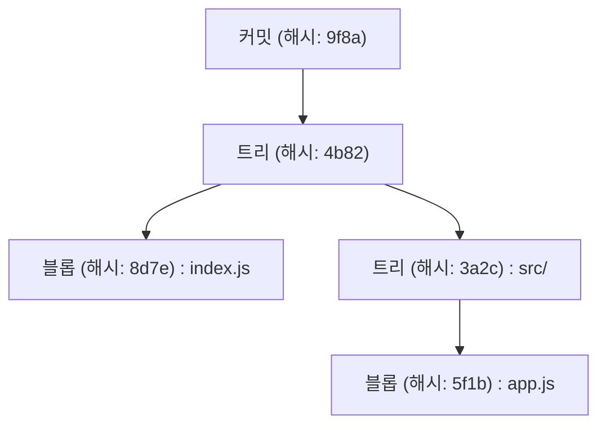
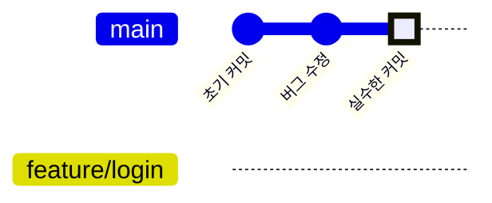
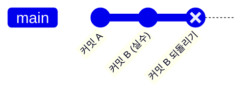
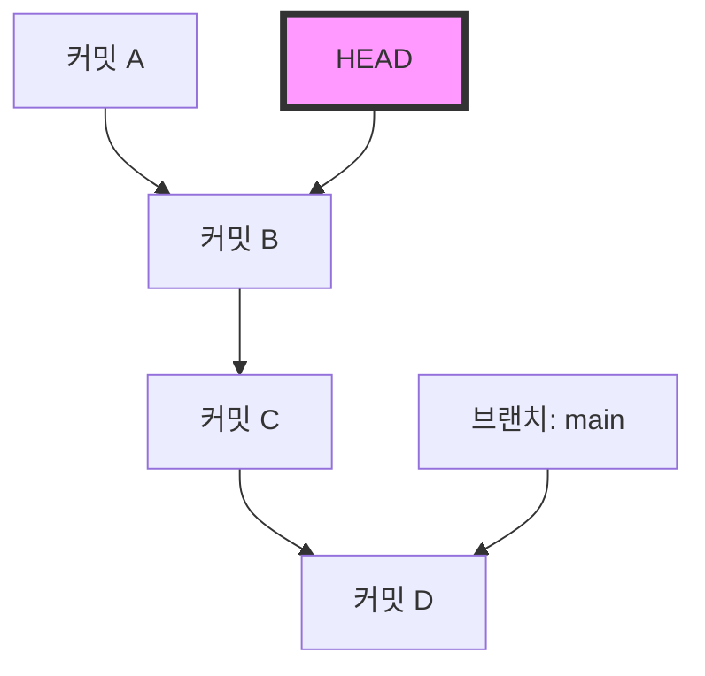
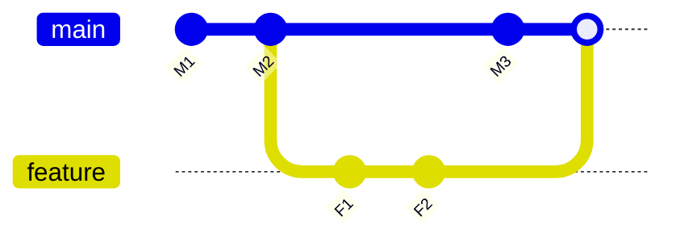

# Git 초보자가 빠지기 쉬운 실수와 해결 명령어 모음 (충돌 해결 등)

## 1. 시작하며: 왜 Git에서 실수를 하게 될까?

소프트웨어 개발에서 Git은 공기나 물처럼 없어서는 안 될 존재가 되었습니다. 하지만 많은 초보자(그리고 때로는 숙련자조차)에게 Git은 "무서운 마법의 블랙박스"처럼 느껴질 때가 있습니다. 커밋이 사라지거나, 의도하지 않은 브랜치에 대량의 변경 사항을 밀어넣어 버리거나, 본 적도 없는 충돌 에러 메시지가 화면을 가득 채우거나... 이런 "Git의 덫"에 빠지면 작업 진행이 완전히 멈춰버리고, 최악의 경우 소스 코드를 망가뜨리는 것은 아닐까 하는 공포에 휩싸입니다.

왜 Git은 이렇게나 어렵고 실수를 유발하기 쉬울까요? 그 가장 큰 이유는 "Git 내부에서 무슨 일이 일어나고 있는지 이해하지 못한 채, 표면적인 명령어만 암기해서 사용하고 있기 때문"입니다. Git은 분산 버전 관리 시스템(DVCS)으로서 견고한 설계 사상을 바탕으로 하고 있지만, 그 인터페이스(CLI)가 반드시 직관적인 것은 아닙니다.

이 글에서는 Git 초보자가 실무에서 자주 겪는 "실수"를 여러 케이스로 분류하고, 각각의 구체적인 해결책이 되는 명령어를 제시합니다. 하지만 단순한 명령어의 나열(치트 시트)로 만들지는 않겠습니다. "왜 그 실수가 일어나는가", "그 명령어를 실행하면 Git 내부에서 데이터가 어떻게 움직이는가"를 `.git` 디렉토리의 구조나 백그라운드에서 동작하는 Diff 알고리즘의 수학적 배경, Mermaid를 통한 도해를 곁들여 10,000자가 넘는 분량으로 철저하게 파헤쳐 봅니다.

이 글을 끝까지 읽었을 때, 당신은 "Git이 무섭다"는 감정에서 해방되어 오히려 "Git만큼 믿을 수 있는 파트너는 없다"고 확신할 수 있게 될 것입니다. 그러면 Git의 심연 속으로 뛰어들어 보겠습니다.

---

## 2. Git의 심연: `.git` 디렉토리의 내부 구조 이해하기

많은 트러블슈팅을 쉽게 하기 위한 첫걸음은 Git이 데이터를 어떻게 저장하고 있는지 아는 것입니다. 프로젝트의 루트 디렉토리에 존재하는 숨김 폴더 `.git`, 이것이야말로 Git의 심장부입니다. Git은 단순한 파일의 차이(패치)를 순서대로 기록해 나가는 시스템이 아니라, **스냅샷의 스트림**으로서 데이터를 관리하고 있습니다.

### 2.1 객체 모델: Blob, Tree, Commit

Git은 주로 3가지 객체를 사용하여 리포지토리의 상태를 표현합니다. 이 객체들은 `.git/objects`에 저장됩니다.

1. **Blob (Binary Large Object)**
   파일의 내용 자체를 저장하는 객체입니다. 파일 이름이나 권한 정보는 여기에 포함되지 않습니다. 순수한 바이트 열이 zlib으로 압축되며, SHA-1 해시값(40자의 16진수)에 의해 식별됩니다.
2. **Tree**
   디렉토리의 구조를 나타내는 객체입니다. Tree 객체는 다른 Tree 객체(하위 디렉토리)나 Blob 객체(파일)에 대한 포인터(SHA-1 해시값), 그리고 그 파일들의 이름, 접근 권한을 포함합니다. UNIX의 디렉토리와 같은 역할을 합니다.
3. **Commit**
   어느 시점에서의 리포지토리 전체의 최상위 Tree 객체에 대한 포인터와, 메타데이터(작성자, 커밋 일시, 커밋 메시지), 그리고 직전 커밋(부모 커밋)에 대한 포인터를 유지합니다.



### 2.2 HEAD와 참조(Refs)의 정체

Git에서 작업하다 보면 자주 눈에 띄는 `HEAD`라는 단어. 이것은 현재 체크아웃하고 있는 브랜치(또는 커밋)를 가리키는 **심볼릭 참조(Symbolic Reference)**입니다.
`.git/HEAD`라는 파일을 텍스트 에디터로 열어보면 다음과 같은 문자열이 적혀 있습니다.

```text
ref: refs/heads/main
```

이것은 "현재 상태는 `main` 브랜치의 끝에 있다"는 것을 의미합니다. 그리고 `.git/refs/heads/main`을 열면 거기에 40자의 SHA-1 해시가 적혀 있으며, 이것이 최신 Commit 객체를 가리키고 있는 것입니다.
Git의 브랜치란, 단순히 특정 커밋을 가리키는 가벼운 포인터(파일)에 불과합니다. 이 사실을 알고 있는 것만으로 "브랜치를 삭제하면 파일이 전부 사라지는 거 아냐?" 하는 공포가 사라집니다.

---

## 3. 수학으로 읽어내는 Git: Diff 알고리즘과 해시 함수

Git이 충돌을 감지하거나 파일의 차이를 표시할 때, 내부에서는 고도의 알고리즘이 동작하고 있습니다.

### 3.1 Myers의 Diff 알고리즘

Git의 기본 차이 감지 알고리즘은 Eugene W. Myers가 고안한 알고리즘입니다. 2개의 텍스트 파일 $A$와 $B$가 있을 때, $A$를 $B$로 변환하기 위한 "최소의 편집 절차(삽입과 삭제)"를 찾는 문제는 그래프 이론에서의 최단 경로 문제로 모델화할 수 있습니다.

문자열의 길이를 각각 $N, M$이라 하고, 합계를 $V = N + M$이라고 합니다. Myers의 알고리즘에서는 편집 거리(Edit Distance) $D$를 탐색합니다. 이 알고리즘의 시간 복잡도는 이하의 식으로 표현됩니다.

$$ \mathcal{O}(V \cdot D) $$

여기서 파일 간의 차이가 작을(즉 $D$가 작을) 경우, 알고리즘은 매우 고속 $\mathcal{O}(V)$으로 동작합니다. 하지만 파일이 완전히 다를 경우 $D \approx V$가 되어, 최악 계산량은 $\mathcal{O}(V^2)$가 됩니다.

### 3.2 Patience Diff와 Histogram Diff

Myers의 알고리즘은 우수하지만, 함수나 클래스의 순서를 크게 바꾼 경우 등에 인간에게 직관적이지 않은 (의미가 통하지 않는) 차이를 생성할 때가 있습니다. 이를 해결하기 위해 Git은 `Patience Diff`와 `Histogram Diff`를 구현하고 있습니다.

Patience Diff는 "양쪽 파일에 1번만 등장하는 유니크한 줄"에 주목하여, 그것들의 최장 공통 부분 수열(Longest Common Subsequence: LCS)을 찾습니다. 유니크한 요소의 수를 $U$라고 하면, LCS 계산은 이하의 계산량으로 풀 수 있습니다.

$$ \mathcal{O}(U \log U) $$

충돌 해결이 어렵다고 느껴질 때는 `git diff --histogram`이나 병합 전략에 이 알고리즘을 지정하는 것(`git merge -s recursive -X histogram`)이 하나의 방법입니다.

### 3.3 SHA-1과 충돌 확률

Git은 모든 객체를 SHA-1 해시값으로 관리합니다. 해시 공간의 크기는 $2^{160}$입니다. 해시의 충돌(다른 콘텐츠가 같은 해시값을 가지는 것)이 일어날 확률에 대해 생일 역설(Birthday Paradox)을 사용하여 근사하면, 충돌 확률 $p$가 50%가 되기 위해 필요한 객체 수 $k$는 다음과 같습니다.

$$ k \approx \sqrt{2 \ln(2)} \cdot 2^{80} \approx 1.2 \times 2^{80} $$

이것은 천문학적인 숫자이며, 일반적인 소프트웨어 개발에 있어서 의도치 않게 충돌이 발생할 확률은 실질적으로 제로입니다. 그 때문에 Git은 해시값을 "절대적인 고유 ID"로서 신뢰하며 동작하고 있습니다.

---

## 4. 케이스 스터디 1: 잘못된 브랜치에 커밋해 버렸다!

**【상황】**
`main` 브랜치에서 작업하고 있다는 것을 깨닫지 못하고 새로운 기능의 코드를 팍팍 작성해 버렸고, 심지어 `git commit`까지 해버렸다. 원래는 `feature/login`이라는 브랜치를 만들어서 거기서 작업해야 했는데!

### 해결 방법: `git reset`과 브랜치 생성

Git에서 커밋은 독립된 객체이며, 브랜치는 그저 포인터입니다. 따라서 "새로운 브랜치를 만든 다음, 현재 브랜치의 포인터를 되감는" 조작으로 순식간에 해결할 수 있습니다.

```bash
# 1. 현재의 커밋(실수로 만든 커밋)을 가리키는 새로운 브랜치를 생성한다
$ git branch feature/login

# 2. main 브랜치의 포인터를 1개 이전 커밋(HEAD~1)으로 되감는다
# --keep을 사용하면 작업 디렉토리의 커밋되지 않은 변경을 유지하면서 안전하게 리셋할 수 있습니다.
$ git reset --keep HEAD~1

# 3. 올바른 브랜치로 전환한다
$ git checkout feature/login
```

### 도해: 내부에서 무슨 일이 일어났을까?

Mermaid의 `gitGraph`를 사용하여 이때의 브랜치 포인터 이동을 시각화해 봅시다.


처음에는 `main`과 `HEAD`가 "실수한 커밋"을 가리키고 있었지만, `git branch feature/login`에 의해 거기에 새로운 포인터가 만들어집니다. 그 후 `git reset`에 의해 `main` 포인터만 "버그 수정"의 위치로 돌아가는 것입니다. 객체 자체는 아무것도 삭제되지 않았습니다.

---

## 5. 케이스 스터디 2: 이미 푸시한 커밋을 취소하고 싶다!

**【상황】**
심야의 텐션으로 작성한 버그투성이 코드를 커밋하고, 게다가 `git push origin main`으로 원격 리포지토리에 공개해 버렸다. 중대한 버그를 깨닫고 사색이 된다.

### 해결책 1: 역사를 상쇄하는 `git revert` (권장·안전)

팀 개발에 있어서, 이미 푸시된 커밋의 이력을 `git reset` 등으로 조작하는 것은 엄금입니다. 다른 개발자의 로컬 리포지토리와 정합성이 맞지 않게 됩니다. 올바른 접근 방식은 **"실수한 커밋의 변경을 완전히 상쇄하는, 반대의 커밋을 새로 만드는"** 것입니다. 이것이 `git revert`입니다.

```bash
# 최신 커밋을 상쇄하는 커밋을 생성
$ git revert HEAD
[main 7f3a8b2] Revert "실수한 커밋의 메시지"
 1 file changed, 1 insertion(+), 10 deletions(-)

# 원격으로 푸시
$ git push origin main
```


역사는 계속 진행되며, 코드의 상태만 원래대로 돌아갑니다.

### 해결책 2: 역사를 조작하는 `git push --force-with-lease`

만약 당신이 혼자서만 사용하는 브랜치에 푸시한 직후라면, 역사를 다시 쓰는 것도 용인됩니다.

```bash
# 로컬에서 커밋을 리셋하고 수정
$ git reset --hard HEAD~1
$ git add .
$ git commit -m "Correct implementation"

# 원격의 역사를 강제 덮어쓰기
$ git push origin feature/login --force-with-lease
```
`--force-with-lease`는 다른 사람의 작업을 실수로 덮어써 버리는 사고를 막기 위한 안전한 강제 푸시입니다.

---

## 6. 케이스 스터디 3: 작업 도중에 다른 브랜치로 전환하고 싶다 (Stash의 마법)

**【상황】**
`feature/A` 브랜치에서 새로운 기능 구현 중, 소스 코드는 아직 컴파일도 통과하지 않는 어중간한 상태. 갑자기 상사로부터 "`main` 브랜치의 운영 환경에 긴급 버그가 있으니 지금 당장 고쳐줘!"라는 지시가 날아왔다.

### 해결 방법: `git stash`에 의한 대피

`git stash`는 아직 커밋되지 않은 변경 사항을 임시 영역으로 대피시키는 명령어입니다.

```bash
# 1. 작업 중인 변경 사항을 대피
$ git stash push -m "WIP: feature A partially implemented"

# 2. main 브랜치로 전환 가능해짐
$ git checkout main
# ...(긴급 버그 수정 작업을 수행하고, 커밋·푸시)...

# 3. 작업이 끝나면 원래 브랜치로 돌아감
$ git checkout feature/A

# 4. 대피해 두었던 변경 사항을 복원
$ git stash pop
```

`git stash`를 실행하면 Git은 내부적으로 2개의 특수한 커밋 객체를 생성하고 `refs/stash`라는 참조에 저장합니다. 즉, Stash도 결국 "이름이 없는 임시 커밋"인 것입니다.

---

## 7. 케이스 스터디 4: 공포의 "Detached HEAD" 상태

**【상황】**
과거 특정 시점의 코드를 확인하고 싶어서 `git checkout 9f8a7b6`을 실행했다. 그랬더니 `You are in 'detached HEAD' state.`라고 표시되었다. 그대로 커밋했는데, 브랜치를 전환했더니 커밋이 사라져 버렸다!

### Detached HEAD의 메커니즘

보통 `HEAD`는 `refs/heads/main` 등의 브랜치를 가리키고 있습니다. 하지만 특정 커밋을 직접 체크아웃하면, `HEAD`가 직접 커밋 객체를 가리키게 됩니다. 이것을 **Detached HEAD(분리된 HEAD)**라고 부릅니다.


이 상태에서 커밋을 쌓아도, 어떤 브랜치도 그 새로운 커밋을 추적해주지 않습니다. 다른 브랜치로 전환하는 순간 새로운 커밋은 미아가 됩니다.

### 해결책: 새로운 브랜치로 저장하기

현재 있는 위치에 새로운 브랜치를 생성하면 해결됩니다.

```bash
# 현재 HEAD의 위치에 새로운 브랜치를 만들고 거기로 전환한다
$ git checkout -b feature/recovered-work
```

---

## 8. 케이스 스터디 5: 병합(Merge)과 리베이스(Rebase)에서의 충돌 해결

**【상황】**
`git merge`나 `git rebase`를 실행했더니 `CONFLICT (content)`라고 표시되며 프로세스가 중단되었다.

### 병합(Merge)과 리베이스(Rebase)의 차이

1. **Merge(병합)**
   2개의 브랜치의 최신 커밋과 공통의 조상을 사용한 3-way merge를 수행하여, 병합 커밋을 생성합니다.
2. **Rebase(리베이스)**
   현재 브랜치의 커밋을 임시 저장하고, 대상의 끝에 다시 적용합니다. 역사가 일직선이 됩니다.



### 충돌 해결법

충돌이 발생한 파일에는 다음과 같은 마커가 삽입되어 있습니다.

```javascript
<<<<<<< HEAD
const apiUrl = "https://api.production.example.com";
=======
const apiUrl = "https://api.staging.example.com";
>>>>>>> feature/new-api
```

해결 절차는 극히 간단합니다.

1. **마커를 삭제하고 올바른 코드로 수정한다.**
   ```javascript
   const apiUrl = process.env.NODE_ENV === 'production' 
       ? "https://api.production.example.com" 
       : "https://api.staging.example.com";
   ```
2. **해결한 파일을 스테이징에 추가한다.**
   `git add`는 "충돌을 해결했다는 것을 Git에 알리는" 역할을 합니다.
   ```bash
   $ git add index.js
   ```
3. **프로세스를 완료시킨다.**
   ```bash
   # 병합의 경우
   $ git commit -m "Resolve merge conflict in index.js"
   
   # 리베이스의 경우
   $ git rebase --continue
   ```

패닉에 빠진다면 `$ git merge --abort` 또는 `$ git rebase --abort`로 언제든지 중단할 수 있습니다.

---

## 9. 케이스 스터디 6: 커밋 내역이 엉망진창! `git rebase -i`

**【상황】**
"오타 수정", "역시 수정", "테스트 추가" 등 자잘한 커밋이 대량으로 발생해 버렸다. 이대로 `main`에 병합하면 내역이 지저분해진다.

### 해결책: 인터랙티브 리베이스

`git rebase -i` (interactive)를 사용하면 과거 커밋의 순서를 바꾸거나, 여러 커밋을 하나로 합치거나(squash), 커밋 메시지를 수정하거나 할 수 있습니다.

```bash
# 최근 3개의 커밋을 정리한다
$ git rebase -i HEAD~3
```
에디터가 열리며 다음과 같이 표시됩니다.
```text
pick 1a2b3c4 오타 수정
pick 2b3c4d5 역시 수정
pick 3c4d5e6 테스트 추가
```
이것을 다음과 같이 고쳐 씁니다.
```text
pick 1a2b3c4 기능 X 구현
squash 2b3c4d5 역시 수정
squash 3c4d5e6 테스트 추가
```
저장하고 닫으면 이 3개의 커밋이 하나로 아름답게 통합됩니다.

---

## 10. 케이스 스터디 7: 버그가 언제 유입되었는지 모르겠다! `git bisect`

**【상황】**
현재 `main` 브랜치에는 버그가 있지만, 1달 전 릴리스 때는 정상이었다. 어느 커밋에서 버그가 섞여 들어왔는지 특정하고 싶지만, 커밋이 100개가 넘어서 수작업으로는 무리!

### 해결책: 이진 탐색을 통한 버그 특정

Git에는 버그가 유입된 커밋을 수학적인 이진 탐색(Binary Search)으로 찾아내는 도구가 내장되어 있습니다. 계산량은 $\mathcal{O}(\log N)$이므로, 1000개의 커밋이 있어도 약 10번의 테스트로 특정할 수 있습니다.

```bash
# 탐색을 시작
$ git bisect start

# 현재 커밋에는 버그가 있다 (bad)
$ git bisect bad

# 1달 전(예를 들어 해시가 a1b2c3d)은 정상이었다 (good)
$ git bisect good a1b2c3d

# Git이 자동으로 중간의 커밋을 체크아웃하므로 테스트를 실행한다
# 테스트가 성공했다면:
$ git bisect good
# 테스트가 실패했다면:
$ git bisect bad
```
이것을 반복하는 것만으로 Git이 "이 커밋이 첫 번째 Bad 커밋입니다"라고 정확히 알려줍니다. 끝나면 `$ git bisect reset`으로 원래 상태로 돌아갑니다.

---

## 11. 궁극의 안전망: `git reflog`

Git에서의 모든 "실수"에 대한 최종 오의가 `git reflog`입니다. Git은 로컬에서의 조작 이력(HEAD의 이동 이력)을 일정 기간 모두 기록하고 있습니다. 브랜치를 삭제해 버리거나, 잘못된 리셋을 해버리거나 해도, `git reflog`로 과거의 해시를 찾아내어 거기에 `git reset --hard`하는 것만으로 복구 가능합니다.

```bash
$ git reflog
9f8a7b6 (HEAD -> main) HEAD@{0}: commit: Add new feature
1a2b3c4 HEAD@{1}: reset: moving to HEAD~1
```

## 12. 마치며

Git 초보자가 빠지기 쉬운 실수와 그 배경에 있는 Git의 구조, 그리고 해결 방법에 대해 매우 상세하게 해설해 보았습니다. 잘못된 브랜치에 커밋, 이미 푸시된 커밋 취소, Stash의 활용, Detached HEAD에서의 생환, 그리고 충돌 해결. 이 모든 것에서 중요한 것은 "Git이 이면에서 어떤 객체와 포인터를 조작하고 있는가"를 이미지화하는 것입니다.

수식으로 표현되는 엄격한 Diff 알고리즘에 의해 파일의 차이가 계산되고, 암호학적인 해시 함수에 의해 역사의 정합성이 담보되고 있습니다. 이 아름다운 설계 사상을 이해한다면, Git은 결코 "정체를 알 수 없는 블랙박스"가 아니라 당신의 소스 코드를 굳건히 지키는 최강의 방패라는 것을 알 수 있을 것입니다.

다음번에 "아차!" 하는 생각이 들 때는, 당황해서 터미널을 닫지 말고 심호흡을 한 뒤 `git status`를 입력해 보세요. Git은 반드시 복구를 위한 힌트를 당신에게 제시해 줄 것입니다.
