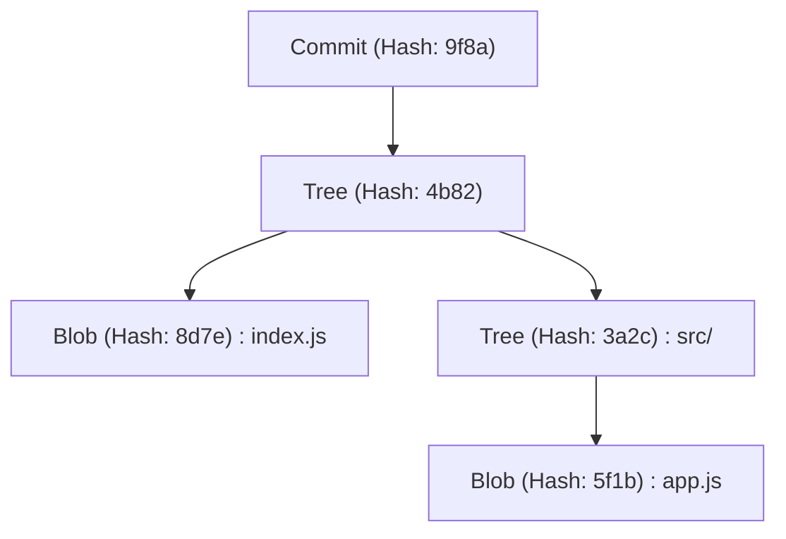
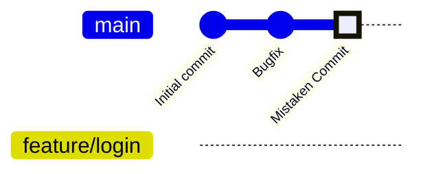
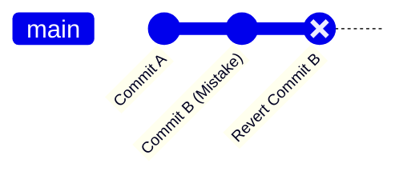
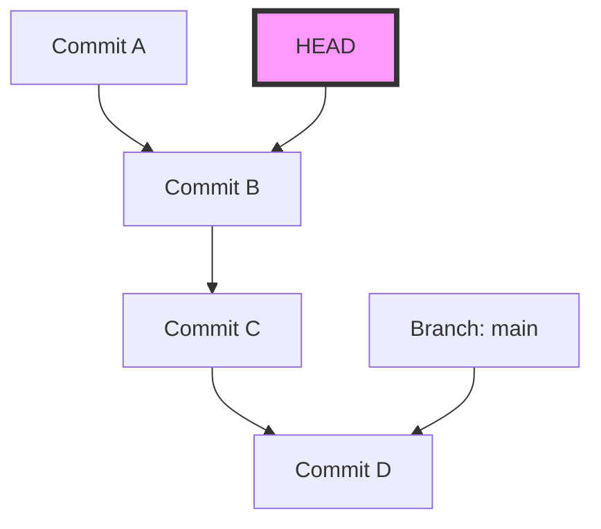
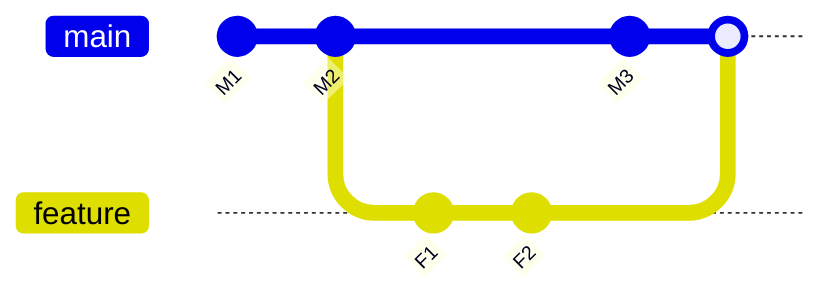

# Git初心者が陥りやすいミスと解決コマンド集（コンフリクト解消など）

## 1. はじめに：なぜGitでミスをしてしまうのか？

ソフトウェア開発において、Gitは空気や水のように不可欠な存在となっています。しかし、多くの初心者（そして時として熟練者でさえ）にとって、Gitは「恐ろしい魔法のブラックボックス」のように感じられることがあります。コミットが消えたり、意図しないブランチに大量の変更を押し込んでしまったり、見たこともないコンフリクトのエラーメッセージが画面を埋め尽くしたり……。こうした「Gitの罠」にハマると、作業の進行が完全にストップしてしまい、最悪の場合はソースコードを破壊してしまうのではないかという恐怖に駆られます。

なぜGitはこれほどまでに難しく、ミスを誘発しやすいのでしょうか？その最大の理由は、「Gitの内部で何が起こっているのかを理解せずに、表面的なコマンドだけを暗記して使っているから」です。Gitは、分散型バージョン管理システム（DVCS）としての堅牢な設計思想に基づいていますが、そのインターフェース（CLI）は必ずしも直感的ではありません。

この記事では、Git初心者が現場で頻繁に遭遇する「やらかし（よくあるミス）」を多数のケースに分類し、それぞれの具体的な解決策となるコマンドを提示します。しかし、単なるコマンドの羅列（チートシート）にはしません。「なぜそのミスが起きるのか」「そのコマンドを実行するとGitの内部でデータがどのように動くのか」を、`.git` ディレクトリの構造や、背後で動いているDiffアルゴリズムの数学的背景、Mermaidによる図解を交えて、10,000文字を超えるボリュームで徹底的に深掘りします。

この記事を最後まで読み終えたとき、あなたは「Gitが怖い」という感情から解放され、むしろ「Gitほど信頼できる相棒はいない」と確信できるようになるはずです。それでは、Gitの深淵なる世界へ飛び込んでいきましょう。

---

## 2. Gitの深淵：`.git` ディレクトリの内部構造を理解する

多くのトラブルシューティングを容易にするための第一歩は、Gitがデータをどのように保存しているかを知ることです。あなたのプロジェクトのルートディレクトリに存在する隠しフォルダ `.git`、これこそがGitの心臓部です。Gitは、単なるファイルの差分（パッチ）を順に記録していくシステムではなく、**スナップショットのストリーム**としてデータを管理しています。

### 2.1 オブジェクトモデル：Blob, Tree, Commit

Gitは主に3つのオブジェクトを使用してリポジトリの状態を表現します。これらのオブジェクトは `.git/objects` に保存されます。

1. **Blob (Binary Large Object)**
   ファイルの内容そのものを保存するオブジェクトです。ファイル名や権限の情報はここには含まれません。純粋なバイト列がzlibで圧縮され、SHA-1ハッシュ値（40文字の16進数）によって識別されます。
2. **Tree**
   ディレクトリの構造を表すオブジェクトです。Treeオブジェクトは、他のTreeオブジェクト（サブディレクトリ）やBlobオブジェクト（ファイル）へのポインタ（SHA-1ハッシュ値）、およびそれらのファイル名、アクセス権限を含みます。UNIXのディレクトリのような役割を果たします。
3. **Commit**
   ある時点でのリポジトリ全体のトップレベルのTreeオブジェクトへのポインタと、メタデータ（作成者、コミット日時、コミットメッセージ）、そして直前のコミット（親コミット）へのポインタを保持します。



### 2.2 HEADと参照（Refs）の正体

Gitで作業していると頻繁に目にする `HEAD` という単語。これは現在チェックアウトしているブランチ（またはコミット）を指し示す**シンボリック参照（Symbolic Reference）**です。
`.git/HEAD` というファイルをテキストエディタで開いてみると、次のような文字列が書かれています。

```text
ref: refs/heads/main
```

これは、「現在の状態は `main` ブランチの先端にある」ということを意味します。そして、`.git/refs/heads/main` を開くと、そこに40文字のSHA-1ハッシュが書かれており、これが最新のCommitオブジェクトを指し示しているのです。
Gitのブランチとは、単に特定のコミットを指し示す軽量なポインタ（ファイル）に過ぎません。この事実を知っているだけで、「ブランチを削除したらファイルが全部消えるのでは？」という恐怖がなくなります。

---

## 3. 数学で読み解くGit：Diffアルゴリズムとハッシュ関数

Gitがコンフリクトを検知したり、ファイルの差分を表示したりする際、内部では高度なアルゴリズムが動作しています。

### 3.1 MyersのDiffアルゴリズム

Gitのデフォルトの差分検出アルゴリズムは、Eugene W. Myersによって考案されたアルゴリズムです。2つのテキストファイル $A$ と $B$ があるとき、$A$ を $B$ に変換するための「最小の編集手順（挿入と削除）」を見つける問題は、グラフ理論における最短経路問題としてモデル化できます。

文字列の長さをそれぞれ $N, M$ とし、合計を $V = N + M$ とします。Myersのアルゴリズムでは、編集距離（Edit Distance） $D$ を探索します。このアルゴリズムの時間計算量は以下の式で表されます。

$$ \mathcal{O}(V \cdot D) $$

ここで、ファイル間の差分が小さい（つまり $D$ が小さい）場合、アルゴリズムは非常に高速 $\mathcal{O}(V)$ で動作します。しかし、ファイルが全く異なる場合、$D \approx V$ となり、最悪計算量は $\mathcal{O}(V^2)$ となります。

### 3.2 Patience Diff と Histogram Diff

Myersのアルゴリズムは優秀ですが、関数やクラスの順序を大きく入れ替えた場合などに、人間にとって直感的ではない（意味の通らない）差分を生成することがあります。これを解決するためにGitは `Patience Diff` と `Histogram Diff` を実装しています。

Patience Diffは、「両方のファイルに1度だけ登場するユニークな行」に着目し、それらの最長共通部分列（Longest Common Subsequence: LCS）を見つけます。ユニークな要素の数を $U$ とすると、LCSの計算は以下の計算量で解くことができます。

$$ \mathcal{O}(U \log U) $$

コンフリクト解消が難しいと感じた時は、`git diff --histogram` や、マージ戦略にこのアルゴリズムを指定する（`git merge -s recursive -X histogram`）のが一つの手です。

### 3.3 SHA-1と衝突確率

Gitは全てのオブジェクトをSHA-1ハッシュ値で管理します。ハッシュ空間の大きさは $2^{160}$ です。ハッシュの衝突（異なるコンテンツが同じハッシュ値を持つこと）が起きる確率について、誕生日のパラドックス（Birthday Paradox）を用いて近似すると、衝突確率 $p$ が50%になるために必要なオブジェクト数 $k$ は以下のようになります。

$$ k \approx \sqrt{2 \ln(2)} \cdot 2^{80} \approx 1.2 \times 2^{80} $$

これは天文学的な数字であり、通常のソフトウェア開発において意図せず衝突が発生する確率は実質的にゼロです。そのため、Gitはハッシュ値を「絶対的な一意のID」として信頼して動作しています。

---

## 4. ケーススタディ1：間違ったブランチにコミットしてしまった！

**【状況】**
`main` ブランチで作業していることに気づかず、新機能のコードをバリバリ書いてしまい、あろうことか `git commit` までしてしまった。本来は `feature/login` というブランチを作ってそこで作業するはずだったのに！

### 解決方法：`git reset` とブランチの作成

Gitでは、コミットは独立したオブジェクトであり、ブランチはただのポインタです。したがって、「新しいブランチを作ってから、現在のブランチのポインタを巻き戻す」という操作で瞬時に解決できます。

```bash
# 1. 現在のコミット（間違えて作ったコミット）を指す新しいブランチを作成する
$ git branch feature/login

# 2. mainブランチのポインタを1つ前のコミット（HEAD~1）に巻き戻す
# --keep を使うと、作業ディレクトリの未コミットの変更を維持しつつ安全にリセットできます。
$ git reset --keep HEAD~1

# 3. 正しいブランチに切り替える
$ git checkout feature/login
```

### 図解：内部で何が起きたのか？

Mermaidの `gitGraph` を用いて、この時のブランチポインタの移動を可視化してみましょう。


最初は `main` と `HEAD` が "Mistaken Commit" を指していましたが、`git branch feature/login` により、そこに新しいポインタが作られます。その後 `git reset` によって `main` ポインタだけが "Bugfix" の位置に戻るのです。オブジェクト自体は何も削除されていません。

---

## 5. ケーススタディ2：プッシュ済みのコミットを取り消したい！

**【状況】**
深夜のテンションで書いたバグだらけのコードをコミットし、さらに `git push origin main` でリモートリポジトリに公開してしまった。重大なバグに気づき青ざめる。

### 解決策1：歴史を打ち消す `git revert` （推奨・安全）

チーム開発において、すでにプッシュされたコミットの履歴を `git reset` などで改ざんすることは厳禁です。他の開発者のローカルリポジトリと整合性が取れなくなります。正しいアプローチは、**「間違えたコミットの変更を完全に打ち消す、逆のコミットを新しく作る」**ことです。これが `git revert` です。

```bash
# 最新のコミットを打ち消すコミットを作成
$ git revert HEAD
[main 7f3a8b2] Revert "間違えたコミットのメッセージ"
 1 file changed, 1 insertion(+), 10 deletions(-)

# リモートへプッシュ
$ git push origin main
```


歴史は進み続け、コードの状態だけが元に戻ります。

### 解決策2：歴史を改ざんする `git push --force-with-lease`

もしあなたが自分一人しか使っていないブランチにプッシュした直後であれば、歴史を書き換えることも容認されます。

```bash
# 手元でコミットをリセットして修正
$ git reset --hard HEAD~1
$ git add .
$ git commit -m "Correct implementation"

# リモートの歴史を強制上書き
$ git push origin feature/login --force-with-lease
```
`--force-with-lease` は、他人の作業を誤って上書きしてしまう事故を防ぐための安全な強制プッシュです。

---

## 6. ケーススタディ3：作業途中で別のブランチに切り替えたい（Stashの魔法）

**【状況】**
`feature/A` ブランチで新機能の実装中、ソースコードはまだコンパイルも通らない中途半端な状態。突然、上司から「`main` ブランチの本番環境に緊急のバグがあるから、今すぐ直してくれ！」と指示が飛んできた。

### 解決方法：`git stash` による退避

`git stash` は、未コミットの変更を一時的な領域に退避させるコマンドです。

```bash
# 1. 作業中の変更を退避
$ git stash push -m "WIP: feature A partially implemented"

# 2. mainブランチに切り替え可能に
$ git checkout main
# ...（緊急バグ修正作業を行い、コミット・プッシュ）...

# 3. 作業が終わったら元のブランチに戻る
$ git checkout feature/A

# 4. 退避していた変更を復元
$ git stash pop
```

`git stash` を実行すると、Gitは内部的に2つの特殊なコミットオブジェクトを生成し、`refs/stash` という参照に保存します。つまり、Stashも結局のところ「名前のつかない一時的なコミット」なのです。

---

## 7. ケーススタディ4：恐怖の "Detached HEAD" 状態

**【状況】**
過去の特定の時点のコードを確認したくて `git checkout 9f8a7b6` と実行した。すると `You are in 'detached HEAD' state.` と表示された。そのままコミットしたが、ブランチを切り替えたらコミットが消えてしまった！

### Detached HEADのメカニズム

通常 `HEAD` は `refs/heads/main` などのブランチを指し示しています。しかし、特定のコミットを直接チェックアウトすると、`HEAD` が直接コミットオブジェクトを指すようになります。これを **Detached HEAD（分離したHEAD）** と呼びます。


この状態でコミットを重ねても、どのブランチもその新しいコミットを追跡してくれません。他のブランチに切り替えた瞬間、新しいコミットは迷子になります。

### 解決策：新しいブランチとして保存する

現在いる場所に新しいブランチを作成すれば解決します。

```bash
# 現在のHEADの位置に新しいブランチを作り、そこに切り替える
$ git checkout -b feature/recovered-work
```

---

## 8. ケーススタディ5：マージとリベースでのコンフリクト解消

**【状況】**
`git merge` や `git rebase` を実行したところ、`CONFLICT (content)` と表示され、プロセスが中断された。

### マージ（Merge）とリベース（Rebase）の違い

1. **Merge（マージ）**
   2つのブランチの最新コミットと共通の祖先を用いた3-way mergeを行い、マージコミットを作成します。
2. **Rebase（リベース）**
   現在のブランチのコミットを一時保存し、ターゲットの先端に適用し直します。歴史が一直線になります。



### コンフリクトの解消法

コンフリクトが発生したファイルには、以下のようなマーカーが挿入されています。

```javascript
<<<<<<< HEAD
const apiUrl = "https://api.production.example.com";
=======
const apiUrl = "https://api.staging.example.com";
>>>>>>> feature/new-api
```

解決手順は極めてシンプルです。

1. **マーカーを削除し、正しいコードに修正する。**
   ```javascript
   const apiUrl = process.env.NODE_ENV === 'production' 
       ? "https://api.production.example.com" 
       : "https://api.staging.example.com";
   ```
2. **解決したファイルをステージングに追加する。**
   `git add` は「コンフリクトを解決したことをGitに伝える」役割を持っています。
   ```bash
   $ git add index.js
   ```
3. **プロセスを完了させる。**
   ```bash
   # マージの場合
   $ git commit -m "Resolve merge conflict in index.js"
   
   # リベースの場合
   $ git rebase --continue
   ```

パニックになったら `$ git merge --abort` または `$ git rebase --abort` でいつでも中止できます。

---

## 9. ケーススタディ6：コミット履歴がぐちゃぐちゃ！ `git rebase -i`

**【状況】**
「タイポ修正」「やっぱり修正」「テスト追加」など、細かいコミットが大量に発生してしまった。このまま `main` にマージすると履歴が汚くなる。

### 解決策：インタラクティブリベース

`git rebase -i`（interactive）を使うと、過去のコミットの順番を入れ替えたり、複数のコミットを1つにまとめたり（squash）、コミットメッセージを修正したりできます。

```bash
# 直近3つのコミットを整理する
$ git rebase -i HEAD~3
```
エディタが開き、以下のように表示されます。
```text
pick 1a2b3c4 タイポ修正
pick 2b3c4d5 やっぱり修正
pick 3c4d5e6 テスト追加
```
これを以下のように書き換えます。
```text
pick 1a2b3c4 機能Xの実装
squash 2b3c4d5 やっぱり修正
squash 3c4d5e6 テスト追加
```
保存して閉じると、これら3つのコミットが1つに美しく統合されます。

---

## 10. ケーススタディ7：バグがいつ混入したかわからない！ `git bisect`

**【状況】**
現在の `main` ブランチにはバグがあるが、1ヶ月前のリリース時は正常だった。どのコミットでバグが混入したのか特定したいが、コミットが100個以上あって手作業では無理！

### 解決策：二分探索によるバグ特定

Gitには、バグが混入したコミットを数学的な二分探索（Binary Search）で見つけ出すツールが組み込まれています。計算量は $\mathcal{O}(\log N)$ なので、1000個のコミットがあっても約10回のテストで特定できます。

```bash
# 探索を開始
$ git bisect start

# 現在のコミットにはバグがある（bad）
$ git bisect bad

# 1ヶ月前（例えばハッシュが a1b2c3d）は正常だった（good）
$ git bisect good a1b2c3d

# Gitが自動的に中間のコミットをチェックアウトするので、テストを実行する
# テストが成功したら：
$ git bisect good
# テストが失敗したら：
$ git bisect bad
```
これを繰り返すだけで、Gitが「このコミットが最初のBadコミットです」と正確に教えてくれます。終わったら `$ git bisect reset` で元の状態に戻ります。

---

## 11. 究極のセーフティネット：`git reflog`

Gitでのあらゆる「やらかし」に対する最終奥義が `git reflog` です。Gitはローカルでの操作履歴（HEADの移動履歴）を一定期間すべて記録しています。ブランチを削除してしまったり、誤ったリセットをしてしまったりしても、`git reflog` で過去のハッシュを見つけ出し、そこに `git reset --hard` するだけで復旧可能です。

```bash
$ git reflog
9f8a7b6 (HEAD -> main) HEAD@{0}: commit: Add new feature
1a2b3c4 HEAD@{1}: reset: moving to HEAD~1
```

## 12. おわりに

Git初心者が陥りやすいミスと、その背後にあるGitの仕組み、そして解決方法について非常に詳細に解説してきました。間違ったブランチへのコミット、プッシュ済みコミットの打ち消し、Stashの活用、Detached HEADからの生還、そしてコンフリクトの解消。これらすべてにおいて重要なのは、「Gitが背後でどのようなオブジェクトとポインタを操作しているのか」をイメージすることです。

数式で表されるような厳格なDiffアルゴリズムによってファイルの差分が計算され、暗号学的なハッシュ関数によって歴史の整合性が担保されている。この美しい設計思想を理解すれば、Gitは決して「得体の知れないブラックボックス」ではなく、あなたのソースコードを強固に守る最強の盾であることがわかるはずです。

次回「やっちまった！」と思ったときは、慌ててターミナルを閉じるのではなく、深呼吸して `git status` を打ち込んでみてください。Gitは必ず、復旧のためのヒントをあなたに提示してくれます。
