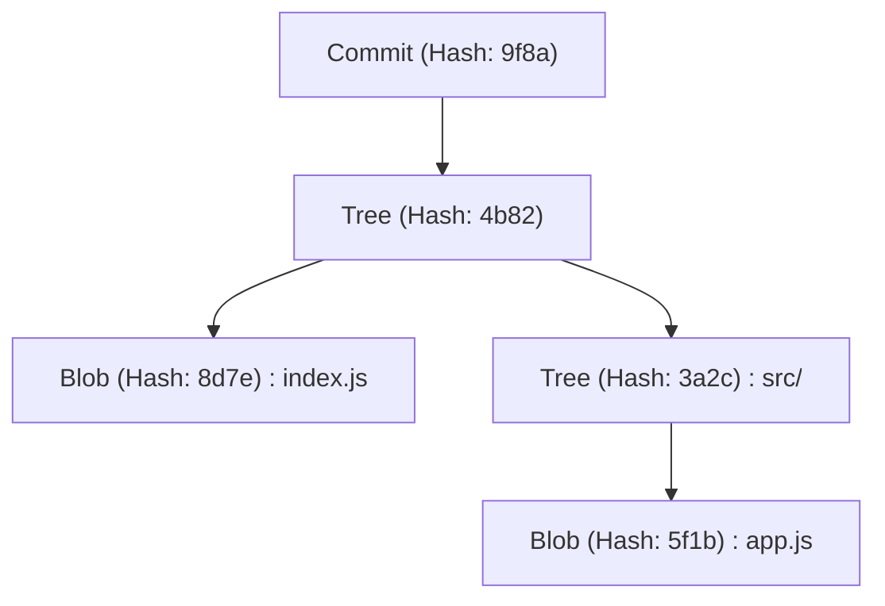
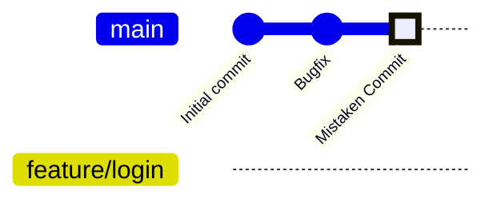
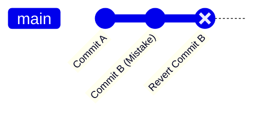
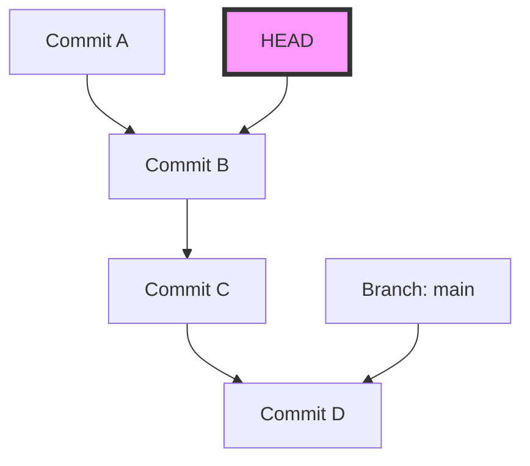
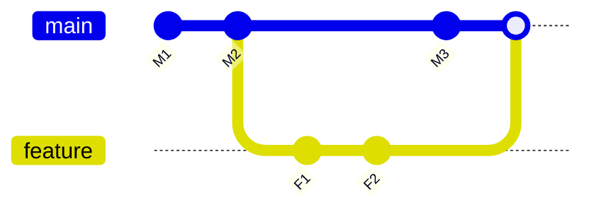

# Erros comuns de iniciantes no Git e comandos de solução (resolução de conflitos, etc.)

## 1. Introdução: Por que cometemos erros no Git?

No desenvolvimento de software, o Git tornou-se tão indispensável quanto o ar ou a água. No entanto, para muitos iniciantes (e às vezes até para os mais experientes), o Git pode parecer uma "terrível caixa preta mágica". Commits que desaparecem, grandes quantidades de alterações empurradas para a branch errada, ou mensagens de erro de conflito nunca vistas enchendo a tela... Ao cair nessas "armadilhas do Git", o progresso do trabalho é completamente interrompido e, no pior dos casos, você é tomado pelo medo de acabar destruindo o código-fonte.

Por que o Git é tão difícil e propenso a erros? O maior motivo é que "as pessoas decoram comandos superficiais e os usam sem entender o que está acontecendo dentro do Git". Embora o Git seja baseado em uma filosofia de design robusta como um sistema de controle de versão distribuído (DVCS), sua interface (CLI) nem sempre é intuitiva.

Neste artigo, categorizamos muitos "deslizes (erros comuns)" que os iniciantes no Git frequentemente encontram na prática, e apresentamos os comandos específicos de solução para cada um deles. No entanto, não será apenas uma lista de comandos (cheat sheet). Iremos explorar a fundo, com um volume de mais de 10.000 caracteres, "por que esses erros ocorrem" e "como os dados se movem internamente no Git ao executar esse comando", utilizando a estrutura do diretório `.git`, a base matemática do algoritmo Diff em segundo plano e diagramas no Mermaid.

Ao terminar de ler este artigo, você deverá estar livre do sentimento de "o Git assusta" e, em vez disso, estará convencido de que "não há parceiro mais confiável do que o Git". Então, vamos mergulhar no mundo profundo do Git.

---

## 2. O abismo do Git: Entendendo a estrutura interna do diretório `.git`

O primeiro passo para facilitar muitas resoluções de problemas é saber como o Git armazena os dados. A pasta oculta `.git` presente no diretório raiz do seu projeto é o próprio coração do Git. O Git não é apenas um sistema que registra sequencialmente as diferenças (patches) de arquivos, mas gerencia os dados como um **fluxo de snapshots**.

### 2.1 Modelo de objetos: Blob, Tree, Commit

O Git usa principalmente três objetos para representar o estado do repositório. Esses objetos são armazenados em `.git/objects`.

1. **Blob (Binary Large Object)**
   É o objeto que armazena o próprio conteúdo do arquivo. Informações como nome do arquivo ou permissões não estão incluídas aqui. Sequências de bytes puras são compactadas com zlib e identificadas por um valor de hash SHA-1 (40 caracteres hexadecimais).
2. **Tree**
   É o objeto que representa a estrutura de diretórios. O objeto Tree contém ponteiros (valores de hash SHA-1) para outros objetos Tree (subdiretórios) ou objetos Blob (arquivos), bem como seus nomes de arquivos e permissões de acesso. Desempenha um papel semelhante a um diretório UNIX.
3. **Commit**
   Mantém um ponteiro para o objeto Tree de nível superior do repositório em um determinado momento, metadados (autor, data e hora do commit, mensagem do commit) e um ponteiro para o commit imediatamente anterior (commit pai).



### 2.2 A verdadeira natureza do HEAD e das Referências (Refs)

Ao trabalhar com o Git, a palavra `HEAD` é vista com frequência. Esta é uma **referência simbólica (Symbolic Reference)** que aponta para a branch (ou commit) atualmente verificada (checked out).
Se você abrir o arquivo `.git/HEAD` em um editor de texto, verá uma string escrita assim:

```text
ref: refs/heads/main
```

Isso significa que "o estado atual está na ponta da branch `main`". E se você abrir `.git/refs/heads/main`, encontrará um hash SHA-1 de 40 caracteres, que aponta para o objeto Commit mais recente.
A branch do Git é simplesmente um ponteiro leve (arquivo) que aponta para um commit específico. Sabendo desse fato, o medo de "se eu deletar a branch, todos os meus arquivos sumirão?" desaparece.

---

## 3. Decifrando o Git com matemática: Algoritmo Diff e função Hash

Quando o Git detecta conflitos ou exibe diferenças em arquivos, algoritmos avançados estão em execução internamente.

### 3.1 Algoritmo Diff de Myers

O algoritmo de detecção de diferença padrão do Git é o algoritmo idealizado por Eugene W. Myers. Quando temos dois arquivos de texto $A$ e $B$, o problema de encontrar o "menor procedimento de edição (inserções e exclusões)" para transformar $A$ em $B$ pode ser modelado como o problema do caminho mais curto na teoria dos grafos.

Deixe os comprimentos das strings serem $N, M$, respectivamente, e a soma seja $V = N + M$. No algoritmo de Myers, procuramos a distância de edição (Edit Distance) $D$. A complexidade de tempo desse algoritmo é expressa pela seguinte fórmula:

$$ \mathcal{O}(V \cdot D) $$

Aqui, se as diferenças entre os arquivos forem pequenas (ou seja, $D$ é pequeno), o algoritmo será executado muito rápido $\mathcal{O}(V)$. No entanto, se os arquivos forem completamente diferentes, teremos $D \approx V$, e a pior complexidade computacional será $\mathcal{O}(V^2)$.

### 3.2 Patience Diff e Histogram Diff

Embora o algoritmo de Myers seja aprimorado, ele pode gerar diferenças que não são intuitivas (não fazem sentido) para os humanos quando, por exemplo, a ordem das funções ou classes for significativamente alterada. Para resolver isso, o Git implementou o `Patience Diff` e o `Histogram Diff`.

O Patience Diff se concentra em "linhas únicas que aparecem apenas uma vez em ambos os arquivos" e encontra a maior subsequência comum (Longest Common Subsequence: LCS) delas. Se o número de elementos únicos for $U$, o cálculo da LCS pode ser resolvido com a seguinte complexidade computacional:

$$ \mathcal{O}(U \log U) $$

Quando você acha difícil resolver um conflito, usar `git diff --histogram` ou especificar esse algoritmo na estratégia de merge (`git merge -s recursive -X histogram`) é uma alternativa.

### 3.3 SHA-1 e a probabilidade de colisão

O Git gerencia todos os objetos usando valores de hash SHA-1. O tamanho do espaço de hash é $2^{160}$. Aproximando a probabilidade de colisão de hash (conteúdos diferentes tendo o mesmo valor de hash) usando o Paradoxo do Aniversário (Birthday Paradox), o número de objetos $k$ necessário para que a probabilidade de colisão $p$ chegue a 50% é o seguinte:

$$ k \approx \sqrt{2 \ln(2)} \cdot 2^{80} \approx 1.2 \times 2^{80} $$

Esse é um número astronômico e, no desenvolvimento de software normal, a probabilidade de uma colisão não intencional é virtualmente zero. Portanto, o Git opera confiando no valor do hash como uma "ID única absoluta".

---

## 4. Estudo de caso 1: Fiz o commit na branch errada!

**[Situação]**
Sem perceber que estava trabalhando na branch `main`, você escreveu todo o código da nova funcionalidade e, para piorar, até executou um `git commit`. A intenção original era criar uma branch chamada `feature/login` e trabalhar lá!

### Solução: `git reset` e criação de branch

No Git, os commits são objetos independentes e as branches são apenas ponteiros. Portanto, o problema pode ser resolvido instantaneamente com a operação: "criar uma nova branch e retroceder o ponteiro da branch atual".

```bash
# 1. Crie uma nova branch apontando para o commit atual (o commit feito por engano)
$ git branch feature/login

# 2. Retroceda o ponteiro da branch main para o commit anterior (HEAD~1)
# O uso do --keep permite que você redefina de forma segura, mantendo as alterações não confirmadas no diretório de trabalho.
$ git reset --keep HEAD~1

# 3. Mude para a branch correta
$ git checkout feature/login
```

### Ilustração: O que aconteceu internamente?

Vamos visualizar o movimento do ponteiro da branch neste momento usando o `gitGraph` do Mermaid.


Inicialmente, `main` e `HEAD` apontavam para "Mistaken Commit", mas com `git branch feature/login`, um novo ponteiro é criado lá. Após isso, apenas o ponteiro `main` retorna à posição de "Bugfix" por causa do `git reset`. Os objetos em si não foram excluídos.

---

## 5. Estudo de caso 2: Quero desfazer um commit já feito por push!

**[Situação]**
Você fez o commit de um código cheio de bugs escrito durante a madrugada e, além disso, publicou-o no repositório remoto com `git push origin main`. Você percebe o bug grave e empalidece.

### Solução 1: Cancelar o histórico com `git revert` (Recomendado/Seguro)

No desenvolvimento em equipe, é estritamente proibido alterar o histórico de commits que já foram enviados usando `git reset` ou afins. Isso causará inconsistência com os repositórios locais de outros desenvolvedores. A abordagem correta é **"criar um novo commit inverso que desfaça completamente as alterações do commit errado"**. Este é o `git revert`.

```bash
# Crie um commit que desfaça o commit mais recente
$ git revert HEAD
[main 7f3a8b2] Revert "Mensagem do commit incorreto"
 1 file changed, 1 insertion(+), 10 deletions(-)

# Faça o push para o remoto
$ git push origin main
```


O histórico continua avançando e apenas o estado do código volta ao que era.

### Solução 2: Alterar o histórico com `git push --force-with-lease`

Se você acabou de fazer push para uma branch que só você usa, alterar o histórico pode ser tolerado.

```bash
# Redefina o commit localmente e corrija
$ git reset --hard HEAD~1
$ git add .
$ git commit -m "Correct implementation"

# Substituição forçada do histórico remoto
$ git push origin feature/login --force-with-lease
```
O `--force-with-lease` é um push forçado seguro para evitar o acidente de sobrescrever acidentalmente o trabalho de outras pessoas.

---

## 6. Estudo de caso 3: Quero mudar para outra branch no meio do trabalho (A mágica do Stash)

**[Situação]**
Durante a implementação de um novo recurso na branch `feature/A`, o código-fonte ainda está pela metade e nem sequer compila. De repente, seu chefe ordena: "Há um bug crítico no ambiente de produção da branch `main`, corrija-o agora mesmo!"

### Solução: Salvar o trabalho com `git stash`

O `git stash` é um comando que salva temporariamente as alterações não confirmadas (uncommitted) em uma área temporária.

```bash
# 1. Salve o trabalho atual
$ git stash push -m "WIP: feature A partially implemented"

# 2. Torne possível mudar para a branch main
$ git checkout main
# ... (Faça a correção do bug crítico, commit e push) ...

# 3. Volte para a branch original quando terminar o trabalho
$ git checkout feature/A

# 4. Restaure as alterações salvas
$ git stash pop
```

Ao executar o `git stash`, o Git gera internamente dois objetos de commit especiais e os salva em uma referência chamada `refs/stash`. Ou seja, o Stash, afinal de contas, é apenas "um commit temporário sem nome".

---

## 7. Estudo de caso 4: O estado aterrorizante de "Detached HEAD"

**[Situação]**
Você executou `git checkout 9f8a7b6` porque queria verificar o código em um ponto específico do passado. Então, apareceu `You are in 'detached HEAD' state.`. Você fez um commit mesmo assim, mas quando mudou de branch, o commit desapareceu!

### O mecanismo do Detached HEAD

Normalmente, o `HEAD` aponta para uma branch como `refs/heads/main`. No entanto, se você fizer o checkout diretamente em um commit específico, o `HEAD` passará a apontar diretamente para o objeto Commit. Isso é chamado de **Detached HEAD (HEAD separado)**.


Mesmo que você adicione commits neste estado, nenhuma branch rastreará esse novo commit. No instante em que você mudar para outra branch, o novo commit se perderá.

### Solução: Salvar como uma nova branch

Pode ser resolvido criando uma nova branch no local onde você está agora.

```bash
# Crie uma nova branch na posição atual do HEAD e mude para ela
$ git checkout -b feature/recovered-work
```

---

## 8. Estudo de caso 5: Resolução de conflitos em Merge e Rebase

**[Situação]**
Ao executar `git merge` ou `git rebase`, foi exibido `CONFLICT (content)` e o processo foi interrompido.

### A diferença entre Merge e Rebase

1. **Merge**
   Executa um merge de 3 vias (3-way merge) usando os commits mais recentes de duas branches e seu ancestral comum, criando um commit de merge.
2. **Rebase**
   Salva temporariamente os commits da branch atual e os reaplica na ponta do alvo. O histórico se torna uma linha reta.



### Método para resolução de conflitos

Marcadores como os abaixo são inseridos nos arquivos em que ocorreu um conflito.

```javascript
<<<<<<< HEAD
const apiUrl = "https://api.production.example.com";
=======
const apiUrl = "https://api.staging.example.com";
>>>>>>> feature/new-api
```

O procedimento de resolução é extremamente simples.

1. **Exclua os marcadores e corrija para o código correto.**
   ```javascript
   const apiUrl = process.env.NODE_ENV === 'production' 
       ? "https://api.production.example.com" 
       : "https://api.staging.example.com";
   ```
2. **Adicione os arquivos resolvidos à área de staging (preparação).**
   `git add` tem o papel de "informar ao Git que o conflito foi resolvido".
   ```bash
   $ git add index.js
   ```
3. **Conclua o processo.**
   ```bash
   # No caso de um merge
   $ git commit -m "Resolve merge conflict in index.js"
   
   # No caso de um rebase
   $ git rebase --continue
   ```

Se você entrar em pânico, poderá cancelar a qualquer momento com `$ git merge --abort` ou `$ git rebase --abort`.

---

## 9. Estudo de caso 6: O histórico de commits está uma bagunça! `git rebase -i`

**[Situação]**
Muitos commits pequenos ocorreram, como "Correção de erro de digitação", "Correção novamente", "Adição de testes". Se você mesclar com `main` assim mesmo, o histórico ficará sujo.

### Solução: Rebase Interativo

Usando `git rebase -i` (interactive), você pode alterar a ordem dos commits anteriores, mesclar (squash) vários commits em um só ou corrigir mensagens de commit.

```bash
# Organize os últimos 3 commits
$ git rebase -i HEAD~3
```
O editor será aberto e as seguintes informações serão exibidas.
```text
pick 1a2b3c4 Correção de erro de digitação
pick 2b3c4d5 Correção novamente
pick 3c4d5e6 Adição de testes
```
Reescreva isto da seguinte forma.
```text
pick 1a2b3c4 Implementação do recurso X
squash 2b3c4d5 Correção novamente
squash 3c4d5e6 Adição de testes
```
Ao salvar e fechar, esses três commits serão lindamente consolidados em um só.

---

## 10. Estudo de caso 7: Não sei quando o bug foi introduzido! `git bisect`

**[Situação]**
Há um bug na branch `main` atual, mas estava normal durante a versão lançada um mês atrás. Quero identificar em qual commit o bug foi introduzido, mas há mais de 100 commits e é impossível fazer isso manualmente!

### Solução: Identificação de bugs usando busca binária

O Git possui uma ferramenta embutida para encontrar o commit no qual um bug foi introduzido usando a busca binária matemática (Binary Search). A complexidade computacional é $\mathcal{O}(\log N)$, portanto, mesmo que você tenha 1000 commits, você pode identificá-lo em cerca de 10 testes.

```bash
# Inicie a busca
$ git bisect start

# O commit atual tem o bug (bad)
$ git bisect bad

# 1 mês atrás (por exemplo, o hash a1b2c3d) estava normal (good)
$ git bisect good a1b2c3d

# O Git automaticamente verificará o commit intermediário, então execute os testes
# Se o teste for bem-sucedido:
$ git bisect good
# Se o teste falhar:
$ git bisect bad
```
Repetindo isso, o Git informará com precisão "Este é o primeiro commit Bad". Ao terminar, reverta ao estado original com `$ git bisect reset`.

---

## 11. A rede de segurança definitiva: `git reflog`

O trunfo final contra qualquer "deslize" no Git é o `git reflog`. O Git registra todo o histórico de operações locais (histórico de movimentos do HEAD) por um determinado período de tempo. Mesmo que você exclua uma branch ou faça um reset incorreto, você pode recuperar a situação encontrando o hash antigo com `git reflog` e executando `git reset --hard` para ele.

```bash
$ git reflog
9f8a7b6 (HEAD -> main) HEAD@{0}: commit: Add new feature
1a2b3c4 HEAD@{1}: reset: moving to HEAD~1
```

## 12. Conclusão

Explicamos detalhadamente os erros comuns de iniciantes no Git, os mecanismos do Git por trás deles e suas soluções. Fazer commit na branch errada, desfazer commits já enviados (pushed), utilizar o Stash, sobreviver ao Detached HEAD e resolver conflitos. O mais importante em tudo isso é imaginar "que objetos e ponteiros o Git está manipulando nos bastidores".

As diferenças dos arquivos são calculadas por algoritmos Diff rigorosos expressos em fórmulas matemáticas, e a consistência histórica é garantida por funções hash criptográficas. Se você entender essa bela filosofia de design, descobrirá que o Git não é de forma alguma uma "caixa preta indescritível", mas sim o escudo mais forte para proteger seu código-fonte.

Na próxima vez que você pensar "Fiz besteira!", não se apresse em fechar o terminal; respire fundo e digite `git status`. O Git sempre fornecerá dicas de recuperação.
