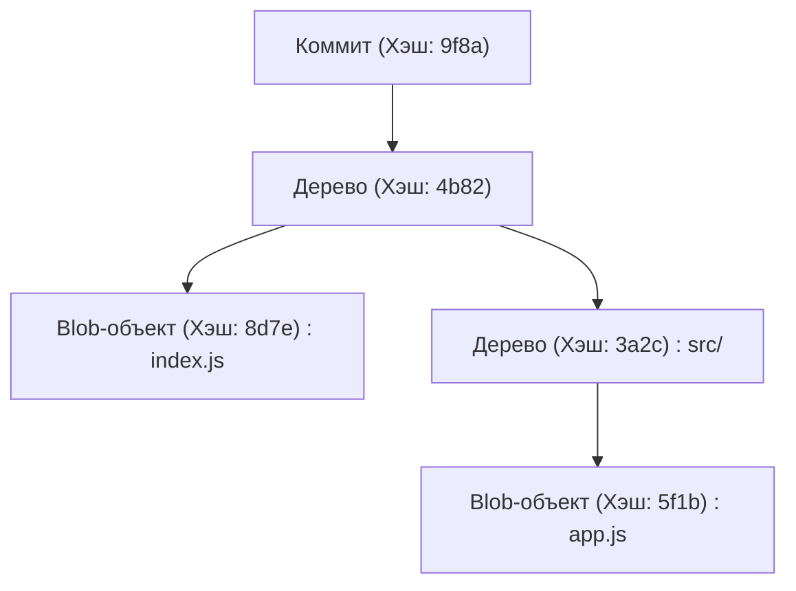
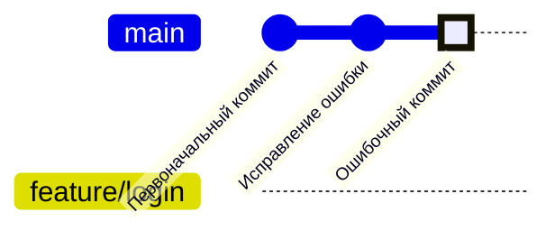
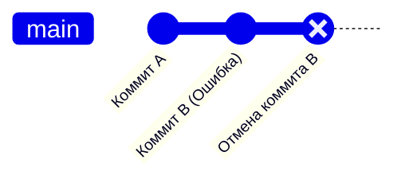
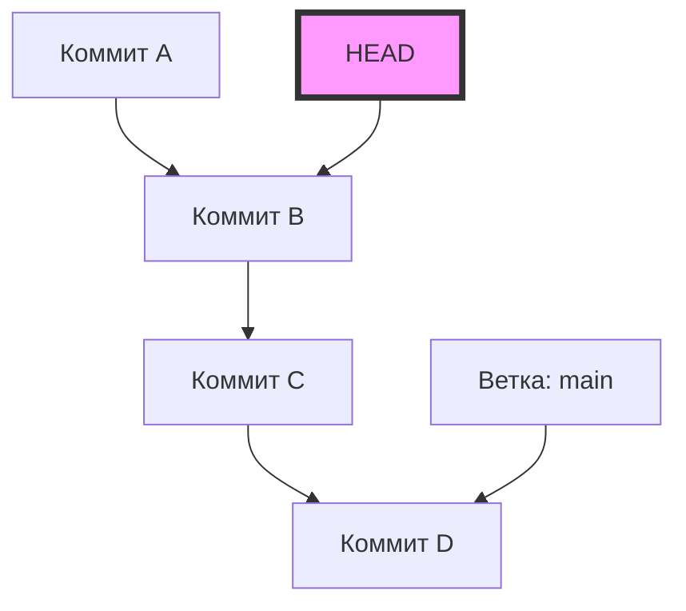
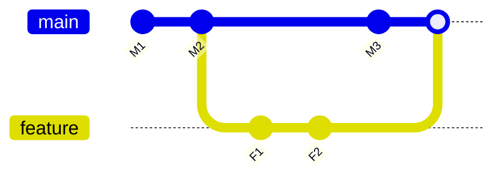

# Распространенные ошибки новичков в Git и команды для их решения (разрешение конфликтов и др.)

## 1. Введение: Почему мы совершаем ошибки в Git?

В разработке программного обеспечения Git стал таким же необходимым, как воздух или вода. Однако для многих новичков (а иногда даже для опытных разработчиков) Git может казаться «страшным волшебным черным ящиком». Коммиты исчезают, огромные изменения случайно отправляются не в ту ветку, а незнакомые сообщения об ошибках конфликтов заполняют весь экран... Когда вы попадаете в такие «ловушки Git», процесс работы полностью останавливается, и возникает страх, что в худшем случае вы можете разрушить исходный код.

Почему Git кажется таким сложным и так часто провоцирует ошибки? Главная причина заключается в том, что «люди заучивают и используют поверхностные команды, не понимая, что происходит внутри Git». Git основан на надежной архитектуре распределенной системы контроля версий (DVCS), но его интерфейс командной строки (CLI) далеко не всегда интуитивно понятен.

В этой статье мы подробно разберем множество «косяков (типичных ошибок)», с которыми новички часто сталкиваются на практике, классифицируем их и предложим конкретные команды для их решения. Но это не будет просто еще одной шпаргалкой с набором команд. Мы глубоко погрузимся в суть проблемы: «почему возникает эта ошибка» и «как именно перемещаются данные внутри Git при выполнении этой команды». Наш материал объемом более 10 000 символов будет включать анализ структуры директории `.git`, математическую основу алгоритма Diff, работающего в фоновом режиме, а также визуализации с помощью Mermaid.

Прочитав эту статью до конца, вы избавитесь от чувства «страха перед Git» и вместо этого обретете уверенность в том, что «нет более надежного напарника, чем Git». Итак, давайте погрузимся в бездну мира Git.

---

## 2. Бездна Git: Понимание внутренней структуры директории `.git`

Первый шаг к облегчению устранения неполадок — узнать, как Git хранит данные. Скрытая папка `.git`, находящаяся в корневой директории вашего проекта, является сердцем Git. Git не просто последовательно записывает изменения (патчи) файлов; он управляет данными как **потоком снимков состояния (снапшотов)**.

### 2.1 Объектная модель: Blob, Tree, Commit

Git в основном использует 3 типа объектов для представления состояния репозитория. Эти объекты хранятся в `.git/objects`.

1. **Blob (Binary Large Object)**
   Объект, который хранит само содержимое файла. Он не содержит имени файла или информации о правах доступа. Это просто чистый набор байтов, сжатый с помощью zlib, который идентифицируется по хэшу SHA-1 (40 символов в шестнадцатеричном формате).
2. **Tree (Дерево)**
   Объект, представляющий структуру директорий. Объект Tree содержит указатели (хэши SHA-1) на другие объекты Tree (поддиректории) или объекты Blob (файлы), а также их имена и права доступа. Он выполняет роль, аналогичную директории в UNIX.
3. **Commit (Коммит)**
   Содержит указатель на корневой объект Tree всего репозитория в определенный момент времени, метаданные (автор, дата создания, сообщение коммита), а также указатель на предыдущий коммит (родительский коммит).



### 2.2 Истинная сущность HEAD и ссылок (Refs)

При работе с Git вы часто будете встречать слово `HEAD`. Это **символическая ссылка (Symbolic Reference)**, которая указывает на текущую извлеченную (checked out) ветку (или коммит).
Если вы откроете файл `.git/HEAD` в текстовом редакторе, то увидите строку, похожую на эту:

```text
ref: refs/heads/main
```

Это означает, что «текущее состояние находится на острие ветки `main`». А если вы откроете файл `.git/refs/heads/main`, там будет записан хэш SHA-1 из 40 символов, который указывает на последний объект Commit.
Ветка в Git — это просто легковесный указатель (файл), указывающий на конкретный коммит. Зная этот факт, исчезает страх: «А вдруг, удалив ветку, я удалю и все файлы?».

---

## 3. Читая Git через математику: Алгоритм Diff и хэш-функции

Когда Git обнаруживает конфликты или отображает разницу в файлах, под капотом работают продвинутые алгоритмы.

### 3.1 Алгоритм Diff Майерса

Алгоритм определения разницы в Git по умолчанию был разработан Юджином В. Майерсом. Если у нас есть два текстовых файла $A$ и $B$, то задачу поиска «минимального количества операций редактирования (вставок и удалений)» для преобразования $A$ в $B$ можно смоделировать как задачу поиска кратчайшего пути в теории графов.

Пусть длины строк равны $N$ и $M$, а их сумма $V = N + M$. Алгоритм Майерса ищет расстояние редактирования (Edit Distance) $D$. Временная сложность этого алгоритма выражается следующей формулой:

$$ \mathcal{O}(V \cdot D) $$

Здесь, если разница между файлами мала (т.е. $D$ мало), алгоритм работает очень быстро — за $\mathcal{O}(V)$. Однако, если файлы совершенно разные, $D \approx V$, и сложность в худшем случае становится равной $\mathcal{O}(V^2)$.

### 3.2 Patience Diff и Histogram Diff

Алгоритм Майерса отличный, но если вы сильно изменили порядок функций или классов, он может сгенерировать неочевидную для человека (лишённую смысла) разницу. Для решения этой проблемы в Git реализованы алгоритмы `Patience Diff` и `Histogram Diff`.

Patience Diff фокусируется на «уникальных строках, которые появляются только один раз в обоих файлах», и находит их наибольшую общую подпоследовательность (Longest Common Subsequence: LCS). Если количество уникальных элементов равно $U$, то вычисление LCS можно решить со следующей вычислительной сложностью:

$$ \mathcal{O}(U \log U) $$

Если вам сложно разрешить конфликт, одним из вариантов решения будет использование `git diff --histogram` или указание этого алгоритма в стратегии слияния (`git merge -s recursive -X histogram`).

### 3.3 SHA-1 и вероятность коллизий

Git управляет всеми объектами с помощью хэш-значений SHA-1. Размер пространства хэшей составляет $2^{160}$. Если аппроксимировать вероятность коллизии хэшей (когда разное содержимое имеет одинаковый хэш) с помощью парадокса дней рождений (Birthday Paradox), то количество объектов $k$, необходимое для достижения вероятности коллизии $p$ в 50%, будет следующим:

$$ k \approx \sqrt{2 \ln(2)} \cdot 2^{80} \approx 1.2 \times 2^{80} $$

Это астрономическое число, и вероятность непреднамеренного возникновения коллизии при обычной разработке программного обеспечения практически равна нулю. Поэтому Git работает, доверяя хэшам как «абсолютно уникальным ID».

---

## 4. Пример из практики 1: Сделал коммит не в ту ветку!

**[Ситуация]**
Вы не заметили, что работаете в ветке `main`, активно писали код для новой фичи и, ко всему прочему, выполнили `git commit`. Хотя изначально планировали создать ветку `feature/login` и работать в ней!

### Решение: `git reset` и создание ветки

В Git коммиты — это независимые объекты, а ветки — всего лишь указатели. Поэтому проблема мгновенно решается действием: «создать новую ветку, а затем перемотать указатель текущей ветки назад».

```bash
# 1. Создать новую ветку, указывающую на текущий коммит (сделанный по ошибке)
$ git branch feature/login

# 2. Перемотать указатель ветки main на один коммит назад (HEAD~1)
# Использование --keep позволяет безопасно выполнить сброс, сохраняя незафиксированные изменения в рабочем каталоге.
$ git reset --keep HEAD~1

# 3. Переключиться на правильную ветку
$ git checkout feature/login
```

### Визуализация: Что произошло внутри?

Давайте визуализируем перемещение указателей веток с помощью `gitGraph` в Mermaid.


Сначала `main` и `HEAD` указывали на «Ошибочный коммит», но с помощью `git branch feature/login` там был создан новый указатель. Затем, с помощью `git reset`, только указатель `main` возвращается на позицию «Исправление ошибки». Сами объекты при этом не удаляются.

---

## 5. Пример из практики 2: Хочу отменить уже отправленный (push) коммит!

**[Ситуация]**
Работая до глубокой ночи, вы закоммитили код, полный багов, и к тому же отправили его в удаленный репозиторий с помощью `git push origin main`. Осознав наличие критического бага, вы бледнеете.

### Решение 1: Отмена истории с помощью `git revert` (Рекомендуемое и безопасное)

При командной разработке строго запрещено переписывать историю уже отправленных коммитов с помощью `git reset` и подобных команд. Это приведет к нарушению целостности локальных репозиториев других разработчиков. Правильный подход — **«создать новый коммит, который полностью отменяет изменения ошибочного коммита»**. Для этого используется `git revert`.

```bash
# Создать коммит, отменяющий последний коммит
$ git revert HEAD
[main 7f3a8b2] Revert "Сообщение ошибочного коммита"
 1 file changed, 1 insertion(+), 10 deletions(-)

# Отправить изменения в удаленный репозиторий
$ git push origin main
```


История продолжает двигаться вперед, и восстанавливается только предыдущее состояние кода.

### Решение 2: Переписывание истории с помощью `git push --force-with-lease`

Если вы только что отправили код в ветку, которую используете только вы один, то переписывание истории допустимо.

```bash
# Локально отменяем коммит и вносим исправления
$ git reset --hard HEAD~1
$ git add .
$ git commit -m "Правильная реализация"

# Принудительно перезаписываем историю в удаленном репозитории
$ git push origin feature/login --force-with-lease
```
`--force-with-lease` — это безопасный принудительный push, который предотвращает случайную перезапись чужой работы.

---

## 6. Пример из практики 3: Нужно переключиться на другую ветку прямо в процессе работы (Магия Stash)

**[Ситуация]**
Вы реализуете новую фичу в ветке `feature/A`, код еще даже не компилируется — это полуготовое состояние. Внезапно начальник сообщает: «На продакшене в ветке `main` критический баг, исправь его прямо сейчас!»

### Решение: Сохранение работы в `git stash`

`git stash` — это команда для временного сохранения (прятания) незафиксированных изменений в специальную область.

```bash
# 1. Прячем текущие изменения
$ git stash push -m "WIP: фича A частично реализована"

# 2. Теперь можно переключиться на ветку main
$ git checkout main
# ... (работа по исправлению критического бага, коммит и пуш) ...

# 3. По завершении работы возвращаемся в исходную ветку
$ git checkout feature/A

# 4. Восстанавливаем спрятанные изменения
$ git stash pop
```

Когда вы выполняете `git stash`, Git под капотом генерирует два специальных объекта-коммита и сохраняет их в ссылку `refs/stash`. Иными словами, Stash — это тоже просто «временные коммиты без имен».

---

## 7. Пример из практики 4: Пугающее состояние "Detached HEAD"

**[Ситуация]**
Вы захотели проверить состояние кода на определенный момент в прошлом и выполнили `git checkout 9f8a7b6`. Появилось сообщение `You are in 'detached HEAD' state.`. Вы сделали коммит прямо в этом состоянии, но при переключении ветки коммит исчез!

### Механизм Detached HEAD

Обычно `HEAD` указывает на ветку, например `refs/heads/main`. Однако, если вы переключаетесь непосредственно на определенный коммит, `HEAD` начинает указывать напрямую на объект коммита. Это называется **Detached HEAD (оторванный HEAD)**.


Если вы будете создавать коммиты в этом состоянии, ни одна ветка не будет отслеживать эти новые коммиты. Как только вы переключитесь на другую ветку, новые коммиты потеряются.

### Решение: Сохранить как новую ветку

Проблема решается созданием новой ветки на том месте, где вы сейчас находитесь.

```bash
# Создать новую ветку в текущей позиции HEAD и переключиться на нее
$ git checkout -b feature/recovered-work
```

---

## 8. Пример из практики 5: Разрешение конфликтов при слиянии и перебазировании

**[Ситуация]**
При выполнении `git merge` или `git rebase` появилось сообщение `CONFLICT (content)`, и процесс был прерван.

### Разница между слиянием (Merge) и перебазированием (Rebase)

1. **Merge (Слияние)**
   Выполняет трехстороннее слияние (3-way merge) с использованием последних коммитов двух веток и их общего предка, создавая коммит слияния.
2. **Rebase (Перебазирование)**
   Временно сохраняет коммиты текущей ветки и применяет их заново на вершине целевой ветки. История становится линейной.



### Как разрешить конфликт

В файле, где возник конфликт, будут вставлены следующие маркеры:

```javascript
<<<<<<< HEAD
const apiUrl = "https://api.production.example.com";
=======
const apiUrl = "https://api.staging.example.com";
>>>>>>> feature/new-api
```

Процесс разрешения крайне прост.

1. **Удалить маркеры и написать правильный код.**
   ```javascript
   const apiUrl = process.env.NODE_ENV === 'production' 
       ? "https://api.production.example.com" 
       : "https://api.staging.example.com";
   ```
2. **Добавить разрешенный файл в индекс (staging).**
   `git add` выполняет функцию «информирования Git о том, что конфликт разрешен».
   ```bash
   $ git add index.js
   ```
3. **Завершить процесс.**
   ```bash
   # В случае слияния
   $ git commit -m "Разрешен конфликт слияния в index.js"
   
   # В случае перебазирования
   $ git rebase --continue
   ```

Если вы запаниковали, вы всегда можете прервать процесс с помощью `$ git merge --abort` или `$ git rebase --abort`.

---

## 9. Пример из практики 6: История коммитов превратилась в хаос! `git rebase -i`

**[Ситуация]**
У вас скопилось множество мелких коммитов, таких как «Исправление опечатки», «Еще одно исправление», «Добавление тестов». Если слить всё это в `main`, история станет грязной.

### Решение: Интерактивное перебазирование

С помощью `git rebase -i` (interactive) вы можете менять порядок прошлых коммитов, объединять несколько коммитов в один (squash) или изменять сообщения коммитов.

```bash
# Привести в порядок последние 3 коммита
$ git rebase -i HEAD~3
```
Откроется редактор, и вы увидите следующее:
```text
pick 1a2b3c4 Исправление опечатки
pick 2b3c4d5 Еще одно исправление
pick 3c4d5e6 Добавление тестов
```
Измените это следующим образом:
```text
pick 1a2b3c4 Реализация фичи X
squash 2b3c4d5 Еще одно исправление
squash 3c4d5e6 Добавление тестов
```
Когда вы сохраните и закроете файл, эти 3 коммита будут красиво объединены в один.

---

## 10. Пример из практики 7: Непонятно, когда появился баг! `git bisect`

**[Ситуация]**
В текущей ветке `main` есть баг, но месяц назад во время релиза все было нормально. Вы хотите найти коммит, в котором появился баг, но их больше 100, и вручную это сделать невозможно!

### Решение: Поиск бага с помощью бинарного поиска

В Git встроен инструмент, который находит коммит с багом с помощью математического бинарного поиска (Binary Search). Вычислительная сложность составляет $\mathcal{O}(\log N)$, поэтому даже при 1000 коммитах вы сможете найти нужный примерно за 10 проверок.

```bash
# Начать поиск
$ git bisect start

# Текущий коммит содержит баг (bad)
$ git bisect bad

# Состояние месячной давности (например, хэш a1b2c3d) было рабочим (good)
$ git bisect good a1b2c3d

# Git автоматически переключится на коммит посередине, чтобы вы могли запустить тесты
# Если тест прошел успешно:
$ git bisect good
# Если тест провалился:
$ git bisect bad
```
Просто повторяя этот процесс, Git точно скажет вам: «Вот этот коммит стал первым коммитом с ошибкой (Bad)». По завершении используйте `$ git bisect reset`, чтобы вернуться в исходное состояние.

---

## 11. Абсолютная страховочная сетка: `git reflog`

Финальный прием против любых «косяков» в Git — это `git reflog`. Git сохраняет всю локальную историю действий (историю перемещений HEAD) за определенный период времени. Даже если вы удалили ветку или выполнили неправильный reset, вы можете найти хэш из прошлого в `git reflog` и восстановить состояние, просто выполнив туда `git reset --hard`.

```bash
$ git reflog
9f8a7b6 (HEAD -> main) HEAD@{0}: commit: Добавление новой фичи
1a2b3c4 HEAD@{1}: reset: moving to HEAD~1
```

## 12. Заключение

Мы очень подробно разобрали ошибки, с которыми часто сталкиваются новички в Git, механизмы Git, стоящие за ними, и способы их решения. Коммит не в ту ветку, отмена отправленного коммита, использование Stash, спасение из Detached HEAD и разрешение конфликтов. Во всем этом самым важным является представление того, «какими объектами и указателями Git манипулирует под капотом».

Разница в файлах вычисляется по строгим алгоритмам Diff, которые можно описать математическими формулами, а целостность истории обеспечивается криптографическими хэш-функциями. Поняв эту красивую архитектурную концепцию, вы осознаете, что Git — это вовсе не «непонятный черный ящик», а сильнейший щит, надежно защищающий ваш исходный код.

В следующий раз, когда вы подумаете «Я всё сломал!», не спешите закрывать терминал. Сделайте глубокий вдох и введите `git status`. Git обязательно подскажет вам путь к восстановлению.
