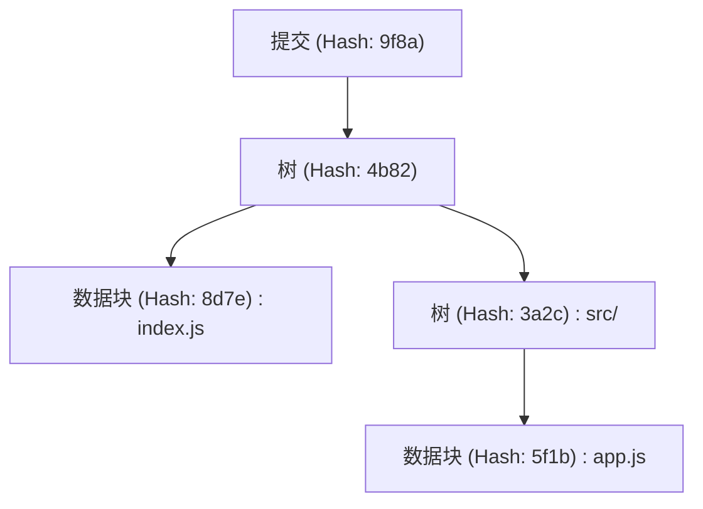
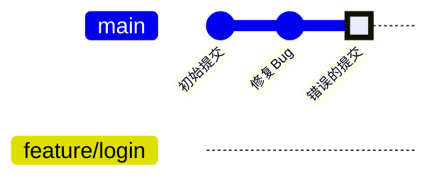
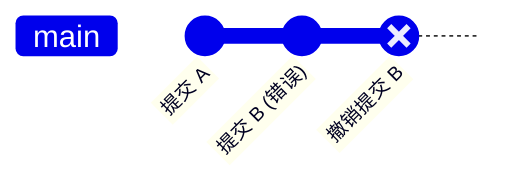
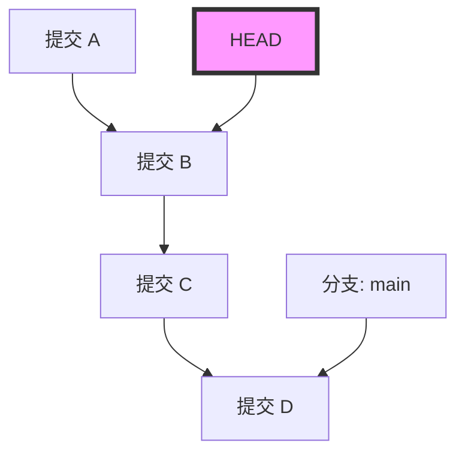
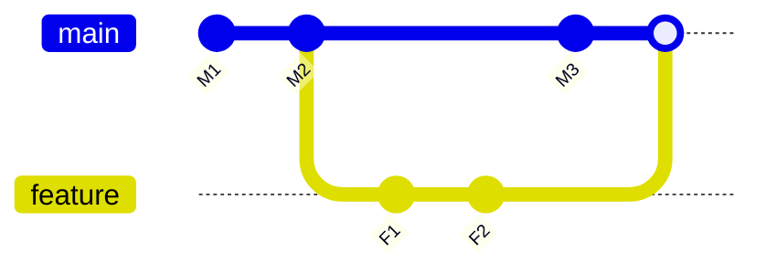

# Git初学者容易陷入的误区与解决命令集（冲突解决等）

## 1. 引言：为什么会在Git上犯错？

在软件开发中，Git已经成为了像空气和水一样不可或缺的存在。然而，对于许多初学者（甚至有时是老手）来说，Git可能会让人觉得像是一个“可怕的魔法黑盒”。提交记录消失了、在意外的分支中塞入了大量更改、或者屏幕上满是见都没见过的冲突错误信息……。一旦陷入这种“Git的陷阱”，工作进度就会完全停滞，最糟糕的时候甚至会被“是不是把源代码给搞坏了”的恐惧所支配。

为什么Git会如此困难，并且容易诱发错误呢？最大的原因是：“没有理解Git内部到底发生了什么，仅仅是死记硬背表面上的命令来使用”。Git虽然是基于分布式版本控制系统（DVCS）的健壮设计理念构建的，但其接口（CLI）并不总是直观的。

本文将针对Git初学者在实际工作中经常遇到的“失误（常见错误）”进行多种情况的分类，并提供各自具体的解决命令。然而，这不会仅仅是命令的罗列（速查表）。“为什么会发生这个错误”、“执行该命令时Git内部的数据是如何变动的”，我们将结合 `.git` 目录的结构、背后运行的Diff算法的数学背景，以及Mermaid图解，通过超过10,000字的篇幅来进行彻底深挖。

当读完这篇文章时，你将从“Git很可怕”的恐惧中解放出来，反而会确信“没有比Git更值得信赖的伙伴了”。那么，让我们一起潜入Git的深渊世界吧。

---

## 2. Git的深渊：理解 `.git` 目录的内部结构

要让许多故障排查变得简单，第一步就是了解Git是如何保存数据的。存在于你项目根目录中的隐藏文件夹 `.git`，正是Git的心脏。Git并不是顺次记录简单文件差异（补丁）的系统，而是将数据作为**快照流（Stream of snapshots）**来进行管理。

### 2.1 对象模型：Blob, Tree, Commit

Git主要使用3种对象来表示仓库的状态。这些对象保存在 `.git/objects` 中。

1. **Blob (Binary Large Object)**
   保存文件内容本身的对象。文件名和权限信息不包含在此处。纯字节流会经过zlib压缩，并通过SHA-1散列值（40个字符的十六进制数）来识别。
2. **Tree**
   表示目录结构的对象。Tree对象包含指向其他Tree对象（子目录）或Blob对象（文件）的指针（SHA-1散列值），以及它们的文件名和访问权限。它扮演着类似UNIX目录的角色。
3. **Commit**
   保存指向某一时点整个仓库顶层Tree对象的指针，以及元数据（作者、提交日期、提交信息），还有指向前一次提交（父提交）的指针。



### 2.2 HEAD与引用（Refs）的真面目

在Git中工作时，我们会频繁地看到 `HEAD` 这个词。这是一个**符号引用（Symbolic Reference）**，指向当前检出的分支（或提交）。
用文本编辑器打开 `.git/HEAD` 文件，会看到类似下面的字符串：

```text
ref: refs/heads/main
```

这意味着“当前状态位于 `main` 分支的顶端”。接着，打开 `.git/refs/heads/main`，里面写着一个40字符的SHA-1散列值，这就是指向最新Commit对象的指针。
Git的分支，仅仅是一个指向特定提交的轻量级指针（文件）。只需了解这个事实，就能消除“如果删除分支，文件是不是就全没了？”的恐惧。

---

## 3. 从数学角度解读Git：Diff算法与散列函数

当Git检测冲突或显示文件差异时，内部运行着高级的算法。

### 3.1 Myers的Diff算法

Git默认的差异检测算法是由Eugene W. Myers提出的算法。当有2个文本文件 $A$ 和 $B$ 时，寻找将 $A$ 转换为 $B$ 的“最小编辑步骤（插入和删除）”的问题，可以在图论中建模为最短路径问题。

设字符串的长度分别为 $N, M$，总和为 $V = N + M$。在Myers算法中，我们要寻找编辑距离（Edit Distance） $D$。该算法的时间复杂度由以下公式表示：

$$ \mathcal{O}(V \cdot D) $$

这里，当文件间的差异较小（即 $D$ 较小）时，算法会以非常快的 $\mathcal{O}(V)$ 速度运行。但是，如果文件完全不同，则 $D \approx V$，最坏情况的时间复杂度变为 $\mathcal{O}(V^2)$。

### 3.2 Patience Diff 与 Histogram Diff

Myers算法非常优秀，但在大幅度改变函数或类的顺序时，有时会生成对人类来说不直观（缺乏意义）的差异。为了解决这个问题，Git实现了 `Patience Diff` 和 `Histogram Diff`。

Patience Diff 着眼于“在两个文件中只出现一次的唯一行”，并寻找它们的最长公共子序列（Longest Common Subsequence: LCS）。假设唯一元素的数量为 $U$，则LCS的计算可以用以下时间复杂度解决：

$$ \mathcal{O}(U \log U) $$

当你觉得冲突很难解决时，使用 `git diff --histogram`，或者在合并策略中指定该算法（`git merge -s recursive -X histogram`）是一个好办法。

### 3.3 SHA-1与碰撞概率

Git通过SHA-1散列值来管理所有对象。散列空间的大小为 $2^{160}$。关于散列碰撞（不同的内容具有相同的散列值）的概率，使用生日悖论（Birthday Paradox）进行近似，碰撞概率 $p$ 达到50%所需的对象数量 $k$ 如下：

$$ k \approx \sqrt{2 \ln(2)} \cdot 2^{80} \approx 1.2 \times 2^{80} $$

这是一个天文数字，在通常的软件开发中，意外发生碰撞的概率实际上为零。因此，Git可以信赖地将散列值作为“绝对唯一的ID”来运行。

---

## 4. 案例研究1：提交到了错误的分支上！

**【场景】**
没有意识到自己正在 `main` 分支上工作，大刀阔斧地写了新功能的代码，甚至还顺手执行了 `git commit`。本来是应该创建一个 `feature/login` 分支并在那里工作的！

### 解决方法：使用 `git reset` 和创建分支

在Git中，提交是独立的对象，分支只是指针。因此，只需通过“先创建一个新分支，然后将当前分支的指针回退”的操作，就能瞬间解决。

```bash
# 1. 创建一个新分支，指向当前的提交（错误创建的提交）
$ git branch feature/login

# 2. 将main分支的指针回退到上一个提交（HEAD~1）
# 使用 --keep 可以在保留工作目录未提交的更改的同时安全地重置。
$ git reset --keep HEAD~1

# 3. 切换到正确的分支
$ git checkout feature/login
```

### 图解：内部发生了什么？

让我们使用Mermaid的 `gitGraph`，将此时的分支指针移动可视化。


最初 `main` 和 `HEAD` 都指向 "错误的提交"，但是通过 `git branch feature/login`，在那个位置创建了一个新指针。之后通过 `git reset`，只有 `main` 的指针回到了 "修复Bug" 的位置。对象本身并没有任何内容被删除。

---

## 5. 案例研究2：想要撤销已经推送的提交！

**【场景】**
深夜精神亢奋时写下并提交了一堆充满Bug的代码，而且还通过 `git push origin main` 将其推送到远程仓库公开了。发现严重Bug后面如死灰。

### 解决方案1：抵消历史的 `git revert` （推荐·安全）

在团队开发中，绝对禁止使用 `git reset` 等命令篡改已经推送到远程的提交历史。这会导致与其他开发者的本地仓库失去同步。正确的做法是：**“创建一个新的相反提交，来完全抵消那个错误提交的更改”**。这就是 `git revert`。

```bash
# 创建一个抵消最新提交的新提交
$ git revert HEAD
[main 7f3a8b2] Revert "错误的提交信息"
 1 file changed, 1 insertion(+), 10 deletions(-)

# 推送到远程
$ git push origin main
```


历史继续推进，只是代码的状态恢复到了原来的样子。

### 解决方案2：篡改历史的 `git push --force-with-lease`

如果你是在一个只有你一个人使用的分支上刚刚进行了推送，那么重写历史也是可以接受的。

```bash
# 在本地重置提交并进行修复
$ git reset --hard HEAD~1
$ git add .
$ git commit -m "正确的实现"

# 强制覆盖远程的历史
$ git push origin feature/login --force-with-lease
```
`--force-with-lease` 是一种安全的强制推送，可以防止意外覆盖他人的工作。

---

## 6. 案例研究3：工作中途想要切换到其他分支（Stash的魔法）

**【场景】**
在 `feature/A` 分支上开发新功能，源代码处于连编译都无法通过的半成品状态。突然，上司发来指示：“`main` 分支的生产环境有一个紧急Bug，马上修复一下！”

### 解决方法：通过 `git stash` 进行暂存

`git stash` 是一个将未提交的更改避难到临时区域的命令。

```bash
# 1. 暂存工作中的更改
$ git stash push -m "WIP: feature A 部分实现"

# 2. 现在可以切换到main分支了
$ git checkout main
# ...（执行紧急Bug修复工作，提交并推送）...

# 3. 工作结束后返回原分支
$ git checkout feature/A

# 4. 恢复之前暂存的更改
$ git stash pop
```

执行 `git stash` 时，Git内部会生成2个特殊的提交对象，并保存在 `refs/stash` 这个引用中。也就是说，Stash归根结底也是一种“没有名字的临时提交”。

---

## 7. 案例研究4：令人恐惧的 "Detached HEAD" 状态

**【场景】**
为了确认过去某个特定时间点的代码，执行了 `git checkout 9f8a7b6`。结果提示 `You are in 'detached HEAD' state.`。我就这么直接提交了，但是一切换分支，刚才的提交就不见了！

### Detached HEAD的机制

通常 `HEAD` 指向 `refs/heads/main` 等分支。但是，如果你直接检出一个特定的提交，`HEAD` 就会直接指向这个提交对象。这被称为 **Detached HEAD（游离的HEAD / 分离的HEAD）**。


在这种状态下即使叠加了新的提交，任何分支都不会跟踪那个新提交。当切换到其他分支的瞬间，新的提交就成了迷路的孩子。

### 解决方案：将其保存为新分支

只要在当前所处的位置创建一个新分支即可解决。

```bash
# 在当前HEAD的位置创建一个新分支，并切换过去
$ git checkout -b feature/recovered-work
```

---

## 8. 案例研究5：合并与变基时的冲突解决

**【场景】**
执行了 `git merge` 或 `git rebase` 后，提示 `CONFLICT (content)`，并且流程被中断了。

### 合并（Merge）与变基（Rebase）的区别

1. **Merge（合并）**
   使用两个分支的最新提交和它们共同的祖先进行三方合并（3-way merge），并创建一个合并提交（Merge commit）。
2. **Rebase（变基）**
   将当前分支的提交临时保存，并重新应用到目标分支的顶端。这会使历史保持一条直线。



### 解决冲突的方法

发生冲突的文件中，被插入了如下的标记：

```javascript
<<<<<<< HEAD
const apiUrl = "https://api.production.example.com";
=======
const apiUrl = "https://api.staging.example.com";
>>>>>>> feature/new-api
```

解决步骤极其简单。

1. **删除标记，修改为正确的代码。**
   ```javascript
   const apiUrl = process.env.NODE_ENV === 'production' 
       ? "https://api.production.example.com" 
       : "https://api.staging.example.com";
   ```
2. **将解决后的文件添加到暂存区。**
   `git add` 具有“告知Git冲突已解决”的作用。
   ```bash
   $ git add index.js
   ```
3. **完成流程。**
   ```bash
   # 如果是合并（Merge）
   $ git commit -m "Resolve merge conflict in index.js"
   
   # 如果是变基（Rebase）
   $ git rebase --continue
   ```

如果感到慌乱，随时可以通过 `$ git merge --abort` 或 `$ git rebase --abort` 来中止操作。

---

## 9. 案例研究6：提交历史乱七八糟！`git rebase -i`

**【场景】**
“修正错别字”、“再次修正”、“添加测试”等细碎的提交产生了非常多。如果就这样合并到 `main` 中，历史记录会变得很脏。

### 解决方案：交互式变基

使用 `git rebase -i`（interactive），可以重新排列过去提交的顺序，将多个提交合并为一个（squash），或者修改提交信息。

```bash
# 整理最近的3个提交
$ git rebase -i HEAD~3
```
此时编辑器会打开，显示如下内容：
```text
pick 1a2b3c4 修正错别字
pick 2b3c4d5 再次修正
pick 3c4d5e6 添加测试
```
将其修改为以下内容：
```text
pick 1a2b3c4 功能X的实现
squash 2b3c4d5 再次修正
squash 3c4d5e6 添加测试
```
保存并关闭后，这3个提交就会被完美地合并为1个。

---

## 10. 案例研究7：不知道Bug是什么时候混入的！`git bisect`

**【场景】**
当前的 `main` 分支有Bug，但在1个月前发布时是正常的。想要定位出Bug是在哪个提交中混入的，但是提交数量超过了100个，手动查根本不可能！

### 解决方案：通过二分查找定位Bug

Git内置了一个工具，可以通过数学上的二分查找（Binary Search）来找出混入Bug的提交。由于时间复杂度为 $\mathcal{O}(\log N)$，即使有1000个提交，只需大约10次测试就能定位出来。

```bash
# 开始查找
$ git bisect start

# 当前提交存在Bug（bad）
$ git bisect bad

# 1个月前（例如Hash为 a1b2c3d）是正常的（good）
$ git bisect good a1b2c3d

# Git会自动检出中间的提交，请执行测试
# 如果测试成功：
$ git bisect good
# 如果测试失败：
$ git bisect bad
```
只需重复上述步骤，Git就会准确地告诉你：“这个提交就是第一个Bad提交”。结束后，通过 `$ git bisect reset` 即可恢复到原来的状态。

---

## 11. 终极安全网：`git reflog`

应对Git中任何“失误”的终极奥义就是 `git reflog`。Git会将本地所有的操作历史（HEAD的移动历史）完整记录一段时间。即使你删除了分支，或者执行了错误的重置，只需通过 `git reflog` 找出过去的Hash值，并在那里执行 `git reset --hard`，就能恢复如初。

```bash
$ git reflog
9f8a7b6 (HEAD -> main) HEAD@{0}: commit: Add new feature
1a2b3c4 HEAD@{1}: reset: moving to HEAD~1
```

## 12. 结语

我们非常详细地讲解了Git初学者容易陷入的误区、背后的Git机制，以及对应的解决方法。提交到错误分支、撤销已推送的提交、活用Stash、从Detached HEAD状态中生还，以及解决冲突。在所有这些操作中，最重要的是要在脑海中想象“Git在背后是如何操作对象和指针的”。

文件差异是由能够用数学公式表达的严谨Diff算法计算得出的，历史的一致性则是由密码学哈希函数来提供保障的。只要理解了这种优美的设计理念，你就应该能明白：Git绝不是一个“莫名其妙的黑盒”，而是能够坚固守护你源代码的最强护盾。

下次当你觉得“哎呀搞砸了！”的时候，请不要慌张地关掉终端，深吸一口气，敲入 `git status` 吧。Git一定能为你提供恢复的线索。
