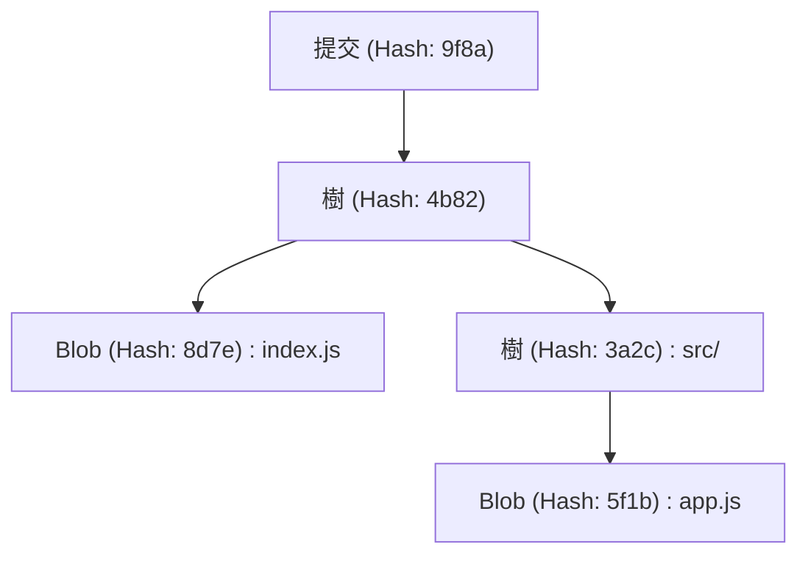
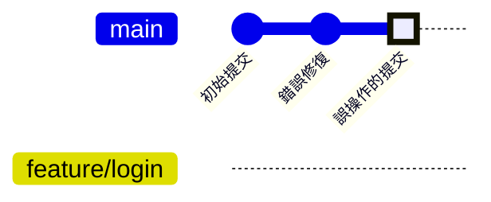
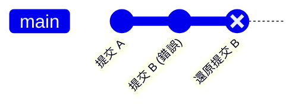
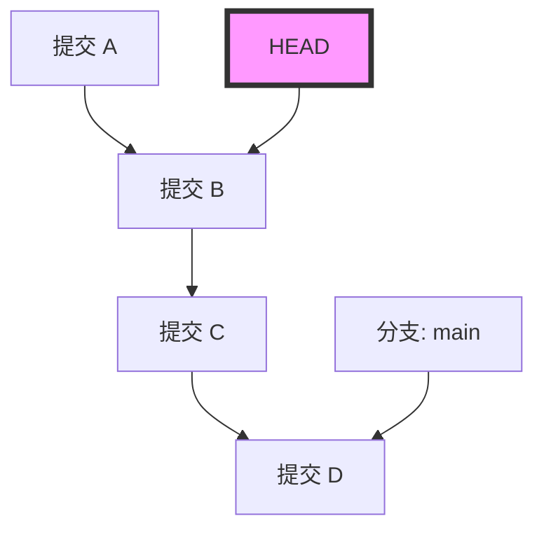
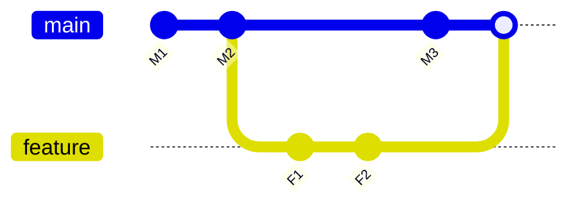

# Git初學者容易犯的錯誤與解決指令集（解決衝突等）

## 1. 前言：為什麼會在 Git 中犯錯？

在軟體開發中，Git 已經成為像空氣和水一樣不可或缺的存在。然而，對於許多初學者（有時甚至是熟練者）來說，Git 感覺就像是一個「可怕的魔法黑盒子」。提交消失、將大量變更推入錯誤的分支、從未見過的衝突錯誤訊息佔滿螢幕……。當陷入這些「Git 的陷阱」時，工作進度會完全停滯，最糟糕的情況下，甚至會產生原始碼被破壞的恐懼。

為什麼 Git 會如此困難且容易誘發錯誤呢？最大的原因是「沒有理解 Git 內部發生了什麼，只是死記硬背表面的指令來使用」。Git 是基於分散式版本控制系統（DVCS）的堅固設計理念，但它的介面（CLI）並不總是直觀的。

在本文中，我們將把 Git 初學者在工作現場經常遇到的「失誤（常見錯誤）」進行分類，並提供每個情況的具體解決方案指令。但這不會只是一份單純的指令清單（備忘錄）。我們將透過 `.git` 目錄的結構、背後運行的 Diff 演算法的數學背景，以及 Mermaid 圖解，以超過 10,000 字的篇幅徹底深入探討「為什麼會發生這個錯誤」、「執行該指令時 Git 內部資料是如何移動的」。

當你讀完這篇文章時，你應該能從「害怕 Git」的情緒中解脫出來，反而會確信「沒有比 Git 更可靠的夥伴了」。那麼，讓我們潛入 Git 的深淵世界吧。

---

## 2. Git 的深淵：理解 `.git` 目錄的內部結構

許多疑難排解變得容易的第一步，是了解 Git 如何儲存資料。存在於你專案根目錄中的隱藏資料夾 `.git`，正是 Git 的心臟地帶。Git 並非只是一個依序記錄檔案差異（patch）的系統，而是將資料作為**快照（snapshot）流**來管理。

### 2.1 物件模型：Blob, Tree, Commit

Git 主要使用 3 種物件來表示儲存庫的狀態。這些物件儲存在 `.git/objects` 中。

1. **Blob (Binary Large Object)**
   這是儲存檔案內容本身的物件。檔案名稱或權限的資訊不包含在這裡。純粹的位元組陣列會被 zlib 壓縮，並由 SHA-1 雜湊值（40 個字元的十六進位數字）來識別。
2. **Tree**
   表示目錄結構的物件。Tree 物件包含指向其他 Tree 物件（子目錄）或 Blob 物件（檔案）的指標（SHA-1 雜湊值），以及它們的檔案名稱、存取權限。它扮演類似 UNIX 目錄的角色。
3. **Commit**
   包含指向特定時間點儲存庫整體頂層 Tree 物件的指標、元資料（作者、提交時間、提交訊息），以及指向前一個提交（父提交）的指標。



### 2.2 HEAD 與參照（Refs）的真面目

在 Git 中工作時，會頻繁看到 `HEAD` 這個單字。這是指目前簽出（checkout）的分支（或提交）的**符號參照（Symbolic Reference）**。
如果用文字編輯器打開 `.git/HEAD` 這個檔案，會看到以下字串。

```text
ref: refs/heads/main
```

這意味著「目前的狀態位於 `main` 分支的頂端」。然後，當打開 `.git/refs/heads/main` 時，會看到那裡寫著 40 個字元的 SHA-1 雜湊值，這就指向了最新的 Commit 物件。
Git 的分支，不過是一個指向特定提交的輕量級指標（檔案）而已。只要知道這個事實，就能消除「刪除分支是不是所有檔案都會消失？」的恐懼。

---

## 3. 用數學解讀 Git：Diff 演算法與雜湊函數

當 Git 檢測到衝突或顯示檔案差異時，內部正在運行進階的演算法。

### 3.1 Myers 的 Diff 演算法

Git 預設的差異檢測演算法是由 Eugene W. Myers 發明的。當有兩個文字檔 $A$ 和 $B$ 時，找到將 $A$ 轉換為 $B$ 的「最小編輯步驟（插入與刪除）」的問題，可以建模為圖論中的最短路徑問題。

假設字串的長度分別為 $N, M$，總和為 $V = N + M$。在 Myers 演算法中，會尋找編輯距離（Edit Distance） $D$。這個演算法的時間複雜度可以用以下公式表示：

$$ \mathcal{O}(V \cdot D) $$

這裡，如果檔案之間的差異很小（也就是 $D$ 很小），演算法的執行速度會非常快，達到 $\mathcal{O}(V)$。然而，如果檔案完全不同，則 $D \approx V$，最壞情況下的時間複雜度會變成 $\mathcal{O}(V^2)$。

### 3.2 Patience Diff 與 Histogram Diff

雖然 Myers 演算法很優秀，但當函數或類別的順序發生大幅改變時，它可能會產生對人類來說不直觀（無意義）的差異。為了解決這個問題，Git 實作了 `Patience Diff` 和 `Histogram Diff`。

Patience Diff 著眼於「在兩個檔案中只出現過一次的唯一行」，並找出它們的最長共同子序列（Longest Common Subsequence: LCS）。假設唯一元素的數量為 $U$，計算 LCS 的複雜度可以用以下公式來解決：

$$ \mathcal{O}(U \log U) $$

當你覺得解決衝突很困難時，使用 `git diff --histogram`，或者在合併策略中指定這個演算法（`git merge -s recursive -X histogram`）是一個好方法。

### 3.3 SHA-1 與碰撞機率

Git 使用 SHA-1 雜湊值來管理所有物件。雜湊空間的大小為 $2^{160}$。關於雜湊碰撞（不同的內容擁有相同的雜湊值）發生的機率，如果我們使用生日悖論（Birthday Paradox）來近似，碰撞機率 $p$ 達到 50% 所需的物件數量 $k$ 如下：

$$ k \approx \sqrt{2 \ln(2)} \cdot 2^{80} \approx 1.2 \times 2^{80} $$

這是一個天文數字，在一般的軟體開發中，無意間發生碰撞的機率幾乎為零。因此，Git 依賴雜湊值作為「絕對唯一 ID」來運作。

---

## 4. 案例研究 1：不小心提交到了錯誤的分支！

**【狀況】**
沒注意到自己正在 `main` 分支上工作，就拼命寫了新功能的程式碼，甚至還執行了 `git commit`。原本應該要建立一個名為 `feature/login` 的分支並在那裡工作的啊！

### 解決方法：使用 `git reset` 與建立分支

在 Git 中，提交是獨立的物件，而分支只是指標。因此，只要執行「先建立新分支，再將目前分支的指標倒退」的操作，就能瞬間解決。

```bash
# 1. 建立一個指向目前提交（不小心建立的提交）的新分支
$ git branch feature/login

# 2. 將 main 分支的指標倒退到前一個提交（HEAD~1）
# 使用 --keep 可以保留工作目錄中未提交的變更並安全地重設。
$ git reset --keep HEAD~1

# 3. 切換到正確的分支
$ git checkout feature/login
```

### 圖解：內部發生了什麼事？

讓我們使用 Mermaid 的 `gitGraph` 來視覺化這時分支指標的移動。


一開始 `main` 和 `HEAD` 都指向「誤操作的提交」，但透過 `git branch feature/login`，在那裡建立了一個新的指標。之後透過 `git reset`，只有 `main` 指標回到了「錯誤修復」的位置。物件本身並沒有被刪除任何東西。

---

## 5. 案例研究 2：想要取消已經推送的提交！

**【狀況】**
在深夜情緒高昂時提交了充滿 bug 的程式碼，而且還用 `git push origin main` 公開到了遠端儲存庫。發現重大 bug 後臉都綠了。

### 解決方案 1：抹除歷史的 `git revert`（推薦・安全）

在團隊開發中，嚴禁使用 `git reset` 等方法去篡改已經推送的提交歷史。這會導致與其他開發者的本機儲存庫失去一致性。正確的方法是，**「建立一個新的提交來完全抵消那個錯誤提交的變更」**。這就是 `git revert`。

```bash
# 建立一個抵消最新提交的提交
$ git revert HEAD
[main 7f3a8b2] Revert "錯誤提交的訊息"
 1 file changed, 1 insertion(+), 10 deletions(-)

# 推送到遠端
$ git push origin main
```


歷史會繼續前進，只有程式碼的狀態會恢復原狀。

### 解決方案 2：篡改歷史的 `git push --force-with-lease`

如果你是在只有你一個人使用的分支上，在剛推送之後，重寫歷史是可以被容許的。

```bash
# 在本機重設提交並進行修改
$ git reset --hard HEAD~1
$ git add .
$ git commit -m "Correct implementation"

# 強制覆寫遠端的歷史
$ git push origin feature/login --force-with-lease
```
`--force-with-lease` 是一種安全的強制推送，可以防止意外覆寫他人工作的事故。

---

## 6. 案例研究 3：工作到一半想切換到另一個分支（Stash 的魔法）

**【狀況】**
在 `feature/A` 分支實作新功能時，原始碼還處於連編譯都過不了的半途狀態。突然，主管下達指示：「`main` 分支的正式環境出現緊急 bug，現在立刻修好它！」

### 解決方法：使用 `git stash` 進行暫存

`git stash` 是一個將尚未提交的變更暫存到臨時區域的指令。

```bash
# 1. 暫存工作中的變更
$ git stash push -m "WIP: feature A partially implemented"

# 2. 現在可以切換到 main 分支了
$ git checkout main
# ...（進行緊急 bug 修復作業，提交並推送）...

# 3. 作業結束後回到原本的分支
$ git checkout feature/A

# 4. 恢復暫存的變更
$ git stash pop
```

當執行 `git stash` 時，Git 內部會產生兩個特殊的提交物件，並保存在 `refs/stash` 這個參照中。也就是說，Stash 說到底也只是「沒有名字的臨時提交」而已。

---

## 7. 案例研究 4：恐怖的 "Detached HEAD" 狀態

**【狀況】**
為了確認過去某個時間點的程式碼，執行了 `git checkout 9f8a7b6`。結果顯示了 `You are in 'detached HEAD' state.`。就這樣直接提交了，但切換分支後，提交卻消失了！

### Detached HEAD 的機制

通常 `HEAD` 會指向 `refs/heads/main` 等分支。但是，如果直接簽出特定的提交，`HEAD` 就會直接指向該提交物件。這被稱為 **Detached HEAD（分離的 HEAD）**。


在這種狀態下即使疊加提交，也沒有任何分支會追蹤那個新的提交。切換到其他分支的瞬間，新的提交就會迷路。

### 解決方案：將其儲存為新的分支

只要在目前所在的位置建立新分支就能解決。

```bash
# 在目前的 HEAD 位置建立新分支，並切換過去
$ git checkout -b feature/recovered-work
```

---

## 8. 案例研究 5：合併與重定基底時的衝突解決

**【狀況】**
執行 `git merge` 或 `git rebase` 時，顯示 `CONFLICT (content)`，並且程序被中斷。

### 合併（Merge）與重定基底（Rebase）的差異

1. **Merge（合併）**
   使用兩個分支的最新提交與共同的祖先進行三方合併（3-way merge），並建立一個合併提交。
2. **Rebase（重定基底）**
   將目前分支的提交暫存，並重新套用在目標分支的頂端。歷史記錄將會變成一條直線。



### 衝突的解決方法

發生衝突的檔案中，會插入如下的標記。

```javascript
<<<<<<< HEAD
const apiUrl = "https://api.production.example.com";
=======
const apiUrl = "https://api.staging.example.com";
>>>>>>> feature/new-api
```

解決步驟非常簡單。

1. **刪除標記，並修正為正確的程式碼。**
   ```javascript
   const apiUrl = process.env.NODE_ENV === 'production' 
       ? "https://api.production.example.com" 
       : "https://api.staging.example.com";
   ```
2. **將已解決的檔案加入暫存區（staging）。**
   `git add` 具有「告訴 Git 衝突已經解決」的作用。
   ```bash
   $ git add index.js
   ```
3. **完成程序。**
   ```bash
   # 合併的情況
   $ git commit -m "Resolve merge conflict in index.js"
   
   # 重定基底的情況
   $ git rebase --continue
   ```

如果感到慌亂，隨時可以使用 `$ git merge --abort` 或 `$ git rebase --abort` 來中止。

---

## 9. 案例研究 6：提交歷史亂七八糟！ `git rebase -i`

**【狀況】**
產生了大量如「修正錯字」、「還是修改一下」、「新增測試」等瑣碎的提交。如果就這樣合併到 `main`，歷史記錄會變得非常髒亂。

### 解決方案：互動式重定基底

使用 `git rebase -i`（interactive），可以改變過去提交的順序、將多個提交合併為一個（squash），或是修改提交訊息。

```bash
# 整理最近 3 個提交
$ git rebase -i HEAD~3
```
編輯器會開啟，並顯示如下：
```text
pick 1a2b3c4 修正錯字
pick 2b3c4d5 還是修改一下
pick 3c4d5e6 新增測試
```
將其修改為以下內容：
```text
pick 1a2b3c4 實作功能 X
squash 2b3c4d5 還是修改一下
squash 3c4d5e6 新增測試
```
存檔並關閉後，這 3 個提交就會漂亮地整合成 1 個。

---

## 10. 案例研究 7：不知道什麼時候混入了 bug！ `git bisect`

**【狀況】**
目前的 `main` 分支存在 bug，但在 1 個月前發布時是正常的。想要找出是哪個提交混入了 bug，但有超過 100 個提交，靠手動尋找根本不可能！

### 解決方案：使用二元搜尋來定位 bug

Git 內建了一個能透過數學上的二元搜尋（Binary Search）來找出混入 bug 的提交的工具。因為時間複雜度是 $\mathcal{O}(\log N)$，即使有 1000 個提交，大約也只需要 10 次測試就能定位出來。

```bash
# 開始搜尋
$ git bisect start

# 目前的提交有 bug（bad）
$ git bisect bad

# 1 個月前（例如雜湊值是 a1b2c3d）是正常的（good）
$ git bisect good a1b2c3d

# Git 會自動簽出中間的提交，所以請執行測試
# 如果測試成功：
$ git bisect good
# 如果測試失敗：
$ git bisect bad
```
只要重複這個過程，Git 就會準確地告訴你：「這個提交是第一個 Bad 提交」。結束後使用 `$ git bisect reset` 即可恢復原狀。

---

## 11. 終極安全網：`git reflog`

對於 Git 中所有「失誤」的最終奧義就是 `git reflog`。Git 會將本機的所有操作歷史（HEAD 的移動歷史）完整記錄一段時間。即使不小心刪除了分支，或是做了錯誤的重設，只要使用 `git reflog` 找出過去的雜湊值，然後對其執行 `git reset --hard` 就能復原。

```bash
$ git reflog
9f8a7b6 (HEAD -> main) HEAD@{0}: commit: Add new feature
1a2b3c4 HEAD@{1}: reset: moving to HEAD~1
```

## 12. 結語

本文非常詳細地解說了 Git 初學者容易犯的錯誤、其背後的 Git 運作機制，以及解決方法。提交到錯誤的分支、取消已推送的提交、靈活運用 Stash、從 Detached HEAD 狀態生還，以及解決衝突。在所有這些操作中，最重要的是去想像「Git 在背後是如何操作物件和指標的」。

由數學公式表示的嚴謹 Diff 演算法計算出檔案的差異，並透過密碼學的雜湊函數來確保歷史的一致性。只要理解了這個優美的設計理念，你就會明白 Git 絕對不是一個「莫名其妙的黑盒子」，而是能堅固保護你原始碼的最強盾牌。

下次當你覺得「搞砸了！」的時候，請不要慌張地關閉終端機，而是深呼吸並輸入 `git status`。Git 一定會為你提供復原的提示。
