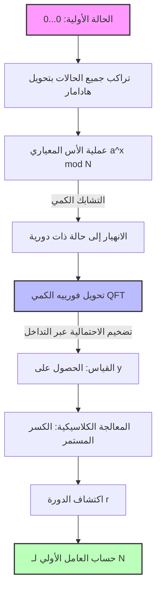

تتم حماية أمن المعلومات في مجتمع الإنترنت الحديث بواسطة التشفير بالمفتاح العام، مثل تشفير RSA. يعتمد أساس أمان تشفير RSA على حقيقة أن **"التحليل إلى العوامل الأولية للأرقام المركبة الضخمة يمثل صعوبة بالغة من الناحية الحسابية"** .

في هذا المقال، سنكشف عن الآلية الرياضية لـ **"منخل حقل الأعداد العام"** (GNFS)، وهو أقوى خوارزمية تحليل للعوامل الأولية للكمبيوتر الكلاسيكي، ونتعمق في سبب هزيمتها تمامًا بواسطة **"خوارزمية شور"** التي اكتشفها بيتر شور. سوف نستكشف هذه النقلة النوعية بعمق باستخدام المعادلات الرياضية والرسوم التوضيحية المفاهيمية.

---

## 1. نهج التحليل إلى العوامل في الحوسبة الكلاسيكية: التطور من طريقة فيرما للتحليل إلى العوامل

مشكلة التحليل إلى العوامل الأولية هي مشكلة إيجاد الأعداد الأولية $p, q$ بحيث يكون $N = p \times q$ لعدد مركب $N$ محدد.

تتلخص الفكرة الأساسية في إيجاد $x, y$ غير بديهية تلبي معادلة التطابق التالية:

$$ x^2 \equiv y^2 \pmod N $$

إذا قمنا بتعديل ذلك، نحصل على:

$$ x^2 - y^2 \equiv 0 \pmod N $$
$$ (x - y)(x + y) \equiv 0 \pmod N $$

هنا، إذا كان $x \not\equiv \pm y \pmod N$، يمكننا الحصول على عامل غير بديهي لـ $N$ عن طريق حساب $\gcd(x-y, N)$ أو $\gcd(x+y, N)$. هذه الحقيقة هي أساس خوارزميات التحليل الحديثة مثل GNFS.

---

## 2. أقوى الخوارزميات الكلاسيكية: أعماق "منخل حقل الأعداد العام" (GNFS)

يعد **"GNFS"** أسرع خوارزمية تحليل للعوامل الأولية معروفة لأجهزة الكمبيوتر الكلاسيكية اليوم. يستغرق تعقيد الوقت الخاص بها وقتًا شبه أسي (Sub-exponential).

### تعقيد GNFS

بافتراض أن عدد أرقام $N$ هو $b = \log_2 N$، يمكن التعبير عن تعقيد GNFS على النحو التالي:

$$ O\left( \exp \left( \left(\frac{64}{9} b\right)^{1/3} (\log b)^{2/3} \right) \right) $$

كما يتضح من هذه المعادلة، التعقيد ليس وقتًا كثير الحدود، بل **"وقت شبه أسي"** أبطأ قليلاً من الدالة الأسية. ومع ذلك، مع زيادة عدد الخانات، سيزداد وقت الحساب بشكل فلكي.

### الآلية الرياضية لـ GNFS

تتكون GNFS بشكل رئيسي من 4 خطوات:

1. **اختيار كثيرات الحدود (Polynomial Selection)**
2. **الغربلة (Sieving)**
3. **تقليل المصفوفة (Matrix Reduction)**
4. **حساب الجذر التربيعي (Square Root)**

#### 2.1. اختيار كثيرات الحدود والحقل الجبري

أولاً، نختار كثيرات الحدود غير القابلة للاختزال $f(x)$ و $g(x)$ بمعاملات صحيحة. يتم تعيينها ليكون لها جذر مشترك $m$ مقياس $N$. أي:

$$ f(m) \equiv 0 \pmod N $$
$$ g(m) \equiv 0 \pmod N $$

عادة، يتم اختيار $g(x)$ ككثيرة حدود من الدرجة الأولى $g(x) = x - m$. إذا جعلنا جذر $f(x)$ هو $\alpha$, يتشكل **"حقل جبري"** (Number Field) يسمى $\mathbb{Q}(\alpha)$. نقارن العمليات في حلقة $\mathbb{Q}(\alpha)$ مع العمليات في حلقة الأعداد الصحيحة العادية $\mathbb{Z}$ من خلال تشاكل $\phi: \alpha \mapsto m$.

#### 2.2. الغربلة (Sieving)

بعد ذلك، نبحث عن عدد كبير من أزواج الأعداد الصحيحة الأولية نسبياً $(a, b)$. الهدف هو إيجاد أزواج بحيث تكون كلتا القيمتين التاليتين **"B-smooth"** (تتكون فقط من عوامل أولية صغيرة نسبياً):

1. $a - bm$ (القيمة على حلقة الأعداد الصحيحة)
2. $b^d f(a/b)$ (يتوافق مع المعيار $N(a - b\alpha)$ في الحقل الجبري)

هنا، يتم استخدام طريقة بحث سريعة تسمى **"المنخل"** (Sieve). يتيح ذلك استخراج أزواج $(a, b)$ بكفاءة والتي تلبي الشروط من بين عدد هائل من المرشحين.

#### 2.3. تقليل المصفوفة (Linear Algebra over GF(2))

من الأزواج المُجمَّعة $(a, b)$، نقوم بتشكيل متجهات أسية وإيجاد الفضاء الصفري الأيسر لمصفوفة متفرقة ضخمة على $\mathbb{F}_2$ (حقل بعناصر 0 و 1 فقط).

نجد متجهاً للحل $v$ بحيث تصبح العلاقات $ \prod (a_i - b_i m) $ و $ \prod (a_i - b_i \alpha) $ كل منها مربعاً كاملاً. هذا ليس سوى حل لنظام من المعادلات الخطية:

$$ M \mathbf{x} \equiv \mathbf{0} \pmod 2 $$

هنا، يتم استخدام خوارزميات الحساب العددي المتقدمة مثل خوارزمية Block Lanczos أو Block Wiedemann.

#### 2.4. حساب الجذر التربيعي

أخيراً، نأخذ الجذر التربيعي من كل من الحقل الجبري وحلقة الأعداد الصحيحة، ونستنتج العلاقة $x^2 \equiv y^2 \pmod N$. ثم، نحسب $\gcd(x-y, N)$ ونحصل على العامل.

---

## 3. اختراق الحوسبة الكمية: "خوارزمية شور"

بينما يتطلب GNFS وقتاً شبه أسي، فإن **"خوارزمية شور"** التي نشرها بيتر شور في عام 1994 يمكن أن تحل هذه المشكلة في **"وقت كثير الحدود"** باستخدام كمبيوتر كمي.

### تعقيد خوارزمية شور

إذا افترضنا أن عدد الكيوبت هو $O(\log N)$، فإن تعقيد الوقت يكون:

$$ O((\log N)^3) $$

هذا يعني أنه لا يوجد انفجار أسي بالنسبة لعدد البتات. إنها نتيجة مذهلة حيث يمكن للأعداد المركبة الضخمة التي يتجاوز وقت حسابها في **"الحوسبة الكلاسيكية"** عمر الكون، أن يتم حلها في غضون ساعات إلى أيام باستخدام **"الحوسبة الكمية"** .

### نظرة عامة على خوارزمية شور: الاختزال إلى مشكلة إيجاد الدورة

تختزل خوارزمية شور مشكلة التحليل إلى العوامل الأولية ببراعة إلى **"مشكلة إيجاد الدورة"** .

1. اختر عدداً صحيحاً عشوائياً $a$ أولي نسبياً مع $N$ (حيث $1 < a < N$).
2. عرّف الدالة $f(x) = a^x \bmod N$.
3. أوجد الدورة $r$ للدالة $f(x)$، أي أصغر عدد صحيح موجب $r$ بحيث $a^r \equiv 1 \pmod N$.
4. إذا كان $r$ عدداً زوجياً، تحقق مما إذا كان $a^{r/2} \not\equiv -1 \pmod N$， واحسب $\gcd(a^{r/2} \pm 1, N)$ للحصول على العامل الأولي.

هذه الخطوة 3، أي **"اكتشاف الدورة $r$"** ، هي عنق الزجاجة الذي يتطلب وقتاً أسياً على الكمبيوتر الكلاسيكي، لكن الكمبيوتر الكمي يحلها في لحظة باستخدام **"التراكب الكمي"** و **"تحويل فورييه الكمي"** (QFT).

---

## 4. تحويل فورييه الكمي (QFT) واستخراج الدورة

دعونا نلقي نظرة فاحصة على العمليات الرياضية للحالات الكمية التي هي جوهر خوارزمية شور.

### 4.1. توليد التراكب الكمي

أولاً، قم بإعداد سجلي كم (Registers). يحتفظ السجل 1 بحالة التراكب للمدخل $x$، ويحتفظ السجل 2 بنتيجة الحساب للدالة $f(x)$. قم بتطبيق تحويل هادامار (Hadamard Transform) على الحالة الأولية $|0\rangle |0\rangle$ لإنشاء تراكب لجميع قيم $x$ الممكنة.

$$ |\psi_1\rangle = \frac{1}{\sqrt{Q}} \sum_{x=0}^{Q-1} |x\rangle |0\rangle $$
(حيث $Q$ هو قوة للعدد 2 تلبي $N^2 \le Q < 2N^2$)

بعد ذلك، استخدم وسيط كمي (Quantum Oracle) $U_f$ لحساب $f(x) = a^x \bmod N$ وتخزينه في السجل 2.

$$ |\psi_2\rangle = U_f |\psi_1\rangle = \frac{1}{\sqrt{Q}} \sum_{x=0}^{Q-1} |x\rangle |a^x \bmod N\rangle $$

لنفترض الآن أنه تم قياس السجل 2 (من الناحية النظرية، حتى لو لم يتم قياسه، فإن البنية الرياضية هي نفسها). إذا تم ملاحظة قيمة معينة $y = a^{x_0} \bmod N$، فإن حالة السجل 1 ستنهار إلى تراكب لجميع $x$ التي تجعل $f(x) = y$. إذا افترضنا أن الدورة هي $r$، فإن مثل هذه الـ $x$ ستكون $x_0, x_0 + r, x_0 + 2r, \dots$

$$ |\psi_3\rangle = \frac{1}{\sqrt{M}} \sum_{k=0}^{M-1} |x_0 + kr\rangle $$
(حيث $M \approx Q/r$ هو عدد الحدود)

تحتوي هذه الحالة على معلومات الدورة $r$، لكن القياس المباشر سينتج فقط $x_0 + kr$ عشوائية، ولن تُعرف الدورة $r$. هنا يأتي دور QFT.

### 4.2. تطبيق تحويل فورييه الكمي (QFT)

QFT هي عملية تطبق تحويل فورييه المتقطع على السعات للحالات الكمية. يُعرَّف تأثير QFT على الحالة $|x\rangle$ على النحو التالي:

$$ \text{QFT} |x\rangle = \frac{1}{\sqrt{Q}} \sum_{y=0}^{Q-1} e^{2\pi i \frac{xy}{Q}} |y\rangle $$

عند تطبيق ذلك على $|\psi_3\rangle$، يحدث تداخل الطور (تداخل كمي).

$$ |\psi_4\rangle = \text{QFT} |\psi_3\rangle = \frac{1}{\sqrt{MQ}} \sum_{y=0}^{Q-1} \sum_{k=0}^{M-1} e^{2\pi i \frac{(x_0 + kr)y}{Q}} |y\rangle $$

إذا قمنا بتوسيع المجموع في هذه المعادلة، يظهر الجزء التالي:

$$ \sum_{k=0}^{M-1} e^{2\pi i \frac{kry}{Q}} $$

مجموع المتسلسلة الهندسية هذا يعزز بعضه البعض (تداخل بنّاء Constructive Interference) فقط عندما يكون $ry/Q$ قريباً من عدد صحيح، ويلغي بعضه البعض (تداخل هدّام Destructive Interference) في أوقات أخرى.

لذلك، ستكون الحالة $|y\rangle$ المقاسة باحتمالية عالية عبارة عن عدد صحيح $y$ يلبي:

$$ \frac{y}{Q} \approx \frac{c}{r} $$

(حيث $c$ هو أي عدد صحيح).

### 4.3. تحديد الدورة عن طريق توسيع الكسر المستمر

بعد الحصول على $y$ من خلال القياس، استخدم كمبيوتراً كلاسيكياً لإجراء **"توسيع الكسر المستمر"** (Continued Fraction Expansion) على $y/Q$. يتيح ذلك حساب الكسر التقريبي $c/r$ للـ $y/Q$ واستخراج الدورة المحتملة $r$ من المقام بكفاءة عالية.

---

## 5. مقارنة النماذج المفاهيمية والنقلة النوعية

لفهم الاختلاف بين GNFS وخوارزمية شور بشكل بديهي، يوضح الرسم المفاهيمي باستخدام تدوين Mermaid.

### رسم مفاهيمي لخوارزمية شور باستخدام دارة كمية

### جوهر النقلة النوعية

يتخذ GNFS نهج **"البحث عن علاقات داخل الفضاء الرياضي (الحقل الجبري)"** . ومع ذلك، نظراً لأن مساحة البحث تتسع أسيًا مع عدد الأرقام، يصبح فك التشفير مستحيلاً تقريباً لطول مفتاح يتجاوز 2048 بتاً باستخدام قدرة الحوسبة الكلاسيكية (حتى مع المعالجة المتوازية).

من ناحية أخرى، تستفيد خوارزمية شور من **"الطبيعة الموجية للتداخل الكمي"** . فهي تقيّم جميع مسارات الحساب في حالة التراكب في وقت واحد، وتلغي (تُضعف) الإجابات غير الضرورية باستخدام QFT، وتضخم فقط سعة الاحتمال للدورة الصحيحة. بذلك، لا يبحث هذا النهج في المساحة، بل يتبنى بعداً مختلفاً تماماً: **"جعل الإجابة الصحيحة تطفو على السطح"** .

## 6. الخلاصة

في هذا المقال، قارنا بعمق الخلفية الرياضية وهيكل الخوارزمية بين **"GNFS"** الذي يمثل أقصى حدود الحوسبة الكلاسيكية، و **"خوارزمية شور"** التي تُظهر قوة الحوسبة الكمية.

في حين استخدم GNFS تقنيات رياضية مثل اختيار كثيرات الحدود وحسابات المصفوفات الضخمة لدفع التعقيد نحو وقت شبه أسي، حققت خوارزمية شور اختراقاً مباشراً إلى وقت كثير الحدود من خلال الجمع بين المبادئ الأساسية لميكانيكا الكم من التراكب والتداخل مع أداة رياضية (QFT).

في الوقت الحالي، لا يوجد كمبيوتر كمي متسامح مع الأخطاء (FTQC) على نطاق عملي (آلاف الكيوبتات) قادر على تشغيل خوارزمية شور. ومع ذلك، فإن وجود هذه النقلة النوعية النظرية والرياضية هو بالتحديد السبب الأكبر وراء تسريع الانتقال إلى التشفير ما بعد الكمي (PQC: Post-Quantum Cryptography) في جميع أنحاء العالم اليوم.
