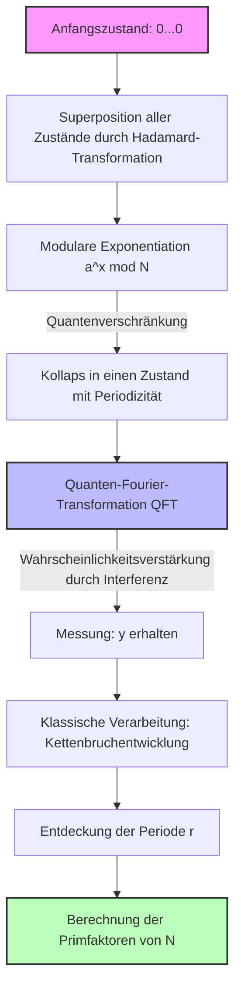

In der heutigen Internetgesellschaft wird die Informationssicherheit durch Public-Key-Kryptographie wie das RSA-Kryptosystem geschützt. Die Grundlage der Sicherheit des RSA-Kryptosystems beruht auf der Tatsache, dass **„die Primfaktorzerlegung riesiger zusammengesetzter Zahlen rechnerisch extrem schwierig ist“** .

In diesem Artikel entschlüsseln wir den mathematischen Mechanismus des **„Zahlkörpersiebs“** (General Number Field Sieve, GNFS), dem stärksten Algorithmus zur Primfaktorzerlegung für klassische Computer. Zugleich werden wir durch Formeln und Konzeptdiagramme detailliert ergründen, warum er durch den von Peter Shor entdeckten **„Shor-Algorithmus“** vollständig besiegt wird und welchen Paradigmenwechsel dies darstellt.

---

## 1. Der Ansatz zur Primfaktorzerlegung in der klassischen Berechnung: Eine Entwicklung aus Fermats Faktorisierungsmethode

Das Problem der Primfaktorzerlegung besteht darin, für eine gegebene zusammengesetzte Zahl $N$ die Primzahlen $p, q$ zu finden, sodass $N = p \times q$ gilt.

Die grundlegende Idee läuft darauf hinaus, nicht-triviale Werte $x, y$ zu finden, die die folgende Kongruenz erfüllen:

$$ x^2 \equiv y^2 \pmod N $$

Durch Umformen erhalten wir:

$$ x^2 - y^2 \equiv 0 \pmod N $$
$$ (x - y)(x + y) \equiv 0 \pmod N $$

Wenn hier $x \not\equiv \pm y \pmod N$ gilt, können wir durch die Berechnung von $\gcd(x-y, N)$ oder $\gcd(x+y, N)$ einen nicht-trivialen Faktor von $N$ erhalten. Diese Tatsache bildet die Grundlage moderner Primfaktorzerlegungsalgorithmen wie dem GNFS.

---

## 2. Der stärkste klassische Algorithmus: Die Tiefen des „Zahlkörpersiebs“ (GNFS)

Das **„GNFS“** ist der derzeit schnellste bekannte Algorithmus zur Primfaktorzerlegung für klassische Computer. Seine Zeitkomplexität erfordert eine subexponentielle (Sub-exponential) Zeit.

### Die Zeitkomplexität von GNFS

Wenn die Anzahl der Ziffern der Zahl $N$ als $b = \log_2 N$ definiert ist, wird die Zeitkomplexität von GNFS wie folgt ausgedrückt:

$$ O\left( \exp \left( \left(\frac{64}{9} b\right)^{1/3} (\log b)^{2/3} \right) \right) $$

Wie aus dieser Formel ersichtlich ist, handelt es sich bei der Komplexität nicht um polynomielle Zeit, sondern um eine **„subexponentielle Zeit“** , die nur geringfügig langsamer als exponentiell ist. Dennoch steigt die Berechnungszeit mit zunehmender Ziffernzahl astronomisch an.

### Der mathematische Mechanismus von GNFS

GNFS besteht im Wesentlichen aus vier Schritten:

1. **Polynomauswahl (Polynomial Selection)**
2. **Sieben (Sieving)**
3. **Matrixreduktion (Matrix Reduction)**
4. **Quadratwurzelberechnung (Square Root)**

#### 2.1. Polynomauswahl und algebraische Zahlkörper

Zunächst werden irreduzible Polynome $f(x)$ und $g(x)$ mit ganzzahligen Koeffizienten ausgewählt. Diese werden so festgelegt, dass sie modulo $N$ eine gemeinsame Wurzel $m$ haben. Das heißt:

$$ f(m) \equiv 0 \pmod N $$
$$ g(m) \equiv 0 \pmod N $$

Normalerweise wird $g(x)$ als lineares Polynom $g(x) = x - m$ gewählt. Setzt man die Wurzel von $f(x)$ als $\alpha$, so wird ein **„algebraischer Zahlkörper“** (Number Field) namens $\mathbb{Q}(\alpha)$ konstruiert. Die Operationen im Ring von $\mathbb{Q}(\alpha)$ und die Operationen im normalen Ring der ganzen Zahlen $\mathbb{Z}$ werden über den Homomorphismus $\phi: \alpha \mapsto m$ verglichen.

#### 2.2. Sieben (Sieving)

Als Nächstes wird massenhaft nach Paaren teilerfremder ganzer Zahlen $(a, b)$ gesucht. Das Ziel ist es, Paare zu finden, bei denen die folgenden zwei Werte jeweils **„B-smooth“** sind (d. h. sie bestehen nur aus relativ kleinen Primfaktoren):

1. $a - bm$ (Wert über dem Ring der ganzen Zahlen)
2. $b^d f(a/b)$ (Entspricht der Norm $N(a - b\alpha)$ über dem algebraischen Zahlkörper)

Hierbei wird eine schnelle Suchmethode namens **„Sieb“** (Sieve) angewendet. Dadurch werden $(a, b)$-Paare, die die Bedingungen erfüllen, effizient aus einer riesigen Menge von Kandidaten extrahiert.

#### 2.3. Matrixreduktion (Linear Algebra over GF(2))

Aus den gesammelten $(a, b)$-Paaren werden Exponentenvektoren konstruiert, und der linke Nullraum einer riesigen, spärlich besetzten Matrix über $\mathbb{F}_2$ (einem Körper, der nur aus den Elementen 0 und 1 besteht) wird berechnet.

Man sucht als Lösung einen Vektor $v$, sodass die Relationen $ \prod (a_i - b_i m) $ und $ \prod (a_i - b_i \alpha) $ jeweils ein Quadrat werden. Dies ist nichts anderes als das Lösen eines linearen Gleichungssystems der Form:

$$ M \mathbf{x} \equiv \mathbf{0} \pmod 2 $$

Hierbei werden fortgeschrittene numerische Algorithmen wie das Block-Lanczos-Verfahren (Block Lanczos Algorithm) oder das Block-Wiedemann-Verfahren (Block Wiedemann Algorithm) eingesetzt.

#### 2.4. Quadratwurzelberechnung

Schließlich wird sowohl im algebraischen Zahlkörper als auch im Ring der ganzen Zahlen die Quadratwurzel gezogen, um die Beziehung $x^2 \equiv y^2 \pmod N$ abzuleiten. Dann berechnet man $\gcd(x-y, N)$, um den Faktor zu erhalten.

---

## 3. Der Durchbruch durch Quantencomputing: Der „Shor-Algorithmus“

Während GNFS subexponentielle Zeit benötigt, kann der 1994 von Peter Shor veröffentlichte **„Shor-Algorithmus“** dieses Problem mithilfe eines Quantencomputers in **„polynomieller Zeit“** lösen.

### Die Zeitkomplexität des Shor-Algorithmus

Wenn die Anzahl der Qubits $O(\log N)$ ist, ergibt sich die Zeitkomplexität wie folgt:

$$ O((\log N)^3) $$

Das bedeutet, dass es keine exponentielle Explosion relativ zur Anzahl der Bits gibt. Selbst bei gigantischen zusammengesetzten Zahlen, deren Berechnungszeit in der **„klassischen Berechnung“** das Alter des Universums übersteigen würde, liefert die **„Quantenberechnung“** das erstaunliche Ergebnis, dass sie in wenigen Stunden bis Tagen entschlüsselt werden können.

### Das Gesamtbild des Shor-Algorithmus: Reduktion auf das Problem der Periodenfindung

Der Shor-Algorithmus reduziert das Problem der Primfaktorzerlegung geschickt auf das **„Problem der Periodenfindung“** .

1. Wähle eine zufällige ganze Zahl $a$, die teilerfremd zu $N$ ist ($1 < a < N$).
2. Definiere die Funktion $f(x) = a^x \bmod N$.
3. Finde die Periode $r$ von $f(x)$, d. h. die kleinste positive ganze Zahl $r$, sodass $a^r \equiv 1 \pmod N$ gilt.
4. Wenn $r$ gerade ist, überprüfe, ob $a^{r/2} \not\equiv -1 \pmod N$ gilt, und berechne $\gcd(a^{r/2} \pm 1, N)$, um einen Primfaktor zu erhalten.

Das Finden der Periode $r$ in Schritt 3 ist genau der Flaschenhals, der in klassischen Computern exponentielle Zeit erfordert. Ein Quantencomputer löst dies jedoch durch die Anwendung von **„Quantensuperposition“** und der **„Quanten-Fourier-Transformation“** (QFT) in einem Augenblick.

---

## 4. Quanten-Fourier-Transformation (QFT) und Periodenextraktion

Betrachten wir den Kern des Shor-Algorithmus, die Manipulation von Quantenzuständen, anhand von Formeln genauer.

### 4.1. Erzeugung der Quantensuperposition

Zunächst werden zwei Quantenregister vorbereitet. Register 1 hält den Überlagerungszustand der Eingabe $x$, und Register 2 hält das Berechnungsergebnis der Funktion $f(x)$. Auf den Anfangszustand $|0\rangle |0\rangle$ wird die Hadamard-Transformation (Hadamard Transform) angewendet, um eine Superposition aller möglichen Werte für $x$ zu erzeugen.

$$ |\psi_1\rangle = \frac{1}{\sqrt{Q}} \sum_{x=0}^{Q-1} |x\rangle |0\rangle $$
(Hier ist $Q$ eine Zweierpotenz, die $N^2 \le Q < 2N^2$ erfüllt)

Als Nächstes wird mithilfe eines Quantenorakels $U_f$ der Wert $f(x) = a^x \bmod N$ berechnet und in Register 2 gespeichert.

$$ |\psi_2\rangle = U_f |\psi_1\rangle = \frac{1}{\sqrt{Q}} \sum_{x=0}^{Q-1} |x\rangle |a^x \bmod N\rangle $$

Nehmen wir an, wir würden hier Register 2 messen (die mathematische Struktur bleibt gleich, auch wenn wir nicht tatsächlich messen). Wenn ein bestimmter Wert $y = a^{x_0} \bmod N$ beobachtet wird, kollabiert der Zustand von Register 1 in eine Überlagerung aller $x$, für die $f(x) = y$ gilt. Wenn die Periode $r$ ist, sind solche Werte für $x$ gegeben durch $x_0, x_0 + r, x_0 + 2r, \dots$.

$$ |\psi_3\rangle = \frac{1}{\sqrt{M}} \sum_{k=0}^{M-1} |x_0 + kr\rangle $$
(Hierbei ist $M \approx Q/r$ die Anzahl der Terme)

Dieser Zustand beinhaltet die Information über die Periode $r$, aber eine direkte Messung würde nur ein zufälliges $x_0 + kr$ liefern, und die Periode $r$ bliebe unbekannt. Hier kommt die QFT ins Spiel.

### 4.2. Anwendung der Quanten-Fourier-Transformation (Quantum Fourier Transform)

Die QFT ist eine Operation, die eine diskrete Fourier-Transformation auf die Amplituden von Quantenzuständen durchführt. Die Wirkung der QFT auf den Zustand $|x\rangle$ ist wie folgt definiert:

$$ \text{QFT} |x\rangle = \frac{1}{\sqrt{Q}} \sum_{y=0}^{Q-1} e^{2\pi i \frac{xy}{Q}} |y\rangle $$

Wenn man dies auf $|\psi_3\rangle$ anwendet, tritt Phaseninterferenz (Quanteninterferenz) auf.

$$ |\psi_4\rangle = \text{QFT} |\psi_3\rangle = \frac{1}{\sqrt{MQ}} \sum_{y=0}^{Q-1} \sum_{k=0}^{M-1} e^{2\pi i \frac{(x_0 + kr)y}{Q}} |y\rangle $$

Wenn man die Summe in dieser Formel erweitert,

$$ \sum_{k=0}^{M-1} e^{2\pi i \frac{kry}{Q}} $$

erscheint dieser Teil. Diese Summe einer geometrischen Reihe verstärkt sich nur dann gegenseitig (Constructive Interference), wenn $ry/Q$ nahe an einer ganzen Zahl liegt; andernfalls hebt sie sich auf (Destructive Interference).

Folglich ist der Zustand $|y\rangle$, der mit hoher Wahrscheinlichkeit gemessen wird, eine ganze Zahl $y$, die folgende Bedingung erfüllt:

$$ \frac{y}{Q} \approx \frac{c}{r} $$

($c$ ist hierbei irgendeine ganze Zahl).

### 4.3. Bestimmung der Periode durch Kettenbruchentwicklung

Nachdem man durch Messung $y$ erhalten hat, führt man mithilfe eines klassischen Computers eine **„Kettenbruchentwicklung“** (Continued Fraction Expansion) von $y/Q$ durch. Dadurch kann man den Näherungsbruch $c/r$ von $y/Q$ berechnen und aus dem Nenner die Kandidaten für die Periode $r$ hocheffizient extrahieren.

---

## 5. Vergleich konzeptioneller Modelle und der Paradigmenwechsel

Um den Unterschied zwischen GNFS und dem Shor-Algorithmus intuitiv zu verstehen, zeigen wir im Folgenden ein Konzeptdiagramm in der Mermaid-Syntax.

### Konzeptdiagramm des Shor-Algorithmus durch Quantenschaltkreise

### Das Wesen des Paradigmenwechsels

GNFS verfolgt den Ansatz, **„in einem mathematischen Raum (algebraischen Zahlkörper) nach Relationen zu suchen“** . Da dieser Suchraum jedoch exponentiell mit der Anzahl der Ziffern wächst, wird die Entschlüsselung mit der Rechenleistung klassischer Computer (selbst bei Parallelisierung) faktisch unmöglich, wenn die Schlüssellänge 2048 Bit überschreitet.

Auf der anderen Seite nutzt der Shor-Algorithmus die **„Welleneigenschaften durch Quanteninterferenz“** . Alle Berechnungswege in der Superposition werden gleichzeitig ausgewertet. Durch die QFT werden unnötige Antworten aufgehoben (destruktive Interferenz), und nur die Wahrscheinlichkeitsamplitude der korrekten Periode wird verstärkt (konstruktive Interferenz). Anstatt den Raum zu durchsuchen, wird so der völlig andere Ansatz realisiert, **„die richtige Antwort selbst hervortreten zu lassen“** .

## 6. Zusammenfassung

In diesem Artikel haben wir das **„GNFS“** , den Höhepunkt der klassischen Grenzen, und den **„Shor-Algorithmus“** , der die Kraft des Quantencomputings demonstriert, hinsichtlich ihrer mathematischen Hintergründe und algorithmischen Strukturen tiefgehend verglichen.

Während GNFS durch mathematische Tricks wie die Polynomauswahl und riesige Matrixberechnungen die Zeitkomplexität auf subexponentielle Zeit reduzierte, gelang dem Shor-Algorithmus ein sofortiger Durchbruch in die polynomielle Zeit. Er verschmolz die Grundprinzipien der Quantenmechanik – Superposition und Interferenz – mit mathematischen Werkzeugen (QFT).

Derzeit gibt es keine fehlertoleranten Quantencomputer (FTQC), die den Shor-Algorithmus in einem praktischen Maßstab (Tausende von Qubits) ausführen können. Das bloße Vorhandensein dieses mathematischen und theoretischen Paradigmenwechsels ist jedoch der Hauptgrund, warum der Übergang zur Post-Quanten-Kryptographie (PQC: Post-Quantum Cryptography) derzeit weltweit dringend vorangetrieben wird.
