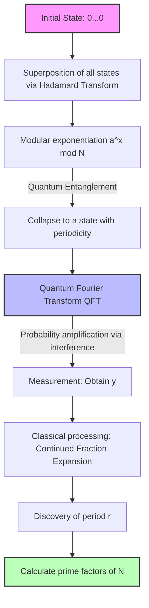

Information security in the modern internet society is protected by public-key cryptography, such as RSA cryptography. The basis for the security of RSA relies on the fact that **"the prime factorization of huge composite numbers is computationally extremely difficult."**

In this article, we will unravel the mathematical mechanism of the **"General Number Field Sieve"** (GNFS), which is the most powerful prime factorization algorithm for classical computers. We will also dive deeply into why it is completely defeated by **"Shor's Algorithm,"** discovered by Peter Shor, exploring this paradigm shift thoroughly with mathematical formulas and conceptual diagrams.

---

## 1. The Approach to Prime Factorization in Classical Computing: Evolution from Fermat's Factorization Method

The prime factorization problem is the problem of finding prime numbers $p$ and $q$ such that $N = p \times q$ for a given composite number $N$.

The basic idea reduces to finding non-trivial $x$ and $y$ that satisfy the following congruence:

$$ x^2 \equiv y^2 \pmod N $$

By rearranging this, we get:

$$ x^2 - y^2 \equiv 0 \pmod N $$
$$ (x - y)(x + y) \equiv 0 \pmod N $$

Here, if $x \not\equiv \pm y \pmod N$, we can obtain a non-trivial factor of $N$ by calculating $\gcd(x-y, N)$ or $\gcd(x+y, N)$. This fact is the foundation of modern prime factorization algorithms like GNFS.

---

## 2. The Ultimate Classical Algorithm: The Depths of the "General Number Field Sieve" (GNFS)

**"GNFS"** is the fastest known prime factorization algorithm for classical computers today. Its time complexity requires sub-exponential time.

### Complexity of GNFS

Letting the number of digits (bits) of the number $N$ be $b = \log_2 N$, the computational complexity of GNFS is expressed as follows:

$$ O\left( \exp \left( \left(\frac{64}{9} b\right)^{1/3} (\log b)^{2/3} \right) \right) $$

As can be seen from this formula, the computational complexity is not polynomial time, but **"sub-exponential time,"** which is slightly slower than exponential time. Still, as the number of digits increases, the computation time grows astronomically.

### Mathematical Mechanism of GNFS

GNFS consists broadly of four steps:

1. **Polynomial Selection**
2. **Sieving**
3. **Matrix Reduction**
4. **Square Root**

#### 2.1. Polynomial Selection and Number Fields

First, we select irreducible polynomials $f(x)$ and $g(x)$ with integer coefficients. These are set to have a common root $m$ modulo $N$. That is,

$$ f(m) \equiv 0 \pmod N $$
$$ g(m) \equiv 0 \pmod N $$

Usually, $g(x)$ is chosen as a linear polynomial $g(x) = x - m$. If we let $\alpha$ be a root of $f(x)$, a **"Number Field"** $\mathbb{Q}(\alpha)$ is constructed. We compare operations in the ring of $\mathbb{Q}(\alpha)$ and operations in the normal integer ring $\mathbb{Z}$ through the homomorphism $\phi: \alpha \mapsto m$.

#### 2.2. Sieving

Next, we search for a massive number of coprime integer pairs $(a, b)$. The goal is to find pairs such that the following two values are both **"B-smooth"** (composed only of relatively small prime factors):

1. $a - bm$ (value over the integer ring)
2. $b^d f(a/b)$ (corresponding to the norm $N(a - b\alpha)$ over the number field)

Here, a high-speed search method called a **"Sieve"** is used. This efficiently extracts $(a, b)$ pairs that satisfy the conditions from a vast number of candidates.

#### 2.3. Linear Algebra over GF(2) (Matrix Reduction)

From the collected pairs $(a, b)$, we construct exponent vectors and find the left null space of a massive sparse matrix over $\mathbb{F}_2$ (the field with only elements 0 and 1).

We find a vector $v$ as a solution so that the relations $ \prod (a_i - b_i m) $ and $ \prod (a_i - b_i \alpha) $ both become squares. This is nothing but solving a system of linear equations:

$$ M \mathbf{x} \equiv \mathbf{0} \pmod 2 $$

Advanced numerical algorithms such as the Block Lanczos Algorithm and the Block Wiedemann Algorithm are utilized here.

#### 2.4. Square Root

Finally, we take square roots in both the number field and the integer ring to derive the relation $x^2 \equiv y^2 \pmod N$. Then, we calculate $\gcd(x-y, N)$ to obtain the factor.

---

## 3. The Breakthrough by Quantum Computing: "Shor's Algorithm"

While GNFS requires sub-exponential time, **"Shor's Algorithm,"** published by Peter Shor in 1994, can solve this problem in **"polynomial time"** by using a quantum computer.

### Complexity of Shor's Algorithm

When the number of qubits is $O(\log N)$, the time complexity is as follows:

$$ O((\log N)^3) $$

This means it does not cause an exponential explosion with respect to the number of bits. This is an astonishing result: even for huge composite numbers where the complexity of **"classical computing"** exceeds the lifespan of the universe, they can be cracked in hours to days with **"quantum computing."**

### Overview of Shor's Algorithm: Reduction to the Period-Finding Problem

Shor's algorithm cleverly reduces the prime factorization problem to a **"period-finding problem."**

1. Choose a random integer $a$ coprime to $N$ ($1 < a < N$).
2. Define the function $f(x) = a^x \bmod N$.
3. Find the period $r$ of $f(x)$, i.e., the smallest positive integer $r$ such that $a^r \equiv 1 \pmod N$.
4. If $r$ is even, check if $a^{r/2} \not\equiv -1 \pmod N$, and calculate $\gcd(a^{r/2} \pm 1, N)$ to obtain a prime factor.

**"Finding the period $r$"** in step 3 is the bottleneck that requires exponential time on classical computers, but quantum computers solve this instantly using **"quantum superposition"** and the **"Quantum Fourier Transform"** (QFT).

---

## 4. Quantum Fourier Transform (QFT) and Period Extraction

Let's look in detail with formulas at the manipulation of quantum states, which is the core of Shor's algorithm.

### 4.1. Generation of Quantum Superposition

First, we prepare two quantum registers. Register 1 holds a superposition state of inputs $x$, and Register 2 holds the computation result $f(x)$. We apply the Hadamard Transform to the initial state $|0\rangle |0\rangle$ to create a superposition of all possible $x$.

$$ |\psi_1\rangle = \frac{1}{\sqrt{Q}} \sum_{x=0}^{Q-1} |x\rangle |0\rangle $$
(Here $Q$ is a power of 2 satisfying $N^2 \le Q < 2N^2$)

Next, we use a quantum oracle $U_f$ to compute $f(x) = a^x \bmod N$ and store it in Register 2.

$$ |\psi_2\rangle = U_f |\psi_1\rangle = \frac{1}{\sqrt{Q}} \sum_{x=0}^{Q-1} |x\rangle |a^x \bmod N\rangle $$

Let's assume here that we measure Register 2 (in reality, the mathematical structure is the same even without measurement). If a value $y = a^{x_0} \bmod N$ is observed, the state of Register 1 collapses into a superposition of all $x$ such that $f(x) = y$. Letting the period be $r$, such $x$ are $x_0, x_0 + r, x_0 + 2r, \dots$

$$ |\psi_3\rangle = \frac{1}{\sqrt{M}} \sum_{k=0}^{M-1} |x_0 + kr\rangle $$
(Here $M \approx Q/r$ is the number of terms)

This state inherently contains information about the period $r$, but direct measurement will only yield a random $x_0 + kr$, and the period $r$ remains unknown. This is where QFT comes in.

### 4.2. Application of the Quantum Fourier Transform (QFT)

QFT is an operation that performs a discrete Fourier transform on the amplitudes of quantum states. The action of QFT on state $|x\rangle$ is defined as follows:

$$ \text{QFT} |x\rangle = \frac{1}{\sqrt{Q}} \sum_{y=0}^{Q-1} e^{2\pi i \frac{xy}{Q}} |y\rangle $$

When this is applied to $|\psi_3\rangle$, phase interference (quantum interference) occurs.

$$ |\psi_4\rangle = \text{QFT} |\psi_3\rangle = \frac{1}{\sqrt{MQ}} \sum_{y=0}^{Q-1} \sum_{k=0}^{M-1} e^{2\pi i \frac{(x_0 + kr)y}{Q}} |y\rangle $$

Expanding the sum in this equation reveals the part:

$$ \sum_{k=0}^{M-1} e^{2\pi i \frac{kry}{Q}} $$

This sum of a geometric series reinforces each other (Constructive Interference) only when $ry/Q$ is close to an integer, and cancels each other out (Destructive Interference) otherwise.

Therefore, the state $|y\rangle$ measured with high probability will be an integer $y$ that satisfies the condition:

$$ \frac{y}{Q} \approx \frac{c}{r} $$

(where $c$ is some integer).

### 4.3. Identifying the Period via Continued Fraction Expansion

After obtaining $y$ through measurement, we perform a **"Continued Fraction Expansion"** of $y/Q$ using a classical computer. This allows us to calculate the convergent fraction $c/r$ of $y/Q$, and extract candidates for the period $r$ from the denominator with high efficiency.

---

## 5. Comparison of Conceptual Models and the Paradigm Shift

To intuitively understand the difference between GNFS and Shor's algorithm, we present a conceptual diagram using Mermaid notation.

### Conceptual Diagram of Shor's Algorithm via Quantum Circuit

### The Essence of the Paradigm Shift

GNFS takes the approach of **"searching for relations within a mathematical space (number field)."** However, since the search space expands exponentially with the number of digits, it becomes virtually unsolvable for classical computer capabilities (even including parallelization) when the key length exceeds 2048 bits.

On the other hand, Shor's algorithm utilizes the **"wave nature of quantum interference."** It simultaneously evaluates all computation paths in a superposition state, uses QFT to cancel out (destructively interfere) unnecessary answers, and amplifies (constructively interferes) only the probability amplitude of the period that is the correct answer. Through this, instead of searching space, it realizes a completely different dimensional approach of **"making the correct answer itself surface."**

## 6. Summary

In this article, we deeply compared the mathematical backgrounds and algorithmic structures of **"GNFS,"** the pinnacle of classical limits, and **"Shor's Algorithm,"** which demonstrates the power of quantum computing.

While GNFS drove computational complexity down to sub-exponential time by employing mathematical tricks such as polynomial selection and massive matrix calculations, Shor's algorithm fused the fundamental principles of quantum mechanics—superposition and interference—with a mathematical tool (QFT), achieving a breakthrough to polynomial time in one stroke.

Currently, Fault-Tolerant Quantum Computers (FTQC) capable of executing Shor's algorithm at a practical scale (thousands of qubits) do not exist. However, the very existence of this mathematical and theoretical paradigm shift is the primary reason why the transition to Post-Quantum Cryptography (PQC) is urgently being accelerated worldwide today.
