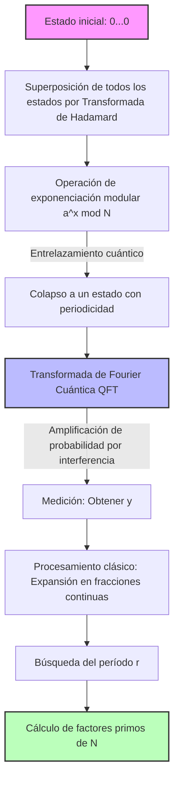

---

title: '[Consideración matemática] ¿Por qué el algoritmo de descifrado ''GNFS'' es derrotado por el algoritmo de Shor en la era cuántica?'
slug: "gnfs-to-shors-algorithm-math-deepdive"
date: 2026-09-06T12:00:00+09:00
tags: ["Computación cuántica", "GNFS", "Algoritmo de Shor", "Criptoanálisis", "Matemáticas"]
image: "quantum_vs_gnfs_eyecatch_1788616101508.jpg"
mermaid: true
math: true
categories: ["Matemáticas・Criptografía・Cuántica"]
---

La seguridad de la información en la sociedad de Internet moderna está protegida por sistemas de criptografía de clave pública como la criptografía RSA. La base de la seguridad del cifrado RSA depende del hecho de que **"la factorización de números compuestos enormes es computacionalmente muy difícil"**.

En este artículo, desentrañaremos el mecanismo matemático de la **"Criba General del Cuerpo de Números"** (General Number Field Sieve, GNFS), que es el algoritmo de factorización más fuerte en computadoras clásicas, y profundizaremos a través de fórmulas y diagramas conceptuales por qué es completamente derrotado por el **"Algoritmo de Shor"** descubierto por Peter Shor, y el cambio de paradigma que esto representa.

---

## 1. El enfoque de la factorización en la computación clásica: Desarrollo a partir del método de factorización de Fermat

El problema de factorización prima es encontrar los números primos $p, q$ tales que $N = p \times q$ para un número compuesto $N$ dado.

La idea básica se reduce a encontrar valores no triviales $x, y$ que satisfagan la siguiente congruencia:

$$ x^2 \equiv y^2 \pmod N $$

Transformando esto,

$$ x^2 - y^2 \equiv 0 \pmod N $$
$$ (x - y)(x + y) \equiv 0 \pmod N $$

Aquí, si $x \not\equiv \pm y \pmod N$, al calcular $\gcd(x-y, N)$ o $\gcd(x+y, N)$, podemos obtener un factor no trivial de $N$. Este hecho es la base de los algoritmos de factorización modernos como GNFS.

---

## 2. El algoritmo clásico más fuerte: Las profundidades de la "Criba General del Cuerpo de Números" (GNFS)

**"GNFS"** es el algoritmo de factorización más rápido conocido en la actualidad para computadoras clásicas. Su complejidad temporal requiere un tiempo subexponencial.

### Complejidad del GNFS

Si el número de dígitos de $N$ es $b = \log_2 N$, la complejidad del GNFS se expresa de la siguiente manera:

$$ O\left( \exp \left( \left(\frac{64}{9} b\right)^{1/3} (\log b)^{2/3} \right) \right) $$

Como se puede ver en esta fórmula, el tiempo de cálculo no es polinomial, sino **"tiempo subexponencial"**, que es ligeramente más lento que el exponencial. Aun así, si el número de dígitos aumenta, el tiempo de cálculo aumenta astronómicamente.

### Mecanismo matemático de GNFS

GNFS consta principalmente de 4 pasos:

1. **Selección de polinomios (Polynomial Selection)**
2. **Criba (Sieving)**
3. **Reducción de matrices (Matrix Reduction)**
4. **Cálculo de raíz cuadrada (Square Root)**

#### 2.1. Selección de polinomios y cuerpos de números

Primero, seleccionamos polinomios irreducibles $f(x)$ y $g(x)$ con coeficientes enteros. Estos se configuran para tener una raíz común $m$ módulo $N$. Es decir,

$$ f(m) \equiv 0 \pmod N $$
$$ g(m) \equiv 0 \pmod N $$

Normalmente, $g(x)$ se elige como un polinomio de primer grado $g(x) = x - m$. Si hacemos que la raíz de $f(x)$ sea $\alpha$, construimos un **"cuerpo de números"** (Number Field) llamado $\mathbb{Q}(\alpha)$. Comparamos las operaciones en el anillo de $\mathbb{Q}(\alpha)$ y las operaciones en el anillo de enteros habitual $\mathbb{Z}$ a través del homomorfismo $\phi: \alpha \mapsto m$.

#### 2.2. Criba (Sieving)

A continuación, buscamos una gran cantidad de pares de enteros coprimos $(a, b)$. El objetivo es encontrar pares tales que los dos valores siguientes sean **"B-smooth"** (compuestos solo por factores primos relativamente pequeños):

1. $a - bm$ (valor en el anillo de enteros)
2. $b^d f(a/b)$ (correspondiente a la norma $N(a - b\alpha)$ sobre el cuerpo de números)

Aquí se utiliza una técnica de búsqueda rápida llamada **"criba"** (Sieve). Esto extrae eficientemente pares $(a, b)$ que cumplen las condiciones de entre una enorme cantidad de candidatos.

#### 2.3. Reducción de matrices (Linear Algebra over GF(2))

A partir de los pares recolectados $(a, b)$, formamos vectores de exponentes y encontramos el espacio nulo izquierdo de una enorme matriz dispersa sobre $\mathbb{F}_2$ (un cuerpo cuyos elementos son solo 0 y 1).

Encontramos el vector $v$ como solución para que las relaciones $ \prod (a_i - b_i m) $ y $ \prod (a_i - b_i \alpha) $ se conviertan ambas en elementos cuadrados. Esto no es más que resolver el sistema de ecuaciones lineales:

$$ M \mathbf{x} \equiv \mathbf{0} \pmod 2 $$

Aquí se aprovechan algoritmos numéricos avanzados como el algoritmo de Block Lanczos o el algoritmo de Block Wiedemann.

#### 2.4. Cálculo de raíz cuadrada

Finalmente, extraemos raíces cuadradas tanto en el cuerpo de números como en el anillo de enteros para derivar la relación $x^2 \equiv y^2 \pmod N$. Luego, calculamos $\gcd(x-y, N)$ para obtener los factores.

---

## 3. El avance mediante computación cuántica: "Algoritmo de Shor"

Mientras que el GNFS requiere tiempo subexponencial, el **"Algoritmo de Shor"** introducido por Peter Shor en 1994 puede resolver este problema en **"tiempo polinomial"** utilizando una computadora cuántica.

### Complejidad del Algoritmo de Shor

Cuando el número de qubits es $O(\log N)$, la complejidad temporal es:

$$ O((\log N)^3) $$

Esto significa que no causa una explosión exponencial con respecto al número de bits. Es un resultado sorprendente donde números compuestos enormes que excederían la vida útil del universo con **"computación clásica"**, pueden ser descifrados en unas pocas horas o días con **"computación cuántica"**.

### Visión general del Algoritmo de Shor: Reducción al problema de búsqueda de períodos

El algoritmo de Shor reduce ingeniosamente el problema de factorización prima a un **"problema de búsqueda de períodos"**.

1. Elegir un entero aleatorio $a$ coprimo con $N$ ($1 < a < N$).
2. Definir la función $f(x) = a^x \bmod N$.
3. Encontrar el período $r$ de $f(x)$, es decir, el entero positivo mínimo $r$ tal que $a^r \equiv 1 \pmod N$.
4. Si $r$ es par, verificar si $a^{r/2} \not\equiv -1 \pmod N$ y calcular $\gcd(a^{r/2} \pm 1, N)$ para obtener los factores primos.

Esta **"búsqueda del período $r$"** en el paso 3 es el cuello de botella que requiere un tiempo exponencial en las computadoras clásicas, pero las computadoras cuánticas lo resuelven en un instante utilizando **"superposición cuántica"** y la **"Transformada de Fourier Cuántica"** (QFT).

---

## 4. Transformada de Fourier Cuántica (QFT) y Extracción de Períodos

Veamos en detalle a través de fórmulas la manipulación de estados cuánticos, que es el núcleo del algoritmo de Shor.

### 4.1. Generación de superposición cuántica

Primero, preparamos dos registros cuánticos. El registro 1 almacena el estado de superposición de la entrada $x$, y el registro 2 almacena el resultado de la función $f(x)$. Aplicamos la Transformada de Hadamard al estado inicial $|0\rangle |0\rangle$ para crear una superposición de todos los $x$ posibles.

$$ |\psi_1\rangle = \frac{1}{\sqrt{Q}} \sum_{x=0}^{Q-1} |x\rangle |0\rangle $$
(donde $Q$ es una potencia de 2 que satisface $N^2 \le Q < 2N^2$)

A continuación, utilizamos el oráculo cuántico $U_f$ para calcular $f(x) = a^x \bmod N$ y almacenarlo en el registro 2.

$$ |\psi_2\rangle = U_f |\psi_1\rangle = \frac{1}{\sqrt{Q}} \sum_{x=0}^{Q-1} |x\rangle |a^x \bmod N\rangle $$

Supongamos que medimos el registro 2 aquí (en realidad, la estructura matemática es la misma incluso sin medir). Si se observa un cierto valor $y = a^{x_0} \bmod N$, el estado del registro 1 colapsa a una superposición de todos los $x$ tales que $f(x) = y$. Si el período es $r$, tales $x$ serán $x_0, x_0 + r, x_0 + 2r, \dots$

$$ |\psi_3\rangle = \frac{1}{\sqrt{M}} \sum_{k=0}^{M-1} |x_0 + kr\rangle $$
(donde $M \approx Q/r$ es el número de términos)

Este estado contiene información sobre el período $r$, pero la medición directa solo arrojaría un $x_0 + kr$ aleatorio, por lo que el período $r$ sigue siendo desconocido. Aquí es donde entra en juego la QFT.

### 4.2. Aplicación de la Transformada de Fourier Cuántica

La QFT es una operación que realiza una transformada de Fourier discreta sobre las amplitudes de los estados cuánticos. La acción de la QFT sobre el estado $|x\rangle$ se define de la siguiente manera:

$$ \text{QFT} |x\rangle = \frac{1}{\sqrt{Q}} \sum_{y=0}^{Q-1} e^{2\pi i \frac{xy}{Q}} |y\rangle $$

Al aplicar esto a $|\psi_3\rangle$, ocurre una interferencia de fase (interferencia cuántica).

$$ |\psi_4\rangle = \text{QFT} |\psi_3\rangle = \frac{1}{\sqrt{MQ}} \sum_{y=0}^{Q-1} \sum_{k=0}^{M-1} e^{2\pi i \frac{(x_0 + kr)y}{Q}} |y\rangle $$

Expandiendo la suma en esta fórmula,

$$ \sum_{k=0}^{M-1} e^{2\pi i \frac{kry}{Q}} $$

Aparece esta parte. La suma de esta serie geométrica se refuerza constructivamente solo cuando $ry/Q$ está cerca de un entero (Interferencia constructiva), y de lo contrario se cancela mutuamente (Interferencia destructiva).

Por lo tanto, el estado $|y\rangle$ medido con alta probabilidad es un entero $y$ que satisface la condición:

$$ \frac{y}{Q} \approx \frac{c}{r} $$
(donde $c$ es algún entero).

### 4.3. Identificación de períodos mediante expansión en fracciones continuas

Después de obtener $y$ mediante medición, usamos una computadora clásica para realizar la **"expansión en fracciones continuas"** (Continued Fraction Expansion) de $y/Q$. Esto nos permite calcular la fracción aproximada $c/r$ de $y/Q$ y extraer eficientemente los candidatos para el período $r$ a partir del denominador.

---

## 5. Comparación de modelos conceptuales y el cambio de paradigma

Para entender intuitivamente la diferencia entre GNFS y el algoritmo de Shor, mostramos un diagrama conceptual utilizando sintaxis Mermaid.

### Diagrama conceptual del algoritmo de Shor mediante circuito cuántico

### La esencia del cambio de paradigma

El GNFS adopta el enfoque de **"buscar relaciones dentro de un espacio matemático (cuerpo de números)"**. Sin embargo, debido a que el espacio de búsqueda se expande exponencialmente con el número de dígitos, la capacidad de cálculo de las computadoras clásicas (incluso con paralelización) hace que sea virtualmente imposible de descifrar cuando la longitud de la clave supera los 2048 bits, etc.

Por otro lado, el algoritmo de Shor utiliza **"las propiedades ondulatorias debidas a la interferencia cuántica"**. Evalúa simultáneamente todas las rutas de cálculo en estado de superposición y cancela (interferencia destructiva) las respuestas innecesarias mediante la QFT, amplificando (interferencia constructiva) solo la amplitud de probabilidad del período que es la respuesta correcta. Con esto, logra un enfoque en una dimensión completamente diferente que, en lugar de buscar en el espacio, **"hace que la respuesta correcta misma emerja"**.

## 6. Conclusión

En este artículo, comparamos profundamente los antecedentes matemáticos y las estructuras de los algoritmos de **"GNFS"**, que es el pináculo del límite clásico, y el **"Algoritmo de Shor"**, que muestra el poder de la computación cuántica.

Mientras que el GNFS redujo la complejidad temporal al tiempo subexponencial mediante elaboradas técnicas matemáticas como la selección de polinomios y el cálculo de enormes matrices, el algoritmo de Shor fusionó la superposición y la interferencia, que son los principios básicos de la mecánica cuántica, con herramientas matemáticas (QFT) para lograr un avance hacia el tiempo polinomial de un solo golpe.

Actualmente, no existe una computadora cuántica tolerante a fallas (FTQC) que pueda ejecutar el algoritmo de Shor a una escala práctica (miles de qubits). Sin embargo, la existencia misma de este cambio de paradigma matemático y teórico es la mayor razón por la que en todo el mundo se está acelerando la transición a la criptografía poscuántica (PQC: Post-Quantum Cryptography).
