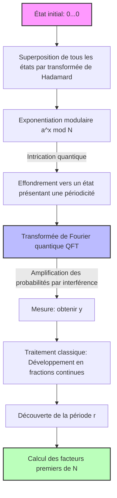

Dans la société Internet moderne, la sécurité des informations est protégée par des systèmes de cryptographie à clé publique tels que le chiffrement RSA. Le fondement de la sécurité du chiffrement RSA repose sur le fait suivant : **« la factorisation de nombres composés géants est extrêmement difficile sur le plan de la complexité des calculs »**.

Cet article décortique le mécanisme mathématique du **« crible algébrique »** (General Number Field Sieve, GNFS), l'algorithme de factorisation en nombres premiers le plus puissant sur les ordinateurs classiques, et explore en profondeur, à l'aide de formules et de schémas conceptuels, ce changement de paradigme et pourquoi il est complètement vaincu par **« l'algorithme de Shor »** découvert par Peter Shor.

---

## 1. L'approche de la factorisation en nombres premiers dans le calcul classique : Évolution à partir de la méthode de factorisation de Fermat

Le problème de la factorisation en nombres premiers consiste, pour un nombre composé $N$ donné, à trouver les nombres premiers $p, q$ tels que $N = p \times q$.

L'idée fondamentale se ramène à trouver des valeurs non triviales $x, y$ satisfaisant la congruence suivante.

$$ x^2 \equiv y^2 \pmod N $$

En réécrivant cela, on obtient :

$$ x^2 - y^2 \equiv 0 \pmod N $$
$$ (x - y)(x + y) \equiv 0 \pmod N $$

Ici, si $x \not\equiv \pm y \pmod N$, en calculant $\gcd(x-y, N)$ ou $\gcd(x+y, N)$, on peut obtenir un facteur non trivial de $N$. Ce fait constitue la base des algorithmes modernes de factorisation en nombres premiers tels que le GNFS.

---

## 2. Le plus puissant algorithme classique : Les profondeurs du « crible algébrique » (GNFS)

Le **« GNFS »** est l'algorithme de factorisation en nombres premiers pour ordinateurs classiques le plus rapide connu à ce jour. Sa complexité temporelle nécessite un temps sous-exponentiel (Sub-exponential).

### La complexité du GNFS

Si l'on note $b = \log_2 N$ le nombre de chiffres du nombre $N$, la complexité du GNFS s'exprime comme suit :

$$ O\left( \exp \left( \left(\frac{64}{9} b\right)^{1/3} (\log b)^{2/3} \right) \right) $$

Comme le montre cette formule, la complexité n'est pas polynomiale, mais correspond à un **« temps sous-exponentiel »**, légèrement plus lent qu'une fonction exponentielle. Néanmoins, lorsque le nombre de chiffres augmente, le temps de calcul croît de manière astronomique.

### Le mécanisme mathématique du GNFS

Le GNFS se compose principalement de 4 étapes.

1. **Sélection des polynômes (Polynomial Selection)**
2. **Criblage (Sieving)**
3. **Réduction matricielle (Matrix Reduction)**
4. **Calcul de la racine carrée (Square Root)**

#### 2.1. Sélection des polynômes et corps de nombres

Tout d'abord, on choisit des polynômes irréductibles $f(x)$ et $g(x)$ à coefficients entiers. Ceux-ci sont définis pour avoir une racine commune $m$ modulo $N$. C'est-à-dire :

$$ f(m) \equiv 0 \pmod N $$
$$ g(m) \equiv 0 \pmod N $$

Généralement, $g(x)$ est choisi comme un polynôme de degré un $g(x) = x - m$. Si l'on note $\alpha$ la racine de $f(x)$, un **« corps de nombres »** (Number Field) $\mathbb{Q}(\alpha)$ est construit. Les opérations dans l'anneau de $\mathbb{Q}(\alpha)$ et les opérations dans l'anneau usuel des entiers $\mathbb{Z}$ sont comparées via l'homomorphisme $\phi: \alpha \mapsto m$.

#### 2.2. Criblage (Sieving)

Ensuite, on explore une grande quantité de paires d'entiers premiers entre eux $(a, b)$. L'objectif est de trouver des paires telles que les deux valeurs suivantes soient chacune **« B-friables »** (composées uniquement de facteurs premiers relativement petits).

1. $a - bm$ (valeur sur l'anneau des entiers)
2. $b^d f(a/b)$ (correspondant à la norme $N(a - b\alpha)$ sur le corps de nombres)

Ici, une méthode de recherche rapide appelée **« crible »** (Sieve) est utilisée. Cela permet d'extraire efficacement les paires $(a, b)$ remplissant les conditions parmi un très grand nombre de candidats.

#### 2.3. Réduction matricielle (Linear Algebra over GF(2))

À partir des paires $(a, b)$ collectées, on construit des vecteurs d'exposants et on détermine le noyau à gauche d'une énorme matrice creuse sur $\mathbb{F}_2$ (le corps dont les éléments sont uniquement 0 et 1).

On trouve un vecteur $v$ comme solution de sorte que les relations $ \prod (a_i - b_i m) $ et $ \prod (a_i - b_i \alpha) $ deviennent chacune un élément carré. Cela revient ni plus ni moins à résoudre le système d'équations linéaires :

$$ M \mathbf{x} \equiv \mathbf{0} \pmod 2 $$

Ici, des algorithmes de calcul numérique avancés comme l'algorithme de Lanczos par blocs (Block Lanczos Algorithm) ou l'algorithme de Wiedemann par blocs (Block Wiedemann Algorithm) sont mis à profit.

#### 2.4. Calcul de la racine carrée

Enfin, on extrait la racine carrée à la fois dans le corps de nombres et dans l'anneau des entiers, pour dériver la relation $x^2 \equiv y^2 \pmod N$. Ensuite, on calcule $\gcd(x-y, N)$ pour obtenir les facteurs.

---

## 3. La percée grâce au calcul quantique : « L'algorithme de Shor »

Alors que le GNFS nécessite un temps sous-exponentiel, **« l'algorithme de Shor »**, publié en 1994 par Peter Shor, peut résoudre ce problème en un **« temps polynomial »** en utilisant un ordinateur quantique.

### La complexité de l'algorithme de Shor

Si l'on suppose le nombre de qubits comme étant de $O(\log N)$, la complexité temporelle est la suivante :

$$ O((\log N)^3) $$

Cela signifie qu'elle ne provoque pas d'explosion exponentielle par rapport au nombre de bits. C'est un résultat stupéfiant : même pour un nombre composé géant où le **« calcul classique »** nécessiterait une durée de vie supérieure à celle de l'univers, le **« calcul quantique »** pourrait le décrypter en quelques heures ou quelques jours.

### Vue d'ensemble de l'algorithme de Shor : Réduction au problème de recherche de période

L'algorithme de Shor ramène astucieusement le problème de la factorisation en nombres premiers au **« problème de recherche de période »**.

1. Choisir un entier aléatoire $a$ premier avec $N$ ($1 < a < N$).
2. Définir la fonction $f(x) = a^x \bmod N$.
3. Trouver la période $r$ de $f(x)$, c'est-à-dire le plus petit entier positif $r$ tel que $a^r \equiv 1 \pmod N$.
4. Si $r$ est pair, vérifier si $a^{r/2} \not\equiv -1 \pmod N$, puis calculer $\gcd(a^{r/2} \pm 1, N)$ pour obtenir les facteurs premiers.

C'est cette étape 3, la **« découverte de la période $r$ »**, qui est le goulet d'étranglement nécessitant un temps exponentiel sur un ordinateur classique, mais que l'ordinateur quantique résout instantanément grâce à la **« superposition quantique »** et à la **« transformée de Fourier quantique »** (QFT).

---

## 4. Transformée de Fourier Quantique (QFT) et extraction de la période

Regardons de plus près avec des formules les opérations sur les états quantiques, qui constituent le cœur de l'algorithme de Shor.

### 4.1. Génération de la superposition quantique

Tout d'abord, on prépare deux registres quantiques. Le registre 1 conserve l'état superposé de l'entrée $x$, et le registre 2 conserve le résultat calculé de la fonction $f(x)$. On applique une transformée de Hadamard (Hadamard Transform) sur l'état initial $|0\rangle |0\rangle$ pour créer une superposition de tous les $x$ possibles.

$$ |\psi_1\rangle = \frac{1}{\sqrt{Q}} \sum_{x=0}^{Q-1} |x\rangle |0\rangle $$
(où $Q$ est une puissance de 2 satisfaisant $N^2 \le Q < 2N^2$)

Ensuite, à l'aide de l'oracle quantique $U_f$, on calcule $f(x) = a^x \bmod N$ et on le stocke dans le registre 2.

$$ |\psi_2\rangle = U_f |\psi_1\rangle = \frac{1}{\sqrt{Q}} \sum_{x=0}^{Q-1} |x\rangle |a^x \bmod N\rangle $$

Supposons ici que l'on ait mesuré le registre 2 (en réalité, la structure mathématique est la même même sans mesure). Si une valeur $y = a^{x_0} \bmod N$ est observée, l'état du registre 1 s'effondre en une superposition de tous les $x$ tels que $f(x) = y$. Si la période est $r$, ces $x$ sont $x_0, x_0 + r, x_0 + 2r, \dots$

$$ |\psi_3\rangle = \frac{1}{\sqrt{M}} \sum_{k=0}^{M-1} |x_0 + kr\rangle $$
(où $M \approx Q/r$ est le nombre de termes)

Cet état recèle les informations de la période $r$, mais une mesure directe donnerait seulement un $x_0 + kr$ aléatoire, sans que la période $r$ ne soit connue. C'est ici que la QFT entre en jeu.

### 4.2. Application de la transformée de Fourier quantique (Quantum Fourier Transform)

La QFT est une opération qui effectue une transformée de Fourier discrète sur les amplitudes des états quantiques. L'action de la QFT sur l'état $|x\rangle$ est définie comme suit.

$$ \text{QFT} |x\rangle = \frac{1}{\sqrt{Q}} \sum_{y=0}^{Q-1} e^{2\pi i \frac{xy}{Q}} |y\rangle $$

En appliquant cela à $|\psi_3\rangle$, il se produit des interférences de phase (interférence quantique).

$$ |\psi_4\rangle = \text{QFT} |\psi_3\rangle = \frac{1}{\sqrt{MQ}} \sum_{y=0}^{Q-1} \sum_{k=0}^{M-1} e^{2\pi i \frac{(x_0 + kr)y}{Q}} |y\rangle $$

En développant la somme de cette équation, on obtient la partie :

$$ \sum_{k=0}^{M-1} e^{2\pi i \frac{kry}{Q}} $$

La somme de cette suite géométrique se renforce (Constructive Interference) uniquement lorsque $ry/Q$ est proche d'un entier, et s'annule (Destructive Interference) le reste du temps.

Par conséquent, l'état mesuré $|y\rangle$ avec une forte probabilité correspondra à un entier $y$ satisfaisant la condition :

$$ \frac{y}{Q} \approx \frac{c}{r} $$
(où $c$ est un certain entier).

### 4.3. Détermination de la période par le développement en fractions continues

Après avoir obtenu $y$ par la mesure, on utilise un ordinateur classique pour effectuer le **« développement en fractions continues »** (Continued Fraction Expansion) de $y/Q$. Cela permet de calculer la fraction approximative $c/r$ de $y/Q$, et d'extraire de manière hautement efficace les candidats pour la période $r$ à partir du dénominateur.

---

## 5. Comparaison des modèles conceptuels et changement de paradigme

Pour comprendre intuitivement la différence entre le GNFS et l'algorithme de Shor, voici un schéma conceptuel utilisant la notation Mermaid.

### Schéma conceptuel de l'algorithme de Shor par circuit quantique

### L'essence du changement de paradigme

Le GNFS adopte l'approche d'**« explorer des relations dans un espace mathématique (corps de nombres) »**. Cependant, comme l'espace de recherche s'étend exponentiellement par rapport au nombre de chiffres, avec la puissance de calcul des ordinateurs classiques (même en incluant la parallélisation), le décryptage devient virtuellement impossible lorsque la longueur de la clé dépasse 2048 bits par exemple.

D'un autre côté, l'algorithme de Shor utilise la **« nature ondulatoire due à l'interférence quantique »**. Il évalue simultanément tous les chemins de calcul dans un état superposé, annule les mauvaises réponses par la QFT (interférence destructive), et amplifie uniquement l'amplitude de probabilité de la période correspondant à la bonne réponse (interférence constructive). De cette façon, il ne s'agit pas d'explorer l'espace, mais de **« faire émerger la réponse exacte d'elle-même »**, réalisant ainsi une approche d'une dimension totalement différente.

## 6. Résumé

Cet article a profondément comparé les structures algorithmiques et le contexte mathématique du **« GNFS »**, qui représente l'ultime limite classique, et de **« l'algorithme de Shor »**, qui démontre la puissance du calcul quantique.

Alors que le GNFS, grâce à des astuces mathématiques telles que le choix des polynômes et le calcul de matrices géantes, est parvenu à abaisser sa complexité à un temps sous-exponentiel, l'algorithme de Shor fusionne les principes fondamentaux de la mécanique quantique (superposition et interférence) avec un outil mathématique (la QFT) pour accomplir une percée immédiate vers le temps polynomial.

Actuellement, il n'existe pas d'ordinateur quantique tolérant aux pannes (FTQC) capable d'exécuter l'algorithme de Shor à une échelle pratique (plusieurs milliers de qubits). Cependant, l'existence même de ce changement de paradigme mathématique et théorique est la principale raison pour laquelle la transition vers la cryptographie post-quantique (PQC : Post-Quantum Cryptography) est si urgente partout dans le monde aujourd'hui.
