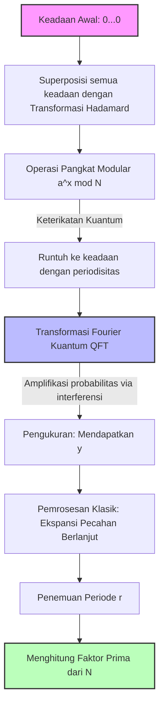

Keamanan informasi dalam masyarakat internet modern dilindungi oleh kriptografi kunci publik seperti kriptografi RSA. Dasar keamanan kriptografi RSA bergantung pada fakta bahwa **"faktorisasi prima dari bilangan komposit yang sangat besar sangatlah sulit secara komputasi"** .

Dalam artikel ini, kita akan mengungkap mekanisme matematis dari **"General Number Field Sieve"** (GNFS), algoritma faktorisasi prima terkuat untuk komputer klasik, dan mendalami mengapa algoritma ini sepenuhnya dikalahkan oleh **"Algoritma Shor"** yang ditemukan oleh Peter Shor. Kita akan mengeksplorasi pergeseran paradigma ini secara mendalam menggunakan rumus dan diagram konseptual.

---

## 1. Pendekatan Faktorisasi Prima dalam Komputasi Klasik: Perkembangan dari Metode Faktorisasi Fermat

Masalah faktorisasi prima adalah masalah untuk menemukan bilangan prima $p, q$ sedemikian rupa sehingga $N = p \times q$ untuk suatu bilangan komposit $N$ yang diberikan.

Ide dasarnya bermuara pada penemuan $x, y$ non-trivial yang memenuhi persamaan kongruensi berikut:

$$ x^2 \equiv y^2 \pmod N $$

Jika kita memodifikasinya, kita mendapatkan:

$$ x^2 - y^2 \equiv 0 \pmod N $$
$$ (x - y)(x + y) \equiv 0 \pmod N $$

Di sini, jika $x \not\equiv \pm y \pmod N$, kita dapat memperoleh faktor non-trivial dari $N$ dengan menghitung $\gcd(x-y, N)$ atau $\gcd(x+y, N)$. Fakta ini merupakan dasar dari algoritma faktorisasi modern seperti GNFS.

---

## 2. Algoritma Klasik Terkuat: Kedalaman dari "General Number Field Sieve" (GNFS)

**"GNFS"** adalah algoritma faktorisasi prima tercepat yang diketahui untuk komputer klasik saat ini. Kompleksitas waktunya membutuhkan waktu sub-eksponensial (Sub-exponential).

### Kompleksitas GNFS

Jika kita asumsikan jumlah digit dari $N$ adalah $b = \log_2 N$, kompleksitas GNFS dapat dinyatakan sebagai berikut:

$$ O\left( \exp \left( \left(\frac{64}{9} b\right)^{1/3} (\log b)^{2/3} \right) \right) $$

Seperti yang dapat dilihat dari rumus ini, kompleksitasnya bukanlah waktu polinomial, melainkan **"waktu sub-eksponensial"** yang sedikit lebih lambat dari eksponensial. Meskipun demikian, seiring dengan bertambahnya jumlah digit, waktu komputasi akan meningkat secara astronomis.

### Mekanisme Matematis dari GNFS

GNFS sebagian besar terdiri dari 4 langkah:

1. **Pemilihan Polinomial (Polynomial Selection)**
2. **Penyaringan (Sieving)**
3. **Pengurangan Matriks (Matrix Reduction)**
4. **Perhitungan Akar Kuadrat (Square Root)**

#### 2.1. Pemilihan Polinomial dan Medan Aljabar

Pertama, pilih polinomial tak tereduksi $f(x)$ dan $g(x)$ dengan koefisien bilangan bulat. Keduanya diatur untuk memiliki akar persekutuan $m$ modulo $N$. Yaitu:

$$ f(m) \equiv 0 \pmod N $$
$$ g(m) \equiv 0 \pmod N $$

Biasanya, $g(x)$ dipilih sebagai polinomial derajat pertama $g(x) = x - m$. Jika akar dari $f(x)$ adalah $\alpha$, maka **"Medan Aljabar"** (Number Field) $\mathbb{Q}(\alpha)$ akan dibentuk. Kita membandingkan operasi dalam gelanggang $\mathbb{Q}(\alpha)$ dan operasi dalam gelanggang bilangan bulat biasa $\mathbb{Z}$ melalui homomorfisme $\phi: \alpha \mapsto m$.

#### 2.2. Penyaringan (Sieving)

Selanjutnya, kita mencari sejumlah besar pasangan bilangan bulat koprima $(a, b)$. Tujuannya adalah untuk menemukan pasangan sedemikian rupa sehingga kedua nilai berikut adalah **"B-smooth"** (hanya terdiri dari faktor prima yang relatif kecil):

1. $a - bm$ (nilai pada gelanggang bilangan bulat)
2. $b^d f(a/b)$ (sesuai dengan norma $N(a - b\alpha)$ pada medan aljabar)

Di sini, teknik pencarian cepat yang disebut **"Saringan"** (Sieve) digunakan. Hal ini memungkinkan ekstraksi pasangan $(a, b)$ yang memenuhi kondisi dari kandidat dalam jumlah yang sangat besar secara efisien.

#### 2.3. Pengurangan Matriks (Linear Algebra over GF(2))

Dari pasangan $(a, b)$ yang dikumpulkan, kita membentuk vektor eksponen dan mencari ruang nol kiri dari matriks renggang (sparse matrix) besar pada $\mathbb{F}_2$ (medan dengan elemen hanya 0 dan 1).

Kita mencari solusi vektor $v$ sehingga relasi $ \prod (a_i - b_i m) $ dan $ \prod (a_i - b_i \alpha) $ masing-masing menjadi elemen kuadrat sempurna. Hal ini tidak lain adalah menyelesaikan sistem persamaan linear:

$$ M \mathbf{x} \equiv \mathbf{0} \pmod 2 $$

Di sini, algoritma komputasi numerik tingkat lanjut seperti Block Lanczos Algorithm atau Block Wiedemann Algorithm dimanfaatkan.

#### 2.4. Perhitungan Akar Kuadrat

Terakhir, kita mengambil akar kuadrat dari medan aljabar dan gelanggang bilangan bulat, yang menghasilkan relasi $x^2 \equiv y^2 \pmod N$. Kemudian, kita menghitung $\gcd(x-y, N)$ dan memperoleh faktornya.

---

## 3. Terobosan Komputasi Kuantum: "Algoritma Shor"

Berbeda dengan GNFS yang membutuhkan waktu sub-eksponensial, **"Algoritma Shor"** yang diterbitkan oleh Peter Shor pada tahun 1994, dapat memecahkan masalah ini dalam **"waktu polinomial"** dengan menggunakan komputer kuantum.

### Kompleksitas Algoritma Shor

Jika kita mengasumsikan jumlah qubit sebagai $O(\log N)$, maka kompleksitas waktunya adalah:

$$ O((\log N)^3) $$

Ini berarti tidak terjadi ledakan eksponensial sehubungan dengan jumlah bit. Ini adalah hasil yang menakjubkan di mana bilangan komposit sangat besar yang waktu komputasi **"komputasi klasik"** -nya melebihi umur alam semesta, dapat dipecahkan dalam hitungan jam hingga hari menggunakan **"komputasi kuantum"** .

### Gambaran Umum Algoritma Shor: Reduksi ke Masalah Pencarian Periode

Algoritma Shor dengan cerdik mereduksi masalah faktorisasi prima menjadi **"masalah pencarian periode"** .

1. Pilih bilangan bulat acak $a$ yang relatif prima dengan $N$ ($1 < a < N$).
2. Definisikan fungsi $f(x) = a^x \bmod N$.
3. Temukan periode $r$ dari $f(x)$, yaitu bilangan bulat positif terkecil $r$ sedemikian rupa sehingga $a^r \equiv 1 \pmod N$.
4. Jika $r$ bernilai genap, periksa apakah $a^{r/2} \not\equiv -1 \pmod N$, lalu hitung $\gcd(a^{r/2} \pm 1, N)$ untuk mendapatkan faktor prima.

Langkah ke-3, yaitu **"penemuan periode $r$"** , adalah hambatan yang memerlukan waktu eksponensial pada komputer klasik. Namun, komputer kuantum memecahkan masalah ini dalam sekejap menggunakan **"Superposisi Kuantum"** dan **"Transformasi Fourier Kuantum"** (QFT).

---

## 4. Transformasi Fourier Kuantum (QFT) dan Ekstraksi Periode

Mari kita lihat lebih dekat operasi matematis keadaan kuantum yang menjadi inti dari Algoritma Shor.

### 4.1. Generasi Superposisi Kuantum

Pertama, siapkan 2 register kuantum. Register 1 menahan keadaan superposisi input $x$, dan Register 2 menahan hasil komputasi fungsi $f(x)$. Terapkan Transformasi Hadamard (Hadamard Transform) ke keadaan awal $|0\rangle |0\rangle$ untuk menciptakan superposisi semua kemungkinan $x$.

$$ |\psi_1\rangle = \frac{1}{\sqrt{Q}} \sum_{x=0}^{Q-1} |x\rangle |0\rangle $$
(Di mana $Q$ adalah pangkat 2 yang memenuhi $N^2 \le Q < 2N^2$)

Selanjutnya, gunakan orakel kuantum $U_f$ untuk menghitung $f(x) = a^x \bmod N$ dan menyimpannya di register 2.

$$ |\psi_2\rangle = U_f |\psi_1\rangle = \frac{1}{\sqrt{Q}} \sum_{x=0}^{Q-1} |x\rangle |a^x \bmod N\rangle $$

Sekarang asumsikan register 2 diukur (secara teoritis, meskipun tidak diukur, struktur matematisnya tetap sama). Jika suatu nilai $y = a^{x_0} \bmod N$ diamati, keadaan register 1 akan runtuh (collapse) ke superposisi semua $x$ yang memenuhi $f(x) = y$. Misalkan periodenya adalah $r$, maka $x$ tersebut adalah $x_0, x_0 + r, x_0 + 2r, \dots$

$$ |\psi_3\rangle = \frac{1}{\sqrt{M}} \sum_{k=0}^{M-1} |x_0 + kr\rangle $$
(Di mana $M \approx Q/r$ adalah jumlah suku)

Keadaan ini mengandung informasi periode $r$, namun pengukuran langsung hanya akan menghasilkan $x_0 + kr$ acak, dan periode $r$ tetap tidak diketahui. Di sinilah QFT berperan.

### 4.2. Penerapan Transformasi Fourier Kuantum (QFT)

QFT adalah operasi yang menerapkan transformasi Fourier diskrit ke amplitudo keadaan kuantum. Aksi QFT pada keadaan $|x\rangle$ didefinisikan sebagai berikut:

$$ \text{QFT} |x\rangle = \frac{1}{\sqrt{Q}} \sum_{y=0}^{Q-1} e^{2\pi i \frac{xy}{Q}} |y\rangle $$

Bila ini diterapkan pada $|\psi_3\rangle$, interferensi fase (interferensi kuantum) akan terjadi.

$$ |\psi_4\rangle = \text{QFT} |\psi_3\rangle = \frac{1}{\sqrt{MQ}} \sum_{y=0}^{Q-1} \sum_{k=0}^{M-1} e^{2\pi i \frac{(x_0 + kr)y}{Q}} |y\rangle $$

Jika kita memperluas penjumlahan dari rumus ini, bagian berikut muncul:

$$ \sum_{k=0}^{M-1} e^{2\pi i \frac{kry}{Q}} $$

Penjumlahan deret geometri ini akan saling menguatkan (Constructive Interference) hanya ketika $ry/Q$ mendekati bilangan bulat, dan akan saling meniadakan (Destructive Interference) pada titik lainnya.

Oleh karena itu, keadaan $|y\rangle$ yang diukur dengan probabilitas tinggi akan berupa bilangan bulat $y$ yang memenuhi:

$$ \frac{y}{Q} \approx \frac{c}{r} $$

(Di mana $c$ adalah suatu bilangan bulat).

### 4.3. Identifikasi Periode melalui Ekspansi Pecahan Berlanjut

Setelah memperoleh $y$ melalui pengukuran, gunakan komputer klasik untuk melakukan **"Ekspansi Pecahan Berlanjut"** (Continued Fraction Expansion) pada $y/Q$. Hal ini memungkinkan penghitungan pecahan hampiran $c/r$ dari $y/Q$ dan mengekstrak kandidat periode $r$ dari penyebut secara sangat efisien.

---

## 5. Perbandingan Model Konseptual dan Pergeseran Paradigma

Untuk memahami secara intuitif perbedaan antara GNFS dan Algoritma Shor, diagram konseptual ditunjukkan menggunakan notasi Mermaid.

### Diagram Konseptual Algoritma Shor dengan Sirkuit Kuantum

### Intisari Pergeseran Paradigma

GNFS menggunakan pendekatan **"mencari relasi di dalam ruang matematis (medan aljabar)"** . Namun, karena ruang pencarian meluas secara eksponensial sehubungan dengan jumlah digit, dekripsi pada dasarnya menjadi mustahil untuk panjang kunci melebihi 2048 bit menggunakan kemampuan komputasi klasik (bahkan dengan paralelisasi).

Di sisi lain, Algoritma Shor memanfaatkan **"sifat gelombang dari interferensi kuantum"** . Algoritma ini mengevaluasi semua jalur komputasi dalam keadaan superposisi secara simultan, saling meniadakan (melemahkan) jawaban yang tidak perlu menggunakan QFT, dan hanya menguatkan amplitudo probabilitas dari periode yang benar. Dengan ini, pendekatan tersebut tidak lagi mencari di dalam ruang, melainkan mengadopsi dimensi yang sama sekali berbeda: **"membuat jawaban yang benar muncul ke permukaan"** .

## 6. Kesimpulan

Dalam artikel ini, kami telah membandingkan secara mendalam latar belakang matematis dan struktur algoritma antara **"GNFS"** yang merupakan batas ekstrem komputasi klasik, dengan **"Algoritma Shor"** yang memamerkan kekuatan komputasi kuantum.

Sementara GNFS menggunakan keahlian matematis seperti pemilihan polinomial dan komputasi matriks besar untuk menekan kompleksitas ke waktu sub-eksponensial, Algoritma Shor berhasil mencapai terobosan langsung ke waktu polinomial dengan menggabungkan prinsip dasar mekanika kuantum, yakni superposisi dan interferensi, dengan alat matematis (QFT).

Saat ini, belum ada Komputer Kuantum Toleran Kesalahan (FTQC) berskala praktis (ribuan qubit) yang mampu menjalankan Algoritma Shor. Namun, keberadaan pergeseran paradigma teoritis dan matematis inilah yang menjadi alasan utama mengapa transisi ke Kriptografi Pasca-Kuantum (PQC: Post-Quantum Cryptography) dipercepat secara global di seluruh dunia saat ini.
