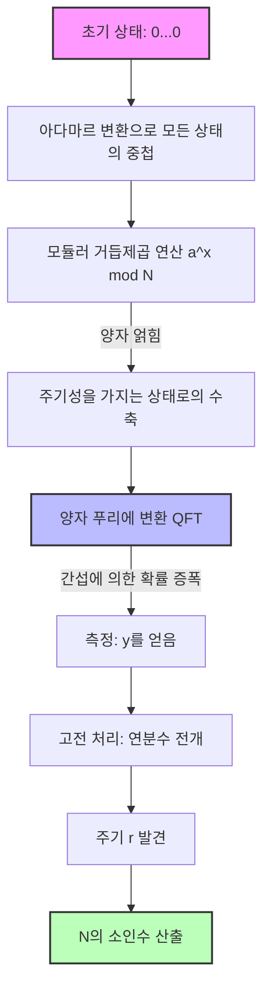

---

title: '[수학적 고찰] 왜 암호 해독 알고리즘 ''GNFS''는 양자 컴퓨터 시대의 Shor 알고리즘에 패배하는가?'
tags: ["양자 컴퓨터", "GNFS", "쇼어 알고리즘", "암호 해독", "수학"]
image: "quantum_vs_gnfs_eyecatch_1788616101508.jpg"
mermaid: true
math: true
categories: ["수학・암호・양자"]
---

현대 인터넷 사회의 정보 보안은 RSA 암호를 비롯한 공개키 암호 방식에 의해 보호받고 있습니다. RSA 암호의 안전성 근거는, **'거대한 합성수의 소인수분해는 계산량적으로 극히 어렵다'** 는 사실에 의존하고 있습니다.

이 글에서는 고전 컴퓨터에서 최강의 소인수분해 알고리즘인 **'일반 수체 체(General Number Field Sieve, GNFS)'** 의 수학적 메커니즘을 파헤치고, 그것이 왜 피터 쇼어(Peter Shor)가 발견한 **'쇼어 알고리즘(Shor's Algorithm)'** 에 의해 완전히 무너지는지, 그 패러다임 시프트를 수식과 개념도를 이용해 철저히 깊이 있게 다룹니다.

---

## 1. 고전 계산에서의 소인수분해 접근법: 페르마의 소인수분해법으로부터의 발전

소인수분해 문제란, 주어진 합성수 $N$에 대하여 $N = p \times q$가 되는 소수 $p, q$를 찾는 문제입니다.

기본적인 아이디어는 다음 합동식을 만족하는 자명하지 않은 $x, y$를 찾는 것으로 귀결됩니다.

$$ x^2 \equiv y^2 \pmod N $$

이를 변형하면,

$$ x^2 - y^2 \equiv 0 \pmod N $$
$$ (x - y)(x + y) \equiv 0 \pmod N $$

여기서 $x \not\equiv \pm y \pmod N$ 이라면, $\gcd(x-y, N)$ 또는 $\gcd(x+y, N)$을 계산함으로써 $N$의 자명하지 않은 인수를 얻을 수 있습니다. 이 사실이 GNFS 등 근대적인 소인수분해 알고리즘의 기초가 됩니다.

---

## 2. 고전 최강의 알고리즘: '일반 수체 체(GNFS)'의 심연

**'GNFS'** 는 오늘날 알려진 고전 컴퓨터용 소인수분해 알고리즘 중에서 가장 빠른 것입니다. 그 시간 복잡도는 준지수 함수적(Sub-exponential)인 시간을 필요로 합니다.

### GNFS의 계산량

수 $N$의 자릿수를 $b = \log_2 N$이라고 할 때, GNFS의 계산량은 다음과 같이 표현됩니다.

$$ O\left( \exp \left( \left(\frac{64}{9} b\right)^{1/3} (\log b)^{2/3} \right) \right) $$

이 식에서 알 수 있듯이, 계산량은 다항식 시간이 아니라 지수 함수보다는 약간 느린 **'준지수 시간'** 이 됩니다. 그럼에도 자릿수가 늘어나면 계산 시간은 천문학적으로 증대합니다.

### GNFS의 수학적 메커니즘

GNFS는 크게 4개의 단계로 구성됩니다.

1. **다항식 선택 (Polynomial Selection)**
2. **체질 (Sieving)**
3. **행렬의 간소화 (Matrix Reduction)**
4. **제곱근 계산 (Square Root)**

#### 2.1. 다항식 선택과 대수체

먼저, 정수를 계수로 하는 기약 다항식 $f(x)$와 $g(x)$를 선택합니다. 이들은 공통의 근 $m$을 modulo $N$으로 가지도록 설정됩니다. 즉,

$$ f(m) \equiv 0 \pmod N $$
$$ g(m) \equiv 0 \pmod N $$

일반적으로 $g(x)$는 일차 다항식 $g(x) = x - m$으로 선택됩니다. $f(x)$의 근을 $\alpha$라고 두면, $\mathbb{Q}(\alpha)$라는 **'대수체'**(Number Field)가 구성됩니다. $\mathbb{Q}(\alpha)$의 환에서의 연산과 일반적인 정수환 $\mathbb{Z}$의 연산을 준동형 사상 $\phi: \alpha \mapsto m$을 통해 비교합니다.

#### 2.2. 체질 (Sieving)

다음으로 서로소인 정수 쌍 $(a, b)$를 대량으로 탐색합니다. 목적은 다음 두 값이 각각 **'B-smooth'**(비교적 작은 소인수로만 구성됨)가 되는 쌍을 찾는 것입니다.

1. $a - bm$ (정수환 위에서의 값)
2. $b^d f(a/b)$ (대수체 위에서의 노름 $N(a - b\alpha)$에 대응)

여기서 **'체'**(Sieve)라고 불리는 고속 탐색 기법이 사용됩니다. 이를 통해 방대한 후보 중에서 조건을 만족하는 $(a, b)$ 쌍을 효율적으로 추출합니다.

#### 2.3. 행렬의 간소화 (Linear Algebra over GF(2))

수집한 쌍 $(a, b)$로부터 지수 벡터를 구성하고, 거대한 희소 행렬의 왼쪽 영공간(Left Null Space)을 $\mathbb{F}_2$(요소가 0과 1뿐인 체) 위에서 구합니다.

관계식 $ \prod (a_i - b_i m) $ 와 $ \prod (a_i - b_i \alpha) $ 가 각각 제곱원이 되도록 벡터 $v$를 해로 찾습니다. 이는,

$$ M \mathbf{x} \equiv \mathbf{0} \pmod 2 $$

라는 선형 방정식계를 푸는 것과 다름없습니다. 여기서 블록 란초스 알고리즘(Block Lanczos Algorithm)이나 블록 위데만 알고리즘(Block Wiedemann Algorithm) 등의 고도화된 수치 계산 알고리즘이 활용됩니다.

#### 2.4. 제곱근 계산

마지막으로 대수체와 정수환 양쪽에서 제곱근을 취하고, $x^2 \equiv y^2 \pmod N$이라는 관계식을 도출해 냅니다. 그리고 $\gcd(x-y, N)$을 계산하여 인수를 얻습니다.

---

## 3. 양자 계산에 의한 혁신: '쇼어 알고리즘'

GNFS가 준지수 함수적인 시간을 필요로 하는 반면, 1994년 피터 쇼어가 발표한 **'쇼어 알고리즘'** 은 양자 컴퓨터를 사용하여 이 문제를 **'다항식 시간'** 에 풀 수 있습니다.

### 쇼어 알고리즘의 계산량

양자 비트 수를 $O(\log N)$이라고 할 때, 시간 복잡도는 다음과 같습니다.

$$ O((\log N)^3) $$

이는 비트 수에 대해 지수 함수적인 폭발을 일으키지 않음을 의미합니다. **'고전 계산'** 의 계산량이 우주의 수명을 초과할 만한 거대한 합성수라도, **'양자 계산'** 에서는 몇 시간～며칠 만에 해독 가능해진다는 경이로운 결과입니다.

### 쇼어 알고리즘의 전체상: 주기 찾기 문제로의 귀결

쇼어 알고리즘은 소인수분해 문제를 **'주기 찾기 문제'** 로 교묘하게 귀결시킵니다.

1. $N$과 서로소인 무작위 정수 $a$를 선택합니다 ($1 < a < N$).
2. 함수 $f(x) = a^x \bmod N$을 정의합니다.
3. $f(x)$의 주기 $r$, 즉 $a^r \equiv 1 \pmod N$이 되는 최소의 양의 정수 $r$을 찾습니다.
4. $r$이 짝수이면, $a^{r/2} \not\equiv -1 \pmod N$인지 확인하고, $\gcd(a^{r/2} \pm 1, N)$을 계산하여 소인수를 얻습니다.

이 3단계의 **'주기 $r$의 발견'** 이야말로 고전 컴퓨터에서는 지수 함수적 시간을 필요로 하는 병목 현상이지만, 양자 컴퓨터는 **'양자 중첩'** 과 **'양자 푸리에 변환'**(QFT)을 사용하여 이를 순식간에 해결합니다.

---

## 4. 양자 푸리에 변환(QFT)과 주기의 추출

쇼어 알고리즘의 핵심인 양자 상태의 조작에 대해 수식으로 자세히 살펴보겠습니다.

### 4.1. 양자 중첩의 생성

먼저 2개의 양자 레지스터를 준비합니다. 레지스터 1은 입력 $x$의 중첩 상태를 유지하고, 레지스터 2는 함수의 계산 결과 $f(x)$를 유지합니다. 초기 상태 $|0\rangle |0\rangle$에 아다마르 변환(Hadamard Transform)을 적용하여 가능한 모든 $x$의 중첩을 만들어 냅니다.

$$ |\psi_1\rangle = \frac{1}{\sqrt{Q}} \sum_{x=0}^{Q-1} |x\rangle |0\rangle $$
(여기서 $Q$는 $N^2 \le Q < 2N^2$을 만족하는 2의 거듭제곱)

다음으로 양자 오라클 $U_f$를 사용하여 $f(x) = a^x \bmod N$을 계산하고 레지스터 2에 저장합니다.

$$ |\psi_2\rangle = U_f |\psi_1\rangle = \frac{1}{\sqrt{Q}} \sum_{x=0}^{Q-1} |x\rangle |a^x \bmod N\rangle $$

여기서 레지스터 2를 측정했다고 가정해 봅시다 (실제로 측정하지 않아도 수학적 구조는 동일합니다). 어떤 값 $y = a^{x_0} \bmod N$이 관측되었다고 하면, 레지스터 1의 상태는 $f(x) = y$가 되는 모든 $x$의 중첩으로 수축합니다. 주기를 $r$이라고 하면, 그러한 $x$는 $x_0, x_0 + r, x_0 + 2r, \dots$가 됩니다.

$$ |\psi_3\rangle = \frac{1}{\sqrt{M}} \sum_{k=0}^{M-1} |x_0 + kr\rangle $$
(여기서 $M \approx Q/r$은 항의 수)

이 상태는 주기 $r$의 정보를 내포하고 있지만, 직접 측정해도 무작위한 $x_0 + kr$이 얻어질 뿐, 주기 $r$은 알 수 없습니다. 여기서 QFT가 등장합니다.

### 4.2. 양자 푸리에 변환 (Quantum Fourier Transform) 의 적용

QFT는 양자 상태의 진폭에 대해 이산 푸리에 변환을 수행하는 조작입니다. 상태 $|x\rangle$에 대한 QFT의 작용은 다음과 같이 정의됩니다.

$$ \text{QFT} |x\rangle = \frac{1}{\sqrt{Q}} \sum_{y=0}^{Q-1} e^{2\pi i \frac{xy}{Q}} |y\rangle $$

이것을 $|\psi_3\rangle$에 적용하면, 위상의 간섭(양자 간섭)이 일어납니다.

$$ |\psi_4\rangle = \text{QFT} |\psi_3\rangle = \frac{1}{\sqrt{MQ}} \sum_{y=0}^{Q-1} \sum_{k=0}^{M-1} e^{2\pi i \frac{(x_0 + kr)y}{Q}} |y\rangle $$

이 식의 합을 전개하면,

$$ \sum_{k=0}^{M-1} e^{2\pi i \frac{kry}{Q}} $$

라는 부분이 나타납니다. 이 기하급수의 합은 $ry/Q$가 정수에 가까울 때에만 보강 간섭(Constructive Interference)이 일어나고, 그 외의 경우에는 상쇄 간섭(Destructive Interference)이 일어납니다.

따라서 높은 확률로 측정되는 상태 $|y\rangle$는,

$$ \frac{y}{Q} \approx \frac{c}{r} $$

이라는 조건을 만족하는 정수 $y$가 됩니다 ($c$는 어떤 정수).

### 4.3. 연분수 전개에 의한 주기 특정

측정을 통해 $y$를 얻은 후, 고전 컴퓨터를 이용하여 $y/Q$를 **'연분수 전개'**(Continued Fraction Expansion)합니다. 이를 통해 $y/Q$의 근사 분수 $c/r$을 계산하고, 분모로부터 주기 $r$의 후보를 고효율로 추출할 수 있습니다.

---

## 5. 개념 모델의 비교와 패러다임 시프트

GNFS와 쇼어 알고리즘의 차이를 직관적으로 이해하기 위해, Mermaid 기법을 사용한 개념도를 제시합니다.

### 양자 회로에 의한 쇼어 알고리즘의 개념도

### 패러다임 시프트의 본질

GNFS는 **'수학적인 공간(대수체) 안에서 관계식을 탐색한다'** 라는 접근 방식을 취합니다. 하지만 탐색 공간은 자릿수에 대해 지수 함수적으로 확대되기 때문에, 고전 컴퓨터의 계산 능력(병렬화를 포함하더라도)으로는 키 길이가 2048비트 등을 초과하면 사실상 해독이 불가능해집니다.

반면, 쇼어 알고리즘은 **'양자 간섭에 의한 파동의 성질'** 을 이용합니다. 중첩 상태에 있는 모든 계산 경로를 동시에 평가하고, QFT에 의해 불필요한 답을 상쇄(약화)시키고, 정답이 되는 주기의 확률 진폭만을 증폭(강화)시킵니다. 이를 통해 공간을 탐색하는 것이 아니라, **'정답 그 자체를 떠오르게 한다'** 는 전혀 다른 차원의 접근 방식을 실현하고 있는 것입니다.

## 6. 요약

이 글에서는 고전 한계의 끝판왕인 **'GNFS'** 와 양자 계산의 힘을 보여주는 **'쇼어 알고리즘'** 에 대해, 각각의 수학적 배경과 알고리즘의 구조를 깊이 비교했습니다.

GNFS가 다항식의 선택이나 거대한 행렬의 계산 등 수학적 기교를 부려 준지수 시간으로 계산량을 끌어내린 반면, 쇼어 알고리즘은 양자 역학의 기본 원리인 중첩과 간섭을 수학적 도구(QFT)와 융합시켜 단숨에 다항식 시간으로의 혁신을 이루어냈습니다.

현재 시점에서는 실용적인 규모(수천 양자 비트)로 쇼어 알고리즘을 실행할 수 있는 결함 허용 양자 컴퓨터(FTQC)는 존재하지 않습니다. 하지만 이 수학적·이론적인 패러다임 시프트의 존재야말로, 현재 전 세계적으로 양자 내성 암호(PQC: Post-Quantum Cryptography)로의 이행이 시급해진 가장 큰 이유입니다.
