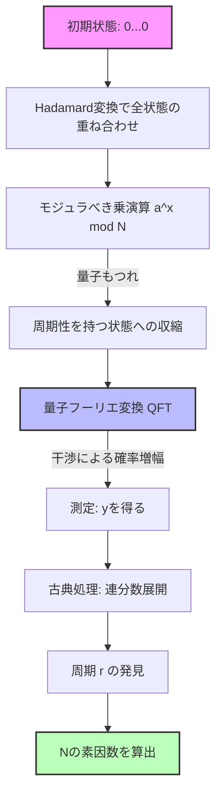

現代のインターネット社会における情報セキュリティは、RSA暗号をはじめとする公開鍵暗号方式によって守られています。RSA暗号の安全性の根拠は、 **「巨大な合成数の素因数分解は計算量的に極めて困難である」** という事実に依存しています。

本記事では、古典コンピュータにおいて最強の素因数分解アルゴリズムである **「一般数体ふるい法」** （General Number Field Sieve, GNFS）の数学的メカニズムを紐解くとともに、それがなぜピーター・ショアによって発見された **「Shorのアルゴリズム」** によって完全に打ち破られるのか、そのパラダイムシフトを数式と概念図を用いて徹底的に深掘りします。

---

## 1. 古典計算における素因数分解のアプローチ：フェルマーの素因数分解法からの発展

素因数分解問題とは、与えられた合成数 $N$ に対して、$N = p \times q$ となる素数 $p, q$ を見つける問題です。

基本的なアイデアは、次の合同式を満たす非自明な $x, y$ を見つけることに帰着します。

$$ x^2 \equiv y^2 \pmod N $$

これを変形すると、

$$ x^2 - y^2 \equiv 0 \pmod N $$
$$ (x - y)(x + y) \equiv 0 \pmod N $$

ここで、$x \not\equiv \pm y \pmod N$ であれば、$\gcd(x-y, N)$ または $\gcd(x+y, N)$ を計算することで、$N$ の非自明な因数を得ることができます。この事実がGNFSなどの近代的な素因数分解アルゴリズムの基礎となっています。

---

## 2. 古典最強のアルゴリズム：「一般数体ふるい法」（GNFS）の深淵

**「GNFS」** は、今日知られている古典コンピュータ向けの素因数分解アルゴリズムの中で最も高速なものです。その時間計算量は、準指数関数的（Sub-exponential）な時間を要します。

### GNFSの計算量

数 $N$ の桁数を $b = \log_2 N$ としたとき、GNFSの計算量は次のように表されます。

$$ O\left( \exp \left( \left(\frac{64}{9} b\right)^{1/3} (\log b)^{2/3} \right) \right) $$

この式からわかるように、計算量は多項式時間ではなく、指数関数よりはわずかに遅い **「準指数時間」** となります。それでも桁数が増えれば計算時間は天文学的に増大します。

### GNFSの数学的メカニズム

GNFSは大きく分けて4つのステップで構成されます。

1. **多項式選択 (Polynomial Selection)**
2. **ふるい分け (Sieving)**
3. **行列の簡約化 (Matrix Reduction)**
4. **平方根の計算 (Square Root)**

#### 2.1. 多項式選択と代数体

まず、整数を係数とする既約多項式 $f(x)$ と $g(x)$ を選びます。これらは共通の根 $m$ を modulo $N$ で持つように設定されます。すなわち、

$$ f(m) \equiv 0 \pmod N $$
$$ g(m) \equiv 0 \pmod N $$

通常、$g(x)$ は一次多項式 $g(x) = x - m$ として選ばれます。$f(x)$ の根を $\alpha$ とおくと、$\mathbb{Q}(\alpha)$ という **「代数体」** （Number Field）が構成されます。$\mathbb{Q}(\alpha)$ の環における演算と、通常の整数環 $\mathbb{Z}$ の演算を、準同型写像 $\phi: \alpha \mapsto m$ を通じて比較します。

#### 2.2. ふるい分け (Sieving)

次に、互いに素な整数のペア $(a, b)$ を大量に探索します。目的は、以下の2つの値がそれぞれ **「B-smooth」** （比較的小さな素因数のみで構成される）になるようなペアを見つけることです。

1. $a - bm$ （整数環上での値）
2. $b^d f(a/b)$ （代数体上でのノルム $N(a - b\alpha)$ に対応）

ここで **「ふるい」** （Sieve）と呼ばれる高速な探索手法が用いられます。これにより、膨大な候補の中から条件を満たす $(a, b)$ ペアを効率的に抽出します。

#### 2.3. 行列の簡約化 (Linear Algebra over GF(2))

集めたペア $(a, b)$ から、指数ベクトルを構成し、巨大な疎行列の左零空間を $\mathbb{F}_2$ （要素が0と1のみの体）上で求めます。

関係式 $ \prod (a_i - b_i m) $ と $ \prod (a_i - b_i \alpha) $ がそれぞれ平方元になるように、ベクトル $v$ を解として見つけます。これは、

$$ M \mathbf{x} \equiv \mathbf{0} \pmod 2 $$

という線形方程式系を解くことに他なりません。ここで、ブロック・ランチョス法（Block Lanczos Algorithm）やブロック・ウィーデマン法（Block Wiedemann Algorithm）などの高度な数値計算アルゴリズムが活用されます。

#### 2.4. 平方根の計算

最後に、代数体と整数環の双方で平方根を取り、$x^2 \equiv y^2 \pmod N$ という関係式を導き出します。そして、$\gcd(x-y, N)$ を計算し、因数を得ます。

---

## 3. 量子計算によるブレイクスルー：「Shorのアルゴリズム」

GNFSが準指数関数的な時間を必要とするのに対し、1994年にピーター・ショアが発表した **「Shorのアルゴリズム」** は、量子コンピュータを用いることでこの問題を **「多項式時間」** で解くことができます。

### Shorのアルゴリズムの計算量

量子ビット数を $O(\log N)$ としたとき、時間計算量は次のようになります。

$$ O((\log N)^3) $$

これは、ビット数に対して指数関数的な爆発を起こさないことを意味します。 **「古典計算」** の計算量が宇宙の寿命を超えるような巨大な合成数であっても、 **「量子計算」** では数時間〜数日で解読可能になるという驚異的な結果です。

### Shorのアルゴリズムの全体像：周期発見問題への帰着

Shorのアルゴリズムは、素因数分解問題を **「周期発見問題」** へと巧みに帰着させます。

1. $N$ と互いに素なランダムな整数 $a$ を選ぶ（$1 < a < N$）。
2. 関数 $f(x) = a^x \bmod N$ を定義する。
3. $f(x)$ の周期 $r$、すなわち $a^r \equiv 1 \pmod N$ となる最小の正整数 $r$ を見つける。
4. $r$ が偶数であれば、$a^{r/2} \not\equiv -1 \pmod N$ かどうかを確認し、$\gcd(a^{r/2} \pm 1, N)$ を計算して素因数を得る。

このステップ3の **「周期 $r$ の発見」** こそが、古典コンピュータでは指数関数的時間を要するボトルネックですが、量子コンピュータは **「量子重ね合わせ」** と **「量子フーリエ変換」** （QFT）を用いることで、これを一瞬で解決します。

---

## 4. 量子フーリエ変換（QFT）と周期の抽出

Shorのアルゴリズムの核心である、量子状態の操作について数式で詳しく見ていきましょう。

### 4.1. 量子重ね合わせの生成

まず、2つの量子レジスタを用意します。レジスタ1は入力 $x$ の重ね合わせ状態を保持し、レジスタ2は関数の計算結果 $f(x)$ を保持します。初期状態 $|0\rangle |0\rangle$ に対してアダマール変換（Hadamard Transform）を適用し、すべての可能な $x$ の重ね合わせを作り出します。

$$ |\psi_1\rangle = \frac{1}{\sqrt{Q}} \sum_{x=0}^{Q-1} |x\rangle |0\rangle $$
（ここで $Q$ は $N^2 \le Q < 2N^2$ を満たす2のべき乗）

次に、量子オラクル $U_f$ を用いて $f(x) = a^x \bmod N$ を計算し、レジスタ2に格納します。

$$ |\psi_2\rangle = U_f |\psi_1\rangle = \frac{1}{\sqrt{Q}} \sum_{x=0}^{Q-1} |x\rangle |a^x \bmod N\rangle $$

ここでレジスタ2を測定したと仮定しましょう（実際には測定しなくても数学的構造は同じです）。ある値 $y = a^{x_0} \bmod N$ が観測されたとすると、レジスタ1の状態は、$f(x) = y$ となるすべての $x$ の重ね合わせに収縮します。周期を $r$ とすると、そのような $x$ は $x_0, x_0 + r, x_0 + 2r, \dots$ となります。

$$ |\psi_3\rangle = \frac{1}{\sqrt{M}} \sum_{k=0}^{M-1} |x_0 + kr\rangle $$
（ここで $M \approx Q/r$ は項の数）

この状態は、周期 $r$ の情報を内在していますが、直接測定してもランダムな $x_0 + kr$ が得られるだけで、周期 $r$ はわかりません。ここでQFTの出番です。

### 4.2. 量子フーリエ変換 (Quantum Fourier Transform) の適用

QFTは、量子状態の振幅に対して離散フーリエ変換を行う操作です。状態 $|x\rangle$ に対するQFTの作用は以下のように定義されます。

$$ \text{QFT} |x\rangle = \frac{1}{\sqrt{Q}} \sum_{y=0}^{Q-1} e^{2\pi i \frac{xy}{Q}} |y\rangle $$

これを $|\psi_3\rangle$ に適用すると、位相の干渉（量子干渉）が起こります。

$$ |\psi_4\rangle = \text{QFT} |\psi_3\rangle = \frac{1}{\sqrt{MQ}} \sum_{y=0}^{Q-1} \sum_{k=0}^{M-1} e^{2\pi i \frac{(x_0 + kr)y}{Q}} |y\rangle $$

この式の和を展開すると、

$$ \sum_{k=0}^{M-1} e^{2\pi i \frac{kry}{Q}} $$

という部分が現れます。この幾何級数の和は、$ry/Q$ が整数に近いときにのみ強め合い（Constructive Interference）、それ以外のときには相殺し合います（Destructive Interference）。

したがって、高い確率で測定される状態 $|y\rangle$ は、

$$ \frac{y}{Q} \approx \frac{c}{r} $$

という条件を満たす整数 $y$ となります（$c$ は何らかの整数）。

### 4.3. 連分数展開による周期の特定

測定によって $y$ を得た後、古典コンピュータを用いて $y/Q$ を **「連分数展開」** （Continued Fraction Expansion）します。これにより、$y/Q$ の近似分数 $c/r$ を計算し、分母から周期 $r$ の候補を高効率に抽出することができます。

---

## 5. 概念モデルの比較とパラダイムシフト

GNFSとShorのアルゴリズムの違いを直感的に理解するために、Mermaid記法による概念図を示します。

### 量子回路によるShorのアルゴリズムの概念図

### パラダイムシフトの本質

GNFSは **「数学的な空間（代数体）の中で関係式を探索する」** というアプローチをとります。しかし、探索空間は桁数に対して指数関数的に拡大するため、古典コンピュータの計算能力（並列化を含めても）では、鍵長が2048ビットなどを超えると事実上解読不可能になります。

一方、Shorのアルゴリズムは **「量子干渉による波の性質」** を利用します。重ね合わせ状態にあるすべての計算経路を同時に評価し、QFTによって不要な答えを相殺（弱め合い）、正解となる周期の確率振幅だけを増幅（強め合い）させます。これにより、空間を探索するのではなく、 **「正解そのものを浮かび上がらせる」** という全く異なる次元のアプローチを実現しているのです。

## 6. まとめ

本記事では、古典限界の極みである **「GNFS」** と、量子計算の力を見せつける **「Shorのアルゴリズム」** について、それぞれの数学的背景とアルゴリズムの構造を深く比較しました。

GNFSが多項式の選択や巨大行列の計算といった数学的技巧を凝らして準指数時間へと計算量を押し下げたのに対し、Shorのアルゴリズムは量子力学の基本原理である重ね合わせと干渉を数学的ツール（QFT）と融合させ、一気に多項式時間へとブレイクスルーを果たしました。

現状では、実用的な規模（数千量子ビット）でShorのアルゴリズムを実行できるエラー耐性量子コンピュータ（FTQC）は存在しません。しかし、この数学的・理論的なパラダイムシフトの存在こそが、現在世界中で耐量子計算機暗号（PQC: Post-Quantum Cryptography）への移行が急がれている最大の理由なのです。
