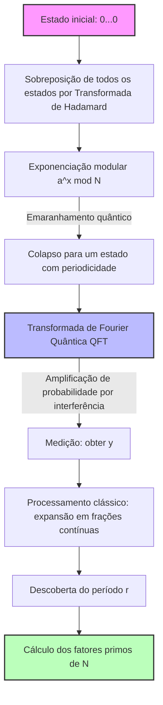

A segurança da informação na sociedade da internet moderna é protegida por sistemas de criptografia de chave pública, como a criptografia RSA. A base para a segurança da criptografia RSA depende do fato de que **"a fatoração de números compostos gigantescos é computacionalmente extremamente difícil"** .

Neste artigo, desvendaremos o mecanismo matemático do **"Crivo do Corpo de Números Generalizado"** (General Number Field Sieve, GNFS), que é o algoritmo de fatoração mais poderoso em computadores clássicos, e aprofundaremos minuciosamente, usando fórmulas matemáticas e diagramas conceituais, a mudança de paradigma de por que ele é completamente superado pelo **"Algoritmo de Shor"** , descoberto por Peter Shor.

---

## 1. A abordagem da fatoração na computação clássica: Evolução do método de fatoração de Fermat

O problema da fatoração de inteiros é o problema de encontrar os números primos $p, q$ tais que $N = p \times q$ , para um dado número composto $N$ .

A ideia básica se resume a encontrar valores não triviais $x, y$ que satisfaçam a seguinte congruência.

$$ x^2 \equiv y^2 \pmod N $$

Rearranjando isto, temos:

$$ x^2 - y^2 \equiv 0 \pmod N $$
$$ (x - y)(x + y) \equiv 0 \pmod N $$

Aqui, se $x \not\equiv \pm y \pmod N$ , podemos calcular o $\gcd(x-y, N)$ ou $\gcd(x+y, N)$ para obter um fator não trivial de $N$ . Este fato forma a base dos algoritmos de fatoração modernos, como o GNFS.

---

## 2. O algoritmo clássico mais forte: O abismo do "Crivo do Corpo de Números Generalizado" (GNFS)

O **GNFS** é o algoritmo de fatoração mais rápido conhecido hoje para computadores clássicos. Sua complexidade de tempo requer um tempo subexponencial (Sub-exponential).

### Complexidade de tempo do GNFS

Quando o número de dígitos de $N$ é $b = \log_2 N$ , a complexidade de tempo do GNFS é expressa da seguinte forma:

$$ O\left( \exp \left( \left(\frac{64}{9} b\right)^{1/3} (\log b)^{2/3} \right) \right) $$

Como pode ser visto nesta fórmula, a complexidade não é tempo polinomial, mas sim um **"tempo subexponencial"** que é ligeiramente mais lento que uma função exponencial. Ainda assim, à medida que o número de dígitos aumenta, o tempo de computação cresce astronomicamente.

### Mecanismo matemático do GNFS

O GNFS consiste principalmente em 4 etapas.

1. **Seleção de Polinômios (Polynomial Selection)**
2. **Crivagem (Sieving)**
3. **Redução de Matriz (Matrix Reduction)**
4. **Cálculo da Raiz Quadrada (Square Root)**

#### 2.1. Seleção de Polinômios e Corpo Algébrico

Primeiro, escolhemos polinômios irredutíveis $f(x)$ e $g(x)$ com coeficientes inteiros. Eles são configurados para ter uma raiz comum $m$ módulo $N$ . Ou seja,

$$ f(m) \equiv 0 \pmod N $$
$$ g(m) \equiv 0 \pmod N $$

Geralmente, $g(x)$ é escolhido como um polinômio de primeiro grau $g(x) = x - m$ . Se a raiz de $f(x)$ for $\alpha$ , construímos um **"corpo de números"** (Number Field) chamado $\mathbb{Q}(\alpha)$ . As operações no anel de $\mathbb{Q}(\alpha)$ e as operações no anel comum de inteiros $\mathbb{Z}$ são comparadas através do homomorfismo $\phi: \alpha \mapsto m$ .

#### 2.2. Crivagem (Sieving)

Em seguida, procuramos por uma grande quantidade de pares de inteiros coprimos $(a, b)$ . O objetivo é encontrar pares em que os dois valores a seguir sejam **"B-smooth"** (compostos apenas por fatores primos relativamente pequenos).

1. $a - bm$ (valor sobre o anel de inteiros)
2. $b^d f(a/b)$ (correspondente à norma $N(a - b\alpha)$ sobre o corpo algébrico)

Aqui é usado um método de busca rápido chamado **"crivo"** (Sieve). Isso extrai eficientemente pares $(a, b)$ que satisfazem as condições de um enorme número de candidatos.

#### 2.3. Redução de Matriz (Linear Algebra over GF(2))

A partir dos pares coletados $(a, b)$ , construímos vetores de expoentes e encontramos o espaço nulo à esquerda de uma enorme matriz esparsa sobre $\mathbb{F}_2$ (um corpo cujos elementos são apenas 0 e 1).

Encontramos o vetor $v$ como uma solução tal que as relações $ \prod (a_i - b_i m) $ e $ \prod (a_i - b_i \alpha) $ se tornem quadrados perfeitos. Isto não é nada mais do que resolver o seguinte sistema de equações lineares:

$$ M \mathbf{x} \equiv \mathbf{0} \pmod 2 $$

Aqui, algoritmos avançados de cálculo numérico, como o Algoritmo de Block Lanczos ou o Algoritmo de Block Wiedemann, são utilizados.

#### 2.4. Cálculo da Raiz Quadrada

Por fim, extraímos a raiz quadrada tanto no corpo algébrico quanto no anel de inteiros para derivar a relação $x^2 \equiv y^2 \pmod N$ . Em seguida, calculamos $\gcd(x-y, N)$ para obter os fatores.

---

## 3. Um avanço revolucionário pela computação quântica: "Algoritmo de Shor"

Enquanto o GNFS requer tempo subexponencial, o **"Algoritmo de Shor"** , publicado por Peter Shor em 1994, pode resolver esse problema em **"tempo polinomial"** usando um computador quântico.

### Complexidade do Algoritmo de Shor

Assumindo que o número de qubits seja $O(\log N)$ , a complexidade de tempo é a seguinte:

$$ O((\log N)^3) $$

Isso significa que não há explosão exponencial em relação ao número de bits. É um resultado surpreendente: mesmo para números compostos gigantescos onde o tempo para a **"computação clássica"** excederia a idade do universo, a **"computação quântica"** pode descriptografá-los em questão de horas ou dias.

### Visão geral do Algoritmo de Shor: Redução ao problema da descoberta de período

O Algoritmo de Shor reduz inteligentemente o problema de fatoração em primos a um **"problema de descoberta de período"** .

1. Escolha um inteiro aleatório $a$ que seja coprimo com $N$ ( $1 < a < N$ ).
2. Defina a função $f(x) = a^x \bmod N$ .
3. Encontre o período $r$ de $f(x)$ , ou seja, o menor inteiro positivo $r$ tal que $a^r \equiv 1 \pmod N$ .
4. Se $r$ for par, verifique se $a^{r/2} \not\equiv -1 \pmod N$ , calcule $\gcd(a^{r/2} \pm 1, N)$ e obtenha o fator primo.

Esta **"descoberta do período $r$ "** na etapa 3 é o gargalo que leva tempo exponencial em computadores clássicos, mas os computadores quânticos resolvem isso instantaneamente usando a **"sobreposição quântica"** e a **"Transformada de Fourier Quântica"** (QFT).

---

## 4. Transformada de Fourier Quântica (QFT) e Extração de Período

Vejamos mais de perto as fórmulas matemáticas sobre a manipulação de estados quânticos, que é o núcleo do Algoritmo de Shor.

### 4.1. Geração de Sobreposição Quântica

Primeiro, preparamos dois registradores quânticos. O Registrador 1 mantém o estado de sobreposição das entradas $x$ , e o Registrador 2 mantém os resultados calculados da função $f(x)$ . Aplicamos a Transformada de Hadamard (Hadamard Transform) ao estado inicial $|0\rangle |0\rangle$ para criar uma sobreposição de todos os possíveis $x$ .

$$ |\psi_1\rangle = \frac{1}{\sqrt{Q}} \sum_{x=0}^{Q-1} |x\rangle |0\rangle $$
(onde $Q$ é uma potência de 2 satisfazendo $N^2 \le Q < 2N^2$ )

Em seguida, usamos o oráculo quântico $U_f$ para calcular $f(x) = a^x \bmod N$ e armazená-lo no Registrador 2.

$$ |\psi_2\rangle = U_f |\psi_1\rangle = \frac{1}{\sqrt{Q}} \sum_{x=0}^{Q-1} |x\rangle |a^x \bmod N\rangle $$

Suponhamos agora que medimos o Registrador 2 (embora na realidade a estrutura matemática seja a mesma mesmo sem medição). Se observarmos um determinado valor $y = a^{x_0} \bmod N$ , o estado do Registrador 1 colapsa para uma sobreposição de todos os $x$ onde $f(x) = y$ . Se o período for $r$ , esses $x$ serão $x_0, x_0 + r, x_0 + 2r, \dots$ 

$$ |\psi_3\rangle = \frac{1}{\sqrt{M}} \sum_{k=0}^{M-1} |x_0 + kr\rangle $$
(onde $M \approx Q/r$ é o número de termos)

Este estado contém inerentemente a informação sobre o período $r$ , mas medir isso diretamente apenas nos dá um $x_0 + kr$ aleatório, não revelando $r$ . É aqui que entra a QFT.

### 4.2. Aplicação da Transformada de Fourier Quântica (Quantum Fourier Transform)

A QFT é uma operação que aplica uma transformada discreta de Fourier às amplitudes do estado quântico. A ação da QFT no estado $|x\rangle$ é definida como segue:

$$ \text{QFT} |x\rangle = \frac{1}{\sqrt{Q}} \sum_{y=0}^{Q-1} e^{2\pi i \frac{xy}{Q}} |y\rangle $$

A aplicação disto a $|\psi_3\rangle$ induz interferência de fase (interferência quântica).

$$ |\psi_4\rangle = \text{QFT} |\psi_3\rangle = \frac{1}{\sqrt{MQ}} \sum_{y=0}^{Q-1} \sum_{k=0}^{M-1} e^{2\pi i \frac{(x_0 + kr)y}{Q}} |y\rangle $$

Ao expandir o somatório desta equação, surge a parte:

$$ \sum_{k=0}^{M-1} e^{2\pi i \frac{kry}{Q}} $$

Esta soma da série geométrica reforça-se mutuamente (Interferência Construtiva) apenas quando $ry/Q$ é próximo a um número inteiro e se cancela em outros momentos (Interferência Destrutiva).

Portanto, o estado $|y\rangle$ medido com alta probabilidade será um número inteiro $y$ que satisfaz a condição:

$$ \frac{y}{Q} \approx \frac{c}{r} $$
(onde $c$ é algum inteiro).

### 4.3. Identificação do Período por Expansão em Frações Contínuas

Após obter $y$ pela medição, utilizamos um computador clássico para realizar a **"expansão em frações contínuas"** (Continued Fraction Expansion) de $y/Q$ . Isso nos permite calcular a fração aproximada $c/r$ de $y/Q$ e extrair de forma altamente eficiente os candidatos ao período $r$ a partir do denominador.

---

## 5. Comparação de Modelos Conceituais e Mudança de Paradigma

Para entender intuitivamente a diferença entre o GNFS e o Algoritmo de Shor, mostramos um diagrama conceitual usando a notação Mermaid.

### Diagrama conceitual do Algoritmo de Shor via circuito quântico

### A essência da mudança de paradigma

O GNFS adota uma abordagem que consiste em **"buscar relações dentro de um espaço matemático (corpo algébrico)"** . No entanto, como o espaço de busca se expande exponencialmente em relação ao número de dígitos, com as capacidades computacionais clássicas (incluindo paralelização), a decodificação se torna quase impossível quando o tamanho da chave excede os 2048 bits.

Por outro lado, o Algoritmo de Shor utiliza a **"natureza de onda devido à interferência quântica"** . Ele avalia simultaneamente todos os caminhos computacionais na sobreposição de estados e usa a QFT para cancelar respostas desnecessárias (interferência destrutiva) enquanto amplifica apenas a amplitude de probabilidade do período correto (interferência construtiva). Com isso, ao invés de buscar no espaço, atinge uma abordagem de dimensão completamente diferente onde **"surge a própria resposta correta"** .

## 6. Conclusão

Neste artigo, aprofundamo-nos nos contextos matemáticos e nas estruturas de algoritmos, comparando o **"GNFS"** , o pico absoluto do limite clássico, com o **"Algoritmo de Shor"** , que demonstra o poder da computação quântica.

Enquanto o GNFS usa técnicas matemáticas sofisticadas, como a escolha de polinômios e cálculos matemáticos com grandes matrizes, para reduzir o tempo computacional a um tempo subexponencial, o Algoritmo de Shor combina os princípios fundamentais da mecânica quântica, sobreposição e interferência, com ferramentas matemáticas (QFT) para produzir um avanço instantâneo ao tempo polinomial.

No momento, não existe nenhum computador quântico tolerante a falhas (FTQC) capaz de executar o Algoritmo de Shor em escala prática (milhares de qubits). No entanto, a própria existência dessa mudança de paradigma matemático e teórico é a principal razão pela qual há atualmente uma rápida e urgente transição para a Criptografia Pós-Quântica (PQC: Post-Quantum Cryptography) no mundo todo.
