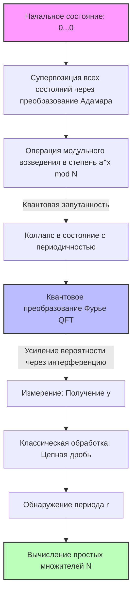

Информационная безопасность в современном интернет-обществе защищена криптографией с открытым ключом, такой как RSA. Основа безопасности RSA опирается на тот факт, что **"факторизация огромных составных чисел вычислительно крайне сложна"** .

В этой статье мы раскроем математический механизм **"Общего метода решета числового поля"** (GNFS) — самого мощного алгоритма факторизации для классических компьютеров, и подробно разберем, почему он полностью побежден **"Алгоритмом Шора"** , открытым Питером Шором. Мы глубоко исследуем эту смену парадигмы с помощью математических формул и концептуальных схем.

---

## 1. Подход к факторизации в классических вычислениях: развитие метода факторизации Ферма

Задача факторизации — это задача поиска простых чисел $p, q$, таких что $N = p \times q$ для заданного составного числа $N$.

Основная идея сводится к поиску нетривиальных $x, y$, удовлетворяющих следующему сравнению:

$$ x^2 \equiv y^2 \pmod N $$

Если мы преобразуем это, то получим:

$$ x^2 - y^2 \equiv 0 \pmod N $$
$$ (x - y)(x + y) \equiv 0 \pmod N $$

Здесь, если $x \not\equiv \pm y \pmod N$, мы можем получить нетривиальный делитель $N$, вычислив $\gcd(x-y, N)$ или $\gcd(x+y, N)$. Этот факт лежит в основе современных алгоритмов факторизации, таких как GNFS.

---

## 2. Сильнейший классический алгоритм: Глубины "Общего метода решета числового поля" (GNFS)

**"GNFS"** — это самый быстрый алгоритм факторизации для классических компьютеров из известных на сегодняшний день. Его временная сложность требует субэкспоненциального (Sub-exponential) времени.

### Сложность GNFS

Если предположить, что количество цифр $N$ равно $b = \log_2 N$, сложность GNFS может быть выражена следующим образом:

$$ O\left( \exp \left( \left(\frac{64}{9} b\right)^{1/3} (\log b)^{2/3} \right) \right) $$

Как видно из этой формулы, сложность представляет собой не полиномиальное время, а **"субэкспоненциальное время"** , что лишь немного медленнее экспоненциального. Тем не менее, с увеличением количества цифр время вычислений возрастает астрономически.

### Математический механизм GNFS

GNFS можно условно разделить на 4 этапа:

1. **Выбор многочленов (Polynomial Selection)**
2. **Просеивание (Sieving)**
3. **Редукция матрицы (Matrix Reduction)**
4. **Вычисление квадратного корня (Square Root)**

#### 2.1. Выбор многочленов и алгебраическое числовое поле

Сначала выбираются неприводимые многочлены $f(x)$ и $g(x)$ с целыми коэффициентами. Они задаются так, чтобы иметь общий корень $m$ по модулю $N$. То есть:

$$ f(m) \equiv 0 \pmod N $$
$$ g(m) \equiv 0 \pmod N $$

Обычно $g(x)$ выбирается как многочлен первой степени $g(x) = x - m$. Если корень $f(x)$ обозначить как $\alpha$, образуется **"алгебраическое числовое поле"** (Number Field) $\mathbb{Q}(\alpha)$. Мы сравниваем операции в кольце $\mathbb{Q}(\alpha)$ и операции в обычном кольце целых чисел $\mathbb{Z}$ посредством гомоморфизма $\phi: \alpha \mapsto m$.

#### 2.2. Просеивание (Sieving)

Далее мы ищем большое количество пар взаимно простых целых чисел $(a, b)$. Цель — найти такие пары, чтобы оба следующих значения были **"B-гладкими"** (B-smooth, то есть состоящими только из относительно малых простых множителей):

1. $a - bm$ (значение в кольце целых чисел)
2. $b^d f(a/b)$ (соответствует норме $N(a - b\alpha)$ в алгебраическом поле)

Здесь используется метод быстрого поиска, называемый **"Решето"** (Sieve). Это позволяет эффективно извлекать пары $(a, b)$, удовлетворяющие условиям, из огромного числа кандидатов.

#### 2.3. Редукция матрицы (Linear Algebra over GF(2))

Из собранных пар $(a, b)$ мы формируем векторы показателей степени и находим левое нуль-пространство огромной разреженной матрицы над $\mathbb{F}_2$ (поле, содержащее только 0 и 1).

Мы находим вектор решения $v$ так, чтобы соотношения $ \prod (a_i - b_i m) $ и $ \prod (a_i - b_i \alpha) $ становились полными квадратами. Это не что иное, как решение системы линейных уравнений:

$$ M \mathbf{x} \equiv \mathbf{0} \pmod 2 $$

Здесь используются продвинутые алгоритмы численных вычислений, такие как алгоритм блочного Ланцоша (Block Lanczos) или блочного Видемана (Block Wiedemann).

#### 2.4. Вычисление квадратного корня

Наконец, мы извлекаем квадратный корень как в алгебраическом числовом поле, так и в кольце целых чисел, что приводит к соотношению $x^2 \equiv y^2 \pmod N$. Затем мы вычисляем $\gcd(x-y, N)$ и получаем делитель.

---

## 3. Прорыв квантовых вычислений: "Алгоритм Шора"

В то время как GNFS требует субэкспоненциального времени, **"Алгоритм Шора"** , опубликованный Питером Шором в 1994 году, может решить эту задачу за **"полиномиальное время"** с использованием квантового компьютера.

### Сложность Алгоритма Шора

Если предположить, что количество кубитов равно $O(\log N)$, то временная сложность составит:

$$ O((\log N)^3) $$

Это означает, что экспоненциального взрыва относительно количества битов не происходит. Это поразительный результат, когда факторизация огромных составных чисел, время вычисления которых в **"классических вычислениях"** превышает возраст Вселенной, может быть решена от нескольких часов до нескольких дней с помощью **"квантовых вычислений"** .

### Обзор Алгоритма Шора: Сведение к задаче поиска периода

Алгоритм Шора искусно сводит задачу факторизации к **"задаче поиска периода"** .

1. Выберите случайное целое число $a$, взаимно простое с $N$ ($1 < a < N$).
2. Определите функцию $f(x) = a^x \bmod N$.
3. Найдите период $r$ функции $f(x)$, то есть наименьшее положительное целое число $r$ такое, что $a^r \equiv 1 \pmod N$.
4. Если $r$ четное, проверьте, не выполняется ли $a^{r/2} \not\equiv -1 \pmod N$, и вычислите $\gcd(a^{r/2} \pm 1, N)$ для получения простого делителя.

Этот шаг 3, то есть **"нахождение периода $r$"** , является узким местом, требующим экспоненциального времени на классическом компьютере. Однако квантовый компьютер решает это мгновенно, используя **"квантовую суперпозицию"** и **"Квантовое преобразование Фурье"** (QFT).

---

## 4. Квантовое преобразование Фурье (QFT) и извлечение периода

Давайте подробнее рассмотрим математические операции над квантовыми состояниями, которые лежат в основе Алгоритма Шора.

### 4.1. Генерация квантовой суперпозиции

Сначала подготовьте 2 квантовых регистра. Регистр 1 хранит состояние суперпозиции входных данных $x$, а регистр 2 хранит результат вычисления функции $f(x)$. Примените преобразование Адамара (Hadamard Transform) к начальному состоянию $|0\rangle |0\rangle$, чтобы создать суперпозицию всех возможных значений $x$.

$$ |\psi_1\rangle = \frac{1}{\sqrt{Q}} \sum_{x=0}^{Q-1} |x\rangle |0\rangle $$
(где $Q$ — это степень двойки, удовлетворяющая $N^2 \le Q < 2N^2$)

Далее используйте квантовый оракул $U_f$ для вычисления $f(x) = a^x \bmod N$ и сохраните результат в регистре 2.

$$ |\psi_2\rangle = U_f |\psi_1\rangle = \frac{1}{\sqrt{Q}} \sum_{x=0}^{Q-1} |x\rangle |a^x \bmod N\rangle $$

Предположим теперь, что регистр 2 измеряется (теоретически, даже если он не измеряется, математическая структура та же). Если наблюдается некоторое значение $y = a^{x_0} \bmod N$, состояние регистра 1 коллапсирует в суперпозицию всех $x$, удовлетворяющих $f(x) = y$. Если предположить, что период равен $r$, такие $x$ будут иметь вид $x_0, x_0 + r, x_0 + 2r, \dots$

$$ |\psi_3\rangle = \frac{1}{\sqrt{M}} \sum_{k=0}^{M-1} |x_0 + kr\rangle $$
(где $M \approx Q/r$ — количество членов)

Это состояние содержит информацию о периоде $r$, но прямое измерение даст лишь случайное $x_0 + kr$, и период $r$ останется неизвестным. Здесь вступает в дело QFT.

### 4.2. Применение Квантового преобразования Фурье (QFT)

QFT — это операция, применяющая дискретное преобразование Фурье к амплитудам квантового состояния. Действие QFT на состояние $|x\rangle$ определяется следующим образом:

$$ \text{QFT} |x\rangle = \frac{1}{\sqrt{Q}} \sum_{y=0}^{Q-1} e^{2\pi i \frac{xy}{Q}} |y\rangle $$

Когда это применяется к $|\psi_3\rangle$, возникает фазовая интерференция (квантовая интерференция).

$$ |\psi_4\rangle = \text{QFT} |\psi_3\rangle = \frac{1}{\sqrt{MQ}} \sum_{y=0}^{Q-1} \sum_{k=0}^{M-1} e^{2\pi i \frac{(x_0 + kr)y}{Q}} |y\rangle $$

Если мы раскроем сумму в этой формуле, появится следующая часть:

$$ \sum_{k=0}^{M-1} e^{2\pi i \frac{kry}{Q}} $$

Сумма этой геометрической прогрессии взаимно усиливается (Конструктивная интерференция, Constructive Interference) только когда $ry/Q$ близко к целому числу, и взаимно уничтожается (Деструктивная интерференция, Destructive Interference) в других случаях.

Следовательно, состояние $|y\rangle$, измеряемое с высокой вероятностью, будет целым числом $y$, удовлетворяющим условию:

$$ \frac{y}{Q} \approx \frac{c}{r} $$

(где $c$ — некоторое целое число).

### 4.3. Определение периода через разложение в цепную дробь

После получения $y$ в результате измерения используйте классический компьютер для выполнения **"разложения в цепную дробь"** (Continued Fraction Expansion) $y/Q$. Это позволяет вычислить подходящую дробь $c/r$ для $y/Q$ и с высокой эффективностью извлечь кандидата на период $r$ из знаменателя.

---

## 5. Сравнение концептуальных моделей и смена парадигмы

Чтобы интуитивно понять разницу между GNFS и Алгоритмом Шора, приводится концептуальная схема с использованием нотации Mermaid.

### Концептуальная схема Алгоритма Шора с использованием квантовой схемы

### Суть смены парадигмы

GNFS использует подход **"поиска соотношений внутри математического пространства (алгебраического поля)"** . Однако, поскольку пространство поиска расширяется экспоненциально относительно количества цифр, расшифровка становится практически невозможной при длине ключа свыше 2048 бит с использованием классических вычислительных мощностей (даже с учетом распараллеливания).

С другой стороны, алгоритм Шора использует **"волновую природу квантовой интерференции"** . Он оценивает все пути вычислений в состоянии суперпозиции одновременно, подавляет (ослабляет) ненужные ответы с помощью QFT и усиливает только амплитуду вероятности для правильного периода. При этом подход заключается не в поиске в пространстве, а в переходе в совершенно другое измерение: **"позволить правильному ответу проявиться самому"** .

## 6. Заключение

В этой статье мы глубоко сравнили математическую основу и структуру алгоритмов между **"GNFS"** , который является пределом классических вычислений, и **"Алгоритмом Шора"** , который демонстрирует мощь квантовых вычислений.

В то время как GNFS использует математические ухищрения, такие как выбор многочленов и вычисления с огромными матрицами, чтобы снизить сложность до субэкспоненциального времени, Алгоритм Шора достигает прямого прорыва до полиномиального времени, объединяя базовые принципы квантовой механики (суперпозицию и интерференцию) с математическим инструментом (QFT).

В настоящее время не существует отказоустойчивого квантового компьютера (FTQC) практического масштаба (тысячи кубитов), способного запустить Алгоритм Шора. Однако именно наличие этой теоретической и математической смены парадигмы является главной причиной ускорения глобального перехода к постквантовой криптографии (PQC: Post-Quantum Cryptography) во всем мире уже сегодня.
