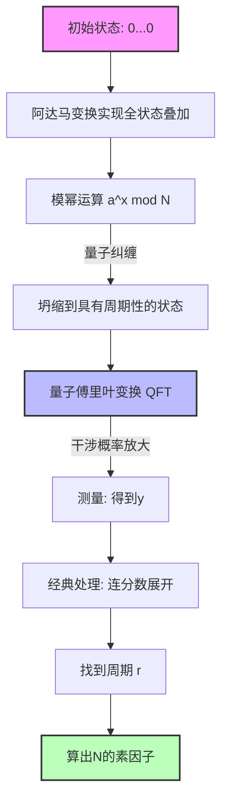

现代互联网社会中的信息安全，是由以RSA密码为首的公开密钥密码体制来保障的。RSA密码安全性的依据依赖于这样一个事实：**“对巨大的合数进行因数分解在计算上是极其困难的”**。

本文将为您剖析经典计算机中最强的因数分解算法——**“普通数域筛选法”**（General Number Field Sieve, GNFS）的数学机制，并通过公式和概念图深入探讨它为何会被彼得·肖尔发现的**“Shor算法”**彻底击败，揭示这场范式转变。

---

## 1. 经典计算中的因数分解方法：从费马因数分解法的发展

因数分解问题是指：对于给定的合数 $N$，找到素数 $p, q$ 使得 $N = p \times q$ 的问题。

基本的思路归结为寻找满足以下同余式的非平凡的 $x, y$：

$$ x^2 \equiv y^2 \pmod N $$

对其进行变形，得到：

$$ x^2 - y^2 \equiv 0 \pmod N $$
$$ (x - y)(x + y) \equiv 0 \pmod N $$

在此，如果 $x \not\equiv \pm y \pmod N$，则通过计算 $\gcd(x-y, N)$ 或 $\gcd(x+y, N)$，就可以得到 $N$ 的非平凡因子。这一事实构成了包括GNFS在内的现代因数分解算法的基础。

---

## 2. 经典最强算法：“普通数域筛选法”（GNFS）的深渊

**“GNFS”** 是目前已知针对经典计算机的最快因数分解算法。其时间复杂度需要亚指数级（Sub-exponential）的时间。

### GNFS的计算复杂度

设数字 $N$ 的位数为 $b = \log_2 N$，GNFS的计算复杂度可以表示为：

$$ O\left( \exp \left( \left(\frac{64}{9} b\right)^{1/3} (\log b)^{2/3} \right) \right) $$

从这个公式可以看出，计算复杂度并不是多项式时间，而是比指数函数稍慢的**“亚指数时间”**。尽管如此，随着位数的增加，计算时间仍会呈天文数字般增长。

### GNFS的数学机制

GNFS主要由四个步骤组成：

1. **多项式选择 (Polynomial Selection)**
2. **筛选 (Sieving)**
3. **矩阵化简 (Matrix Reduction)**
4. **平方根计算 (Square Root)**

#### 2.1. 多项式选择与代数数域

首先，选择以整数为系数的不可约多项式 $f(x)$ 和 $g(x)$。它们被设定为在模 $N$ 下具有公共根 $m$。即：

$$ f(m) \equiv 0 \pmod N $$
$$ g(m) \equiv 0 \pmod N $$

通常，$g(x)$ 被选择为一次多项式 $g(x) = x - m$。设 $f(x)$ 的根为 $\alpha$，则构造出一个名为 $\mathbb{Q}(\alpha)$ 的**“代数数域”**（Number Field）。通过同态映射 $\phi: \alpha \mapsto m$，比较 $\mathbb{Q}(\alpha)$ 环中的运算与普通整数环 $\mathbb{Z}$ 中的运算。

#### 2.2. 筛选 (Sieving)

接着，寻找大量互素的整数对 $(a, b)$。目的是找到满足以下两个值分别为**“B-smooth”**（仅由较小素因子组成）的整数对：

1. $a - bm$ （整数环上的值）
2. $b^d f(a/b)$ （对应代数数域上的范数 $N(a - b\alpha)$）

在这里采用被称为**“筛选”**（Sieve）的高效搜索方法。这使得我们能够从庞大的候选集中高效提取满足条件的 $(a, b)$ 对。

#### 2.3. 矩阵化简 (Linear Algebra over GF(2))

由收集到的整数对 $(a, b)$ 构造指数向量，并在 $\mathbb{F}_2$ （仅包含0和1的域）上求解巨大稀疏矩阵的左零空间。

找到向量 $v$ 作为解，使得关系式 $ \prod (a_i - b_i m) $ 和 $ \prod (a_i - b_i \alpha) $ 都成为平方元。这无异于求解如下线性方程组：

$$ M \mathbf{x} \equiv \mathbf{0} \pmod 2 $$

在这里，使用了如分块Lanczos法（Block Lanczos Algorithm）和分块Wiedemann法（Block Wiedemann Algorithm）等高级数值计算算法。

#### 2.4. 平方根计算

最后，在代数数域和整数环上同时取平方根，导出 $x^2 \equiv y^2 \pmod N$ 的关系式。然后计算 $\gcd(x-y, N)$ 从而得到因子。

---

## 3. 量子计算的突破：“Shor算法”

相较于GNFS需要亚指数级时间，彼得·肖尔在1994年发表的**“Shor算法”**，利用量子计算机可以在**“多项式时间”**内解决这一问题。

### Shor算法的计算复杂度

假设量子比特数为 $O(\log N)$，时间复杂度如下：

$$ O((\log N)^3) $$

这意味着它不会随比特数产生指数级的爆炸。即使是那些对于**“经典计算”**而言计算量超过宇宙寿命的巨大合数，在**“量子计算”**下也能在几小时到几天内破解，这是一个惊人的结果。

### Shor算法全貌：归结为寻找周期问题

Shor算法巧妙地将因数分解问题归结为**“寻找周期问题”**。

1. 选取与 $N$ 互素的随机整数 $a$（$1 < a < N$）。
2. 定义函数 $f(x) = a^x \bmod N$。
3. 找到 $f(x)$ 的周期 $r$，即满足 $a^r \equiv 1 \pmod N$ 的最小正整数 $r$。
4. 如果 $r$ 为偶数，则检查 $a^{r/2} \not\equiv -1 \pmod N$ 是否成立，计算 $\gcd(a^{r/2} \pm 1, N)$ 以获得素因子。

这个步骤3中**“周期的寻找 $r$”**正是经典计算机需要指数级时间的瓶颈，但量子计算机利用**“量子叠加”**和**“量子傅里叶变换”**（QFT），可以瞬间解决这个问题。

---

## 4. 量子傅里叶变换（QFT）与周期提取

让我们用公式详细看看Shor算法的核心——量子状态的操作。

### 4.1. 量子叠加的生成

首先，准备两个量子寄存器。寄存器1保持输入 $x$ 的叠加态，寄存器2保持函数的计算结果 $f(x)$。对初始状态 $|0\rangle |0\rangle$ 应用阿达马变换（Hadamard Transform），创造出所有可能 $x$ 的叠加。

$$ |\psi_1\rangle = \frac{1}{\sqrt{Q}} \sum_{x=0}^{Q-1} |x\rangle |0\rangle $$
（其中 $Q$ 是满足 $N^2 \le Q < 2N^2$ 的2的幂）

接着，利用量子预言机 $U_f$ 计算 $f(x) = a^x \bmod N$ 并存入寄存器2。

$$ |\psi_2\rangle = U_f |\psi_1\rangle = \frac{1}{\sqrt{Q}} \sum_{x=0}^{Q-1} |x\rangle |a^x \bmod N\rangle $$

假设现在测量了寄存器2（实际上即使不测量，数学结构也是相同的）。如果观测到某个值 $y = a^{x_0} \bmod N$，寄存器1的状态就会坍缩到所有使 $f(x) = y$ 成立的 $x$ 的叠加。设周期为 $r$，那么这样的 $x$ 将是 $x_0, x_0 + r, x_0 + 2r, \dots$。

$$ |\psi_3\rangle = \frac{1}{\sqrt{M}} \sum_{k=0}^{M-1} |x_0 + kr\rangle $$
（其中 $M \approx Q/r$ 是项数）

这个状态内含了周期 $r$ 的信息，但直接测量只能得到随机的 $x_0 + kr$，无法得知周期 $r$。这时QFT便派上用场了。

### 4.2. 应用量子傅里叶变换 (Quantum Fourier Transform)

QFT是对量子状态的振幅进行离散傅里叶变换的操作。QFT对状态 $|x\rangle$ 的作用定义如下：

$$ \text{QFT} |x\rangle = \frac{1}{\sqrt{Q}} \sum_{y=0}^{Q-1} e^{2\pi i \frac{xy}{Q}} |y\rangle $$

将此应用于 $|\psi_3\rangle$，会发生相位干涉（量子干涉）。

$$ |\psi_4\rangle = \text{QFT} |\psi_3\rangle = \frac{1}{\sqrt{MQ}} \sum_{y=0}^{Q-1} \sum_{k=0}^{M-1} e^{2\pi i \frac{(x_0 + kr)y}{Q}} |y\rangle $$

展开此式的和：

$$ \sum_{k=0}^{M-1} e^{2\pi i \frac{kry}{Q}} $$

这部分便显现出来。这个等比数列的和，只有当 $ry/Q$ 接近整数时才会增强（Constructive Interference），在其他情况下则会相互抵消（Destructive Interference）。

因此，以高概率被测量到的状态 $|y\rangle$ 将是满足以下条件的整数 $y$：

$$ \frac{y}{Q} \approx \frac{c}{r} $$
（$c$ 为某个整数）

### 4.3. 通过连分数展开确定周期

通过测量得到 $y$ 后，使用经典计算机对 $y/Q$ 进行**“连分数展开”**（Continued Fraction Expansion）。由此计算出 $y/Q$ 的近似分数 $c/r$，从而可以高效地从分母中提取出周期 $r$ 的候选值。

---

## 5. 概念模型比较与范式转变

为了直观理解GNFS和Shor算法的区别，下面展示使用Mermaid语法的概念图。

### 基于量子电路的Shor算法概念图

### 范式转变的本质

GNFS采取了**“在数学空间（代数数域）中寻找关系式”**的方法。然而，搜索空间随位数呈指数级扩展，因此在经典计算机的计算能力（即使包含并行化）下，当密钥长度超过2048位等时，实际上是无法解密的。

另一方面，Shor算法利用了**“量子干涉的波特性”**。同时评估处于叠加态的所有计算路径，通过QFT抵消（减弱）不需要的答案，仅放大（增强）作为正确答案的周期概率振幅。由此实现了非遍历空间，而是**“让正确答案浮现”**的完全不同维度的途径。

## 6. 总结

本文深入比较了经典极限巅峰的**“GNFS”**和展现量子计算力量的**“Shor算法”**，探讨了各自的数学背景和算法结构。

相较于GNFS倾尽多项式选择或巨大矩阵计算等数学技巧将计算复杂度降至亚指数时间，Shor算法将量子力学的基本原理——叠加与干涉与数学工具（QFT）融合，一举实现了向多项式时间的突破。

目前，能够以实用规模（数千个量子比特）运行Shor算法的容错量子计算机（FTQC）尚不存在。然而，正是这种数学与理论范式转变的存在，构成了当今世界急切向抗量子密码（PQC: Post-Quantum Cryptography）过渡的最大理由。
