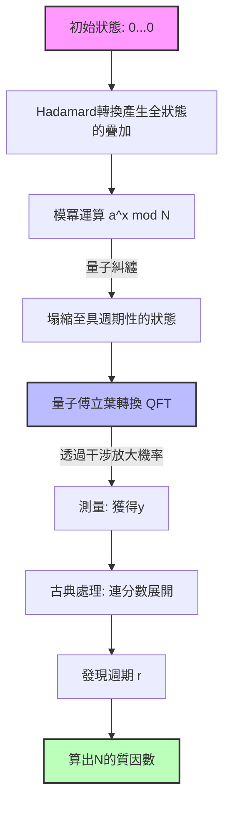

現代網際網路社會中的資訊安全，主要依賴以RSA密碼為首的公開金鑰密碼系統來保護。RSA密碼安全性的基礎，仰賴於 **「對巨大的合成數進行質因數分解，在計算複雜度上是極度困難的」** 這個事實。

本文將解析古典電腦中最強的質因數分解演算法 **「普通數體篩法」** （General Number Field Sieve, GNFS）的數學機制，並透過數學公式與概念圖，深入探討為何它會被彼得·秀爾（Peter Shor）所發現的 **「Shor演算法」** 完全擊敗，徹底剖析這場典範轉移。

---

## 1. 古典計算中質因數分解的策略：從費馬質因數分解法的發展

質因數分解問題，是對於給定的合成數 $N$，找出滿足 $N = p \times q$ 的質數 $p, q$ 的問題。

基本的想法，可以歸結為尋找滿足以下同餘式的非平凡 $x, y$：

$$ x^2 \equiv y^2 \pmod N $$

將其變形後可得：

$$ x^2 - y^2 \equiv 0 \pmod N $$
$$ (x - y)(x + y) \equiv 0 \pmod N $$

在此，若 $x \not\equiv \pm y \pmod N$，藉由計算 $\gcd(x-y, N)$ 或 $\gcd(x+y, N)$，就能獲得 $N$ 的非平凡因數。這個事實成為了GNFS等近代質因數分解演算法的基礎。

---

## 2. 最強古典演算法：「普通數體篩法」（GNFS）的深淵

**「GNFS」** 是目前已知針對古典電腦的質因數分解演算法中速度最快的。它的時間複雜度需要次指數（Sub-exponential）時間。

### GNFS的計算複雜度

當數字 $N$ 的位數為 $b = \log_2 N$ 時，GNFS的計算複雜度可以表示如下：

$$ O\left( \exp \left( \left(\frac{64}{9} b\right)^{1/3} (\log b)^{2/3} \right) \right) $$

從這個公式可以看出，複雜度並非多項式時間，而是比指數函數稍微慢一點的 **「次指數時間」** 。儘管如此，當位數增加時，計算時間仍會以天文數字般增長。

### GNFS的數學機制

GNFS大致可以分為四個步驟：

1. **多項式選擇 (Polynomial Selection)**
2. **篩法 (Sieving)**
3. **矩陣化簡 (Matrix Reduction)**
4. **計算平方根 (Square Root)**

#### 2.1. 多項式選擇與代數體

首先，選擇以整數為係數的不可約多項式 $f(x)$ 與 $g(x)$。它們被設定為在 modulo $N$ 之下具有共同的根 $m$。也就是說，

$$ f(m) \equiv 0 \pmod N $$
$$ g(m) \equiv 0 \pmod N $$

通常，$g(x)$ 會被選為一次多項式 $g(x) = x - m$。若將 $f(x)$ 的根設為 $\alpha$，則可建構出名為 $\mathbb{Q}(\alpha)$ 的 **「代數體」** （Number Field）。透過同態映射 $\phi: \alpha \mapsto m$，來比較 $\mathbb{Q}(\alpha)$ 環上的運算與一般整數環 $\mathbb{Z}$ 的運算。

#### 2.2. 篩法 (Sieving)

接著，大量搜尋互質的整數對 $(a, b)$。目的是尋找使得以下兩個數值皆為 **「B-smooth」** （僅由較小的質因數組成）的配對：

1. $a - bm$ （在整數環上的值）
2. $b^d f(a/b)$ （對應到代數體上的範數 $N(a - b\alpha)$）

這裡使用了一種稱為 **「篩法」** （Sieve）的快速搜尋手法。藉此，能從龐大的候選者中有效率地萃取出符合條件的 $(a, b)$ 配對。

#### 2.3. 矩陣化簡 (Linear Algebra over GF(2))

從收集到的配對 $(a, b)$ 建構出指數向量，並在 $\mathbb{F}_2$ （元素僅有0與1的體）上求出巨大稀疏矩陣的左零空間。

為了讓關係式 $ \prod (a_i - b_i m) $ 與 $ \prod (a_i - b_i \alpha) $ 分別成為平方元素，我們找出向量 $v$ 作為解。這無非就是解以下的線性方程組：

$$ M \mathbf{x} \equiv \mathbf{0} \pmod 2 $$

在此階段，會活用如區塊蘭佐斯法（Block Lanczos Algorithm）或區塊維德曼法（Block Wiedemann Algorithm）等高度數值計算演算法。

#### 2.4. 計算平方根

最後，在代數體與整數環兩邊皆取平方根，導出 $x^2 \equiv y^2 \pmod N$ 這個關係式。接著計算 $\gcd(x-y, N)$，便能獲得因數。

---

## 3. 量子計算帶來的突破：「Shor演算法」

相對於GNFS需要次指數時間，由彼得·秀爾於1994年發表的 **「Shor演算法」** ，透過使用量子電腦，能以 **「多項式時間」** 解決這個問題。

### Shor演算法的計算複雜度

當量子位元數為 $O(\log N)$ 時，時間複雜度如下：

$$ O((\log N)^3) $$

這意味著計算時間不會相對於位元數產生指數級的爆炸。這是一個驚人的結果：即使是 **「古典計算」** 需要超過宇宙壽命才能解開的巨大合成數，在 **「量子計算」** 下也只需數小時至數天即可破解。

### Shor演算法的全貌：歸結為週期尋找問題

Shor演算法巧妙地將質因數分解問題歸結為 **「週期尋找問題」** 。

1. 選擇一個與 $N$ 互質的隨機整數 $a$ （$1 < a < N$）。
2. 定義函數 $f(x) = a^x \bmod N$。
3. 尋找 $f(x)$ 的週期 $r$，即尋找使得 $a^r \equiv 1 \pmod N$ 成立的最小正整數 $r$。
4. 若 $r$ 為偶數，則確認 $a^{r/2} \not\equiv -1 \pmod N$ 是否成立，並計算 $\gcd(a^{r/2} \pm 1, N)$ 來獲得質因數。

這個步驟3的 **「尋找週期 $r$ 」** ，正是古典電腦需要耗費指數時間的瓶頸，但量子電腦透過 **「量子疊加」** 與 **「量子傅立葉轉換」** （QFT），能在一瞬間解決這個問題。

---

## 4. 量子傅立葉轉換（QFT）與週期的萃取

讓我們用數學公式詳細檢視Shor演算法的核心：量子狀態的操作。

### 4.1. 產生量子疊加態

首先，準備兩個量子暫存器。暫存器1保存輸入 $x$ 的疊加態，暫存器2保存函數計算結果 $f(x)$。對初始狀態 $|0\rangle |0\rangle$ 應用阿達馬轉換（Hadamard Transform），創造出所有可能 $x$ 的疊加態。

$$ |\psi_1\rangle = \frac{1}{\sqrt{Q}} \sum_{x=0}^{Q-1} |x\rangle |0\rangle $$
（這裡 $Q$ 是滿足 $N^2 \le Q < 2N^2$ 的2的冪次方）

接著，使用量子神諭（Quantum Oracle） $U_f$ 計算 $f(x) = a^x \bmod N$，並儲存至暫存器2。

$$ |\psi_2\rangle = U_f |\psi_1\rangle = \frac{1}{\sqrt{Q}} \sum_{x=0}^{Q-1} |x\rangle |a^x \bmod N\rangle $$

假設我們在這裡測量了暫存器2（實際上即使不測量，數學結構也是相同的）。若觀測到某個值 $y = a^{x_0} \bmod N$，則暫存器1的狀態會塌縮成所有滿足 $f(x) = y$ 的 $x$ 的疊加態。假設週期為 $r$，則這樣的 $x$ 將會是 $x_0, x_0 + r, x_0 + 2r, \dots$。

$$ |\psi_3\rangle = \frac{1}{\sqrt{M}} \sum_{k=0}^{M-1} |x_0 + kr\rangle $$
（這裡 $M \approx Q/r$ 為項的數量）

這個狀態蘊含了週期 $r$ 的資訊，但若直接測量，只能得到隨機的 $x_0 + kr$，無法得知週期 $r$。這時QFT就派上用場了。

### 4.2. 應用量子傅立葉轉換 (Quantum Fourier Transform)

QFT是對量子狀態的振幅進行離散傅立葉轉換的操作。QFT對狀態 $|x\rangle$ 的作用定義如下：

$$ \text{QFT} |x\rangle = \frac{1}{\sqrt{Q}} \sum_{y=0}^{Q-1} e^{2\pi i \frac{xy}{Q}} |y\rangle $$

將其應用於 $|\psi_3\rangle$ 時，會發生相位的干涉（量子干涉）。

$$ |\psi_4\rangle = \text{QFT} |\psi_3\rangle = \frac{1}{\sqrt{MQ}} \sum_{y=0}^{Q-1} \sum_{k=0}^{M-1} e^{2\pi i \frac{(x_0 + kr)y}{Q}} |y\rangle $$

展開這個式子的和，會出現：

$$ \sum_{k=0}^{M-1} e^{2\pi i \frac{kry}{Q}} $$

這個幾何級數的和，只有當 $ry/Q$ 接近整數時才會產生建設性干涉（Constructive Interference），在其他情況下則會相互抵消，產生破壞性干涉（Destructive Interference）。

因此，能以高機率被測量到的狀態 $|y\rangle$，將是滿足以下條件的整數 $y$：

$$ \frac{y}{Q} \approx \frac{c}{r} $$
（$c$ 為某個整數）

### 4.3. 透過連分數展開找出週期

藉由測量得到 $y$ 後，利用古典電腦對 $y/Q$ 進行 **「連分數展開」** （Continued Fraction Expansion）。藉此，計算出 $y/Q$ 的近似分數 $c/r$，便能非常有效率地從分母萃取出週期 $r$ 的候選值。

---

## 5. 概念模型的比較與典範轉移

為了直觀理解GNFS與Shor演算法的差異，以下展示使用Mermaid語法的概念圖。

### 透過量子電路的Shor演算法概念圖

### 典範轉移的本質

GNFS採取 **「在數學空間（代數體）中尋找關係式」** 的策略。然而，由於搜尋空間相對於位數呈指數級擴大，使得古典電腦的運算能力（即使包含平行運算），在金鑰長度超過2048位元等情況下，實際上是無法破解的。

另一方面，Shor演算法利用了 **「量子干涉的波特性」** 。它同時評估處於疊加態的所有計算路徑，並透過QFT抵消（破壞性干涉）不需要的答案，僅放大（建設性干涉）正確週期答案的機率振幅。藉此，它並非去搜尋空間，而是實現了 **「讓正確答案自己浮現出來」** 這種完全不同維度的策略。

## 6. 總結

本文深入比較了作為古典極限的 **「GNFS」** ，以及展現量子計算力量的 **「Shor演算法」** ，探討了兩者的數學背景與演算法結構。

GNFS透過多項式選擇與巨大矩陣計算等數學技巧，將計算複雜度壓低至次指數時間；相對地，Shor演算法將量子力學的基本原理（疊加與干涉）與數學工具（QFT）融合，一舉突破至多項式時間。

目前，尚不存在能夠以實用規模（數千個量子位元）執行Shor演算法的容錯量子電腦（FTQC）。然而，正是這個數學與理論上的典範轉移，成為了現在全世界急於轉換至後量子密碼學（PQC: Post-Quantum Cryptography）的最大理由。
