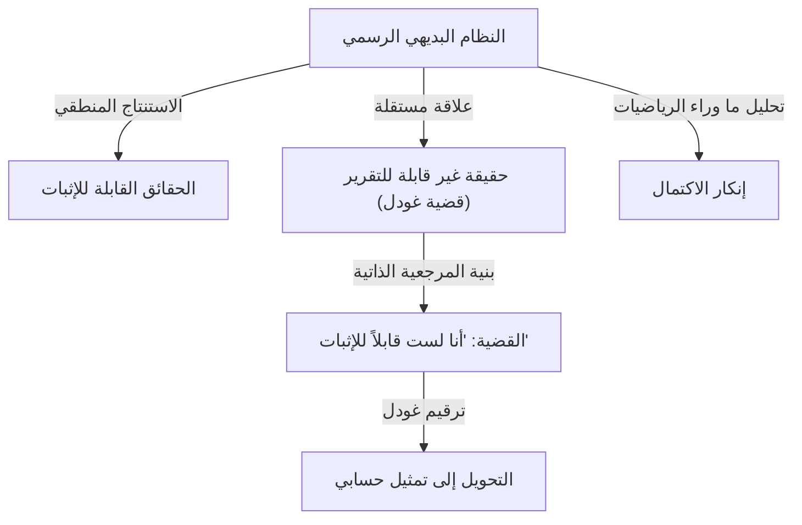

# 1. مقدمة: عملاق الفكر وتحول النماذج في الرياضيات

يُعد [كورت غودل](https://kenji.blog/p/godel/) أحد أعظم علماء المنطق في التاريخ، وغالبًا ما يُصنف جنبًا إلى جنب مع أرسطو وغوتفريد لايبنتز. كشفت **مبرهنات عدم الاكتمال** التي نشرها في عام 1931 عن القيود المتأصلة في الأسس المطلقة للرياضيات، مما أحدث صدمة لا تُقاس للعلم بأسره. أثبتت هذه المبرهنة وجود فجوة حتمية بين "ما يمكننا إثباته" و"ما هو حق"، مما حطم حلم اليقين المطلق الذي تمسك به علماء الرياضيات في ذلك الوقت.

تتجاوز إنجازات غودل مجرد البراهين الرياضية، لتمتد إلى الفلسفة، وعلوم الكمبيوتر، وحتى علم الكونيات. في هذا المقال، نتعمق في مسار هذا العبقري الذي غير تاريخ الرياضيات إلى الأبد، مستكشفين تفاصيل إنجازاته الرياضية، وصداقته العميقة مع ألبرت أينشتاين، والنهاية المأساوية لسنواته الأخيرة من وجهات نظر متعددة.

# 2. الأزمة في الرياضيات وبرنامج هيلبرت

لتقدير قيمة عمل غودل حقًا، من الضروري فهم "أزمة الأسس" التي كانت تواجه عالم الرياضيات في ذلك الوقت بالتفصيل. في نهاية القرن التاسع عشر، جلبت نظرية المجموعات اللانهائية، التي أسسها [جورج كانتور](https://kenji.blog/p/cantor/)، وجهات نظر جديدة تمامًا وأدوات قوية للرياضيات. ومع ذلك، سرعان ما اكتُشف أنها تؤوي مفارقات ذاتية مرجعية خطيرة، مثل "مفارقة راسل".

تتأمل مفارقة راسل "مجموعة كل المجموعات التي لا تحتوي على نفسها كأعضاء". إذا كانت هذه المجموعة تحتوي على نفسها، فإنها تناقض تعريفها الخاص؛ وإذا لم تكن تحتوي على نفسها، فيجب أن تكون بالتعريف عضوًا في نفسها، مما يؤدي مرة أخرى إلى تناقض. كشف هذا الاكتشاف عن الهشاشة الشديدة للأسس الرياضية في ذلك الوقت، والتي اعتمدت بشكل كبير على الاستدلال البديهي.

ولمعالجة هذا الأمر، اقترح عالم الرياضيات الألماني العظيم [ديفيد هيلبرت](https://kenji.blog/p/hilbert/) "برنامج هيلبرت". استهدف هذا نهجًا شكليًا لاشتقاق جميع النظريات الرياضية من مجموعة صغيرة من البديهيات وقواعد الاستدلال الميكانيكية. كان الهدف النهائي هو الإثبات رياضيًا، في عدد محدود من الخطوات، أن نظام البديهيات لن يؤدي أبدًا إلى تناقض (الاتساق) وأن كل قضية صحيحة يمكن إثباتها داخل ذلك النظام (الاكتمال). إذا نجح هذا، فإن الرياضيات ستقف على أساس صلب تمامًا. اعتقد علماء الرياضيات في ذلك الوقت إيمانًا راسخًا بنجاح هذا البرنامج، معتبرين إضفاء الطابع الرسمي الكامل على الرياضيات مسألة وقت فقط.

# 3. الحياة المبكرة وفلسفة حلقة فيينا

ولد [كورت غودل](https://kenji.blog/p/godel/) في 28 أبريل 1906، في برون، مورافيا (برنو الآن، جمهورية التشيك)، في الإمبراطورية النمساوية المجرية. كطفل، كان فضوليًا للغاية، ويسأل باستمرار عن أسباب كل شيء، مما أكسبه لقب "السيد لماذا" (Herr Warum) من عائلته. على الرغم من كونه مريضًا، حيث عانى من الحمى الروماتيزمية، إلا أنه أظهر موهبة غير عادية في دراسته وحصل باستمرار على أعلى الدرجات.

في عام 1924، التحق غودل بجامعة فيينا. تخصص في البداية في الفيزياء النظرية لكنه تأثر بشدة بمحاضرات فيليب فورتفانغلر حول نظرية الأعداد وتحول إلى الرياضيات. بدأ أيضًا في حضور اجتماعات "حلقة فيينا"، بقيادة الفيلسوف موريتز شليك والتي ضمت أعضاء مثل رودولف كارناب.

دعت حلقة فيينا إلى الوضعية المنطقية، ساعية إلى رفض القضايا الميتافيزيقية باعتبارها لا معنى لها واختزال كل المعرفة العلمية إلى التجربة والمنطق. منحه التفاعل في هذه البيئة تقديرًا عميقًا لصرامة المنطق وأهميته. ومع ذلك، لم يتفق غودل نفسه أبدًا مع موقفهم المناهض للميتافيزيقا، وطور لاحقًا إيمانًا قويًا بـ "الأفلاطونية الرياضية". كان يعتقد أن الأشياء الرياضية لا يتم إنشاؤها بواسطة النشاط العقلي البشري ولكنها موجودة بشكل موضوعي ومستقل عن العالم المادي، وأن علماء الرياضيات مجرد "يكتشفونها".

# 4. مبرهنة الاكتمال لمنطق الدرجة الأولى

في عام 1930، في أطروحة الدكتوراه التي قدمها إلى جامعة فيينا، أثبت غودل ببراعة "مبرهنة الاكتمال لمنطق الدرجة الأولى". منطق الدرجة الأولى هو نظام منطقي لا يمكن فيه تطبيق المحددات الكمية (الكل، يوجد) إلا على المتغيرات، وليس على المسندات.

في هذه الورقة، أظهر غودل أنه في منطق الدرجة الأولى، "القضية التي تكون صحيحة دائمًا منطقيًا (صيغة منطقية صالحة) يمكن بالضرورة إثباتها من البديهيات في عدد محدود من الخطوات". كان هذا يعني نجاحًا جزئيًا لبرنامج هيلبرت، مما يضمن أن قواعد الاستدلال للنظام المنطقي قوية بما فيه الكفاية. عقد العديد من علماء الرياضيات آمالًا كبيرة على أن يكون هذا بمثابة نقطة انطلاق لإثبات اكتمال نظرية الأعداد (الحساب) أيضًا. ومع ذلك، فإن الورقة التي نشرها غودل في العام التالي ستحطم تلك التوقعات تمامًا.

# 5. صدمة مبرهنة عدم الاكتمال الأولى وترقيم غودل

في عام 1931، نشر غودل ورقة بحثية بعنوان "حول القضايا غير القابلة للتقرير رسميًا في المبادئ الرياضية والأنظمة ذات الصلة 1". قدمت هذه الورقة **مبرهنة عدم الاكتمال الأولى**، والتي تتألق ببراعة في تاريخ العلوم.

يمكن صياغة مبرهنة عدم الاكتمال الأولى على النحو التالي: "في أي نظام بديهي رسمي متسق قادر على التعبير عن الحساب الأولي، هناك دائمًا قضايا صحيحة ولكن لا يمكن إثباتها أو دحضها داخل النظام".

يُعبر عنها رياضيًا، بالنسبة لقضية معينة $G$، ينطبق ما يلي:

$$ G \iff \neg \text{Prov}( \lceil G \rceil ) $$

هنا، يمثل $\text{Prov}$ المسند "قابل للإثبات داخل النظام"، و$\lceil G \rceil$ يدل على رقم غودل للقضية $G$. بعبارة أخرى، تؤكد القضية $G$ بمرجعية ذاتية: "أنا نفسي لا يمكن إثباتي في هذا النظام". إذا كان $G$ قابلاً للإثبات، فإن النظام سيكون قد أثبت قضية خاطئة (تدعي أنها غير قابلة للإثبات)، مما يؤدي إلى تناقض. لذلك، طالما أن النظام متسق، فإن $G$ غير قابل للإثبات، وبما أنه بالضبط كما يدعي، فهو "صحيح".

لإثبات هذه المبرهنة المذهلة، اخترع غودل تقنية رائدة تُعرف باسم "ترقيم غودل". هذه طريقة لتحويل الرموز، والصيغ المنطقية، والبراهين الكاملة خطوة بخطوة إلى رقم طبيعي هائل واحد، باستخدام تفرد التحليل إلى عوامل أولية. سمح هذا بمعاملة القضايا ما وراء الرياضية (مثل "صيغة منطقية معينة قابلة للإثبات") كخصائص حسابية بحتة للأعداد الطبيعية. تعتبر هذه "الوطأة القطرية"، التي سمحت لنظام منطقي بالتحدث عن حدوده الخاصة (المرجعية الذاتية)، واحدة من أجمل تقنيات الإثبات في تاريخ الرياضيات.

# 6. مبرهنة عدم الاكتمال الثانية ونهاية حلم هيلبرت

كنتيجة مباشرة لمبرهنة عدم الاكتمال الأولى، استنتج غودل **مبرهنة عدم الاكتمال الثانية** الأكثر قوة. تنص على ما يلي: "النظام البديهي الرسمي المتسق القادر على التعبير عن الحساب لا يمكنه إثبات اتساقه الخاص داخل النظام نفسه".

يُعبر عنها رياضيًا على النحو التالي:

$$ \text{Con}(F) \implies \neg \text{Prov}( \lceil \text{Con}(F) \rceil ) $$

هنا، $\text{Con}(F)$ عبارة عن صيغة منطقية تمثل أن نظام البديهيات $F$ متسق. إذا كان النظام $F$ قادرًا على إثبات اتساقه الخاص، فسيكون النظام في الواقع غير متسق.

كانت مبرهنة عدم الاكتمال الثانية بمثابة حكم إعدام مطلق لبرنامج هيلبرت. لقد ثبت أن حلم هيلبرت الكبير بإثبات اتساق الرياضيات كليًا من داخل الرياضيات نفسها مستحيل من حيث المبدأ. لقد ترسخت حقيقة عميقة هنا: لا تستطيع الرياضيات ضمان سلامة أسسها بقوتها الخاصة.

# 7. المساهمات في فرضية الاستمرار والكون القابل للبناء (L)

حتى بعد مبرهنات عدم الاكتمال، لم يتوقف سعي غودل الفكري. لقد تصدى لـ "فرضية الاستمرار"، وهي مشكلة لم تحل منذ فترة طويلة في نظرية المجموعات والأولى من مشكلات هيلبرت الـ 23. تفترض هذه الفرضية، التي اقترحها كانتور، أنه "لا توجد مجموعة يكون عدد عناصرها الأصلية يقع بدقة بين الأعداد الصحيحة (لانهائية قابلة للعد) والأعداد الحقيقية (الاستمرار)".

$$ 2^{\aleph_0} = \aleph_1 $$

في عام 1940، قدم غودل المفهوم الثوري لـ "الكون القابل للبناء (L)". هذا نموذج يتم بناؤه عن طريق جمع العناصر التي يمكن تعريفها منطقيًا من المجموعات الحالية بشكل منهجي. أثبت غودل أنه إذا كانت نظرية مجموعات زيرميلو-فرانكل (ZF) متسقة، فإن النظام الذي تم الحصول عليه عن طريق إضافة بديهية الاختيار (AC) وفرضية الاستمرار المعممة (GCH) إليه متسق أيضًا. أظهر هذا أن فرضية الاستمرار لا تتناقض مع البديهيات الحالية للرياضيات. لاحقًا، في عام 1963، استخدم بول كوهين تقنية تسمى الإجبار لإثبات أن "نفي فرضية الاستمرار" متسق أيضًا، مما يثبت بشكل قاطع أن فرضية الاستمرار هي قضية مستقلة عن ZFC.

# 8. المنفى في أمريكا والصداقة مع أينشتاين

عندما استولى أدولف هتلر على السلطة في ألمانيا عام 1933، تدهور الوضع السياسي في أوروبا بسرعة. في أعقاب ضم النمسا (أنشلوس) من قبل ألمانيا النازية في عام 1938، تغير الوضع في جامعة فيينا تمامًا، وواجه غودل تهديدًا وشيكًا بالتجنيد الإجباري. قام هو وزوجته أديل برحلة شاقة، حيث عبرا الاتحاد السوفيتي عبر خط السكة الحديد العابر لسيبيريا واجتازا المحيط الهادئ لطلب اللجوء في الولايات المتحدة.

استقر في معهد الدراسات المتقدمة (IAS) في برينستون، نيو جيرسي. هنا طور غودل رابطة فكرية عميقة مع ألبرت أينشتاين، أعظم فيزيائي في القرن العشرين. عالم منطق وعالم فيزياء، غودل الانطوائي والعصابي، وأينشتاين المبتهج والمنفتح. على الرغم من أن شخصياتهما ومجالات أبحاثهما كانت مختلفة تمامًا، إلا أنهما أصبحا مشهدًا أسطوريًا في برينستون، وكانا يمشيان معًا إلى المعهد كل يوم تقريبًا، ويتحدثان بعمق باللغة الألمانية.

في سنواته الأخيرة، اشتهر أينشتاين بقوله: "أذهب إلى المعهد فقط من أجل شرف العودة إلى المنزل مع غودل". انخرط الاثنان في مناقشات عميقة تتعلق بعدم اكتمال ميكانيكا الكم، والطبيعة الأساسية للوقت، فضلاً عن السياسة والفلسفة.

# 9. مقياس غودل: اكتشاف كون يسير فيه الوقت للخلف

مستوحى من تفاعلاته مع أينشتاين، انغمس غودل في دراسة النسبية العامة. في عام 1949، بمناسبة عيد ميلاد أينشتاين السبعين، قدم له غودل حلاً دقيقًا لمعادلات مجال أينشتاين، والذي أصبح يُعرف باسم "مقياس غودل" أو كون غودل.

يصف هذا النموذج الكوني كونًا يدور ككل ويمتلك ثابتًا كونيًا سالبًا مناسبًا. الميزة الأكثر إثارة للدهشة هي أنه في هذا الكون، توجد "منحنيات زمنية مغلقة". وهذا يعني أنه أثبت رياضيًا أن السفر عبر الزمن إلى الماضي ممكن نظريًا دون أن تتجاوز المادة سرعة الضوء.

لم يستطع أينشتاين نفسه إخفاء حيرته وصدمته من أن نظريته الخاصة سمحت بالسفر عبر الزمن إلى الماضي، لكن تفكير غودل الرياضي كان خاليًا من العيوب. من هذه النتيجة، استخلص غودل الاستنتاج الفلسفي بأن "مفهوم الوقت ليس حقيقة فيزيائية موضوعية بل مجرد وهم إنساني شخصي"، وبذلك قدم دفاعًا قائمًا على الفيزياء عن المثالية الكانطية.

# 10. الفلسفة والإثبات الوجودي لوجود الله

لم يكن غودل عالم رياضيات بحتًا فحسب، بل كان أيضًا مفكرًا فلسفيًا عميقًا. لقد أيد الأفلاطونية بقوة، كما ذكرنا سابقًا، وكان مكرسًا بعمق لفلسفة غوتفريد لايبنتز. كان يعتقد أن العالم مبني بطريقة منطقية وعقلانية تمامًا، وأنه لا توجد مصادفات.

كانت إحدى قمم استكشافه الفلسفي هي إضفاء الطابع الرسمي على "الإثبات الوجودي لوجود الله" بمصطلحات منطقية. باستخدام المنطق الموجه (منطق يتعامل مع الضرورة والإمكانية)، أعاد غودل بدقة بناء براهين الله التي حاول أنسيلم ولايبنتز تقديمها في تنسيق رياضي. لقد وضع بديهية لمفهوم "الخصائص الإيجابية" وحاول إثبات رياضيًا أن الكائن الذي يمتلك جميع الخصائص الإيجابية (الله)، إذا كان موجودًا في عالم ممكن، يجب أن يكون موجودًا بالضرورة في جميع العوالم الضرورية.

يتضمن الإثبات صيغًا في المنطق الموجه مثل:

$$ P( \text{God} ) \implies \Box \exists x \; \text{God}(x) $$

هنا، يشير $\Box$ إلى "من الصحيح بالضرورة أن". خلال حياته، احتفظ بهذا الإثبات في دفاتر ملاحظاته الشخصية ولم ينشره أبدًا، لكن تم اكتشافه بعد وفاته وأثار جدلًا هائلاً في تقاطع المنطق وعلم اللاهوت.

# 11. إرث تورينج وعلوم الكمبيوتر

كان ل[مبرهنات عدم الاكتمال لغودل](https://kenji.blog/p/godels-incompleteness-theorems/) وفكرة ترقيم غودل تأثير مباشر وعميق على نشأة نظرية الحساب. طبق عالم الرياضيات البريطاني [آلان تورينج](https://kenji.blog/p/turing/) منطق غودل لتصور نموذج حسابي تجريدي يُعرف باسم "آلة تورينج"، وأثبت أن هناك مشكلات لا يمكن لأي خوارزمية حلها (مشكلة التوقف). في نفس الوقت تقريبًا، توصل ألونزو تشيرش إلى استنتاج مماثل باستخدام حساب لامدا.

اليوم، كثيرًا ما يُستشهد بنظريات غودل أيضًا في المناقشات المتعلقة بحدود الذكاء الاصطناعي (AI). اقترح الفيزيائي روجر بنروز "حجة بنروز-غودل"، مجادلًا بأنه "بينما تتبع الآلات (الذكاء الاصطناعي) الخوارزميات وبالتالي فهي مقيدة بمبرهنات عدم الاكتمال، فإن الحدس البشري يمكن أن يرى الحقيقة، مما يعني أن الوعي البشري يعتمد على عمليات غير قابلة للحساب". هذا الجدل حول ما إذا كان الذكاء الاصطناعي قادرًا حقًا على تجاوز الذكاء البشري لا يزال يثير مناقشات مكثفة اليوم.

# 12. جنون العظمة في الحياة اللاحقة والنهاية المأساوية

على الرغم من امتلاكه فكرًا منطقيًا استثنائيًا، إلا أن عقل غودل كان دقيقًا وهشًا بشكل لا يصدق. طوال حياته، عانى من وساوس المرض وجنون العظمة. خاصة في سنواته الأخيرة، أصبح يعذبه الخوف الاستحواذي من أن "شخصًا ما يحاول تسميمي".

كان يأكل فقط الطعام الذي تعده وتتذوقه شخصيًا زوجته أديل، التي يثق بها ثقة مطلقة. ومع ذلك، في أواخر عام 1977، أصيبت أديل بمرض شديد واضطرت إلى دخول المستشفى لفترة طويلة، تاركة غودل بدون أي شخص يعتني بوجباته. أصيب بالشلل من الرعب من التعرض للتسمم، ورفض تناول الطعام تمامًا. في 14 يناير 1978، وافته المنية في سرير في مستشفى برينستون.

كان السبب الرسمي للوفاة هو "سوء التغذية والجوع الناجم عن اضطراب الشخصية". يقال إنه في وقت وفاته، كان يزن 29 كجم فقط. لقي أعظم فكر منطقي في تاريخ البشرية نهاية مأساوية للغاية، حيث سلبت حياته بسبب أكثر المخاوف غير المنطقية.

# 13. الخلاصة: باحث أبدي عن الحقيقة

كان [كورت غودل](https://kenji.blog/p/godel/) عبقريًا غريب الأطوار حقق المفارقة المطلقة: إثبات حدود الفكر نفسه رياضيًا. من خلال تقديم الحقيقة العميقة بأنه "لا يمكننا إثبات كل شيء منطقيًا بشكل شامل"، منح بشكل متناقض توسعًا لانهائيًا لمجال المعرفة البشرية.

تجاوزت إنجازاته، التي تشمل الرياضيات، والمنطق، والفلسفة، والفيزياء، وعلوم الكمبيوتر، الحدود التأديبية لتصبح أساس العلم الحديث. طالما استمرت البشرية في سعيها وراء المعرفة، فإن الضوء الساطع الذي تركه غودل - الرجل الذي نظر بلا هوادة في هاوية المنطق وحقائق الكون - لن يتلاشى أبدًا.
