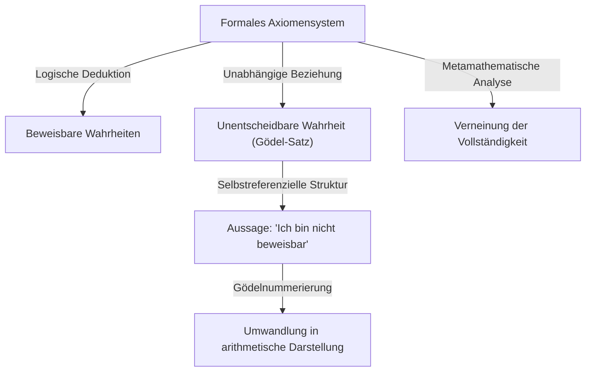

# 1. Einleitung: Ein Gigant des Intellekts und der Paradigmenwechsel in der Mathematik

[Kurt Gödel](https://kenji.blog/de/p/godel/) ist einer der größten Logiker der Geschichte und wird oft in einem Atemzug mit Aristoteles und [Gottfried Leibniz](https://kenji.blog/de/p/leibniz/) genannt. Die **Unvollständigkeitssätze**, die er 1931 veröffentlichte, offenbarten die inhärenten Grenzen in den absoluten Grundlagen der Mathematik und versetzten der gesamten Wissenschaft einen unermesslichen Schock. Dieser Satz zeigte eine unvermeidbare Kluft zwischen "dem, was wir beweisen können" und "dem, was wahr ist", und zerstörte den Traum von absoluter Gewissheit, den die damaligen Mathematiker hegten.

Gödels Errungenschaften gehen weit über bloße mathematische Beweise hinaus und reichen bis in die Philosophie, die Informatik und sogar die Kosmologie. In diesem Artikel tauchen wir tief in den Lebensweg dieses Genies ein, das die Geschichte der Mathematik für immer veränderte. Wir betrachten die Details seiner mathematischen Meisterleistungen, seine tiefe Freundschaft mit Albert Einstein und das tragische Ende seiner späten Jahre aus verschiedenen Perspektiven.

# 2. Die Grundlagenkrise der Mathematik und das [Hilbert](https://kenji.blog/de/p/hilbert/)-Programm

Um den wahren Wert von Gödels Arbeit zu schätzen, muss man die "Grundlagenkrise", mit der die mathematische Welt damals konfrontiert war, im Detail verstehen. Ende des 19. Jahrhunderts brachte die von [Georg Cantor](https://kenji.blog/de/p/cantor/) begründete Theorie der unendlichen Mengen völlig neue Perspektiven und mächtige Werkzeuge in die Mathematik. Doch bald zeigte sich, dass sie schwerwiegende Paradoxien der Selbstreferenz barg, wie etwa die "Russellsche Antinomie".

Das Russellsche Paradoxon betrachtet "die Menge aller Mengen, die sich nicht selbst als Element enthalten". Wenn diese Menge sich selbst enthält, widerspricht dies ihrer eigenen Definition; wenn sie sich nicht selbst enthält, muss sie nach Definition ein Element von sich selbst sein, was wiederum zu einem Widerspruch führt. Diese Entdeckung offenbarte die extreme Zerbrechlichkeit der damaligen mathematischen Grundlagen, die stark auf intuitivem Denken beruhten.

Um diesem Problem zu begegnen, schlug der große deutsche Mathematiker [David Hilbert](https://kenji.blog/de/p/hilbert/) das sogenannte "[Hilbert](https://kenji.blog/de/p/hilbert/)-Programm" vor. Es strebte einen formalistischen Ansatz an, um alle mathematischen Theoreme aus einer kleinen Menge von Axiomen und mechanischen Schlussregeln abzuleiten. Das ultimative Ziel war es, in endlich vielen Schritten mathematisch zu beweisen, dass das Axiomensystem absolut keinen Widerspruch erzeugen würde (Widerspruchsfreiheit) und dass jede wahre Aussage innerhalb dieses Systems bewiesen werden könnte (Vollständigkeit). Wäre dies erfolgreich, stünde die Mathematik auf einem absolut festen Fundament. Die damaligen Mathematiker glaubten fest an den Erfolg dieses Programms und hielten die vollständige Formalisierung der Mathematik nur für eine Frage der Zeit.

# 3. Frühes Leben und die Philosophie des Wiener Kreises

[Kurt Gödel](https://kenji.blog/de/p/godel/) wurde am 28. April 1906 in Brünn, Mähren (heute Brno, Tschechische Republik), in der Österreichisch-Ungarischen Monarchie geboren. Als Kind war er extrem neugierig und fragte ununterbrochen nach den Gründen für alles, was ihm in seiner Familie den Spitznamen "Herr Warum" einbrachte. Obwohl er kränklich war und an rheumatischem Fieber litt, zeigte er eine außergewöhnliche Begabung in der Schule und erzielte stets Bestnoten.

1924 trat Gödel in die Universität Wien ein. Zunächst studierte er theoretische Physik, war aber von Philipp Furtwänglers Vorlesungen über Zahlentheorie so tief beeindruckt, dass er zur Mathematik wechselte. Er begann auch, die Treffen des "Wiener Kreises" zu besuchen, der von dem Philosophen Moritz Schlick geleitet wurde und dem auch Rudolf Carnap angehörte.

Der Wiener Kreis vertrat den Logischen Empirismus und versuchte, metaphysische Aussagen als sinnlos abzutun und alles wissenschaftliche Wissen auf Erfahrung und Logik zu reduzieren. Der Austausch in diesem Umfeld vermittelte Gödel ein tiefes Verständnis für die Strenge und Bedeutung der Logik. Gödel selbst stimmte jedoch nie mit ihrer antimetaphysischen Haltung überein und entwickelte später einen starken "mathematischen Platonismus". Er glaubte, dass mathematische Objekte nicht durch menschliche geistige Aktivität erschaffen werden, sondern objektiv und unabhängig von der physischen Welt existieren, und dass Mathematiker sie lediglich "entdecken".

# 4. Der Vollständigkeitssatz der Prädikatenlogik erster Stufe

Im Jahr 1930 bewies Gödel in seiner an der Universität Wien eingereichten Dissertation brillant den "Vollständigkeitssatz der Prädikatenlogik erster Stufe". Die Prädikatenlogik erster Stufe ist ein logisches System, in dem Quantoren (für alle, es existiert) nur auf Variablen und nicht auf Prädikate angewendet werden können.

In dieser Arbeit zeigte Gödel, dass in der Prädikatenlogik erster Stufe "eine Aussage, die logisch immer wahr ist (eine allgemeingültige logische Formel), notwendigerweise in einer endlichen Anzahl von Schritten aus den Axiomen bewiesen werden kann". Dies bedeutete einen Teilerfolg für das [Hilbert](https://kenji.blog/de/p/hilbert/)-Programm und garantierte, dass die Schlussregeln des logischen Systems ausreichend mächtig waren. Viele Mathematiker hegten die große Hoffnung, dass dies als Sprungbrett dienen könnte, um auch die Vollständigkeit der Zahlentheorie (Arithmetik) zu beweisen. Das Papier, das Gödel jedoch im folgenden Jahr veröffentlichte, sollte diese Erwartungen völlig zerstören.

# 5. Der Schock des Ersten Unvollständigkeitssatzes und die Gödelnummerierung

1931 veröffentlichte Gödel die Arbeit "Über formal unentscheidbare Sätze der Principia Mathematica und verwandter Systeme I". Diese Arbeit präsentierte den **Ersten Unvollständigkeitssatz**, der in der Wissenschaftsgeschichte strahlend hervorsticht.

Der Erste Unvollständigkeitssatz lässt sich wie folgt formulieren: "In jedem widerspruchsfreien formalen Axiomensystem, das stark genug ist, um die elementare Arithmetik auszudrücken, gibt es immer Aussagen, die wahr sind, aber innerhalb des Systems weder bewiesen noch widerlegt werden können."

Mathematisch ausgedrückt gilt für eine bestimmte Aussage $G$ folgendes:

$$ G \iff \neg \text{Prov}( \lceil G \rceil ) $$

Hier steht $\text{Prov}$ für das Prädikat "ist innerhalb des Systems beweisbar", und $\lceil G \rceil$ bezeichnet die Gödelnummer der Aussage $G$. Mit anderen Worten, die Aussage $G$ behauptet selbstreferenziell: "Ich selbst kann in diesem System nicht bewiesen werden." Wäre $G$ beweisbar, hätte das System eine falsche Aussage bewiesen (die behauptet, sie sei nicht beweisbar), was zu einem Widerspruch führen würde. Solange das System widerspruchsfrei ist, ist $G$ daher unbeweisbar, und da es genau das ist, was es behauptet, ist es "wahr".

Um dieses erstaunliche Theorem zu beweisen, erfand Gödel eine bahnbrechende Technik, die "Gödelnummerierung". Dies ist eine Methode, um Symbole, logische Formeln und gesamte schrittweise Beweise mithilfe der Eindeutigkeit der Primfaktorzerlegung in eine einzige riesige natürliche Zahl umzuwandeln. Dadurch konnten metamathematische Aussagen (wie "eine bestimmte logische Formel ist beweisbar") als rein arithmetische Eigenschaften natürlicher Zahlen behandelt werden. Dieses "Diagonalisierungslemma", das es einem logischen System ermöglichte, über seine eigenen Grenzen zu sprechen (Selbstreferenz), gilt als eine der schönsten Beweistechniken in der Geschichte der Mathematik.

# 6. Der Zweite Unvollständigkeitssatz und das Ende von [Hilbert](https://kenji.blog/de/p/hilbert/)s Traum

Als direkte Konsequenz des Ersten Unvollständigkeitssatzes leitete Gödel den noch mächtigeren **Zweiten Unvollständigkeitssatz** ab. Dieser besagt: "Ein widerspruchsfreies formales Axiomensystem, das die Arithmetik ausdrücken kann, kann seine eigene Widerspruchsfreiheit nicht innerhalb des Systems selbst beweisen."

Mathematisch ausgedrückt lautet er wie folgt:

$$ \text{Con}(F) \implies \neg \text{Prov}( \lceil \text{Con}(F) \rceil ) $$

Hier ist $\text{Con}(F)$ eine logische Formel, die darstellt, dass das Axiomensystem $F$ widerspruchsfrei ist. Könnte das System $F$ seine eigene Widerspruchsfreiheit beweisen, wäre das System tatsächlich widersprüchlich.

Der Zweite Unvollständigkeitssatz war das absolute Todesurteil für das [Hilbert](https://kenji.blog/de/p/hilbert/)-Programm. [Hilbert](https://kenji.blog/de/p/hilbert/)s großer Traum, die Widerspruchsfreiheit der Mathematik vollständig von innerhalb der Mathematik selbst zu beweisen, erwies sich als prinzipiell unmöglich. Hier wurde eine tiefe Wahrheit etabliert: Die Mathematik kann die Sicherheit ihrer eigenen Grundlagen nicht aus eigener Kraft garantieren.

# 7. Beiträge zur Kontinuumshypothese und das konstruktible Universum (L)

Auch nach den Unvollständigkeitssätzen kam Gödels intellektuelle Suche nicht zum Stillstand. Er nahm sich der "Kontinuumshypothese" an, einem lange ungelösten Problem in der Mengenlehre und dem ersten von [Hilbert](https://kenji.blog/de/p/hilbert/)s 23 Problemen. Diese von Cantor vorgeschlagene Hypothese besagt, dass "es keine Menge gibt, deren Mächtigkeit strikt zwischen der der natürlichen Zahlen (abzählbare Unendlichkeit) und der der reellen Zahlen (Kontinuum) liegt".

$$ 2^{\aleph_0} = \aleph_1 $$

Im Jahr 1940 führte Gödel das revolutionäre Konzept des "konstruktiblen Universums (L)" ein. Dies ist ein Modell, das konstruiert wird, indem systematisch nur jene Elemente gesammelt werden, die logisch aus bestehenden Mengen definiert werden können. Gödel bewies, dass, wenn die Zermelo-Fraenkel-Mengenlehre (ZF) widerspruchsfrei ist, das System, das durch Hinzufügen des Auswahlaxioms (AC) und der Verallgemeinerten Kontinuumshypothese (GCH) entsteht, ebenfalls widerspruchsfrei ist. Dies zeigte, dass die Kontinuumshypothese nicht den aktuellen Axiomen der Mathematik widerspricht. Später, im Jahr 1963, bewies Paul Cohen mit einer Methode namens "Forcing", dass die "Negation der Kontinuumshypothese" ebenfalls widerspruchsfrei ist, womit endgültig festgestellt wurde, dass die Kontinuumshypothese eine von ZFC unabhängige Aussage ist.

# 8. Exil in Amerika und Freundschaft mit Einstein

Als Adolf Hitler 1933 in Deutschland die Macht ergriff, verschlechterte sich die politische Situation in Europa rapide. Nach der Annexion Österreichs (Anschluss) durch das nationalsozialistische Deutschland 1938 wandelte sich die Situation an der Universität Wien völlig, und Gödel drohte die Einberufung. Zusammen mit seiner Frau Adele unternahm er eine zermürbende Flucht, durchquerte die Sowjetunion mit der Transsibirischen Eisenbahn und reiste über den Pazifik in die Vereinigten Staaten.

Er ließ sich am Institute for Advanced Study (IAS) in Princeton, New Jersey, nieder. Hier entwickelte Gödel eine tiefe, intellektuelle Bindung zu Albert Einstein, dem größten Physiker des 20. Jahrhunderts. Ein Logiker und ein Physiker, der introvertierte und neurotische Gödel und der heitere und extrovertierte Einstein. Obwohl ihre Persönlichkeiten und Forschungsfelder sehr unterschiedlich waren, wurden sie in Princeton zu einem legendären Anblick, wenn sie fast jeden Tag zusammen zum Institut gingen und sich tiefgründig auf Deutsch unterhielten.

In seinen späteren Jahren soll Einstein bemerkt haben: "Ich gehe eigentlich nur noch ans Institut, um das Privileg zu haben, mit Gödel zu Fuß nach Hause gehen zu dürfen." Die beiden führten tiefgehende Diskussionen über die Unvollständigkeit der Quantenmechanik, die grundlegende Natur der Zeit sowie über Politik und Philosophie.

# 9. Die Gödel-Metrik: Die Entdeckung eines Universums mit rückläufiger Zeit

Inspiriert durch seinen Austausch mit Einstein vertiefte sich Gödel in das Studium der allgemeinen Relativitätstheorie. Im Jahr 1949, zu Einsteins 70. Geburtstag, präsentierte Gödel ihm eine exakte Lösung der einsteinschen Feldgleichungen, die als "Gödel-Metrik" oder Gödel-Universum bekannt wurde.

Dieses kosmologische Modell beschreibt ein Universum, das als Ganzes rotiert und eine negative kosmologische Konstante aufweist. Die erstaunlichste Eigenschaft ist, dass in diesem Universum "geschlossene zeitartige Kurven" existieren. Das heißt, er bewies mathematisch, dass Zeitreisen in die Vergangenheit theoretisch möglich sind, ohne dass Materie jemals die Lichtgeschwindigkeit überschreiten muss.

Einstein selbst konnte seine Verwirrung und seinen Schock darüber nicht verbergen, dass seine eigene Theorie Zeitreisen in die Vergangenheit zuließ, aber Gödels mathematische Schlussfolgerung war fehlerfrei. Aus diesem Ergebnis zog Gödel die philosophische Schlussfolgerung, dass "das Konzept der Zeit keine objektive physische Realität, sondern lediglich eine subjektive menschliche Illusion ist", und lieferte damit eine physikalisch fundierte Verteidigung des Kantschen Idealismus.

# 10. Philosophie und der ontologische Beweis für die Existenz Gottes

Gödel war nicht nur ein reiner Mathematiker, sondern auch ein tiefgründiger philosophischer Denker. Er unterstützte den Platonismus stark, wie bereits erwähnt, und war der Philosophie von [Gottfried Leibniz](https://kenji.blog/de/p/leibniz/) tief verbunden. Er glaubte, dass die Welt völlig logisch und rational aufgebaut ist und dass es keine Zufälle gibt.

Einer der Höhepunkte seiner philosophischen Erforschung war seine Formalisierung des "Ontologischen Gottesbeweises" in logischen Begriffen. Mit Hilfe der Modallogik (einer Logik, die sich mit Notwendigkeit und Möglichkeit befasst) rekonstruierte Gödel streng die von Anselm und Leibniz versuchten Gottesbeweise in einem mathematischen Format. Er axiomatisierte den Begriff der "positiven Eigenschaften" und versuchte mathematisch zu beweisen, dass ein Wesen, das alle positiven Eigenschaften besitzt (Gott), wenn es in einer möglichen Welt existiert, notwendigerweise in allen notwendigen Welten existieren muss.

Der Beweis enthält Formeln in der Modallogik wie:

$$ P( \text{God} ) \implies \Box \exists x \; \text{God}(x) $$

Hier bedeutet $\Box$ "es ist notwendigerweise wahr, dass". Zu seinen Lebzeiten hielt er diesen Beweis in seinen persönlichen Notizbüchern fest und veröffentlichte ihn nie. Er wurde jedoch nach seinem Tod entdeckt und entfachte an der Schnittstelle von Logik und Theologie eine massive Debatte.

# 11. Gödels Erbe für Turing und die Informatik

[Gödels Unvollständigkeitssätze](https://kenji.blog/de/p/godels-incompleteness-theorems/) und die Idee der Gödelnummerierung hatten einen direkten und tiefgreifenden Einfluss auf die Entstehung der Berechenbarkeitstheorie. Der britische Mathematiker [Alan Turing](https://kenji.blog/de/p/turing/) wandte Gödels Logik an, um ein abstraktes Berechnungsmodell zu entwerfen, das als "Turingmaschine" bekannt ist, und bewies, dass es Probleme gibt, die durch keinen Algorithmus gelöst werden können (das [Halteproblem](https://kenji.blog/de/p/turing-machine-computability/)). Etwa zur gleichen Zeit gelangte Alonzo Church mit Hilfe des [Lambda](https://kenji.blog/de/p/serverless-architecture-aws-lambda-cold-start/)-Kalküls zu einem ähnlichen Schluss.

Heute werden Gödels Sätze auch häufig in Debatten über die Grenzen der künstlichen Intelligenz (KI) angeführt. Der Physiker Roger Penrose schlug das "Penrose-Gödel-Argument" vor und argumentierte: "Während Maschinen (KI) Algorithmen folgen und somit durch die Unvollständigkeitssätze gebunden sind, kann die menschliche Intuition die Wahrheit erkennen, was bedeutet, dass das menschliche Bewusstsein auf nicht-berechenbaren Prozessen beruht." Diese Debatte darüber, ob KI die menschliche Intelligenz wirklich übertreffen kann, löst auch heute noch intensive Diskussionen aus.

# 12. Paranoia in späten Jahren und ein tragisches Ende

Obwohl er über einen außergewöhnlichen logischen Intellekt verfügte, war Gödels Geist unglaublich zart und zerbrechlich. Zeit seines Lebens litt er an schwerer Hypochondrie und Paranoia. Besonders in seinen späteren Jahren wurde er von der obsessiven Angst geplagt, dass "jemand versucht, mich zu vergiften".

Er aß nur Essen, das von seiner Frau Adele, der er absolut vertraute, zubereitet und persönlich vorgekostet wurde. Ende 1977 erkrankte Adele jedoch schwer und musste für längere Zeit ins Krankenhaus eingeliefert werden, so dass Gödel niemanden hatte, der sich um seine Mahlzeiten kümmerte. Gelähmt von der Angst, vergiftet zu werden, verweigerte er das Essen vollständig. Am 14. Januar 1978 starb er in einem Bett des Princeton Hospitals.

Die offizielle Todesursache war "Unterernährung und Entkräftung aufgrund einer Persönlichkeitsstörung". Es heißt, er habe zum Zeitpunkt seines Todes nur noch 29 kg gewogen. Der größte logische Intellekt der Menschheitsgeschichte fand ein zutiefst tragisches Ende, sein Leben wurde ihm durch die unlogischsten aller Ängste genommen.

# 13. Fazit: Ein ewiger Sucher nach Wahrheit

[Kurt Gödel](https://kenji.blog/de/p/godel/) war ein exzentrisches Genie, dem das ultimative Paradoxon gelang: die Grenzen des Intellekts selbst mathematisch zu beweisen. Indem er die tiefe Wahrheit aufzeigte, dass "wir nicht alles logisch erschöpfend beweisen können", verlieh er dem Reich des menschlichen Wissens paradoxerweise eine unendliche Ausdehnung.

Seine Errungenschaften, die sich über Mathematik, Logik, Philosophie, Physik und Informatik erstrecken, haben disziplinäre Grenzen überschritten und sind zum Fundament der modernen Wissenschaft geworden. Solange die Menschheit ihre Suche nach Wissen fortsetzt, wird das strahlende Licht, das Gödel hinterlassen hat – ein Mann, der unerbittlich in den Abgrund der Logik und die Wahrheiten des Universums blickte – niemals verblassen.
