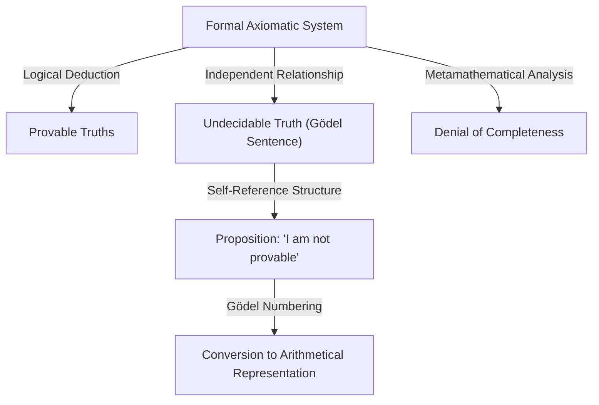

# 1. Introduction: A Giant of Intellect and the Paradigm Shift in Mathematics

[Kurt Gödel](https://kenji.blog/en/p/godel/) is one of the greatest logicians in history, often ranked alongside Aristotle and [Gottfried Leibniz](https://kenji.blog/en/p/leibniz/). The **Incompleteness Theorems** he published in 1931 revealed the inherent limitations in the absolute foundations of mathematics, delivering an immeasurable shock to all of science. This theorem demonstrated an unavoidable gap between "what we can prove" and "what is true," shattering the dream of absolute certainty held by mathematicians of the time.

Gödel's achievements extend far beyond mere mathematical proofs, reaching into philosophy, computer science, and even cosmology. In this article, we delve deeply into the trajectory of this genius who forever changed the history of mathematics, exploring the details of his mathematical feats, his profound friendship with Albert Einstein, and the tragic conclusion of his later years from multiple perspectives.

# 2. The Crisis in Mathematics and Hilbert's Program

To truly appreciate the value of Gödel's work, it is necessary to understand in detail the "foundational crisis" facing the mathematical world at the time. At the end of the 19th century, the theory of infinite sets, founded by [Georg Cantor](https://kenji.blog/en/p/cantor/), brought entirely new perspectives and powerful tools to mathematics. However, it was soon discovered that it harbored severe paradoxes of self-reference, such as "Russell's Paradox."

Russell's Paradox considers "the set of all sets that do not contain themselves as members." If this set contains itself, it contradicts its own definition; if it does not contain itself, it must be a member of itself, again leading to a contradiction. This discovery exposed the extreme fragility of the mathematical foundations of the time, which relied heavily on intuitive reasoning.

To address this, the great German mathematician [David Hilbert](https://kenji.blog/en/p/hilbert/) proposed "Hilbert's Program." This aimed for a formalistic approach to derive all mathematical theorems from a small set of axioms and mechanical rules of inference. The ultimate goal was to mathematically prove, in a finite number of steps, that the axiom system would absolutely never lead to a contradiction (consistency) and that every true proposition could be proven within that system (completeness). If successful, mathematics would stand on a perfectly solid foundation. Mathematicians of the time firmly believed in the success of this program, considering the complete formalization of mathematics to be only a matter of time.

# 3. Early Life and the Philosophy of the Vienna Circle

[Kurt Gödel](https://kenji.blog/en/p/godel/) was born on April 28, 1906, in Brünn, Moravia (now Brno, Czech Republic), in the Austro-Hungarian Empire. As a child, he was extremely curious, constantly asking for the reasons behind everything, earning him the nickname "Mr. Why" (Herr Warum) from his family. Although he was sickly, having suffered from rheumatic fever, he demonstrated extraordinary talent in his studies and consistently achieved top grades.

In 1924, Gödel entered the University of Vienna. He initially majored in theoretical physics but was profoundly moved by Philipp Furtwängler's lectures on number theory and switched to mathematics. He also began attending meetings of the "Vienna Circle," led by the philosopher Moritz Schlick and including members like Rudolf Carnap.

The Vienna Circle advocated logical positivism, seeking to dismiss metaphysical propositions as meaningless and to reduce all scientific knowledge to experience and logic. Interacting in this environment gave Gödel a profound appreciation for the rigor and importance of logic. However, Gödel himself never agreed with their anti-metaphysical stance, later developing a strong belief in "mathematical Platonism." He believed that mathematical objects are not created by human mental activity but exist objectively and independently of the physical world, and that mathematicians merely "discover" them.

# 4. The Completeness Theorem of First-Order Logic

In 1930, in his doctoral dissertation submitted to the University of Vienna, Gödel brilliantly proved the "Completeness Theorem of First-Order Logic." First-order logic is a logical system in which quantifiers (all, exists) can only be applied to variables, not to predicates.

In this paper, Gödel showed that in first-order logic, "a proposition that is logically always true (a valid logical formula) can necessarily be proven from the axioms in a finite number of steps." This signified a partial success of Hilbert's Program, guaranteeing that the inference rules of the logical system were sufficiently powerful. Many mathematicians held high hopes that this could serve as a stepping stone to proving the completeness of number theory (arithmetic) as well. However, the paper Gödel published the following year would shatter those expectations entirely.

# 5. The Shock of the First Incompleteness Theorem and Gödel Numbering

In 1931, Gödel published the paper "On Formally Undecidable Propositions of Principia Mathematica and Related Systems." This paper presented the **First Incompleteness Theorem**, which shines brilliantly in the history of science.

The First Incompleteness Theorem can be stated as follows: "In any consistent formal axiomatic system capable of expressing elementary arithmetic, there are always propositions that are true but cannot be proven or disproven within the system."

Expressed mathematically, for a certain proposition $G$, the following holds:

$$ G \iff \neg \text{Prov}( \lceil G \rceil ) $$

Here, $\text{Prov}$ represents the predicate "is provable within the system," and $\lceil G \rceil$ denotes the Gödel number of proposition $G$. In other words, the proposition $G$ self-referentially asserts, "I myself cannot be proven in this system." If $G$ were provable, the system would have proven a false proposition (one claiming it cannot be proven), resulting in a contradiction. Therefore, as long as the system is consistent, $G$ is unprovable, and since it is exactly as it claims, it is "true."

To prove this astonishing theorem, Gödel invented a groundbreaking technique known as "Gödel numbering." This is a method of converting symbols, logical formulas, and entire step-by-step proofs into a single massive natural number, utilizing the uniqueness of prime factorization. This allowed metamathematical propositions (such as "a certain logical formula is provable") to be treated as purely arithmetic properties of natural numbers. This "Diagonal Lemma," which allowed a logical system to speak about its own limits (self-reference), is considered one of the most beautiful proof techniques in the history of mathematics.

# 6. The Second Incompleteness Theorem and the End of Hilbert's Dream

As a direct consequence of the First Incompleteness Theorem, Gödel derived the even more powerful **Second Incompleteness Theorem**. This states: "A consistent formal axiomatic system capable of expressing arithmetic cannot prove its own consistency within the system itself."

Expressed mathematically, it is as follows:

$$ \text{Con}(F) \implies \neg \text{Prov}( \lceil \text{Con}(F) \rceil ) $$

Here, $\text{Con}(F)$ is a logical formula representing that the axiom system $F$ is consistent. If system $F$ could prove its own consistency, the system would actually be inconsistent.

The Second Incompleteness Theorem was an absolute death sentence for Hilbert's Program. Hilbert's grand dream of proving the consistency of mathematics entirely from within mathematics itself was proven to be impossible in principle. A profound truth was established here: mathematics cannot guarantee the safety of its own foundations by its own power.

# 7. Contributions to the [Continuum Hypothesis](https://kenji.blog/en/p/continuum-hypothesis/) and the Constructible Universe (L)

Even after the incompleteness theorems, Gödel's intellectual quest did not stop. He tackled the "[Continuum Hypothesis](https://kenji.blog/en/p/continuum-hypothesis/)," a long-standing unsolved problem in set theory and the first of Hilbert's 23 problems. Proposed by Cantor, this hypothesis posits that "there is no set whose cardinality is strictly between that of the integers (countable infinity) and the real numbers (the continuum)."

$$ 2^{\aleph_0} = \aleph_1 $$

In 1940, Gödel introduced the revolutionary concept of the "constructible universe (L)." This is a model constructed by systematically gathering only those elements that can be logically defined from existing sets. Gödel proved that if Zermelo-Fraenkel set theory (ZF) is consistent, then the system obtained by adding the Axiom of Choice (AC) and the Generalized [Continuum Hypothesis](https://kenji.blog/en/p/continuum-hypothesis/) (GCH) to it is also consistent. This showed that the continuum hypothesis does not contradict the current axioms of mathematics. Later, in 1963, Paul Cohen used a technique called forcing to prove that the "negation of the continuum hypothesis" is also consistent, thereby definitively establishing that the continuum hypothesis is an independent proposition from ZFC.

# 8. Exile to America and Friendship with Einstein

When Adolf Hitler seized power in Germany in 1933, the political situation in Europe deteriorated rapidly. Following the annexation of Austria (Anschluss) by Nazi Germany in 1938, the situation at the University of Vienna transformed completely, and Gödel faced the imminent threat of conscription. Together with his wife Adele, he undertook a grueling journey, crossing the Soviet Union via the Trans-Siberian Railway and traversing the Pacific Ocean to seek asylum in the United States.

He settled at the Institute for Advanced Study (IAS) in Princeton, New Jersey. It was here that Gödel developed a profound, intellectual bond with Albert Einstein, the greatest physicist of the 20th century. A logician and a physicist, the introverted and neurotic Gödel, and the cheerful and extroverted Einstein. Although their personalities and research fields were vastly different, they became a legendary sight at Princeton, walking together to the Institute almost every day, conversing deeply in German.

In his later years, Einstein was known to remark, "I go to the Institute solely for the privilege of walking home with Gödel." The two engaged in profound discussions concerning the incompleteness of quantum mechanics, the fundamental nature of time, as well as politics and philosophy.

# 9. The Gödel Metric: The Discovery of a Universe with Backwards Time Travel

Inspired by his interactions with Einstein, Gödel immersed himself in the study of general relativity. In 1949, for Einstein's 70th birthday, Gödel presented him with an exact solution to Einstein's field equations, which came to be known as the "Gödel metric" or Gödel's universe.

This cosmological model describes a universe that is rotating as a whole and possesses an appropriate negative cosmological constant. The most astonishing feature is that in this universe, "closed timelike curves" exist. That is, he mathematically proved that time travel to the past is theoretically possible without matter ever exceeding the speed of light.

Einstein himself could not hide his bewilderment and shock that his own theory permitted time travel to the past, but Gödel's mathematical reasoning was flawless. From this result, Gödel drew the philosophical conclusion that "the concept of time is not an objective physical reality but merely a subjective human illusion," thereby offering a physics-based defense of Kantian idealism.

# 10. Philosophy and the Ontological Proof for the Existence of God

Gödel was not only a pure mathematician but also a profound philosophical thinker. He strongly supported Platonism, as mentioned earlier, and was deeply devoted to the philosophy of [Gottfried Leibniz](https://kenji.blog/en/p/leibniz/). He believed that the world is completely logical and rationally constructed, and that there are no coincidences.

One of the pinnacles of his philosophical exploration was his formalization of the "Ontological Proof of God's Existence" in logical terms. Using modal logic (a logic dealing with necessity and possibility), Gödel strictly reconstructed the proofs of God attempted by Anselm and Leibniz into a mathematical format. He axiomatized the concept of "positive properties" and attempted to mathematically prove that a being possessing all positive properties (God), if it exists in a possible world, must necessarily exist in all necessary worlds.

The proof includes formulas in modal logic such as:

$$ P( \text{God} ) \implies \Box \exists x \; \text{God}(x) $$

Here, $\Box$ denotes "it is necessarily true that." During his lifetime, he kept this proof in his personal notebooks and never published it, but it was discovered after his death and sparked massive debate at the intersection of logic and theology.

# 11. Legacy for Turing and Computer Science

[Gödel's incompleteness theorems](https://kenji.blog/en/p/godels-incompleteness-theorems/) and the idea of Gödel numbering had a direct and profound impact on the birth of computation theory. British mathematician [Alan Turing](https://kenji.blog/en/p/turing/) applied Gödel's logic to conceive an abstract computational model known as the "Turing machine," and proved that there are problems that cannot be solved by any algorithm (the Halting Problem). Around the same time, Alonzo Church arrived at a similar conclusion using lambda calculus.

Today, Gödel's theorems are also frequently cited in debates regarding the limits of artificial intelligence (AI). Physicist Roger Penrose proposed the "Penrose-Gödel argument," arguing that "while machines (AI) follow algorithms and are thus bound by the incompleteness theorems, human intuition can see truth, meaning that human consciousness is based on non-computable processes." This debate over whether AI can truly surpass human intelligence continues to spark intense discussion today.

# 12. Paranoia in Later Life and a Tragic End

Despite possessing an extraordinary logical intellect, Gödel's mind was incredibly delicate and fragile. Throughout his life, he suffered from severe hypochondria and paranoia. Particularly in his later years, he became tormented by the obsessive fear that "someone is trying to poison me."

He would only eat food prepared and personally tasted by his wife Adele, whom he trusted absolutely. However, in late 1977, Adele fell severely ill and had to be hospitalized for an extended period, leaving Gödel with no one to care for his meals. Paralyzed by the terror of being poisoned, he refused to eat entirely. On January 14, 1978, he passed away in a bed at Princeton Hospital.

The official cause of death was "malnutrition and inanition caused by personality disturbance." It is said that at the time of his death, he weighed a mere 29 kg (65 lbs). The greatest logical intellect in human history met a profoundly tragic end, his life taken by the most illogical of fears.

# 13. Conclusion: An Eternal Seeker of Truth

[Kurt Gödel](https://kenji.blog/en/p/godel/) was an eccentric genius who achieved the ultimate paradox: mathematically proving the limits of intellect itself. By presenting the profound truth that "we cannot logically prove everything exhaustively," he paradoxically granted infinite expanse to the realm of human knowledge.

His achievements, spanning mathematics, logic, philosophy, physics, and computer science, have transcended disciplinary boundaries to become the foundation of modern science. As long as humanity continues its quest for knowledge, the brilliant light left behind by Gödel—a man who stared relentlessly into the abyss of logic and the truths of the universe—will never fade.
