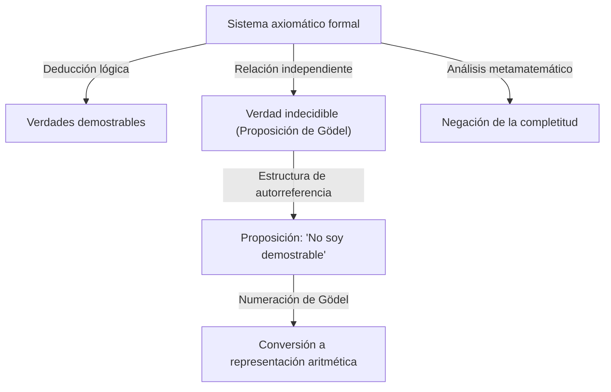

# 1. Introducción: Un gigante del intelecto y el cambio de paradigma en las matemáticas

[Kurt Gödel](https://kenji.blog/es/p/godel/) es uno de los lógicos más grandes de la historia, a menudo clasificado junto a Aristóteles y [Gottfried Leibniz](https://kenji.blog/es/p/leibniz/). Los **teoremas de incompletitud** que publicó en 1931 revelaron las limitaciones inherentes a los fundamentos absolutos de las matemáticas, dando un impacto inmensurable a toda la ciencia. Este teorema demostró una brecha inevitable entre "lo que podemos demostrar" y "lo que es verdad", destrozando el sueño de certeza absoluta que mantenían los matemáticos de la época.

Los logros de Gödel van mucho más allá de las meras demostraciones matemáticas, abarcando la filosofía, la informática e incluso la cosmología. En este artículo, profundizaremos en la trayectoria de este genio que cambió para siempre la historia de las matemáticas, explorando los detalles de sus hazañas matemáticas, su profunda amistad con Albert Einstein y la trágica conclusión de sus últimos años desde múltiples perspectivas.

# 2. La crisis en las matemáticas y el programa de [Hilbert](https://kenji.blog/es/p/hilbert/)

Para apreciar verdaderamente el valor del trabajo de Gödel, es necesario comprender en detalle la "crisis fundacional" a la que se enfrentaba el mundo matemático de la época. A finales del siglo XIX, la teoría de conjuntos infinitos, fundada por [Georg Cantor](https://kenji.blog/es/p/cantor/), aportó perspectivas totalmente nuevas y herramientas poderosas a las matemáticas. Sin embargo, pronto se descubrió que albergaba graves paradojas de autorreferencia, como la "paradoja de Russell".

La paradoja de Russell considera "el conjunto de todos los conjuntos que no se contienen a sí mismos como miembros". Si este conjunto se contiene a sí mismo, contradice su propia definición; si no se contiene a sí mismo, debe por definición ser un miembro de sí mismo, lo que conduce de nuevo a una contradicción. Este descubrimiento expuso la extrema fragilidad de los fundamentos matemáticos de la época, que se basaban en gran medida en el razonamiento intuitivo.

Para abordar esto, el gran matemático alemán [David Hilbert](https://kenji.blog/es/p/hilbert/) propuso el "programa de [Hilbert](https://kenji.blog/es/p/hilbert/)". Éste tenía como objetivo un enfoque formalista para derivar todos los teoremas matemáticos a partir de un pequeño conjunto de axiomas y reglas mecánicas de inferencia. El objetivo final era demostrar matemáticamente, en un número finito de pasos, que el sistema de axiomas no conduciría en absoluto a una contradicción (consistencia) y que cada proposición verdadera podría demostrarse dentro de ese sistema (completitud). De tener éxito, las matemáticas se asentarían sobre unos cimientos perfectamente sólidos. Los matemáticos de la época creían firmemente en el éxito de este programa, considerando la formalización completa de las matemáticas como una simple cuestión de tiempo.

# 3. Vida temprana y la filosofía del Círculo de Viena

[Kurt Gödel](https://kenji.blog/es/p/godel/) nació el 28 de abril de 1906 en Brünn, Moravia (ahora Brno, República Checa), en el Imperio austrohúngaro. De niño, era extremadamente curioso, preguntando constantemente por las razones de todo, lo que le valió el apodo de "Señor Por Qué" (Herr Warum) por parte de su familia. Aunque era enfermizo, habiendo sufrido de fiebre reumática, demostró un talento extraordinario en sus estudios y siempre obtuvo las mejores calificaciones.

En 1924, Gödel ingresó en la Universidad de Viena. Inicialmente se especializó en física teórica, pero se sintió profundamente conmovido por las conferencias de Philipp Furtwängler sobre teoría de números y se cambió a las matemáticas. También comenzó a asistir a las reuniones del "Círculo de Viena", dirigido por el filósofo Moritz Schlick y que incluía a miembros como Rudolf Carnap.

El Círculo de Viena defendía el positivismo lógico, buscando descartar las proposiciones metafísicas por carecer de sentido y reducir todo el conocimiento científico a la experiencia y la lógica. Interactuar en este entorno le dio a Gödel una profunda apreciación por el rigor y la importancia de la lógica. Sin embargo, el propio Gödel nunca estuvo de acuerdo con su postura antimetafísica, y más tarde desarrolló una fuerte creencia en el "platonismo matemático". Creía que los objetos matemáticos no son creados por la actividad mental humana, sino que existen de manera objetiva e independiente del mundo físico, y que los matemáticos simplemente los "descubren".

# 4. El teorema de completitud de la lógica de primer orden

En 1930, en su tesis doctoral presentada a la Universidad de Viena, Gödel demostró de manera brillante el "Teorema de completitud de la lógica de primer orden". La lógica de primer orden es un sistema lógico en el que los cuantificadores (para todo, existe) solo se pueden aplicar a variables, no a predicados.

En este artículo, Gödel mostró que en la lógica de primer orden, "una proposición que lógicamente es siempre verdadera (una fórmula lógica válida) puede demostrarse necesariamente a partir de los axiomas en un número finito de pasos". Esto significó un éxito parcial del programa de [Hilbert](https://kenji.blog/es/p/hilbert/), garantizando que las reglas de inferencia del sistema lógico eran lo suficientemente poderosas. Muchos matemáticos tenían grandes esperanzas de que esto pudiera servir como trampolín para demostrar también la completitud de la teoría de números (aritmética). Sin embargo, el artículo que Gödel publicó al año siguiente destrozaría esas expectativas por completo.

# 5. El impacto del primer teorema de incompletitud y la numeración de Gödel

En 1931, Gödel publicó el artículo "Sobre proposiciones formalmente indecidibles de Principia Mathematica y sistemas afines I". Este artículo presentó el **Primer Teorema de Incompletitud**, que brilla intensamente en la historia de la ciencia.

El Primer Teorema de Incompletitud se puede enunciar de la siguiente manera: "En cualquier sistema axiomático formal consistente capaz de expresar la aritmética elemental, siempre hay proposiciones que son verdaderas pero que no pueden demostrarse ni refutarse dentro del sistema."

Expresado matemáticamente, para una determinada proposición $G$, se cumple lo siguiente:

$$ G \iff \neg \text{Prov}( \lceil G \rceil ) $$

Aquí, $\text{Prov}$ representa el predicado "es demostrable dentro del sistema", y $\lceil G \rceil$ denota el número de Gödel de la proposición $G$. En otras palabras, la proposición $G$ afirma de manera autorreferencial: "Yo misma no puedo ser demostrada en este sistema". Si $G$ fuera demostrable, el sistema habría demostrado una proposición falsa (que afirma no ser demostrable), lo que daría lugar a una contradicción. Por lo tanto, mientras el sistema sea consistente, $G$ es indemostrable, y dado que es exactamente lo que afirma ser, es "verdadera".

Para demostrar este asombroso teorema, Gödel inventó una técnica innovadora conocida como "numeración de Gödel". Éste es un método para convertir símbolos, fórmulas lógicas y demostraciones completas paso a paso en un solo número natural masivo, utilizando la unicidad de la factorización de números primos. Esto permitió que las proposiciones metamatemáticas (como "cierta fórmula lógica es demostrable") se trataran como propiedades puramente aritméticas de los números naturales. Este "Lema Diagonal", que permitía a un sistema lógico hablar sobre sus propios límites (autorreferencia), se considera una de las técnicas de demostración más hermosas de la historia de las matemáticas.

# 6. El segundo teorema de incompletitud y el fin del sueño de [Hilbert](https://kenji.blog/es/p/hilbert/)

Como consecuencia directa del Primer Teorema de Incompletitud, Gödel derivó el aún más poderoso **Segundo Teorema de Incompletitud**. Éste establece: "Un sistema axiomático formal consistente capaz de expresar la aritmética no puede demostrar su propia consistencia dentro de sí mismo."

Expresado matemáticamente, es el siguiente:

$$ \text{Con}(F) \implies \neg \text{Prov}( \lceil \text{Con}(F) \rceil ) $$

Aquí, $\text{Con}(F)$ es una fórmula lógica que representa que el sistema de axiomas $F$ es consistente. Si el sistema $F$ pudiera demostrar su propia consistencia, el sistema sería en realidad inconsistente.

El Segundo Teorema de Incompletitud fue una condena a muerte absoluta para el Programa de [Hilbert](https://kenji.blog/es/p/hilbert/). El gran sueño de [Hilbert](https://kenji.blog/es/p/hilbert/) de demostrar la consistencia de las matemáticas enteramente desde dentro de las propias matemáticas demostró ser imposible en principio. Aquí se estableció una profunda verdad: las matemáticas no pueden garantizar la seguridad de sus propios fundamentos por su propio poder.

# 7. Contribuciones a la hipótesis del continuo y el universo constructible (L)

Incluso después de los teoremas de incompletitud, la búsqueda intelectual de Gödel no se detuvo. Abordó la "Hipótesis del continuo", un problema sin resolver de larga data en la teoría de conjuntos y el primero de los 23 problemas de [Hilbert](https://kenji.blog/es/p/hilbert/). Propuesta por Cantor, esta hipótesis postula que "no existe un conjunto cuya cardinalidad esté estrictamente comprendida entre la de los números enteros (infinito numerable) y la de los números reales (el continuo)".

$$ 2^{\aleph_0} = \aleph_1 $$

En 1940, Gödel introdujo el concepto revolucionario del "universo constructible (L)". Se trata de un modelo construido mediante la recopilación sistemática de solo aquellos elementos que se pueden definir lógicamente a partir de conjuntos existentes. Gödel demostró que si la teoría de conjuntos de Zermelo-Fraenkel (ZF) es consistente, entonces el sistema obtenido al agregarle el Axioma de elección (AC) y la Hipótesis del continuo generalizada (GCH) también lo es. Esto demostró que la hipótesis del continuo no contradice los axiomas actuales de las matemáticas. Más tarde, en 1963, Paul Cohen utilizó una técnica llamada forcing para demostrar que la "negación de la hipótesis del continuo" también es consistente, estableciendo así definitivamente que la hipótesis del continuo es una proposición independiente de ZFC.

# 8. Exilio a América y amistad con Einstein

Cuando Adolf Hitler tomó el poder en Alemania en 1933, la situación política en Europa se deterioró rápidamente. Tras la anexión de Austria (Anschluss) por la Alemania nazi en 1938, la situación en la Universidad de Viena se transformó por completo y Gödel se enfrentó a la inminente amenaza del servicio militar obligatorio. Junto con su esposa Adele, emprendió un viaje agotador, cruzando la Unión Soviética a través del Ferrocarril Transiberiano y atravesando el Océano Pacífico para buscar asilo en los Estados Unidos.

Se instaló en el Instituto de Estudios Avanzados (IAS) en Princeton, Nueva Jersey. Fue aquí donde Gödel desarrolló un profundo vínculo intelectual con Albert Einstein, el mayor físico del siglo XX. Un lógico y un físico, el introvertido y neurótico Gödel y el alegre y extrovertido Einstein. Aunque sus personalidades y campos de investigación eran muy diferentes, se convirtieron en una visión legendaria en Princeton, caminando juntos hacia el Instituto casi todos los días, conversando profundamente en alemán.

En sus últimos años, se sabía que Einstein comentaba: "Voy al Instituto solo por el privilegio de caminar a casa con Gödel". Los dos entablaron profundos debates sobre la incompletitud de la mecánica cuántica, la naturaleza fundamental del tiempo, así como la política y la filosofía.

# 9. La métrica de Gödel: El descubrimiento de un universo con tiempo inverso

Inspirado por sus interacciones con Einstein, Gödel se sumergió en el estudio de la relatividad general. En 1949, por el 70 cumpleaños de Einstein, Gödel le obsequió con una solución exacta a las ecuaciones de campo de Einstein, que llegó a conocerse como la "métrica de Gödel" o el universo de Gödel.

Este modelo cosmológico describe un universo que gira en su conjunto y posee una constante cosmológica negativa adecuada. La característica más sorprendente es que en este universo existen "curvas temporales cerradas". Es decir, demostró matemáticamente que el viaje en el tiempo al pasado es teóricamente posible sin que la materia supere nunca la velocidad de la luz.

El propio Einstein no pudo ocultar su desconcierto y conmoción por el hecho de que su propia teoría permitiera viajar en el tiempo al pasado, pero el razonamiento matemático de Gödel era impecable. A partir de este resultado, Gödel extrajo la conclusión filosófica de que "el concepto del tiempo no es una realidad física objetiva sino una mera ilusión humana subjetiva", ofreciendo así una defensa basada en la física del idealismo kantiano.

# 10. Filosofía y prueba ontológica de la existencia de Dios

Gödel no solo fue un matemático puro, sino también un pensador filosófico profundo. Apoyó firmemente el platonismo, como se mencionó anteriormente, y estuvo profundamente dedicado a la filosofía de [Gottfried Leibniz](https://kenji.blog/es/p/leibniz/). Creía que el mundo está construido de manera completamente lógica y racional, y que no hay coincidencias.

Uno de los pináculos de su exploración filosófica fue su formalización de la "Prueba ontológica de la existencia de Dios" en términos lógicos. Utilizando la lógica modal (una lógica que se ocupa de la necesidad y la posibilidad), Gödel reconstruyó estrictamente las pruebas de Dios intentadas por Anselmo y Leibniz en un formato matemático. Axiomatizó el concepto de "propiedades positivas" e intentó demostrar matemáticamente que un ser que posee todas las propiedades positivas (Dios), si existe en un mundo posible, debe existir necesariamente en todos los mundos necesarios.

La prueba incluye fórmulas de lógica modal tales como:

$$ P( \text{God} ) \implies \Box \exists x \; \text{God}(x) $$

Aquí, $\Box$ denota "es necesariamente cierto que". Durante su vida, guardó esta prueba en sus cuadernos personales y nunca la publicó, pero fue descubierta después de su muerte y desató un debate masivo en la intersección de la lógica y la teología.

# 11. El legado para Turing y la informática

Los teoremas de incompletitud de Gödel y la idea de la numeración de Gödel tuvieron un impacto directo y profundo en el nacimiento de la teoría de la computación. El matemático británico [Alan Turing](https://kenji.blog/es/p/turing/) aplicó la lógica de Gödel para concebir un modelo computacional abstracto conocido como "máquina de Turing", y demostró que hay problemas que no pueden ser resueltos por ningún algoritmo (el problema de la parada). Casi al mismo tiempo, Alonzo Church llegó a una conclusión similar utilizando el cálculo lambda.

Hoy en día, los teoremas de Gödel también se citan con frecuencia en los debates sobre los límites de la inteligencia artificial (IA). El físico Roger Penrose propuso el "argumento Penrose-Gödel", argumentando que "si bien las máquinas (IA) siguen algoritmos y, por lo tanto, están limitadas por los teoremas de incompletitud, la intuición humana puede ver la verdad, lo que significa que la conciencia humana se basa en procesos no computables". Este debate sobre si la IA puede realmente superar la inteligencia humana sigue provocando intensas discusiones en la actualidad.

# 12. Paranoia en sus últimos años y un final trágico

A pesar de poseer un intelecto lógico extraordinario, la mente de Gödel era increíblemente delicada y frágil. A lo largo de su vida, sufrió de hipocondría y paranoia graves. Especialmente en sus últimos años, fue atormentado por el miedo obsesivo de que "alguien está tratando de envenenarme".

Solo comía alimentos preparados y probados personalmente por su esposa Adele, en quien confiaba plenamente. Sin embargo, a finales de 1977, Adele enfermó gravemente y tuvo que ser hospitalizada durante un período prolongado, dejando a Gödel sin nadie que se ocupara de sus comidas. Paralizado por el terror de ser envenenado, se negó a comer por completo. El 14 de enero de 1978, falleció en una cama del Hospital de Princeton.

La causa oficial de muerte fue "desnutrición e inanición causadas por un trastorno de la personalidad". Se dice que en el momento de su muerte, pesaba solo 29 kg. El mayor intelecto lógico en la historia humana tuvo un final profundamente trágico, perdiendo su vida por los miedos más ilógicos.

# 13. Conclusión: Un buscador eterno de la verdad

[Kurt Gödel](https://kenji.blog/es/p/godel/) fue un genio excéntrico que logró la máxima paradoja: demostrar matemáticamente los límites del propio intelecto. Al presentar la profunda verdad de que "no podemos demostrar todo de manera exhaustiva con la lógica", paradójicamente concedió una expansión infinita al ámbito del conocimiento humano.

Sus logros, que abarcan las matemáticas, la lógica, la filosofía, la física y la informática, han trascendido las fronteras disciplinarias para convertirse en la base de la ciencia moderna. Mientras la humanidad continúe su búsqueda del conocimiento, la luz brillante que dejó Gödel —un hombre que miró incansablemente hacia el abismo de la lógica y las verdades del universo— nunca se desvanecerá.
