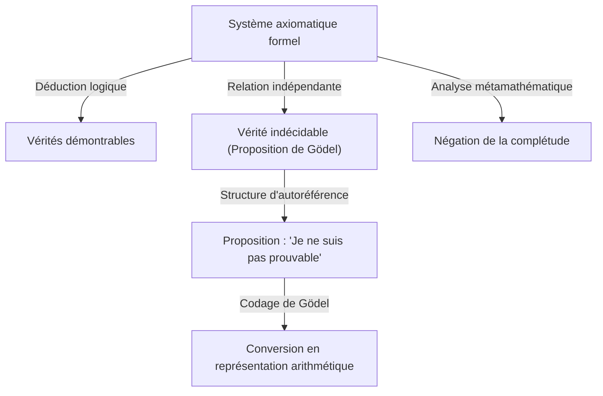

# 1. Introduction : Un géant de l'intellect et le changement de paradigme en mathématiques

[Kurt Gödel](https://kenji.blog/fr/p/godel/) est l'un des plus grands logiciens de l'histoire, souvent placé aux côtés d'Aristote et de [Gottfried Leibniz](https://kenji.blog/fr/p/leibniz/). Les **théorèmes d'incomplétude** qu'il a publiés en 1931 ont révélé les limites inhérentes aux fondements absolus des mathématiques, provoquant une onde de choc incommensurable dans toutes les sciences. Ce théorème a démontré un écart inévitable entre « ce que nous pouvons prouver » et « ce qui est vrai », brisant le rêve de certitude absolue entretenu par les mathématiciens de l'époque.

Les réalisations de Gödel vont bien au-delà de simples preuves mathématiques, touchant à la philosophie, à l'informatique et même à la cosmologie. Dans cet article, nous plongerons profondément dans la trajectoire de ce génie qui a changé à jamais l'histoire des mathématiques, en explorant les détails de ses exploits mathématiques, sa profonde amitié avec Albert Einstein et la conclusion tragique de ses dernières années sous de multiples perspectives.

# 2. La crise des mathématiques et le programme de [Hilbert](https://kenji.blog/fr/p/hilbert/)

Pour apprécier à sa juste valeur le travail de Gödel, il est nécessaire de comprendre en détail la « crise des fondements » à laquelle le monde mathématique était confronté à l'époque. À la fin du 19e siècle, la théorie des ensembles infinis, fondée par [Georg Cantor](https://kenji.blog/fr/p/cantor/), a apporté des perspectives entièrement nouvelles et des outils puissants aux mathématiques. Cependant, on a vite découvert qu'elle recelait de graves paradoxes d'autoréférence, tels que le « paradoxe de Russell ».

Le paradoxe de Russell considère « l'ensemble de tous les ensembles qui ne se contiennent pas eux-mêmes en tant qu'éléments ». Si cet ensemble se contient lui-même, il contredit sa propre définition ; s'il ne se contient pas, il doit par définition être un élément de lui-même, conduisant de nouveau à une contradiction. Cette découverte a exposé l'extrême fragilité des fondements mathématiques de l'époque, qui s'appuyaient fortement sur le raisonnement intuitif.

Pour y remédier, le grand mathématicien allemand [David Hilbert](https://kenji.blog/fr/p/hilbert/) a proposé le « programme de [Hilbert](https://kenji.blog/fr/p/hilbert/) ». Celui-ci visait une approche formaliste pour dériver tous les théorèmes mathématiques à partir d'un petit ensemble d'axiomes et de règles d'inférence mécaniques. Le but ultime était de prouver mathématiquement, en un nombre fini d'étapes, que le système d'axiomes ne conduirait absolument jamais à une contradiction (cohérence) et que chaque proposition vraie pourrait être prouvée au sein de ce système (complétude). En cas de succès, les mathématiques reposeraient sur des fondations parfaitement solides. Les mathématiciens de l'époque croyaient fermement au succès de ce programme, considérant la formalisation complète des mathématiques comme une simple question de temps.

# 3. Jeunesse et philosophie du cercle de Vienne

[Kurt Gödel](https://kenji.blog/fr/p/godel/) est né le 28 avril 1906 à Brünn, en Moravie (aujourd'hui Brno, en République tchèque), dans l'Empire austro-hongrois. Enfant, il était extrêmement curieux, demandant constamment la raison de chaque chose, ce qui lui valut le surnom de « Monsieur Pourquoi » (Herr Warum) au sein de sa famille. Bien qu'il fût de santé fragile, ayant souffert de rhumatisme articulaire aigu, il a fait preuve d'un talent extraordinaire dans ses études et a constamment obtenu les meilleures notes.

En 1924, Gödel entre à l'Université de Vienne. Il s'oriente initialement vers la physique théorique, mais est profondément ému par les conférences de Philipp Furtwängler sur la théorie des nombres et se tourne vers les mathématiques. Il commence également à assister aux réunions du « Cercle de Vienne », dirigé par le philosophe Moritz Schlick et comprenant des membres tels que Rudolf Carnap.

Le Cercle de Vienne prônait le positivisme logique, cherchant à rejeter les propositions métaphysiques comme dénuées de sens et à réduire toute connaissance scientifique à l'expérience et à la logique. Interagir dans cet environnement a donné à Gödel une profonde appréciation de la rigueur et de l'importance de la logique. Cependant, Gödel lui-même n'a jamais été d'accord avec leur position antimétaphysique, développant plus tard une forte croyance dans le « platonisme mathématique ». Il croyait que les objets mathématiques ne sont pas créés par l'activité mentale humaine mais existent objectivement et indépendamment du monde physique, et que les mathématiciens ne font que les « découvrir ».

# 4. Le théorème de complétude de la logique du premier ordre

En 1930, dans sa thèse de doctorat soumise à l'Université de Vienne, Gödel a brillamment prouvé le « théorème de complétude de la logique du premier ordre ». La logique du premier ordre est un système logique dans lequel les quantificateurs (pour tout, il existe) ne peuvent être appliqués qu'à des variables, et non à des prédicats.

Dans cet article, Gödel a montré qu'en logique du premier ordre, « une proposition qui est logiquement toujours vraie (une formule logique valide) peut nécessairement être prouvée à partir des axiomes en un nombre fini d'étapes ». Cela signifiait un succès partiel du programme de [Hilbert](https://kenji.blog/fr/p/hilbert/), garantissant que les règles d'inférence du système logique étaient suffisamment puissantes. De nombreux mathématiciens espéraient beaucoup que cela pourrait servir de tremplin pour prouver également la complétude de la théorie des nombres (l'arithmétique). Cependant, l'article que Gödel a publié l'année suivante allait anéantir ces attentes.

# 5. Le choc du premier théorème d'incomplétude et le codage de Gödel

En 1931, Gödel a publié l'article « Sur les propositions formellement indécidables des Principia Mathematica et des systèmes apparentés I ». Cet article présentait le **premier théorème d'incomplétude**, qui brille de mille feux dans l'histoire des sciences.

Le premier théorème d'incomplétude peut être énoncé comme suit : « Dans tout système axiomatique formel cohérent capable d'exprimer l'arithmétique élémentaire, il y a toujours des propositions qui sont vraies mais ne peuvent être ni prouvées ni réfutées au sein du système. »

Exprimé mathématiquement, pour une certaine proposition $G$, ce qui suit est vrai :

$$ G \iff \neg \text{Prov}( \lceil G \rceil ) $$

Ici, $\text{Prov}$ représente le prédicat « est prouvable au sein du système », et $\lceil G \rceil$ désigne le nombre de Gödel de la proposition $G$. En d'autres termes, la proposition $G$ affirme de manière autoréférentielle : « Je ne peux moi-même pas être prouvé dans ce système. » Si $G$ était prouvable, le système aurait prouvé une fausse proposition (qui prétend ne pas être prouvable), ce qui entraînerait une contradiction. Par conséquent, tant que le système est cohérent, $G$ est improuvable, et puisqu'il est exactement ce qu'il prétend, il est « vrai ».

Pour prouver cet étonnant théorème, Gödel a inventé une technique révolutionnaire connue sous le nom de « codage de Gödel » (ou numérotation de Gödel). Il s'agit d'une méthode de conversion de symboles, de formules logiques et de preuves étape par étape entières en un seul nombre naturel massif, en utilisant l'unicité de la décomposition en facteurs premiers. Cela a permis aux propositions métamathématiques (telles que « une certaine formule logique est prouvable ») d'être traitées comme des propriétés purement arithmétiques des nombres naturels. Ce « lemme diagonal », qui permettait à un système logique de parler de ses propres limites (autoréférence), est considéré comme l'une des plus belles techniques de preuve de l'histoire des mathématiques.

# 6. Le second théorème d'incomplétude et la fin du rêve de [Hilbert](https://kenji.blog/fr/p/hilbert/)

Conséquence directe du premier théorème d'incomplétude, Gödel a dérivé le **second théorème d'incomplétude**, encore plus puissant. Il stipule : « Un système axiomatique formel cohérent capable d'exprimer l'arithmétique ne peut pas prouver sa propre cohérence à l'intérieur de lui-même. »

Exprimé mathématiquement, cela donne :

$$ \text{Con}(F) \implies \neg \text{Prov}( \lceil \text{Con}(F) \rceil ) $$

Ici, $\text{Con}(F)$ est une formule logique représentant que le système d'axiomes $F$ est cohérent. Si le système $F$ pouvait prouver sa propre cohérence, le système serait en fait incohérent.

Le second théorème d'incomplétude a été une condamnation à mort absolue pour le programme de [Hilbert](https://kenji.blog/fr/p/hilbert/). Le grand rêve de [Hilbert](https://kenji.blog/fr/p/hilbert/) de prouver la cohérence des mathématiques entièrement de l'intérieur des mathématiques elles-mêmes s'est avéré impossible en principe. Une vérité profonde s'est établie ici : les mathématiques ne peuvent pas garantir la sécurité de leurs propres fondements par leur propre pouvoir.

# 7. Contributions à l'hypothèse du continu et l'univers constructible (L)

Même après les théorèmes d'incomplétude, la quête intellectuelle de Gödel ne s'est pas arrêtée. Il s'est attaqué à « l'hypothèse du continu », un problème non résolu de longue date dans la théorie des ensembles et le premier des 23 problèmes de [Hilbert](https://kenji.blog/fr/p/hilbert/). Proposée par Cantor, cette hypothèse postule « qu'il n'y a pas d'ensemble dont la cardinalité est strictement comprise entre celle des entiers (l'infini dénombrable) et celle des nombres réels (le continu) ».

$$ 2^{\aleph_0} = \aleph_1 $$

En 1940, Gödel a introduit le concept révolutionnaire de l'« univers constructible (L) ». Il s'agit d'un modèle construit en rassemblant systématiquement uniquement les éléments qui peuvent être logiquement définis à partir d'ensembles existants. Gödel a prouvé que si la théorie des ensembles de Zermelo-Fraenkel (ZF) est cohérente, alors le système obtenu en lui ajoutant l'axiome du choix (AC) et l'hypothèse généralisée du continu (GCH) l'est également. Cela a montré que l'hypothèse du continu ne contredit pas les axiomes actuels des mathématiques. Plus tard, en 1963, Paul Cohen a utilisé une technique appelée le forçage pour prouver que la « négation de l'hypothèse du continu » est également cohérente, établissant ainsi définitivement que l'hypothèse du continu est une proposition indépendante de ZFC.

# 8. Exil en Amérique et amitié avec Einstein

Lorsqu'Adolf Hitler a pris le pouvoir en Allemagne en 1933, la situation politique en Europe s'est rapidement détériorée. À la suite de l'annexion de l'Autriche (Anschluss) par l'Allemagne nazie en 1938, la situation à l'Université de Vienne s'est complètement transformée et Gödel a été confronté à la menace imminente de la conscription. Avec son épouse Adele, il a entrepris un voyage épuisant, traversant l'Union soviétique via le chemin de fer transsibérien et l'océan Pacifique pour chercher asile aux États-Unis.

Il s'est installé à l'Institute for Advanced Study (IAS) à Princeton, dans le New Jersey. C'est là que Gödel a développé un lien intellectuel profond avec Albert Einstein, le plus grand physicien du 20e siècle. Un logicien et un physicien, le Gödel introverti et névrosé, et l'Einstein joyeux et extraverti. Bien que leurs personnalités et leurs domaines de recherche fussent très différents, ils sont devenus une image légendaire à Princeton, marchant ensemble vers l'Institut presque chaque jour, conversant profondément en allemand.

Dans ses dernières années, Einstein aurait remarqué : « Je ne vais à l'Institut que pour le seul privilège de rentrer chez moi avec Gödel. » Les deux hommes se sont engagés dans de profondes discussions concernant l'incomplétude de la mécanique quantique, la nature fondamentale du temps, ainsi que la politique et la philosophie.

# 9. La métrique de Gödel : la découverte d'un univers où le temps remonte

Inspiré par ses interactions avec Einstein, Gödel s'est plongé dans l'étude de la relativité générale. En 1949, pour le 70e anniversaire d'Einstein, Gödel lui a présenté une solution exacte aux équations de champ d'Einstein, qui est devenue connue sous le nom de « métrique de Gödel » ou univers de Gödel.

Ce modèle cosmologique décrit un univers qui tourne dans son ensemble et possède une constante cosmologique négative appropriée. La caractéristique la plus étonnante est que dans cet univers, il existe des « courbes de genre temps fermées ». C'est-à-dire qu'il a prouvé mathématiquement que le voyage dans le temps vers le passé est théoriquement possible sans que la matière ne dépasse jamais la vitesse de la lumière.

Einstein lui-même ne pouvait cacher sa confusion et son choc à l'idée que sa propre théorie permettait le voyage dans le temps vers le passé, mais le raisonnement mathématique de Gödel était sans faille. De ce résultat, Gödel a tiré la conclusion philosophique que « le concept de temps n'est pas une réalité physique objective mais simplement une illusion humaine subjective », offrant ainsi une défense basée sur la physique de l'idéalisme kantien.

```mermaid
flowchart LR
    A["Équations de champ de la relativité générale"] -->|"Application du modèle d'univers en rotation"| B["Dérivation de la métrique de Gödel"]
    B -->|"Distorsion extrême de l'espace-temps"| C["Existence de courbes fermées de genre temps"]
    C -->|"Formation de boucles de causalité"| D["Possibilité de voyager dans le temps vers le passé"]
    D -->|"Interprétation philosophique"| E["Négation de la réalité objective du temps"]
```

# 10. Philosophie et preuve ontologique de l'existence de Dieu

Gödel n'était pas seulement un mathématicien pur, mais aussi un penseur philosophique profond. Il soutenait fermement le platonisme, comme mentionné précédemment, et était profondément dévoué à la philosophie de [Gottfried Leibniz](https://kenji.blog/fr/p/leibniz/). Il croyait que le monde est construit de manière complètement logique et rationnelle, et qu'il n'y a pas de coïncidences.

L'un des sommets de son exploration philosophique fut sa formalisation de la « preuve ontologique de l'existence de Dieu » en termes logiques. En utilisant la logique modale (une logique traitant de la nécessité et de la possibilité), Gödel a strictement reconstruit les preuves de Dieu tentées par Anselme et Leibniz dans un format mathématique. Il a axiomatisé le concept de « propriétés positives » et a tenté de prouver mathématiquement qu'un être possédant toutes les propriétés positives (Dieu), s'il existe dans un monde possible, doit nécessairement exister dans tous les mondes nécessaires.

La preuve comprend des formules en logique modale telles que :

$$ P( \text{God} ) \implies \Box \exists x \; \text{God}(x) $$

Ici, $\Box$ indique « il est nécessairement vrai que ». De son vivant, il a conservé cette preuve dans ses carnets personnels et ne l'a jamais publiée, mais elle a été découverte après sa mort et a suscité un débat massif à l'intersection de la logique et de la théologie.

# 11. L'héritage de Turing et de l'informatique

Les théorèmes d'incomplétude de Gödel et l'idée du codage de Gödel ont eu un impact direct et profond sur la naissance de la théorie du calcul. Le mathématicien britannique [Alan Turing](https://kenji.blog/fr/p/turing/) a appliqué la logique de Gödel pour concevoir un modèle de calcul abstrait connu sous le nom de « machine de Turing », et a prouvé qu'il existe des problèmes qui ne peuvent être résolus par aucun algorithme (le problème de l'arrêt). À peu près à la même époque, Alonzo Church est parvenu à une conclusion similaire en utilisant le lambda-calcul.

Aujourd'hui, les théorèmes de Gödel sont également fréquemment cités dans les débats concernant les limites de l'intelligence artificielle (IA). Le physicien Roger Penrose a proposé l'« argument Penrose-Gödel », affirmant que « bien que les machines (IA) suivent des algorithmes et soient donc liées par les théorèmes d'incomplétude, l'intuition humaine peut voir la vérité, ce qui signifie que la conscience humaine est basée sur des processus non calculables. » Ce débat sur la question de savoir si l'IA peut vraiment surpasser l'intelligence humaine continue de susciter d'intenses discussions aujourd'hui.

# 12. Paranoïa dans les dernières années et fin tragique

Bien que doté d'un intellect logique extraordinaire, l'esprit de Gödel était incroyablement délicat et fragile. Tout au long de sa vie, il a souffert d'hypocondrie grave et de paranoïa. Surtout dans ses dernières années, il est devenu tourmenté par la peur obsessionnelle que « quelqu'un essaie de m'empoisonner ».

Il ne mangeait que la nourriture préparée et goûtée personnellement par sa femme Adele, en qui il avait une confiance absolue. Cependant, à la fin de 1977, Adele est tombée gravement malade et a dû être hospitalisée pendant une période prolongée, laissant Gödel sans personne pour s'occuper de ses repas. Paralysé par la terreur d'être empoisonné, il a refusé de manger complètement. Le 14 janvier 1978, il est décédé dans un lit de l'hôpital de Princeton.

La cause officielle du décès était « malnutrition et inanition causées par des troubles de la personnalité ». On dit qu'au moment de sa mort, il ne pesait que 29 kg. Le plus grand intellect logique de l'histoire de l'humanité a connu une fin profondément tragique, sa vie lui ayant été ôtée par la plus illogique des peurs.

# 13. Conclusion : Un éternel chercheur de vérité

[Kurt Gödel](https://kenji.blog/fr/p/godel/) était un génie excentrique qui a réalisé le paradoxe ultime : prouver mathématiquement les limites de l'intellect lui-même. En présentant la vérité profonde selon laquelle « nous ne pouvons pas tout prouver de manière exhaustive et logique », il a paradoxalement accordé une expansion infinie au domaine de la connaissance humaine.

Ses réalisations, couvrant les mathématiques, la logique, la philosophie, la physique et l'informatique, ont transcendé les frontières disciplinaires pour devenir le fondement de la science moderne. Tant que l'humanité poursuivra sa quête de connaissances, la lumière brillante laissée par Gödel – un homme qui a regardé sans relâche dans l'abîme de la logique et les vérités de l'univers – ne s'estompera jamais.
