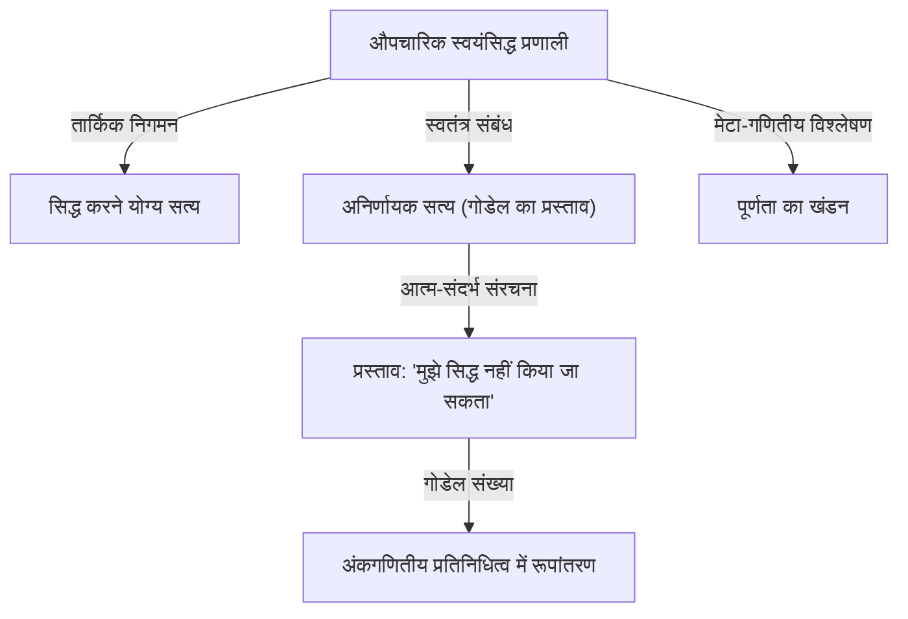
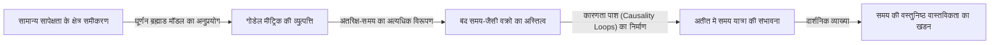

# 1. परिचय: बुद्धि के एक दिग्गज और गणित में प्रतिमान बदलाव

कर्ट गोडेल इतिहास के सबसे महान तर्कशास्त्रियों में से एक हैं, जिन्हें अक्सर अरस्तू और गॉटफ्राइड लाइबनिज के साथ रखा जाता है। 1931 में प्रकाशित उनके **अपूर्णता प्रमेयों** ने गणित की पूर्ण नींव में निहित सीमाओं को उजागर कर दिया, जिससे पूरे विज्ञान को एक अथाह झटका लगा। इस प्रमेय ने "हम जो साबित कर सकते हैं" और "जो सच है" के बीच एक अपरिहार्य अंतर प्रदर्शित किया, जिसने उस समय के गणितज्ञों द्वारा रखे गए पूर्ण निश्चितता के सपने को चकनाचूर कर दिया।

गोडेल की उपलब्धियाँ केवल गणितीय प्रमाणों से कहीं आगे तक जाती हैं, जो दर्शनशास्त्र, कंप्यूटर विज्ञान और यहाँ तक कि ब्रह्मांड विज्ञान तक पहुँचती हैं। इस लेख में, हम उस प्रतिभाशाली व्यक्ति की यात्रा में गहराई से उतरते हैं जिसने हमेशा के लिए गणित के इतिहास को बदल दिया, उनकी गणितीय उपलब्धियों के विवरण, अल्बर्ट आइंस्टीन के साथ उनकी गहरी दोस्ती, और उनके बाद के वर्षों के दुखद अंत की कई दृष्टिकोणों से खोज की।

# 2. गणित में संकट और हिल्बर्ट का कार्यक्रम

गोडेल के काम के मूल्य की वास्तव में सराहना करने के लिए, उस समय गणितीय दुनिया के सामने आने वाले "नींव के संकट" को विस्तार से समझना आवश्यक है। 19वीं सदी के अंत में, जॉर्ज कैंटर द्वारा स्थापित अनंत सेटों के सिद्धांत ने गणित में पूरी तरह से नए दृष्टिकोण और शक्तिशाली उपकरण लाए। हालाँकि, जल्द ही यह पता चला कि इसमें "रसेल के विरोधाभास" जैसे आत्म-संदर्भ के गंभीर विरोधाभास छिपे हुए थे।

रसेल का विरोधाभास "उन सभी सेटों के सेट पर विचार करता है जो स्वयं को सदस्यों के रूप में शामिल नहीं करते हैं।" यदि यह सेट स्वयं को शामिल करता है, तो यह अपनी ही परिभाषा का खंडन करता है; यदि यह स्वयं को शामिल नहीं करता है, तो इसे परिभाषा के अनुसार स्वयं का सदस्य होना चाहिए, जो फिर से एक विरोधाभास की ओर ले जाता है। इस खोज ने उस समय के गणितीय आधारों की अत्यधिक नाजुकता को उजागर किया, जो बहुत हद तक सहज तर्क पर निर्भर थे।

इसे संबोधित करने के लिए, महान जर्मन गणितज्ञ डेविड हिल्बर्ट ने "हिल्बर्ट का कार्यक्रम" प्रस्तावित किया। इसका उद्देश्य स्वयंसिद्धों और अनुमान के यांत्रिक नियमों के एक छोटे सेट से सभी गणितीय प्रमेयों को प्राप्त करने के लिए एक औपचारिकतावादी दृष्टिकोण था। अंतिम लक्ष्य गणितीय रूप से सिद्ध करना था, सीमित चरणों में, कि स्वयंसिद्ध प्रणाली कभी भी पूर्ण रूप से विरोधाभास (संगति) को जन्म नहीं देगी और यह कि प्रत्येक सत्य प्रस्ताव को उस प्रणाली (पूर्णता) के भीतर सिद्ध किया जा सकता है। यदि यह सफल हो जाता है, तो गणित एक पूर्ण रूप से ठोस आधार पर खड़ा होगा। उस समय के गणितज्ञों को इस कार्यक्रम की सफलता पर दृढ़ विश्वास था, जो गणित के पूर्ण औपचारिकरण को केवल समय की बात मानते थे।

# 3. प्रारंभिक जीवन और वियना सर्कल का दर्शन

कर्ट गोडेल का जन्म 28 अप्रैल, 1906 को ऑस्ट्रो-हंगेरियन साम्राज्य के ब्रून, मोराविया (अब ब्रनो, चेक गणराज्य) में हुआ था। एक बच्चे के रूप में, वे अत्यधिक जिज्ञासु थे, लगातार हर चीज के पीछे के कारणों को पूछते थे, जिससे उन्हें उनके परिवार से "मिस्टर व्हाई" (Herr Warum) का उपनाम मिला। हालांकि वे बीमार रहते थे, और उन्हें आमवाती बुखार (rheumatic fever) का सामना करना पड़ा था, उन्होंने अपनी पढ़ाई में असाधारण प्रतिभा का प्रदर्शन किया और लगातार शीर्ष ग्रेड प्राप्त किए।

1924 में, गोडेल ने वियना विश्वविद्यालय में प्रवेश लिया। उन्होंने शुरू में सैद्धांतिक भौतिकी में पढ़ाई की, लेकिन फिलिप फुर्टवेंगलर के संख्या सिद्धांत के व्याख्यानों से गहराई से प्रभावित हुए और गणित की ओर रुख किया। उन्होंने दार्शनिक मोरित्ज़ श्लिक के नेतृत्व में "वियना सर्कल" की बैठकों में भी भाग लेना शुरू किया, जिसमें रुडोल्फ कारनैप जैसे सदस्य शामिल थे।

वियना सर्कल ने तार्किक प्रत्यक्षवाद की वकालत की, तत्वमीमांसीय प्रस्तावों को अर्थहीन बताकर खारिज करने और सभी वैज्ञानिक ज्ञान को अनुभव और तर्क तक कम करने की कोशिश की। इस वातावरण में बातचीत करने से गोडेल को तर्क की कठोरता और महत्व के लिए गहरी प्रशंसा मिली। हालाँकि, गोडेल स्वयं कभी भी उनके तत्वमीमांसा-विरोधी रुख से सहमत नहीं थे, और बाद में "गणितीय प्लेटोवाद" में उनका दृढ़ विश्वास विकसित हुआ। उनका मानना था कि गणितीय वस्तुएँ मानवीय मानसिक गतिविधि द्वारा नहीं बनाई गई हैं, बल्कि वस्तुनिष्ठ रूप से और भौतिक दुनिया से स्वतंत्र रूप से मौजूद हैं, और गणितज्ञ केवल उन्हें "खोजते" हैं।

# 4. प्रथम क्रम तर्क का पूर्णता प्रमेय

1930 में, वियना विश्वविद्यालय में प्रस्तुत अपनी डॉक्टरेट थीसिस में, गोडेल ने "प्रथम-क्रम तर्क के पूर्णता प्रमेय" को शानदार ढंग से सिद्ध किया। प्रथम-क्रम तर्क एक तार्किक प्रणाली है जिसमें परिमाणक (quantifiers: सभी के लिए, मौजूद है) केवल चर (variables) पर लागू किए जा सकते हैं, विधेय (predicates) पर नहीं।

इस पेपर में, गोडेल ने दिखाया कि प्रथम-क्रम तर्क में, "एक प्रस्ताव जो तार्किक रूप से हमेशा सत्य होता है (एक मान्य तार्किक सूत्र) आवश्यक रूप से सीमित चरणों में स्वयंसिद्धों से सिद्ध किया जा सकता है।" यह हिल्बर्ट के कार्यक्रम की आंशिक सफलता का प्रतीक था, यह गारंटी देता था कि तार्किक प्रणाली के अनुमान नियम पर्याप्त रूप से शक्तिशाली थे। कई गणितज्ञों को बड़ी उम्मीदें थीं कि यह संख्या सिद्धांत (अंकगणित) की पूर्णता को भी साबित करने के लिए एक कदम के रूप में काम कर सकता है। हालाँकि, गोडेल द्वारा अगले वर्ष प्रकाशित पेपर ने उन उम्मीदों को पूरी तरह से चकनाचूर कर दिया।

# 5. प्रथम अपूर्णता प्रमेय का झटका और गोडेल संख्या

1931 में, गोडेल ने "ऑन फॉर्मली अनडिसाइडेबल प्रपोजिशन्स ऑफ प्रिंसिपिया मैथमेटिका एंड रिलेटेड सिस्टम्स I" नामक पेपर प्रकाशित किया। इस पेपर ने **प्रथम अपूर्णता प्रमेय** प्रस्तुत किया, जो विज्ञान के इतिहास में शानदार ढंग से चमकता है।

प्रथम अपूर्णता प्रमेय को इस प्रकार कहा जा सकता है: "प्रारंभिक अंकगणित को व्यक्त करने में सक्षम किसी भी सुसंगत औपचारिक स्वयंसिद्ध प्रणाली में, हमेशा ऐसे प्रस्ताव होते हैं जो सत्य होते हैं लेकिन जिन्हें सिस्टम के भीतर न तो सिद्ध किया जा सकता है और न ही अस्वीकार किया जा सकता है।"

गणितीय रूप से व्यक्त किया गया, एक निश्चित प्रस्ताव $G$ के लिए, निम्नलिखित सत्य है:

$$ G \iff \neg \text{Prov}( \lceil G \rceil ) $$

यहाँ, $\text{Prov}$ "सिस्टम के भीतर सिद्ध करने योग्य है" विधेय (predicate) को दर्शाता है, और $\lceil G \rceil$ प्रस्ताव $G$ की गोडेल संख्या को दर्शाता है। दूसरे शब्दों में, प्रस्ताव $G$ आत्म-संदर्भित रूप से जोर देता है, "मैं स्वयं इस प्रणाली में सिद्ध नहीं हो सकता।" यदि $G$ सिद्ध करने योग्य होता, तो प्रणाली ने एक गलत प्रस्ताव (जो यह दावा करता है कि इसे सिद्ध नहीं किया जा सकता) साबित कर दिया होता, जिसके परिणामस्वरूप विरोधाभास होता। इसलिए, जब तक प्रणाली सुसंगत है, $G$ अप्रमाणित है, और चूंकि यह बिल्कुल वैसा ही है जैसा यह दावा करता है, यह "सत्य" है।

इस आश्चर्यजनक प्रमेय को सिद्ध करने के लिए, गोडेल ने "गोडेल संख्या (Gödel numbering)" नामक एक अभूतपूर्व तकनीक का आविष्कार किया। यह अभाज्य गुणनखंडन की विशिष्टता का उपयोग करते हुए प्रतीकों, तार्किक सूत्रों और संपूर्ण चरण-दर-चरण प्रमाणों को एक ही विशाल प्राकृतिक संख्या में बदलने की एक विधि है। इसने मेटा-गणितीय प्रस्तावों (जैसे "एक निश्चित तार्किक सूत्र सिद्ध करने योग्य है") को प्राकृतिक संख्याओं के विशुद्ध रूप से अंकगणितीय गुणों के रूप में माना जाने की अनुमति दी। यह "विकर्ण लेम्मा (Diagonal Lemma)", जिसने तार्किक प्रणाली को अपनी सीमाओं (आत्म-संदर्भ) के बारे में बोलने की अनुमति दी, गणित के इतिहास में सबसे सुंदर प्रमाण तकनीकों में से एक मानी जाती है।

# 6. द्वितीय अपूर्णता प्रमेय और हिल्बर्ट के सपने का अंत

प्रथम अपूर्णता प्रमेय के प्रत्यक्ष परिणाम के रूप में, गोडेल ने और भी शक्तिशाली **द्वितीय अपूर्णता प्रमेय** प्राप्त किया। यह बताता है: "अंकगणित को व्यक्त करने में सक्षम एक सुसंगत औपचारिक स्वयंसिद्ध प्रणाली स्वयं के भीतर अपनी निरंतरता को साबित नहीं कर सकती है।"

गणितीय रूप से व्यक्त, यह इस प्रकार है:

$$ \text{Con}(F) \implies \neg \text{Prov}( \lceil \text{Con}(F) \rceil ) $$

यहाँ, $\text{Con}(F)$ एक तार्किक सूत्र है जो यह दर्शाता है कि स्वयंसिद्ध प्रणाली $F$ सुसंगत है। यदि सिस्टम $F$ अपनी स्वयं की स्थिरता साबित कर सकता है, तो सिस्टम वास्तव में असंगत होगा।

द्वितीय अपूर्णता प्रमेय हिल्बर्ट के कार्यक्रम के लिए एक पूर्ण मृत्युदंड था। गणित की स्थिरता को पूरी तरह से गणित के भीतर से साबित करने का हिल्बर्ट का भव्य सपना सिद्धांत रूप में असंभव साबित हुआ। एक गहरा सत्य यहाँ स्थापित किया गया था: गणित अपनी शक्ति से अपनी स्वयं की नींव की सुरक्षा की गारंटी नहीं दे सकता है।

# 7. सांतत्यक परिकल्पना और रचनात्मक ब्रह्मांड (L) में योगदान

अपूर्णता प्रमेयों के बाद भी, गोडेल की बौद्धिक खोज नहीं रुकी। उन्होंने सेट सिद्धांत में एक लंबे समय से अनसुलझी समस्या और हिल्बर्ट की 23 समस्याओं में से पहली, "सांतत्यक परिकल्पना (Continuum Hypothesis)" से निपटा। कैंटर द्वारा प्रस्तावित यह परिकल्पना मानती है कि "ऐसा कोई सेट नहीं है जिसकी कार्डिनैलिटी पूर्णांक (गणनीय अनंत) और वास्तविक संख्या (कंटीन्यूअम) के बीच सख्ती से हो।"

$$ 2^{\aleph_0} = \aleph_1 $$

1940 में, गोडेल ने "रचनात्मक ब्रह्मांड (L)" की क्रांतिकारी अवधारणा पेश की। यह व्यवस्थित रूप से केवल उन तत्वों को इकट्ठा करके निर्मित एक मॉडल है जिन्हें मौजूदा सेटों से तार्किक रूप से परिभाषित किया जा सकता है। गोडेल ने सिद्ध किया कि यदि ज़र्मेलो-फ्रेंकेल सेट सिद्धांत (ZF) सुसंगत है, तो इसमें चॉइस के स्वयंसिद्ध (AC) और सामान्यीकृत कंटीन्यूअम हाइपोथेसिस (GCH) को जोड़कर प्राप्त की गई प्रणाली भी सुसंगत है। इससे पता चला कि सांतत्यक परिकल्पना गणित के वर्तमान स्वयंसिद्धों का खंडन नहीं करती है। बाद में, 1963 में, पॉल कोहेन ने यह साबित करने के लिए फोर्सिंग नामक तकनीक का उपयोग किया कि "सांतत्यक परिकल्पना का निषेध" भी सुसंगत है, जिससे निश्चित रूप से यह स्थापित हो गया कि सांतत्यक परिकल्पना ZFC से एक स्वतंत्र प्रस्ताव है।

# 8. अमेरिका में निर्वासन और आइंस्टीन के साथ मित्रता

जब 1933 में एडोल्फ हिटलर ने जर्मनी में सत्ता हथिया ली, तो यूरोप में राजनीतिक स्थिति तेजी से बिगड़ने लगी। 1938 में नाजी जर्मनी द्वारा ऑस्ट्रिया के कब्जे (अंशलस) के बाद, वियना विश्वविद्यालय की स्थिति पूरी तरह से बदल गई, और गोडेल को सेना में अनिवार्य भर्ती के आसन्न खतरे का सामना करना पड़ा। अपनी पत्नी एडेल के साथ, उन्होंने एक कठिन यात्रा की, ट्रांस-साइबेरियन रेलवे के माध्यम से सोवियत संघ को पार किया और संयुक्त राज्य अमेरिका में शरण लेने के लिए प्रशांत महासागर को पार किया।

वह प्रिंसटन, न्यू जर्सी में इंस्टीट्यूट फॉर एडवांस्ड स्टडी (IAS) में बस गए। यहीं पर गोडेल ने 20वीं सदी के सबसे महान भौतिक विज्ञानी अल्बर्ट आइंस्टीन के साथ एक गहरा, बौद्धिक बंधन विकसित किया। एक तर्कशास्त्री और एक भौतिक विज्ञानी, अंतर्मुखी और विक्षिप्त गोडेल, और हंसमुख और बहिर्मुखी आइंस्टीन। हालांकि उनके व्यक्तित्व और शोध क्षेत्र काफी भिन्न थे, वे प्रिंसटन में एक प्रसिद्ध दृश्य बन गए, जो लगभग हर दिन एक साथ संस्थान जाते थे, जर्मन में गहराई से बातचीत करते थे।

अपने बाद के वर्षों में, आइंस्टीन को यह कहते हुए जाना जाता था, "मैं संस्थान केवल गोडेल के साथ घर चलने के विशेषाधिकार के लिए जाता हूँ।" दोनों क्वांटम यांत्रिकी की अपूर्णता, समय की मौलिक प्रकृति, साथ ही राजनीति और दर्शन से संबंधित गहन चर्चाओं में लगे रहे।

# 9. गोडेल मीट्रिक: समय के पीछे जाने वाले ब्रह्मांड की खोज

आइंस्टीन के साथ अपनी बातचीत से प्रेरित होकर, गोडेल ने सामान्य सापेक्षता के अध्ययन में खुद को डुबो दिया। 1949 में, आइंस्टीन के 70वें जन्मदिन के लिए, गोडेल ने उन्हें आइंस्टीन के क्षेत्र समीकरणों का एक सटीक समाधान प्रस्तुत किया, जिसे "गोडेल मीट्रिक" या गोडेल के ब्रह्मांड के रूप में जाना जाने लगा।

यह ब्रह्माण्ड संबंधी मॉडल एक ऐसे ब्रह्मांड का वर्णन करता है जो समग्र रूप से घूम रहा है और एक उपयुक्त नकारात्मक ब्रह्माण्ड संबंधी स्थिरांक रखता है। सबसे आश्चर्यजनक विशेषता यह है कि इस ब्रह्मांड में "बंद समय-जैसी वक्र (closed timelike curves)" मौजूद हैं। यानी उन्होंने गणितीय रूप से साबित कर दिया कि प्रकाश की गति से अधिक पदार्थ के बिना अतीत की समय यात्रा सैद्धांतिक रूप से संभव है।

आइंस्टीन स्वयं अपनी घबराहट और सदमे को छिपा नहीं सके कि उनके अपने सिद्धांत ने अतीत की समय यात्रा की अनुमति दी, लेकिन गोडेल का गणितीय तर्क त्रुटिहीन था। इस परिणाम से, गोडेल ने दार्शनिक निष्कर्ष निकाला कि "समय की अवधारणा कोई वस्तुनिष्ठ भौतिक वास्तविकता नहीं है बल्कि केवल एक व्यक्तिपरक मानवीय भ्रम है," इस प्रकार कांतियन आदर्शवाद की भौतिकी-आधारित रक्षा की पेशकश की।

# 10. दर्शन और ईश्वर के अस्तित्व का ओंटोलॉजिकल प्रमाण

गोडेल न केवल एक शुद्ध गणितज्ञ थे बल्कि एक गहन दार्शनिक विचारक भी थे। उन्होंने दृढ़ता से प्लेटोवाद का समर्थन किया, जैसा कि पहले उल्लेख किया गया है, और गॉटफ्राइड लाइबनिज के दर्शन के प्रति गहराई से समर्पित थे। उनका मानना ​​था कि दुनिया पूरी तरह से तार्किक और तर्कसंगत रूप से निर्मित है, और कोई संयोग नहीं है।

उनके दार्शनिक अन्वेषण के शिखरों में से एक तार्किक शब्दों में "ईश्वर के अस्तित्व के ओंटोलॉजिकल प्रमाण" का उनका औपचारिकीकरण था। मोडल लॉजिक (आवश्यकता और संभावना से निपटने वाला एक तर्क) का उपयोग करते हुए, गोडेल ने एंसेल्म और लाइबनिज द्वारा एक गणितीय प्रारूप में ईश्वर के प्रमाणों को कड़ाई से खंगाला। उन्होंने "सकारात्मक गुणों (positive properties)" की अवधारणा को स्वयंसिद्ध किया और गणितीय रूप से यह साबित करने का प्रयास किया कि सभी सकारात्मक गुणों (ईश्वर) को धारण करने वाला व्यक्ति, यदि यह एक संभावित दुनिया में मौजूद है, तो आवश्यक रूप से सभी आवश्यक दुनियाओं में मौजूद होना चाहिए।

प्रमाण में मोडल लॉजिक के सूत्र शामिल हैं जैसे:

$$ P( \text{God} ) \implies \Box \exists x \; \text{God}(x) $$

यहाँ, $\Box$ दर्शाता है "यह आवश्यक रूप से सत्य है कि।" अपने जीवनकाल के दौरान, उन्होंने इस प्रमाण को अपनी निजी नोटबुक में रखा और इसे कभी प्रकाशित नहीं किया, लेकिन यह उनकी मृत्यु के बाद खोजा गया था और तर्क और धर्मशास्त्र के चौराहे पर एक बड़े पैमाने पर बहस छेड़ दी।

# 11. ट्यूरिंग और कंप्यूटर विज्ञान के लिए विरासत

गोडेल के अपूर्णता प्रमेयों और गोडेल संख्या के विचार का संगणना सिद्धांत के जन्म पर सीधा और गहरा प्रभाव पड़ा। ब्रिटिश गणितज्ञ एलन ट्यूरिंग ने "ट्यूरिंग मशीन" के रूप में जाना जाने वाला एक अमूर्त कम्प्यूटेशनल मॉडल की कल्पना करने के लिए गोडेल के तर्क को लागू किया, और साबित किया कि ऐसी समस्याएं हैं जिन्हें किसी भी एल्गोरिदम (हाल्टिंग प्रॉब्लम) द्वारा हल नहीं किया जा सकता है। लगभग उसी समय, अलोंजो चर्च ने लैम्ब्डा कैलकुलस का उपयोग करके एक समान निष्कर्ष निकाला।

आज, कृत्रिम बुद्धिमत्ता (AI) की सीमाओं के बारे में बहस में गोडेल के प्रमेयों का अक्सर हवाला दिया जाता है। भौतिक विज्ञानी रोजर पेनरोज़ ने "पेनरोज़-गोडेल तर्क" का प्रस्ताव दिया, यह तर्क देते हुए कि "जबकि मशीनें (AI) एल्गोरिदम का पालन करती हैं और इस प्रकार अपूर्णता प्रमेयों से बाध्य हैं, मानव अंतर्ज्ञान सत्य को देख सकता है, जिसका अर्थ है कि मानव चेतना गैर-गणना योग्य प्रक्रियाओं पर आधारित है।" यह बहस कि क्या AI वास्तव में मानव बुद्धि को पार कर सकता है, आज भी गहन चर्चा को जन्म दे रहा है।

# 12. बाद के जीवन में पैरानोइया और एक दुखद अंत

एक असाधारण तार्किक बुद्धि होने के बावजूद, गोडेल का दिमाग अविश्वसनीय रूप से नाजुक था। अपने पूरे जीवन में, वे गंभीर हाइपोकॉन्ड्रिया और पैरानोइया (भ्रम) से पीड़ित रहे। विशेष रूप से अपने बाद के वर्षों में, उन्हें इस जुनूनी डर ने सताया कि "कोई मुझे जहर देने की कोशिश कर रहा है।"

वे केवल अपनी पत्नी एडेल द्वारा तैयार और व्यक्तिगत रूप से चखा हुआ खाना ही खाते थे, जिस पर उन्हें पूरा भरोसा था। हालाँकि, 1977 के अंत में, एडेल गंभीर रूप से बीमार हो गईं और उन्हें लंबी अवधि के लिए अस्पताल में भर्ती होना पड़ा, जिससे गोडेल के भोजन की देखभाल करने वाला कोई नहीं बचा। जहर दिए जाने के डर से लकवाग्रस्त होकर, उन्होंने पूरी तरह से खाने से इनकार कर दिया। 14 जनवरी, 1978 को प्रिंसटन अस्पताल के एक बिस्तर पर उनका निधन हो गया।

मृत्यु का आधिकारिक कारण "व्यक्तित्व की गड़बड़ी के कारण कुपोषण और भुखमरी" था। कहा जाता है कि मृत्यु के समय उनका वजन केवल 29 किलोग्राम था। मानव इतिहास की सबसे बड़ी तार्किक बुद्धि का अत्यंत दुखद अंत हुआ, उसकी जान सबसे अतार्किक डर ने ले ली।

# 13. निष्कर्ष: सत्य का एक शाश्वत साधक

कर्ट गोडेल एक विलक्षण प्रतिभाशाली व्यक्ति थे जिन्होंने परम विरोधाभास हासिल किया: बुद्धि की सीमाओं को गणितीय रूप से साबित करना। गहरा सत्य प्रस्तुत करके कि "हम तार्किक रूप से सब कुछ पूर्ण रूप से सिद्ध नहीं कर सकते हैं", उन्होंने विरोधाभासी रूप से मानव ज्ञान के क्षेत्र में अनंत विस्तार प्रदान किया।

उनकी उपलब्धियाँ, जो गणित, तर्कशास्त्र, दर्शन, भौतिकी और कंप्यूटर विज्ञान तक फैली हुई हैं, आधुनिक विज्ञान की नींव बनने के लिए अनुशासनात्मक सीमाओं को पार कर गई हैं। जब तक मानवता ज्ञान की अपनी खोज जारी रखती है, गोडेल द्वारा पीछे छोड़ी गई शानदार रोशनी—एक ऐसा व्यक्ति जिसने अथक रूप से तर्क की खाई और ब्रह्मांड के सत्यों को देखा—कभी फीकी नहीं पड़ेगी।
