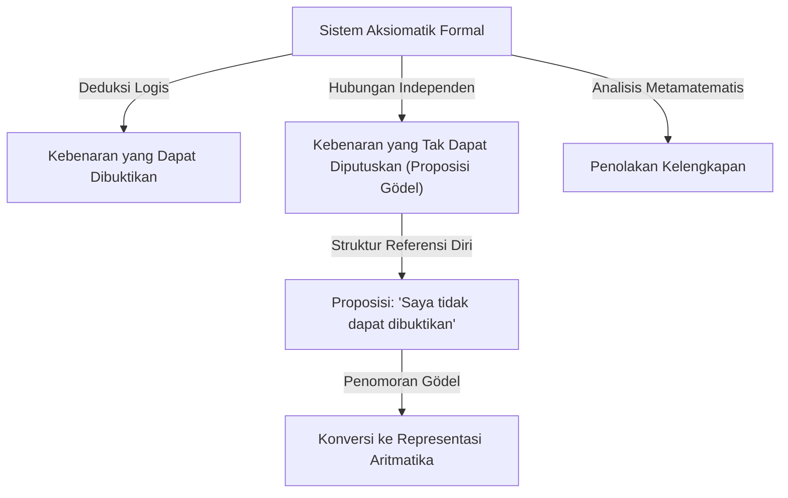
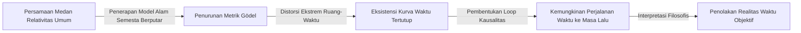

# 1. Pendahuluan: Raksasa Intelektual dan Pergeseran Paradigma dalam Matematika

[Kurt Gödel](https://kenji.blog/id/p/godel/) adalah salah satu ahli logika terbesar dalam sejarah, sering disejajarkan dengan Aristoteles dan [Gottfried Leibniz](https://kenji.blog/id/p/leibniz/). **Teorema Ketidaklengkapan** yang ia terbitkan pada tahun 1931 mengungkap keterbatasan inheren dalam fondasi absolut matematika, memberikan kejutan yang tak terukur bagi seluruh ilmu pengetahuan. Teorema ini menunjukkan kesenjangan yang tak terhindarkan antara "apa yang bisa kita buktikan" dan "apa yang benar," menghancurkan mimpi tentang kepastian mutlak yang dipegang oleh para matematikawan pada masa itu.

Pencapaian Gödel jauh melampaui sekadar pembuktian matematis belaka, menjangkau ke dalam filsafat, ilmu komputer, dan bahkan kosmologi. Dalam artikel ini, kita mendalami secara mendalam jejak jenius ini yang mengubah sejarah matematika selamanya, menjelajahi detail prestasi matematisnya, persahabatan mendalamnya dengan Albert Einstein, dan akhir tragis di tahun-tahun terakhirnya dari berbagai sudut pandang.

# 2. Krisis dalam Matematika dan Program [Hilbert](https://kenji.blog/id/p/hilbert/)

Untuk benar-benar menghargai nilai karya Gödel, penting untuk memahami secara rinci "krisis fondasi" yang dihadapi dunia matematika pada saat itu. Pada akhir abad ke-19, teori himpunan tak terhingga, yang didirikan oleh [Georg Cantor](https://kenji.blog/id/p/cantor/), membawa perspektif yang sepenuhnya baru dan alat yang kuat bagi matematika. Namun, tak lama kemudian ditemukan bahwa teori ini menyimpan paradoks referensi diri yang parah, seperti "Paradoks Russell."

Paradoks Russell mempertimbangkan "himpunan semua himpunan yang tidak memuat dirinya sendiri sebagai anggota." Jika himpunan ini memuat dirinya sendiri, ia bertentangan dengan definisinya sendiri; jika ia tidak memuat dirinya sendiri, ia harus berdasarkan definisi menjadi anggota dirinya sendiri, yang lagi-lagi berujung pada kontradiksi. Penemuan ini mengekspos kerapuhan ekstrem dari fondasi matematika pada masa itu, yang sangat bergantung pada penalaran intuitif.

Untuk mengatasi ini, matematikawan hebat Jerman [David Hilbert](https://kenji.blog/id/p/hilbert/) mengusulkan "Program [Hilbert](https://kenji.blog/id/p/hilbert/)." Ini bertujuan untuk pendekatan formalistik guna menurunkan semua teorema matematika dari sekumpulan kecil aksioma dan aturan inferensi mekanis. Tujuan utamanya adalah membuktikan secara matematis, dalam jumlah langkah yang terbatas, bahwa sistem aksioma tersebut sama sekali tidak akan pernah mengarah pada kontradiksi (konsistensi) dan bahwa setiap proposisi yang benar dapat dibuktikan di dalam sistem tersebut (kelengkapan). Jika berhasil, matematika akan berdiri di atas fondasi yang sangat kokoh. Para matematikawan pada saat itu sangat percaya pada keberhasilan program ini, menganggap formalisasi matematika yang lengkap hanyalah masalah waktu.

# 3. Kehidupan Awal dan Filsafat Lingkaran Wina

[Kurt Gödel](https://kenji.blog/id/p/godel/) lahir pada 28 April 1906, di Brünn, Moravia (sekarang Brno, Republik Ceko), di Kekaisaran Austro-Hungaria. Sebagai seorang anak, ia sangat ingin tahu, terus-menerus menanyakan alasan di balik segalanya, sehingga ia mendapat julukan "Tuan Mengapa" (Herr Warum) dari keluarganya. Meskipun ia sakit-sakitan, pernah menderita demam rematik, ia menunjukkan bakat luar biasa dalam studinya dan secara konsisten meraih nilai tertinggi.

Pada tahun 1924, Gödel masuk ke Universitas Wina. Ia awalnya mengambil jurusan fisika teoritis tetapi sangat tergerak oleh kuliah Philipp Furtwängler tentang teori bilangan dan beralih ke matematika. Ia juga mulai menghadiri pertemuan "Lingkaran Wina," yang dipimpin oleh filsuf Moritz Schlick dan beranggotakan Rudolf Carnap.

Lingkaran Wina menganjurkan positivisme logis, berusaha mengabaikan proposisi metafisik sebagai hal yang tidak masuk akal dan mengurangi semua pengetahuan ilmiah menjadi pengalaman dan logika. Berinteraksi dalam lingkungan ini memberi Gödel apresiasi yang mendalam terhadap ketegasan dan pentingnya logika. Namun, Gödel sendiri tidak pernah setuju dengan sikap anti-metafisik mereka, yang kemudian mengembangkan keyakinan kuat pada "platonisme matematis." Ia percaya bahwa objek matematika tidak diciptakan oleh aktivitas mental manusia tetapi ada secara objektif dan independen dari dunia fisik, dan bahwa para matematikawan hanya "menemukannya."

# 4. Teorema Kelengkapan Logika Orde Pertama

Pada tahun 1930, dalam disertasi doktoralnya yang diajukan ke Universitas Wina, Gödel dengan cemerlang membuktikan "Teorema Kelengkapan Logika Orde Pertama." Logika orde pertama adalah sistem logis di mana kuantor (untuk semua, terdapat) hanya dapat diterapkan pada variabel, bukan pada predikat.

Dalam makalah ini, Gödel menunjukkan bahwa dalam logika orde pertama, "sebuah proposisi yang secara logis selalu benar (rumus logis yang valid) niscaya dapat dibuktikan dari aksioma dalam jumlah langkah yang terbatas." Ini menandakan keberhasilan sebagian dari Program [Hilbert](https://kenji.blog/id/p/hilbert/), menjamin bahwa aturan inferensi sistem logis itu cukup kuat. Banyak matematikawan menaruh harapan tinggi bahwa ini dapat berfungsi sebagai batu loncatan untuk juga membuktikan kelengkapan teori bilangan (aritmatika). Namun, makalah yang diterbitkan Gödel pada tahun berikutnya akan menghancurkan harapan itu sepenuhnya.

# 5. Kejutan Teorema Ketidaklengkapan Pertama dan Penomoran Gödel

Pada tahun 1931, Gödel menerbitkan makalah "Tentang Proposisi Formal yang Tak Dapat Diputuskan dari Principia Mathematica dan Sistem Terkait I." Makalah ini menyajikan **Teorema Ketidaklengkapan Pertama**, yang bersinar cemerlang dalam sejarah sains.

Teorema Ketidaklengkapan Pertama dapat dinyatakan sebagai berikut: "Dalam sistem aksiomatik formal yang konsisten mana pun yang mampu mengekspresikan aritmatika dasar, selalu ada proposisi yang benar tetapi tidak dapat dibuktikan atau dibantah di dalam sistem tersebut."

Dinyatakan secara matematis, untuk proposisi $G$ tertentu, hal berikut ini berlaku:

$$ G \iff \neg \text{Prov}( \lceil G \rceil ) $$

Di sini, $\text{Prov}$ mewakili predikat "dapat dibuktikan di dalam sistem," dan $\lceil G \rceil$ menunjukkan nomor Gödel dari proposisi $G$. Dengan kata lain, proposisi $G$ secara referensi mandiri menegaskan, "Saya sendiri tidak dapat dibuktikan dalam sistem ini." Jika $G$ dapat dibuktikan, sistem tersebut telah membuktikan proposisi yang salah (yang mengklaim tidak dapat dibuktikan), yang berujung pada kontradiksi. Oleh karena itu, selama sistem tersebut konsisten, $G$ tidak dapat dibuktikan, dan karena persis seperti yang diklaimnya, ia adalah "benar."

Untuk membuktikan teorema yang menakjubkan ini, Gödel menemukan teknik terobosan yang dikenal sebagai "Penomoran Gödel". Ini adalah metode untuk mengubah simbol, rumus logika, dan keseluruhan langkah pembuktian menjadi satu bilangan asli yang sangat besar, dengan memanfaatkan keunikan faktorisasi prima. Hal ini memungkinkan proposisi metamatematika (seperti "rumus logika tertentu dapat dibuktikan") diperlakukan murni sebagai sifat aritmatika dari bilangan asli. "Lemma Diagonal" ini, yang memungkinkan sistem logika untuk berbicara tentang batas-batasnya sendiri (referensi diri), dianggap sebagai salah satu teknik pembuktian paling indah dalam sejarah matematika.

# 6. Teorema Ketidaklengkapan Kedua dan Akhir Impian [Hilbert](https://kenji.blog/id/p/hilbert/)

Sebagai konsekuensi langsung dari Teorema Ketidaklengkapan Pertama, Gödel menurunkan **Teorema Ketidaklengkapan Kedua** yang bahkan lebih kuat. Ini menyatakan: "Sebuah sistem aksiomatik formal yang konsisten dan mampu mengekspresikan aritmatika tidak dapat membuktikan konsistensinya sendiri di dalam sistem itu sendiri."

Dinyatakan secara matematis, adalah sebagai berikut:

$$ \text{Con}(F) \implies \neg \text{Prov}( \lceil \text{Con}(F) \rceil ) $$

Di sini, $\text{Con}(F)$ adalah rumus logis yang mewakili bahwa sistem aksioma $F$ konsisten. Jika sistem $F$ dapat membuktikan konsistensinya sendiri, sistem itu sebenarnya tidak konsisten.

Teorema Ketidaklengkapan Kedua adalah hukuman mati mutlak bagi Program [Hilbert](https://kenji.blog/id/p/hilbert/). Impian besar [Hilbert](https://kenji.blog/id/p/hilbert/) untuk membuktikan konsistensi matematika sepenuhnya dari dalam matematika itu sendiri terbukti mustahil secara prinsip. Kebenaran yang mendalam telah ditetapkan di sini: matematika tidak dapat menjamin keamanan fondasinya sendiri dengan kekuatannya sendiri.

# 7. Kontribusi terhadap Hipotesis Kontinum dan Semesta yang Dapat Dikonstruksi (L)

Bahkan setelah teorema ketidaklengkapan, pencarian intelektual Gödel tidak berhenti. Ia memecahkan "Hipotesis Kontinum," masalah yang lama belum terpecahkan dalam teori himpunan dan yang pertama dari 23 masalah [Hilbert](https://kenji.blog/id/p/hilbert/). Diusulkan oleh Cantor, hipotesis ini mengemukakan bahwa "tidak ada himpunan yang kardinalitasnya berada di antara bilangan bulat (tak terhingga yang dapat dihitung) dan bilangan riil (kontinum)."

$$ 2^{\aleph_0} = \aleph_1 $$

Pada tahun 1940, Gödel memperkenalkan konsep revolusioner "Semesta yang dapat dikonstruksi (L)." Ini adalah model yang dibangun dengan mengumpulkan secara sistematis hanya elemen-elemen yang dapat didefinisikan secara logis dari himpunan yang ada. Gödel membuktikan bahwa jika teori himpunan Zermelo-Fraenkel (ZF) konsisten, maka sistem yang diperoleh dengan menambahkan Aksioma Pilihan (AC) dan Hipotesis Kontinum Umum (GCH) ke dalamnya juga konsisten. Ini menunjukkan bahwa hipotesis kontinum tidak bertentangan dengan aksioma matematika saat ini. Kemudian, pada tahun 1963, Paul Cohen menggunakan teknik yang disebut *forcing* untuk membuktikan bahwa "negasi dari hipotesis kontinum" juga konsisten, sehingga secara definitif menetapkan bahwa hipotesis kontinum adalah proposisi independen dari ZFC.

# 8. Pengasingan ke Amerika dan Persahabatan dengan Einstein

Ketika Adolf Hitler merebut kekuasaan di Jerman pada tahun 1933, situasi politik di Eropa memburuk dengan cepat. Menyusul aneksasi Austria (Anschluss) oleh Nazi Jerman pada tahun 1938, situasi di Universitas Wina berubah total, dan Gödel menghadapi ancaman wajib militer yang akan segera terjadi. Bersama istrinya Adele, ia melakukan perjalanan yang melelahkan, melintasi Uni Soviet melalui Kereta Api Trans-Siberia dan melintasi Samudra Pasifik untuk mencari suaka di Amerika Serikat.

Ia menetap di Institute for Advanced Study (IAS) di Princeton, New Jersey. Di sinilah Gödel mengembangkan ikatan intelektual yang mendalam dengan Albert Einstein, fisikawan terbesar abad ke-20. Seorang ahli logika dan seorang fisikawan, Gödel yang introvert dan neurotik, serta Einstein yang ceria dan ekstrovert. Meskipun kepribadian dan bidang penelitian mereka sangat berbeda, mereka menjadi pemandangan legendaris di Princeton, berjalan bersama ke Institut hampir setiap hari, berbincang mendalam dalam bahasa Jerman.

Di tahun-tahun terakhirnya, Einstein dikenal pernah berucap, "Saya pergi ke Institut hanya demi hak istimewa bisa berjalan pulang bersama Gödel." Keduanya terlibat dalam diskusi mendalam tentang ketidaklengkapan mekanika kuantum, sifat fundamental waktu, serta politik dan filsafat.

# 9. Metrik Gödel: Penemuan Semesta dengan Waktu Mundur

Terinspirasi oleh interaksinya dengan Einstein, Gödel membenamkan dirinya dalam studi relativitas umum. Pada tahun 1949, untuk ulang tahun Einstein yang ke-70, Gödel mempersembahkan kepadanya sebuah solusi pasti untuk persamaan medan Einstein, yang kemudian dikenal sebagai "Metrik Gödel" atau semesta Gödel.

Model kosmologis ini menggambarkan alam semesta yang berputar secara keseluruhan dan memiliki konstanta kosmologis negatif yang sesuai. Fitur yang paling menakjubkan adalah bahwa di alam semesta ini, ada "kurva mirip waktu tertutup". Artinya, ia membuktikan secara matematis bahwa perjalanan waktu ke masa lalu secara teoritis mungkin dilakukan tanpa materi yang melebihi kecepatan cahaya.

Einstein sendiri tidak bisa menyembunyikan kebingungan dan keterkejutannya bahwa teorinya sendiri mengizinkan perjalanan waktu ke masa lalu, tetapi penalaran matematis Gödel sempurna. Dari hasil ini, Gödel menarik kesimpulan filosofis bahwa "konsep waktu bukanlah realitas fisik yang objektif, melainkan sekadar ilusi subjektif manusia," dengan demikian menawarkan pertahanan terhadap idealisme Kantian berdasarkan fisika.

# 10. Filsafat dan Bukti Ontologis tentang Keberadaan Tuhan

Gödel bukan sekadar matematikawan murni tetapi juga pemikir filosofis yang mendalam. Ia sangat mendukung Platonisme, seperti yang disebutkan sebelumnya, dan sangat mengabdikan diri pada filsafat [Gottfried Leibniz](https://kenji.blog/id/p/leibniz/). Ia percaya bahwa dunia dibangun secara logis dan rasional seutuhnya, dan bahwa tidak ada yang namanya kebetulan.

Salah satu puncak penjelajahan filosofisnya adalah formalisasi "Bukti Ontologis Keberadaan Tuhan" dalam istilah-istilah logika. Dengan menggunakan logika modal (logika yang berurusan dengan keniscayaan dan kemungkinan), Gödel secara ketat merekonstruksi pembuktian Tuhan yang dicoba oleh Anselmus dan Leibniz ke dalam format matematis. Ia mengaksiomakan konsep "sifat-sifat positif" dan berusaha membuktikan secara matematis bahwa entitas yang memiliki semua sifat positif (Tuhan), jika ia ada di dunia yang mungkin, pasti juga ada di semua dunia yang niscaya.

Bukti tersebut mencakup rumus-rumus dalam logika modal seperti:

$$ P( \text{God} ) \implies \Box \exists x \; \text{God}(x) $$

Di sini, $\Box$ menunjukkan "niscaya benar bahwa." Semasa hidupnya, ia menyimpan bukti ini dalam buku catatan pribadinya dan tidak pernah menerbitkannya, tetapi bukti tersebut ditemukan setelah kematiannya dan memicu perdebatan besar di titik temu antara logika dan teologi.

# 11. Warisan untuk Turing dan Ilmu Komputer

Teorema ketidaklengkapan Gödel dan gagasan tentang penomoran Gödel berdampak langsung dan mendalam pada kelahiran teori komputasi. Matematikawan Inggris [Alan Turing](https://kenji.blog/id/p/turing/) menerapkan logika Gödel untuk menyusun model komputasi abstrak yang dikenal sebagai "Mesin Turing," dan membuktikan bahwa ada masalah yang tidak dapat diselesaikan oleh algoritma apa pun (*Halting Problem* atau Masalah Penghentian). Sekitar waktu yang sama, Alonzo Church mencapai kesimpulan serupa menggunakan kalkulus lambda.

Saat ini, teorema Gödel juga sering dikutip dalam perdebatan mengenai batas-batas kecerdasan buatan (AI). Fisikawan Roger Penrose mengusulkan "Argumen Penrose-Gödel," yang menyatakan bahwa "meskipun mesin (AI) mengikuti algoritma dan dengan demikian terikat oleh teorema ketidaklengkapan, intuisi manusia dapat melihat kebenaran, yang berarti bahwa kesadaran manusia didasarkan pada proses yang tidak dapat dikomputasi." Perdebatan tentang apakah AI benar-benar dapat melampaui kecerdasan manusia terus memicu diskusi yang intens hingga hari ini.

# 12. Paranoia di Masa Tua dan Akhir yang Tragis

Meskipun memiliki kecerdasan logika yang luar biasa, pikiran Gödel sangat rapuh. Sepanjang hidupnya, ia menderita hipokondria dan paranoia yang parah. Terutama di tahun-tahun terakhirnya, ia tersiksa oleh ketakutan obsesif bahwa "seseorang berusaha meracuniku."

Ia hanya akan memakan makanan yang disiapkan dan dicicipi sendiri oleh istrinya Adele, yang sangat ia percayai. Namun, pada akhir tahun 1977, Adele jatuh sakit parah dan harus dirawat di rumah sakit dalam waktu yang lama, meninggalkan Gödel tanpa seorang pun yang mengurus makanannya. Lumpuh oleh teror akan diracuni, ia menolak makan sama sekali. Pada tanggal 14 Januari 1978, ia meninggal dunia di tempat tidurnya di Rumah Sakit Princeton.

Penyebab resmi kematiannya adalah "kekurangan gizi dan kelaparan yang disebabkan oleh gangguan kepribadian." Konon, pada saat kematiannya, berat badannya hanya 29 kg. Akal logika terbesar dalam sejarah manusia menemui akhir yang sangat tragis, nyawanya direnggut oleh ketakutan yang paling tidak masuk akal.

# 13. Kesimpulan: Pencari Kebenaran Abadi

[Kurt Gödel](https://kenji.blog/id/p/godel/) adalah seorang jenius eksentrik yang mencapai paradoks tertinggi: membuktikan secara matematis batasan-batasan kecerdasan itu sendiri. Dengan menyajikan kebenaran mendalam bahwa "kita tidak dapat membuktikan segala sesuatunya secara logis sampai tuntas," ia secara paradoks memberikan perluasan tak terbatas ke alam pengetahuan manusia.

Pencapaiannya, yang mencakup matematika, logika, filsafat, fisika, dan ilmu komputer, telah melampaui batas-batas disiplin ilmu untuk menjadi fondasi ilmu pengetahuan modern. Selama umat manusia terus mencari pengetahuan, cahaya cemerlang yang ditinggalkan oleh Gödel—seorang pria yang menatap tanpa henti ke dalam jurang logika dan kebenaran alam semesta—tidak akan pernah pudar.
