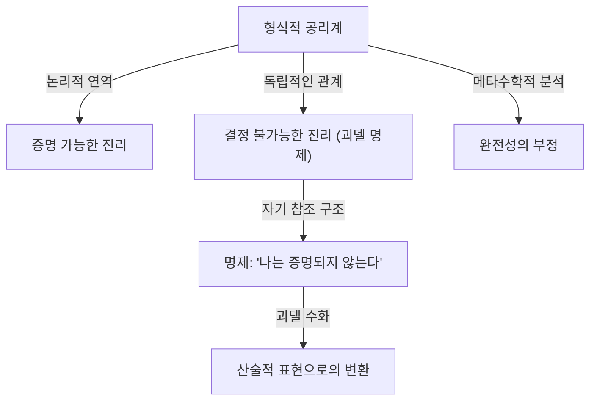

# 1. 서론: 지성의 거인과 수학의 패러다임 전환

[쿠르트 괴델](https://kenji.blog/ko/p/godel/)([Kurt Gödel](https://kenji.blog/ko/p/godel/))은 아리스토텔레스, [고트프리트 라이프니츠](https://kenji.blog/ko/p/leibniz/)와 나란히 거론되는 역사상 가장 위대한 논리학자 중 한 명입니다. 그가 1931년에 발표한 **불완전성 정리** 는 수학이라는 학문의 절대적인 기반에 내재된 한계를 밝혀내며 과학계 전체에 헤아릴 수 없는 충격을 안겨주었습니다. 이 정리는 "우리가 증명할 수 있는 것"과 "진리인 것" 사이에 피할 수 없는 괴리가 존재함을 보여주었으며, 당시 수학자들이 품고 있던 절대적 확실성에 대한 꿈을 산산조각 냈습니다.

괴델의 업적은 단순한 수학적 증명의 틀을 넘어 철학, 컴퓨터 과학, 나아가 우주론에까지 이르고 있습니다. 본 기사에서는 수학의 역사를 영원히 바꾸어 놓은 이 천재의 생애, 그가 이룩한 수학적 위업의 세부 사항, 알베르트 아인슈타인과의 깊은 우정, 그리고 그의 말년의 비극적인 결말에 이르기까지 다각적인 시점에서 그 궤적을 깊이 파헤쳐 봅니다.

# 2. 수학의 위기와 힐베르트 프로그램

괴델의 업적이 지닌 진정한 가치를 이해하기 위해서는 당시 수학계가 직면해 있던 '기초의 위기'에 대해 자세히 알아야 합니다. 19세기 말, [게오르크 칸토어](https://kenji.blog/ko/p/cantor/)가 창시한 무한 집합론은 수학에 완전히 새로운 시각과 강력한 도구를 가져다주었습니다. 하지만 동시에 ['러셀의 역설](https://kenji.blog/ko/p/ラッセルのパラドックス/)'과 같은 심각한 자기 참조의 모순을 안고 있음이 판명되었습니다.

러셀의 역설이란 "자신을 원소로 포함하지 않는 모든 집합들의 집합"을 생각할 때, 그것이 자신을 원소로 포함한다고 해도 모순이 생기고 포함하지 않는다고 해도 모순이 생기는 현상을 말합니다. 이 발견으로 인해 직관적인 추론에 크게 의존하던 당시 수학의 기반이 극도로 취약하다는 사실이 드러났습니다.

이에 대처하기 위해 독일의 위대한 수학자 [다비트 힐베르트](https://kenji.blog/ko/p/hilbert/)는 '힐베르트 프로그램'을 제창했습니다. 이는 수학의 모든 정리를 소수의 공리와 기계적인 추론 규칙으로부터 이끌어내려는 형식주의적인 접근을 목표로 한 것입니다. 최종적인 목표는 그 공리계가 절대 모순을 일으키지 않는다는 것(무모순성)과, 모든 참인 명제가 그 공리계 내에서 증명 가능하다는 것(완전성)을 유한한 단계로 수학적으로 증명하는 것이었습니다. 만약 이것이 성공한다면, 수학은 완전히 확고한 기반 위에 서게 될 것이었습니다. 당시 수학자들은 이 프로그램의 성공을 굳게 믿었으며, 수학의 완전한 형식화는 시간문제라고 생각했습니다.

# 3. 성장 배경과 빈 학파의 철학

[쿠르트 괴델](https://kenji.blog/ko/p/godel/)은 1906년 4월 28일, 오스트리아-헝가리 제국(현재 체코 공화국)의 모라비아 지방 브르노에서 태어났습니다. 어린 시절의 그는 호기심이 매우 왕성하여 모든 일에 이유를 물었기에 가족들로부터 "왜 선생님(Herr Warum)"이라는 별명으로 불렸습니다. 류머티즘 열을 앓는 등 병약했지만, 학업에서는 남다른 재능을 발휘하여 항상 최고의 성적을 거두었습니다.

1924년, 괴델은 빈 대학교에 입학합니다. 처음에는 이론물리학을 전공했지만, 필리프 푸르트벵글러의 정수론 강의에 깊은 감명을 받아 수학으로 전향했습니다. 또한 그는 철학자 모리츠 슐리크가 주도하고 루돌프 카르납 등도 참여한 '빈 학파'의 모임에도 참석하기 시작했습니다.

빈 학파는 논리 실증주의를 내세우며, 형이상학적인 명제를 무의미한 것으로 배제하고 모든 과학적 지식을 경험과 논리로 환원하려 시도했습니다. 이 환경에서의 교류는 괴델에게 논리학의 엄밀성과 중요성을 깊이 인식시키는 계기가 되었습니다. 그러나 괴델 자신은 그들의 반(反)형이상학적인 태도에 결코 동조하지 않았으며, 훗날 강한 '수학적 플라톤주의'를 품게 됩니다. 그는 수학적 대상이 인간의 정신 활동에 의해 만들어지는 것이 아니라 물리적 세계와 독립적으로 객관적으로 실재하며, 수학자들은 단지 그것을 '발견'할 뿐이라고 믿었습니다.

# 4. 1차 술어 논리의 완전성 정리

1930년, 괴델은 빈 대학교에 제출한 박사 학위 논문에서 '1차 술어 논리의 완전성 정리'를 훌륭하게 증명해 냈습니다. 1차 술어 논리란 양화사(모든, 존재하는)를 변수에 대해서만 적용할 수 있는 논리 체계입니다.

괴델은 이 논문에서 1차 술어 논리에서는 "논리적으로 항상 참인 명제(타당한 논리식)는 반드시 공리로부터 유한한 단계 내에 증명 가능하다"는 것을 보여주었습니다. 이는 힐베르트 프로그램의 부분적인 성공을 의미했으며, 논리 체계의 추론 규칙이 충분히 강력하다는 것을 보증했습니다. 많은 수학자들은 이를 발판 삼아 자연수론(산술)의 완전성도 증명할 수 있을 것이라는 큰 기대를 품었습니다. 하지만 이듬해 괴델이 발표한 논문은 그 기대를 송두리째 무너뜨리게 됩니다.

# 5. 제1불완전성 정리의 충격과 괴델 수

1931년, 괴델은 "프린키피아 마테마티카 및 관련 체계의 형식적으로 결정 불가능한 명제에 대하여"라는 논문을 발표했습니다. 여기서 제시된 것이 과학 역사상 찬란하게 빛나는 **제1불완전성 정리** 입니다.

제1불완전성 정리는 다음과 같이 서술됩니다. "자연수론을 포함하는 무모순적인 형식적 공리계에는, 참임에도 불구하고 그 체계 내에서는 증명도 반증도 할 수 없는 명제가 반드시 존재한다."

이를 수식으로 표현하면, 어떤 명제 $G$ 에 대해 다음이 성립합니다.

$$ G \iff \neg \text{Prov}( \lceil G \rceil ) $$

여기서 $\text{Prov}$ 는 "체계 내에서 증명 가능하다"는 술어를 나타내며, $\lceil G \rceil$ 은 명제 $G$ 의 괴델 수를 나타냅니다. 즉, 명제 $G$ 는 "나 자신은 이 체계 내에서 증명될 수 없다"고 자기 참조적으로 주장하고 있는 것입니다. 만약 $G$ 가 증명 가능하다면 체계는 거짓된 명제(증명할 수 없다고 주장하는 명제)를 증명한 셈이 되어 모순이 발생합니다. 따라서 체계가 무모순인 한 $G$ 는 증명 불가능하며, 스스로 주장하는 바와 일치하므로 '참'인 것입니다.

이 경이로운 정리의 증명에서 괴델은 '괴델 수화(Gödel numbering)'라는 획기적인 기법을 발명했습니다. 이는 기호, 논리식, 그리고 증명의 모든 단계를 소인수분해의 유일성을 이용하여 하나의 거대한 자연수로 변환하는 기술입니다. 이를 통해 메타수학적인 명제("어떤 논리식이 증명 가능하다" 등)를 순수한 자연수의 산술적인 성질로 다룰 수 있게 되었습니다. 논리 체계 스스로가 자신의 한계에 대해 말하게 하는(자기 참조) 이 '대각선 보조정리'는 수학 역사상 가장 아름다운 증명 기법 중 하나로 꼽힙니다.

# 6. 제2불완전성 정리와 힐베르트의 꿈의 종말

제1불완전성 정리의 직접적인 귀결로서 괴델은 더욱 강력한 **제2불완전성 정리** 를 이끌어 냈습니다. 이는 "자연수론을 포함하는 무모순적인 형식적 공리계는, 그 체계 내부에서 스스로의 무모순성을 증명할 수 없다"는 것입니다.

수식으로 표현하면 다음과 같습니다.

$$ \text{Con}(F) \implies \neg \text{Prov}( \lceil \text{Con}(F) \rceil ) $$

여기서 $\text{Con}(F)$ 는 공리계 $F$ 가 무모순임을 나타내는 논리식입니다. 만약 체계 $F$ 가 스스로의 무모순성을 증명할 수 있다면, 그 체계는 사실상 모순된 체계가 됩니다.

제2불완전성 정리는 힐베르트 프로그램에 대한 완전한 사형 선고였습니다. 수학의 무모순성을 수학 그 자체의 내부에서 증명하려던 힐베르트의 장대한 꿈은 원리적으로 불가능함이 증명된 것입니다. 수학은 자신의 기반의 안전성을 스스로의 힘으로 보증할 수 없다는 심오한 진리가 여기에 확립되었습니다.

# 7. 연속체 가설에 대한 공헌과 구성적 집합(L)

불완전성 정리 이후에도 괴델의 지적 탐구는 멈출 줄 몰랐습니다. 그는 집합론에서 오랫동안 미해결 문제로 남아 있던 힐베르트의 23가지 문제 중 제1문제인 '연속체 가설'에 도전했습니다. 칸토어가 제창한 이 가설은 "가산 무한(자연수의 개수)과 연속체(실수의 개수) 사이에는 중간 크기의 농도를 가진 집합이 존재하지 않는다"는 것입니다.

$$ 2^{\aleph_0} = \aleph_1 $$

1940년, 괴델은 '구성적 집합의 모임(L)'이라는 혁신적인 개념을 도입했습니다. 이는 기존의 집합으로부터 논리적으로 정의 가능한 원소들만을 체계적으로 모아 구성한 모델입니다. 괴델은 체르멜로-프렝켈 집합론(ZF)이 무모순이라면, 여기에 선택 공리(AC)와 일반 연속체 가설(GCH)을 추가한 체계도 무모순임을 증명했습니다. 이를 통해 연속체 가설이 현재 수학의 공리계와 모순되지 않음이 보여졌습니다. 훗날 1963년에 폴 코언이 '강제법(Forcing)'이라는 기법을 사용하여 '연속체 가설의 부정' 역시 무모순임을 증명함으로써, 연속체 가설이 ZFC와 독립적인 명제임이 완전히 확정되었습니다.

# 8. 미국으로의 망명과 아인슈타인과의 우정

1933년 아돌프 히틀러가 독일에서 정권을 장악하자, 유럽의 정치 상황은 급속도로 악화되었습니다. 1938년 나치 독일의 오스트리아 병합(안슐루스) 이후 빈 대학교의 상황도 돌변하여 괴델은 징집의 위기에 직면했습니다. 그는 아내 아델과 함께 시베리아 횡단 철도로 소련을 가로지르고 태평양을 건너 미국으로 망명하는 험난한 여정을 결행했습니다.

그가 정착한 곳은 뉴저지주 프린스턴 고등연구소(IAS)였습니다. 이곳에서 괴델은 20세기 최고의 물리학자 알베르트 아인슈타인과 깊이 교감하게 됩니다. 논리학자와 물리학자, 내성적이고 신경질적인 괴델과 명랑하고 외향적인 아인슈타인. 성격도 연구 분야도 전혀 달랐지만, 그들이 거의 매일같이 연구소로 향하는 길을 함께 걸으며 독일어로 깊이 대화하는 모습은 프린스턴의 전설이 되었습니다.

아인슈타인은 말년에 "내가 연구소에 가는 유일한 이유는 괴델과 함께 걸어서 집에 돌아갈 수 있는 특권을 얻기 위해서다"라고 말했다고 전해집니다. 두 사람은 양자역학의 불완전성, 시간의 본질, 나아가 정치와 철학에 이르기까지 깊은 토론을 나누었습니다.

# 9. 괴델 엄밀해: 시간이 역행하는 우주의 발견

아인슈타인과의 교류에 자극받아 괴델은 일반 상대성 이론 연구에 몰두했습니다. 1949년, 아인슈타인의 70세 생일에 괴델은 '괴델 우주' 또는 '괴델 엄밀해'로 불리는 아인슈타인 장 방정식의 정확한 해를 선물했습니다.

이 우주 모델은 우주 전체가 회전하고 있으며 적절한 음의 우주 상수를 가진다는 특징이 있습니다. 가장 놀라운 점은 이 우주에는 "닫힌 시간 곡선(Closed Timelike Curves)"이 존재한다는 것입니다. 즉, 이론상 물질이 빛의 속도를 초과하지 않고도 과거로의 시간 여행이 가능하다는 것을 수학적으로 증명해 낸 것입니다.

아인슈타인 자신도 자신의 이론이 과거로의 시간 여행을 허용한다는 사실에 당혹감과 충격을 감추지 못했지만, 괴델의 수학적 추론은 완벽했습니다. 괴델은 이 결과로부터 "시간이라는 개념은 객관적인 물리적 실재가 아니라 인간의 주관적인 환상에 불과하다"는 철학적 결론을 이끌어내며 칸트의 관념론을 물리학적으로 옹호했습니다.

# 10. 철학과 신의 존재에 대한 존재론적 증명

괴델은 순수한 수학자인 동시에 깊은 사색을 하는 철학자이기도 했습니다. 그는 앞서 언급한 플라톤주의를 굳게 지지했으며, [고트프리트 라이프니츠](https://kenji.blog/ko/p/leibniz/)의 철학에 깊이 심취해 있었습니다. 그는 세계가 완전히 논리적이고 이성적으로 구성되어 있으며 우연이란 존재하지 않는다고 믿었습니다.

그의 철학적 탐구의 정점 중 하나가 '신의 존재 증명(존재론적 증명)'을 논리적으로 정식화한 것입니다. 괴델은 양상 논리(필연성과 가능성을 다루는 논리)를 이용하여 안셀무스나 라이프니츠가 시도했던 신의 증명을 엄밀한 수학적 포맷으로 재구성했습니다. 그는 '긍정적인 속성(Positive properties)'이라는 개념을 공리화하여, 모든 긍정적인 속성을 지닌 존재(신)가 가능한 세계에 존재한다면, 그것은 필연적인 세계에서도 반드시 실재함을 수학적으로 증명하려 시도했습니다.

이 증명은 다음과 같은 양상 논리 수식을 포함합니다.

$$ P( \text{God} ) \implies \Box \exists x \; \text{God}(x) $$

여기서 $\Box$ 는 "필연적으로 참이다"라는 것을 나타냅니다. 그는 생전에 이 증명을 개인 노트에만 남겨두고 발표하지 않았으나, 그의 사후에 발견되어 논리학과 신학의 교차점에서 엄청난 논쟁을 불러일으켰습니다.

# 11. 튜링과 컴퓨터 과학에 남긴 유산

[괴델의 불완전성 정리](https://kenji.blog/ko/p/godels-incompleteness-theorems/)와 괴델 수화의 아이디어는 계산 이론의 탄생에 직접적이고 심대한 영향을 미쳤습니다. 영국의 수학자 [앨런 튜링](https://kenji.blog/ko/p/turing/)은 괴델의 논리를 응용하여 '튜링 기계'라는 추상적인 계산 모델을 고안해 냈으며, 알고리즘에 의해 풀 수 없는 문제(정지 문제)가 존재함을 증명했습니다. 비슷한 시기에 알론조 처치도 람다 대수를 사용하여 유사한 결론에 도달했습니다.

오늘날 괴델의 정리는 인공지능(AI)의 한계에 관한 논의에서도 빈번하게 인용됩니다. 물리학자 로저 펜로즈는 "기계(AI)는 알고리즘을 따르기 때문에 불완전성 정리의 제약을 받지만, 인간의 직관은 진리를 꿰뚫어 볼 수 있으므로 인간의 의식은 계산 불가능한 과정에 기반하고 있다"는 '펜로즈-괴델 논법'을 제창했습니다. AI가 진정한 의미에서 인간의 지성을 넘어설 수 있을 것인가 하는 이 논쟁은 오늘날까지도 격렬한 토론을 촉발하고 있습니다.

# 12. 말년의 편집증과 비극적인 최후

유례없이 뛰어난 논리적 지성을 지녔음에도 불구하고 괴델의 정신은 매우 섬세하고 연약했습니다. 그는 평생 동안 심각한 건강염려증과 편집증(파라노이아)에 시달렸습니다. 특히 말년이 되자 "누군가 나를 독살하려 한다"는 강박관념에 시달리게 되었습니다.

그는 자신이 절대적으로 신뢰하는 아내 아델이 조리하고 직접 기미를 한 음식 외에는 일절 입에 대지 않았습니다. 그러나 1977년 후반, 아델이 중병으로 장기간 입원하게 되면서 괴델의 식사를 챙겨줄 사람이 없어지고 말았습니다. 독살의 공포에 마비된 그는 모든 식사를 거부했고, 결국 1978년 1월 14일 프린스턴 병원의 침대에서 세상을 떠났습니다.

공식적인 사인은 "성격 장애로 인한 영양실조와 굶주림"이었습니다. 사망 당시 그의 체중은 약 29kg에 불과했다고 합니다. 인류 역사상 최고의 논리적 지성은 가장 비논리적인 공포에 의해 그 생명을 빼앗기는 너무나도 비극적인 결말을 맞이했습니다.

# 13. 결론: 영원한 진리의 탐구자

[쿠르트 괴델](https://kenji.blog/ko/p/godel/)은 지성의 한계 자체를 수학적으로 증명한다는 궁극의 역설을 이뤄낸 기이한 천재였습니다. 그는 우리가 "모든 것을 논리적으로 샅샅이 증명할 수는 없다"는 심오한 진리를 제시함으로써 역설적으로 인간 지식의 세계에 무한한 확장을 부여했습니다.

수학, 논리학, 철학, 물리학, 그리고 컴퓨터 과학을 넘나드는 그의 업적은 분야의 장벽을 넘어 현대 과학의 기반이 되었습니다. 인류가 지식의 탐구를 계속하는 한, 우주의 진리와 논리의 심연을 끊임없이 응시했던 괴델이 남긴 찬란한 빛은 영원히 그 빛을 잃지 않을 것입니다.
