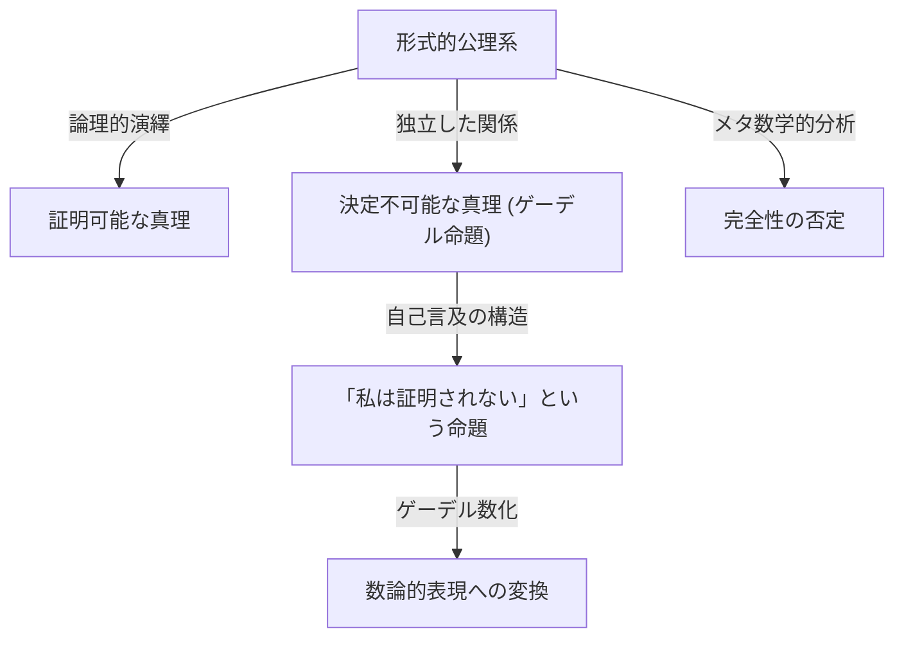

# 1. 序論：知の巨星と数学のパラダイムシフト

[クルト・ゲーデル](https://kenji.blog/p/godel/)（[Kurt Gödel](https://kenji.blog/p/godel/)）は、アリストテレスやゴットフリート・[ライプニッツ](https://kenji.blog/p/leibniz/)と並び称される、歴史上最も偉大な論理学者の一人です。彼が1931年に発表した **[不完全性定理](https://kenji.blog/p/godels-incompleteness-theorems/)** は、数学という学問の絶対的な基盤に潜む限界を明らかにし、科学全体に計り知れない衝撃を与えました。この定理は「私たちが証明できること」と「真理であること」の間に不可避のズレが存在することを示し、当時の数学者たちが抱いていた絶対的な確実性への夢を打ち砕きました。

[ゲーデル](https://kenji.blog/p/godel/)の業績は、単なる数学的証明の枠を超え、哲学、計算機科学、さらには宇宙論にまで及んでいます。本記事では、数学の歴史を永遠に変えてしまったこの天才の生涯、彼が成し遂げた数学的偉業の詳細、アルベルト・アインシュタインとの深い友情、そして彼の晩年における悲劇的な結末に至るまで、多角的な視点からその軌跡を深く掘り下げてたどります。

# 2. 数学の危機と[ヒルベルト](https://kenji.blog/p/hilbert/)・プログラム

[ゲーデル](https://kenji.blog/p/godel/)の業績の真の価値を理解するためには、当時の数学界が直面していた「基礎の危機」について詳細に知る必要があります。19世紀末、[ゲオルク・カントール](https://kenji.blog/p/cantor/)によって創始された無限集合論は、数学に全く新たな視点と強力な道具をもたらしました。しかし同時に、「ラッセルのパラドックス」のような深刻な自己言及の矛盾を抱えていることが判明しました。

ラッセルのパラドックスとは、「自分自身を要素として含まないような集合すべての集合」を考えたとき、それが自分自身を要素として含むとしても含まないとしても矛盾が生じるというものです。この発見により、直感的な推論に頼っていた当時の数学の基盤が極めて脆弱であることが露呈しました。

これに対処するため、ドイツの偉大な数学者[ダフィット・ヒルベルト](https://kenji.blog/p/hilbert/)は「[ヒルベルト](https://kenji.blog/p/hilbert/)・プログラム」を提唱しました。これは、数学のすべての定理を少数の公理と機械的な推論規則から導き出す形式主義的なアプローチを目指すものでした。最終的な目標は、その公理系が絶対に矛盾を引き起こさないこと（無矛盾性）と、あらゆる真なる命題がその公理系内で証明可能であること（完全性）を、有限のステップで数学的に証明することでした。もしこれが成功すれば、数学は完全に確固たる基盤の上に立つことになります。当時の数学者たちは、このプログラムの成功を信じて疑わず、数学の完全な形式化は時間の問題であると考えていました。

# 3. 生い立ちとウィーン学団の哲学

[クルト・ゲーデル](https://kenji.blog/p/godel/)は1906年4月28日、オーストリア＝ハンガリー帝国（現在のチェコ共和国）のモラヴィア地方ブルノで生まれました。幼少期の彼は非常に好奇心旺盛であり、あらゆる物事の理由を尋ねることから、家族からは「なぜさん（Herr Warum）」というあだ名で呼ばれていました。彼はリウマチ熱を患うなど病弱ではありましたが、学業においては並外れた才能を発揮し、常にトップの成績を収めていました。

1924年、[ゲーデル](https://kenji.blog/p/godel/)はウィーン大学に入学します。当初は理論物理学を専攻していましたが、フィリップ・フルトヴェングラーの数論の講義に感銘を受け、数学へと転向しました。また、彼は哲学者モーリッツ・シュリックが主宰し、ルドルフ・カルナップらも参加する「ウィーン学団」の会合にも参加するようになりました。

ウィーン学団は論理実証主義を掲げ、形而上学的な命題を無意味なものとして排除し、すべての科学的知識を経験と論理に還元しようと試みていました。この環境での交流は、[ゲーデル](https://kenji.blog/p/godel/)に論理学の厳密性と重要性を深く認識させる契機となりました。しかし、[ゲーデル](https://kenji.blog/p/godel/)自身は彼らの反形而上学的な姿勢には決して賛同せず、後に強い「数学的プラトニズム」を抱くようになります。彼は、数学的対象は人間の精神活動によって作られるのではなく、物理的世界とは独立して客観的に実在し、数学者はそれを「発見」するのだと信じていました。

# 4. 第一階述語論理の完全性定理

1930年、[ゲーデル](https://kenji.blog/p/godel/)はウィーン大学に提出した学位論文において、「第一階述語論理の完全性定理」を見事に証明しました。第一階述語論理とは、量化子（すべての、存在する）を変数に対してのみ適用できる論理体系です。

[ゲーデル](https://kenji.blog/p/godel/)はこの論文で、第一階述語論理においては「論理的に常に真である命題（妥当な論理式）は、必ず公理から有限回のステップで証明可能である」ということを示しました。これは[ヒルベルト](https://kenji.blog/p/hilbert/)・プログラムの一部の成功を意味し、論理体系の推論規則が十分に強力であることを保証するものでした。多くの数学者は、これを足がかりとして自然数論（算術）の完全性も証明できると期待を膨らませました。しかし、翌年に[ゲーデル](https://kenji.blog/p/godel/)が発表した論文は、その期待を根底から打ち砕くことになります。

# 5. 第一[不完全性定理](https://kenji.blog/p/godels-incompleteness-theorems/)の衝撃と[ゲーデル](https://kenji.blog/p/godel/)数

1931年、[ゲーデル](https://kenji.blog/p/godel/)は「プリンキピア・マテマティカおよび関連する諸体系の形式的に決定不可能な命題について」という論文を発表しました。ここで示されたのが、科学史上に燦然と輝く **第一[不完全性定理](https://kenji.blog/p/godels-incompleteness-theorems/)** です。

第一[不完全性定理](https://kenji.blog/p/godels-incompleteness-theorems/)は、次のように述べられます。「自然数論を含む無矛盾な形式的公理系には、真であるにもかかわらず、その体系内では証明も反証もできない命題が必ず存在する。」

これを数式として表現すると、ある命題 $G$ に対して以下が成り立ちます。

$$ G \iff \neg \text{Prov}( \lceil G \rceil ) $$

ここで、 $\text{Prov}$ は「体系内で証明可能である」という述語を表し、 $\lceil G \rceil$ は命題 $G$ の[ゲーデル](https://kenji.blog/p/godel/)数を示します。つまり、命題 $G$ は「私自身はこの体系内で証明できない」と自己言及的に主張しているのです。もし $G$ が証明可能なら、体系は「証明できない」と主張する偽の命題を証明したことになり、矛盾が生じます。したがって、体系が無矛盾である限り、$G$ は証明不可能であり、かつその主張通りであるため「真」なのです。

この驚異的な定理の証明において、[ゲーデル](https://kenji.blog/p/godel/)は「[ゲーデル](https://kenji.blog/p/godel/)数化（Gödel numbering）」という画期的な手法を発明しました。これは、記号、論理式、そして証明のステップ全体を、素因数分解の一意性を利用して一つの巨大な自然数に変換する技術です。これにより、メタ数学的な命題（「ある論理式が証明可能である」など）を、純粋な自然数の算術的な性質として扱うことが可能になりました。論理体系自身に自らの限界について語らせるこの「自己言及の補題（対角線論法）」は、数学の歴史において最も美しい証明技法の一つとされています。

# 6. 第二[不完全性定理](https://kenji.blog/p/godels-incompleteness-theorems/)と[ヒルベルト](https://kenji.blog/p/hilbert/)の夢の終わり

第一[不完全性定理](https://kenji.blog/p/godels-incompleteness-theorems/)の直接的な帰結として、[ゲーデル](https://kenji.blog/p/godel/)はさらに強力な **第二[不完全性定理](https://kenji.blog/p/godels-incompleteness-theorems/)** を導き出しました。これは、「自然数論を含む無矛盾な形式的公理系は、それ自身の無矛盾性をその体系内で証明することはできない」というものです。

数式で表すと以下のようになります。

$$ \text{Con}(F) \implies \neg \text{Prov}( \lceil \text{Con}(F) \rceil ) $$

ここで、 $\text{Con}(F)$ は公理系 $F$ が無矛盾であることを表す論理式です。もし体系 $F$ が自らの無矛盾性を証明できるなら、その体系は実は矛盾していることになります。

第二[不完全性定理](https://kenji.blog/p/godels-incompleteness-theorems/)は、[ヒルベルト](https://kenji.blog/p/hilbert/)・プログラムに対する完全な死刑宣告でした。数学の無矛盾性を、その数学自身の内部で証明するという[ヒルベルト](https://kenji.blog/p/hilbert/)の壮大な夢は、原理的に不可能であることが証明されたのです。数学は、自らの基盤の安全性を自らの力で保証することができないという深遠な真理が、ここに確立されました。

# 7. 連続体仮説への貢献と構成的集合 (L)

[不完全性定理](https://kenji.blog/p/godels-incompleteness-theorems/)の後も、[ゲーデル](https://kenji.blog/p/godel/)の知的探求は止まることを知りませんでした。彼は集合論において長年の未解決問題であり、[ヒルベルト](https://kenji.blog/p/hilbert/)の23の問題の第1問題でもあった「連続体仮説」に挑みました。カントールが提唱したこの仮説は、「可算無限（自然数の個数）と連続体（実数の個数）の間には、中間の濃さを持つ集合が存在しない」というものです。

$$ 2^{\aleph_0} = \aleph_1 $$

1940年、[ゲーデル](https://kenji.blog/p/godel/)は「構成的集合のクラス (L)」という革新的な概念を導入しました。これは、既存の集合から論理的に定義可能な要素のみを段階的に集めていくことで構築されるモデルです。[ゲーデル](https://kenji.blog/p/godel/)は、ツェルメロ＝フレンケル集合論（ZF）が無矛盾であれば、そこに[選択公理](https://kenji.blog/p/axiom-of-choice-and-zorns-lemma/)（AC）と一般連続体仮説（GCH）を付加した体系も無矛盾であることを証明しました。これにより、連続体仮説が現在の数学の公理系と相反するものではないことが示されました。のちに1963年、ポール・コーエンが強制法（Forcing）という手法を用いて「連続体仮説の否定」も無矛盾であることを証明し、連続体仮説がZFCから独立した命題であることが完全に確定しました。

# 8. アメリカへの亡命とアインシュタインとの友情

1933年にアドルフ・ヒトラーがドイツで政権を掌握すると、ヨーロッパの政治状況は急速に悪化しました。1938年のナチス・ドイツによるオーストリア併合（アンシュルス）後、ウィーン大学の状況も一変し、[ゲーデル](https://kenji.blog/p/godel/)は徴兵の危機に直面しました。彼は妻のアデルと共に、シベリア鉄道でソ連を横断し、太平洋を経てアメリカへ亡命するという困難な旅を決行しました。

彼が定住したのは、ニュージャージー州のプリンストン高等研究所でした。ここで[ゲーデル](https://kenji.blog/p/godel/)は、20世紀最大の物理学者であるアルベルト・アインシュタインと深く心を通わせるようになります。論理学者と物理学者、内向的で神経質な[ゲーデル](https://kenji.blog/p/godel/)と、陽気で外交的なアインシュタイン。性格も研究分野も全く異なる二人でしたが、彼らが毎日のように研究所への道を共に歩き、ドイツ語で語り合う姿はプリンストンの伝説となりました。

アインシュタインは晩年、「私が研究所に足を運ぶ唯一の理由は、[ゲーデル](https://kenji.blog/p/godel/)と一緒に歩いて帰るという特権を得るためだ」と語ったと言われています。二人は、量子力学の不完全性や時間の本質、さらには政治や哲学について、深い議論を交わしました。

# 9. [ゲーデル](https://kenji.blog/p/godel/)解：時間が逆行する宇宙の発見

アインシュタインとの交流に触発され、[ゲーデル](https://kenji.blog/p/godel/)は一般相対性理論の研究に没頭しました。1949年、アインシュタインの70歳の誕生日に、[ゲーデル](https://kenji.blog/p/godel/)は「[ゲーデル](https://kenji.blog/p/godel/)解」と呼ばれるアインシュタイン方程式の厳密解をプレゼントしました。

この宇宙モデルは、宇宙全体が回転しており、適切な負の宇宙項を持つという特徴があります。最も驚くべき点は、この宇宙では「閉じた時間的曲線（Closed Timelike Curves）」が存在することです。すなわち、理論上、物質が光速を超えることなく過去へのタイムトラベルが可能になることを数学的に証明したのです。

アインシュタイン自身、自分の理論が過去へのタイムトラベルを許容することに戸惑いと衝撃を隠せませんでしたが、[ゲーデル](https://kenji.blog/p/godel/)の数学的推論は完璧でした。[ゲーデル](https://kenji.blog/p/godel/)はこの結果から、「時間という概念は客観的な物理的実在ではなく、人間の主観的な錯覚に過ぎない」という哲学的な結論を引き出し、カントの観念論を物理学的に擁護しました。

# 10. 哲学と神の存在の本体論的証明

[ゲーデル](https://kenji.blog/p/godel/)は純粋な数学者であると同時に、深い思索を行う哲学者でもありました。彼は前述のプラトニズムを強固に支持し、ゴットフリート・[ライプニッツ](https://kenji.blog/p/leibniz/)の哲学に深く傾倒していました。彼は、世界は完全に論理的かつ理性的に構成されており、偶然は存在しないと信じていました。

彼の哲学的な探求の頂点の一つが、「神の存在証明（本体論的証明）」の論理学的な定式化です。[ゲーデル](https://kenji.blog/p/godel/)は様相論理（必然性や可能性を扱う論理）を用いて、アンセルムスや[ライプニッツ](https://kenji.blog/p/leibniz/)が試みた神の証明を、厳密な数学的フォーマットで再構築しました。彼は「肯定的な性質 (Positive properties)」という概念を公理化し、すべての肯定的な性質を併せ持つ存在（神）が、可能世界において存在すれば、それは必然的な世界においても実在することを数学的に証明しようと試みました。

この証明は以下の様相論理の式を含みます。

$$ P( \text{God} ) \implies \Box \exists x \; \text{God}(x) $$

ここで $\Box$ は「必然的に真である」ことを示します。彼は生前、この証明を個人的なノートに留め、公表することはありませんでしたが、彼の死後に発見され、論理学と神学の交差点として大きな議論を呼びました。

# 11. [チューリング](https://kenji.blog/p/turing/)と計算機科学への遺産

[ゲーデルの不完全性定理](https://kenji.blog/p/godels-incompleteness-theorems/)と[ゲーデル](https://kenji.blog/p/godel/)数化のアイデアは、計算理論の誕生に直接的な影響を与えました。イギリスの数学者[アラン・チューリング](https://kenji.blog/p/turing/)は、[ゲーデル](https://kenji.blog/p/godel/)の論理を応用して「[チューリング](https://kenji.blog/p/turing/)マシン」という抽象的な計算モデルを考案し、アルゴリズムによって解けない問題（停止問題）が存在することを証明しました。同時期にアロンゾ・チャーチもラムダ計算を用いて同様の結論に達しました。

今日、[ゲーデル](https://kenji.blog/p/godel/)の定理は人工知能（AI）の限界に関する議論でも頻繁に引用されます。物理学者のロジャー・ペンローズは、「機械（AI）はアルゴリズムに従うため[不完全性定理](https://kenji.blog/p/godels-incompleteness-theorems/)の制約を受けるが、人間の直感は真理を見抜くことができるため、人間の意識は計算不能なプロセスに基づいている」という「ペンローズ・[ゲーデル](https://kenji.blog/p/godel/)論法」を提唱し、AIが真の意味で人間の知性を超えられるかという論争に火をつけました。

# 12. 晩年のパラノイアと悲劇的な最期

並外れた論理的知性を持つ一方で、[ゲーデル](https://kenji.blog/p/godel/)の精神は非常に繊細で脆いものでした。彼は生涯にわたって重度の心気症やパラノイア（偏執病）に悩まされていました。特に晩年になると、「誰かに毒殺されるのではないか」という強迫観念に苛まれるようになりました。

彼は、自分が絶対的に信頼する妻のアデルが調理し、彼女自身が毒見をした食事以外は一切口にしませんでした。しかし1977年後半、アデルが重い病気で長期間入院することになり、[ゲーデル](https://kenji.blog/p/godel/)の食事を世話する人がいなくなってしまいました。毒殺の恐怖から彼は一切の食事を拒絶し、1978年1月14日、プリンストン病院のベッドでこの世を去りました。

死因は「パーソナリティ障害による栄養失調と飢餓」であり、死亡時の体重は約29kgしかなかったと言われています。人類史上最高の論理的知性は、最も非論理的な恐怖によってその命を奪われるという、あまりにも悲劇的な結末を迎えました。

# 13. 結論：永遠の真理の探求者

[クルト・ゲーデル](https://kenji.blog/p/godel/)は、知性の限界を数学的に証明するという究極のパラドックスを成し遂げた特異な天才でした。彼は、私たちが「すべてを論理的に証明し尽くすことはできない」という深遠な真理を提示することで、逆に人間の知識の世界に無限の広がりを与えました。

数学、論理学、哲学、物理学、そして計算機科学にまたがる彼の業績は、分野の垣根を越えて現代科学の基盤となっています。人類が知の探求を続ける限り、宇宙の真理と論理の深淵を見つめ続けた[ゲーデル](https://kenji.blog/p/godel/)の残した光芒は、永遠にその輝きを失うことはないでしょう。
