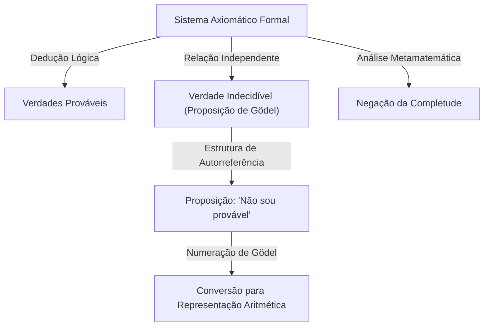

# 1. Introdução: Um Gigante do Intelecto e a Mudança de Paradigma na Matemática

[Kurt Gödel](https://kenji.blog/p/godel/) é um dos maiores lógicos da história, frequentemente classificado ao lado de Aristóteles e [Gottfried Leibniz](https://kenji.blog/p/leibniz/). Os **Teoremas da Incompletude** que ele publicou em 1931 revelaram as limitações inerentes aos fundamentos absolutos da matemática, causando um impacto incomensurável em toda a ciência. Este teorema demonstrou uma lacuna inevitável entre "o que podemos provar" e "o que é verdade", destruindo o sonho de certeza absoluta mantido pelos matemáticos da época.

As conquistas de Gödel vão muito além de meras provas matemáticas, alcançando a filosofia, a ciência da computação e até a cosmologia. Neste artigo, aprofundamo-nos na trajetória desse gênio que mudou para sempre a história da matemática, explorando os detalhes de suas façanhas matemáticas, sua profunda amizade com Albert Einstein e a conclusão trágica de seus últimos anos a partir de múltiplas perspectivas.

# 2. A Crise na Matemática e o Programa de Hilbert

Para apreciar verdadeiramente o valor do trabalho de Gödel, é necessário entender em detalhes a "crise de fundamentos" que o mundo matemático enfrentava na época. No final do século XIX, a teoria dos conjuntos infinitos, fundada por [Georg Cantor](https://kenji.blog/p/cantor/), trouxe perspectivas inteiramente novas e ferramentas poderosas para a matemática. No entanto, logo se descobriu que ela abrigava graves paradoxos de autorreferência, como o "Paradoxo de Russell".

O Paradoxo de Russell considera "o conjunto de todos os conjuntos que não contêm a si mesmos como membros". Se este conjunto contiver a si mesmo, ele contradiz sua própria definição; se ele não contiver a si mesmo, ele deve, por definição, ser um membro de si mesmo, levando novamente a uma contradição. Essa descoberta expôs a extrema fragilidade dos fundamentos matemáticos da época, que dependiam muito do raciocínio intuitivo.

Para resolver isso, o grande matemático alemão [David Hilbert](https://kenji.blog/p/hilbert/) propôs o "Programa de Hilbert". Isso visava uma abordagem formalista para derivar todos os teoremas matemáticos de um pequeno conjunto de axiomas e regras mecânicas de inferência. O objetivo final era provar matematicamente, em um número finito de passos, que o sistema de axiomas absolutamente nunca levaria a uma contradição (consistência) e que toda proposição verdadeira poderia ser provada dentro desse sistema (completude). Se bem-sucedida, a matemática estaria em uma base perfeitamente sólida. Os matemáticos da época acreditavam firmemente no sucesso deste programa, considerando a formalização completa da matemática como apenas uma questão de tempo.

# 3. Início da Vida e a Filosofia do Círculo de Viena

[Kurt Gödel](https://kenji.blog/p/godel/) nasceu em 28 de abril de 1906, em Brünn, Morávia (hoje Brno, República Tcheca), no Império Austro-Húngaro. Quando criança, ele era extremamente curioso, constantemente perguntando as razões de tudo, o que lhe rendeu o apelido de "Senhor Porquê" (Herr Warum) de sua família. Embora fosse doentio, tendo sofrido de febre reumática, demonstrou talento extraordinário em seus estudos e obteve consistentemente as melhores notas.

Em 1924, Gödel ingressou na Universidade de Viena. Ele inicialmente se especializou em física teórica, mas ficou profundamente comovido com as palestras de Philipp Furtwängler sobre a teoria dos números e mudou para a matemática. Ele também começou a frequentar as reuniões do "Círculo de Viena", liderado pelo filósofo Moritz Schlick e que incluía membros como Rudolf Carnap.

O Círculo de Viena defendia o positivismo lógico, buscando descartar as proposições metafísicas como sem sentido e reduzir todo o conhecimento científico à experiência e à lógica. Interagir nesse ambiente deu a Gödel uma profunda apreciação pelo rigor e a importância da lógica. No entanto, o próprio Gödel nunca concordou com sua postura antimetafísica, desenvolvendo mais tarde uma forte crença no "platonismo matemático". Ele acreditava que os objetos matemáticos não são criados pela atividade mental humana, mas existem objetiva e independentemente do mundo físico, e que os matemáticos meramente os "descobrem".

# 4. O Teorema da Completude da Lógica de Primeira Ordem

Em 1930, em sua tese de doutorado apresentada à Universidade de Viena, Gödel provou brilhantemente o "Teorema da Completude da Lógica de Primeira Ordem". A lógica de primeira ordem é um sistema lógico no qual os quantificadores (para todo, existe) só podem ser aplicados a variáveis, não a predicados.

Neste artigo, Gödel mostrou que na lógica de primeira ordem, "uma proposição que é logicamente sempre verdadeira (uma fórmula lógica válida) pode ser necessariamente provada a partir dos axiomas em um número finito de passos". Isso significou um sucesso parcial do Programa de Hilbert, garantindo que as regras de inferência do sistema lógico eram suficientemente poderosas. Muitos matemáticos tinham grandes esperanças de que isso pudesse servir como um trampolim para provar também a completude da teoria dos números (aritmética). No entanto, o artigo que Gödel publicou no ano seguinte destruiria completamente essas expectativas.

# 5. O Choque do Primeiro Teorema da Incompletude e a Numeração de Gödel

Em 1931, Gödel publicou o artigo "Sobre Proposições Formalmente Indecidíveis dos Principia Mathematica e Sistemas Correlatos I". Este artigo apresentou o **Primeiro Teorema da Incompletude**, que brilha intensamente na história da ciência.

O Primeiro Teorema da Incompletude pode ser enunciado da seguinte forma: "Em qualquer sistema axiomático formal consistente capaz de expressar a aritmética elementar, existem sempre proposições que são verdadeiras, mas não podem ser provadas nem refutadas dentro do sistema."

Expresso matematicamente, para uma certa proposição $G$, vale o seguinte:

$$ G \iff \neg \text{Prov}( \lceil G \rceil ) $$

Aqui, $\text{Prov}$ representa o predicado "é provável dentro do sistema", e $\lceil G \rceil$ denota o número de Gödel da proposição $G$. Em outras palavras, a proposição $G$ afirma autorreferencialmente: "Eu mesma não posso ser provada neste sistema". Se $G$ fosse provável, o sistema teria provado uma proposição falsa (que afirma não ser provável), resultando em uma contradição. Portanto, enquanto o sistema for consistente, $G$ é improvável e, como é exatamente o que afirma ser, é "verdadeira".

Para provar este teorema surpreendente, Gödel inventou uma técnica inovadora conhecida como "numeração de Gödel". Este é um método de converter símbolos, fórmulas lógicas e provas inteiras passo a passo em um único número natural massivo, utilizando a exclusividade da fatoração de primos. Isso permitiu que as proposições metamatemáticas (como "uma certa fórmula lógica é provável") fossem tratadas como propriedades puramente aritméticas de números naturais. Este "Lema Diagonal", que permitiu a um sistema lógico falar sobre seus próprios limites (autorreferência), é considerado uma das técnicas de prova mais belas da história da matemática.

# 6. O Segundo Teorema da Incompletude e o Fim do Sonho de Hilbert

Como consequência direta do Primeiro Teorema da Incompletude, Gödel derivou o ainda mais poderoso **Segundo Teorema da Incompletude**. Este afirma: "Um sistema axiomático formal consistente capaz de expressar a aritmética não pode provar sua própria consistência dentro de si mesmo."

Expresso matematicamente, é o seguinte:

$$ \text{Con}(F) \implies \neg \text{Prov}( \lceil \text{Con}(F) \rceil ) $$

Aqui, $\text{Con}(F)$ é uma fórmula lógica que representa que o sistema de axiomas $F$ é consistente. Se o sistema $F$ pudesse provar sua própria consistência, o sistema seria na verdade inconsistente.

O Segundo Teorema da Incompletude foi uma sentença de morte absoluta para o Programa de Hilbert. O grande sonho de Hilbert de provar a consistência da matemática inteiramente dentro da própria matemática provou ser impossível em princípio. Uma verdade profunda foi estabelecida aqui: a matemática não pode garantir a segurança de seus próprios fundamentos por seu próprio poder.

# 7. Contribuições para a Hipótese do Contínuo e o Universo Construtível (L)

Mesmo depois dos teoremas da incompletude, a busca intelectual de Gödel não parou. Ele enfrentou a "Hipótese do Contínuo", um problema não resolvido de longa data na teoria dos conjuntos e o primeiro dos 23 problemas de Hilbert. Proposta por Cantor, essa hipótese postula que "não existe um conjunto cuja cardinalidade esteja estritamente entre a dos números inteiros (infinidade contável) e a dos números reais (o contínuo)".

$$ 2^{\aleph_0} = \aleph_1 $$

Em 1940, Gödel introduziu o conceito revolucionário do "universo construtível (L)". Este é um modelo construído pela coleta sistemática apenas daqueles elementos que podem ser logicamente definidos a partir de conjuntos existentes. Gödel provou que se a teoria dos conjuntos de Zermelo-Fraenkel (ZF) é consistente, então o sistema obtido adicionando o Axioma da Escolha (AC) e a Hipótese do Contínuo Generalizada (GCH) a ele também é consistente. Isso mostrou que a hipótese do contínuo não contradiz os axiomas atuais da matemática. Mais tarde, em 1963, Paul Cohen usou uma técnica chamada "forcing" para provar que a "negação da hipótese do contínuo" também é consistente, estabelecendo definitivamente que a hipótese do contínuo é uma proposição independente de ZFC.

# 8. Exílio para a América e Amizade com Einstein

Quando Adolf Hitler tomou o poder na Alemanha em 1933, a situação política na Europa deteriorou-se rapidamente. Após a anexação da Áustria (Anschluss) pela Alemanha nazista em 1938, a situação na Universidade de Viena transformou-se completamente, e Gödel enfrentou a ameaça iminente de conscrição. Juntamente com sua esposa Adele, ele empreendeu uma jornada exaustiva, cruzando a União Soviética através da Ferrovia Transiberiana e atravessando o Oceano Pacífico para buscar asilo nos Estados Unidos.

Ele se estabeleceu no Instituto de Estudos Avançados (IAS) em Princeton, Nova Jersey. Foi aqui que Gödel desenvolveu um vínculo profundo e intelectual com Albert Einstein, o maior físico do século XX. Um lógico e um físico, o introvertido e neurótico Gödel, e o alegre e extrovertido Einstein. Embora suas personalidades e campos de pesquisa fossem muito diferentes, eles se tornaram uma visão lendária em Princeton, caminhando juntos para o Instituto quase todos os dias, conversando profundamente em alemão.

Em seus últimos anos, Einstein era conhecido por observar: "Vou ao Instituto apenas pelo privilégio de caminhar para casa com Gödel". Os dois travaram discussões profundas sobre a incompletude da mecânica quântica, a natureza fundamental do tempo, bem como sobre política e filosofia.

# 9. A Métrica de Gödel: A Descoberta de um Universo com Tempo Retroativo

Inspirado por suas interações com Einstein, Gödel mergulhou no estudo da relatividade geral. Em 1949, no aniversário de 70 anos de Einstein, Gödel o presenteou com uma solução exata para as equações de campo de Einstein, que ficou conhecida como a "métrica de Gödel" ou o universo de Gödel.

Este modelo cosmológico descreve um universo que está girando como um todo e possui uma constante cosmológica negativa apropriada. A característica mais surpreendente é que neste universo, existem "curvas temporais fechadas". Ou seja, ele provou matematicamente que viajar no tempo para o passado é teoricamente possível sem que a matéria exceda a velocidade da luz.

O próprio Einstein não conseguiu esconder sua perplexidade e choque pelo fato de sua própria teoria permitir viajar no tempo para o passado, mas o raciocínio matemático de Gödel era impecável. A partir desse resultado, Gödel tirou a conclusão filosófica de que "o conceito de tempo não é uma realidade física objetiva, mas meramente uma ilusão humana subjetiva", oferecendo assim uma defesa do idealismo kantiano baseada na física.

# 10. Filosofia e a Prova Ontológica da Existência de Deus

Gödel não foi apenas um matemático puro, mas também um pensador filosófico profundo. Ele apoiou fortemente o platonismo, como mencionado anteriormente, e era profundamente devoto à filosofia de [Gottfried Leibniz](https://kenji.blog/p/leibniz/). Ele acreditava que o mundo é construído de forma completamente lógica e racional, e que não existem coincidências.

Um dos pináculos de sua exploração filosófica foi a formalização da "Prova Ontológica da Existência de Deus" em termos lógicos. Usando a lógica modal (uma lógica que lida com necessidade e possibilidade), Gödel reconstruiu estritamente as provas de Deus tentadas por Anselmo e Leibniz em um formato matemático. Ele axiomatizou o conceito de "propriedades positivas" e tentou provar matematicamente que um ser que possui todas as propriedades positivas (Deus), se existir em um mundo possível, deve necessariamente existir em todos os mundos necessários.

A prova inclui fórmulas na lógica modal, tais como:

$$ P( \text{God} ) \implies \Box \exists x \; \text{God}(x) $$

Aqui, $\Box$ denota "é necessariamente verdade que". Durante sua vida, ele manteve esta prova em seus cadernos pessoais e nunca a publicou, mas ela foi descoberta após sua morte e provocou um debate massivo na interseção da lógica e da teologia.

# 11. O Legado para Turing e a Ciência da Computação

Os teoremas da incompletude de Gödel e a ideia de numeração de Gödel tiveram um impacto direto e profundo no nascimento da teoria da computação. O matemático britânico [Alan Turing](https://kenji.blog/p/turing/) aplicou a lógica de Gödel para conceber um modelo computacional abstrato conhecido como "Máquina de Turing", e provou que existem problemas que não podem ser resolvidos por nenhum algoritmo (o Problema da Parada). Mais ou menos na mesma época, Alonzo Church chegou a uma conclusão semelhante usando o cálculo lambda.

Hoje, os teoremas de Gödel também são frequentemente citados em debates sobre os limites da inteligência artificial (IA). O físico Roger Penrose propôs o "argumento de Penrose-Gödel", argumentando que "embora as máquinas (IA) sigam algoritmos e, portanto, estejam vinculadas aos teoremas da incompletude, a intuição humana pode ver a verdade, o que significa que a consciência humana é baseada em processos não computáveis". Este debate sobre se a IA pode realmente superar a inteligência humana continua a provocar intensas discussões hoje.

# 12. Paranoia na Velhice e um Fim Trágico

Apesar de possuir um intelecto lógico extraordinário, a mente de Gödel era incrivelmente delicada e frágil. Ao longo de sua vida, ele sofreu de hipocondria severa e paranoia. Particularmente em seus últimos anos, ele foi atormentado pelo medo obsessivo de que "alguém está tentando me envenenar".

Ele só comia alimentos preparados e pessoalmente provados por sua esposa Adele, em quem ele confiava absolutamente. No entanto, no final de 1977, Adele adoeceu gravemente e teve que ser hospitalizada por um longo período, deixando Gödel sem ninguém para cuidar de suas refeições. Paralisado pelo terror de ser envenenado, ele se recusou a comer completamente. Em 14 de janeiro de 1978, ele faleceu em uma cama do Hospital de Princeton.

A causa oficial da morte foi "desnutrição e inanição causadas por distúrbio de personalidade". Diz-se que, no momento da sua morte, ele pesava apenas 29 kg. O maior intelecto lógico da história da humanidade teve um fim profundamente trágico, sua vida tomada pelo mais ilógico dos medos.

# 13. Conclusão: Um Eterno Buscador da Verdade

[Kurt Gödel](https://kenji.blog/p/godel/) foi um gênio excêntrico que alcançou o paradoxo supremo: provar matematicamente os limites do próprio intelecto. Ao apresentar a profunda verdade de que "não podemos provar tudo logicamente de forma exaustiva", ele paradoxalmente concedeu expansão infinita ao reino do conhecimento humano.

Suas conquistas, abrangendo matemática, lógica, filosofia, física e ciência da computação, transcenderam as fronteiras disciplinares para se tornarem a base da ciência moderna. Enquanto a humanidade continuar sua busca pelo conhecimento, a luz brilhante deixada para trás por Gödel — um homem que olhou implacavelmente para o abismo da lógica e as verdades do universo — nunca desaparecerá.
