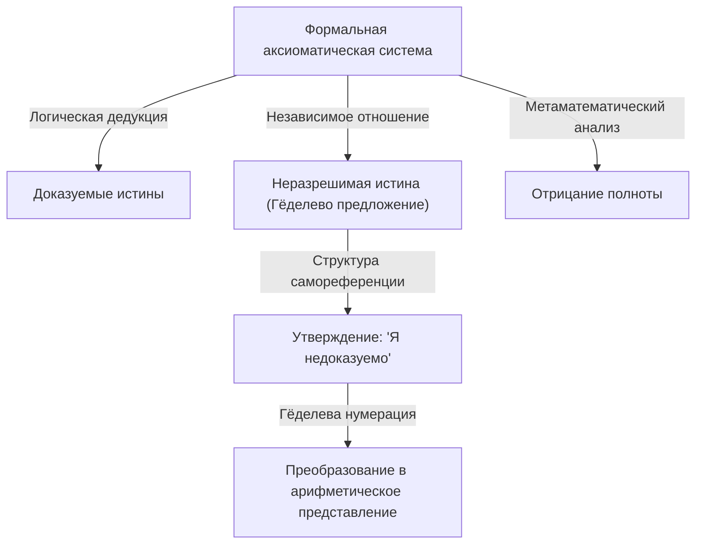

# 1. Введение: Интеллектуальный гигант и смена парадигмы в математике

[Курт Гёдель](https://kenji.blog/ru/p/godel/) — один из величайших логиков в истории, которого часто ставят в один ряд с Аристотелем и Готфридом Лейбницем. **Теоремы о неполноте** , опубликованные им в 1931 году, выявили внутренние ограничения в абсолютных основах математики, нанеся неизмеримый удар по всей науке в целом. Эти теоремы продемонстрировали неизбежный разрыв между «тем, что мы можем доказать», и «тем, что является истиной», разрушив мечту об абсолютной определенности, которую лелеяли математики того времени.

Достижения Гёделя выходят далеко за рамки простых математических доказательств, затрагивая философию, информатику и даже космологию. В этой статье мы подробно рассмотрим жизненный путь этого гения, навсегда изменившего историю математики, исследуем детали его математических открытий, его глубокую дружбу с Альбертом Эйнштейном и трагическое завершение его последних лет с различных точек зрения.

# 2. Кризис в математике и программа Гильберта

Чтобы по-настоящему оценить значение работы Гёделя, необходимо детально понять «кризис оснований», с которым столкнулся математический мир в то время. В конце 19-го века теория бесконечных множеств, основанная Георгом Кантором, привнесла в математику совершенно новые перспективы и мощные инструменты. Однако вскоре выяснилось, что она таит в себе серьезные парадоксы самореференции, такие как «[Парадокс Рассела](/ru/p/russells-paradox/)».

[Парадокс Рассела](/ru/p/russells-paradox/) рассматривает «множество всех множеств, которые не содержат самих себя в качестве элементов». Если это множество содержит само себя, оно противоречит собственному определению; если же оно не содержит само себя, то по определению оно должно быть элементом самого себя, что опять же приводит к противоречию. Это открытие обнажило крайнюю хрупкость математических основ того времени, которые в значительной степени опирались на интуитивные рассуждения.

Чтобы решить эту проблему, великий немецкий математик [Давид Гильберт](https://kenji.blog/ru/p/hilbert/) предложил «программу Гильберта». Она была направлена на формалистический подход к выведению всех математических теорем из небольшого набора аксиом и механических правил вывода. Конечной целью было математически доказать за конечное число шагов, что система аксиом абсолютно никогда не приведет к противоречию (непротиворечивость) и что любое истинное утверждение может быть доказано в рамках этой системы (полнота). В случае успеха математика встала бы на совершенно прочный фундамент. Математики того времени твердо верили в успех этой программы, считая полную формализацию математики лишь вопросом времени.

# 3. Ранние годы и философия Венского кружка

[Курт Гёдель](https://kenji.blog/ru/p/godel/) родился 28 апреля 1906 года в Брюнне, Моравия (ныне Брно, Чешская Республика), в Австро-Венгерской империи. В детстве он был чрезвычайно любознателен, постоянно допытываясь о причинах всего на свете, за что родные прозвали его «Господин Почему» (Herr Warum). Несмотря на болезненность — он перенес ревматическую лихорадку — Курт демонстрировал выдающиеся способности в учебе и неизменно получал высшие оценки.

В 1924 году Гёдель поступил в Венский университет. Первоначально он специализировался на теоретической физике, но, глубоко впечатленный лекциями Филиппа Фуртвенглера по теории чисел, перешел на математику. Он также начал посещать собрания «Венского кружка», которым руководил философ Мориц Шлик и в который входил Рудольф Карнап.

Венский кружок пропагандировал логический позитивизм, стремясь отвергнуть метафизические утверждения как бессмысленные и свести все научные знания к опыту и логике. Общение в этой среде дало Гёделю глубокое понимание строгости и важности логики. Однако сам Гёдель никогда не был согласен с их антиметафизической позицией; позже у него сформировалась твердая вера в «математический платонизм». Он считал, что математические объекты не создаются мыслительной деятельностью человека, а существуют объективно и независимо от физического мира, и что математики лишь «открывают» их.

# 4. Теорема о полноте логики первого порядка

В 1930 году в своей докторской диссертации, представленной в Венский университет, Гёдель блестяще доказал «Теорему о полноте логики первого порядка». Логика первого порядка — это логическая система, в которой кванторы («для всех», «существует») могут применяться только к переменным, а не к предикатам.

В этой работе Гёдель показал, что в логике первого порядка «утверждение, которое логически всегда истинно (общезначимая логическая формула), обязательно может быть доказано из аксиом за конечное число шагов». Это означало частичный успех программы Гильберта, гарантируя, что правила вывода логической системы достаточно сильны. Многие математики возлагали большие надежды на то, что это послужит ступенькой к доказательству полноты и для теории чисел (арифметики). Однако статья, опубликованная Гёделем в следующем году, полностью разрушила эти ожидания.

# 5. Шок от Первой теоремы о неполноте и гёделева нумерация

В 1931 году Гёдель опубликовал статью «О формально неразрешимых предложениях Principia Mathematica и родственных систем I». В этой статье была представлена **Первая теорема о неполноте** , которая ярко сияет в истории науки.

Первую теорему о неполноте можно сформулировать так: «В любой непротиворечивой формальной аксиоматической системе, достаточно богатой, чтобы выразить элементарную арифметику, всегда существуют утверждения, которые истинны, но не могут быть ни доказаны, ни опровергнуты в рамках самой системы».

Математически для некоторого утверждения $G$ справедливо следующее:

$$ G \iff \neg \text{Prov}( \lceil G \rceil ) $$

Здесь $\text{Prov}$ представляет собой предикат «доказуемо внутри системы», а $\lceil G \rceil$ обозначает гёделев номер утверждения $G$. Другими словами, утверждение $G$ самореферентно заявляет: «Я само не могу быть доказано в этой системе». Если бы $G$ было доказуемо, система доказала бы ложное утверждение (которое утверждает, что оно не доказуемо), что привело бы к противоречию. Следовательно, пока система непротиворечива, $G$ недоказуемо, и, поскольку это в точности то, что оно само утверждает, оно является «истинным».

Для доказательства этой поразительной теоремы Гёдель изобрел новаторский метод, известный как «гёделева нумерация». Это метод преобразования символов, логических формул и целых пошаговых доказательств в одно огромное натуральное число с использованием уникальности разложения на простые множители. Это позволило рассматривать метаматематические утверждения (такие как «определенная логическая формула доказуема») как чисто арифметические свойства натуральных чисел. Эта «Диагональная лемма», позволившая логической системе говорить о собственных пределах (самореференция), считается одним из самых красивых методов доказательства в истории математики.

# 6. Вторая теорема о неполноте и конец мечты Гильберта

Как прямое следствие Первой теоремы о неполноте Гёдель вывел еще более сильную **Вторую теорему о неполноте** . Она гласит: «Непротиворечивая формальная аксиоматическая система, способная выразить арифметику, не может доказать свою собственную непротиворечивость в рамках самой системы».

Математически это выражается так:

$$ \text{Con}(F) \implies \neg \text{Prov}( \lceil \text{Con}(F) \rceil ) $$

Здесь $\text{Con}(F)$ — это логическая формула, означающая, что система аксиом $F$ непротиворечива. Если бы система $F$ могла доказать свою собственную непротиворечивость, она на самом деле была бы противоречивой.

Вторая теорема о неполноте стала абсолютным смертным приговором для программы Гильберта. Великая мечта Гильберта доказать непротиворечивость математики исключительно изнутри самой математики оказалась принципиально невыполнимой. Здесь была установлена глубокая истина: математика не может гарантировать безопасность собственных оснований только своими силами.

# 7. Вклад в Континуум-гипотезу и конструктивная вселенная (L)

Даже после теорем о неполноте интеллектуальные поиски Гёделя не прекратились. Он взялся за «Континуум-гипотезу», давнюю нерешенную проблему в теории множеств и первую из 23 проблем Гильберта. Предложенная Кантором, эта гипотеза постулирует, что «не существует множества, мощность которого строго больше мощности множества целых чисел (счетная бесконечность) и строго меньше мощности множества вещественных чисел (континуум)».

$$ 2^{\aleph_0} = \aleph_1 $$

В 1940 году Гёдель ввел революционную концепцию «конструктивной вселенной (L)». Это модель, построенная путем систематического сбора только тех элементов, которые могут быть логически определены из существующих множеств. Гёдель доказал, что если теория множеств Цермело-Френкеля (ZF) непротиворечива, то система, полученная путем добавления к ней аксиомы выбора (AC) и обобщенной континуум-гипотезы (GCH), также непротиворечива. Это показало, что [континуум-гипотеза](/ru/p/continuum-hypothesis/) не противоречит текущим аксиомам математики. Позже, в 1963 году, Пол Коэн использовал метод, называемый форсингом, чтобы доказать, что «отрицание континуум-гипотезы» также непротиворечиво, тем самым окончательно установив, что [континуум-гипотеза](/ru/p/continuum-hypothesis/) является независимым от ZFC утверждением.

# 8. Изгнание в Америку и дружба с Эйнштейном

Когда в 1933 году Адольф Гитлер пришел к власти в Германии, политическая ситуация в Европе начала стремительно ухудшаться. После аннексии Австрии (аншлюса) нацистской Германией в 1938 году ситуация в Венском университете полностью изменилась, и Гёдель столкнулся с неминуемой угрозой призыва в армию. Вместе со своей женой Адель он предпринял изнурительное путешествие: пересек Советский Союз по Транссибирской магистрали и Тихому океану, чтобы просить убежища в Соединенных Штатах.

Он обосновался в Институте перспективных исследований (IAS) в Принстоне, штат Нью-Джерси. Именно здесь Гёдель установил глубокую интеллектуальную связь с Альбертом Эйнштейном, величайшим физиком 20-го века. Логик и физик, интровертный и невротичный Гёдель — и жизнерадостный экстраверт Эйнштейн. Хотя их характеры и области исследований сильно различались, они стали легендой Принстона, почти каждый день вместе гуляя до Института и глубокомысленно беседуя по-немецки.

Известно, что в свои последние годы Эйнштейн говорил: «Я хожу в Институт исключительно ради привилегии возвращаться домой пешком вместе с Гёделем». Они вели глубокие дискуссии о неполноте квантовой механики, фундаментальной природе времени, а также о политике и философии.

# 9. Метрика Гёделя: Открытие Вселенной с обратным ходом времени

Вдохновленный общением с Эйнштейном, Гёдель погрузился в изучение общей теории относительности. В 1949 году, к 70-летию Эйнштейна, Гёдель преподнес ему точное решение уравнений поля Эйнштейна, которое стало известно как «метрика Гёделя» или Вселенная Гёделя.

Эта космологическая модель описывает Вселенную, которая вращается как единое целое и имеет соответствующую отрицательную космологическую постоянную. Самая поразительная особенность заключается в том, что в этой Вселенной существуют «замкнутые времениподобные кривые». То есть он математически доказал, что путешествие во времени в прошлое теоретически возможно без превышения материей скорости света.

Сам Эйнштейн не мог скрыть своего замешательства и потрясения от того, что его собственная теория допускает путешествия во времени в прошлое, но математические рассуждения Гёделя были безупречны. Из этого результата Гёдель сделал философский вывод о том, что «понятие времени не является объективной физической реальностью, а лишь субъективной человеческой иллюзией», тем самым предложив основанную на физике защиту кантианского идеализма.

# 10. Философия и онтологическое доказательство бытия Бога

Гёдель был не только чистым математиком, но и глубоким философским мыслителем. Как упоминалось ранее, он решительно поддерживал платонизм и был глубоко предан философии Готфрида Лейбница. Он верил, что мир устроен абсолютно логично и рационально, и что совпадений не бывает.

Одной из вершин его философских исследований стала формализация «Онтологического доказательства бытия Бога» в логических терминах. Используя модальную логику (логику, имеющую дело с необходимостью и возможностью), Гёдель строго перевел попытки доказательства бытия Бога Ансельмом и Лейбницем в математический формат. Он аксиоматизировал понятие «положительных свойств» и попытался математически доказать, что сущность, обладающая всеми положительными свойствами (Бог), если она существует в возможном мире, с необходимостью должна существовать во всех необходимых мирах.

Доказательство включает такие формулы в модальной логике, как:

$$ P( \text{God} ) \implies \Box \exists x \; \text{God}(x) $$

Здесь $\Box$ означает «с необходимостью истинно, что». При жизни он хранил это доказательство в своих личных тетрадях и никогда не публиковал, но оно было обнаружено после его смерти и вызвало масштабные дебаты на стыке логики и теологии.

# 11. Наследие для Тьюринга и информатики

[Теоремы Гёделя о неполноте](https://kenji.blog/ru/p/godels-incompleteness-theorems/) и идея гёделевой нумерации оказали прямое и глубокое влияние на зарождение теории вычислений. Британский математик [Алан Тьюринг](https://kenji.blog/ru/p/turing/) применил логику Гёделя для создания абстрактной вычислительной модели, известной как «машина Тьюринга», и доказал, что существуют проблемы, которые не могут быть решены никаким алгоритмом ([Проблема остановки](/ru/p/halting-problem/)). Примерно в то же время Алонзо Чёрч пришел к аналогичному выводу, используя [лямбда-исчисление](/ru/p/lambda-calculus-functional-programming/).

Сегодня теоремы Гёделя также часто цитируются в дебатах о пределах искусственного интеллекта (ИИ). Физик Роджер Пенроуз предложил «аргумент Пенроуза-Гёделя», утверждая, что «поскольку машины (ИИ) следуют алгоритмам и, следовательно, связаны теоремами о неполноте, человеческая интуиция способна видеть истину, что означает, что человеческое сознание основано на невычислимых процессах». Эти споры о том, может ли ИИ действительно превзойти человеческий интеллект, продолжают вызывать бурные дискуссии и по сей день.

# 12. Паранойя в последние годы и трагический конец

Несмотря на выдающийся логический интеллект, психика Гёделя была невероятно хрупкой. Всю жизнь он страдал от тяжелой ипохондрии и паранойи. Особенно в последние годы его мучил навязчивый страх, что «кто-то пытается меня отравить».

Он ел только ту пищу, которую приготовила и лично попробовала его жена Адель, которой он абсолютно доверял. Однако в конце 1977 года Адель тяжело заболела и попала в больницу на длительный срок, оставив Гёделя без человека, который мог бы заботиться о его питании. Парализованный страхом быть отравленным, он полностью отказался от еды. 14 января 1978 года он скончался в больнице Принстона.

Официальной причиной смерти стало «недоедание и истощение, вызванные расстройством личности». Говорят, что на момент смерти он весил всего 29 кг. Величайший логический ум в истории человечества нашел глубоко трагический конец: его жизнь унес самый нелогичный из всех страхов.

# 13. Заключение: Вечный искатель истины

[Курт Гёдель](https://kenji.blog/ru/p/godel/) был эксцентричным гением, совершившим величайший парадокс: он математически доказал пределы самого интеллекта. Продемонстрировав глубокую истину о том, что «мы не можем доказать всё исчерпывающе логическим путем», он парадоксальным образом даровал бесконечное расширение царству человеческого познания.

Его достижения, охватывающие математику, логику, философию, физику и информатику, вышли за рамки отдельных дисциплин и стали фундаментом современной науки. Пока человечество продолжает свой поиск знаний, яркий свет, оставленный Гёделем — человеком, который неустанно вглядывался в бездну логики и истины Вселенной, — никогда не угаснет.
