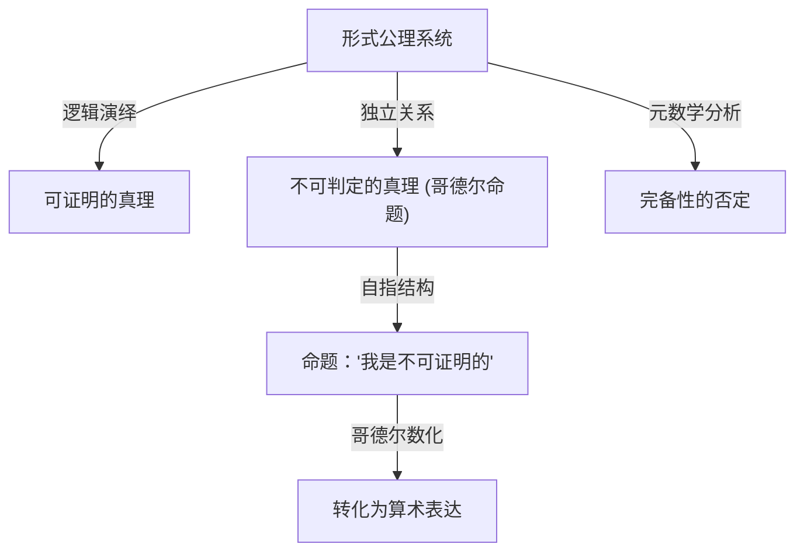

# 1. 序言：知识的巨星与数学的范式转变

[库尔特·哥德尔](https://kenji.blog/zh-cn/p/godel/)（Kurt Gödel）是历史上最伟大的逻辑学家之一，常被与亚里士多德和[戈特弗里德·莱布尼茨](https://kenji.blog/zh-cn/p/leibniz/)相提并论。他在1931年发表的 **不完备性定理** 揭示了数学这一学科绝对基础中潜藏的局限性，给整个科学界带来了无法估量的冲击。该定理表明，在“我们能够证明的”与“什么是真理”之间存在着不可避免的鸿沟，从而粉碎了当时数学家们所抱有的对绝对确定性的梦想。

哥德尔的成就远超单纯的数学证明范畴，延伸至哲学、计算机科学，甚至宇宙学。在本文中，我们将从多个视角深入探讨这位永远改变了数学历史的天才的一生，探究其数学伟业的细节、与阿尔伯特·爱因斯坦的深厚友谊，以及他晚年悲剧性的结局。

# 2. 数学的危机与希尔伯特计划

为了真正理解哥德尔工作的价值，我们必须详细了解当时数学界所面临的“基础危机”。19世纪末，由[格奥尔格·康托尔](https://kenji.blog/zh-cn/p/cantor/)创立的无限集合论为数学带来了全新的视角和强大的工具。然而，人们很快发现它隐藏着严重的自指悖论，例如“罗素悖论”。

罗素悖论考虑“由所有不包含自身的集合所组成的集合”。如果这个集合包含自身，就违背了它自己的定义；如果它不包含自身，根据定义它又必须是自身的元素，这再次导致了矛盾。这一发现暴露了当时严重依赖直觉推理的数学基础的极端[脆弱性](https://kenji.blog/zh-cn/p/web-application-vulnerability-owasp-top-10/)。

为了解决这个问题，伟大的德国数学家[大卫·希尔伯特](https://kenji.blog/zh-cn/p/hilbert/)提出了“希尔伯特计划”。该计划旨在通过形式主义的方法，从少量公理和机械的推理规则中推导出所有数学定理。最终目标是通过有限的步骤在数学上证明，该公理系统绝对不会导致矛盾（一致性/无矛盾性），并且每一个真命题都可以在该系统内被证明（完备性）。如果计划成功，数学将建立在完美坚实的基础之上。当时的数学家们坚信这一计划的成功，认为数学的完全形式化只是时间问题。

# 3. 早年生活与维也纳学派的哲学

[库尔特·哥德尔](https://kenji.blog/zh-cn/p/godel/)于1906年4月28日出生于奥匈帝国摩拉维亚的布尔诺（今捷克共和国布尔诺）。童年时代的他充满好奇心，总是不断追问一切事物的原由，因此被家人戏称为“为什么先生（Herr Warum）”。尽管他体弱多病，曾患风湿热，但他在学业上展现出非凡的天赋，成绩始终名列前茅。

1924年，哥德尔进入维也纳大学。他最初主修理论物理，但被菲利普·富特文格勒的数论讲义深深打动，转而学习数学。他还开始参加由哲学家莫里茨·石里克领导、鲁道夫·卡尔纳普等人也参与的“维也纳学派”会议。

维也纳学派提倡逻辑实证主义，试图将形而上学的命题斥为无意义，并将所有科学知识还原为经验和逻辑。在这一环境中的交流让哥德尔对逻辑的严谨性和重要性有了深刻的认识。然而，哥德尔本人从未赞同他们的反形而上学立场，后来他发展出强烈的“数学柏拉图主义”。他相信数学对象并非由人类的心理活动创造，而是客观独立于物理世界存在，数学家仅仅是“发现”了它们。

# 4. 一阶谓词逻辑的完备性定理

1930年，哥德尔在提交给维也纳大学的博士论文中，出色地证明了“一阶谓词逻辑的完备性定理”。一阶谓词逻辑是一种逻辑系统，其中量词（所有、存在）只能应用于变量，而不能应用于谓词。

在这篇论文中，哥德尔表明在一阶谓词逻辑中，“一个逻辑上永远为真的命题（有效的逻辑公式）必然可以在有限步骤内从公理中被证明”。这标志着希尔伯特计划取得了部分成功，保证了逻辑系统的推理规则足够强大。许多数学家寄予厚望，认为这可以作为证明数论（算术）也具有完备性的垫脚石。然而，哥德尔在次年发表的论文彻底粉碎了这些期望。

# 5. 第一不完备性定理的冲击与哥德尔数

1931年，哥德尔发表了论文《论〈数学原理〉及相关系统的形式不可判定命题 I》。这篇论文提出了在科学史上熠熠生辉的 **第一不完备性定理** 。

第一不完备性定理可以表述如下：“在任何包含初等算术的、一致（无矛盾）的形式公理系统中，必定存在为真但无法在系统内被证明或证伪的命题。”

用数学公式表达，对于某个命题 $G$ ，以下关系成立：

$$ G \iff \neg \text{Prov}( \lceil G \rceil ) $$

这里， $\text{Prov}$ 代表“在系统内可证明”的谓词，而 $\lceil G \rceil$ 表示命题 $G$ 的哥德尔数。换言之，命题 $G$ 以自指的方式断言：“我自身在这个系统中是不可证明的”。如果 $G$ 是可证明的，那么系统就证明了一个假命题（该命题声称自己不可证明），从而产生矛盾。因此，只要系统是一致的， $G$ 就是不可证明的，且既然它正如它所断言的那样，它便是“真”的。

为了证明这个惊人的定理，哥德尔发明了一种被称为“哥德尔数化（Gödel numbering）”的突破性技术。这是一种利用素数分解的唯一性，将符号、逻辑公式和整个逐步证明过程转换为一个巨大自然数的方法。这使得元数学命题（例如“某个逻辑公式是可证明的”）可以被纯粹视为自然数的算术性质。这种允许逻辑系统谈论自身界限（自指）的“对角线引理”，被认为是数学史上最优美的证明技巧之一。

# 6. 第二不完备性定理与希尔伯特之梦的终结

作为第一不完备性定理的直接推论，哥德尔推导出了更为强大的 **第二不完备性定理** 。它指出：“任何包含算术的一致的形式公理系统，都无法在系统内部证明其自身的一致性。”

用数学公式表达如下：

$$ \text{Con}(F) \implies \neg \text{Prov}( \lceil \text{Con}(F) \rceil ) $$

这里， $\text{Con}(F)$ 是一个表示公理系统 $F$ 是一致的逻辑公式。如果系统 $F$ 能够证明自身的一致性，那么该系统实际上就是不一致的。

第二不完备性定理宣告了希尔伯特计划的彻底死刑。希尔伯特完全从数学内部证明数学一致性的宏大梦想，在原理上被证明是不可能的。这里确立了一个深刻的真理：数学无法凭借自身的力量来保证其基础的安全性。

# 7. 对连续统假设与可构成集 (L) 的贡献

即使在提出不完备性定理之后，哥德尔的智力探索也未曾停止。他攻克了集合论中长期未决的难题、同时也是希尔伯特23个问题中第一个问题的“连续统假设”。该假设由康托尔提出，主张“不存在基数严格介于整数（可数无穷）和实数（连续统）之间的集合”。

$$ 2^{\aleph_0} = \aleph_1 $$

1940年，哥德尔引入了“可构成宇宙（L）”的革命性概念。这是一个仅通过系统地收集那些可以从现有集合中逻辑定义出来的元素而构建的模型。哥德尔证明了，如果策梅洛-弗兰克尔集合论（ZF）是一致的，那么通过向其添加选择公理（AC）和广义连续统假设（GCH）而获得的系统也是一致的。这表明连续统假设并不与当前的数学公理相矛盾。后来在1963年，保罗·科恩使用一种被称为“力迫法”的技术证明了“连续统假设的否定”也是一致的，从而最终确立连续统假设是独立于ZFC的命题。

# 8. 流亡美国与爱因斯坦的友谊

1933年阿道夫·希特勒在德国夺取政权后，欧洲的政治局势迅速恶化。随着1938年纳粹德国吞并奥地利（德奥合并），维也纳大学的局势完全改变，哥德尔面临即将被征兵的威胁。他与妻子阿黛尔一起踏上了艰苦的旅程，乘坐西伯利亚大铁路穿越苏联，横跨太平洋前往美国寻求庇护。

他定居在位于新泽西州普林斯顿的高等研究院（IAS）。正是在这里，哥德尔与20世纪最伟大的物理学家阿尔伯特·爱因斯坦建立起了深厚的精神纽带。一位逻辑学家与一位物理学家，内向且有些神经质的哥德尔，与开朗外向的爱因斯坦。尽管他们的性格和研究领域截然不同，但他们成为了普林斯顿一道传奇的风景线，几乎每天一起步行前往研究所，用德语进行深刻的交谈。

在爱因斯坦的晚年，他曾说过：“我之所以去研究所，仅仅是为了享受与哥德尔一起步行回家的特权。”两人就量子力学的不完备性、时间的根本本质以及政治和哲学等问题进行了深入的讨论。

# 9. 哥德尔度规：时间倒流宇宙的发现

受与爱因斯坦交流的启发，哥德尔沉浸于广义相对论的研究中。1949年，在爱因斯坦70岁生日之际，哥德尔送给他一份爱因斯坦场方程的精确解，该解后来被称为“哥德尔度规”或哥德尔宇宙。

这个宇宙模型描述了一个整体在旋转、并具有适当负宇宙学常数的宇宙。最令人震惊的特征是，在这个宇宙中存在“闭合类时曲线”。也就是说，他在数学上证明了，在物质不超过光速的情况下，回到过去的时光旅行在理论上是可能的。

爱因斯坦本人也无法掩饰他对自己的理论竟然允许回到过去的时光旅行所感到的困惑和震惊，但哥德尔的数学推理完美无瑕。从这个结果中，哥德尔得出了这样一个哲学结论：“时间的概念并非客观的物理实在，而仅仅是人类主观的错觉”，从而为康德的唯心主义提供了基于物理学的辩护。

# 10. 哲学与上帝存在的本体论证明

哥德尔不仅是一位纯粹的数学家，也是一位深刻的哲学思想家。如前所述，他强烈支持柏拉图主义，并深受[戈特弗里德·莱布尼茨](https://kenji.blog/zh-cn/p/leibniz/)哲学的影响。他相信世界是完全合乎逻辑与理性构建的，不存在巧合。

他哲学探索的顶峰之一是用逻辑术语将“上帝存在的本体论证明”形式化。利用模态逻辑（处理必然性和可能性的逻辑），哥德尔严格地将安瑟伦和莱布尼茨尝试的上帝证明重建为数学格式。他将“正属性（Positive properties）”的概念公理化，并试图在数学上证明，一个拥有所有正属性的存在（上帝），如果存在于一个可能世界中，那么必然存在于所有必然世界中。

该证明包含如下模态逻辑公式：

$$ P( \text{God} ) \implies \Box \exists x \; \text{God}(x) $$

这里， $\Box$ 表示“必然为真”。在生前，他将这个证明保存在个人笔记本中，从未发表，但在他死后被发现，并在逻辑学与神学的交叉领域引发了巨大的争论。

# 11. 对图灵与计算机科学的遗产

哥德尔的不完备性定理以及哥德尔数化的思想对计算理论的诞生直接产生了深远的影响。英国数学家阿兰·图灵应用哥德尔的逻辑，构想出一种被称为“图灵机”的抽象计算模型，并证明了存在任何算法都无法解决的问题（停机问题）。几乎在同一时间，阿隆佐·邱奇使用λ演算得出了相似的结论。

今天，哥德尔的定理在有关人工智能（AI）极限的辩论中也经常被引用。物理学家罗杰·彭罗斯提出了“彭罗斯-哥德尔论题”，认为“既然机器（AI）遵循算法，因此受不完备性定理的约束，而人类直觉能够洞察真理，这意味着人类意识基于不可计算的过程。”关于AI是否能真正超越人类智能的这场辩论，在今天仍在引发激烈的讨论。

# 12. 晚年的偏执狂与悲剧的结局

尽管拥有非凡的逻辑心智，哥德尔的精神却极其脆弱敏感。在他的一生中，他一直患有严重的疑病症和偏执狂。尤其在晚年，他深受一种强迫性恐惧的折磨，总认为“有人试图毒死我”。

他只吃由他绝对信任的妻子阿黛尔准备并亲自品尝过的食物。然而，在1977年底，阿黛尔身患重病，不得不住院长达数月，导致无人照顾哥德尔的饮食。在被毒死的恐惧中瘫痪，他完全拒绝进食。1978年1月14日，他在普林斯顿医院的病床上逝世。

官方死因是“由人格障碍导致的营养不良和饥饿”。据说在他去世时，体重仅有29公斤。人类历史上最伟大的逻辑头脑遭遇了极其悲惨的结局，他的生命被最不合逻辑的恐惧所夺走。

# 13. 结论：永恒的真理探索者

[库尔特·哥德尔](https://kenji.blog/zh-cn/p/godel/)是一位古怪的天才，他实现了终极悖论：在数学上证明了智力本身的极限。通过揭示“我们无法在逻辑上详尽地证明一切”这一深刻的真理，他反而矛盾地赋予了人类知识领域以无限的广度。

他的成就横跨数学、逻辑学、哲学、物理学和计算机科学，跨越了学科界限，成为现代科学的基石。只要人类继续探索知识，哥德尔——这位坚持不懈地凝视逻辑深渊和宇宙真理的人——所留下的璀璨光芒将永远不会褪色。
