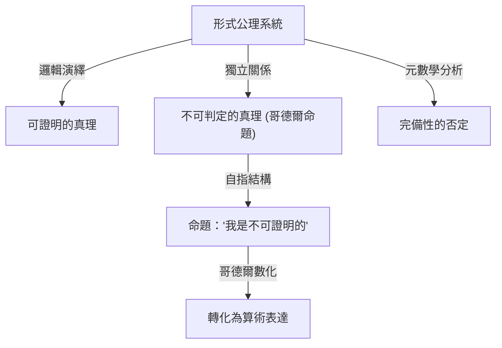

# 1. 序言：知識的巨星與數學的典範轉移

庫爾特·哥德爾（Kurt Gödel）是歷史上最偉大的邏輯學家之一，常被與亞里士多德和戈特弗里德·萊布尼茨相提並論。他在1931年發表的 **不完備性定理** 揭示了數學這一學科絕對基礎中潛藏的侷限性，給整個科學界帶來了無法估量的衝擊。該定理表明，在「我們能夠證明的」與「什麼是真理」之間存在著不可避免的鴻溝，從而粉碎了當時數學家們所抱有的對絕對確定性的夢想。

哥德爾的成就遠超單純的數學證明範疇，延伸至哲學、計算機科學，甚至宇宙學。在本文中，我們將從多個視角深入探討這位永遠改變了數學歷史的天才的一生，探究其數學偉業的細節、與阿爾伯特·愛因斯坦的深厚友誼，以及他晚年悲劇性的結局。

# 2. 數學的危機與希爾伯特計畫

為了真正理解哥德爾工作的價值，我們必須詳細了解當時數學界所面臨的「基礎危機」。19世紀末，由格奧爾格·康托爾創立的無限集合論為數學帶來了全新的視角和強大的工具。然而，人們很快發現它隱藏著嚴重的自指悖論，例如「羅素悖論」。

羅素悖論考慮「由所有不包含自身的集合所組成的集合」。如果這個集合包含自身，就違背了它自己的定義；如果它不包含自身，根據定義它又必須是自身的元素，這再次導致了矛盾。這一發現暴露了當時嚴重依賴直覺推理的數學基礎的極端脆弱性。

為了解決這個問題，偉大的德國數學家大衛·希爾伯特提出了「希爾伯特計畫」。該計畫旨在透過形式主義的方法，從少量公理和機械的推理規則中推導出所有數學定理。最終目標是透過有限的步驟在數學上證明，該公理系統絕對不會導致矛盾（一致性/無矛盾性），並且每一個真命題都可以在該系統內被證明（完備性）。如果計畫成功，數學將建立在完美堅實的基礎之上。當時的數學家們堅信這一計畫的成功，認為數學的完全形式化只是時間問題。

# 3. 早年生活與維也納學派的哲學

庫爾特·哥德爾於1906年4月28日出生於奧匈帝國摩拉維亞的布爾諾（今捷克共和國布爾諾）。童年時代的他充滿好奇心，總是不斷追問一切事物的原由，因此被家人戲稱為「為什麼先生（Herr Warum）」。儘管他體弱多病，曾患風濕熱，但他在學業上展現出非凡的天賦，成績始終名列前茅。

1924年，哥德爾進入維也納大學。他最初主修理論物理，但被菲利普·富特文格勒的數論講義深深打動，轉而學習數學。他還開始參加由哲學家莫里茨·石里克領導、魯道夫·卡爾納普等人也參與的「維也納學派」會議。

維也納學派提倡邏輯實證主義，試圖將形而上學的命題斥為無意義，並將所有科學知識還原為經驗和邏輯。在這一環境中的交流讓哥德爾對邏輯的嚴謹性和重要性有了深刻的認識。然而，哥德爾本人從未贊同他們的反形而上學立場，後來他發展出強烈的「數學柏拉圖主義」。他相信數學對象並非由人類的心理活動創造，而是客觀獨立於物理世界存在，數學家僅僅是「發現」了它們。

# 4. 一階謂詞邏輯的完備性定理

1930年，哥德爾在提交給維也納大學的博士論文中，出色地證明了「一階謂詞邏輯的完備性定理」。一階謂詞邏輯是一種邏輯系統，其中量詞（所有、存在）只能應用於變量，而不能應用於謂詞。

在這篇論文中，哥德爾表明在一階謂詞邏輯中，「一個邏輯上永遠為真的命題（有效的邏輯公式）必然可以在有限步驟內從公理中被證明」。這標誌著希爾伯特計畫取得了部分成功，保證了邏輯系統的推理規則足夠強大。許多數學家寄予厚望，認為這可以作為證明數論（算術）也具有完備性的墊腳石。然而，哥德爾在次年發表的論文徹底粉碎了這些期望。

# 5. 第一不完備性定理的衝擊與哥德爾數

1931年，哥德爾發表了論文《論〈數學原理〉及相關系統的形式不可判定命題 I》。這篇論文提出了在科學史上熠熠生輝的 **第一不完備性定理** 。

第一不完備性定理可以表述如下：「在任何包含初等算術的、一致（無矛盾）的形式公理系統中，必定存在為真但無法在系統內被證明或證偽的命題。」

用數學公式表達，對於某個命題 $G$ ，以下關係成立：

$$ G \iff \neg \text{Prov}( \lceil G \rceil ) $$

這裡， $\text{Prov}$ 代表「在系統內可證明」的謂詞，而 $\lceil G \rceil$ 表示命題 $G$ 的哥德尔数。換言之，命題 $G$ 以自指的方式斷言：「我自身在這個系統中是不可證明的」。如果 $G$ 是可證明的，那麼系統就證明了一個假命題（該命題聲稱自己不可證明），從而產生矛盾。因此，只要系統是一致的， $G$ 就是不可證明的，且既然它正如它所斷言的那樣，它便是「真」的。

為了證明這個驚人的定理，哥德爾發明了一種被稱為「哥德爾數化（Gödel numbering）」的突破性技術。這是一種利用質數分解的唯一性，將符號、邏輯公式和整個逐步證明過程轉換為一個巨大自然數的方法。這使得元數學命題（例如「某個邏輯公式是可證明的」）可以被純粹視為自然數的算術性質。這種允許邏輯系統談論自身界限（自指）的「對角線引理」，被認為是數學史上最優美的證明技巧之一。

# 6. 第二不完備性定理與希爾伯特之夢的終結

作為第一不完備性定理的直接推論，哥德爾推導出了更為強大的 **第二不完備性定理** 。它指出：「任何包含算術的一致的形式公理系統，都無法在系統內部證明其自身的一致性。」

用數學公式表達如下：

$$ \text{Con}(F) \implies \neg \text{Prov}( \lceil \text{Con}(F) \rceil ) $$

這裡， $\text{Con}(F)$ 是一個表示公理系統 $F$ 是一致的邏輯公式。如果系統 $F$ 能夠證明自身的一致性，那麼該系統實際上就是不一致的。

第二不完備性定理宣告了希爾伯特計畫的徹底死刑。希爾伯特完全從數學內部證明數學一致性的宏大夢想，在原理上被證明是不可能的。這裡確立了一個深刻的真理：數學無法憑藉自身的力量來保證其基礎的安全性。

# 7. 對連續統假設與可構成集 (L) 的貢獻

即使在提出不完備性定理之後，哥德爾的智力探索也未曾停止。他攻克了集合論中長期未決的難題、同時也是希爾伯特23個問題中第一個問題的「連續統假設」。該假設由康托爾提出，主張「不存在基數嚴格介於整數（可數無窮）和實數（連續統）之間的集合」。

$$ 2^{\aleph_0} = \aleph_1 $$

1940年，哥德爾引入了「可構成宇宙（L）」的革命性概念。這是一個僅透過系統地收集那些可以從現有集合中邏輯定義出來的元素而構建的模型。哥德爾證明了，如果策梅洛-弗蘭克爾集合論（ZF）是一致的，那麼透過向其添加選擇公理（AC）和廣義連續統假設（GCH）而獲得的系統也是一致的。這表明連續統假設並不與當前的數學公理相矛盾。後來在1963年，保羅·科恩使用一種被稱為「力迫法」的技術證明了「連續統假設的否定」也是一致的，從而最終確立連續統假設是獨立於ZFC的命題。

# 8. 流亡美國與愛因斯坦的友誼

1933年阿道夫·希特勒在德國奪取政權後，歐洲的政治局勢迅速惡化。隨著1938年納粹德國吞併奧地利（德奧合併），維也納大學的局勢完全改變，哥德爾面臨即將被徵兵的威脅。他與妻子阿黛爾一起踏上了艱苦的旅程，乘坐西伯利亞大鐵路穿越蘇聯，橫跨太平洋前往美國尋求庇護。

他定居在位於新澤西州普林斯頓的高等研究院（IAS）。正是在這裡，哥德爾與20世紀最偉大的物理學家阿爾伯特·愛因斯坦建立起了深厚的精神紐帶。一位邏輯學家與一位物理學家，內向且有些神經質的哥德爾，與開朗外向的愛因斯坦。儘管他們的性格和研究領域截然不同，但他們成為了普林斯頓一道傳奇的風景線，幾乎每天一起步行前往研究所，用德語進行深刻的交談。

在愛因斯坦的晚年，他曾說過：「我之所以去研究所，僅僅是為了享受與哥德爾一起步行回家的特權。」兩人就量子力學的不完備性、時間的根本本質以及政治和哲學等問題進行了深入的討論。

# 9. 哥德爾度規：時間倒流宇宙的發現

受與愛因斯坦交流的啟發，哥德爾沉浸於廣義相對論的研究中。1949年，在愛因斯坦70歲生日之際，哥德爾送給他一份愛因斯坦場方程式的精確解，該解後來被稱為「哥德爾度規」或哥德爾宇宙。

這個宇宙模型描述了一個整體在旋轉、並具有適當負宇宙學常數的宇宙。最令人震驚的特徵是，在這個宇宙中存在「閉合類時曲線」。也就是說，他在數學上證明了，在物質不超過光速的情況下，回到過去的時光旅行在理論上是可能的。

愛因斯坦本人也無法掩飾他對自己的理論竟然允許回到過去的時光旅行所感到的困惑和震驚，但哥德爾的數學推理完美無瑕。從這個結果中，哥德爾得出了這樣一個哲學結論：「時間的概念並非客觀的物理實在，而僅僅是人類主觀的錯覺」，從而為康德的唯心主義提供了基於物理學的辯護。

# 10. 哲學與上帝存在的本體論證明

哥德爾不僅是一位純粹的數學家，也是一位深刻的哲學思想家。如前所述，他強烈支持柏拉圖主義，並深受戈特弗里德·萊布尼茨哲學的影響。他相信世界是完全合乎邏輯與理性構建的，不存在巧合。

他哲學探索的頂峰之一是用邏輯術語將「上帝存在的本體論證明」形式化。利用模態邏輯（處理必然性和可能性的邏輯），哥德爾嚴格地將安瑟倫和萊布尼茨嘗試的上帝證明重建為數學格式。他將「正屬性（Positive properties）」的概念公理化，並試圖在數學上證明，一個擁有所有正屬性的存在（上帝），如果存在於一個可能世界中，那麼必然存在於所有必然世界中。

該證明包含如下模態邏輯公式：

$$ P( \text{God} ) \implies \Box \exists x \; \text{God}(x) $$

這裡， $\Box$ 表示「必然為真」。在生前，他將這個證明保存在個人筆記本中，從未發表，但在他死後被發現，並在邏輯學與神學的交叉領域引發了巨大的爭論。

# 11. 對圖靈與計算機科學的遺產

哥德爾的不完備性定理以及哥德爾數化的思想對計算理論的誕生直接產生了深遠的影響。英國數學家阿蘭·圖靈應用哥德爾的邏輯，構想出一種被稱為「圖靈機」的抽象計算模型，並證明了存在任何演算法都無法解決的問題（停機問題）。幾乎在同一時間，阿隆佐·邱奇使用λ演算得出了相似的結論。

今天，哥德爾的定理在有關人工智慧（AI）極限的辯論中也經常被引用。物理學家羅傑·彭羅斯提出了「彭羅斯-哥德爾論題」，認為「既然機器（AI）遵循演算法，因此受不完備性定理的約束，而人類直覺能夠洞察真理，這意味著人類意識基於不可計算的過程。」關於AI是否能真正超越人類智能的這場辯論，在今天仍在引發激烈的討論。

# 12. 晚年的偏執狂與悲劇的結局

儘管擁有非凡的邏輯心智，哥德爾的精神卻極其脆弱敏感。在他的一生中，他一直患有嚴重的疑病症和偏執狂。尤其在晚年，他深受一種強迫性恐懼的折磨，總認為「有人試圖毒死我」。

他只吃由他絕對信任的妻子阿黛爾準備並親自品嚐過的食物。然而，在1977年底，阿黛尔身患重病，不得不住院長達數月，導致無人照顧哥德爾的飲食。在被毒死的恐懼中癱瘓，他完全拒絕進食。1978年1月14日，他在普林斯頓醫院的病床上逝世。

官方死因是「由人格障礙導致的營養不良和飢餓」。據說在他去世時，體重僅有29公斤。人類歷史上最偉大的邏輯頭腦遭遇了極其悲慘的結局，他的生命被最不合邏輯的恐懼所奪走。

# 13. 結論：永恆的真理探索者

庫爾特·哥德爾是一位古怪的天才，他實現了終極悖論：在數學上證明了智力本身的極限。透過揭示「我們無法在邏輯上詳盡地證明一切」這一深刻的真理，他反而矛盾地賦予了人類知識領域以無限的廣度。

他的成就橫跨數學、邏輯學、哲學、物理學和計算機科學，跨越了學科界限，成為現代科學的基石。只要人類繼續探索知識，哥德爾——這位堅持不懈地凝視邏輯深淵和宇宙真理的人——所留下的璀璨光芒將永遠不會褪色。
