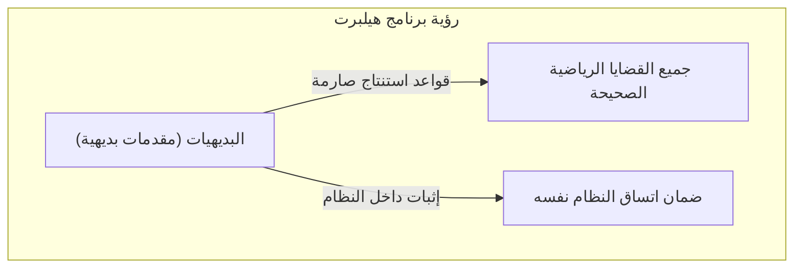
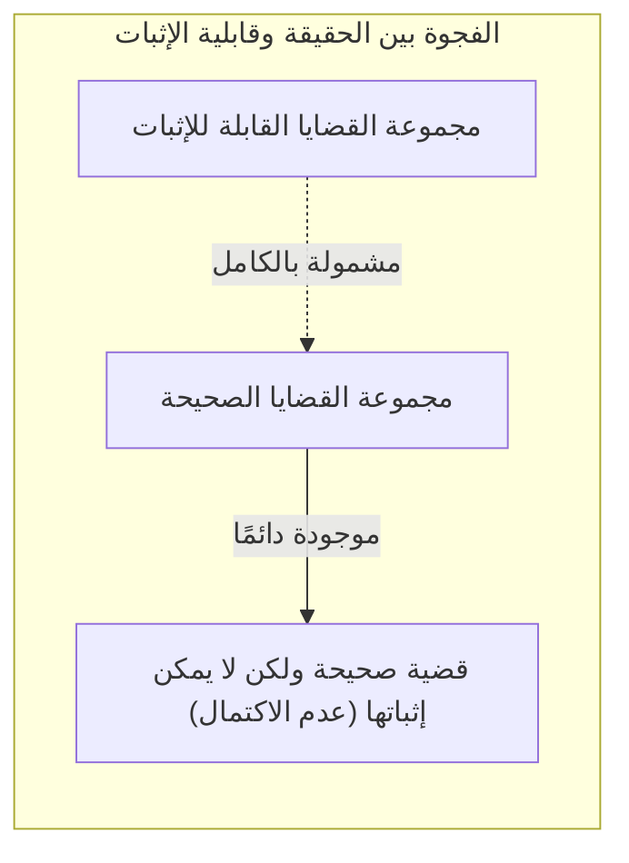
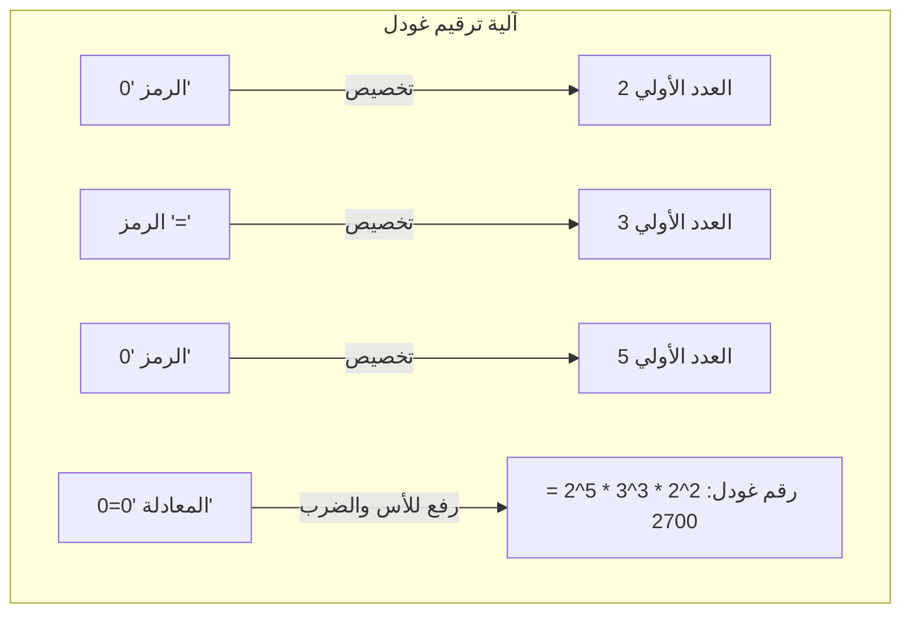
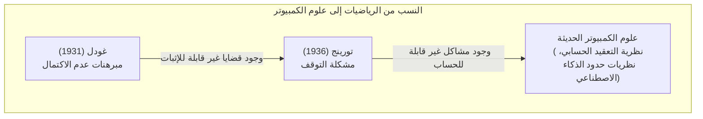

"الرياضيات صحيحة بشكل مطلق" ── لعل الجميع فكر في ذلك ولو لمرة واحدة. ولكن في عام 1931، نشر عالم الرياضيات الشاب كورت غودل (Kurt Gödel) ورقة بحثية قلبت هذا المفهوم الشائع رأسًا على عقب. إنها **مبرهنات عدم الاكتمال لغودل** (Gödel's Incompleteness Theorems).

في هذه المقالة، سنشرح بالتفصيل هذه المبرهنة الصادمة التي تنص على وجود "حقيقة لا يمكن إثباتها أبدًا"، مع توضيح معناها وآلية إثباتها باستخدام الأمثلة العملية والرسوم التوضيحية.

---

## 1. الخلفية: برنامج هيلبرت وأزمة الرياضيات

منذ أواخر القرن التاسع عشر وحتى أوائل القرن العشرين، واجه عالم الرياضيات "مفارقات نظرية المجموعات (مثل مفارقة راسل)"، مما أدى إلى اهتزاز أسسها. ولإنقاذ الرياضيات من "أزمة الرياضيات" هذه، نهض ديفيد هيلبرت (David Hilbert)، أبرز مرجعية رياضية في ذلك الوقت.

حاول هيلبرت ترميز جميع استنتاجات الرياضيات بالكامل، وإعادة بناء الرياضيات باستخدام قواعد ميكانيكية بحتة. وكان الهدف من "برنامج هيلبرت" الذي اقترحه هو إثبات الخصائص الثلاث التالية في النظام الشكلي (Formal System) للرياضيات:

1. **الاتساق** (Consistency): عدم وجود تناقض داخل النظام (أي عدم إثبات قضية $P$ ونفيها $\neg P$ معًا).
2. **الاكتمال** (Completeness): إمكانية إثبات أي قضية رياضية داخل النظام إما على أنها صحيحة أو خاطئة.
3. **قابلية التقرير** (Decidability): وجود إجراء ميكانيكي لتحديد ما إذا كانت أي قضية معطاة قابلة للإثبات أم لا.

ترك هيلبرت مقولته الشهيرة "يجب أن نعرف، وسوف نعرف (Wir müssen wissen. Wir werden wissen.)"، ولم يشك أبدًا في أن الرياضيات ستصبح قلعة منطقية مثالية يمكنها حل كل شيء.

## 2. النظام الشكلي وحساب بيانو

لفهم مبرهنة غودل، دعونا أولاً نتطرق إلى "النظام الشكلي" و"الحساب الأساسي".

النظام الشكلي هو مجموعة من السلاسل النصية (الرموز) المحددة مسبقًا وقواعد الألغاز (قواعد الاستنتاج) للتعامل معها. لا يتطلب هذا النظام "معنى"، بل يتعامل مع الرياضيات كلعبة لتحويل الرموز فقط.

تستهدف مبرهنة غودل الأنظمة التي تشمل "جمع وضرب الأعداد الطبيعية". والمثال الأبرز على ذلك هو النظام البديهي المعروف بـ **حساب بيانو** (Peano Arithmetic, PA). يبدأ حساب بيانو من قواعد أساسية (بديهيات) مثل "0 هو عدد طبيعي" و"لكل عدد طبيعي $x$، يوجد عدد يليه $S(x)$".

على سبيل المثال، الحقيقة المعروفة للجميع "$1 + 1 = 2$" ليست سوى "مبرهنة" واحدة يتم استنتاجها ميكانيكيًا عن طريق معالجة الرموز داخل النظام الشكلي لحساب بيانو.

اعتقد هيلبرت أنه بتوسيع هذا النظام الشكلي تدريجيًا، سيكون من الممكن يومًا ما الإحاطة بجميع الحقائق الرياضية.

## 3. صدمة مبرهنة عدم الاكتمال الأولى: قضية "صحيحة ولكن لا يمكن إثباتها"

ولكن في عام 1931، نشر كورت غودل، الذي كان يبلغ من العمر حينها 25 عامًا فقط، ورقة بحثية حطمت حلم هيلبرت تمامًا. إنها **مبرهنة عدم الاكتمال الأولى**.

> **مبرهنة عدم الاكتمال الأولى**
> في أي نظام شكلي متسق يتضمن حساب بيانو، توجد دائمًا قضايا صحيحة، ولكن لا يمكن إثباتها داخل ذلك النظام.

أثبتت هذه المبرهنة أن "الحقيقة" و"قابلية الإثبات" هما شيئان مختلفان تمامًا. لقد كان من المستحيل على "الآلة" المسماة بالنظام الشكلي الإمساك بجميع حقائق عالم الرياضيات.

### الترجمة الرياضية لمفارقة الكذاب

يكمن جوهر إثبات غودل في إنشاء "مفارقة المرجعية الذاتية" داخل النظام الشكلي للرياضيات.

تذكر "مفارقة الكذاب" المعروفة منذ اليونان القديمة.
"هذه الجملة كاذبة"
إذا افترضنا أن هذه الجملة صحيحة، فإن محتواها يصبح "كذبًا". وإذا افترضنا أنها كاذبة، فإن محتواها يصبح "صحيحًا".

أدخل غودل منطقًا مشابهًا لهذا إلى الرياضيات، وصاغ قضية $G$ رياضيًا على النحو التالي:

**القضية $G$**: "هذه القضية $G$ لا يمكن إثباتها داخل هذا النظام"

لو استطاع النظام الشكلي إثبات هذه القضية $G$، فهذا يعني أنه أثبت قضية تدّعي أنها "لا يمكن إثباتها"، مما يؤدي إلى تناقض النظام. وبناءً على افتراض أن النظام "متسق"، فإنه لن يتمكن أبدًا من إثبات القضية $G$.

الآن، هنا يكمن سحر غودل. لم يتمكن النظام من إثبات القضية $G$. ومع ذلك، فإن القضية $G$ هي تحديدًا الجملة التي تدّعي أنها "لا يمكن إثباتها". وبما أن الحالة تتوافق مع ما تدّعيه، فمن منظور خارجي، يُستنتج أن القضية $G$ هي **صحيحة**.

هكذا ولدت القضية التي "صحيحة على الرغم من أنه لا يمكن إثباتها".

## 4. ترقيم غودل: فكرة عبقرية لتحويل المعادلات الرياضية إلى أعداد

كيف يمكننا التعبير عن الجملة "هذه القضية لا يمكن إثباتها" داخل حساب بيانو الذي لا يحتوي إلا على الجمع والضرب؟ هنا ابتكر غودل طريقة تُعرف بـ **ترقيم غودل** (Gödel numbering).

خصص غودل أرقامًا (أعدادًا أولية) فريدة لجميع الرموز المستخدمة في المعادلات الرياضية ( $\neg$ ، $\vee$ ، $\exists$ ، $0$ ، $=$ إلخ). وباستخدام تفرد التحليل إلى العوامل الأولية (حقيقة أن أي عدد طبيعي يمكن تحليله كحاصل ضرب أعداد أولية بطريقة واحدة فقط)، قام بتحويل سلسلة رموز المعادلة الرياضية إلى عدد طبيعي هائل واحد.

باستخدام هذه الطريقة، يمكن تحويل حتى "عملية الإثبات" بأكملها، مثل "المعادلة $A$ تمثل إثباتًا للمعادلة $B$"، إلى مجرد مسألة حسابية حول خصائص الأعداد الضخمة (مثل هل عدد معين يقبل القسمة على عدد آخر أم لا).

بمعنى آخر، لقد خبأ غودل اللغة التي تجعل الرياضيات تتحدث عن "إثباتها الخاص" (تُشير إلى ذاتها) داخل خصائص الأعداد الطبيعية. هذه هي نفس الفكرة التي تعتمد عليها الحواسيب الحديثة في تشفير ومعالجة الصور والبرامج كلها كـ "سلاسل أرقام 0 و 1"، وقد وصل غودل إلى هذا المفهوم قبل وقت طويل من ولادة الكمبيوتر.

## 5. مبرهنة عدم الاكتمال الثانية: اليأس من عدم القدرة على إثبات الصلاحية الذاتية

رغم أن مبرهنة عدم الاكتمال الأولى وحدها زلزلت مجتمع الرياضيات، إلا أن ورقة غودل تضمنت استنتاجًا أكثر رعبًا. وهو **مبرهنة عدم الاكتمال الثانية**.

> **مبرهنة عدم الاكتمال الثانية**
> أي نظام شكلي متسق يتضمن حساب بيانو، لا يمكنه إثبات اتساقه الخاص (عدم تناقضه) داخل ذلك النظام.

كان هيلبرت يحاول إثبات أن الرياضيات خالية من التناقض باستخدام قوة الرياضيات نفسها (وهي المهمة الأهم لبرنامج هيلبرت). لكن مبرهنة عدم الاكتمال الثانية أعلنت أنه "لا يمكن لأي نظام أن يثبت بقوته الذاتية أنه غير معيب (غير متناقض)".

لفهم هذا بشكل حدسي، دعونا نفكر على النحو التالي.
لو افترضنا أن شخصًا ادّعى: "أنا لا أكذب أبدًا!". لكن لا يمكننا أن نعتمد فقط على كلامه لنثبت أنه "ليس كاذبًا". لأنه لو كان هذا الشخص كاذبًا، فقد يكون ادّعاءه "أنا لا أكذب أبدًا" هو نفسه كذبة.

الرياضيات مشابهة لذلك. حتى لو استطاع نظام بديهي ما استنتاج المعادلة التي تقول "أنا متسق ( $Con(F)$ )" بنفسه، فلو كان ذلك النظام متناقضًا بالفعل، سيكون بإمكانه إثبات أي قضية (سواء صحيحة أم خاطئة)، وبالتالي لن يكون لذلك الإثبات "أنا متسق" أي قيمة.

أوضحت مبرهنة عدم الاكتمال الثانية بشكل حاسم أنه من المستحيل على الرياضيات أن تثبت ذاتيًا "اليقين المطلق" داخل إطار الرياضيات.

## 6. سوء الفهم الشائع حول مبرهنات عدم الاكتمال

غالبًا ما يُساء استخدام مبرهنات عدم الاكتمال لغودل في الفلسفة، أو الفكر، أو السياقات الغامضة بسبب اسمها الدرامي. هنا سنقوم بتوضيح أبرز المفاهيم الخاطئة.

- **سوء الفهم 1: "الرياضيات قد انهارت"**
  - **الحقيقة**: مبرهنات عدم الاكتمال لا تعني انهيار الرياضيات. بل هي وضّحت خاصية المنطق الشكلي بأنه "لا يمكن لنظام بديهي ثابت ومحدد الإحاطة بجميع الحقائق". وواصل علماء الرياضيات تطوير الأبحاث عن طريق إضافة بديهيات جديدة حسب الحاجة (مثل "بديهية الاختيار" أو "بديهيات الكاردينال الكبير") لإنشاء أنظمة أكثر قوة.
- **سوء الفهم 2: "هناك حدود للعقل البشري"**
  - **الحقيقة**: تبيّن المبرهنة حدود "النظام الذي يتبع قواعد ميكانيكية محددة مسبقًا (النظام الشكلي)". في مبرهنة عدم الاكتمال الأولى، تمكنا من منظور خارجي من إدراك أن القضية $G$ "صحيحة". ويعتبر بعض العلماء (مثل روجر بنروز) أن هذا دليل على أن العقل البشري يمتلك القدرة على فهم "المعنى" (Semantics) الذي يتجاوز الأنظمة الشكلية الميكانيكية.
- **سوء الفهم 3: "هناك أشياء لا يمكن إثباتها أيًا كان الأمر"**
  - **الحقيقة**: تُطبق مبرهنات عدم الاكتمال فقط على الأنظمة المعقدة بما فيه الكفاية التي تتضمن "جمع وضرب الأعداد الطبيعية (حساب بيانو)". على سبيل المثال، "الهندسة الإقليدية" أو "النظرية من الدرجة الأولى للأعداد الحقيقية" كاملة، وكل القضايا الصحيحة قابلة للإثبات. لا ينشأ عدم الاكتمال إلا عندما يمتلك الهدف بنية معقدة بدرجة كافية (بنية تسمح بالمرجعية الذاتية).

## 7. تمرير العصا إلى آلة تورينج: فجر علوم الكمبيوتر

تجاوز تأثير مبرهنات غودل حدود الرياضيات. ففي عام 1936، قام عالم الرياضيات البريطاني آلان تورينج (Alan Turing) بتحويل مفهوم غودل عن "النظام الشكلي" إلى عملية حسابية فيزيائية، وابتكر نموذجًا افتراضيًا للكمبيوتر سُمي بـ "آلة تورينج" (Turing Machine).

طبّق تورينج مبرهنات عدم الاكتمال لغودل على عالم الحواسيب، وأثبت أنه "لا توجد خوارزمية شاملة يمكنها التحديد مسبقًا لجميع برامج الكمبيوتر ما إذا كانت حساباتها ستنتهي أم ستستمر إلى الأبد". هذه هي **مشكلة التوقف** (Halting Problem) الشهيرة.

لقد تحول "حدود الرياضيات" التي تتمثل في "وجود حقائق لا يمكن إثباتها" بشكل رائع إلى "حدود الكمبيوتر" التي تتمثل في "وجود مشاكل لا يمكن حسابها"، وهي لا تزال تعيش كأساس للبرمجة الحديثة ونظرية الخوارزميات.

## 8. الخاتمة: رحلة لا نهاية لها نحو "المعرفة"

لقد تبدد حلم ديفيد هيلبرت في "آلة رياضيات مثالية قادرة على إثبات كل شيء آليًا" بسبب مبرهنات عدم الاكتمال لغودل. ومع ذلك، فإن هذا لا يعني أبدًا هزيمة الرياضيات.

فلو كانت الرياضيات قابلة للميكنة تمامًا، لأصبح عمل علماء الرياضيات مجرد وظيفة روتينية ولانتهى في يوم من الأيام. ومع ذلك، فإن وجود "قضايا صحيحة لا يمكن إثباتها" كما بيّن غودل يثبت أن الكون المسمى بالرياضيات أكثر غنى وعمقًا بكثير مما نتصور.

لقد أثبت كورت غودل وجود "حقيقة لا يمكن إثباتها أبدًا" باستخدام الرياضيات نفسها، التي تُعتبر أدق أنواع المنطق. وتخبرنا مبرهنات عدم الاكتمال الخاصة به أن سعي الإنسان نحو "المعرفة" هو رحلة أبدية لا تنتهي.
