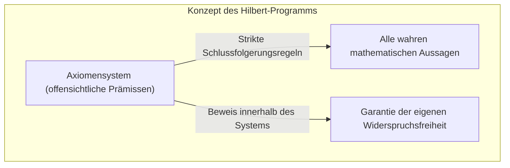
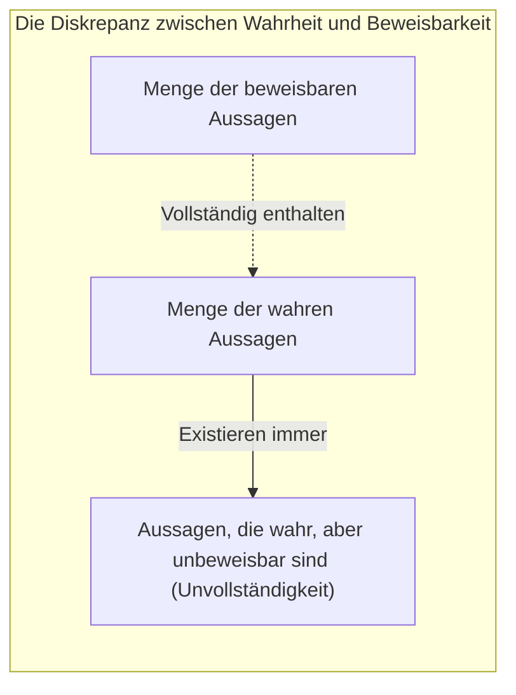
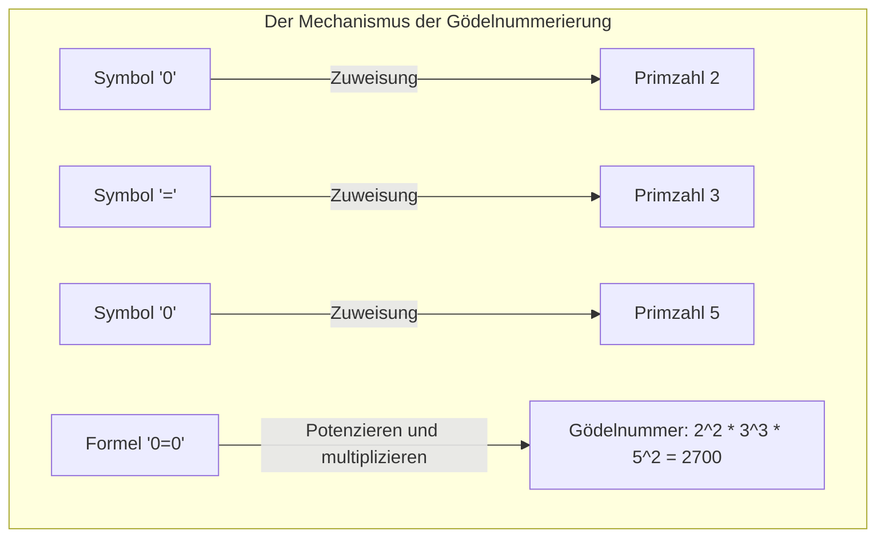
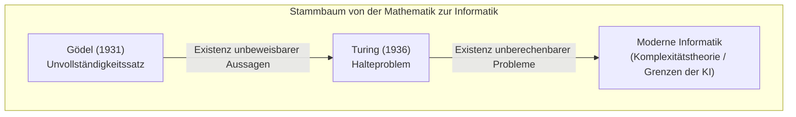

„Mathematik ist absolut korrekt“ ── Jeder hat wahrscheinlich schon einmal so gedacht. Aber eine von dem jungen Mathematiker [Kurt Gödel](https://kenji.blog/de/p/godel/) im Jahr 1931 veröffentlichte Arbeit hat diesen gesunden Menschenverstand grundlegend erschüttert. Dies sind **[Gödels Unvollständigkeitssätze](https://kenji.blog/de/p/godels-incompleteness-theorems/)**.

In diesem Artikel werden wir dieses schockierende Theorem, das besagt, dass es „absolut unbeweisbare Wahrheiten“ gibt, hinsichtlich seiner Bedeutung und der Funktionsweise seines Beweises mit konkreten Beispielen und Diagrammen ausführlich erklären.

---

## 1. Hintergrund: Das [Hilbert](https://kenji.blog/de/p/hilbert/)-Programm und die Krise der Mathematik

Vom späten 19. bis zum frühen 20. Jahrhundert sah sich die mathematische Welt mit den „Paradoxien der Mengenlehre (z. B. dem Russellschen Paradoxon)“ konfrontiert, was ihre Grundlagen erschütterte. [David Hilbert](https://kenji.blog/de/p/hilbert/), die höchste Autorität der damaligen mathematischen Welt, stand auf, um diese „Krise der Mathematik“ zu lösen.

[Hilbert](https://kenji.blog/de/p/hilbert/) versuchte, alle mathematischen Schlussfolgerungen vollständig zu symbolisieren und die Mathematik nur durch mechanische Regeln neu aufzubauen. Das von ihm vorgeschlagene „[Hilbert](https://kenji.blog/de/p/hilbert/)-Programm“ zielte darauf ab, in einem formalen System der Mathematik die folgenden drei Eigenschaften zu beweisen:

1. **Widerspruchsfreiheit** (Consistency): Es gibt keine Widersprüche im System (d. h. eine Aussage $P$ und ihre Verneinung $\neg P$ werden nicht beide bewiesen).
2. **Vollständigkeit** (Completeness): Jede mathematische Aussage kann innerhalb des Systems zwingend entweder als wahr oder falsch bewiesen werden.
3. **Entscheidbarkeit** (Decidability): Für jede gegebene Aussage gibt es ein mechanisches Verfahren, um zu bestimmen, ob sie beweisbar ist oder nicht.

[Hilbert](https://kenji.blog/de/p/hilbert/) hinterließ den berühmten Satz „Wir müssen wissen. Wir werden wissen.“ und glaubte fest daran, dass die Mathematik ein Schloss perfekter Logik werden könnte, das alles lösen kann.

## 2. Formale Systeme und Peano-Arithmetik

Um Gödels Theorem zu verstehen, wollen wir zunächst „formale Systeme“ und „grundlegende Arithmetik“ betrachten.

Ein formales System ist ein Satz von vordefinierten Zeichenfolgen (Symbolen) und Puzzle-Regeln (Schlussfolgerungsregeln) zu ihrer Manipulation. Dort ist keine „Bedeutung“ erforderlich, die Mathematik wird als reines Symbol-Transformationsspiel betrachtet.

Das Ziel von Gödels Theorem ist ein System, das „die Addition und Multiplikation natürlicher Zahlen“ einschließt. Ein repräsentatives Beispiel ist das Axiomensystem namens **Peano-Arithmetik** (PA). Die Peano-Arithmetik beginnt mit grundlegenden Regeln (Axiomen) wie „0 ist eine natürliche Zahl“ oder „Zu jeder natürlichen Zahl $x$ gibt es einen Nachfolger $S(x)$“.

Zum Beispiel ist die allseits bekannte Tatsache „ $1 + 1 = 2$ “ innerhalb des formalen Systems der Peano-Arithmetik nur ein „Theorem“, das durch Manipulation von Symbolen mechanisch abgeleitet wird.

[Hilbert](https://kenji.blog/de/p/hilbert/) dachte, dass wenn man solche formalen Systeme vergrößert, man irgendwann alle mathematischen Wahrheiten abdecken könnte.

## 3. Der Schock des Ersten Unvollständigkeitssatzes: Aussagen, die „wahr, aber nicht beweisbar“ sind

Aber 1931 veröffentlichte der damals erst 25-jährige [Kurt Gödel](https://kenji.blog/de/p/godel/) eine Arbeit, die [Hilbert](https://kenji.blog/de/p/hilbert/)s Traum zunichtemachte. Das ist der **Erste Unvollständigkeitssatz**.

> **Erster Unvollständigkeitssatz**
> In jedem widerspruchsfreien formalen System, das stark genug ist (um die Peano-Arithmetik zu enthalten), gibt es immer Aussagen, die wahr sind, aber innerhalb dieses Systems nicht bewiesen werden können.

Dieses Theorem zeigte, dass „Wahrheit“ und „Beweisbarkeit“ zwei völlig unterschiedliche Dinge sind. Es war unmöglich, alle Wahrheiten der mathematischen Welt mit der „Maschine“ des formalen Systems einzufangen.

### Die mathematische Übersetzung des Lügner-Paradoxons

Der Kern von Gödels Beweis liegt darin, in das formale System der Mathematik ein „Paradoxon der Selbstreferenz“ einzubauen.

Erinnern Sie sich an das seit dem antiken Griechenland bekannte „Lügner-Paradoxon“.
„Dieser Satz ist eine Lüge.“
Wenn dieser Satz wahr ist, ist der Inhalt eine „Lüge“. Wenn er eine Lüge ist, ist der Inhalt „wahr“.

Gödel brachte eine ähnliche Logik in die Mathematik ein und konstruierte eine Aussage $G$ durch mathematische Formeln wie folgt:

**Aussage $G$**: „Diese Aussage $G$ ist in diesem System nicht beweisbar.“

Nehmen wir an, das formale System könnte diese Aussage $G$ beweisen. Das würde bedeuten, dass es eine Aussage bewiesen hätte, die behauptet „nicht beweisbar“ zu sein, womit das System widersprüchlich wäre. Wenn man unter der Prämisse steht, dass es „widerspruchsfrei“ ist, kann das System die Aussage $G$ niemals beweisen.

Nun, hier beginnt Gödels Magie. Aussage $G$ konnte innerhalb des Systems nicht bewiesen werden. Aber Aussage $G$ ist genau der Satz, der behauptet, er sei „nicht beweisbar“. Da es sich genau so verhält, wie es behauptet, kann man aus einer äußeren Perspektive schlussfolgern, dass Aussage $G$ **wahr** ist.

So wurde eine Aussage geboren, die „wahr ist, obwohl sie nicht bewiesen werden kann“.

## 4. Gödelisierung: Die geniale Idee, Formeln in Zahlen zu übersetzen

Wie drückt man einen deutschen (oder japanischen) Satz wie „Diese Aussage ist nicht beweisbar“ in der Peano-Arithmetik aus, die nur Addition und Multiplikation hat? Hier erfand Gödel die Methode der **Gödelnummerierung** (Gödel numbering).

Gödel wies jedem in Formeln verwendeten Symbol ($\neg$, $\vee$, $\exists$, $0$, $=$ usw.) eine eindeutige Zahl (Primzahl) zu. Dann nutzte er die Eindeutigkeit der Primfaktorzerlegung (die Eigenschaft, dass jede natürliche Zahl auf genau eine Weise in ein Produkt von Primzahlen zerlegt werden kann), um die Zeichenfolge einer Formel in eine riesige natürliche Zahl zu übersetzen.

Mit dieser Methode kann sogar der gesamte „Beweisprozess“ wie „Formel $A$ ist ein Beweis für Formel $B$“ in ein reines Arithmetikproblem (Eigenschaften großer Zahlen, z.B. ob eine Zahl durch eine andere teilbar ist) umgewandelt werden.

Das bedeutet, dass er eine Sprache, in der die Mathematik über „ihren eigenen Beweis“ sprechen kann (Selbstreferenz), in den Eigenschaften der natürlichen Zahlen versteckte. Das ist die gleiche Idee wie bei modernen Computern, die Bilder und Programme in „Folgen von 0- und 1-Zahlen“ kodieren und verarbeiten. Gödel erreichte dieses Konzept lange vor der Erfindung von Computern.

## 5. Der Zweite Unvollständigkeitssatz: Die Verzweiflung, die eigene Richtigkeit nicht beweisen zu können

Der Erste Unvollständigkeitssatz allein erschütterte bereits die mathematische Welt, aber Gödels Papier enthielt eine noch erschreckendere Schlussfolgerung. Dies ist der **Zweite Unvollständigkeitssatz**.

> **Zweiter Unvollständigkeitssatz**
> Ein widerspruchsfreies formales System (das stark genug ist) kann seine eigene Widerspruchsfreiheit nicht innerhalb des Systems beweisen.

[Hilbert](https://kenji.blog/de/p/hilbert/) hatte versucht zu beweisen, dass die Mathematik widerspruchsfrei ist, indem er die Mittel der Mathematik selbst nutzte (die wichtigste Aufgabe des [Hilbert](https://kenji.blog/de/p/hilbert/)-Programms). Aber der Zweite Unvollständigkeitssatz deklarierte: „Kein System kann durch seine eigene Kraft beweisen, dass es nicht verrückt (widersprüchlich) ist.“

Um dies intuitiv zu verstehen, denken wir so:
Wenn jemand behauptet: „Ich lüge nie!“. Aber wir können nicht allein auf der Grundlage seiner Worte beweisen, dass „diese Person kein Lügner ist“. Denn wenn diese Person ein Lügner wäre, könnte die Aussage „Ich lüge nie“ selbst eine Lüge sein.

Das gilt auch für die Mathematik: Selbst wenn ein Axiomensystem die Formel „Ich bin widerspruchsfrei ( $Con(F)$ )“ selbst ableiten könnte, hätte dieser Beweis keinen Wert, wenn das System bereits widersprüchlich wäre, da dann alle Aussagen (ob richtig oder falsch) bewiesen werden könnten.

Der Zweite Unvollständigkeitssatz zeigte die entscheidende Grenze auf, dass es unmöglich ist, die „absolute Gewissheit“ der Mathematik innerhalb der Mathematik selbst zu beweisen.

## 6. Häufige Missverständnisse über die Unvollständigkeitssätze

[Gödels Unvollständigkeitssätze](https://kenji.blog/de/p/godels-incompleteness-theorems/) werden aufgrund ihres dramatischen Namens oft fälschlicherweise in philosophischen, weltanschaulichen oder okkulten Kontexten verwendet. Hier klären wir typische Missverständnisse auf.

- **Missverständnis 1: „Die Mathematik ist zusammengebrochen“**
  - **Fakt**: Die Unvollständigkeitssätze bedeuten nicht den Zusammenbruch der Mathematik. Sie offenbarten vielmehr die Natur der formalen Logik, dass „ein bestimmtes fixes Axiomensystem allein nicht alle Wahrheiten erfassen kann“. Mathematiker haben neue, mächtigere Systeme geschaffen und die Forschung weiterentwickelt, indem sie bei Bedarf neue Axiome hinzufügten (z. B. das Auswahlaxiom oder Axiome über große Kardinalzahlen).
- **Missverständnis 2: „Die menschliche Vernunft hat Grenzen“**
  - **Fakt**: Das Theorem zeigt die Grenzen für „ein System, das im Voraus festgelegten mechanischen Regeln folgt (formales System)“. Beim Ersten Unvollständigkeitssatz konnten wir aus einer äußeren Perspektive erkennen, dass Aussage $G$ „wahr“ ist. Einige Gelehrte (wie Roger Penrose) interpretieren dies als Beweis dafür, dass die menschliche Vernunft die Fähigkeit hat, eine „Bedeutung (Semantik)“ zu verstehen, die über mechanische formale Systeme hinausgeht.
- **Missverständnis 3: „Es gibt für alles Dinge, die man nicht beweisen kann“**
  - **Fakt**: Die Unvollständigkeitssätze gelten nur für ausreichend komplexe Systeme, die die „Addition und Multiplikation natürlicher Zahlen (Peano-Arithmetik)“ enthalten. Beispielsweise sind die euklidische Geometrie oder die elementare Theorie der reellen Zahlen vollständig, und alle wahren Aussagen sind beweisbar. Unvollständigkeit tritt nur dann auf, wenn das Ziel eine ausreichend komplexe Struktur hat (eine Struktur, die Selbstreferenz ermöglicht).

## 7. Die Übergabe an die Turingmaschine: Der Beginn der Informatik

Die Auswirkungen von Gödels Theorem beschränkten sich nicht auf die Mathematik. 1936 übertrug der britische Mathematiker [Alan Turing](https://kenji.blog/de/p/turing/) Gödels Konzept des „formalen Systems“ auf physische Rechenprozesse und erdachte ein virtuelles Computermodell namens „Turingmaschine“.

Turing wandte Gödels Unvollständigkeitssatz auf die Welt der Computer an und bewies: „Es gibt keinen universellen Algorithmus, der im Voraus bestimmen kann, ob ein Computerprogramm jemals anhalten wird.“ Dies ist das berühmte **[Halteproblem](https://kenji.blog/de/p/turing-machine-computability/)** ([Halting Problem](https://kenji.blog/de/p/turing-machine-computability/)).

Die Grenze der Mathematik, dass es „unbeweisbare Wahrheiten“ gibt, verwandelte sich auf brillante Weise in die Computergrenze der „unberechenbaren Probleme“ und lebt heute als Grundlage der modernen Programmier- und Algorithmentheorie weiter.

## 8. Fazit: Die unendliche Reise des „Wissens“

[David Hilbert](https://kenji.blog/de/p/hilbert/)s Traum von einer „perfekten mathematischen Maschine, die alles automatisch beweisen kann“ wurde durch [Gödels Unvollständigkeitssätze](https://kenji.blog/de/p/godels-incompleteness-theorems/) zerstört. Aber das bedeutete keineswegs eine Niederlage der Mathematik.

Wenn Mathematik vollständig mechanisierbar wäre, wäre die Arbeit von Mathematikern bloße Routine geworden und hätte irgendwann geendet. Die von Gödel aufgezeigte Existenz von „Aussagen, die unbeweisbar, aber wahr sind“, bewies jedoch, dass das Universum der Mathematik weitaus reicher ist und eine unerschöpfliche Tiefe besitzt, als wir uns vorstellen konnten.

[Kurt Gödel](https://kenji.blog/de/p/godel/) bewies die Existenz „absolut unbeweisbarer Wahrheiten“ durch das präziseste Mittel der Logik: die Mathematik selbst. Seine Unvollständigkeitssätze lehren uns, dass die menschliche Suche nach Wissen eine unendliche Reise ist.
