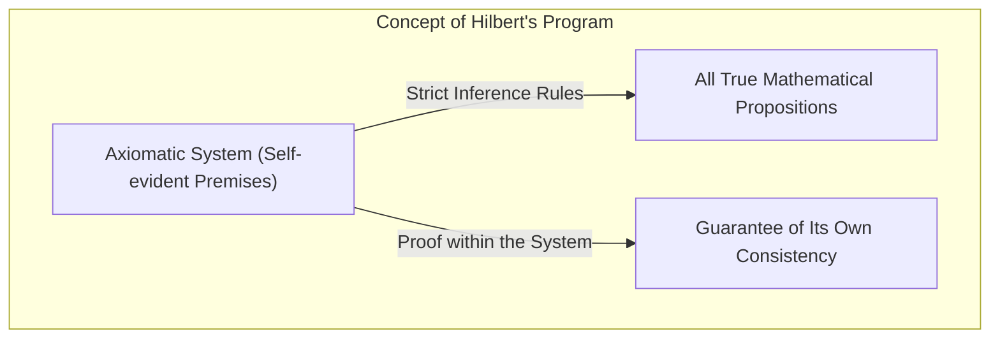
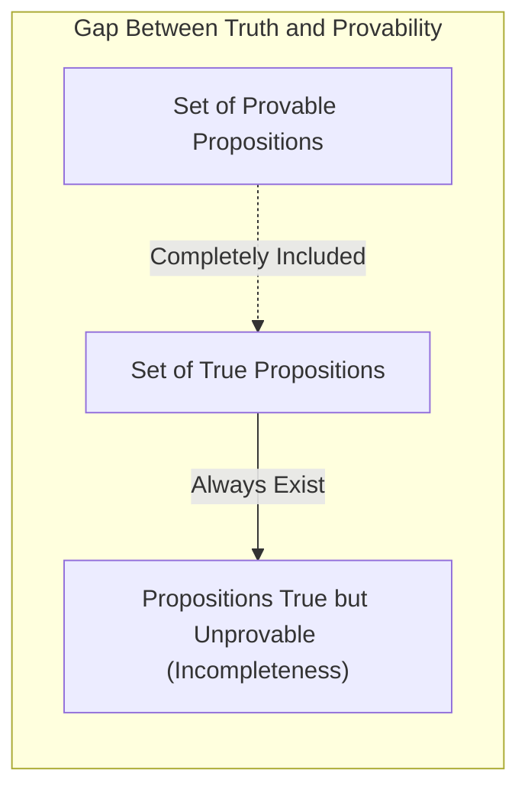
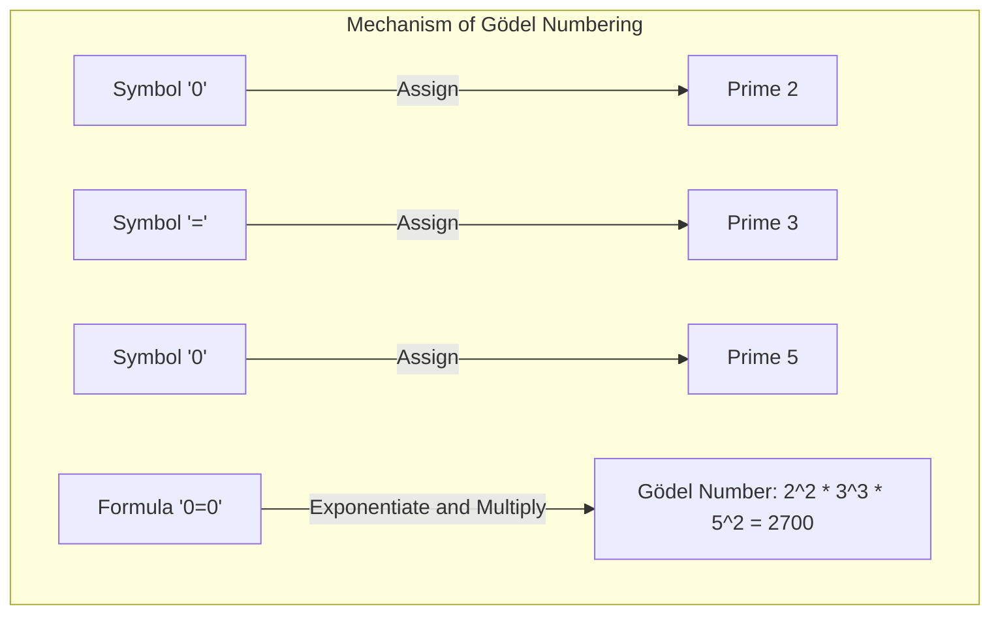
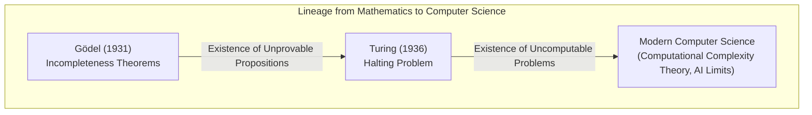

"Mathematics is absolutely correct" ── Everyone has probably thought this at least once. However, a single paper published in 1931 by the young mathematician [Kurt Gödel](https://kenji.blog/en/p/godel/) completely overturned this common sense from its very foundation. That is **[Gödel's Incompleteness Theorems](https://kenji.blog/en/p/godels-incompleteness-theorems/)**.

In this article, we will thoroughly explain this shocking theorem, which states that there exist "truths that can never be proven," including its meaning and how the proof works, incorporating concrete examples and diagrams.

---

## 1. Stage Background: [Hilbert](https://kenji.blog/en/p/hilbert/)'s Program and the Crisis of Mathematics

From the end of the 19th century to the beginning of the 20th century, the world of mathematics faced "paradoxes of set theory (such as Russell's paradox)," and its foundation was shaken. It was [David Hilbert](https://kenji.blog/en/p/hilbert/), the highest authority in the mathematics world at the time, who stood up to save this "crisis of mathematics."

[Hilbert](https://kenji.blog/en/p/hilbert/) attempted to completely symbolize all mathematical reasoning and reconstruct mathematics solely with mechanical rules. The "[Hilbert](https://kenji.blog/en/p/hilbert/)'s Program" he advocated aimed to prove the following three properties in the Formal System of mathematics:

1. **[Consistency](https://kenji.blog/en/p/cap-theorem-distributed-systems-tradeoff/)**: That there are no contradictions within the system (that a certain proposition $P$ and its negation $\neg P$ are not both proven).
2. **Completeness**: That any mathematical proposition can always be proven either true or false within that system.
3. **Decidability**: That when an arbitrary proposition is given, there exists a mechanical procedure to determine whether it can be proven.

[Hilbert](https://kenji.blog/en/p/hilbert/) left behind the famous words, "We must know. We will know. (Wir müssen wissen. Wir werden wissen.)," and believed without a doubt that mathematics would become a perfect castle of logic that could solve everything.

## 2. Formal Systems and Peano Arithmetic

To understand Gödel's theorems, let's first touch upon "Formal Systems" and "Basic Arithmetic."

A formal system is a set of predetermined character strings (symbols) and puzzle rules (inference rules) that manipulate them. No "meaning" is necessary there, and it views mathematics as a mere symbol transformation game.

The subject of Gödel's theorems are systems that include "addition and multiplication of natural numbers." A representative example is an axiomatic system called **Peano Arithmetic (PA)**. Peano Arithmetic starts from basic rules (axioms) such as "0 is a natural number" and "for a certain natural number $x$, its successor $S(x)$ exists."

For example, the widely known fact that "$1 + 1 = 2$" is merely one "theorem" that is mechanically derived by the manipulation of symbols within the formal system of Peano Arithmetic.

[Hilbert](https://kenji.blog/en/p/hilbert/) thought that if we expanded such formal systems, we could eventually encompass all mathematical truths.

## 3. The Shock of the First Incompleteness Theorem: "True but Unprovable" Propositions

However, in 1931, [Kurt Gödel](https://kenji.blog/en/p/godel/), who was only 25 years old at the time, published a paper that shattered [Hilbert](https://kenji.blog/en/p/hilbert/)'s dream to pieces. That is the **First Incompleteness Theorem**.

> **First Incompleteness Theorem** 
> In any consistent formal system that includes Peano Arithmetic, there will always exist propositions that are true but cannot be proven within that system.

This theorem showed that "truth" and "provability" are completely different things. It was impossible to capture all truths of the mathematical world with a "machine" called a formal system.

### Mathematical Translation of the Liar Paradox

The core of Gödel's proof lies in having created a "paradox of self-reference" within the formal system of mathematics.

Recall the "Liar Paradox" known since ancient Greece.
"This sentence is a lie."
If this sentence is correct, its content becomes a "lie." If it is a lie, its content becomes "correct."

Gödel brought a similar logic into mathematics and constructed the following proposition $G$ using formulas:

**Proposition $G$**: "This proposition $G$ cannot be proven within this system."

Suppose the formal system could prove this proposition $G$. That would mean it proved a proposition asserting that it "cannot be proven," causing a contradiction in the system. If we stand on the major premise that "it is consistent," the system can never prove proposition $G$.

Now, here is Gödel's magic. Proposition $G$ could not be proven within the system. However, proposition $G$ is a sentence that asserts exactly that it "cannot be proven." Because it is in the exact state it asserts, from an outside perspective, we can conclude that proposition $G$ is **true**.

In this way, a proposition that is "true yet unprovable" was born.

## 4. Gödel Numbering: A Genius Idea to Convert Formulas into Numbers

How do you express a Japanese sentence like "This proposition cannot be proven" within Peano Arithmetic, which only has addition and multiplication? Here, Gödel invented a method called **Gödel numbering**.

Gödel assigned a unique number (a prime number) to all symbols used in formulas ($\neg$, $\vee$, $\exists$, $0$, $=$, etc.). Then, using the uniqueness of prime factorization (the property that any natural number can be factored into a product of prime numbers in exactly one way), he converted strings of formulas into a single huge natural number.

Using this method, even the entire "process of proof," such as "Formula $A$ is a proof of Formula $B$," can be substituted into a mere arithmetic problem about the properties of huge numbers (such as whether one number is divisible by another).

In other words, he hid a language for mathematics to talk about "its own proofs" (to self-reference) inside the properties of natural numbers. This is the exact same concept as modern computers processing images and programs by encoding them all into "strings of 0 and 1 numbers," and Gödel arrived at this concept long before computers were born.

## 5. Second Incompleteness Theorem: The Despair of Not Being Able to Prove One's Own Correctness

The First Incompleteness Theorem alone shocked the mathematics world, but Gödel's paper contained an even more terrifying conclusion. That is the **Second Incompleteness Theorem**.

> **Second Incompleteness Theorem** 
> A consistent formal system that includes Peano Arithmetic cannot prove its own consistency within that system.

[Hilbert](https://kenji.blog/en/p/hilbert/) tried to prove that mathematics is consistent using the power of mathematics itself (the most important task of [Hilbert](https://kenji.blog/en/p/hilbert/)'s Program). However, the Second Incompleteness Theorem declared that "no system can prove by its own power that it is not insane (not contradictory)."

To understand this intuitively, let's think about it like this:
Suppose someone claims, "I absolutely never tell a lie!" However, we cannot prove that "this person is not a liar" based solely on their words. Because if that person is a liar, the statement "I absolutely never tell a lie" itself might be a lie.

Mathematics is the same; even if an axiomatic system could derive a formula by itself saying "I am consistent ($Con(F)$)," if that system is already contradictory, it would be able to prove any proposition (both correct and incorrect things), so that proof of "I am consistent" has no value whatsoever.

The Second Incompleteness Theorem showed a definitive limit that it is impossible for mathematics to self-prove "absolute certainty" from within mathematics.

## 6. Common Misunderstandings About the Incompleteness Theorems

Because of its dramatic name, Gödel's Incompleteness Theorem is often misused in philosophical, ideological, or occult contexts. Let's clear up some representative misunderstandings here.

- **Misunderstanding 1: "Mathematics has collapsed."**
  - **Fact**: The Incompleteness Theorem does not mean the collapse of mathematics. Rather, it revealed a property of formal logic that "a single fixed axiomatic system alone cannot capture all truths." Mathematicians continue to develop their research by creating more powerful systems through adding new axioms as necessary (for example, the "Axiom of Choice" or "Large Cardinal Axioms").
- **Misunderstanding 2: "Human reason has limits."**
  - **Fact**: The limit the theorem points to is about "systems (formal systems) that follow predetermined mechanical rules." In the First Incompleteness Theorem, we could see from an outside perspective that proposition $G$ is "true." Some scholars (like Roger Penrose) take this as evidence that human reason has the ability to understand "meaning (semantics)" that transcends mechanical formal systems.
- **Misunderstanding 3: "There are things that cannot be proven about anything."**
  - **Fact**: The Incompleteness Theorem applies only to sufficiently complex systems that include "addition and multiplication of natural numbers (Peano Arithmetic)." For example, "[Euclide](https://kenji.blog/p/euclid/)an geometry" or the "first-order theory of real numbers" are complete, and all true propositions are provable. Incompleteness only arises when the subject has a sufficiently complex structure (a structure that enables self-reference).

## 7. Baton to the [Turing Machine](https://kenji.blog/en/p/turing-machine-computability/): The Dawn of Computer Science

The impact brought by Gödel's theorems was not confined to the framework of mathematics. In 1936, the British mathematician [Alan Turing](https://kenji.blog/en/p/turing/) replaced Gödel's concept of a "formal system" with a physical computational process and devised a hypothetical computational machine model called the "[Turing Machine](https://kenji.blog/en/p/turing-machine-computability/)."

Turing applied Gödel's Incompleteness Theorem to the world of computers and proved that "there is no universal algorithm that can determine in advance whether any computer program will never finish calculating." This is the famous **[Halting Problem](https://kenji.blog/en/p/turing-machine-computability/)**.

The mathematical limit that "there are unprovable truths" beautifully transformed into the computer limit that "there are uncomputable problems," and it continues to live on as the foundation of modern programming and algorithm theory.

## 8. Conclusion: The Endless Journey of "Knowing"

The "perfect mathematical machine that can automatically prove everything" dreamt of by [David Hilbert](https://kenji.blog/en/p/hilbert/) ended up as an illusion due to [Gödel's Incompleteness Theorems](https://kenji.blog/en/p/godels-incompleteness-theorems/). However, that by no means signifies the defeat of mathematics.

If mathematics could be completely mechanized, the work of mathematicians would have become mere labor, and it would have met its end eventually. However, the existence of "propositions that are true but cannot be proven" shown by Gödel proved that the universe of mathematics is far richer than we imagine and possesses an inexhaustible depth.

[Kurt Gödel](https://kenji.blog/en/p/godel/) **proved** the existence of "truths that can never be proven" by the hands of mathematics itself, which is the strictest logic. His Incompleteness Theorems teach us that the human quest for "knowing" is an endless journey that continues forever.
