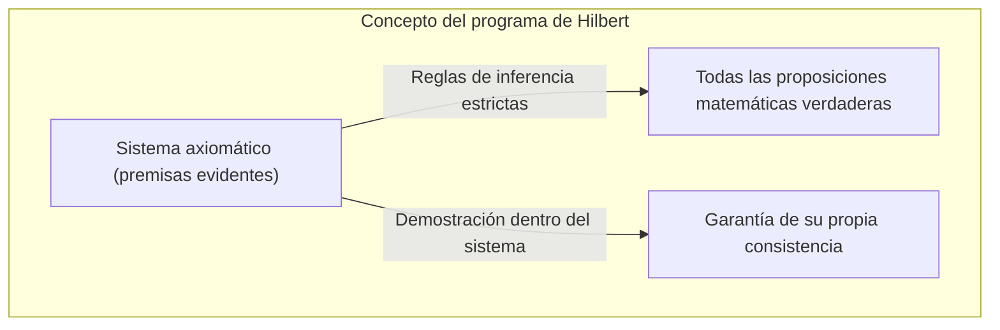
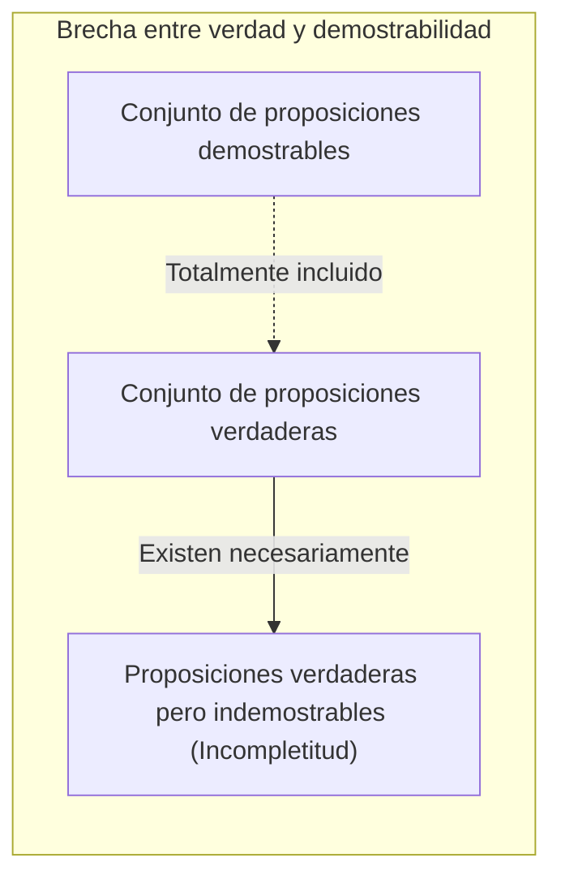
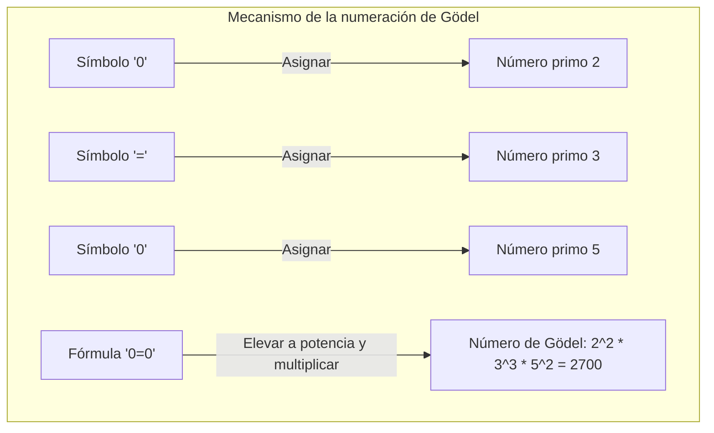
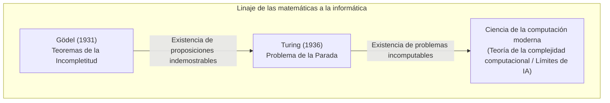

"Las matemáticas son absolutamente correctas"── Seguramente todos hemos pensado eso alguna vez. Sin embargo, en 1931, el joven matemático [Kurt Gödel](https://kenji.blog/es/p/godel/) publicó un artículo que destrozó este sentido común desde sus cimientos. Estos son los **[Teoremas de la incompletitud de Gödel](https://kenji.blog/es/p/godels-incompleteness-theorems/)**.

En este artículo explicaremos exhaustivamente el significado y la estructura de la demostración de este impactante teorema, que declara la existencia de "verdades que son absolutamente imposibles de demostrar", con la ayuda de ejemplos y diagramas.

---

## 1. El escenario: El Programa de [Hilbert](https://kenji.blog/es/p/hilbert/) y la crisis de las matemáticas

Desde finales del siglo XIX hasta principios del XX, el mundo de las matemáticas enfrentaba la "paradoja de la teoría de conjuntos" (como la paradoja de Russell) y sus bases temblaban. Quien se alzó para salvar esta "crisis de las matemáticas" fue la máxima autoridad matemática de la época, [David Hilbert](https://kenji.blog/es/p/hilbert/).

[Hilbert](https://kenji.blog/es/p/hilbert/) intentó simbolizar completamente todo el razonamiento matemático y reconstruir las matemáticas únicamente mediante reglas mecánicas. Lo que su propuesto "Programa de [Hilbert](https://kenji.blog/es/p/hilbert/)" buscaba era demostrar las siguientes 3 propiedades dentro de un Sistema Formal (Formal System) para las matemáticas:

1. **Consistencia** (Consistency): Que no haya contradicciones dentro del sistema (es decir, que una proposición $P$ y su negación $\neg P$ no puedan ser demostradas a la vez).
2. **Completitud** (Completeness): Que cualquier proposición matemática pueda ser forzosamente demostrada como verdadera o falsa dentro del sistema.
3. **Decidibilidad** (Decidability): Que dada cualquier proposición, exista un procedimiento mecánico para determinar si es demostrable o no.

[Hilbert](https://kenji.blog/es/p/hilbert/) creía firmemente, y dejó para la posteridad su famosa frase "Debemos saber, y sabremos" (*Wir müssen wissen. Wir werden wissen.*), que las matemáticas podrían convertirse en un castillo de lógica perfecta capaz de resolverlo todo.

## 2. Los sistemas formales y la Aritmética de Peano

Para comprender el teorema de Gödel, hablemos primero sobre "sistemas formales" y "aritmética básica".

Un sistema formal es un conjunto de reglas, como un juego de rompecabezas (reglas de inferencia), que manipula cadenas de caracteres (símbolos) predefinidas. En ellos, no se requiere ningún "significado", y se conciben las matemáticas simplemente como un juego de transformación de símbolos.

El objeto del teorema de Gödel son aquellos sistemas que incluyen "sumas y multiplicaciones de números naturales". El ejemplo más representativo es el sistema axiomático llamado **Aritmética de Peano** (Peano Arithmetic, PA). En la aritmética de Peano, todo comienza con reglas básicas (axiomas) como "0 es un número natural" o "para todo número natural $x$, existe su sucesor $S(x)$".

Por ejemplo, el hecho de que "$1 + 1 = 2$", que todos conocemos, dentro del sistema formal de la aritmética de Peano, no es más que un "teorema" derivado mecánicamente mediante manipulaciones simbólicas.

[Hilbert](https://kenji.blog/es/p/hilbert/) pensó que si expandía estos sistemas formales, algún día se abarcarían todas las verdades matemáticas.

## 3. El impacto del Primer Teorema de Incompletitud: Proposiciones "verdaderas pero no demostrables"

Sin embargo, en 1931, [Kurt Gödel](https://kenji.blog/es/p/godel/), de solo 25 años en ese entonces, publicó un documento que hizo añicos el sueño de [Hilbert](https://kenji.blog/es/p/hilbert/). Este es el **Primer Teorema de Incompletitud**.

> **Primer Teorema de Incompletitud**
> Cualquier sistema formal consistente que incluya la aritmética de Peano, contendrá forzosamente proposiciones que, a pesar de ser verdaderas, no pueden ser demostradas dentro de ese sistema.

Este teorema demostró que la "verdad" y la "demostrabilidad" son cosas completamente distintas. Con esa "máquina" llamada sistema formal, era imposible atrapar todas las verdades del mundo de las matemáticas.

### Traducción matemática de la paradoja del mentiroso

El núcleo de la demostración de Gödel consiste en haber recreado la "paradoja de la autorreferencia" dentro del sistema formal de las matemáticas.

Recuerden la "paradoja del mentiroso", conocida desde la antigua Grecia.
"Esta oración es mentira".
Si esta afirmación fuera cierta, su contenido sería una "mentira". Si fuera mentira, su contenido sería "cierto".

Gödel aplicó una lógica similar a las matemáticas y formuló la siguiente proposición $G$ usando fórmulas matemáticas:

 **Proposición $G$**: "Esta proposición $G$ no puede ser demostrada en este sistema"

Supongamos que el sistema formal pudiera demostrar esta proposición $G$. Esto significaría que ha demostrado una proposición que afirma "no puedo ser demostrada", y el sistema entraría en contradicción. Si partimos de la premisa fundamental de que "el sistema es consistente", entonces el sistema nunca podrá demostrar la proposición $G$.

Aquí es donde entra la magia de Gödel. La proposición $G$ no pudo ser demostrada dentro del sistema. Sin embargo, la proposición $G$ es precisamente la oración que afirma "no puede ser demostrada". Dado que la situación es exactamente la que afirma ser, desde una perspectiva externa, podemos concluir que la proposición $G$ es **verdadera**.

Y así, nació una proposición que es "verdadera a pesar de no poder ser demostrada".

## 4. La Numeración de Gödel: Una idea genial para convertir fórmulas en números

¿Cómo se puede expresar la frase (en lenguaje natural) "esta proposición no puede ser demostrada" dentro de la aritmética de Peano, que solo tiene sumas y multiplicaciones? Lo que Gödel inventó aquí fue un método llamado **Numeración de Gödel** (Gödel numbering).

Gödel asignó un número específico (un número primo) a todos los símbolos utilizados en las fórmulas matemáticas (como $\neg$, $\vee$, $\exists$, $0$, $=$, etc.). Luego, utilizando la unicidad de la factorización en números primos (la propiedad por la cual cualquier número natural se puede descomponer de una sola forma en factores primos), transformó la cadena de caracteres de la fórmula en un único número gigantesco.

Usando este método, todo el "proceso de demostración", del tipo "la fórmula $A$ es la prueba de la fórmula $B$", se puede reducir a un simple problema de aritmética sobre propiedades de números enormes (como si un número es divisible por otro).

En pocas palabras, ocultó dentro de las propiedades de los números naturales el lenguaje para que las matemáticas hablaran (se autorreferenciaran) sobre su "propia demostración". Esta misma idea es la que utilizan las computadoras modernas al codificar todas las imágenes y programas en "secuencias de números 0 y 1" para procesarlos, y Gödel llegó a este concepto mucho antes de que existieran las computadoras.

## 5. El Segundo Teorema de Incompletitud: La desesperación de no poder demostrar la propia corrección

El Primer Teorema de Incompletitud por sí solo ya sacudió el mundo de las matemáticas, pero el artículo de Gödel contenía una conclusión aún más aterradora. Este es el **Segundo Teorema de Incompletitud**.

> **Segundo Teorema de Incompletitud**
> Un sistema formal consistente, que incluya la aritmética de Peano, no puede demostrar su propia consistencia dentro de ese mismo sistema.

[Hilbert](https://kenji.blog/es/p/hilbert/) había intentado probar que las matemáticas eran consistentes utilizando el propio poder de las matemáticas (el objetivo principal del programa de [Hilbert](https://kenji.blog/es/p/hilbert/)). Sin embargo, el Segundo Teorema de Incompletitud decretó que "ningún sistema puede demostrar por sí mismo que no está loco (que no tiene contradicciones)".

Para entender esto de forma intuitiva, considerémoslo de la siguiente manera:
Supongamos que alguien afirma: "¡Yo nunca miento!". Sin embargo, basándonos solo en las palabras de esa persona, no podemos probar que "esta persona no es un mentiroso". Porque, si esa persona fuera un mentiroso, la declaración "nunca miento" en sí misma podría ser mentira.

Las matemáticas funcionan igual. Incluso si un sistema axiomático puede derivar la fórmula "Yo soy consistente ($Con(F)$)", si ese sistema ya era contradictorio, podría demostrar cualquier proposición (tanto cosas correctas como incorrectas). Por lo tanto, esa demostración de "yo soy consistente" carecería por completo de valor.

El Segundo Teorema de Incompletitud mostró un límite decisivo: es imposible que las matemáticas demuestren su "certeza absoluta" desde dentro de las propias matemáticas.

## 6. Malentendidos comunes sobre el Teorema de la Incompletitud

Debido a su nombre dramático, a menudo el Teorema de Incompletitud de Gödel se utiliza incorrectamente en contextos filosóficos, ideológicos u ocultistas. Vamos a aclarar aquí los malentendidos más comunes.

- **Malentendido 1: "Las matemáticas han fracasado"**
  - **La realidad**: El teorema de incompletitud no significa el fracaso de las matemáticas. Al contrario, dejó clara una propiedad de la lógica formal: "no se pueden capturar todas las verdades utilizando solo un sistema axiomático fijo y particular". Los matemáticos continúan desarrollando y estudiando sistemas cada vez más fuertes agregando nuevos axiomas cuando es necesario (como el "Axioma de elección" o los "Axiomas de cardinales grandes").
- **Malentendido 2: "Hay límites a la razón humana"**
  - **La realidad**: El límite que muestra el teorema se aplica a los "sistemas que siguen reglas mecánicas predeterminadas (sistemas formales)". En el Primer Teorema de Incompletitud, desde una perspectiva externa, pudimos deducir que la proposición $G$ "es verdadera". Algunos académicos (como Roger Penrose) argumentan que esto es prueba de que la razón humana tiene la capacidad de comprender "el significado (semántica)" que va más allá de un sistema formal y mecánico.
- **Malentendido 3: "Existen cosas que nunca podrán ser demostradas bajo ninguna circunstancia"**
  - **La realidad**: El teorema de incompletitud solo se aplica a sistemas que son lo suficientemente complejos como para incluir "sumas y multiplicaciones de números naturales (aritmética de Peano)". Por ejemplo, la "geometría euclidiana" o "la teoría de primer orden de los números reales" son completas, y todas sus proposiciones verdaderas pueden ser demostradas. La incompletitud solo surge cuando el objeto tiene una estructura lo suficientemente compleja (que permite la autorreferencia).

## 7. El paso de la antorcha a la Máquina de Turing: El amanecer de las Ciencias de la Computación

El impacto del teorema de Gödel no se limitó a las matemáticas. En 1936, el matemático británico [Alan Turing](https://kenji.blog/es/p/turing/) reemplazó el concepto de "sistema formal" de Gödel por un proceso de cálculo físico, ideando un modelo de calculadora teórica conocido como "Máquina de Turing".

Turing aplicó el teorema de incompletitud de Gödel al mundo de las computadoras y demostró que "no existe un algoritmo universal que pueda determinar de antemano si un programa de ordenador terminará de ejecutarse algún día o se quedará calculando eternamente". Este es el famoso **Problema de la parada** ([Halting Problem](https://kenji.blog/es/p/turing-machine-computability/)).

Los límites de las matemáticas que decían que "hay verdades que no se pueden demostrar", se transformaron brillantemente en los límites de las computadoras que dicen que "hay problemas que no se pueden calcular", manteniéndose vivos hasta hoy como los cimientos de la programación moderna y la teoría de los algoritmos.

## 8. Conclusión: Un viaje sin fin hacia el "conocimiento"

La "máquina matemática perfecta, capaz de demostrarlo todo automáticamente" con la que soñaba [David Hilbert](https://kenji.blog/es/p/hilbert/), resultó ser solo una ilusión debido a los teoremas de incompletitud de Gödel. Sin embargo, esto no representa de ninguna manera la derrota de las matemáticas.

Si las matemáticas pudieran automatizarse por completo, el trabajo de los matemáticos habría quedado reducido a meras tareas operativas y eventualmente habrían llegado a su fin. Pero, la existencia de "proposiciones que son verdaderas pero indemostrables" revelada por Gödel, comprobó que el universo de las matemáticas es infinitamente más vasto e insondable de lo que podríamos haber imaginado.

[Kurt Gödel](https://kenji.blog/es/p/godel/), quien usando la lógica más estricta que existe —las propias matemáticas—, logró **demostrar** la existencia de "verdades que nunca podrán ser demostradas". Su Teorema de Incompletitud nos enseña que la búsqueda humana del "conocimiento" es un viaje sin retorno, que continuará para toda la eternidad.
