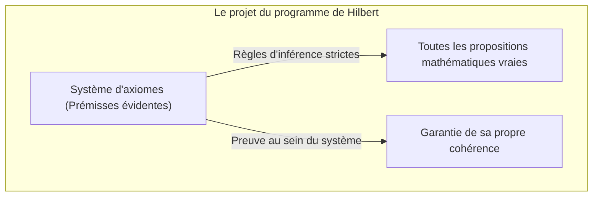
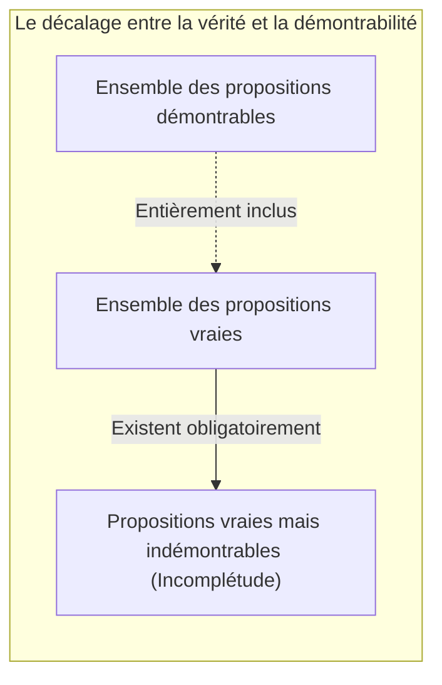
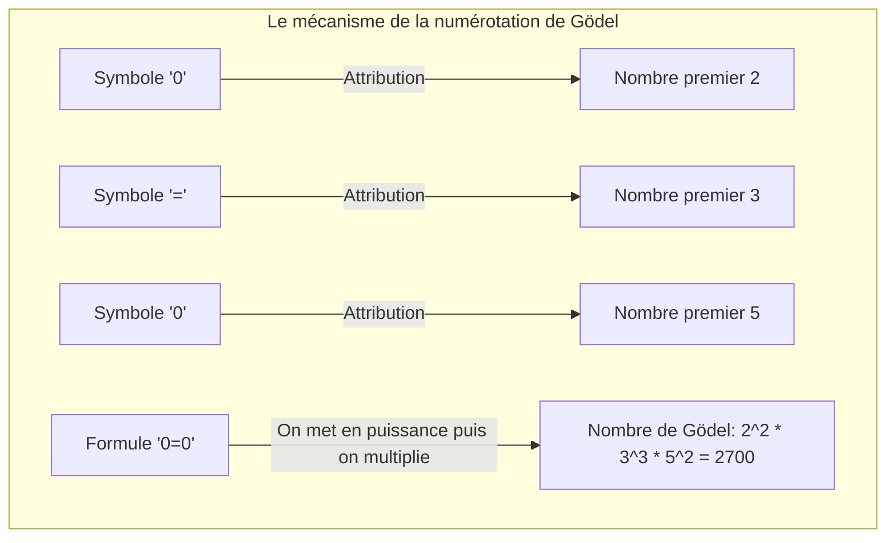
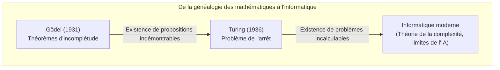

« Les mathématiques sont absolument exactes » — tout le monde l'a probablement pensé au moins une fois. Pourtant, en 1931, un article publié par le jeune mathématicien [Kurt Gödel](https://kenji.blog/p/godel/) a fondamentalement bouleversé ce bon sens. Ce sont les **théorèmes d'incomplétude de Gödel**.

Dans cet article, nous allons expliquer de manière approfondie et claire la signification de ce théorème troublant qui affirme qu'il existe « des vérités qui ne peuvent absolument pas être prouvées », ainsi que les mécanismes de sa démonstration, à grand renfort d'exemples concrets et de schémas.

---

## 1. Contexte : Le programme de Hilbert et la crise des fondements des mathématiques

De la fin du 19ème siècle au début du 20ème siècle, le monde des mathématiques était confronté aux « paradoxes de la théorie des ensembles (comme le paradoxe de Russell) » ; les fondations de la discipline en étaient ébranlées. C'est [David Hilbert](https://kenji.blog/p/hilbert/), l'autorité suprême des mathématiques à l'époque, qui s'est levé pour sauver les mathématiques de cette crise.

Hilbert a tenté de symboliser intégralement tous les raisonnements mathématiques, dans l'espoir de reconstruire les mathématiques en n'utilisant que des règles mécaniques. L'objectif de son « Programme de Hilbert » était de prouver que, dans un système formel mathématique, les trois propriétés suivantes étaient réunies :

1. **La cohérence** (Consistency) : Le fait qu'il n'existe aucune contradiction au sein du système (c'est-à-dire qu'une proposition $P$ et sa négation $\neg P$ ne puissent pas être prouvées toutes les deux).
2. **La complétude** (Completeness) : Le fait que toute proposition mathématique puisse toujours être prouvée au sein de ce système, soit comme vraie, soit comme fausse.
3. **La décidabilité** (Decidability) : Le fait qu'il existe une procédure mécanique permettant de déterminer, pour toute proposition donnée, si elle est prouvable ou non.

Hilbert, à qui l'on doit la célèbre phrase « Nous devons savoir. Nous saurons. (Wir müssen wissen. Wir werden wissen.) », croyait fermement que les mathématiques deviendraient un château de logique parfait, capable de tout résoudre.

## 2. Le système formel et l'arithmétique de Peano

Afin de bien comprendre les théorèmes de Gödel, examinons d'abord ce que l'on entend par « système formel » et « arithmétique de base ».

Un système formel est un ensemble de chaînes de caractères (symboles) prédéfinies et de règles (règles d'inférence) pour les manipuler, un peu comme un jeu de puzzle. Aucun « sens » n'y est requis ; les mathématiques n'y sont vues que comme un jeu de transformation de symboles.

Les théorèmes de Gödel s'appliquent à des systèmes qui incluent « l'addition et la multiplication des nombres entiers naturels ». L'exemple le plus représentatif est le système d'axiomes de l'**arithmétique de Peano** (Peano Arithmetic, PA). L'arithmétique de Peano part de règles (axiomes) très fondamentales telles que : « 0 est un entier naturel », « pour tout entier naturel $x$, il existe un successeur $S(x)$ ».

Par exemple, le fait que tout le monde connaît, « $1 + 1 = 2$ », n'est, à l'intérieur du système formel de l'arithmétique de Peano, qu'un seul « théorème » dérivé mécaniquement par la manipulation de symboles.

Hilbert pensait qu'en agrandissant ce type de système formel, on finirait un jour par pouvoir couvrir toutes les vérités mathématiques possibles.

## 3. Le choc du premier théorème d'incomplétude : une proposition « Vraie mais indémontrable »

Cependant, en 1931, [Kurt Gödel](https://kenji.blog/p/godel/), alors âgé de 25 ans seulement, publia un article qui pulvérisa les rêves de Hilbert. Il s'agissait du **premier théorème d'incomplétude**.

> **Premier théorème d'incomplétude**
> Dans tout système formel cohérent (non contradictoire) contenant l'arithmétique de Peano, il existera toujours une proposition qui est vraie, mais qui ne peut être prouvée à l'intérieur de ce système.

Ce théorème a montré que la « vérité » et la « démontrabilité » sont des concepts totalement différents. Dans la « machine » qu'est un système formel, il est tout bonnement impossible d'attraper toutes les vérités de l'univers mathématique.

### La traduction mathématique du paradoxe du menteur

Le cœur de la preuve de Gödel réside dans l'introduction du « paradoxe de l'autoréférence » au sein d'un système formel mathématique.

Rappelez-vous le « paradoxe du menteur », connu depuis la Grèce antique.
« Cette phrase est un mensonge. »
Si cette phrase est vraie, alors son contenu est un « mensonge » (donc fausse). Si elle est un mensonge (fausse), alors son contenu est « vrai ».

Gödel a transposé une logique similaire en mathématiques, en formulant mathématiquement une proposition $G$ comme suit :

**Proposition $G$** : « Cette proposition $G$ ne peut pas être prouvée à l'intérieur de ce système. »

Que se passerait-il si le système formel parvenait à prouver cette proposition $G$ ? Cela reviendrait à dire qu'il a prouvé une proposition déclarant qu'elle « ne peut pas être prouvée », ce qui contredirait le système lui-même. Si l'on part du postulat absolu que le système est « cohérent » (sans contradiction), alors ce système ne pourra **jamais** prouver la proposition $G$.

Et c'est ici qu'intervient la magie de Gödel. La proposition $G$ n'a pas pu être prouvée au sein du système. Or, la proposition $G$ déclare précisément qu'elle « ne peut pas être prouvée ». Puisque la proposition décrit très exactement la réalité de son état, d'un point de vue extérieur au système, on ne peut que conclure que la proposition $G$ est **vraie**.

C'est ainsi qu'est née une proposition « vraie bien qu'elle ne puisse pas être prouvée ».

## 4. La numérotation de Gödel : l'idée de génie pour convertir les formules en nombres

Mais comment diable exprimer en japonais « cette proposition ne peut pas être prouvée » au sein de l'arithmétique de Peano, qui ne comporte que des additions et des multiplications ? C'est là que Gödel a inventé la **numérotation de Gödel** (Gödel numbering).

Gödel a attribué un numéro unique (un nombre premier) à chaque symbole utilisé dans une formule (comme $\neg$, $\vee$, $\exists$, $0$, $=$, etc.). Ensuite, en exploitant l'unicité de la décomposition en facteurs premiers (la propriété selon laquelle tout entier naturel peut être décomposé de manière unique en un produit de nombres premiers), il a transformé une chaîne de caractères (une formule) en un gigantesque entier naturel unique.

Grâce à cette méthode, l'ensemble du processus de preuve (tel que « la formule $A$ est une preuve de la formule $B$ ») peut être maquillé en un simple problème d'arithmétique lié aux propriétés de nombres gigantesques (comme savoir si un nombre est divisible par un autre).

En résumé, il a dissimulé le langage permettant aux mathématiques de parler de leur « propre preuve » (autoréférence) dans les propriétés des entiers naturels. Il s'agit du même concept selon lequel les ordinateurs modernes encodent et traitent des images ou des programmes comme des « suites de chiffres 0 et 1 ». Gödel a atteint ce concept bien avant la naissance même de l'ordinateur.

## 5. Le deuxième théorème d'incomplétude : l'impossibilité désespérante de prouver sa propre validité

Le premier théorème d'incomplétude suffisait à secouer la communauté mathématique, mais l'article de Gödel contenait une conclusion encore plus effrayante. Il s'agit du **deuxième théorème d'incomplétude**.

> **Deuxième théorème d'incomplétude**
> Aucun système formel cohérent contenant l'arithmétique de Peano ne peut prouver sa propre cohérence à l'intérieur de ce même système.

Hilbert essayait de prouver que les mathématiques n'avaient aucune contradiction en se servant de la force des mathématiques elles-mêmes (le défi principal du programme de Hilbert). Or, le deuxième théorème d'incomplétude déclare brutalement : « Aucun système ne peut utiliser sa propre force pour prouver qu'il n'est pas fou (qu'il ne se contredit pas). »

Pour comprendre cela intuitivement, imaginons la situation suivante.
Si quelqu'un dit : « Je ne dis absolument jamais de mensonge ! ». Nous ne pouvons cependant pas nous fier à ses seules paroles pour prouver qu'il n'est pas un menteur. En effet, si cette personne est un menteur, alors sa déclaration « Je ne dis absolument jamais de mensonge » pourrait elle-même être un mensonge.

Il en va de même pour les mathématiques. Si un système d'axiomes parvenait à dériver par lui-même une formule affirmant « Je suis cohérent ($Con(F)$) », si ce système est déjà incohérent (contradictoire), il pourrait alors prouver n'importe quelle proposition (qu'elle soit vraie ou complètement fausse). La preuve de l'affirmation « Je suis cohérent » n'aurait donc absolument aucune valeur.

Le deuxième théorème d'incomplétude a établi une limite définitive : il est impossible pour les mathématiques de s'auto-prouver leur propre « certitude absolue » à l'intérieur même des mathématiques.

## 6. Erreurs courantes concernant les théorèmes d'incomplétude

En raison de leur nom dramatique, les théorèmes d'incomplétude de Gödel sont souvent mal interprétés dans des contextes philosophiques, idéologiques ou occultes. Dissipons ici quelques-uns des malentendus les plus courants.

- **Idée fausse 1 : "Les mathématiques se sont effondrées"**
  - **La réalité** : Le théorème d'incomplétude ne signifie en aucun cas l'effondrement des mathématiques. Il a simplement mis en évidence une propriété de la logique formelle : « on ne peut pas saisir toutes les vérités en utilisant seulement un système d'axiomes figé ». Les mathématiciens continuent de développer la discipline en ajoutant de nouveaux axiomes au besoin (comme « l'axiome du choix » ou des « axiomes de grands cardinaux ») pour créer des systèmes plus puissants.
- **Idée fausse 2 : "La rationalité humaine a ses limites"**
  - **La réalité** : Les limites indiquées par le théorème ne concernent que les « systèmes qui suivent des règles mécaniques préétablies (les systèmes formels) ». Dans le premier théorème, nous (humains), depuis notre point de vue extérieur, avons pu comprendre que la proposition $G$ était « vraie ». Certains savants (comme Roger Penrose) interprètent cela comme la preuve que la rationalité humaine possède une capacité de compréhension du « sens (sémantique) » qui dépasse le système mécanique formel.
- **Idée fausse 3 : "Il y a des choses qui ne peuvent être prouvées en toutes circonstances"**
  - **La réalité** : Les théorèmes d'incomplétude ne s'appliquent qu'à des systèmes suffisamment complexes contenant au moins « l'addition et la multiplication des nombres entiers naturels (l'arithmétique de Peano) ». Par exemple, la « géométrie d'[[Euclid](https://kenji.blog/p/euclid/)e](https://kenji.blog/p/euclid/) » ou la « théorie du premier ordre des nombres réels » sont complètes, et toutes leurs propositions vraies peuvent être prouvées. L'incomplétude n'apparaît que lorsqu'un système possède une structure suffisamment complexe pour permettre l'autoréférence.

## 7. Passage de témoin à la machine de Turing : L'aube de l'informatique

L'impact du théorème de Gödel n'est pas resté confiné au monde mathématique. En 1936, le mathématicien britannique [Alan Turing](https://kenji.blog/p/turing/) a remplacé le concept de « système formel » de Gödel par un processus de calcul physique et a conçu un modèle informatique virtuel appelé « la machine de Turing ».

Turing a appliqué le théorème d'incomplétude de Gödel au domaine informatique et a prouvé que « pour n'importe quel programme informatique, il n'existe pas d'algorithme universel permettant de déterminer à l'avance si le calcul finira un jour par s'arrêter ou non ». C'est le fameux **problème de l'arrêt (Halting Problem)**.

La limite mathématique selon laquelle « certaines vérités ne peuvent être prouvées » s'est ainsi transformée en la limite informatique stipulant que « certains problèmes ne peuvent pas être calculés ». Elle continue de vivre aujourd'hui en tant que fondement théorique de la programmation et des algorithmes.

## 8. Conclusion : L'interminable voyage vers le « Savoir »

« La machine mathématique parfaite, capable de tout prouver automatiquement », dont rêvait tant [David Hilbert](https://kenji.blog/p/hilbert/), s'est évanouie en mirage avec le théorème d'incomplétude de Gödel. Toutefois, cela ne représente absolument pas une défaite pour les mathématiques.

Si les mathématiques avaient pu être entièrement automatisées, le travail du mathématicien se serait réduit à de simples manipulations et aurait fini par atteindre une conclusion définitive. Mais l'existence de « propositions vraies mais indémontrables », révélée par Gödel, prouve que l'univers mathématique est infiniment plus riche et plus insondable que nous ne l'avions jamais imaginé.

[Kurt Gödel](https://kenji.blog/p/godel/) est celui qui a **prouvé** l'existence des « vérités absolument indémontrables » en se servant de l'outil logique le plus rigoureux qui soit : les mathématiques elles-mêmes. Ses théorèmes d'incomplétude continuent de nous rappeler que la quête de la connaissance de l'humanité est un long voyage, sans fin ni limite.
