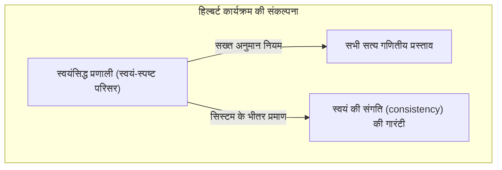
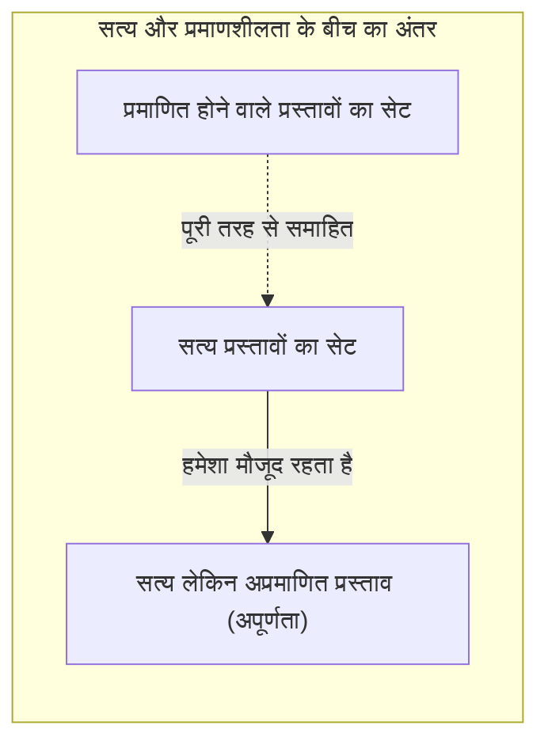
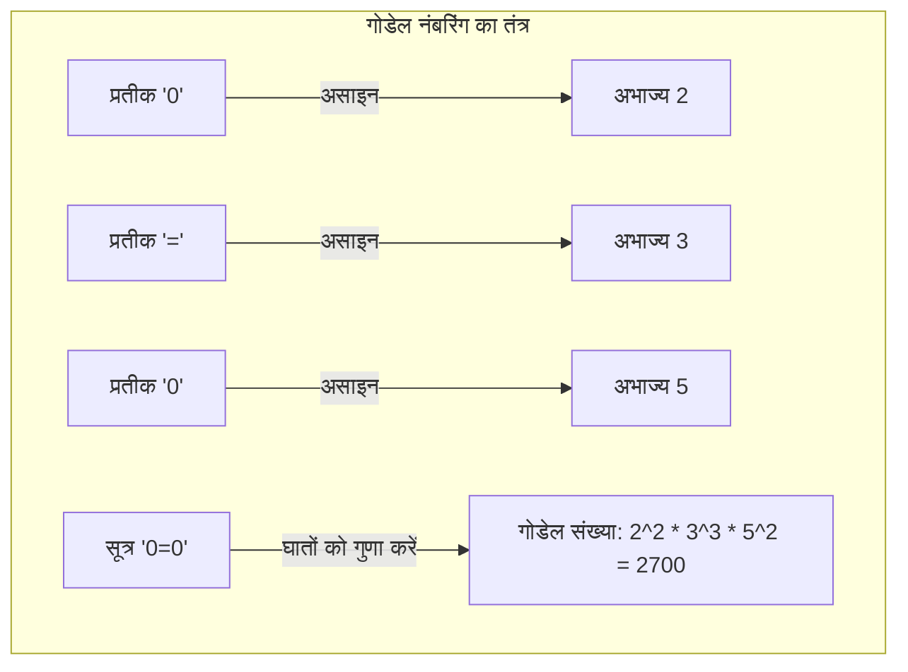
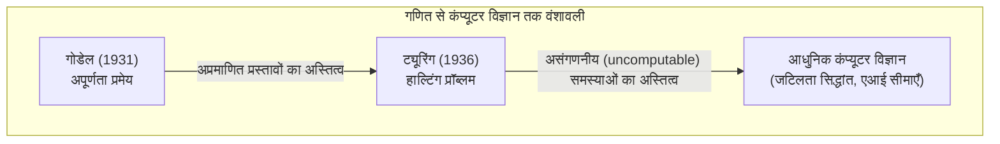

"गणित बिल्कुल सही है" - हर किसी ने कम से कम एक बार यह सोचा होगा। हालाँकि, 1931 में युवा गणितज्ञ [कर्ट गोडेल](https://kenji.blog/p/godel/) ([Kurt Gödel](https://kenji.blog/p/godel/)) द्वारा प्रकाशित एक पेपर ने इस सामान्य ज्ञान को मूल रूप से पलट दिया। यही **[गोडेल की अपूर्णता प्रमेय](https://kenji.blog/p/godels-incompleteness-theorems/) ([Gödel's Incompleteness Theorems](https://kenji.blog/p/godels-incompleteness-theorems/))** है।

इस लेख में, हम इस चौंकाने वाले प्रमेय के अर्थ और इसके प्रमाण के तंत्र को विशिष्ट उदाहरणों और आरेखों का उपयोग करते हुए विस्तार से बताएंगे, जो बताता है कि "ऐसे निरपेक्ष सत्य (absolute truths) हैं जिन्हें कभी सिद्ध नहीं किया जा सकता है"।

---

## 1. पृष्ठभूमि: हिल्बर्ट का कार्यक्रम और गणित का संकट

19वीं सदी के अंत से 20वीं सदी की शुरुआत तक, गणित की दुनिया को "सेट थ्योरी के विरोधाभासों (जैसे रसेल का विरोधाभास)" का सामना करना पड़ा और इसकी नींव हिल गई। इस "गणित के संकट" को बचाने के लिए जो आगे आए, वे थे [डेविड हिल्बर्ट](https://kenji.blog/p/hilbert/) ([David Hilbert](https://kenji.blog/p/hilbert/)), जो उस समय गणितीय दुनिया के सर्वोच्च अधिकारी थे।

हिल्बर्ट ने गणितीय तर्क के सभी पहलुओं को पूरी तरह से प्रतीकात्मक बनाने (symbolize) और केवल यांत्रिक नियमों का उपयोग करके गणित को फिर से बनाने का प्रयास किया। उनके "हिल्बर्ट कार्यक्रम (Hilbert's program)" का लक्ष्य गणितीय औपचारिक प्रणाली (Formal System) में निम्नलिखित तीन गुणों को साबित करना था।

1. **संगति (Consistency)**: यह कि सिस्टम के भीतर कोई विरोधाभास नहीं है (कि किसी प्रस्ताव $P$ और उसके निषेध $\neg P$ दोनों को सिद्ध नहीं किया जा सकता है)।
2. **पूर्णता (Completeness)**: यह कि किसी भी गणितीय प्रस्ताव को सिस्टम के भीतर या तो सही या गलत के रूप में सिद्ध किया जा सकता है।
3. **निर्णायकता (Decidability)**: यह कि कोई भी प्रस्ताव दिए जाने पर, यह निर्धारित करने के लिए एक यांत्रिक प्रक्रिया मौजूद है कि क्या इसे सिद्ध किया जा सकता है।

हिल्बर्ट ने प्रसिद्ध शब्द छोड़े, "हमें जानना चाहिए, हम जानेंगे (Wir müssen wissen. Wir werden wissen.)", और उन्हें कोई संदेह नहीं था कि गणित परिपूर्ण तर्क का एक महल बन जाएगा जो सब कुछ हल कर सकता है।

## 2. औपचारिक प्रणाली (Formal System) और पीनो अंकगणित (Peano Arithmetic)

गोडेल की प्रमेय को समझने के लिए, आइए पहले "औपचारिक प्रणाली" और "बुनियादी अंकगणित" पर स्पर्श करें।

एक औपचारिक प्रणाली पूर्व निर्धारित वर्ण स्ट्रिंग्स (प्रतीक) और पहेली-नियमों (अनुमान नियम) का एक सेट है जो उनमें हेरफेर करते हैं। वहां "अर्थ (meaning)" की कोई आवश्यकता नहीं है, और गणित को केवल प्रतीकों के विरूपण खेल के रूप में देखा जाता है।

गोडेल की प्रमेय एक ऐसी प्रणाली को लक्षित करती है जिसमें "प्राकृतिक संख्याओं का जोड़ और गुणा" शामिल है। इसका एक विशिष्ट उदाहरण एक स्वयंसिद्ध प्रणाली है जिसे **पीनो अंकगणित (Peano Arithmetic, PA)** कहा जाता है। पीनो अंकगणित बुनियादी नियमों (स्वयंसिद्धों) से शुरू होता है जैसे "0 एक प्राकृतिक संख्या है" और "एक प्राकृतिक संख्या $x$ के लिए, अगली संख्या $S(x)$ मौजूद है।"

उदाहरण के लिए, प्रसिद्ध तथ्य कि "$1 + 1 = 2$" पीनो अंकगणित की औपचारिक प्रणाली के भीतर प्रतीकों के हेरफेर द्वारा यांत्रिक रूप से प्राप्त एक "प्रमेय" से अधिक कुछ नहीं है।

हिल्बर्ट का मानना था कि यदि हम ऐसी औपचारिक प्रणालियों का विस्तार करते रहें, तो हम किसी दिन सभी गणितीय सत्य (mathematical truths) को कवर करने में सक्षम होंगे।

## 3. पहली अपूर्णता प्रमेय का झटका: ऐसे प्रस्ताव जो "सत्य हैं लेकिन सिद्ध नहीं किए जा सकते"

हालाँकि, 1931 में, [कर्ट गोडेल](https://kenji.blog/p/godel/), जो उस समय केवल 25 वर्ष के थे, ने एक पेपर प्रकाशित किया जिसने हिल्बर्ट के सपने को चकनाचूर कर दिया। यही **पहली अपूर्णता प्रमेय (First Incompleteness Theorem)** है।

> **पहली अपूर्णता प्रमेय**
> किसी भी सुसंगत (consistent) औपचारिक प्रणाली (जैसे कि पीनो अंकगणित) में, हमेशा ऐसे प्रस्ताव (propositions) होंगे जो सत्य हैं लेकिन उस प्रणाली के भीतर सिद्ध नहीं किए जा सकते।

इस प्रमेय ने दिखाया कि "सत्य (Truth)" और "प्रमाणशीलता (Provability)" दो पूरी तरह से अलग चीजें हैं। "औपचारिक प्रणाली" की "मशीन" का उपयोग करके गणित की दुनिया के सभी सत्य को पकड़ना असंभव था।

### झूठे का विरोधाभास (Liar's Paradox) का गणितीय अनुवाद

गोडेल के प्रमाण का मूल गणित की औपचारिक प्रणाली के भीतर "स्व-संदर्भ विरोधाभास (self-referential paradox)" का निर्माण करना था।

प्राचीन ग्रीस के समय से ज्ञात "झूठे के विरोधाभास (Liar's paradox)" को याद करें।
"यह वाक्य झूठ है।"
यदि यह वाक्य सत्य है, तो सामग्री "झूठ" है। यदि यह झूठ है, तो सामग्री "सत्य" है।

गोडेल ने गणित में एक समान तर्क लाया और गणितीय सूत्रों का उपयोग करके निम्नलिखित प्रस्ताव $G$ का निर्माण किया।

**प्रस्ताव $G$**: "यह प्रस्ताव $G$ इस प्रणाली में सिद्ध नहीं किया जा सकता है।"

मान लें कि औपचारिक प्रणाली इस प्रस्ताव $G$ को सिद्ध कर सकती है। इसका मतलब यह होगा कि इसने एक ऐसे प्रस्ताव को सिद्ध कर दिया है जो दावा करता है कि "इसे सिद्ध नहीं किया जा सकता", जो सिस्टम को विरोधाभासी बनाता है। यदि हम इस बड़े आधार (premise) पर खड़े हैं कि सिस्टम "सुसंगत (consistent)" है, तो सिस्टम कभी भी प्रस्ताव $G$ को सिद्ध नहीं कर सकता है।

अब, यहाँ गोडेल का जादू है। प्रस्ताव $G$ को सिस्टम के भीतर सिद्ध नहीं किया जा सका। हालाँकि, प्रस्ताव $G$ बिल्कुल वह वाक्य है जो दावा करता है कि "इसे सिद्ध नहीं किया जा सकता है।" चूँकि स्थिति वैसी ही है जैसी वह दावा करती है, बाहरी दृष्टिकोण से, हम यह निष्कर्ष निकाल सकते हैं कि प्रस्ताव $G$ **सत्य** है।

इस प्रकार, एक ऐसा प्रस्ताव पैदा हुआ जो "सत्य है फिर भी सिद्ध नहीं किया जा सकता है।"

## 4. गोडेल नंबरिंग (Gödel numbering): गणितीय सूत्रों को संख्याओं में बदलने का एक शानदार विचार

आप "इस प्रस्ताव को सिद्ध नहीं किया जा सकता" जापानी (या हिंदी) वाक्य को पीनो अंकगणित में कैसे व्यक्त करते हैं, जिसमें केवल जोड़ और गुणा है? यहाँ गोडेल ने **गोडेल नंबरिंग (Gödel numbering)** नामक एक तकनीक का आविष्कार किया।

गोडेल ने एक अद्वितीय संख्या (अभाज्य संख्या / prime number) को गणितीय सूत्र में प्रयुक्त प्रत्येक प्रतीक (जैसे $\neg$, $\vee$, $\exists$, $0$, $=$) को सौंपा। फिर, अभाज्य गुणनखंडन (prime factorization) की विशिष्टता (uniqueness) का उपयोग करके (यह गुण कि किसी भी प्राकृतिक संख्या को केवल एक ही तरीके से अभाज्य संख्याओं के गुणनफल के रूप में दर्शाया जा सकता है), उन्होंने गणितीय सूत्र के स्ट्रिंग को एक विशाल प्राकृतिक संख्या में परिवर्तित कर दिया।

इस तकनीक का उपयोग करते हुए, यहां तक कि "प्रमाण प्रक्रिया" जैसे "सूत्र $A$, सूत्र $B$ का प्रमाण है" को बड़ी संख्याओं के गुणों (जैसे कि क्या एक संख्या दूसरी संख्या से विभाज्य है) के बारे में केवल एक अंकगणितीय समस्या से बदला जा सकता है।

दूसरे शब्दों में, उन्होंने प्राकृतिक संख्याओं के गुणों के भीतर एक ऐसी भाषा छिपाई जिससे गणित "अपने स्वयं के प्रमाणों (स्व-संदर्भ)" के बारे में बात कर सके। यह उसी विचार के समान है कि कैसे आधुनिक कंप्यूटर छवियों और कार्यक्रमों को "0 और 1 के स्ट्रिंग" में एनकोड करते हैं, और गोडेल कंप्यूटर के जन्म से बहुत पहले इस अवधारणा पर पहुंच गए थे।

## 5. दूसरी अपूर्णता प्रमेय: अपने स्वयं के सत्य को सिद्ध करने में असमर्थता की निराशा

पहली अपूर्णता प्रमेय ही गणितीय जगत को हिलाने के लिए पर्याप्त थी, लेकिन गोडेल के पेपर में एक और भी भयानक निष्कर्ष था। वह है **दूसरी अपूर्णता प्रमेय (Second Incompleteness Theorem)**।

> **दूसरी अपूर्णता प्रमेय**
> पीनो अंकगणित जैसी किसी भी सुसंगत औपचारिक प्रणाली (consistent formal system) अपनी स्वयं की संगति (consistency) को उस प्रणाली के भीतर सिद्ध नहीं कर सकती है।

हिल्बर्ट स्वयं गणित की शक्ति का उपयोग करके यह सिद्ध करने का प्रयास कर रहा था कि गणित सुसंगत (consistent) है (हिल्बर्ट के कार्यक्रम का सबसे महत्वपूर्ण कार्य)। हालाँकि, दूसरी अपूर्णता प्रमेय ने घोषणा की, "कोई भी सिस्टम अपनी शक्ति से यह साबित नहीं कर सकता कि वह पागल नहीं है (विरोधाभासी नहीं है)।"

इसे सहज रूप से समझने के लिए, आइए इसके बारे में इस तरह सोचें।
मान लीजिए कोई कहता है, "मैं कभी झूठ नहीं बोलता!" हालाँकि, हम केवल उनके शब्दों के आधार पर यह साबित नहीं कर सकते कि "यह व्यक्ति झूठा नहीं है।" क्योंकि यदि वह व्यक्ति झूठा है, तो "मैं कभी झूठ नहीं बोलता" कथन स्वयं भी झूठ हो सकता है।

गणित के साथ भी ऐसा ही है। यदि एक स्वयंसिद्ध प्रणाली भी गणितीय सूत्र प्राप्त कर सकती है "मैं सुसंगत हूं ($Con(F)$)", यदि सिस्टम पहले से ही विरोधाभासी है, तो कोई भी प्रस्ताव (सही या गलत) सिद्ध किया जा सकता है। इसलिए, उस प्रमाण "मैं सुसंगत हूं" का कोई मूल्य नहीं है।

दूसरी अपूर्णता प्रमेय ने एक निर्णायक सीमा दिखाई कि गणित के लिए गणित के भीतर "निरपेक्ष निश्चितता (absolute certainty)" को आत्म-प्रमाणित (self-prove) करना असंभव है।

## 6. अपूर्णता प्रमेय के बारे में सामान्य गलतफहमियाँ

गोडेल के अपूर्णता प्रमेय का, इसके नाटकीय नाम के कारण, अक्सर दर्शन, विचार और गुप्त संदर्भों में दुरुपयोग किया जाता है। आइए यहाँ कुछ विशिष्ट गलतफहमियों को दूर करें।

- **गलत धारणा 1: "गणित टूट गया है (Math is broken)"**
  - **तथ्य**: अपूर्णता प्रमेय का मतलब गणित का टूटना नहीं है। बल्कि, यह औपचारिक तर्क की एक संपत्ति का खुलासा करता है: "केवल एक निश्चित स्वयंसिद्ध प्रणाली सभी सत्य को पकड़ नहीं सकती है।" गणितज्ञ आवश्यकतानुसार नए स्वयंसिद्ध (जैसे "Axiom of Choice" या "Large Cardinal Axioms") जोड़कर अधिक शक्तिशाली प्रणालियाँ बनाना और अपने शोध को विकसित करना जारी रखते हैं।
- **गलत धारणा 2: "मानव तर्क की एक सीमा है (Human reason has limits)"**
  - **तथ्य**: प्रमेय की सीमा "एक प्रणाली जो पूर्व निर्धारित यांत्रिक नियमों का पालन करती है" (औपचारिक प्रणाली) के बारे में है। पहले अपूर्णता प्रमेय में, हम यह देखने में सक्षम थे कि प्रस्ताव $G$ बाहरी दृष्टिकोण से "सत्य" है। कुछ विद्वान (जैसे रोजर पेनरोज़ / Roger Penrose) इसे प्रमाण मानते हैं कि मानव तर्क (human reason) में यांत्रिक प्रणालियों से परे "अर्थ (semantics)" को समझने की क्षमता है।
- **गलत धारणा 3: "ऐसी चीजें हैं जिन्हें किसी भी चीज़ के लिए साबित नहीं किया जा सकता है"**
  - **तथ्य**: अपूर्णता प्रमेय केवल पर्याप्त जटिल प्रणालियों पर लागू होता है जिनमें "प्राकृतिक संख्याओं का जोड़ और गुणा" (पीनो अंकगणित) शामिल है। उदाहरण के लिए, "[यूक्लिड](https://kenji.blog/p/euclid/)ियन ज्यामिति ([[Euclid](https://kenji.blog/p/euclid/)e](https://kenji.blog/p/euclid/)an geometry)" और "वास्तविक संख्याओं का प्रथम-क्रम सिद्धांत (First-order theory of real numbers)" पूर्ण हैं, और सभी सत्य प्रस्तावों को सिद्ध किया जा सकता है। अपूर्णता तभी उत्पन्न होती है जब लक्ष्य में पर्याप्त जटिल संरचना (ऐसी संरचना जो स्व-संदर्भ की अनुमति देती है) हो।

## 7. ट्यूरिंग मशीन को बैटन: कंप्यूटर विज्ञान की सुबह

गोडेल की प्रमेय का प्रभाव गणित की सीमाओं तक सीमित नहीं था। 1936 में, ब्रिटिश गणितज्ञ [एलन ट्यूरिंग](https://kenji.blog/p/turing/) ([Alan Turing](https://kenji.blog/p/turing/)) ने गोडेल की "औपचारिक प्रणाली" की अवधारणा को एक भौतिक गणना प्रक्रिया (physical calculation process) से बदल दिया और "ट्यूरिंग मशीन" नामक एक आभासी कंप्यूटर मॉडल तैयार किया।

ट्यूरिंग ने कंप्यूटर की दुनिया में गोडेल के अपूर्णता प्रमेय को लागू किया और साबित किया कि "कोई भी सार्वभौमिक एल्गोरिथ्म नहीं है जो पहले से निर्धारित कर सके कि कोई कंप्यूटर प्रोग्राम हमेशा के लिए चलेगा (अनंत लूप) या नहीं।" यह प्रसिद्ध **[हाल्टिंग प्रॉब्लम (Halting Problem)](https://kenji.blog/p/halting-problem/)** है।

गणितीय सीमा कि "ऐसे सत्य हैं जिन्हें प्रमाणित नहीं किया जा सकता" ने कंप्यूटर की सीमा को "ऐसी समस्याएँ हैं जिनकी गणना नहीं की जा सकती" में बदल दिया है और आधुनिक प्रोग्रामिंग और एल्गोरिथ्म सिद्धांत की नींव के रूप में आज भी जीवित है।

## 8. निष्कर्ष: "जानने (Knowing)" की अंतहीन यात्रा

"एक संपूर्ण गणितीय मशीन जो स्वचालित रूप से सब कुछ साबित कर सकती है" का सपना जो [डेविड हिल्बर्ट](https://kenji.blog/p/hilbert/) ने देखा था, वह [गोडेल की अपूर्णता प्रमेय](https://kenji.blog/p/godels-incompleteness-theorems/) द्वारा एक भ्रम के रूप में समाप्त हो गया। हालाँकि, इसका मतलब किसी भी तरह से गणित की हार नहीं था।

यदि गणित पूरी तरह से मशीनीकृत (mechanized) हो सकता था, तो गणितज्ञों का काम एक साधारण काम बन जाता और यह किसी दिन समाप्त हो जाता। हालाँकि, गोडेल द्वारा दिखाए गए "प्रस्ताव जो सिद्ध नहीं किए जा सकते लेकिन सत्य हैं" के अस्तित्व ने साबित कर दिया कि गणित का ब्रह्मांड हमारी कल्पना से कहीं अधिक समृद्ध और असीम गहरा है।

[कर्ट गोडेल](https://kenji.blog/p/godel/), जिन्होंने गणित, जो सबसे सख्त तर्क है, के हाथों से "निरपेक्ष सत्य जिसे कभी प्रमाणित नहीं किया जा सकता" के अस्तित्व को **प्रमाणित** किया। उनका अपूर्णता प्रमेय हमें सिखाता है कि "जानने" की मानव खोज एक अंतहीन यात्रा है।
