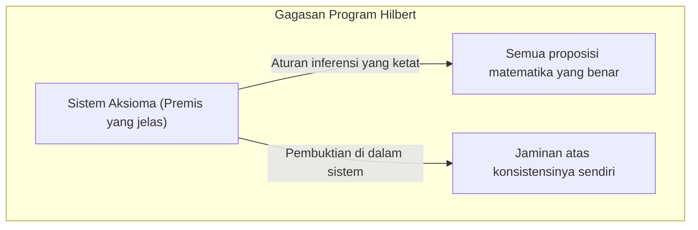
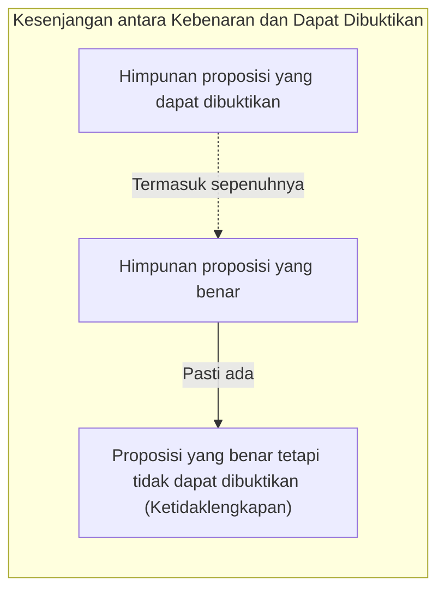
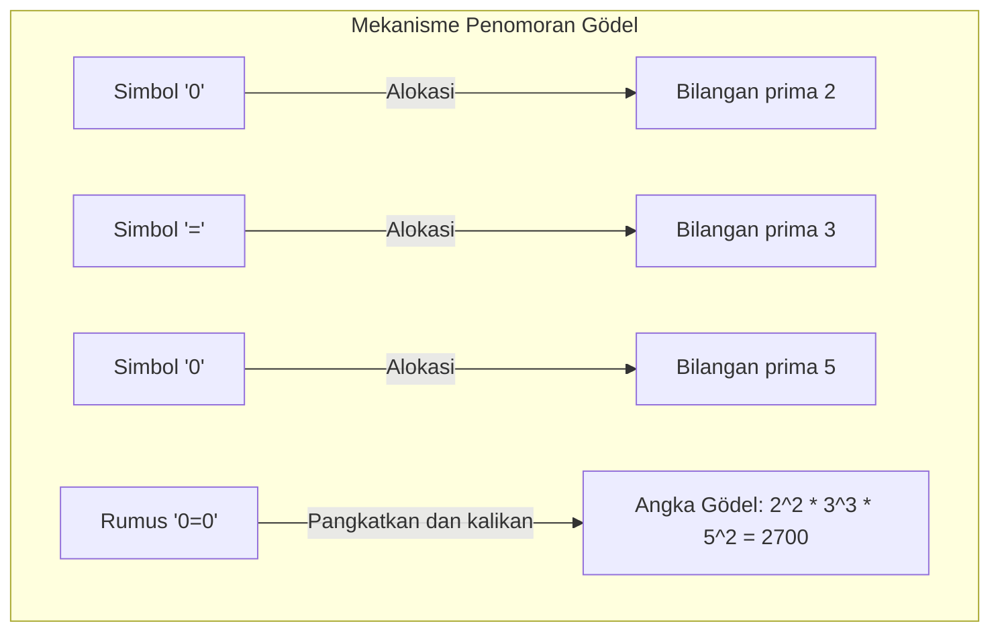
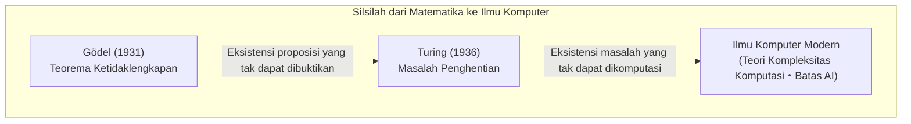

"Matematika itu mutlak benar"──Setiap orang mungkin pernah berpikir seperti itu setidaknya sekali. Namun, sebuah makalah yang diterbitkan pada tahun 1931 oleh matematikawan muda [Kurt Gödel](https://kenji.blog/id/p/godel/) menjungkirbalikkan akal sehat tersebut dari akarnya. Itulah **[Teorema Ketidaklengkapan Gödel](https://kenji.blog/id/p/godels-incompleteness-theorems/)**.

Dalam artikel ini, kami akan menjelaskan secara menyeluruh tentang teorema mengejutkan bahwa "kebenaran yang sama sekali tidak dapat dibuktikan" itu ada, mulai dari maknanya hingga mekanisme pembuktiannya dengan menyertakan contoh konkret dan ilustrasi.

---

## 1. Latar Belakang: Program Hilbert dan Krisis Matematika

Dari akhir abad ke-19 hingga awal abad ke-20, dunia matematika menghadapi "paradoks teori himpunan (seperti Paradoks Russell)", dan fondasinya goyah. Orang yang bangkit untuk menyelamatkan "krisis matematika" ini adalah otoritas tertinggi dalam dunia matematika saat itu, [David Hilbert](https://kenji.blog/id/p/hilbert/).

Hilbert mencoba menyimbolkan sepenuhnya semua penalaran matematika dan merekonstruksi matematika hanya dengan aturan mekanis. "Program Hilbert" yang ia advokasikan bertujuan untuk membuktikan tiga sifat berikut dalam sistem formal (Formal System) matematika:

1. **Konsistensi** (Consistency): Tidak ada kontradiksi (di mana suatu proposisi $P$ dan negasinya $\neg P$ keduanya terbukti) di dalam sistem.
2. **Kelengkapan** (Completeness): Setiap proposisi matematika harus dapat dibuktikan sebagai benar atau salah di dalam sistem tersebut.
3. **Keputusan** (Decidability): Jika diberikan proposisi sembarang, ada prosedur mekanis untuk menentukan apakah itu dapat dibuktikan atau tidak.

Hilbert meninggalkan kata-kata terkenal, "Kita harus tahu, kita akan tahu (Wir müssen wissen. Wir werden wissen.)", dan ia percaya tanpa ragu bahwa matematika akan menjadi kastil logika sempurna yang dapat menyelesaikan segalanya.

## 2. Sistem Formal dan Aritmatika Peano

Untuk memahami teorema Gödel, mari kita bahas terlebih dahulu tentang "sistem formal" dan "aritmatika dasar".

Sistem formal adalah serangkaian string (simbol) yang telah ditentukan sebelumnya dan aturan (aturan inferensi) untuk memanipulasinya. "Makna" tidak diperlukan di sana, dan matematika dipandang sebagai permainan transformasi simbol semata.

Teorema Gödel menargetkan sistem yang mencakup "penjumlahan dan perkalian bilangan asli". Contoh perwakilannya adalah sistem aksioma yang disebut **Aritmatika Peano** (Peano Arithmetic, PA). Dalam aritmatika Peano, kita mulai dengan aturan dasar (aksioma) seperti "0 adalah bilangan asli" dan "Untuk bilangan asli tertentu $x$, ada angka berikutnya $S(x)$".

Misalnya, fakta yang diketahui semua orang bahwa " $1 + 1 = 2$ " hanyalah sebuah "teorema" yang diturunkan secara mekanis melalui manipulasi simbol dalam sistem formal Aritmatika Peano.

Hilbert berpikir bahwa dengan memperbesar sistem formal ini, suatu hari nanti ia dapat mencakup seluruh kebenaran matematis.

## 3. Kejutan Teorema Ketidaklengkapan Pertama: Proposisi "Benar tetapi Tidak Dapat Dibuktikan"

Namun pada tahun 1931, [Kurt Gödel](https://kenji.blog/id/p/godel/), yang saat itu baru berusia 25 tahun, menerbitkan sebuah makalah yang menghancurkan impian Hilbert. Itulah **Teorema Ketidaklengkapan Pertama**.

> **Teorema Ketidaklengkapan Pertama**
> Dalam setiap sistem formal yang konsisten yang mencakup Aritmatika Peano, selalu ada proposisi yang benar tetapi tidak dapat dibuktikan dalam sistem tersebut.

Teorema ini menunjukkan bahwa "kebenaran" dan "dapat dibuktikan" adalah hal yang sama sekali berbeda. Mustahil untuk menangkap seluruh kebenaran dunia matematika dengan "mesin" yang disebut sistem formal.

### Terjemahan Matematis Paradoks Pembohong

Inti dari pembuktian Gödel terletak pada penciptaan "paradoks referensi diri" dalam sistem formal matematika.

Ingatlah "Paradoks Pembohong" yang dikenal sejak zaman Yunani kuno.
"Kalimat ini adalah kebohongan"
Jika kalimat ini benar, isinya menjadi "kebohongan". Jika itu kebohongan, isinya menjadi "benar".

Gödel membawa logika serupa ini ke dalam matematika dan membangun proposisi $G$ berikut dengan rumus.

**Proposisi $G$**: "Proposisi $G$ ini tidak dapat dibuktikan dalam sistem ini"

Misalkan sistem formal dapat membuktikan proposisi $G$ ini. Itu berarti sistem telah membuktikan proposisi yang mengklaim "tidak dapat dibuktikan", dan sistem tersebut menjadi kontradiksi. Jika kita berdiri pada premis utama bahwa ia "konsisten", sistem tidak akan pernah bisa membuktikan proposisi $G$.

Nah, dari sinilah keajaiban Gödel. Proposisi $G$ tidak dapat dibuktikan dalam sistem. Akan tetapi, proposisi $G$ adalah kalimat yang persis mengklaim "tidak dapat dibuktikan". Karena kondisinya persis seperti yang diklaimnya, dari sudut pandang eksternal, kita dapat menyimpulkan bahwa proposisi $G$ adalah **benar**.

Dengan demikian, lahirlah proposisi yang "benar tetapi tidak dapat dibuktikan".

## 4. Penomoran Gödel: Ide Jenius Mengubah Rumus menjadi Angka

Bagaimana kita bisa mengekspresikan kalimat bahasa seperti "Proposisi ini tidak dapat dibuktikan" dalam Aritmatika Peano yang hanya memiliki penjumlahan dan perkalian? Di sinilah Gödel menemukan metode yang disebut **Penomoran Gödel** (Gödel numbering).

Gödel menetapkan angka unik (bilangan prima) untuk semua simbol yang digunakan dalam rumus (seperti $\neg$, $\vee$, $\exists$, $0$, $=$). Kemudian, dengan menggunakan keunikan faktorisasi prima (sifat bahwa bilangan asli apa pun dapat difaktorkan ke dalam perkalian bilangan prima hanya dalam satu cara), ia mengubah rangkaian rumus menjadi satu bilangan asli raksasa.

Metode ini memungkinkan untuk mengubah seluruh "proses pembuktian", seperti "rumus $A$ adalah bukti dari rumus $B$", menjadi sekadar masalah aritmatika tentang sifat-sifat bilangan raksasa (misalnya apakah suatu bilangan dapat dibagi oleh bilangan lain).

Dengan kata lain, bahasa untuk matematika berbicara tentang "buktinya sendiri" (merujuk pada diri sendiri) telah disembunyikan di dalam sifat bilangan asli. Ini adalah ide yang persis sama dengan bagaimana komputer modern mengkodekan semua gambar dan program ke dalam "rangkaian angka 0 dan 1" untuk memprosesnya, dan Gödel telah mencapai konsep ini jauh sebelum komputer lahir.

## 5. Teorema Ketidaklengkapan Kedua: Keputusasaan karena Tidak Dapat Membuktikan Kebenarannya Sendiri

Teorema Ketidaklengkapan Pertama saja telah mengguncang dunia matematika, namun makalah Gödel berisi kesimpulan yang lebih menakutkan. Itulah **Teorema Ketidaklengkapan Kedua**.

> **Teorema Ketidaklengkapan Kedua**
> Sistem formal apa pun yang konsisten dan mencakup Aritmatika Peano tidak dapat membuktikan konsistensinya sendiri di dalam sistem tersebut.

Hilbert mencoba membuktikan bahwa matematika konsisten dengan menggunakan kekuatan matematika itu sendiri (Tugas paling penting dari Program Hilbert). Namun, Teorema Ketidaklengkapan Kedua mengumumkan bahwa "tidak ada sistem yang dapat membuktikan dengan kekuatannya sendiri bahwa ia tidak gila (tidak ada kontradiksi)".

Untuk memahami ini secara intuitif, mari berpikir sebagai berikut.
Misalkan seseorang mengklaim "Saya tidak pernah berbohong!". Namun, kita tidak dapat membuktikan bahwa "orang ini bukan pembohong" hanya berdasarkan kata-katanya saja. Sebab, jika ia seorang pembohong, pernyataan "Saya tidak pernah berbohong" itu sendiri mungkin sebuah kebohongan.

Hal ini sama untuk matematika, meskipun sistem aksioma tertentu dapat menurunkan rumus "Saya konsisten ( $Con(F)$ )" sendiri, jika sistem tersebut sudah berkontradiksi, semua proposisi (baik benar maupun salah) akan dapat dibuktikan, sehingga pembuktian "Saya konsisten" tidak memiliki nilai sama sekali.

Teorema Ketidaklengkapan Kedua menunjukkan batasan definitif bahwa mustahil bagi matematika untuk membuktikan "kepastian mutlak" di dalam matematika itu sendiri.

## 6. Kesalahpahaman Umum tentang Teorema Ketidaklengkapan

Karena namanya yang dramatis, [Teorema Ketidaklengkapan Gödel](https://kenji.blog/id/p/godels-incompleteness-theorems/) sering kali disalahgunakan dalam konteks filsafat, ideologi, dan okultisme. Di sini, mari kita luruskan kesalahpahaman yang paling umum.

- **Kesalahpahaman 1: "Matematika telah runtuh"**
  - **Fakta**: Teorema Ketidaklengkapan tidak berarti kehancuran matematika. Sebaliknya, ia mengklarifikasi sifat logika formal bahwa "kebenaran keseluruhan tidak dapat ditangkap hanya oleh sistem aksioma tunggal yang tetap". Matematikawan terus mengembangkan penelitian dengan menciptakan sistem yang lebih kuat melalui penambahan aksioma baru sesuai kebutuhan (seperti "Aksioma Pilihan" atau "Aksioma Kardinal Besar").
- **Kesalahpahaman 2: "Akal budi manusia memiliki batasan"**
  - **Fakta**: Batasan yang ditunjukkan oleh teorema ini adalah tentang "sistem (sistem formal) yang mengikuti aturan mekanis yang telah ditentukan sebelumnya". Dalam Teorema Ketidaklengkapan Pertama, kita bisa melihat bahwa proposisi $G$ adalah "benar" dari sudut pandang luar. Beberapa ahli (seperti Roger Penrose) menganggap ini sebagai bukti bahwa akal budi manusia memiliki kemampuan untuk memahami "makna (semantik)" yang melampaui sistem formal mekanis.
- **Kesalahpahaman 3: "Ada hal yang tidak bisa dibuktikan apa pun itu"**
  - **Fakta**: Teorema Ketidaklengkapan hanya berlaku pada sistem yang cukup kompleks, yang mencakup "penjumlahan dan perkalian bilangan asli (Aritmatika Peano)". Misalnya, "Geometri [[Euclid](https://kenji.blog/id/p/euclid/)e](https://kenji.blog/p/euclid/)an" atau "Teori Orde Pertama dari Bilangan Real" sepenuhnya lengkap, dan semua proposisi yang benar di sana dapat dibuktikan. Ketidaklengkapan hanya terjadi ketika subjeknya memiliki struktur yang cukup kompleks (struktur yang memungkinkan referensi ke diri sendiri).

## 7. Tongkat Estafet ke Mesin Turing: Fajar Ilmu Komputer

Dampak dari teorema Gödel tidak terbatas pada batas matematika. Pada tahun 1936, matematikawan Inggris [Alan Turing](https://kenji.blog/id/p/turing/) mengganti konsep "sistem formal" Gödel dengan proses komputasi fisik, dan merancang model komputer virtual yang disebut "Mesin Turing".

Turing menerapkan [Teorema Ketidaklengkapan Gödel](https://kenji.blog/id/p/godels-incompleteness-theorems/) ke dalam dunia komputer dan membuktikan bahwa "tidak ada algoritma universal untuk menentukan sebelumnya apakah program komputer mana pun akan berjalan selamanya tanpa akhir atau tidak". Inilah **Masalah Penghentian** (Halting Problem) yang terkenal.

Batasan matematika berupa "ada kebenaran yang tidak bisa dibuktikan" dengan indah berubah wujud menjadi batasan komputer berupa "ada masalah yang tidak bisa dihitung", dan terus hidup sebagai dasar dari teori pemrograman dan algoritma modern.

## 8. Kesimpulan: Perjalanan Panjang yang Tiada Akhir untuk "Mengetahui"

"Mesin matematika sempurna yang dapat membuktikan segalanya secara otomatis" yang diimpikan oleh [David Hilbert](https://kenji.blog/id/p/hilbert/) hancur menjadi ilusi karena [Teorema Ketidaklengkapan Gödel](https://kenji.blog/id/p/godels-incompleteness-theorems/). Namun, itu sama sekali tidak berarti kekalahan matematika.

Jika matematika bisa sepenuhnya diotomatisasi, pekerjaan seorang matematikawan akan menjadi sekadar tugas biasa dan suatu hari akan berakhir. Akan tetapi, keberadaan "proposisi yang tidak dapat dibuktikan tetapi benar" yang ditunjukkan Gödel membuktikan bahwa alam semesta matematika jauh lebih kaya dan memiliki kedalaman yang tidak akan pernah habis dibandingkan yang bisa kita bayangkan.

[Kurt Gödel](https://kenji.blog/id/p/godel/) telah **membuktikan** eksistensi "kebenaran yang sama sekali tidak dapat dibuktikan" melalui matematika itu sendiri, yang merupakan logika paling ketat. Teorema ketidaklengkapannya mengajarkan kita bahwa pencarian manusia untuk "mengetahui" adalah perjalanan tiada akhir yang akan berlangsung selamanya.
