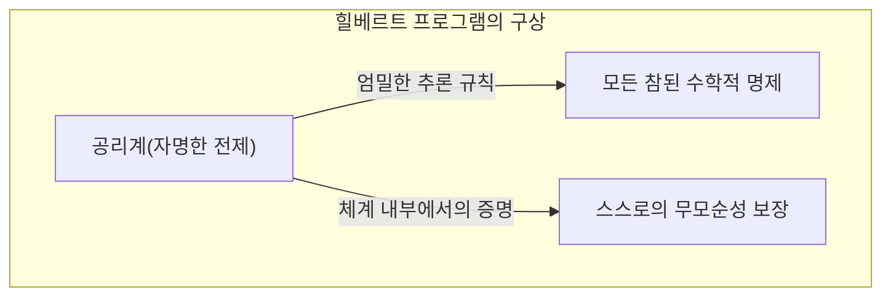
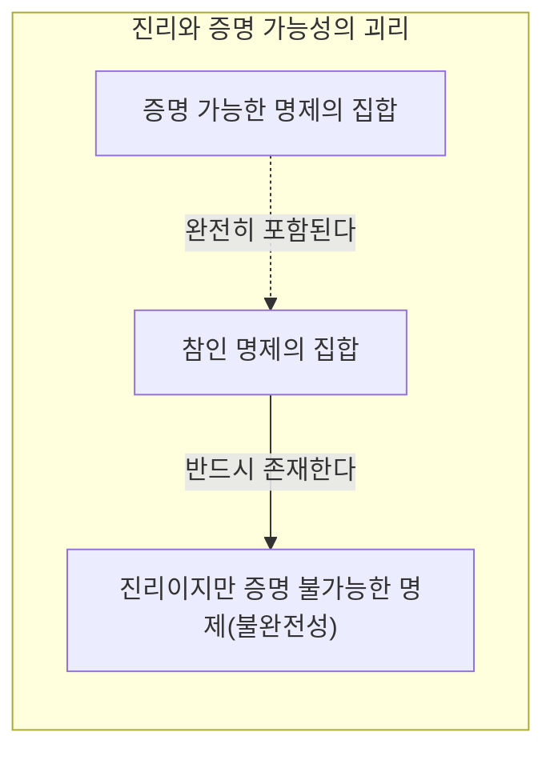
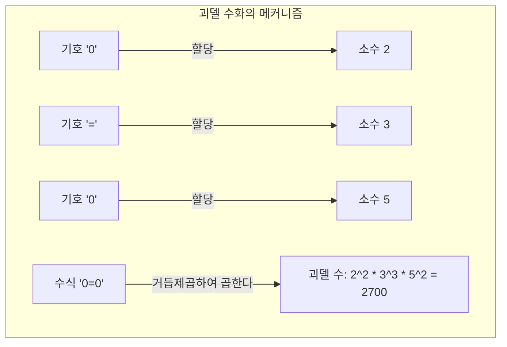
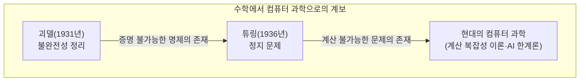

"수학은 절대적으로 옳다"──누구나 한 번쯤은 그렇게 생각해 본 적이 있을 것입니다. 그러나 1931년 젊은 수학자 [쿠르트 괴델](https://kenji.blog/ko/p/godel/)이 발표한 한 논문이 그 상식을 송두리째 뒤집었습니다. 그것이 ** [괴델의 불완전성 정리](https://kenji.blog/ko/p/godels-incompleteness-theorems/) ** 입니다.

본 기사에서는 '절대로 증명할 수 없는 진리'가 존재한다는 이 충격적인 정리에 대해 그 의미와 증명 원리를 구체적인 예시와 도해를 섞어 철저하게 해설합니다.

---

## 1. 시대적 배경: 힐베르트 프로그램과 수학의 위기

19세기 말부터 20세기 초에 걸쳐 수학의 세계는 '집합론의 역설(러셀의 역설 등)'에 직면하며 그 토대가 흔들리고 있었습니다. 이 '수학의 위기'를 구하기 위해 나선 것이 당시 수학계의 최고 권위자인 [다비트 힐베르트](https://kenji.blog/ko/p/hilbert/)입니다.

힐베르트는 수학의 모든 추론을 완전히 기호화하고 기계적인 규칙만으로 수학을 재구축하려고 시도했습니다. 그가 제창한 '힐베르트 프로그램'이 목표로 한 것은 수학의 형식적 체계(Formal System)에서 다음 3가지 성질을 증명하는 것이었습니다.

1. ** 무모순성 ** (Consistency): 체계 내에 모순(어떤 명제 $P$ 와 그 부정 $\neg P$ 가 모두 증명되는 것)이 존재하지 않을 것.
2. ** 완전성 ** (Completeness): 어떠한 수학적 명제라도 그 체계 내에서 참 또는 거짓 어느 한쪽으로 반드시 증명할 수 있을 것.
3. ** 결정 가능성 ** (Decidability): 임의의 명제가 주어졌을 때 그것이 증명 가능한지 여부를 판정하는 기계적인 절차가 존재할 것.

힐베르트는 "우리는 알아야만 한다, 우리는 알게 될 것이다(Wir müssen wissen. Wir werden wissen.)"라는 유명한 말을 남기며 수학이 모든 것을 해결할 수 있는 완벽한 논리의 성이 될 것임을 믿어 의심치 않았습니다.

## 2. 형식적 체계와 페아노 산술

괴델의 정리를 이해하기 위해 우선 '형식적 체계'와 '기본 산술'에 대해 짚고 넘어갑시다.

형식적 체계란 미리 정해진 문자열(기호)과 그것들을 조작하는 퍼즐 규칙(추론 규칙)의 세트입니다. 거기에는 '의미'가 필요 없으며 단순한 기호의 변형 게임으로서 수학을 파악합니다.

괴델의 정리의 대상이 되는 것은 '자연수의 덧셈과 곱셈'을 포함하는 체계입니다. 그 대표적인 예가 ** 페아노 산술 ** (Peano Arithmetic, PA)이라고 불리는 공리계입니다. 페아노 산술에서는 '0은 자연수이다', '어떤 자연수 $x$ 에는 그다음 수 $S(x)$ 가 존재한다'와 같은 기본적인 규칙(공리)에서 출발합니다.

예를 들어 '$1 + 1 = 2$'라는 누구나 아는 사실도 페아노 산술이라는 형식적 체계 안에서는 기호 조작에 의해 기계적으로 도출되는 하나의 '정리'에 불과합니다.

힐베르트는 이러한 형식적 체계를 거대화해 나가면 언젠가 모든 수학적 진리를 망라할 수 있을 것이라고 생각한 것입니다.

## 3. 제1불완전성 정리의 충격: '참이지만 증명할 수 없는' 명제

그러나 1931년, 당시 불과 25세였던 [쿠르트 괴델](https://kenji.blog/ko/p/godel/)은 힐베르트의 꿈을 산산조각 내는 논문을 발표했습니다. 그것이 ** 제1불완전성 정리 ** 입니다.

>  ** 제1불완전성 정리 ** 
> 페아노 산술을 포함하는 것과 같은 무모순인 형식적 체계에는 참임에도 불구하고 그 체계 내에서는 증명할 수 없는 명제가 반드시 존재한다.

이 정리는 '진리'와 '증명 가능성'이 전혀 별개의 것임을 보여주었습니다. 형식적 체계라는 '기계'로는 수학 세계의 모든 진리를 포착하는 것이 불가능했던 것입니다.

### 거짓말쟁이의 역설의 수학적 번역

괴델 증명의 핵심은 '자기 언급의 역설'을 수학의 형식적 체계 안에 만들어낸 것에 있습니다.

고대 그리스 시대부터 알려진 '거짓말쟁이의 역설'을 떠올려 보십시오.
"이 문장은 거짓이다"
이 문장이 옳다고 하면 내용은 '거짓'이 됩니다. 거짓이라고 하면 내용은 '옳은' 것이 됩니다.

괴델은 이와 비슷한 논리를 수학으로 가져와 다음과 같은 명제 $G$ 를 수식으로 구성했습니다.

 ** 명제 $G$ ** :"이 명제 $G$ 는 이 체계 내에서는 증명할 수 없다"

만약 형식적 체계가 이 명제 $G$ 를 증명할 수 있었다고 합시다. 그것은 '증명할 수 없다'고 주장하고 있는 명제를 증명한 것이 되어 체계는 모순에 빠지고 맙니다. '무모순이다'라는 대전제에 선다면 체계는 명제 $G$ 를 결코 증명할 수 없습니다.

자, 여기서부터가 괴델의 마법입니다. 명제 $G$ 는 체계 내에서 증명할 수 없었습니다. 하지만 명제 $G$ 는 바로 '증명할 수 없다'고 주장하고 있는 문장입니다. 주장하고 있는 그대로의 상태가 되어 있기 때문에 외부의 시점에서 보면 명제 $G$ 는 ** 참 ** 이라고 결론지어지는 것입니다.

이렇게 해서 '참임에도 불구하고 증명할 수 없는' 명제가 탄생했습니다.

## 4. 괴델 수화: 수식을 수로 변환하는 천재적 아이디어

"이 명제는 증명할 수 없다"라는 한국어 문장을 덧셈과 곱셈밖에 없는 페아노 산술 안에서 어떻게 표현하는 것일까요. 여기서 괴델이 발명한 것이 ** 괴델 수화 ** (Gödel numbering)라는 수법입니다.

괴델은 수식에서 사용되는 모든 기호( $\neg$ , $\vee$ , $\exists$ , $0$ , $=$ 등)에 고유한 숫자(소수)를 할당했습니다. 그리고 소인수분해의 유일성(어떤 자연수든 소수의 곱셈 형태로 단 한 가지로만 분해할 수 있다는 성질)을 이용하여 수식의 문자열을 하나의 거대한 자연수로 변환했습니다.

이 수법을 사용하면 "수식 $A$ 가 수식 $B$ 의 증명이 되고 있다"와 같은 '증명 프로세스' 전체조차도 거대한 수의 성질(어떤 수가 다른 수로 나누어떨어지는지 등)이라는 단순한 산술의 문제로 바꿔치기할 수 있습니다.

즉, 수학이 '자기 자신의 증명'에 대해 이야기하는(자기 언급하는) 언어를 자연수의 성질 속에 숨겨버린 것입니다. 이것은 현대의 컴퓨터가 이미지나 프로그램을 모두 '0과 1의 숫자 나열'로 인코딩하여 처리하고 있는 것과 같은 발상이며, 괴델은 컴퓨터가 탄생하기 훨씬 전에 이 개념에 도달해 있었습니다.

## 5. 제2불완전성 정리: 스스로의 옳음을 증명할 수 없는 절망

제1불완전성 정리만으로도 수학계를 뒤흔들었지만, 괴델의 논문에는 더욱 무서운 결론이 포함되어 있었습니다. 그것이 ** 제2불완전성 정리 ** 입니다.

>  ** 제2불완전성 정리 ** 
> 페아노 산술을 포함하는 것과 같은 무모순인 형식적 체계는 자기 자신의 무모순성을 그 체계 내에서 증명할 수 없다.

힐베르트는 수학이 무모순이라는 것을 수학 자신의 힘을 사용하여 증명하려고 했습니다(힐베르트 프로그램의 최중요 과제). 하지만 제2불완전성 정리는 "어떤 시스템도 스스로가 미치지 않았다(모순되지 않았다)는 것을 스스로의 힘으로 증명할 수는 없다"고 선고한 것입니다.

이를 직관적으로 이해하기 위해 다음과 같이 생각해 봅시다.
만약 어떤 사람이 "나는 절대로 거짓말을 하지 않는다!"라고 주장했다고 합시다. 하지만 우리는 그 사람의 말만을 근거로 "이 사람은 거짓말쟁이가 아니다"라고 증명할 수는 없습니다. 왜냐하면 만약 그 사람이 거짓말쟁이라면 "나는 절대로 거짓말을 하지 않는다"라는 발언 자체가 거짓말일지도 모르기 때문입니다.

수학도 이와 마찬가지로 어떤 공리계가 "나는 무모순이다( $Con(F)$ )"라는 수식을 스스로 도출해냈다고 해도, 만약 그 체계가 이미 모순되어 있다면 어떠한 명제(옳은 것도 틀린 것도)든 증명할 수 있게 되어버리므로 그 "나는 무모순이다"라는 증명에는 아무런 가치도 없습니다.

제2불완전성 정리는 수학이 '절대적인 확실성'을 수학 내부에서 자기 증명하는 것은 불가능하다는 결정적인 한계를 보여주었습니다.

## 6. 불완전성 정리에 관한 흔한 오해

[괴델의 불완전성 정리](https://kenji.blog/ko/p/godels-incompleteness-theorems/)는 그 드라마틱한 명칭 때문에 종종 철학이나 사상, 오컬트적인 맥락에서 오용되는 경우가 있습니다. 여기서는 대표적인 오해를 풀어두고자 합니다.

-  ** 오해 1: "수학은 파탄 나버렸다" ** 
  -  ** 사실 ** : 불완전성 정리는 수학의 파탄을 의미하지 않습니다. 오히려 '특정한 고정된 공리계만으로는 모든 진리를 포착할 수 없다'는 형식 논리의 성질을 밝힌 것입니다. 수학자들은 필요에 따라 새로운 공리(예를 들어 '선택 공리'나 '거대 기수 공리' 등)를 추가함으로써 더 강력한 체계를 만들어내며 연구를 계속 발전시키고 있습니다.
-  ** 오해 2: "인간의 이성에는 한계가 있다" ** 
  -  ** 사실 ** : 정리가 한계를 보여주고 있는 것은 '미리 정해진 기계적인 규칙에 따르는 시스템(형식적 체계)'에 대해서입니다. 제1불완전성 정리에서 우리는 외부의 시점에서 명제 $G$ 가 '참이다'라는 것을 간파할 수 있었습니다. 이것은 인간의 이성이 기계적인 형식적 체계를 뛰어넘은 '의미(시맨틱스)'를 이해하는 능력을 가지고 있다는 증거라고 해석하는 학자(로저 펜로즈 등)도 있습니다.
-  ** 오해 3: "어떤 것이든 증명할 수 없는 것이 있다" ** 
  -  ** 사실 ** : 불완전성 정리가 적용되는 것은 '자연수의 덧셈과 곱셈(페아노 산술)'을 포함하는 충분히 복잡한 체계뿐입니다. 예를 들어 '[유클리드](https://kenji.blog/ko/p/euclid/) 기하학'이나 '실수의 1차 이론' 등은 완전하며 참인 명제는 모두 증명 가능합니다. 대상이 충분히 복잡한 구조(자기 언급을 가능하게 하는 구조)를 가졌을 때에만 불완전성이 발생합니다.

## 7. 튜링 머신으로의 바통: 컴퓨터 과학의 서막

괴델의 정리가 가져온 영향은 수학의 테두리에 머물지 않았습니다. 1936년 영국의 수학자 [앨런 튜링](https://kenji.blog/ko/p/turing/)은 괴델의 '형식적 체계' 개념을 물리적인 계산 프로세스로 치환하여 '튜링 머신'이라는 가상의 계산기 모델을 고안했습니다.

튜링은 [괴델의 불완전성 정리](https://kenji.blog/ko/p/godels-incompleteness-theorems/)를 컴퓨터 세계에 응용하여 "어떤 컴퓨터 프로그램에도 영원히 계산이 끝나지 않을지 여부를 미리 판정하는 만능 알고리즘은 존재하지 않는다"는 것을 증명했습니다. 이것이 그 유명한 ** 정지 문제 ** (Halting Problem)입니다.

"증명할 수 없는 진리가 있다"는 수학의 한계는 "계산할 수 없는 문제가 있다"는 컴퓨터의 한계로 멋지게 모습을 바꾸어 현대의 프로그래밍이나 알고리즘 이론의 기초로서 계속 살아 숨 쉬고 있습니다.

## 8. 결론: '안다'는 것의 끝없는 여정

[다비트 힐베르트](https://kenji.blog/ko/p/hilbert/)가 꿈꿨던 "모든 것을 자동으로 증명할 수 있는 완벽한 수학 기계"는 [괴델의 불완전성 정리](https://kenji.blog/ko/p/godels-incompleteness-theorems/)에 의해 환상으로 끝났습니다. 그러나 그것은 결코 수학의 패배를 의미하는 것이 아닙니다.

만약 수학이 완전히 기계화 가능했다면 수학자의 일은 단순한 작업이 되어 언젠가는 끝을 맞이했을 것입니다. 하지만 괴델이 보여준 '증명할 수 없지만 참인 명제'의 존재는 수학이라는 우주가 우리가 상상하는 것보다 훨씬 더 풍요롭고 퍼내도 마르지 않는 깊이를 가지고 있음을 증명했습니다.

'절대로 증명할 수 없는 진리'의 존재를 가장 엄밀한 논리인 수학 자신의 손을 통해 ** 증명 ** 해버린 [쿠르트 괴델](https://kenji.blog/ko/p/godel/). 그의 불완전성 정리는 인간의 '안다'는 것에 대한 탐구가 영원히 계속되는 끝없는 여정임을 우리에게 가르쳐 주고 있는 것입니다.
