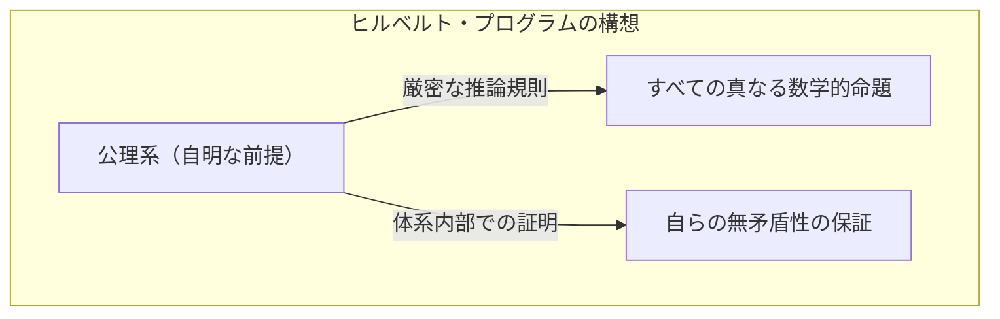
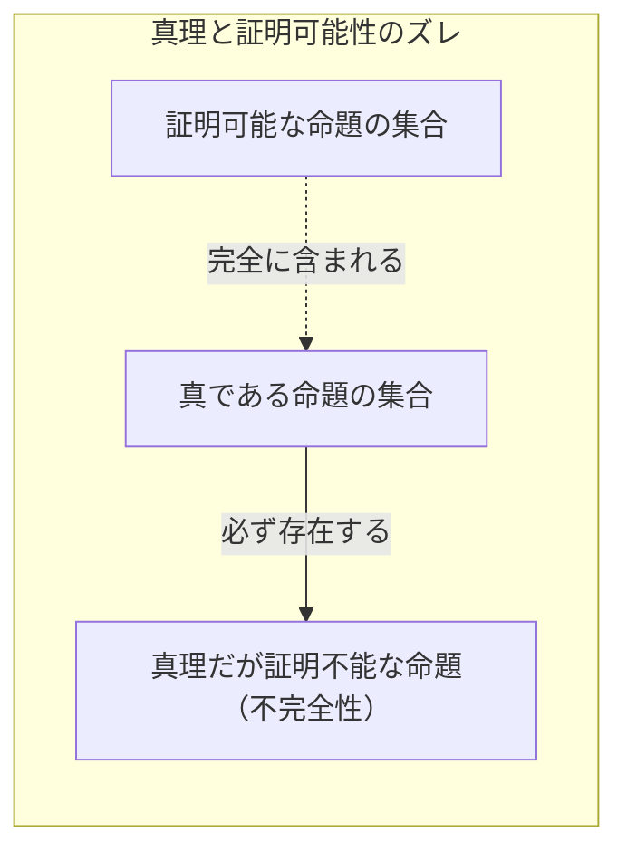
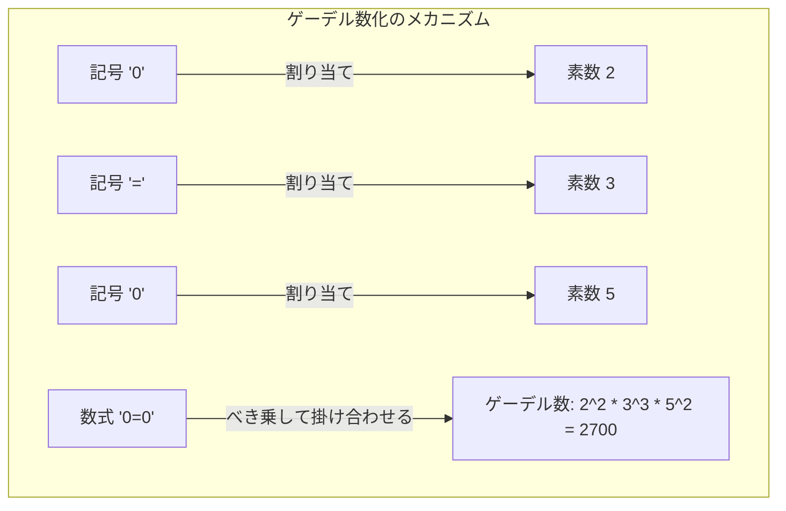
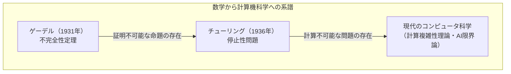

「数学は絶対的に正しい」──誰もが一度はそう考えたことがあるでしょう。しかし、1931年に若き数学者[クルト・ゲーデル](https://kenji.blog/p/godel/)が発表した一つの論文が、その常識を根底から覆しました。それが **[ゲーデルの不完全性定理](https://kenji.blog/p/godels-incompleteness-theorems/)** です。

本記事では、「絶対に証明できない真理」が存在するという、この衝撃的な定理について、その意味や証明の仕組みを具体例や図解を交えて徹底的に解説します。

---

## 1. 舞台背景：[ヒルベルト](https://kenji.blog/p/hilbert/)・プログラムと数学の危機

19世紀末から20世紀初頭にかけて、数学の世界は「集合論のパラドックス（ラッセルのパラドックスなど）」に直面し、その土台が揺らいでいました。この「数学の危機」を救うために立ち上がったのが、当時の数学界の最高権威である[ダフィット・ヒルベルト](https://kenji.blog/p/hilbert/)です。

[ヒルベルト](https://kenji.blog/p/hilbert/)は、数学のすべての推論を完全に記号化し、機械的なルールだけで数学を再構築しようと試みました。彼が提唱した「[ヒルベルト](https://kenji.blog/p/hilbert/)・プログラム」が目指したのは、数学の形式的体系（Formal System）において、以下の3つの性質を証明することでした。

1. **無矛盾性** （[Consistency](https://kenji.blog/p/cap-theorem-distributed-systems-tradeoff/)）：体系内に矛盾（ある命題 $P$ とその否定 $\neg P$ が両方証明されること）が存在しないこと。
2. **完全性** （Completeness）：どんな数学的命題も、その体系内で真か偽のどちらかとして必ず証明できること。
3. **決定可能性** （Decidability）：任意の命題が与えられたとき、それが証明可能かどうかを判定する機械的な手順が存在すること。

[ヒルベルト](https://kenji.blog/p/hilbert/)は、「我々は知らねばならない、我々は知るであろう（Wir müssen wissen. Wir werden wissen.）」という有名な言葉を残し、数学がすべてを解決できる完璧な論理の城になることを信じて疑いませんでした。

## 2. 形式的体系とペアノ算術

[ゲーデル](https://kenji.blog/p/godel/)の定理を理解するために、まずは「形式的体系」と「基本算術」について触れておきましょう。

形式的体系とは、あらかじめ決められた文字列（記号）と、それらを操作するパズル・ルール（推論規則）のセットです。そこには「意味」は必要なく、単なる記号の変形ゲームとして数学を捉えます。

[ゲーデル](https://kenji.blog/p/godel/)の定理の対象となるのは、「自然数の足し算と掛け算」を含む体系です。その代表例が **ペアノ算術** （Peano Arithmetic, PA）と呼ばれる公理系です。ペアノ算術では、「0は自然数である」「ある自然数 $x$ には、その次の数 $S(x)$ が存在する」といった基本的なルール（公理）からスタートします。

たとえば、「 $1 + 1 = 2$ 」という誰もが知る事実も、ペアノ算術という形式的体系の中では、記号の操作によって機械的に導き出される一つの「定理」に過ぎません。

[ヒルベルト](https://kenji.blog/p/hilbert/)は、このような形式的体系を巨大化させていけば、いつかすべての数学的真理を網羅できると考えたのです。

## 3. 第一[不完全性定理](https://kenji.blog/p/godels-incompleteness-theorems/)の衝撃：「真だが証明できない」命題

しかし1931年、当時わずか25歳だった[クルト・ゲーデル](https://kenji.blog/p/godel/)は、ヒルベルトの夢を粉々に打ち砕く論文を発表しました。それが **第一[不完全性定理](https://kenji.blog/p/godels-incompleteness-theorems/)** です。

>  **第一[不完全性定理](https://kenji.blog/p/godels-incompleteness-theorems/)** 
> ペアノ算術を含むような、無矛盾な形式的体系には、真であるにもかかわらず、その体系内では証明できない命題が必ず存在する。

この定理は、「真理」と「証明可能性」が全く別のものであることを示しました。形式的体系という「機械」では、数学の世界のすべての真理を捕まえることは不可能だったのです。

### 嘘つきのパラドックスの数学的翻訳

[ゲーデル](https://kenji.blog/p/godel/)の証明の核心は、「自己言及のパラドックス」を数学の形式的体系の中に作り出したことにあります。

古代ギリシャから知られる「嘘つきのパラドックス」を思い出してください。
「この文は嘘である」
この文が正しいとすると、内容は「嘘」になります。嘘だとすると、内容は「正しい」ことになります。

[ゲーデル](https://kenji.blog/p/godel/)は、これと似た論理を数学に持ち込み、次のような命題 $G$ を数式で構成しました。

 **命題 $G$** ：「この命題 $G$ は、この体系内では証明できない」

もし、形式的体系がこの命題 $G$ を証明できたとしましょう。それは、「証明できない」と主張している命題を証明したことになり、体系は矛盾してしまいます。「無矛盾である」という大前提に立つならば、体系は命題 $G$ を決して証明できません。

さて、ここからが[ゲーデル](https://kenji.blog/p/godel/)の魔法です。命題 $G$ は体系内で証明できませんでした。しかし、命題 $G$ はまさに「証明できない」と主張している文です。主張している通りの状態になっているため、外側の視点から見れば、命題 $G$ は **真** であると結論づけられるのです。

こうして、「真であるにもかかわらず証明できない」命題が誕生しました。

## 4. [ゲーデル](https://kenji.blog/p/godel/)数化：数式を数に変換する天才的アイデア

「この命題は証明できない」という日本語の文を、足し算や掛け算しか持たないペアノ算術の中でどうやって表現するのでしょうか。ここで[ゲーデル](https://kenji.blog/p/godel/)が発明したのが **[ゲーデル](https://kenji.blog/p/godel/)数化** （Gödel numbering）という手法です。

[ゲーデル](https://kenji.blog/p/godel/)は、数式で使われるすべての記号（ $\neg$ 、 $\vee$ 、 $\exists$ 、 $0$ 、 $=$ など）に固有の数字（素数）を割り当てました。そして、素因数分解の一意性（どんな自然数も素数の掛け算の形にただ一通りに分解できるという性質）を利用して、数式の文字列を一つの巨大な自然数に変換しました。

この手法を使えば、「数式 $A$ が数式 $B$ の証明になっている」というような「証明のプロセス」全体すらも、巨大な数の性質（ある数が別の数で割り切れるか、など）という単なる算術の問題にすり替えることができます。

つまり、数学が「自分自身の証明」について語る（自己言及する）ための言語を、自然数の性質の中に隠し込んでしまったのです。これは、現代のコンピュータが画像やプログラムをすべて「0と1の数字の列」にエンコードして処理しているのと同じ発想であり、[ゲーデル](https://kenji.blog/p/godel/)はコンピュータが誕生するはるか前にこの概念に到達していました。

## 5. 第二[不完全性定理](https://kenji.blog/p/godels-incompleteness-theorems/)：自らの正しさを証明できない絶望

第一[不完全性定理](https://kenji.blog/p/godels-incompleteness-theorems/)だけでも数学界を震撼させましたが、ゲーデルの論文にはさらに恐ろしい結論が含まれていました。それが **第二[不完全性定理](https://kenji.blog/p/godels-incompleteness-theorems/)** です。

>  **第二[不完全性定理](https://kenji.blog/p/godels-incompleteness-theorems/)** 
> ペアノ算術を含むような無矛盾な形式的体系は、自分自身の無矛盾性をその体系内で証明することができない。

[ヒルベルト](https://kenji.blog/p/hilbert/)は、数学が無矛盾であることを、数学自身の力を使って証明しようとしていました（ヒルベルト・プログラムの最重要課題）。しかし、第二[不完全性定理](https://kenji.blog/p/godels-incompleteness-theorems/)は「どんなシステムも、自らが狂っていない（矛盾していない）ことを、自らの力で証明することはできない」と宣告したのです。

これを直感的に理解するために、次のように考えてみましょう。
もし、ある人が「私は絶対に嘘をつかない！」と主張したとします。しかし、私たちはその人の言葉だけを根拠にして「この人は嘘つきではない」と証明することはできません。なぜなら、もしその人が嘘つきであれば、「私は絶対に嘘をつかない」という発言自体が嘘かもしれないからです。

数学もこれと同じで、ある公理系が「私は無矛盾である（ $Con(F)$ ）」という数式を自ら導き出せたとしても、もしその体系がすでに矛盾していれば、あらゆる命題（正しいことも間違っていることも）が証明できてしまうため、その「私は無矛盾である」という証明には何の価値もありません。

第二[不完全性定理](https://kenji.blog/p/godels-incompleteness-theorems/)は、数学が「絶対的な確実性」を数学内部で自己証明することは不可能であるという、決定的な限界を示しました。

## 6. [不完全性定理](https://kenji.blog/p/godels-incompleteness-theorems/)に関するよくある誤解

[ゲーデルの不完全性定理](https://kenji.blog/p/godels-incompleteness-theorems/)は、そのドラマチックな名称から、しばしば哲学や思想、オカルト的な文脈で誤用されることがあります。ここでは代表的な誤解を解いておきましょう。

-  **誤解1：「数学は破綻してしまった」** 
  -  **事実** ：[不完全性定理](https://kenji.blog/p/godels-incompleteness-theorems/)は数学の破綻を意味しません。むしろ「特定の固定された公理系だけでは、すべての真理を捉えきれない」という形式論理の性質を明らかにしたものです。数学者たちは、必要に応じて新しい公理（例えば「[選択公理](https://kenji.blog/p/axiom-of-choice-and-zorns-lemma/)」や「巨大基数公理」など）を追加することで、より強力な体系を作り出し、研究を発展させ続けています。
-  **誤解2：「人間の理性には限界がある」** 
  -  **事実** ：定理が限界を示しているのは、「あらかじめ決められた機械的なルールに従うシステム（形式的体系）」についてです。第一[不完全性定理](https://kenji.blog/p/godels-incompleteness-theorems/)において、私たちは外側の視点から命題 $G$ が「真である」と見抜くことができました。これは、人間の理性が機械的な形式的体系を超えた「意味（セマンティクス）」を理解する能力を持っている証拠だ、と捉える学者（ロジャー・ペンローズなど）もいます。
-  **誤解3：「どんなことでも証明できないことがある」** 
  -  **事実** ：[不完全性定理](https://kenji.blog/p/godels-incompleteness-theorems/)が適用されるのは「自然数の足し算と掛け算（ペアノ算術）」を含む十分に複雑な体系だけです。例えば、「[ユークリッド](https://kenji.blog/p/euclid/)幾何学」や「実数の一次理論」などは完全であり、真である命題はすべて証明可能です。対象が十分に複雑な構造（自己言及を可能にする構造）を持ったときにのみ、不完全性が生じます。

## 7. [チューリング](https://kenji.blog/p/turing/)マシンへのバトン：計算機科学の幕開け

[ゲーデル](https://kenji.blog/p/godel/)の定理がもたらした影響は、数学の枠にとどまりませんでした。1936年、イギリスの数学者アラン・チューリングは、ゲーデルの「形式的体系」の概念を物理的な計算プロセスに置き換え、「[チューリング](https://kenji.blog/p/turing/)マシン」という仮想の計算機モデルを考案しました。

[チューリング](https://kenji.blog/p/turing/)は、ゲーデルの不完全性定理を計算機の世界に応用し、「どんなコンピュータのプログラムにも、永遠に計算が終わらないかどうかをあらかじめ判定する万能なアルゴリズムは存在しない」ことを証明しました。これが有名な **停止性問題** （[Halting Problem](https://kenji.blog/p/turing-machine-computability/)）です。

「証明できない真理がある」という数学の限界は、「計算できない問題がある」というコンピュータの限界へと見事に形を変え、現代のプログラミングやアルゴリズム理論の基礎として生き続けています。

## 8. 結論：「知る」ことの果てしない旅

[ダフィット・ヒルベルト](https://kenji.blog/p/hilbert/)が夢見た「すべてを自動で証明できる完璧な数学の機械」は、[ゲーデルの不完全性定理](https://kenji.blog/p/godels-incompleteness-theorems/)によって幻に終わりました。しかし、それは決して数学の敗北を意味するものではありません。

もし数学が完全に機械化可能であれば、数学者の仕事は単なる作業になり、いつかは終わりを迎えていたでしょう。しかし、[ゲーデル](https://kenji.blog/p/godel/)が示した「証明できないが真である命題」の存在は、数学という宇宙が私たちが想像するよりもはるかに豊かで、汲めども尽きぬ奥深さを持っていることを証明しました。

「絶対に証明できない真理」の存在を、最も厳密な論理である数学自身の手によって **証明** してしまった[クルト・ゲーデル](https://kenji.blog/p/godel/)。彼の[不完全性定理](https://kenji.blog/p/godels-incompleteness-theorems/)は、人間の「知る」ことへの探求が永遠に続く終わりのない旅であることを、私たちに教えてくれているのです。

