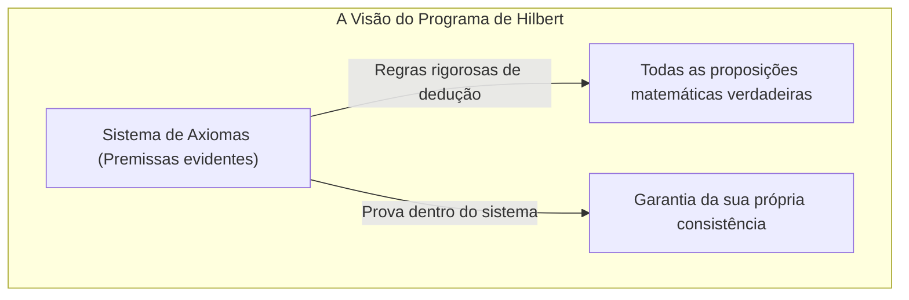
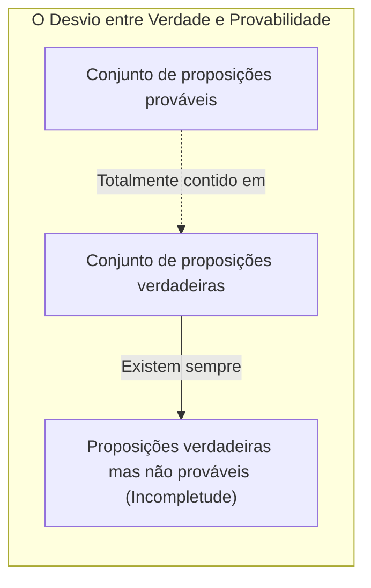
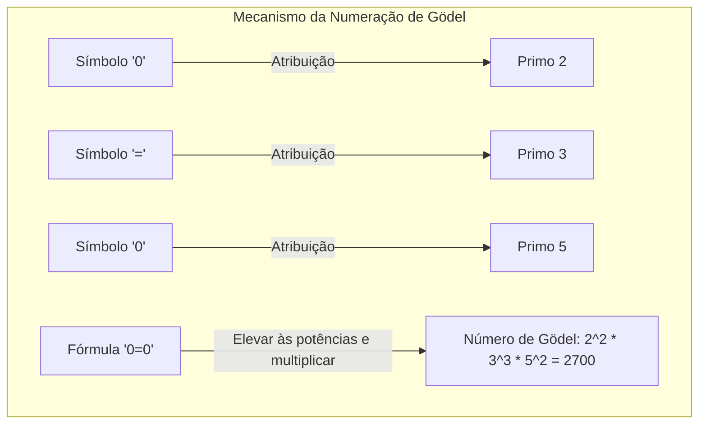
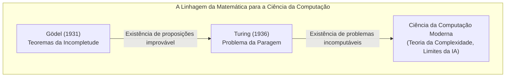

"A matemática é absolutamente correta" ── Certamente todos já pensaram nisto pelo menos uma vez. No entanto, um artigo publicado em 1931 pelo jovem matemático [Kurt Gödel](https://kenji.blog/pt/p/godel/) abalou esse senso comum até aos seus alicerces. Trata-se dos **Teoremas da Incompletude de Gödel**.

Neste artigo, explicaremos em profundidade este teorema chocante, que afirma que existe uma "verdade que nunca pode ser provada", abordando o seu significado e a mecânica da prova com o uso de exemplos concretos e diagramas.

---

## 1. O Pano de Fundo: O Programa de [Hilbert](https://kenji.blog/pt/p/hilbert/) e a Crise da Matemática

Entre o final do século XIX e o início do século XX, o mundo da matemática enfrentou "paradoxos da teoria dos conjuntos (como o Paradoxo de Russell)", abalando os seus próprios fundamentos. Foi [David Hilbert](https://kenji.blog/pt/p/hilbert/), a maior autoridade da matemática na altura, quem se levantou para salvar esta "crise da matemática".

[Hilbert](https://kenji.blog/pt/p/hilbert/) tentou simbolizar completamente todos os raciocínios matemáticos e reconstruir a matemática baseando-se apenas em regras mecânicas. O "Programa de [Hilbert](https://kenji.blog/pt/p/hilbert/)" que ele propôs tinha como objetivo provar três propriedades dentro do Sistema Formal (Formal System) da matemática:

1. **Consistência** ([Consistency](https://kenji.blog/pt/p/cap-theorem-distributed-systems-tradeoff/)): Não deve existir nenhuma contradição dentro do sistema (ou seja, uma proposição $P$ e a sua negação $\neg P$ não podem ser ambas provadas simultaneamente).
2. **Completude** (Completeness): Qualquer proposição matemática pode ser invariavelmente provada dentro do sistema, quer como verdadeira, quer como falsa.
3. **Decidibilidade** (Decidability): Dada uma proposição qualquer, existe um procedimento mecânico para determinar se ela é demonstrável ou não.

[Hilbert](https://kenji.blog/pt/p/hilbert/) proferiu a famosa frase: "Temos de saber, nós saberemos (Wir müssen wissen. Wir werden wissen.)", e não tinha a menor dúvida de que a matemática se tornaria num castelo lógico perfeito capaz de resolver tudo.

## 2. Sistema Formal e a Aritmética de Peano

Para compreender o teorema de Gödel, devemos primeiro tocar no "sistema formal" e na "aritmética básica".

Um sistema formal é um conjunto de sequências de caracteres (símbolos) predefinidas e um conjunto de regras (regras de inferência) semelhantes a um puzzle para manipulá-los. Aqui, o "significado" não é necessário; a matemática é vista apenas como um jogo de transformação de símbolos.

O alvo do teorema de Gödel são os sistemas que incluem "adição e multiplicação de números naturais". O exemplo mais representativo é o sistema de axiomas conhecido como **Aritmética de Peano** (Peano Arithmetic, PA). Na Aritmética de Peano, começamos com regras básicas (axiomas) como "0 é um número natural" ou "Para qualquer número natural $x$, existe o seu sucessor $S(x)$".

Por exemplo, até mesmo o facto que todos conhecem, "$1 + 1 = 2$", nada mais é do que um "teorema" mecanicamente derivado da manipulação de símbolos dentro do sistema formal que é a Aritmética de Peano.

[Hilbert](https://kenji.blog/pt/p/hilbert/) acreditava que, ao expandir esses sistemas formais, um dia se conseguiria englobar todas as verdades matemáticas.

## 3. O Choque do Primeiro Teorema da Incompletude: Proposições "Verdadeiras, mas Improváveis"

Porém, em 1931, [Kurt Gödel](https://kenji.blog/pt/p/godel/), então com apenas 25 anos, publicou um artigo que esmagou o sonho de [Hilbert](https://kenji.blog/pt/p/hilbert/) em pedaços. Foi o **Primeiro Teorema da Incompletude**.

> **Primeiro Teorema da Incompletude**
> Em qualquer sistema formal consistente que inclua a Aritmética de Peano, existe sempre pelo menos uma proposição que é verdadeira, mas que não pode ser provada dentro desse sistema.

Este teorema demonstrou que a "verdade" e a "provabilidade" são coisas completamente diferentes. Foi provado ser impossível capturar todas as verdades do mundo matemático utilizando a "máquina" que é o sistema formal.

### A Tradução Matemática do Paradoxo do Mentiroso

O cerne da prova de Gödel reside na criação do "paradoxo da autorreferência" no seio do sistema formal da matemática.

Lembre-se do "Paradoxo do Mentiroso", conhecido desde a Grécia antiga.
"Esta frase é mentira."
Se esta frase for verdadeira, o seu conteúdo é "mentira". Se for mentira, então o seu conteúdo tem de ser "verdadeiro".

Gödel trouxe uma lógica semelhante à matemática, e construiu através de fórmulas a seguinte proposição $G$:

 **Proposição $G$**: "Esta proposição $G$ não pode ser provada dentro deste sistema."

Suponhamos que o sistema formal consiga provar a proposição $G$. Isso significaria que se conseguiu provar uma proposição que afirma "não pode ser provada", resultando numa contradição no sistema. Se partirmos da premissa fundamental de que o sistema "é consistente (sem contradições)", o sistema nunca poderá provar a proposição $G$.

E é aqui que reside a magia de Gödel. A proposição $G$ não pôde ser provada dentro do sistema. No entanto, a proposição $G$ é exatamente a frase que afirma "não pode ser provada". Como o estado das coisas é exatamente o que a proposição reivindica, a partir de uma perspetiva exterior, podemos concluir que a proposição $G$ é **verdadeira**.

Assim nasceu uma proposição que "apesar de ser verdadeira, não pode ser provada".

## 4. Numeração de Gödel (Gödel numbering): A ideia genial de converter fórmulas matemáticas em números

Como se pode expressar a frase "Esta proposição não pode ser provada" dentro da Aritmética de Peano, que só possui adição e multiplicação? Foi aqui que Gödel inventou o método da **Numeração de Gödel** (Gödel numbering).

Gödel atribuiu um número único (um número primo) a cada símbolo usado nas fórmulas matemáticas ( $\neg$ , $\vee$ , $\exists$ , $0$ , $=$ , etc.). Em seguida, utilizando a unicidade da fatorização em números primos (a propriedade de que qualquer número natural pode ser decomposto numa multiplicação de números primos de uma e única forma), converteu a sequência de caracteres de uma fórmula num único número gigantesco.

Através deste método, pode-se converter todo o "processo de prova" - como em "a fórmula $A$ é uma prova da fórmula $B$" - num mero problema aritmético sobre as propriedades de números gigantes (por exemplo, se um certo número é divisível por outro número).

Ou seja, ele escondeu dentro das propriedades dos números naturais a linguagem para que a matemática pudesse falar sobre a "sua própria prova" (autorreferência). Trata-se da mesma ideia pela qual os computadores modernos codificam e processam imagens e programas como "sequências de 0s e 1s"; Gödel chegou a este conceito muito antes de o computador ter nascido.

## 5. O Segundo Teorema da Incompletude: O desespero de não se poder provar a própria correção

O Primeiro Teorema da Incompletude, por si só, abalou a comunidade matemática, mas o artigo de Gödel continha uma conclusão ainda mais assustadora. Esse é o **Segundo Teorema da Incompletude**.

> **Segundo Teorema da Incompletude**
> Um sistema formal consistente que inclua a Aritmética de Peano não pode provar a sua própria consistência dentro de si mesmo.

[Hilbert](https://kenji.blog/pt/p/hilbert/) tentou provar que a matemática era consistente usando o próprio poder da matemática (o desafio mais importante do Programa de [Hilbert](https://kenji.blog/pt/p/hilbert/)). Contudo, o Segundo Teorema da Incompletude declarou que "nenhum sistema pode provar, pelo seu próprio poder, que não é falho (que não tem contradições)".

Para compreender isto intuitivamente, pensemos da seguinte forma:
Se uma pessoa afirmar: "Eu nunca minto!". No entanto, não podemos basear-nos apenas nas palavras dessa pessoa para provar que "esta pessoa não é mentirosa". Pois, se essa pessoa for de facto mentirosa, a própria afirmação "Eu nunca minto!" pode ser uma mentira.

A matemática é semelhante. Mesmo que um sistema axiomático pudesse deduzir por si próprio a fórmula matemática "Eu sou consistente ( $Con(F)$ )", se esse sistema já fosse inconsistente, seria capaz de provar qualquer proposição (tanto verdades como falsidades). Logo, essa prova de "Eu sou consistente" não teria valor algum.

O Segundo Teorema da Incompletude revelou a limitação fundamental de que é impossível a matemática auto-comprovar internamente a sua "certeza absoluta".

## 6. Mal-entendidos frequentes sobre os Teoremas da Incompletude

Devido ao seu nome dramático, os Teoremas da Incompletude de Gödel são frequentemente mal utilizados em contextos filosóficos, ideológicos ou ocultistas. Vamos esclarecer alguns dos mal-entendidos mais comuns.

- **Mal-entendido 1: "A matemática ruiu"**
  - **Facto**: O teorema da incompletude não significa a ruína da matemática. Pelo contrário, apenas clarificou a propriedade da lógica formal de que "um sistema de axiomas fixo e específico não é suficiente para abranger todas as verdades". Os matemáticos continuam a expandir as investigações ao criar sistemas mais poderosos, adicionando novos axiomas consoante a necessidade (como o "Axioma da Escolha" ou "Axiomas de Cardinais Grandes").
- **Mal-entendido 2: "A razão humana tem limites"**
  - **Facto**: O limite apontado pelo teorema aplica-se a "sistemas que obedecem a regras mecânicas pré-determinadas (sistemas formais)". No Primeiro Teorema da Incompletude, nós (do ponto de vista externo) conseguimos discernir que a proposição $G$ é "verdadeira". Alguns académicos (como Roger Penrose) consideram isso como a prova de que a razão humana tem a capacidade de compreender "significados (semântica)" além dos sistemas formais mecânicos.
- **Mal-entendido 3: "Existem coisas que não podem ser provadas em qualquer contexto"**
  - **Facto**: O teorema da incompletude aplica-se apenas a sistemas suficientemente complexos que incluam "adição e multiplicação de números naturais (Aritmética de Peano)". Por exemplo, a "Geometria [Euclid](https://kenji.blog/pt/p/euclid/)iana" ou a "Teoria de Primeira Ordem dos Números Reais" são completas; todas as proposições verdadeiras são prováveis. A incompletude surge apenas quando o alvo tem uma estrutura suficientemente complexa (capaz de autorreferência).

## 7. Passagem de testemunho à Máquina de Turing: O alvorecer da Ciência da Computação

O impacto do teorema de Gödel não se limitou à matemática. Em 1936, o matemático britânico [Alan Turing](https://kenji.blog/pt/p/turing/) substituiu o conceito do "sistema formal" de Gödel por processos de cálculo físico e idealizou o modelo de computador virtual chamado "Máquina de Turing".

Turing aplicou o teorema da incompletude de Gödel ao mundo dos computadores e provou que "não existe nenhum algoritmo universal que possa prever de antemão se um programa de computador alguma vez terminará o seu cálculo (ou se ficará num loop eterno)". Este é o famoso **Problema da Paragem** ([Halting Problem](https://kenji.blog/pt/p/turing-machine-computability/)).

A limitação matemática de que "há verdades que não podem ser provadas" transformou-se brilhantemente na limitação computacional de que "há problemas que não podem ser calculados", continuando viva hoje como a base da programação moderna e teoria de algoritmos.

## 8. Conclusão: A jornada infindável do "saber"

A "máquina matemática perfeita, capaz de provar tudo automaticamente", com que [David Hilbert](https://kenji.blog/pt/p/hilbert/) sonhara, terminou numa ilusão pelos Teoremas da Incompletude de Gödel. Mas isso nunca significou a derrota da matemática.

Se a matemática fosse totalmente passível de ser mecanizada, o trabalho dos matemáticos teria-se tornado uma mera rotina e teria acabado por terminar. No entanto, a existência de proposições "verdadeiras mas improvável", demonstrada por Gödel, provou que o universo da matemática é muito mais rico do que poderíamos imaginar e que possui uma profundidade inesgotável.

[Kurt Gödel](https://kenji.blog/pt/p/godel/), através da matemática que é a lógica mais rigorosa, acabou por **provar** a existência da "verdade que nunca pode ser provada". O seu teorema da incompletude ensina-nos que a jornada humana em busca do "saber" é uma viagem sem fim que durará para a eternidade.
