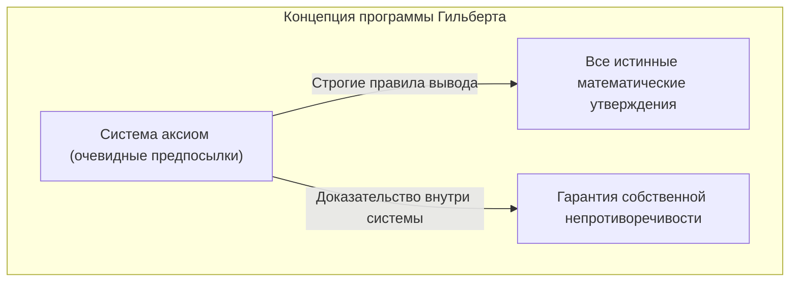
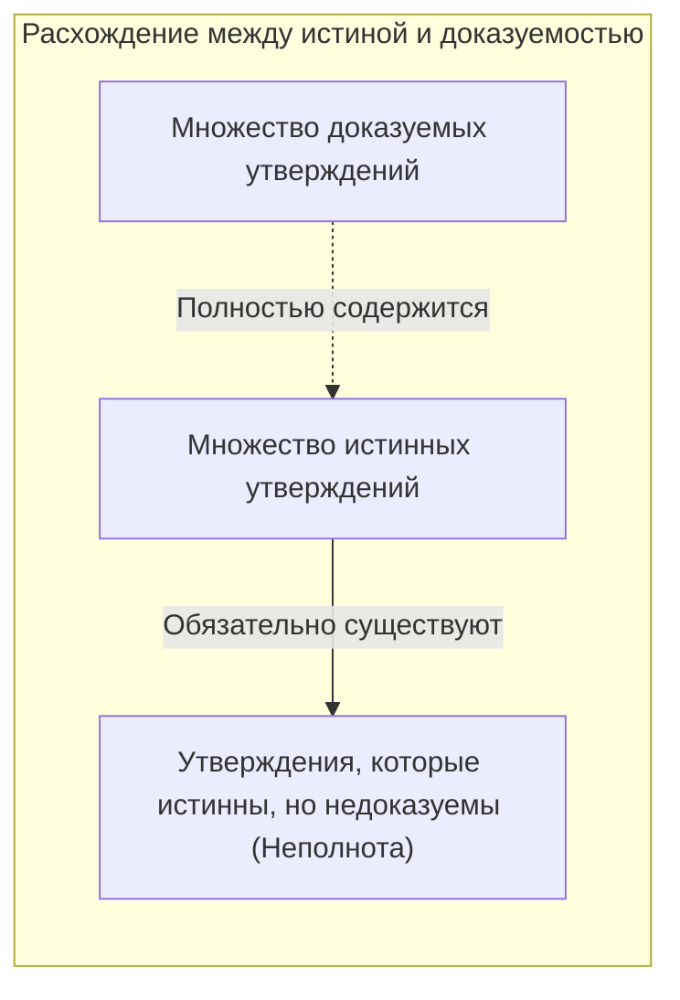
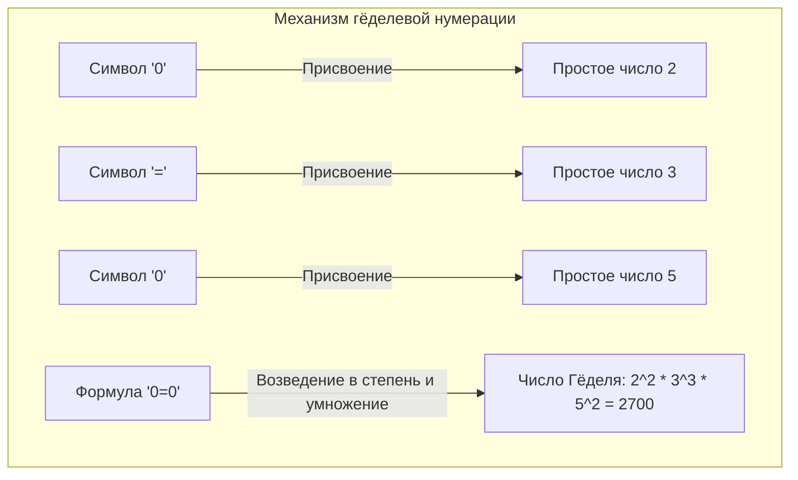
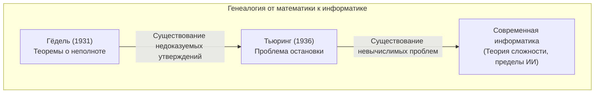

«Математика абсолютно правильна» — каждый хотя бы раз задумывался об этом. Однако одна статья, опубликованная молодым математиком Куртом Гёделем в 1931 году, полностью перевернула этот здравый смысл. Это и есть **[Теоремы Гёделя о неполноте](https://kenji.blog/ru/p/godels-incompleteness-theorems/)**.

В этой статье мы подробно объясним эту шокирующую теорему о том, что существует «истина, которую абсолютно невозможно доказать», а также ее значение и механизм доказательства с использованием конкретных примеров и диаграмм.

---

## 1. Исторический фон: Программа Гильберта и кризис математики

С конца 19-го по начало 20-го века математический мир столкнулся с «парадоксами теории множеств (такими как парадокс Рассела)», и его основы пошатнулись. [Давид Гильберт](https://kenji.blog/ru/p/hilbert/), высший авторитет в математическом мире того времени, выступил вперед, чтобы спасти математику от этого «кризиса».

Гильберт попытался полностью символизировать все математические рассуждения и перестроить математику, используя только механические правила. «Программа Гильберта», которую он предложил, была направлена на доказательство следующих трех свойств в формальной системе математики (Formal System):

1. **Непротиворечивость (Consistency)**: Отсутствие в системе противоречий (когда доказывается как некое утверждение $P$, так и его отрицание $\neg P$).
2. **Полнота (Completeness)**: Любое математическое утверждение в этой системе обязательно может быть доказано как истинное или ложное.
3. **Разрешимость (Decidability)**: Для любого данного утверждения существует механическая процедура определения того, доказуемо оно или нет.

Гильберт оставил знаменитую фразу: «Мы должны знать. Мы будем знать (Wir müssen wissen. Wir werden wissen.)», и нисколько не сомневался, что математика станет замком совершенной логики, способной решить всё.

## 2. Формальные системы и арифметика Пеано

Чтобы понять теорему Гёделя, давайте сначала коснемся «формальных систем» и «базовой арифметики».

Формальная система — это набор заранее определенных строк символов и правил-головоломок (правил вывода) для манипулирования ими. В ней нет необходимости в «смысле», она рассматривает математику просто как игру по преобразованию символов.

Объектом теоремы Гёделя является система, включающая «сложение и умножение натуральных чисел». Типичным примером является система аксиом, называемая **арифметикой Пеано (Peano Arithmetic, PA)**. Арифметика Пеано начинается с базовых правил (аксиом), таких как «0 — это натуральное число» и «Для любого натурального числа $x$ существует следующее за ним число $S(x)$».

Например, даже такой общеизвестный факт, как «$1 + 1 = 2$», в формальной системе арифметики Пеано является всего лишь «теоремой», механически выведенной путем манипуляции символами.

Гильберт полагал, что если мы будем расширять такие формальные системы, то когда-нибудь сможем охватить все математические истины.

## 3. Шок Первой теоремы о неполноте: Утверждения, которые «истинны, но недоказуемы»

Однако в 1931 году [Курт Гёдель](https://kenji.blog/ru/p/godel/), которому тогда было всего 25 лет, опубликовал работу, разбившую мечту Гильберта вдребезги. Это **Первая теорема о неполноте**.

> **Первая теорема о неполноте**
> В любой непротиворечивой формальной системе, содержащей арифметику Пеано, обязательно существует утверждение, которое истинно, но не может быть доказано в рамках этой системы.

Эта теорема показала, что «истина» и «доказуемость» — совершенно разные вещи. «Машина» под названием формальная система не могла уловить все истины математического мира.

### Математический перевод парадокса лжеца

Суть доказательства Гёделя заключается в создании «парадокса самореференции» внутри формальной математической системы.

Вспомните известный со времен Древней Греции «парадокс лжеца».
«Это предложение — ложь».
Если это предложение истинно, то его содержание означает, что это «ложь». Если оно ложно, то его содержание «истинно».

Гёдель привнес подобную логику в математику и математически сконструировал следующее утверждение $G$.

**Утверждение $G$**: «Это утверждение $G$ не может быть доказано в рамках данной системы»

Если бы формальная система могла доказать это утверждение $G$, это означало бы, что она доказала утверждение, которое утверждает, что оно «не может быть доказано», и система впала бы в противоречие. Если мы исходим из главной предпосылки, что система «непротиворечива», она никогда не сможет доказать утверждение $G$.

А теперь начинается магия Гёделя. Утверждение $G$ не могло быть доказано в системе. Однако утверждение $G$ — это именно то предложение, которое утверждает, что оно «не может быть доказано». Поскольку состояние таково, как оно утверждает, с внешней точки зрения мы можем сделать вывод, что утверждение $G$ является **истинным**.

Таким образом родилось утверждение, которое «истинно, но не может быть доказано».

## 4. Гёделева нумерация: Гениальная идея преобразования формул в числа

Как можно выразить фразу на естественном языке «Это утверждение не может быть доказано» в арифметике Пеано, которая имеет только сложение и умножение? Здесь Гёдель изобрел метод, называемый **гёделевой нумерацией (Gödel numbering)**.

Гёдель присвоил уникальное число (простое число) каждому символу, используемому в математических формулах ( $\neg$ , $\vee$ , $\exists$ , $0$ , $=$ и т.д.). Затем, используя единственность разложения на простые множители (свойство, согласно которому любое натуральное число может быть разложено на простые множители только одним способом), он преобразовал строки символов математических формул в одно гигантское натуральное число.

Используя этот метод, даже весь «процесс доказательства», такой как «формула $A$ является доказательством формулы $B$», можно свести к простой арифметической задаче о свойствах гигантских чисел (например, делится ли одно число на другое).

Другими словами, он спрятал в свойствах натуральных чисел язык, на котором математика может говорить о «своем собственном доказательстве» (ссылаться на саму себя). Это та же самая идея, по которой современные компьютеры кодируют и обрабатывают все изображения и программы как «строки цифр 0 и 1», и Гёдель пришел к этой концепции задолго до появления компьютеров.

## 5. Вторая теорема о неполноте: Отчаяние от невозможности доказать собственную правильность

Хотя даже Первая теорема о неполноте потрясла математический мир, работа Гёделя содержала еще более ужасающий вывод. Это **Вторая теорема о неполноте**.

> **Вторая теорема о неполноте**
> Любая непротиворечивая формальная система, содержащая арифметику Пеано, не может доказать собственную непротиворечивость в рамках самой этой системы.

Гильберт пытался доказать, что математика непротиворечива, используя силу самой математики (самая важная задача программы Гильберта). Однако Вторая теорема о неполноте провозгласила: «Никакая система не может доказать собственными силами, что она не сошла с ума (непротиворечива)».

Чтобы понять это интуитивно, давайте подумаем следующим образом.
Предположим, кто-то утверждает: «Я никогда не лгу!». Но мы не можем доказать, что «этот человек не лжец», основываясь только на его словах. Потому что, если он лжец, само заявление «Я никогда не лгу» тоже может быть ложью.

То же самое и с математикой: даже если некоторая система аксиом сможет вывести формулу «Я непротиворечива ($Con(F)$)», если эта система уже противоречива, в ней можно будет доказать любое утверждение (как правильное, так и неправильное), поэтому это доказательство «Я непротиворечива» не будет иметь никакой ценности.

Вторая теорема о неполноте продемонстрировала решающий предел того, что математика не может самодоказать «абсолютную уверенность» внутри самой себя.

## 6. Распространенные заблуждения о теоремах о неполноте

[Теоремы Гёделя о неполноте](https://kenji.blog/ru/p/godels-incompleteness-theorems/) из-за своего драматичного названия часто используются ошибочно в контексте философии, идеологии или оккультизма. Давайте развеем типичные заблуждения здесь.

- **Заблуждение 1: «Математика рухнула»**
  - **Факт**: Теоремы о неполноте не означают крах математики. Скорее, они прояснили свойство формальной логики, заключающееся в том, что «нельзя уловить все истины только с помощью конкретной фиксированной системы аксиом». Математики продолжают развивать исследования, создавая более мощные системы путем добавления новых аксиом при необходимости (например, «Аксиома выбора» или «Аксиомы больших кардиналов»).
- **Заблуждение 2: «Человеческий разум имеет пределы»**
  - **Факт**: Теорема показывает пределы «систем, которые следуют заранее определенным механическим правилам (формальных систем)». В Первой теореме о неполноте мы смогли увидеть с внешней точки зрения, что утверждение $G$ «истинно». Некоторые ученые (например, Роджер Пенроуз) считают это доказательством того, что человеческий разум обладает способностью понимать «смысл (семантику)», выходящую за рамки механических формальных систем.
- **Заблуждение 3: «Существуют вещи, которые вообще невозможно доказать»**
  - **Факт**: Теоремы о неполноте применимы только к достаточно сложным системам, включающим «сложение и умножение натуральных чисел (арифметика Пеано)». Например, «Эвклидова геометрия» или «Теория первого порядка действительных чисел» полны, и все истинные утверждения в них доказуемы. Неполнота возникает только тогда, когда объект имеет достаточно сложную структуру (структуру, допускающую самореференцию).

## 7. Эстафета к Машинам Тьюринга: Рассвет информатики

Влияние теорем Гёделя не ограничилось рамками математики. В 1936 году британский математик [Алан Тьюринг](https://kenji.blog/ru/p/turing/) перевел концепцию «формальной системы» Гёделя в физический вычислительный процесс и придумал виртуальную вычислительную модель, названную «Машиной Тьюринга».

Тьюринг применил теорему Гёделя о неполноте к миру компьютеров и доказал, что «не существует универсального алгоритма, который бы заранее определял, завершатся ли вычисления любой компьютерной программы или будут продолжаться вечно». Это знаменитая **проблема остановки (Halting Problem)**.

Пределы математики в виде «существования недоказуемых истин» блестяще трансформировались в пределы компьютеров в виде «существования невычислимых проблем» и продолжают жить как основа современного программирования и теории алгоритмов.

## 8. Заключение: Бесконечное путешествие «познания»

«Идеальная математическая машина, способная автоматически доказать все», о которой мечтал [Давид Гильберт](https://kenji.blog/ru/p/hilbert/), оказалась иллюзией из-за теорем Гёделя о неполноте. Однако это отнюдь не означает поражения математики.

Если бы математика была полностью механизируемой, работа математика превратилась бы в простую рутину и когда-нибудь закончилась бы. Однако существование «недоказуемых, но истинных утверждений», показанное Гёделем, доказало, что вселенная математики намного богаче и имеет неисчерпаемую глубину, чем мы можем себе представить.

[Курт Гёдель](https://kenji.blog/ru/p/godel/) **доказал** существование «истин, которые абсолютно невозможно доказать», с помощью самой строгой логики — самой математики. Его теоремы о неполноте учат нас, что человеческий поиск «познания» — это бесконечное путешествие, которое никогда не закончится.
